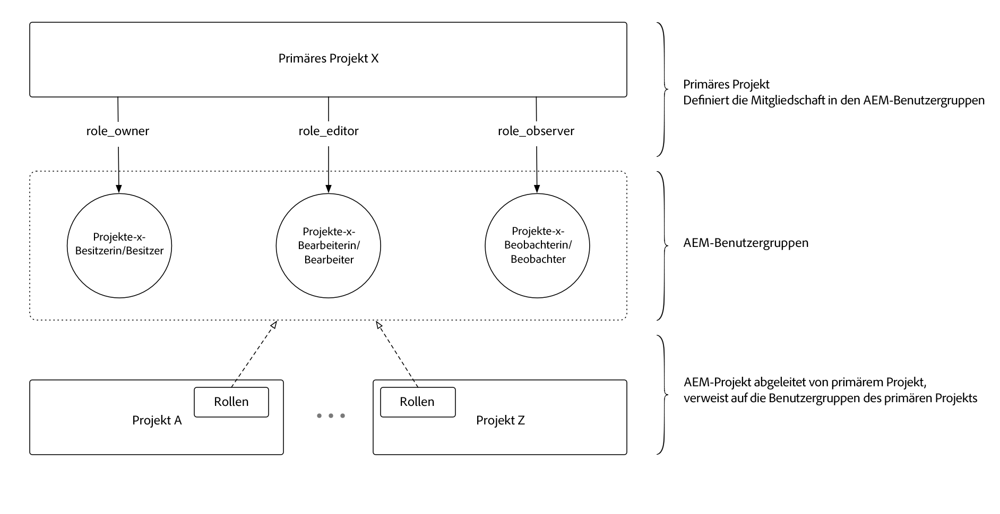

# Verwenden von Projektplänen

Projektmanager vereinfachen die Benutzer- und Teamverwaltung mit [!DNL AEM Projects] erheblich.

>[!VIDEO](https://video.tv.adobe.com/v/17740/?quality=12&learn=on)

Administratoren können jetzt ein **[!DNL Master Project]** erstellen und Benutzern im Rahmen eines Projektteams Rollen/Berechtigungen zuweisen. Projekte können aus einem Übergeordnet Project erstellt werden und erben automatisch die Team-Mitgliedschaft. Dies Angebot mehrere Vorteile:

* Vorhandene Teams über mehrere Projekte hinweg wiederverwenden
* Beschleunigt die Projekterstellung, da Teams nicht von Hand neu erstellt werden müssen
* Verwalten der Teammitgliedschaft von einem zentralen Standort aus und alle Aktualisierungen von Teams werden automatisch von Projekten übernommen.
* vermeidet die Erstellung von Duplikat-ACLs, die Leistungsprobleme verursachen können.

[!DNL Master Projects] können im Ordner   Mastersordner unter  [!UICONTROL AEM Projekte] erstellt werden. Nachdem ein Übergeordnet erstelltes Projekt erstellt wurde, wird es als Option neben den verfügbaren Vorlagen im Assistenten angezeigt, wenn neue Projekte erstellt werden.

[!DNL Project Masters] URL (lokale AEM-Autoreninstanz):  [http://localhost:4502/projects.html/content/projects/masters](http://localhost:4502/projects.html/content/projects/masters)

## Löschen [!DNL Project Masters]

Das Löschen eines Übergeordnet erstellten Projekts führt zu unbrauchbaren abgeleiteten Projekten.

Bevor Sie ein Übergeordnet Projekt löschen, stellen Sie sicher, dass alle abgeleiteten Projekte abgeschlossen und aus AEM entfernt wurden. Speichern Sie alle erforderlichen Projektdaten, bevor Sie die abgeleiteten Projekte entfernen. Sobald alle abgeleiteten Projekte aus AEM entfernt wurden, kann das Übergeordnet erstellte Projekt problemlos gelöscht werden.

## [!DNL Project Masters] als inaktiv markieren

Indem Sie den Projektstatus Übergeordnet in die Projekteigenschaften inaktiv ändern, werden die inaktiven Übergeordnet-Projekte aus der Liste Übergeordnet Projekte ausgeblendet.

Um inaktive Übergeordnet-Projekte anzuzeigen, schalten Sie die Filterschaltfläche &quot;Aktiv anzeigen&quot;in der oberen Leiste (neben dem Umschalter &quot;Liste&quot;) ein. Um das inaktive Projekt erneut zu aktivieren, wählen Sie einfach das inaktive Übergeordnet-Projekt aus, bearbeiten Sie die Projekteigenschaften und stellen Sie es erneut auf aktiv ein.

## Verstehen Sie [!DNL Project Masters]

[!DNL Project Masters] arbeiten, indem Sie eine Reihe von AEM Benutzergruppen (Eigentümer, Editor und Beobachter) definieren und abgeleiteten Projekten erlauben, auf diese zentral definierten Benutzergruppen zu verweisen und sie wiederzuverwenden.

Dadurch wird die Gesamtzahl der in AEM erforderlichen Benutzergruppen verringert. Vor [!DNL Project Masters] wurden in jedem Projekt 3 Benutzergruppen mit den dazugehörigen ACEs zur Erzwingung der Berechtigung erstellt, sodass 100 Projekte 300 Benutzergruppen ergaben. Die Projektmanager ermöglichen es einer beliebigen Anzahl von Projekten, dieselben drei Gruppen wiederzuverwenden, vorausgesetzt, die geteilte Mitgliedschaft richtet sich im gesamten Projekt nach den Geschäftsanforderungen.
