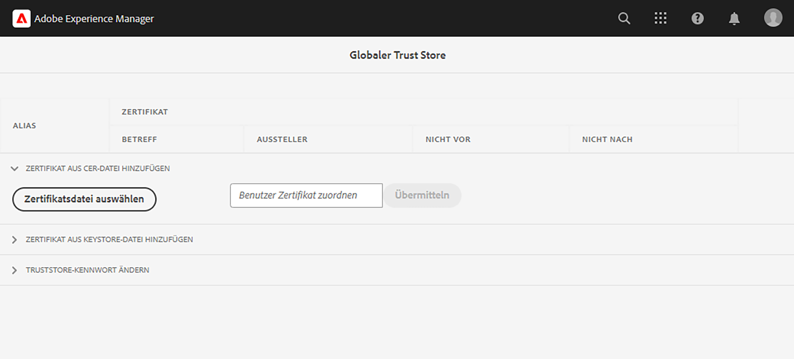

# Interne APIs mit privaten Zertifikaten aufrufen

Erfahren Sie, wie Sie mit privaten oder selbstsignierten Zertifikaten HTTPS-Aufrufe von AEM zu Web-APIs durchführen.

>[!VIDEO](https://video.tv.adobe.com/v/3424853?quality=12&learn=on)

Standardmäßig schlägt die Verbindung bei dem Versuch, eine HTTPS-Verbindung zu einer Web-API herzustellen, die ein selbstsigniertes Zertifikat verwendet, mit dem Fehler fehl:

```
PKIX path building failed: sun.security.provider.certpath.SunCertPathBuilderException: unable to find valid certification path to requested target
```

Dieses Problem tritt normalerweise auf, wenn die **Das SSL-Zertifikat der API wird nicht von einer anerkannten Zertifizierungsstelle ausgestellt** und die Java™-Anwendung können kein SSL-/TLS-Zertifikat überprüfen.

Im Folgenden erfahren Sie, wie Sie APIs mit privaten oder selbstsignierten Zertifikaten mithilfe von [Apache HttpClient](https://hc.apache.org/httpcomponents-client-4.5.x/index.html) und **AEM globaler TrustStore**.


## Prototypischer API-Aufruf-Code mithilfe von HttpClient

Der folgende Code stellt eine HTTPS-Verbindung zu einer Web-API her:

```java
...
String API_ENDPOINT = "https://example.com";

// Create HttpClientBuilder
HttpClientBuilder httpClientBuilder = HttpClientBuilder.create();

// Create HttpClient
CloseableHttpClient httpClient = httpClientBuilder.build();

// Invoke API
CloseableHttpResponse closeableHttpResponse = httpClient.execute(new HttpGet(API_ENDPOINT));

// Code that reads response code and body from the 'closeableHttpResponse' object
...
```

Der Code verwendet die [Apache HttpComponent](https://hc.apache.org/)s [HttpClient](https://hc.apache.org/httpcomponents-client-4.5.x/index.html) Bibliotheksklassen und deren Methoden.


## HttpClient und Laden AEM TrustStore-Materials

Aufrufen eines API-Endpunkts mit _privates oder selbstsigniertes Zertifikat_, die [HttpClient](https://hc.apache.org/httpcomponents-client-4.5.x/index.html)s `SSLContextBuilder` muss mit AEM TrustStore geladen und verwendet werden, um die Verbindung zu erleichtern.

Führen Sie die folgenden Schritte aus:

1. Anmelden bei **AEM** als **administrator**.
1. Navigieren Sie zu **AEM-Autoreninstanz > Tools > Sicherheit > Trust Store** und öffnen Sie die **Globaler Trust Store**. Legen Sie beim erstmaligen Zugriff ein Kennwort für den Global Trust Store fest.

   

1. Um ein privates Zertifikat zu importieren, klicken Sie auf **Zertifikatdatei auswählen** Schaltfläche und wählen Sie die gewünschte Zertifikatdatei mit `.cer` -Erweiterung. Importieren durch Klicken auf **Einsenden** Schaltfläche.

1. Aktualisieren Sie den Java™-Code wie unten beschrieben. Beachten Sie Folgendes: `@Reference` AEM `KeyStoreService` Der aufrufende Code muss eine OSGi-Komponente/-Dienst oder ein Sling-Modell sein (und `@OsgiService` wird dort verwendet).

   ```java
   ...
   
   // Get AEM's KeyStoreService reference
   @Reference
   private com.adobe.granite.keystore.KeyStoreService keyStoreService;
   
   ...
   
   // Get AEM TrustStore using KeyStoreService
   KeyStore aemTrustStore = getAEMTrustStore(keyStoreService, resourceResolver);
   
   if (aemTrustStore != null) {
   
       // Create SSL Context
       SSLContextBuilder sslbuilder = new SSLContextBuilder();
   
       // Load AEM TrustStore material into above SSL Context
       sslbuilder.loadTrustMaterial(aemTrustStore, null);
   
       // Create SSL Connection Socket using above SSL Context
       SSLConnectionSocketFactory sslsf = new SSLConnectionSocketFactory(
               sslbuilder.build(), NoopHostnameVerifier.INSTANCE);
   
       // Create HttpClientBuilder
       HttpClientBuilder httpClientBuilder = HttpClientBuilder.create();
       httpClientBuilder.setSSLSocketFactory(sslsf);
   
       // Create HttpClient
       CloseableHttpClient httpClient = httpClientBuilder.build();
   
       // Invoke API
       closeableHttpResponse = httpClient.execute(new HttpGet(API_ENDPOINT));
   
       // Code that reads response code and body from the 'closeableHttpResponse' object
       ...
   } 
   
   /**
    * 
    * Returns the global AEM TrustStore
    * 
    * @param keyStoreService OOTB OSGi service that makes AEM based KeyStore
    *                         operations easy.
    * @param resourceResolver
    * @return
    */
   private KeyStore getAEMTrustStore(KeyStoreService keyStoreService, ResourceResolver resourceResolver) {
   
       // get AEM TrustStore from the KeyStoreService and ResourceResolver
       KeyStore aemTrustStore = keyStoreService.getTrustStore(resourceResolver);
   
       return aemTrustStore;
   }
   
   ...
   ```

   * OOTB injizieren `com.adobe.granite.keystore.KeyStoreService` OSGi-Dienst in Ihre OSGi-Komponente ein.
   * Rufen Sie den globalen AEM TrustStore mit `KeyStoreService` und `ResourceResolver`, die `getAEMTrustStore(...)` -Methode.
   * Erstellen Sie ein Objekt von `SSLContextBuilder`, siehe Java™ [API-Details](https://javadoc.io/static/org.apache.httpcomponents/httpcore/4.4.8/index.html?org/apache/http/ssl/SSLContextBuilder.html).
   * Laden Sie den globalen AEM TrustStore in `SSLContextBuilder` using `loadTrustMaterial(KeyStore truststore,TrustStrategy trustStrategy)` -Methode.
   * Pass `null` für `TrustStrategy` in der oben genannten Methode sicherstellen, dass nur AEM vertrauenswürdige Zertifikate während der API-Ausführung erfolgreich sind.


>[!CAUTION]
>
>API-Aufrufe mit gültigen von Zertifizierungsstellen ausgestellten Zertifikaten schlagen fehl, wenn sie mit dem genannten Ansatz ausgeführt werden. Nur API-Aufrufe mit AEM vertrauenswürdigen Zertifikaten können erfolgreich sein, wenn Sie diese Methode befolgen.
>
>Verwenden Sie die [Standardansatz](#prototypical-api-invocation-code-using-httpclient) zum Ausführen von API-Aufrufen gültiger Zertifikate, die von einer Zertifizierungsstelle ausgestellt wurden. Das bedeutet, dass nur APIs, die mit privaten Zertifikaten verknüpft sind, mit der oben genannten Methode ausgeführt werden sollten.

## JVM-Keystore-Änderungen vermeiden

Ein herkömmlicher Ansatz zum effektiven Aufrufen interner APIs mit privaten Zertifikaten beinhaltet die Änderung des JVM-Keystore. Dies wird durch den Import der privaten Zertifikate mithilfe des Java™ erreicht [keytool](https://docs.oracle.com/en/java/javase/11/tools/keytool.html#GUID-5990A2E4-78E3-47B7-AE75-6D1826259549) Befehl.

Diese Methode ist jedoch nicht mit Best Practices für die Sicherheit abgestimmt und bietet AEM eine bessere Option durch die Verwendung der **Globaler Trust Store** und [KeyStoreService](https://javadoc.io/doc/com.adobe.aem/aem-sdk-api/latest/com/adobe/granite/keystore/KeyStoreService.html).


## Lösungspaket

Das im Video vorgestellte Node.js-Beispielprojekt kann heruntergeladen werden von [here](assets/internal-api-call/REST-APIs.zip).

Der AEM Servlet-Code ist im WKND Sites-Projekt verfügbar `tutorial/web-api-invocation` Verzweigung, [see](https://github.com/adobe/aem-guides-wknd/tree/tutorial/web-api-invocation/core/src/main/java/com/adobe/aem/guides/wknd/core/servlets).
