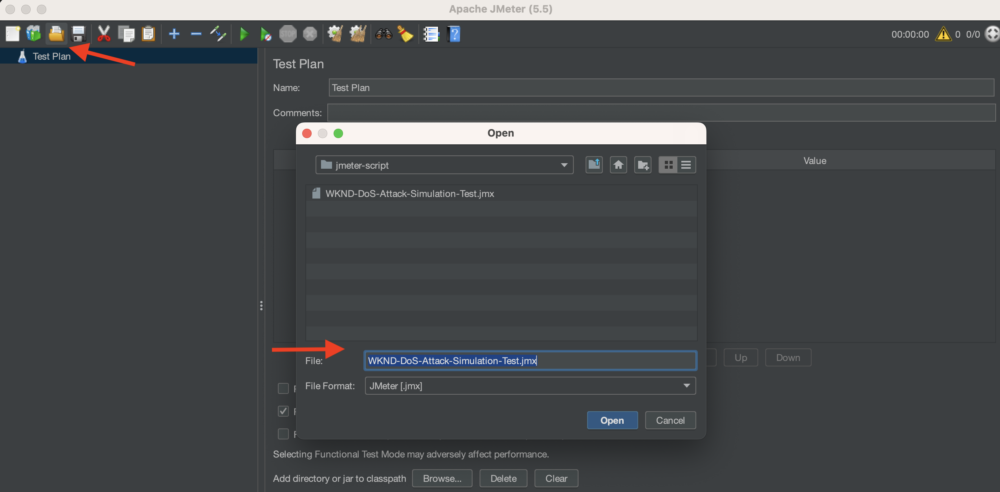

# Verwenden Sie ModSecurity, um Ihre AEM Website vor DoS-Angriffen zu schützen.

Erfahren Sie, wie Sie ModSecurity aktivieren können, um Ihre Site vor Denial of Service (DoS)-Angriffen zu schützen, indem Sie die **OWASP ModSecurity Core Rule Set (CRS)** auf dem Adobe Experience Manager (AEM) Dispatcher veröffentlichen.

>[!VIDEO](https://video.tv.adobe.com/v/3422976?quality=12&learn=on)

## Übersicht

Die [Öffnen Sie Web Application Security Project® (OWASP)](https://owasp.org/) foundation stellt die [**OWASP Top 10**](https://owasp.org/www-project-top-ten/) Erläuterung der zehn wichtigsten Sicherheitsbedenken für Webanwendungen.

ModSecurity ist eine quelloffene, plattformübergreifende Lösung, die Schutz vor einer Reihe von Angriffen auf Webanwendungen bietet. Sie ermöglicht auch die HTTP-Traffic-Überwachung, -Protokollierung und Echtzeitanalyse.

OWSAP® stellt auch die [OWASP® ModSecurity Core Rule Set (CRS)](https://github.com/coreruleset/coreruleset). CRS ist ein Satz generischer **Angriffserkennung** Regeln zur Verwendung mit ModSecurity. Daher zielt CRS darauf ab, Webanwendungen vor einer Vielzahl von Angriffen, einschließlich der OWASP Top Ten, mit einem Minimum an falschen Warnhinweisen zu schützen.

In diesem Tutorial wird gezeigt, wie die **DOS-PROTECTION** CRS-Regel zum Schutz Ihrer Site vor einem potenziellen DoS-Angriff.

>[!TIP]
>
>Es ist wichtig zu beachten, dass die AEM as a Cloud Service [verwaltetes CDN](https://experienceleague.adobe.com/docs/experience-manager-cloud-service/content/implementing/content-delivery/cdn.html?lang=de) erfüllt die meisten Leistungs- und Sicherheitsanforderungen des Kunden. ModSecurity bietet jedoch eine zusätzliche Sicherheitsebene und ermöglicht kundenspezifische Regeln und Konfigurationen.

## Hinzufügen von CRS zum Dispatcher-Projektmodul

1. Laden Sie die [aktueller OWASP ModSecurity-Core-Regelsatz](https://github.com/coreruleset/coreruleset/releases).

   ```shell
   # Replace the X.Y.Z with relevent version numbers.
   $ wget https://github.com/coreruleset/coreruleset/archive/refs/tags/vX.Y.Z.tar.gz
   
   # For version v3.3.5 when this tutorial is published
   $ wget https://github.com/coreruleset/coreruleset/archive/refs/tags/v3.3.5.tar.gz
   
   # Extract the downloaded file
   $ tar -xvzf coreruleset-3.3.5.tar.gz
   ```

1. Erstellen Sie die `modsec/crs` Ordner in `dispatcher/src/conf.d/` im Code Ihres AEM-Projekts. In der lokalen Kopie des [AEM WKND Sites-Projekt](https://github.com/adobe/aem-guides-wknd).

   {width="200" zoomable="yes"}

1. Kopieren Sie die `coreruleset-X.Y.Z/rules` Ordner aus dem heruntergeladenen CRS-Versionspaket in `dispatcher/src/conf.d/modsec/crs` Ordner.
1. Kopieren Sie die `coreruleset-X.Y.Z/crs-setup.conf.example` -Datei aus dem heruntergeladenen CRS-Versionspaket in `dispatcher/src/conf.d/modsec/crs` Ordner und benennen Sie ihn in um `crs-setup.conf`.
1. Deaktivieren Sie alle kopierten CRS-Regeln aus der `dispatcher/src/conf.d/modsec/crs/rules` durch Umbenennen in `XXXX-XXX-XXX.conf.disabled`. Sie können die folgenden Befehle verwenden, um alle Dateien gleichzeitig umzubenennen.

   ```shell
   # Go inside the newly created rules directory within the dispathcher module
   $ cd dispatcher/src/conf.d/modsec/crs/rules
   
   # Rename all '.conf' extension files to '.conf.disabled'
   $ for i in *.conf; do mv -- "$i" "$i.disabled"; done
   ```

   Siehe Umbenannte CRS-Regeln und Konfigurationsdatei im WKND-Projektcode.

   {width="200" zoomable="yes"}

## Aktivieren und Konfigurieren der DoS-Schutzregel (Denial of Service)

Gehen Sie wie folgt vor, um die DoS-Schutzregel (Denial of Service) zu aktivieren und zu konfigurieren:

1. Aktivieren Sie die DoS-Schutzregel, indem Sie die `REQUEST-912-DOS-PROTECTION.conf.disabled` nach `REQUEST-912-DOS-PROTECTION.conf` (oder entfernen Sie die `.disabled` aus der Erweiterung &quot;rulename&quot;) innerhalb der `dispatcher/src/conf.d/modsec/crs/rules` Ordner.
1. Konfigurieren Sie die Regel, indem Sie die  **DOS_COUNTER_THRESHOLD, DOS_BURST_TIME_SLICE, DOS_BLOCK_TIMEOUT** Variablen.
   1. Erstellen Sie eine `crs-setup.custom.conf` -Datei innerhalb der `dispatcher/src/conf.d/modsec/crs` Ordner.
   1. Fügen Sie der neu erstellten Datei das folgende Regelfragment hinzu.

   ```
   # The Denial of Service (DoS) protection against clients making requests too quickly.
   # When a client is making more than 25 requests (excluding static files) within
   # 60 seconds, this is considered a 'burst'. After two bursts, the client is
   # blocked for 600 seconds.
   SecAction \
       "id:900700,\
       phase:1,\
       nolog,\
       pass,\
       t:none,\
       setvar:'tx.dos_burst_time_slice=60',\
       setvar:'tx.dos_counter_threshold=25',\
       setvar:'tx.dos_block_timeout=600'"    
   ```

In dieser Beispielregelkonfiguration gilt Folgendes: **DOS_COUNTER_THRESHOLD** ist 25, **DOS_BURST_TIME_SLICE** 60 Sekunden beträgt und **DOS_BLOCK_TIMEOUT** Zeitüberschreitung beträgt 600 Sekunden. Diese Konfiguration identifiziert mehr als zwei Vorkommnisse von 25 Anforderungen (mit Ausnahme statischer Dateien) innerhalb von 60 Sekunden als DoS-Angriff, sodass der anfordernde Client 600 Sekunden (oder 10 Minuten) blockiert wird.

>[!WARNING]
>
>Um die für Ihre Anforderungen geeigneten Werte zu definieren, arbeiten Sie mit Ihrem Web Security-Team zusammen.

## Initialisieren des CRS

Um das CRS zu initialisieren, entfernen Sie allgemeine false -Positiv-Werte und fügen Sie lokale Ausnahmen für Ihre Site hinzu:

1. Entfernen Sie zum Initialisieren des CRS `.disabled` aus dem **REQUEST-901-INITIALISIERUNG** -Datei. Mit anderen Worten: Benennen Sie die `REQUEST-901-INITIALIZATION.conf.disabled` Datei in `REQUEST-901-INITIALIZATION.conf`.
1. Entfernen Sie zum Entfernen der gängigen falsch-positiven Werte wie &quot;local IP&quot;(127.0.0.1)-Ping den Befehl `.disabled` aus dem **REQUEST-905-COMMON-EXCEPTIONS** -Datei.
1. Um lokale Ausnahmen wie die AEM-Plattform oder Ihre Site-spezifischen Pfade hinzuzufügen, benennen Sie die `REQUEST-900-EXCLUSION-RULES-BEFORE-CRS.conf.example` nach `REQUEST-900-EXCLUSION-RULES-BEFORE-CRS.conf`
   1. Fügen Sie AEM plattformspezifischen Pfadausnahmen zur neu umbenannten Datei hinzu.

   ```
   ########################################################
   # AEM as a Cloud Service exclusions                    #
   ########################################################
   # Ignoring AEM-CS Specific internal and reserved paths
   
   SecRule REQUEST_URI "@beginsWith /systemready" \
       "id:1010,\
       phase:1,\
       pass,\
       nolog,\
       ctl:ruleEngine=Off"    
   
   SecRule REQUEST_URI "@beginsWith /system/probes" \
       "id:1011,\
       phase:1,\
       pass,\
       nolog,\
       ctl:ruleEngine=Off"
   
   SecRule REQUEST_URI "@beginsWith /gitinit-status" \
       "id:1012,\
       phase:1,\
       pass,\
       nolog,\
       ctl:ruleEngine=Off"
   
   ########################################################
   # ADD YOUR SITE related exclusions                     #
   ########################################################
   ...
   ```

1. Entfernen Sie außerdem die `.disabled` von **REQUEST-910-IP-REPUTATION.conf.disabled** für die IP-Reputationsblocküberprüfung und `REQUEST-949-BLOCKING-EVALUATION.conf.disabled` für die Anomaliebewertungsüberprüfung.

>[!TIP]
>
>Stellen Sie bei der Konfiguration in AEM 6.5 sicher, dass Sie die oben genannten Pfade durch entsprechende AMS- oder On-Premise-Pfade ersetzen, die den Zustand der AEM überprüfen (auch Heartbeat-Pfade genannt).

## Hinzufügen der ModSecurity Apache-Konfiguration

So aktivieren Sie ModSecurity (auch: `mod_security` Apache-Modul), führen Sie die folgenden Schritte aus:

1. Erstellen `modsecurity.conf` at `dispatcher/src/conf.d/modsec/modsecurity.conf` mit den folgenden Schlüsselkonfigurationen.

   ```
   # Include the baseline crs setup
   Include conf.d/modsec/crs/crs-setup.conf
   
   # Include your customizations to crs setup if exist
   IncludeOptional conf.d/modsec/crs/crs-setup.custom.conf
   
   # Select all available CRS rules:
   #Include conf.d/modsec/crs/rules/*.conf
   
   # Or alternatively list only specific ones you want to enable e.g.
   Include conf.d/modsec/crs/rules/REQUEST-900-EXCLUSION-RULES-BEFORE-CRS.conf
   Include conf.d/modsec/crs/rules/REQUEST-901-INITIALIZATION.conf
   Include conf.d/modsec/crs/rules/REQUEST-905-COMMON-EXCEPTIONS.conf
   Include conf.d/modsec/crs/rules/REQUEST-910-IP-REPUTATION.conf
   Include conf.d/modsec/crs/rules/REQUEST-912-DOS-PROTECTION.conf
   Include conf.d/modsec/crs/rules/REQUEST-949-BLOCKING-EVALUATION.conf
   
   # Start initially with engine off, then switch to detection and observe, and when sure enable engine actions
   #SecRuleEngine Off
   #SecRuleEngine DetectionOnly
   SecRuleEngine On
   
   # Remember to use relative path for logs:
   SecDebugLog logs/httpd_mod_security_debug.log
   
   # Start with low debug level
   SecDebugLogLevel 0
   #SecDebugLogLevel 1
   
   # Start without auditing
   SecAuditEngine Off
   #SecAuditEngine RelevantOnly
   #SecAuditEngine On
   
   # Tune audit accordingly:
   SecAuditLogRelevantStatus "^(?:5|4(?!04))"
   SecAuditLogParts ABIJDEFHZ
   SecAuditLogType Serial
   
   # Remember to use relative path for logs:
   SecAuditLog logs/httpd_mod_security_audit.log
   
   # You might still use /tmp for temporary/work files:
   SecTmpDir /tmp
   SecDataDir /tmp
   ```

1. Wählen Sie die gewünschte `.vhost` aus dem Dispatcher-Modul Ihres AEM-Projekts `dispatcher/src/conf.d/available_vhosts`, beispielsweise `wknd.vhost`, fügen Sie den folgenden Eintrag außerhalb der `<VirtualHost>` blockieren.

   ```
   # Enable the ModSecurity and OWASP CRS
   <IfModule mod_security2.c>
       Include conf.d/modsec/modsecurity.conf
   </IfModule>
   
   ...
   
   <VirtualHost *:80>
       ServerName    "publish"
       ...
   </VirtualHost>
   ```

Alle oben genannten _ModSecurity CRS_ und _DOS-PROTECTION_ Konfigurationen sind im AEM WKND Sites-Projekt verfügbar. [tutorial/enable-modsecurity-crs-dos-protection](https://github.com/adobe/aem-guides-wknd/tree/tutorial/enable-modsecurity-crs-dos-protection) Verzweigung für Ihre Überprüfung.

### Überprüfen der Dispatcher-Konfiguration

Wenn Sie mit AEM as a Cloud Service arbeiten, bevor Sie Ihre _Dispatcher-Konfiguration_ geändert wurde, wird empfohlen, sie lokal zu validieren mithilfe von `validate` Skript der [AEM SDKs Dispatcher Tools](https://experienceleague.adobe.com/docs/experience-manager-learn/cloud-service/local-development-environment-set-up/dispatcher-tools.html?lang=de).

```
# Go inside Dispatcher SDK 'bin' directory
$ cd <YOUR-AEM-SDK-DIR>/<DISPATCHER-SDK-DIR>/bin

# Validate the updated Dispatcher configurations
$ ./validate.sh <YOUR-AEM-PROJECT-CODE-DIR>/dispatcher/src
```

## Bereitstellen

Bereitstellen der lokal validierten Dispatcher-Konfigurationen mit Cloud Manager [Webebene](https://experienceleague.adobe.com/docs/experience-manager-cloud-service/content/implementing/using-cloud-manager/cicd-pipelines/configuring-production-pipelines.html?#web-tier-config) oder [Voller Stapel](https://experienceleague.adobe.com/docs/experience-manager-cloud-service/content/implementing/using-cloud-manager/cicd-pipelines/configuring-production-pipelines.html?#full-stack-code) Pipeline. Sie können auch die [Schnelle Entwicklungsumgebung](https://experienceleague.adobe.com/docs/experience-manager-learn/cloud-service/developing/rde/overview.html?lang=de) für schnellere Umstellungszeiten.

## Überprüfen Sie

Um den DoS-Schutz zu überprüfen, senden wir in diesem Beispiel innerhalb eines Zeitraums von 60 Sekunden mehr als 50 Anforderungen (25 Anforderungsschwellen sind doppelt so hoch). Diese Anfragen sollten jedoch über die AEM as a Cloud Service [integriert](https://experienceleague.adobe.com/docs/experience-manager-cloud-service/content/implementing/content-delivery/cdn.html?lang=de) oder [sonstige CDN](https://experienceleague.adobe.com/docs/experience-manager-cloud-service/content/implementing/content-delivery/cdn.html?#point-to-point-CDN) Targeting Ihrer Website.

Eine Methode zum Erzielen des CDN-Pass-Through besteht darin, einen Abfrageparameter mit einer **neuer zufälliger Wert für jede Seitenanforderung der Site**.

Um eine größere Anzahl von Anforderungen (50 oder mehr) innerhalb eines kurzen Zeitraums (z. B. 60 Sekunden) Trigger, muss der Apache [JMeter](https://jmeter.apache.org/) oder [Benchmark- oder Tabulator-Tool](https://httpd.apache.org/docs/2.4/programs/ab.html) verwendet werden.

### Simulieren des DoS-Angriffs mithilfe des JMeter-Skripts

Gehen Sie wie folgt vor, um einen DoS-Angriff mit JMeter zu simulieren:

1. [Herunterladen von Apache JMeter](https://jmeter.apache.org/download_jmeter.cgi) und [install](https://jmeter.apache.org/usermanual/get-started.html#install) lokal
1. [Ausführen](https://jmeter.apache.org/usermanual/get-started.html#running) lokal mithilfe der `jmeter` Skript aus `<JMETER-INSTALL-DIR>/bin` Verzeichnis.
1. Beispiel öffnen [WKND-DoS-Attack-Simulation-Test](assets/modsecurity-crs/WKND-DoS-Attack-Simulation-Test.jmx) JMX-Skript mithilfe des **Öffnen** Tool-Menü.

   

1. Aktualisieren Sie die **Servername oder IP** Feldwert in _Startseite_ und _Adventure Page_ HTTP-Anforderungs-Sampler, der Ihrer Test-AEM-Umgebungs-URL entspricht. Überprüfen Sie andere Details des JMeter-Beispielskripts.

   

1. Führen Sie das Skript aus, indem Sie die **Starten** -Schaltfläche aus dem Tool-Menü. Das Skript sendet 50 HTTP-Anfragen (5 Benutzer und 10 Schleifenanzahl) an die WKND-Site _Startseite_ und _Adventure Page_. Somit sind insgesamt 100 Anfragen an nicht statische Dateien für den DoS-Angriff pro **DOS-PROTECTION** Benutzerdefinierte Konfiguration der CRS-Regel.

   

1. Die **Ergebnisse in Tabelle anzeigen** JMeter-Listener zeigt **Fehlgeschlagen** Antwortstatus für Anforderungsnummer ~ 53 und höher.

   

1. Die **503 HTTP-Antwortcode** für die fehlgeschlagenen Anfragen zurückgegeben wird, können Sie die Details mit der **Ergebnisstruktur anzeigen** JMeter-Listener.

   

### Prüfprotokolle

Die Konfiguration des ModSecurity-Loggers protokolliert die Details des DoS-Angriffs. Gehen Sie wie folgt vor, um die Details anzuzeigen:

1. Laden Sie die `httpderror` Protokolldatei der **Dispatcher veröffentlichen**.
1. Suchen nach Wort `burst` in der Protokolldatei, um die **error** lines

   ```
   Tue Aug 15 15:19:40.229262 2023 [security2:error] [pid 308:tid 140200050567992] [cm-p46652-e1167810-aem-publish-85df5d9954-bzvbs] [client 192.150.10.209] ModSecurity: Warning. Operator GE matched 2 at IP:dos_burst_counter. [file "/etc/httpd/conf.d/modsec/crs/rules/REQUEST-912-DOS-PROTECTION.conf"] [line "265"] [id "912170"] [msg "Potential Denial of Service (DoS) Attack from 192.150.10.209 - # of Request Bursts: 2"] [ver "OWASP_CRS/3.3.5"] [tag "application-multi"] [tag "language-multi"] [tag "platform-multi"] [tag "paranoia-level/1"] [tag "attack-dos"] [tag "OWASP_CRS"] [tag "capec/1000/210/227/469"] [hostname "publish-p46652-e1167810.adobeaemcloud.com"] [uri "/content/wknd/us/en/adventures.html"] [unique_id "ZNuXi9ft_9sa85dovgTN5gAAANI"]
   
   ...
   
   Tue Aug 15 15:19:40.515237 2023 [security2:error] [pid 309:tid 140200051428152] [cm-p46652-e1167810-aem-publish-85df5d9954-bzvbs] [client 192.150.10.209] ModSecurity: Access denied with connection close (phase 1). Operator EQ matched 0 at IP. [file "/etc/httpd/conf.d/modsec/crs/rules/REQUEST-912-DOS-PROTECTION.conf"] [line "120"] [id "912120"] [msg "Denial of Service (DoS) attack identified from 192.150.10.209 (1 hits since last alert)"] [ver "OWASP_CRS/3.3.5"] [tag "application-multi"] [tag "language-multi"] [tag "platform-multi"] [tag "paranoia-level/1"] [tag "attack-dos"] [tag "OWASP_CRS"] [tag "capec/1000/210/227/469"] [hostname "publish-p46652-e1167810.adobeaemcloud.com"] [uri "/us/en.html"] [unique_id "ZNuXjAN7ZtmIYHGpDEkmmwAAAQw"]
   ```

1. Überprüfen Sie die Details wie _Client-IP-Adresse_, Aktion, Fehlermeldung und Anfragedetails.

## Leistungsauswirkungen von ModSecurity

Die Aktivierung von ModSecurity und zugehörigen Regeln hat einige Leistungsbeeinträchtigungen. Achten Sie daher darauf, welche Regeln erforderlich, redundant und übersprungen sind. Arbeiten Sie mit Ihren Web Security-Experten zusammen, um die CRS-Regeln zu aktivieren und anzupassen.

### Zusätzliche Regeln

Dieses Tutorial aktiviert und passt nur die **DOS-PROTECTION** CRS-Regel für Demonstrationszwecke. Es wird empfohlen, mit Web Security-Experten zusammenzuarbeiten, um die entsprechenden Regeln zu verstehen, zu überprüfen und zu konfigurieren.
