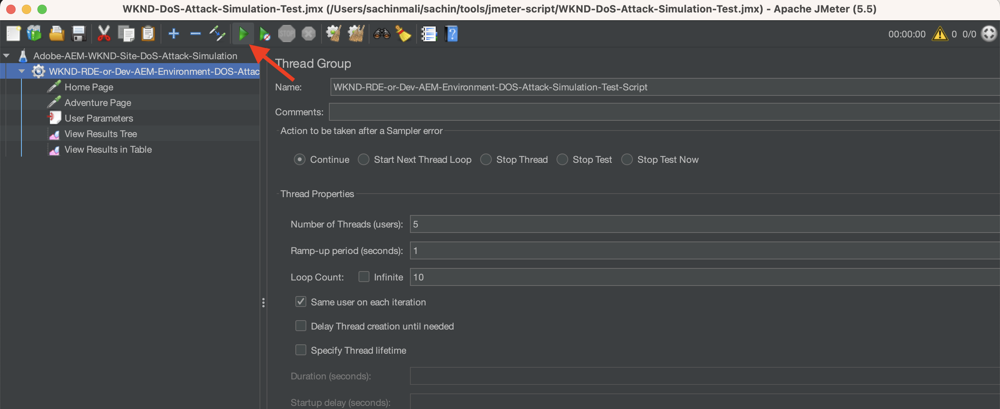

# Schutz Ihrer AEM-Website vor DoS-Angriffen mit ModSecurity

Erfahren Sie, wie Sie ModSecurity aktivieren können, um Ihre Site vor Denial of Service(DoS)-Angriffen zu schützen, indem Sie den  **OWASP ModSecurity Core Rule Set (CRS)** auf dem Adobe Experience Manager (AEM) Dispatcher veröffentlichen.


>[!VIDEO](https://video.tv.adobe.com/v/3422976?quality=12&learn=on)

## Übersicht

Die Foundation [Web Application Security Project® (OWASP) öffnen](https://owasp.org/) erläutert die [**OWASP Top 10**](https://owasp.org/www-project-top-ten/) der zehn wichtigsten Sicherheitsprobleme bei Web-Anwendungen.

ModSecurity ist eine quelloffene plattformübergreifende Lösung zum Schutz vor diversen Angriffe auf Web-Anwendungen. Sie ermöglicht auch die Überwachung, Protokollierung und Echtzeitanalyse des HTTP-Traffics.

OWSAP® stellt auch den [OWASP® ModSecurity Core Rule Set (CRS)](https://github.com/coreruleset/coreruleset) bereit. CRS ist ein Satz generischer **Angriffserkennungsregeln** zur Verwendung mit ModSecurity. CRS zielt darauf ab, Web-Anwendungen vor einer Vielzahl von Angriffen, einschließlich der OWASP Top Ten, mit einem Minimum an falschen Warnhinweisen zu schützen.

In diesem Tutorial erfahren Sie, wie Sie die CRS-Regel **DOS-SCHUTZ** zum Schutz Ihrer Site vor einem potenziellen DoS-Angriff aktivieren und konfigurieren.

>[!TIP]
>
>Dabei sollten Sie beachten, dass die von AEM as a Cloud Service [verwaltete CDN](https://experienceleague.adobe.com/docs/experience-manager-cloud-service/content/implementing/content-delivery/cdn.html?lang=de) die meisten Leistungs- und Sicherheitsanforderungen von Kundenseite erfüllt. ModSecurity bietet jedoch eine zusätzliche Sicherheitsebene und ermöglicht kundenspezifische Regeln und Konfigurationen.

## Hinzufügen von CRS zum Dispatcher-Projektmodul

1. Laden und extrahieren Sie den [aktueller OWASP ModSecurity Core Rule Set](https://github.com/coreruleset/coreruleset/releases).

   ```shell
   # Replace the X.Y.Z with relevent version numbers.
   $ wget https://github.com/coreruleset/coreruleset/archive/refs/tags/vX.Y.Z.tar.gz
   
   # For version v3.3.5 when this tutorial is published
   $ wget https://github.com/coreruleset/coreruleset/archive/refs/tags/v3.3.5.tar.gz
   
   # Extract the downloaded file
   $ tar -xvzf coreruleset-3.3.5.tar.gz
   ```

1. Erstellen Sie die `modsec/crs`-Ordner in `dispatcher/src/conf.d/` im Code Ihres AEM-Projekts. Zum Beispiel in der lokalen Kopie des [AEM WKND Sites-Projekts](https://github.com/adobe/aem-guides-wknd).

   {width="200" zoomable="yes"}

1. Kopieren Sie die Ordner `coreruleset-X.Y.Z/rules` aus dem heruntergeladenen CRS-Versionspaket in den Ordner `dispatcher/src/conf.d/modsec/crs`.
1. Kopieren Sie die Datei `coreruleset-X.Y.Z/crs-setup.conf.example` aus dem heruntergeladenen CRS-Versionspaket in den Ordner `dispatcher/src/conf.d/modsec/crs` und benennen Sie sie um in `crs-setup.conf`.
1. Deaktivieren Sie alle kopierten CRS-Regeln aus `dispatcher/src/conf.d/modsec/crs/rules`, indem Sie sie in `XXXX-XXX-XXX.conf.disabled` umbenennen. Mit folgenden Befehlen können Sie alle Dateien gleichzeitig umbenennen.

   ```shell
   # Go inside the newly created rules directory within the dispathcher module
   $ cd dispatcher/src/conf.d/modsec/crs/rules
   
   # Rename all '.conf' extension files to '.conf.disabled'
   $ for i in *.conf; do mv -- "$i" "$i.disabled"; done
   ```

   Siehe die umbenannten CRS-Regeln und die Konfigurationsdatei im WKND-Projekt-Code.

   {width="200" zoomable="yes"}

## Aktivieren und Konfigurieren der DoS-Schutzregel (Denial of Service)

Gehen Sie wie folgt vor, um die DoS-Schutzregel (Denial of Service) zu aktivieren und zu konfigurieren:

1. Aktivieren Sie die DoS-Schutzregel, indem Sie `REQUEST-912-DOS-PROTECTION.conf.disabled` in `REQUEST-912-DOS-PROTECTION.conf` umbenennen (oder entfernen Sie `.disabled` aus der Regelnamen-Erweiterung) im Ordner `dispatcher/src/conf.d/modsec/crs/rules`.
1. Konfigurieren Sie die Regel, indem Sie die Variablen **DOS_COUNTER_THRESHOLD, DOS_BURST_TIME_SLICE, DOS_BLOCK_TIMEOUT** festlegen.
   1. Erstellen Sie eine Datei `crs-setup.custom.conf` im Ordner `dispatcher/src/conf.d/modsec/crs`.
   1. Fügen Sie zur neu erstellten Datei folgendes Regelfragment hinzu.

   ```
   # The Denial of Service (DoS) protection against clients making requests too quickly.
   # When a client is making more than 25 requests (excluding static files) within
   # 60 seconds, this is considered a 'burst'. After two bursts, the client is
   # blocked for 600 seconds.
   SecAction \
       "id:900700,\
       phase:1,\
       nolog,\
       pass,\
       t:none,\
       setvar:'tx.dos_burst_time_slice=60',\
       setvar:'tx.dos_counter_threshold=25',\
       setvar:'tx.dos_block_timeout=600'"    
   ```

In dieser Beispielregelkonfiguration gilt Folgendes: **DOS_COUNTER_THRESHOLD** beträgt 25, **DOS_BURST_TIME_SLICE** beträgt 60 Sekunden und die Zeitüberschreitung **DOS_BLOCK_TIMEOUT** beträgt 600 Sekunden. Diese Konfiguration identifiziert mehr als zwei Vorkommnisse von 25 Anforderungen (mit Ausnahme statischer Dateien) innerhalb von 60 Sekunden als DoS-Angriff, sodass der anfordernde Client 600 Sekunden (oder 10 Minuten) blockiert wird.

>[!WARNING]
>
>Legen Sie die für Ihre Anforderungen geeigneten Werte zusammen mit Ihrem Web Security-Team fest.

## CRS initialisieren

Um das CRS zu initialisieren, entfernen Sie allgemeine falsch positive Werte und fügen Sie lokale Ausnahmen für Ihre Site hinzu:

1. Entfernen Sie zum Initialisieren des CRS `.disabled` aus der Datei **REQUEST-901-INITIALISIERUNG**. Mit anderen Worten: Benennen Sie die Datei `REQUEST-901-INITIALIZATION.conf.disabled` in `REQUEST-901-INITIALIZATION.conf` um.
1. Entfernen Sie zum Löschen der allgemeinen falsch positiven Werte wie „lokale IP (127.0.0.1) Ping“ den Befehl `.disabled` aus der Datei **REQUEST-905-COMMON-EXCEPTIONS**.
1. Um lokale Ausnahmen wie die AEM-Plattform oder Ihre Site-spezifischen Pfade hinzuzufügen, benennen Sie `REQUEST-900-EXCLUSION-RULES-BEFORE-CRS.conf.example` in `REQUEST-900-EXCLUSION-RULES-BEFORE-CRS.conf` um.
   1. Fügen Sie AEM-plattformspezifische Pfadausnahmen zur neu umbenannten Datei hinzu.

   ```
   ########################################################
   # AEM as a Cloud Service exclusions                    #
   ########################################################
   # Ignoring AEM-CS Specific internal and reserved paths
   
   SecRule REQUEST_URI "@beginsWith /systemready" \
       "id:1010,\
       phase:1,\
       pass,\
       nolog,\
       ctl:ruleEngine=Off"    
   
   SecRule REQUEST_URI "@beginsWith /system/probes" \
       "id:1011,\
       phase:1,\
       pass,\
       nolog,\
       ctl:ruleEngine=Off"
   
   SecRule REQUEST_URI "@beginsWith /gitinit-status" \
       "id:1012,\
       phase:1,\
       pass,\
       nolog,\
       ctl:ruleEngine=Off"
   
   ########################################################
   # ADD YOUR SITE related exclusions                     #
   ########################################################
   ...
   ```

1. Entfernen Sie außerdem `.disabled` aus **REQUEST-910-IP-REPUTATION.conf.disabled** zur IP-Reputationsblockprüfung und `REQUEST-949-BLOCKING-EVALUATION.conf.disabled` zur Anomaliebewertungsprüfung.

>[!TIP]
>
>Stellen Sie bei der Konfiguration in AEM 6.5 sicher, dass Sie die oben genannten Pfade durch entsprechende AMS- oder On-Premise-Pfade ersetzen, die den Zustand der AEM überprüfen (auch Heartbeat-Pfade genannt).

## Hinzufügen der ModSecurity Apache-Konfiguration

Gehen Sie wie folgt vor, um ModSecurity (auch: `mod_security` Apache-Modul) zu aktivieren:

1. Erstellen Sie `modsecurity.conf` in `dispatcher/src/conf.d/modsec/modsecurity.conf` mit folgenden Schlüsselkonfigurationen.

   ```
   # Include the baseline crs setup
   Include conf.d/modsec/crs/crs-setup.conf
   
   # Include your customizations to crs setup if exist
   IncludeOptional conf.d/modsec/crs/crs-setup.custom.conf
   
   # Select all available CRS rules:
   #Include conf.d/modsec/crs/rules/*.conf
   
   # Or alternatively list only specific ones you want to enable e.g.
   Include conf.d/modsec/crs/rules/REQUEST-900-EXCLUSION-RULES-BEFORE-CRS.conf
   Include conf.d/modsec/crs/rules/REQUEST-901-INITIALIZATION.conf
   Include conf.d/modsec/crs/rules/REQUEST-905-COMMON-EXCEPTIONS.conf
   Include conf.d/modsec/crs/rules/REQUEST-910-IP-REPUTATION.conf
   Include conf.d/modsec/crs/rules/REQUEST-912-DOS-PROTECTION.conf
   Include conf.d/modsec/crs/rules/REQUEST-949-BLOCKING-EVALUATION.conf
   
   # Start initially with engine off, then switch to detection and observe, and when sure enable engine actions
   #SecRuleEngine Off
   #SecRuleEngine DetectionOnly
   SecRuleEngine On
   
   # Remember to use relative path for logs:
   SecDebugLog logs/httpd_mod_security_debug.log
   
   # Start with low debug level
   SecDebugLogLevel 0
   #SecDebugLogLevel 1
   
   # Start without auditing
   SecAuditEngine Off
   #SecAuditEngine RelevantOnly
   #SecAuditEngine On
   
   # Tune audit accordingly:
   SecAuditLogRelevantStatus "^(?:5|4(?!04))"
   SecAuditLogParts ABIJDEFHZ
   SecAuditLogType Serial
   
   # Remember to use relative path for logs:
   SecAuditLog logs/httpd_mod_security_audit.log
   
   # You might still use /tmp for temporary/work files:
   SecTmpDir /tmp
   SecDataDir /tmp
   ```

1. Wählen Sie den gewünschten `.vhost` aus dem Dispatcher-Modul `dispatcher/src/conf.d/available_vhosts` Ihres AEM-Projekts aus, beispielsweise `wknd.vhost`, und fügen Sie folgenden Eintrag außerhalb des `<VirtualHost>`-Blocks ein.

   ```
   # Enable the ModSecurity and OWASP CRS
   <IfModule mod_security2.c>
       Include conf.d/modsec/modsecurity.conf
   </IfModule>
   
   ...
   
   <VirtualHost *:80>
       ServerName    "publish"
       ...
   </VirtualHost>
   ```

Alle oben genannten _ModSecurity CRS_- und _DOS-SCHUTZ_-Konfigurationen können in der Verzweigung [tutorial/enable-modsecurity-crs-dos-protection](https://github.com/adobe/aem-guides-wknd/tree/tutorial/enable-modsecurity-crs-dos-protection) des AEM WKND Sites-Projekts überprüft werden.

### Überprüfen der Dispatcher-Konfiguration

Wenn Sie mit AEM as a Cloud Service arbeiten, empfehlen wir, Ihre _Dispatcher-Konfiguration_ vor der Bereitstellung lokal mithilfe des `validate`-Skripts der [AEM SDK Dispatcher-Tools](https://experienceleague.adobe.com/docs/experience-manager-learn/cloud-service/local-development-environment-set-up/dispatcher-tools.html?lang=de) zu überprüfen.

```
# Go inside Dispatcher SDK 'bin' directory
$ cd <YOUR-AEM-SDK-DIR>/<DISPATCHER-SDK-DIR>/bin

# Validate the updated Dispatcher configurations
$ ./validate.sh <YOUR-AEM-PROJECT-CODE-DIR>/dispatcher/src
```

## Bereitstellen

Stellen Sie die lokal überprüften Dispatcher-Konfigurationen über die Cloud Manager-Pipeline [Webebene](https://experienceleague.adobe.com/docs/experience-manager-cloud-service/content/implementing/using-cloud-manager/cicd-pipelines/configuring-production-pipelines.html?lang=de#web-tier-config) oder [Voller Stapel](https://experienceleague.adobe.com/docs/experience-manager-cloud-service/content/implementing/using-cloud-manager/cicd-pipelines/configuring-production-pipelines.html?lang=de#full-stack-code) bereit. Für eine schnellere Bereitstellung können Sie auch die [Schnelle Entwicklungsumgebung](https://experienceleague.adobe.com/docs/experience-manager-learn/cloud-service/developing/rde/overview.html?lang=de) nutzen.

## Überprüfen

Um den DoS-Schutz zu überprüfen, senden wir in diesem Beispiel innerhalb eines Zeitraums von 60 Sekunden mehr als 50 Anforderungen (25 Anforderungszeitschwellen auf zwei Vorkommnisse). Diese Anfragen sollten jedoch über die in AEM as a Cloud Service [integrierte](https://experienceleague.adobe.com/docs/experience-manager-cloud-service/content/implementing/content-delivery/cdn.html?lang=de) oder [sonstige CDN](https://experienceleague.adobe.com/docs/experience-manager-cloud-service/content/implementing/content-delivery/cdn.html?lang=de#point-to-point-CDN) auf Ihrer Website erfolgen.

Eine Methode zum Erzielen des CDN-Durchlaufs besteht darin, einen Abfrageparameter mit einem **neuen zufälligen Wert für jede Seitenanforderung der Site** hinzuzufügen.

Um eine größere Anzahl von Anforderungen (50 oder mehr) innerhalb eines kurzen Zeitraums (z. B. 60 Sekunden) auszulösen, kann der Apache [JMeter](https://jmeter.apache.org/) oder das [Benchmark- oder Tabulator-Tool](https://httpd.apache.org/docs/2.4/programs/ab.html) verwendet werden.

### Simulieren des DoS-Angriffs mithilfe des JMeter-Skripts

Gehen Sie wie folgt vor, um einen DoS-Angriff mit JMeter zu simulieren:

1. [Laden Sie Apache JMeter](https://jmeter.apache.org/download_jmeter.cgi) herunter und [installieren](https://jmeter.apache.org/usermanual/get-started.html#install) Sie es lokal.
1. [Führen](https://jmeter.apache.org/usermanual/get-started.html#running) Sie es lokal mithilfe des `jmeter`-Skripts im `<JMETER-INSTALL-DIR>/bin`-Verzeichnis aus.
1. Öffnen Sie das JMX-Beispielskript [WKND-DoS-Attack-Simulation-Test](assets/modsecurity-crs/WKND-DoS-Attack-Simulation-Test.jmx) in JMeter über das Werkzeugmenü **Öffnen**.

   

1. Aktualisieren Sie Feldwert **Servername oder IP** in _Startseite_ und den HTTP-Anfragen-Sampler der _Abenteuer-Seite_ entsprechend der Test-URL Ihrer AEM-Umgebung. Überprüfen Sie andere Details des JMeter-Beispielskripts.

   

1. Führen Sie das Skript über die Option **Starten** des Werkzeug-Menüs aus. Das Skript sendet 50 HTTP-Anfragen (5 Benutzer und 10 Schleifen) an die _Startseite_ der WKND-Site und der _Abenteuer-Seite_. Das sind insgesamt 100 Anfragen an nicht-statische Dateien zur Erkennung von DoS-Angriffen pro **DOS-SCHUTZ** CRS-Regelkonfiguration.

   

1. Der JMeter-Listener **Ergebnisse in Tabelle anzeigen** gibt als Antwort **Fehlgeschlagen** ab Anforderungsnummer ~ 53 aus.

   

1. Wenn für die fehlgeschlagene Antwort wird der **Antwortcode 503 HTTP** zurückgegeben wird, können Sie die Details mit dem JMeter-Listener **Ergebnisstruktur anzeigen** anzeigen.

   

### Prüfprotokolle

Die Konfiguration des ModSecurity-Loggers protokolliert die Details des DoS-Angriffs. Gehen Sie wie folgt vor, um die Details anzuzeigen:

1. Laden Sie die `httpderror` Protokolldatei des **Veröffentlichungs-Dispatcher** herunter und öffnen Sie sie.
1. Suchen Sie nach dem Wort `burst` in der Protokolldatei, um die **Fehlerzeilen** zu finden

   ```
   Tue Aug 15 15:19:40.229262 2023 [security2:error] [pid 308:tid 140200050567992] [cm-p46652-e1167810-aem-publish-85df5d9954-bzvbs] [client 192.150.10.209] ModSecurity: Warning. Operator GE matched 2 at IP:dos_burst_counter. [file "/etc/httpd/conf.d/modsec/crs/rules/REQUEST-912-DOS-PROTECTION.conf"] [line "265"] [id "912170"] [msg "Potential Denial of Service (DoS) Attack from 192.150.10.209 - # of Request Bursts: 2"] [ver "OWASP_CRS/3.3.5"] [tag "application-multi"] [tag "language-multi"] [tag "platform-multi"] [tag "paranoia-level/1"] [tag "attack-dos"] [tag "OWASP_CRS"] [tag "capec/1000/210/227/469"] [hostname "publish-p46652-e1167810.adobeaemcloud.com"] [uri "/content/wknd/us/en/adventures.html"] [unique_id "ZNuXi9ft_9sa85dovgTN5gAAANI"]
   
   ...
   
   Tue Aug 15 15:19:40.515237 2023 [security2:error] [pid 309:tid 140200051428152] [cm-p46652-e1167810-aem-publish-85df5d9954-bzvbs] [client 192.150.10.209] ModSecurity: Access denied with connection close (phase 1). Operator EQ matched 0 at IP. [file "/etc/httpd/conf.d/modsec/crs/rules/REQUEST-912-DOS-PROTECTION.conf"] [line "120"] [id "912120"] [msg "Denial of Service (DoS) attack identified from 192.150.10.209 (1 hits since last alert)"] [ver "OWASP_CRS/3.3.5"] [tag "application-multi"] [tag "language-multi"] [tag "platform-multi"] [tag "paranoia-level/1"] [tag "attack-dos"] [tag "OWASP_CRS"] [tag "capec/1000/210/227/469"] [hostname "publish-p46652-e1167810.adobeaemcloud.com"] [uri "/us/en.html"] [unique_id "ZNuXjAN7ZtmIYHGpDEkmmwAAAQw"]
   ```

1. Überprüfen Sie Details wie _Client-IP-Adresse_, Aktion, Fehlermeldung und Anfragedetails.

## Leistungsauswirkungen von ModSecurity

Die Aktivierung von ModSecurity und zugehörigen Regeln hat einige Auswirkungen auf die Leistung. Achten Sie daher darauf, welche Regeln erforderlich sind, welche redundant sind und welche übersprungen werden. Arbeiten Sie mit Ihren Fachleuten für Web-Sicherheit zusammen, um die CRS-Regeln zu aktivieren und anzupassen.

### Zusätzliche Regeln

In diesem Tutorial wird die CRS-Regel **DOS-SCHUTZ** nur zu Demonstrationszwecken aktiviert und angepasst. Es wird empfohlen, mit Fachleuten für Web-Sicherheit zusammenzuarbeiten, um die entsprechenden Regeln zu verstehen, zu überprüfen und zu konfigurieren.
