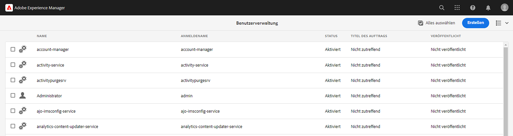
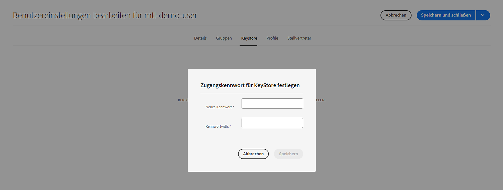
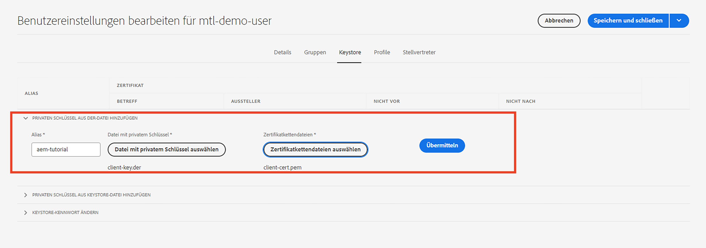
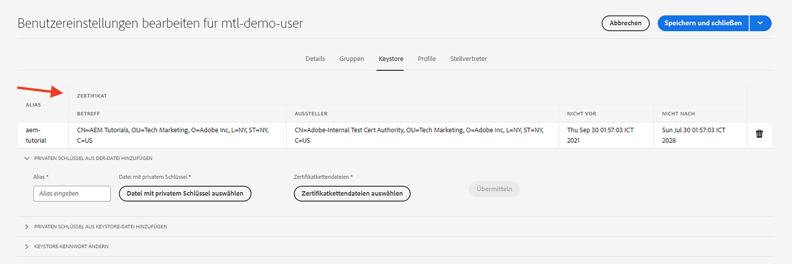

# Gegenseitige Transport Layer Security (mTLS)-Authentifizierung von AEM

Erfahren Sie, wie Sie HTTPS-Aufrufe von AEM zu Web-APIs durchführen, für die eine mTLS-Authentifizierung (Mutual Transport Layer Security) erforderlich ist.

Die mTLS- oder bidirektionale TLS-Authentifizierung verbessert die Sicherheit des TLS-Protokolls, da **Client und Server für die gegenseitige Authentifizierung**. Diese Authentifizierung erfolgt mithilfe digitaler Zertifikate. Sie wird häufig in Szenarien verwendet, in denen eine starke Sicherheits- und Identitätsüberprüfung von entscheidender Bedeutung ist.

Standardmäßig schlägt die Verbindung bei dem Versuch, eine HTTPS-Verbindung zu einer Web-API herzustellen, für die eine mTLS-Authentifizierung erforderlich ist, mit dem Fehler fehl:

```
javax.net.ssl.SSLHandshakeException: Received fatal alert: certificate_required
```

Dieses Problem tritt auf, wenn der Client kein Zertifikat zur Selbstauthentifizierung bereitstellt.

Im Folgenden erfahren Sie, wie Sie APIs, die eine mTLS-Authentifizierung erfordern, mithilfe von [Apache HttpClient](https://hc.apache.org/httpcomponents-client-4.5.x/index.html) und **AEM KeyStore und TrustStore**.


## HttpClient und Laden AEM KeyStore-Materials

Auf hoher Ebene sind die folgenden Schritte erforderlich, um eine mTLS-geschützte API vor AEM aufzurufen.

### AEM Certificate Generation

Fordern Sie das AEM-Zertifikat in Zusammenarbeit mit dem Sicherheitsteam Ihres Unternehmens an. Das Sicherheitsteam stellt die zertifikatbezogenen Details wie Schlüssel, Certificate Signing Request (CSR) bereit oder fragt sie ab und verwendet CSR, um das Zertifikat auszustellen.

Generieren Sie zu Demozwecken die zertifikatbezogenen Details wie Schlüssel, Certificate Signing Request (CSR). Im folgenden Beispiel wird eine selbstsignierte Zertifizierungsstelle verwendet, um das Zertifikat auszustellen.

- Generieren Sie zunächst das Zertifikat der internen Zertifizierungsstelle (CA).

  ```shell
  # Create an internal Certification Authority (CA) certificate
  openssl req -new -x509 -days 9999 -keyout internal-ca-key.pem -out internal-ca-cert.pem
  ```

- Generieren Sie das AEM Zertifikat.

  ```shell
  # Generate Key
  openssl genrsa -out client-key.pem
  
  # Generate CSR
  openssl req -new -key client-key.pem -out client-csr.pem
  
  # Generate certificate and sign with internal Certification Authority (CA)
  openssl x509 -req -days 9999 -in client-csr.pem -CA internal-ca-cert.pem -CAkey internal-ca-key.pem -CAcreateserial -out client-cert.pem
  
  # Verify certificate
  openssl verify -CAfile internal-ca-cert.pem client-cert.pem
  ```

- Konvertieren Sie den AEM privaten Schlüssel in das DER-Format. AEM KeyStore benötigt den privaten Schlüssel im DER-Format.

  ```shell
  openssl pkcs8 -topk8 -inform PEM -outform DER -in client-key.pem -out client-key.der -nocrypt
  ```

>[!TIP]
>
>Die selbstsignierten CA-Zertifikate werden nur zu Entwicklungszwecken verwendet. Verwenden Sie für die Produktion eine vertrauenswürdige Zertifizierungsstelle (CA), um das Zertifikat auszustellen.


### Zertifikataustausch

Wenn Sie wie oben eine selbstsignierte Zertifizierungsstelle für das AEM Zertifikat verwenden, senden Sie das Zertifikat oder das Zertifikat der internen Zertifizierungsstelle (CA) an den API-Provider.

Wenn der API-Provider ein selbstsigniertes CA-Zertifikat verwendet, erhalten Sie das Zertifikat oder das Zertifikat der internen Zertifizierungsstelle (Certification Authority, CA) vom API-Provider.

### Zertifikatimport

Gehen Sie wie folgt vor, um AEM Zertifikat zu importieren:

1. Anmelden bei **AEM** als **administrator**.

1. Navigieren Sie zu **AEM &quot;Autor&quot;> &quot;Tools&quot;> &quot;Sicherheit&quot;> &quot;Benutzer&quot;> &quot;Vorhandenen Benutzer erstellen oder auswählen&quot;**.

   

   Zu Demozwecken wird ein neuer Benutzer mit dem Namen `mtl-demo-user` erstellt wird.

1. So öffnen Sie die **Benutzereigenschaften** klicken Sie auf den Benutzernamen.

1. Klicks **Keystore** und klicken Sie auf **Keystore erstellen** Schaltfläche. Dann in der **KeyStore-Zugriffskennwort festlegen** ein Kennwort für den Keystore dieses Benutzers festlegen und auf &quot;Speichern&quot;klicken.

   

1. Im neuen Bildschirm unter dem **PRIVATEN SCHLÜSSEL AUS DER DATEI HINZUFÜGEN** Gehen Sie wie folgt vor:

   1. Alias eingeben

   1. Importieren Sie den AEM privaten Schlüssel im DER-Format, das oben generiert wurde.

   1. Importieren Sie die oben generierten Zertifikatkettendateien.

   1. Klicken Sie auf Senden

      

1. Überprüfen Sie, ob das Zertifikat erfolgreich importiert wurde.

   

Wenn der API-Provider ein selbstsigniertes CA-Zertifikat verwendet, importieren Sie das erhaltene Zertifikat in AEM TrustStore, führen Sie die Schritte aus von [here](https://experienceleague.adobe.com/docs/experience-manager-learn/foundation/security/call-internal-apis-having-private-certificate.html#httpclient-and-load-aem-truststore-material).

Wenn AEM ein selbstsigniertes CA-Zertifikat verwendet, fordern Sie den API-Provider ebenfalls auf, es zu importieren.

### Prototypischer mTLS-API-Aufruf-Code mithilfe von HttpClient

Aktualisieren Sie den Java™-Code wie unten beschrieben. Verwendung `@Reference` Anmerkung zum Abrufen von AEM `KeyStoreService` -Dienst der aufrufende Code eine OSGi-Komponente/-Dienst oder ein Sling-Modell sein muss (und `@OsgiService` wird dort verwendet).


```java
...

// Get AEM's KeyStoreService reference
@Reference
private com.adobe.granite.keystore.KeyStoreService keyStoreService;

...

// Get AEM KeyStore using KeyStoreService
KeyStore aemKeyStore = getAEMKeyStore(keyStoreService, resourceResolver);

if (aemKeyStore != null) {

    // Create SSL Context
    SSLContextBuilder sslbuilder = new SSLContextBuilder();

    // Load AEM KeyStore material into above SSL Context with keystore password
    // Ideally password should be encrypted and stored in OSGi config
    sslbuilder.loadKeyMaterial(aemKeyStore, "admin".toCharArray());

    // If API provider cert is self-signed, load AEM TrustStore material into above SSL Context
    // Get AEM TrustStore
    KeyStore aemTrustStore = getAEMTrustStore(keyStoreService, resourceResolver);
    sslbuilder.loadTrustMaterial(aemTrustStore, null);

    // Create SSL Connection Socket using above SSL Context
    SSLConnectionSocketFactory sslsf = new SSLConnectionSocketFactory(
            sslbuilder.build(), NoopHostnameVerifier.INSTANCE);

    // Create HttpClientBuilder
    HttpClientBuilder httpClientBuilder = HttpClientBuilder.create();
    httpClientBuilder.setSSLSocketFactory(sslsf);

    // Create HttpClient
    CloseableHttpClient httpClient = httpClientBuilder.build();

    // Invoke API
    closeableHttpResponse = httpClient.execute(new HttpGet(MTLS_API_ENDPOINT));

    // Code that reads response code and body from the 'closeableHttpResponse' object
    ...
} 

/**
 * Returns the AEM KeyStore of a user. In this example we are using the
 * 'mtl-demo-user' user.
 * 
 * @param keyStoreService
 * @param resourceResolver
 * @return AEM KeyStore
 */
private KeyStore getAEMKeyStore(KeyStoreService keyStoreService, ResourceResolver resourceResolver) {

    // get AEM KeyStore of 'mtl-demo-user' user, you can create a user or use an existing one. 
    // Then create keystore and upload key, certificate files.
    KeyStore aemKeyStore = keyStoreService.getKeyStore(resourceResolver, "mtl-demo-user");

    return aemKeyStore;
}

/**
 * 
 * Returns the global AEM TrustStore
 * 
 * @param keyStoreService OOTB OSGi service that makes AEM based KeyStore
 *                         operations easy.
 * @param resourceResolver
 * @return
 */
private KeyStore getAEMTrustStore(KeyStoreService keyStoreService, ResourceResolver resourceResolver) {

    // get AEM TrustStore from the KeyStoreService and ResourceResolver
    KeyStore aemTrustStore = keyStoreService.getTrustStore(resourceResolver);

    return aemTrustStore;
}

...
```

- OOTB injizieren `com.adobe.granite.keystore.KeyStoreService` OSGi-Dienst in Ihre OSGi-Komponente ein.
- Rufen Sie den AEM KeyStore des Benutzers mit ab. `KeyStoreService` und `ResourceResolver`, die `getAEMKeyStore(...)` -Methode.
- Wenn der API-Provider ein selbstsigniertes Zertifizierungsstellenzertifikat verwendet, rufen Sie den globalen AEM TrustStore ab, der `getAEMTrustStore(...)` -Methode.
- Erstellen Sie ein Objekt von `SSLContextBuilder`, siehe Java™ [API-Details](https://javadoc.io/static/org.apache.httpcomponents/httpcore/4.4.8/index.html?org/apache/http/ssl/SSLContextBuilder.html).
- Laden Sie den AEM KeyStore des Benutzers in `SSLContextBuilder` using `loadKeyMaterial(final KeyStore keystore,final char[] keyPassword)` -Methode.
- Das Keystore-Kennwort ist das Kennwort, das beim Erstellen des Keystore festgelegt wurde. Es sollte in der OSGi-Konfiguration gespeichert werden, siehe [Geheime Konfigurationswerte](https://experienceleague.adobe.com/docs/experience-manager-cloud-service/content/implementing/deploying/configuring-osgi.html#secret-configuration-values).

## JVM-Keystore-Änderungen vermeiden

Ein herkömmlicher Ansatz zum effektiven Aufrufen von mTLS-APIs mit privaten Zertifikaten beinhaltet die Änderung des JVM-Keystore. Dies wird durch den Import der privaten Zertifikate mithilfe des Java™ erreicht [keytool](https://docs.oracle.com/en/java/javase/11/tools/keytool.html#GUID-5990A2E4-78E3-47B7-AE75-6D1826259549) Befehl.

Diese Methode ist jedoch nicht mit Best Practices für die Sicherheit abgestimmt und bietet AEM eine bessere Option durch die Verwendung der **Benutzerspezifische KeyStores und globaler TrustStore** und [KeyStoreService](https://javadoc.io/doc/com.adobe.aem/aem-sdk-api/latest/com/adobe/granite/keystore/KeyStoreService.html).