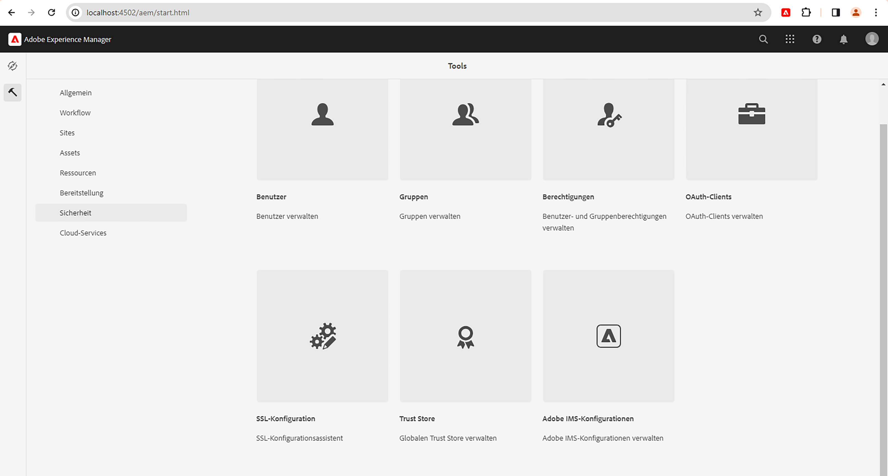
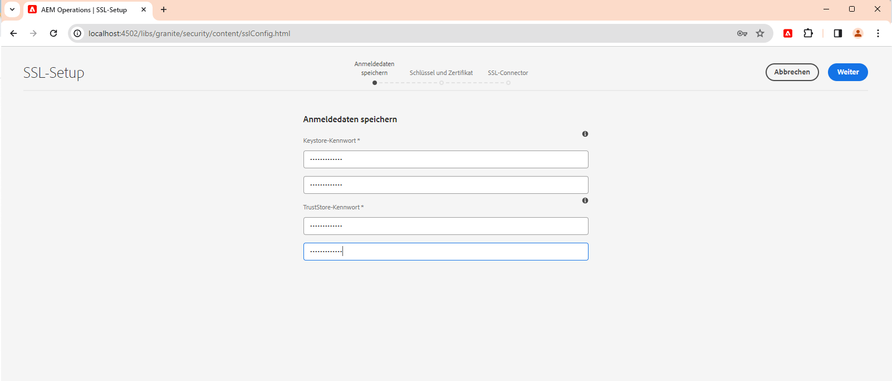
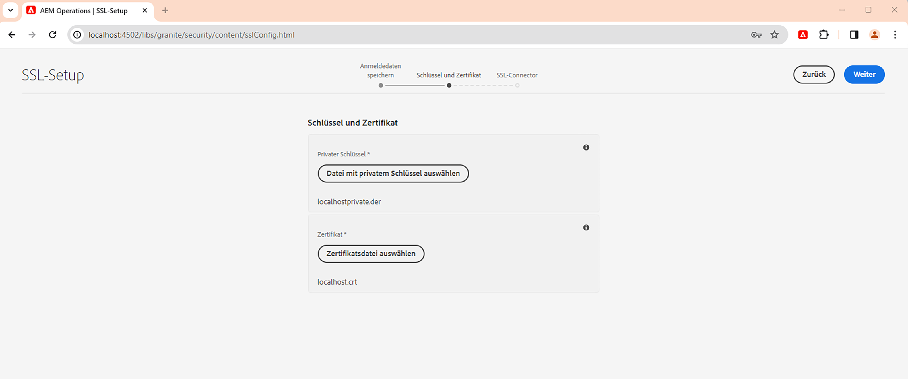
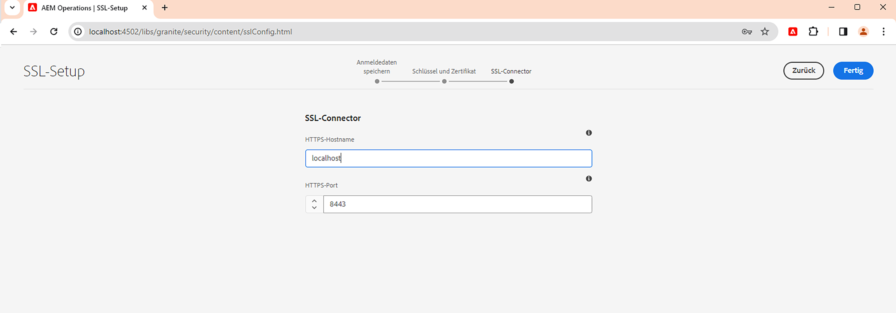
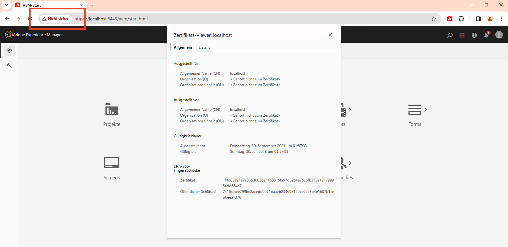

# Verwenden des SSL-Assistenten in AEM

Erfahren Sie, wie Sie SSL in Adobe Experience Manager einrichten, damit es mithilfe des integrierten SSL-Assistenten über HTTPS ausgeführt wird.

>[!VIDEO](https://video.tv.adobe.com/v/17993?quality=12&learn=on)


>[!NOTE]
>
>Für verwaltete Umgebungen ist es am besten, wenn die IT-Abteilung CA-vertrauenswürdige Zertifikate und Schlüssel bereitstellt.
>
>Selbstsignierte Zertifikate dürfen nur zu Entwicklungszwecken verwendet werden.

## Verwenden des SSL-Konfigurationsassistenten

Navigieren Sie zu __AEM-Autoreninstanz > Tools > Sicherheit > SSL-Konfiguration__ und öffnen Sie die __SSL-Konfigurationsassistent__.



### Erstellen von Store-Anmeldeinformationen

So erstellen Sie eine _Key Store_ mit `ssl-service` Systembenutzer und globale _Trust Store_, verwenden Sie die __Store-Anmeldedaten__ Assistent.

1. Geben Sie das Kennwort ein und bestätigen Sie das Kennwort für die __Key Store__ mit `ssl-service` Systembenutzer.
1. Geben Sie das Kennwort ein und bestätigen Sie das Kennwort für die globale __Trust Store__. Beachten Sie, dass es sich um einen systemweiten Trust Store handelt. Wenn er bereits erstellt wurde, wird das eingegebene Kennwort ignoriert.

   

### Hochladen von privatem Schlüssel und Zertifikat

So laden Sie die _privater Schlüssel_ und _SSL-Zertifikat_, verwenden Sie die __Schlüssel und Zertifikat__ Assistent.

In der Regel stellt Ihre IT-Abteilung das von einer Zertifizierungsstelle als vertrauenswürdig eingestufte Zertifikat und den Schlüssel bereit. Es kann jedoch auch ein selbst signiertes Zertifikat für __development__ und __testing__ verwendet werden.

Informationen zum Erstellen oder Herunterladen des selbstsignierten Zertifikats finden Sie unter [Selbstsignierter privater Schlüssel und Zertifikat](#self-signed-private-key-and-certificate).

1. Hochladen der __Privater Schlüssel__ im Format DER (Distinguished Encoding Rules). Im Gegensatz zu PEM enthalten DER-kodierte Dateien keine Nur-Text-Anweisungen wie `-----BEGIN CERTIFICATE-----`
1. Hochladen der zugehörigen __SSL-Zertifikat__ im `.crt` Format.

   

### Aktualisieren der SSL-Connector-Details

So aktualisieren Sie die _hostname_ und _port_ die __SSL-Connector__ Assistent.

1. Aktualisieren oder überprüfen Sie die __HTTPS-Hostname__ -Wert, sollte mit dem `Common Name (CN)` aus dem Zertifikat.
1. Aktualisieren oder überprüfen Sie die __HTTPS-Port__ -Wert.

   

### SSL-Setup überprüfen

1. Klicken Sie zum Überprüfen der SSL-Kommunikation auf die __Navigieren zur HTTPS-URL__ Schaltfläche.
1. Bei Verwendung eines selbstsignierten Zertifikats wird `Your connection is not private` Fehler.

   

## Selbstsignierter privater Schlüssel und Zertifikat

Die folgende ZIP-Datei enthält [!DNL DER] und [!DNL CRT] Dateien, die für die lokale Einrichtung AEM SSL erforderlich sind und nur für lokale Entwicklungszwecke bestimmt sind.

Die [!DNL DER]- und [!DNL CERT]-Dateien werden aus praktischen Gründen bereitgestellt und mithilfe der Schritte generiert, die im Abschnitt „Generieren eines privaten Schlüssels und eines selbstsignierten Zertifikats“ unten beschrieben werden.

Bei Bedarf lautet die Passphrase für die Zertifikatübergabe **admin**.

Dieser localhost - privater Schlüssel und selbstsigniertes certificate.zip (läuft Juli 2028 ab)

[Herunterladen der Zertifikatdatei](assets/use-the-ssl-wizard/certificate.zip)

### Generieren von privaten Schlüsseln und selbstsignierten Zertifikaten

Das obige Video zeigt die Einrichtung und Konfiguration von SSL auf einer AEM-Autoreninstanz mithilfe selbstsignierter Zertifikate. Die folgenden Befehle verwenden [[!DNL OpenSSL]](https://www.openssl.org/), um einen privaten Schlüssel und ein Zertifikat zu generieren, die in Schritt 2 des Assistenten verwendet werden sollen.

```shell
### Create Private Key
$ openssl genrsa -aes256 -out localhostprivate.key 4096

### Generate Certificate Signing Request using private key
$ openssl req -sha256 -new -key localhostprivate.key -out localhost.csr -subj '/CN=localhost'

### Generate the SSL certificate and sign with the private key, will expire one year from now
$ openssl x509 -req -extfile <(printf "subjectAltName=DNS:localhost") -days 365 -in localhost.csr -signkey localhostprivate.key -out localhost.crt

### Convert Private Key to DER format - SSL wizard requires key to be in DER format
$ openssl pkcs8 -topk8 -inform PEM -outform DER -in localhostprivate.key -out localhostprivate.der -nocrypt
```
