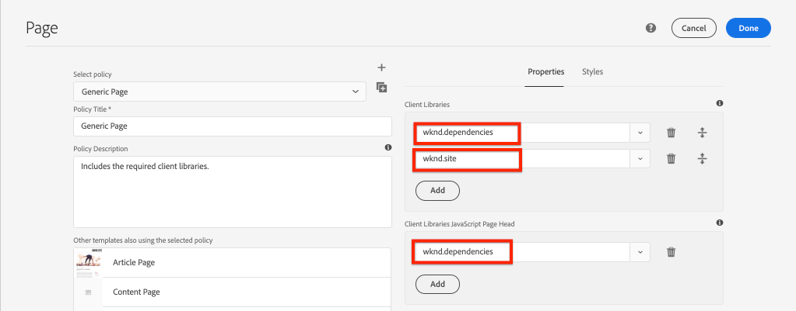

# Clientseitige Bibliotheken und Front-End-Workflow {#client-side-libraries}

Erfahren Sie, wie clientlibs und clientlibs zum Bereitstellen und Verwalten von CSS und JavaScript für eine Implementierung von Adobe Experience Manager (AEM) Sites verwendet werden. In diesem Lernprogramm wird auch erläutert, wie das [ui.frontend](https://docs.adobe.com/content/help/de-DE/experience-manager-core-components/using/developing/archetype/uifrontend.html)-Modul, ein entkoppeltes [Webpack](https://webpack.js.org/)-Projekt, in den End-to-End-Build-Prozess integriert werden kann.

## Voraussetzungen {#prerequisites}

Überprüfen Sie die erforderlichen Werkzeuge und Anweisungen zum Einrichten einer [lokalen Entwicklungs-Umgebung](overview.md#local-dev-environment).

Es wird außerdem empfohlen, das Tutorial [Komponentengrundlagen](component-basics.md#client-side-libraries) zu lesen, um die Grundlagen clientseitiger Bibliotheken und AEM zu verstehen.

### Starterprojekt

Sehen Sie sich den Basiscode an, auf dem das Lernprogramm basiert:

1. Klonen Sie das [github.com/adobe/aem-guides-wknd](https://github.com/adobe/aem-guides-wknd)-Repository.
1. Sehen Sie sich die Verzweigung `client-side-libraries/start` an.

   ```shell
   $ git clone git@github.com:adobe/aem-guides-wknd.git ~/code/aem-guides-wknd
   $ cd ~/code/aem-guides-wknd
   $ git checkout client-side-libraries/start
   ```

1. Stellen Sie mithilfe Ihrer Maven-Fähigkeiten eine Codebasis für eine lokale AEM bereit:

   ```shell
   $ cd ~/code/aem-guides-wknd
   $ mvn clean install -PautoInstallSinglePackage
   ```

Sie können den fertigen Code immer auf [GitHub](https://github.com/adobe/aem-guides-wknd/tree/client-side-libraries/solution) oder lokal prüfen, indem Sie zur Verzweigung `client-side-libraries/solution` wechseln.

## Vorgabe

1. Verstehen Sie, wie clientseitige Bibliotheken über eine bearbeitbare Vorlage auf eine Seite eingefügt werden.
1. Erfahren Sie, wie Sie das UI.Frontend-Modul und einen Webpack-Entwicklungsserver für die dedizierte Front-End-Entwicklung verwenden.
1. Machen Sie sich mit dem durchgängigen Arbeitsablauf für die Bereitstellung von kompiliertem CSS und JavaScript in einer Sites-Implementierung vertraut.

## {#what-you-will-build}

In diesem Kapitel fügen Sie einige Baseline-Stile für die WKND-Site und die Artikelseitenvorlage hinzu, um die Implementierung näher an die [UI-Designmodelle](assets/pages-templates/wknd-article-design.xd) heranzuführen. Sie verwenden einen erweiterten Front-End-Arbeitsablauf, um ein Webpack-Projekt in eine AEM Client-Bibliothek zu integrieren.

>[!VIDEO](https://video.tv.adobe.com/v/30359/?quality=12&learn=on)

## Hintergrund {#background}

Clientseitige Bibliotheken bieten einen Mechanismus zum Organisieren und Verwalten von CSS- und JavaScript-Dateien, die für eine AEM Sites-Implementierung erforderlich sind. Die grundlegenden Ziele für clientseitige Bibliotheken oder clientlibs sind:

1. CSS/JS in kleinen, diskreten Dateien speichern, um die Entwicklung und Wartung zu erleichtern
1. Verwalten von Abhängigkeiten von Drittanbieter-Frameworks auf organisierte Weise
1. Minimieren Sie die Anzahl der clientseitigen Anforderungen, indem Sie CSS/JS in eine oder zwei Anforderungen verketten.

Weitere Informationen zur Verwendung Client-seitiger Bibliotheken [finden Sie hier](https://docs.adobe.com/content/help/de-DE/experience-manager-65/developing/introduction/clientlibs.html).

Clientseitige Bibliotheken haben einige Einschränkungen. Vor allem ist die Unterstützung für gängige Front-End-Sprachen wie Sass, LESS und TypeScript eingeschränkt. Im Tutorial werden wir sehen, wie das **ui.frontend** Modul helfen kann, dies zu lösen.

Stellen Sie die Startercodebasis in einer lokalen AEM-Instanz bereit und navigieren Sie zu [http://localhost:4502/editor.html/content/wknd/us/en/magazine/guide-la-skateparks.html](http://localhost:4502/editor.html/content/wknd/us/en/magazine/guide-la-skateparks.html). Diese Seite ist derzeit nicht formatiert. Als Nächstes implementieren wir clientseitige Bibliotheken für die Marke WKND, um CSS und Javascript zur Seite hinzuzufügen.

## Clientseitige Bibliotheksorganisation {#organization}

Anschließend werden wir die Organisation der clientlibs durch das [AEM Projekt Archetype](https://docs.adobe.com/content/help/de-DE/experience-manager-core-components/using/developing/archetype/overview.html) generiert.


*Diagramm auf hoher Ebene Client-seitige Bibliotheksorganisation und Seiteninklusion*

>[!NOTE]
>
> Die folgende clientseitige Bibliotheksorganisation wird von AEM Project Archetype erzeugt, stellt aber lediglich einen Ausgangspunkt dar. Die Art und Weise, wie ein Projekt letztendlich eine Implementierung von CSS und JavaScript auf Sites verwaltet und bereitstellt, kann je nach Ressourcen, Fertigkeiten und Anforderungen drastisch variieren.

1. Öffnen Sie mithilfe von Eclipse oder einer anderen IDE das Modul **ui.apps**.
1. Erweitern Sie den Pfad `/apps/wknd/clientlibs`, um die vom Archetyp generierten clientlibs Ansicht.

   

   Wir werden diese clientlibs im Folgenden genauer untersuchen.

1. Inspect Sie die Eigenschaften von `clientlibs/clientlib-base`.

   **clientlib-** basstellt die Basisstufe von CSS und JavaScript dar, die für die Funktion der WKND-Site erforderlich ist. Beachten Sie die Eigenschaft `categories`, die auf `wknd.base` eingestellt ist. `categories` ist ein Tag-Mechanismus für clientlibs und ist, wie sie referenziert werden können.

   Beachten Sie die Eigenschaften `embed` und `String[]` der Werte. Die `embed`-Eigenschaft bettet andere clientlibs basierend auf ihrer Kategorie ein. **clientlib-** baseenthält alle erforderlichen Client-Bibliotheken der AEM Core Component. Dazu gehören Artefakte wie Javascript für das Karussell, Schnellsuchkomponenten, die funktionieren sollen. **clientlib-** basewill keine eigenen CSS und Javascript einbinden, sondern betten stattdessen einfach andere Client-Bibliotheken ein. **clientlib-** basebettet die  **clientlib-** gridclientlib mit der Kategorie von  `wknd.grid`.

   Beachten Sie, dass die `allowProxy`-Eigenschaft auf `true` eingestellt ist. Es empfiehlt sich, immer `allowProxy=true` auf clientlibs festzulegen. Die `allowProxy`-Eigenschaft ermöglicht es uns, die clientlibs mit unserem Anwendungscode unter `/apps` **aber** zu speichern und dann die clientlibs über einen Pfad mit dem Präfix `/etc.clientlibs` bereitzustellen, um zu vermeiden, dass Anwendungscode an Endbenutzer offen gelegt wird. Weitere Informationen über die Eigenschaft „allowProxy“ [finden Sie hier.](https://docs.adobe.com/content/help/en/experience-manager-65/developing/introduction/clientlibs.html#locating-a-client-library-folder-and-using-the-proxy-client-libraries-servlet).

1. Inspect Sie die Eigenschaften von `clientlibs/clientlib-grid`.

   **clientlib-** gridis, die für das Einbeziehen/Generieren des CSS verantwortlich sind, das für das  [Layout-](https://docs.adobe.com/content/help/de-DE/experience-manager-65/authoring/siteandpage/responsive-layout.html) Modedesign mit dem AEM Sites-Editor erforderlich ist. **clientlib-** gridhad eine auf  `wknd.grid` und wird über  **clientlib-base** eingebettet.

   Das Raster kann angepasst werden, um verschiedene Spaltenmengen und Haltepunkte zu verwenden. Als Nächstes werden die generierten Standard-Haltepunkte aktualisiert.

1. Aktualisieren Sie die Datei `/apps/wknd/clientlibs/clientlib-grid/less/grid.less`:

   ```css
   @import (once) "/libs/wcm/foundation/clientlibs/grid/grid_base.less";
   
   /* maximum amount of grid cells to be provided */
   @max_col: 12;
   @screen-small: 767px;
   @screen-medium: 1024px;
   @screen-large: 1200px;
   @gutter-padding: 14px;
   
   /* default breakpoint */
   .aem-Grid {
       .generate-grid(default, @max_col);
   }
   
   /* phone breakpoint */
   @media (max-width: @screen-small) {
       .aem-Grid {
           .generate-grid(phone, @max_col);
       }
   }
   /* tablet breakpoint */
   @media (min-width: (@screen-small + 1)) and (max-width: @screen-medium) {
       .aem-Grid {
           .generate-grid(tablet, @max_col);
       }
   }
   
   .aem-GridColumn {
       padding: 0 @gutter-padding;
   }
   
   .responsivegrid.aem-GridColumn {
       padding-left: 0;
       padding-right: 0;
   }
   ```

   Dadurch werden die Haltepunkte entsprechend unseren in `/ui.content/src/main/content/jcr_root/conf/wknd/settings/wcm/templates/article-page-template/structure/.content.xml` festgelegten VorlagenHaltepunkten geändert.

   Beachten Sie, dass diese Datei tatsächlich auf eine `grid_base.less`-Datei unter `/libs` verweist, die ein benutzerdefiniertes Mixin enthält, um das Raster zu generieren.

1. Inspect Sie die Eigenschaften für `clientlibs/clientlib-site`.

   **clientlib-** site enthält alle Site-spezifischen Stile für die Marke WKND. Beachten Sie die Kategorie von `wknd.site`. Die CSS und das Javascript, die diese clientlib erzeugen, werden tatsächlich im `ui.frontend` Modul gepflegt. Wir werden diese Integration als Nächstes untersuchen.

1. Inspect Sie die Eigenschaften für `clientlibs/clientlib-dependencies`.

   **clientlib-** dependenciesis ist zum Einbetten von Drittanbieterabhängigkeiten gedacht. Es handelt sich um eine separate clientlib, sodass sie bei Bedarf oben auf der HTML-Seite geladen werden kann. Beachten Sie die Kategorie von `wknd.dependencies`. Die CSS und das Javascript, die diese clientlib erzeugen, werden tatsächlich im `ui.frontend` Modul gepflegt. Wir werden diese Integration später im Tutorial untersuchen.

## Verwenden des Moduls ui.frontend {#ui-frontend}

Als Nächstes wird die Verwendung des Moduls **[ui.frontend](https://docs.adobe.com/content/help/en/experience-manager-core-components/using/developing/archetype/uifrontend.html)** erforscht.

### Motivation

Clientseitige Bibliotheken haben einige Einschränkungen bei der Unterstützung von Sprachen wie [Sass](https://sass-lang.com/) oder [TypeScript](https://www.typescriptlang.org/). Es hat auch eine Explosion von Open-Source-Tools wie [NPM](https://www.npmjs.com/) und [webpack](https://webpack.js.org/) gegeben, die die Front-End-Entwicklung beschleunigen und optimieren.

Die Grundidee hinter dem Modul **ui.frontend** besteht darin, großartige Tools wie NPM und Webpack zu verwenden, um einen Großteil der Front-End-Entwicklung zu verwalten. Ein wichtiges Integrationselement, das in das Modul **ui.frontend** integriert ist, [aem-clientlib-generator](https://github.com/wcm-io-frontend/aem-clientlib-generator) nimmt die kompilierten CSS- und JS-Artefakte eines Webpack/npm-Projekts und wandelt sie in AEM clientseitigen Bibliotheken um. Dies gibt einem Front-End-Entwickler mehr Freiheit, verschiedene Werkzeuge und Technologien auszuwählen.


### Verwenden

Jetzt fügen wir einige Basisstile für die Marke WKND hinzu, indem wir einige Sass-Dateien (`.scss` Erweiterung) über das Modul **ui.frontend** hinzufügen.

1. Öffnen Sie das Modul **ui.frontend** und navigieren Sie zu `src/main/webpack/base/sass`.

   

1. Erstellen Sie eine neue Datei mit dem Namen `_variables.scss` unter dem Ordner `src/main/webpack/base/sass`.
1. Füllen Sie `_variables.scss` wie folgt:

   ```scss
   //== Colors
   //
   //## Gray and brand colors for use across theme.
   
   $black:                  #202020;
   $gray:                   #696969;
   $gray-light:             #EBEBEB;
   $gray-lighter:           #F7F7F7;
   $white:                  #ffffff;
   $yellow:                 #FFE900;
   $blue:                   #0045FF;
   $pink:                   #FF0058;
   
   $brand-primary:           $yellow;
   
   //== Layout
   $gutter-padding: 14px;
   $max-width: 1164px;
   $max-body-width: 1680px;
   $screen-xsmall: 475px;
   $screen-small: 767px;
   $screen-medium: 1024px;
   $screen-large: 1200px;
   
   //== Scaffolding
   //
   //## Settings for some of the most global styles.
   $body-bg:                   $white;
   $text-color:                $black;
   $text-color-inverse:        $gray-light;
   
   $brand-secondary:           $black;
   
   $brand-third:               $gray-light;
   $link-color:                $blue;
   $link-hover-color:          $link-color;
   $link-hover-decoration:     underline;
   $nav-link:                  $black;
   $nav-link-inverse:          $gray-light;
   
   //== Typography
   //
   //## Font, line-height, and color for body text, headings, and more.
   
   $font-family-sans-serif:  "Source Sans Pro", "Helvetica Neue", Helvetica, Arial, sans-serif;
   $font-family-serif:       "Asar",Georgia, "Times New Roman", Times, serif;
   $font-family-base:        $font-family-sans-serif;
   
   $font-size-base:          18px;
   $font-size-large:         24px;
   $font-size-xlarge:        48px;
   $font-size-medium:        18px;
   $font-size-small:         14px;
   $font-size-xsmall:        12px;
   
   $font-size-h1:            40px;
   $font-size-h2:            36px;
   $font-size-h3:            24px;
   $font-size-h4:            16px;
   $font-size-h5:            14px;
   $font-size-h6:            10px;
   
   $line-height-base:        1.5;
   $line-height-computed:    floor(($font-size-base * $line-height-base)); // ~20px
   
   $font-weight-light:      300;
   $font-weight-normal:     normal;
   $font-weight-semi-bold:  400;
   $font-weight-bold:       600;
   ```

   Mit Sass können wir Variablen erstellen, die dann in verschiedenen Dateien verwendet werden können, um Konsistenz zu gewährleisten. Beachten Sie die Schriftfamilien. Später in der Übung werden wir sehen, wie wir einen Aufruf an Google Web-Schriftarten, um diese Schriftarten verwenden können.

1. Erstellen Sie eine weitere Datei mit dem Namen `_elements.scss` unter `src/main/webpack/base/sass` und füllen Sie sie wie folgt aus:

   ```scss
   body {
       background-color: $body-bg;
       font-family: $font-family-base;
       margin: 0;
       padding: 0;
       font-size: $font-size-base;
       text-align: left;
       color: $text-color;
       line-height: $line-height-base;
   
       .root {
           max-width: $max-width;
           margin: 0 auto;
       }
   }
   
   // Headings
   // -------------------------
   
   h1, h2, h3, h4, h5, h6,
   .h1, .h2, .h3, .h4, .h5, .h6 {
       line-height: $line-height-base;
       color: $text-color;
   }
   
   h1, .h1,
   h2, .h2,
   h3, .h3 {
       font-family: $font-family-serif;
       font-weight: $font-weight-normal;
       margin-top: $line-height-computed;
       margin-bottom: ($line-height-computed / 2);
   }
   
   h4, .h4,
   h5, .h5,
   h6, .h6 {
       font-family: $font-family-sans-serif;
       text-transform: uppercase;
       font-weight: $font-weight-bold;
   }
   
   h1, .h1 { font-size: $font-size-h1; }
   h2, .h2 { font-size: $font-size-h2; }
   h3, .h3 { font-size: $font-size-h3; }
   h4, .h4 { font-size: $font-size-h4; }
   h5, .h5 { font-size: $font-size-h5; }
   h6, .h6 { font-size: $font-size-h6; }
   
   a {
       color: $link-color;
       text-decoration: none;
   }
   
   h1 a, h2 a, h3 a {
       color: $pink; /* for wednesdays :-) */
   }
   
   // Body text
   // -------------------------
   
   p {
       margin: 0 0 ($line-height-computed / 2);
       font-size: $font-size-base;
       line-height: $line-height-base + 1;
       text-align: justify;
   }
   ```

   Beachten Sie, dass die Datei `_elements.scss` die Variablen in `_variables.scss` verwendet.

1. Aktualisieren Sie `_shared.scss` unter `src/main/webpack/base/sass`, um die Dateien `_elements.scss` und `_variables.scss` einzuschließen.

   ```css
   @import './variables';
   @import './elements';
   ```

1. Öffnen Sie ein Befehlszeilenterminal und installieren Sie das Modul **ui.frontend** mithilfe des Befehls `npm install`:

   ```shell
   $ cd ~/code/aem-guides-wknd/ui.frontend
   $ npm install
   ```

   >[!NOTE]
   >
   >`npm install` muss nur einmal ausgeführt werden, nach einem neuen Klon oder einer Generation des Projekts.

1. Erstellen Sie im selben Terminal das Modul **ui.frontend** und stellen Sie es mithilfe des Befehls `npm run dev` bereit:

   ```shell
   $ npm run dev
   ...
   Entrypoint site = clientlib-site/css/site.css clientlib-site/js/site.js
   Entrypoint dependencies = clientlib-dependencies/js/dependencies.js
   start aem-clientlib-generator
   ...
   copy: dist/clientlib-site/css/site.css ../ui.apps/src/main/content/jcr_root/apps/wknd/clientlibs/clientlib-site/css/site.css
   ```

   Der Befehl `npm run dev` sollte den Quellcode für das Webpack-Projekt erstellen und kompilieren und schließlich die **clientlib-site** und **clientlib-Abhängigkeiten** im Modul **ui.apps** füllen.

   >[!NOTE]
   >
   >Es gibt auch ein `npm run prod`-Profil, das JS und CSS minimiert. Dies ist die Standardkompilierung, wenn der Webpack-Build über Maven ausgelöst wird. Weitere Informationen zum Modul [ui.frontend finden Sie hier](https://docs.adobe.com/content/help/en/experience-manager-core-components/using/developing/archetype/uifrontend.html).

1. Inspect Sie die Datei `site.css` unter `ui.frontend/dist/clientlib-site/css/site.css`. Beachten Sie, dass das CSS hauptsächlich aus Inhalten der zuvor erstellten `_elements.scss`-Datei besteht, die Variablen jedoch durch tatsächliche Werte ersetzt wurden.

   

1. Inspect Sie die Datei `ui.frontend/clientlib.config.js`. Dies ist die Konfigurationsdatei für ein npm-Plugin, [aem-clientlib-generator](https://github.com/wcm-io-frontend/aem-clientlib-generator). **aem-clientlib-** generatoris ist das Tool, das für die Transformation des kompilierten CSS/JavaScript verantwortlich ist und es in das  **ui.** appsmodul kopiert.

1. Inspect Sie die Datei `site.css` im Modul **ui.apps** unter `ui.apps/src/main/content/jcr_root/apps/wknd/clientlibs/clientlib-site/css/site.css`. Dies sollte eine identische Kopie der Datei `site.css` aus dem Modul **ui.frontend** sein. Nun, da es sich im Modul **ui.apps** befindet, kann es in AEM bereitgestellt werden.

   

   >[!NOTE]
   >
   > Da **clientlib-site** während der Buildzeit entweder mit **npm** oder **maven** kompiliert wird, kann es im **ui.apps**-Modul tatsächlich aus der Quellcodeverwaltung ignoriert werden. Inspect Sie die Datei `.gitignore` unter **ui.apps**.

>[!CAUTION]
>
> Die Verwendung des Moduls **ui.frontend** ist möglicherweise nicht für alle Projekte erforderlich. Das Modul **ui.frontend** fügt zusätzliche Komplexität hinzu und wenn es nicht notwendig/wünschenswert ist, einige dieser erweiterten Front-End-Tools (Sass, Webpack, npm...) zu verwenden, kann es zu Übertötung kommen. Aus diesem Grund wird es als optionaler Teil des AEM Project Archetype betrachtet und die Verwendung von standardmäßigen clientseitigen Bibliotheken und Vanille CSS und JavaScript wird weiterhin vollständig unterstützt.

## Seiten- und Vorlageninklusion {#page-inclusion}

Als Nächstes werden wir prüfen, wie das Projekt so eingerichtet ist, dass die clientlibs in AEM Vorlagen/Seiten aufgenommen werden. Eine gängige Best Practice bei der Webentwicklung ist, CSS in die HTML-Kopfzeile `<head>` und JavaScript direkt einzuschließen, bevor das `</body>`-Tag geschlossen wird.

1. Navigieren Sie im Modul **ui.apps** zu `ui.apps/src/main/content/jcr_root/apps/wknd/components/structure/page`.

   

   Dies ist die Komponente `page`, die zum Rendern aller Seiten in der WKND-Implementierung verwendet wird.

1. Öffnen Sie die Datei `customheaderlibs.html`. Beachten Sie die Zeilen `${clientlib.css @ categories='wknd.base'}`. Dies bedeutet, dass das CSS für die clientlib mit der Kategorie `wknd.base` über diese Datei eingeschlossen wird, einschließlich **clientlib-base** in der Kopfzeile aller Seiten.

1. Aktualisieren Sie `customheaderlibs.html`, um einen Verweis auf Google-Schriftstile einzuschließen, den wir zuvor im Modul **ui.frontend** angegeben haben. Auch ContextHub werden wir vorerst kommentieren...

   ```html
   <link href="//fonts.googleapis.com/css?family=Source+Sans+Pro:400,600|Asar&display=swap" rel="stylesheet">
   <sly data-sly-use.clientLib="/libs/granite/sightly/templates/clientlib.html"
    data-sly-call="${clientlib.css @ categories='wknd.base'}"/>
   
   <!--/* Include Context Hub
   <sly data-sly-resource="${'contexthub' @ resourceType='granite/contexthub/components/contexthub'}"/>
   */-->
   ```

1. Inspect Sie die Datei `customfooterlibs.html`. Diese Datei, z. B. `customheaderlibs.html` soll durch die Implementierung von Projekten überschrieben werden. Hier bedeutet die Zeile `${clientlib.js @ categories='wknd.base'}`, dass das JavaScript von **clientlib-base** unten auf allen Seiten eingeschlossen wird.

1. Erstellen und Bereitstellen des Projekts auf einer lokalen AEM mit Maven:

   ```shell
   $ cd ~/code/aem-guides-wknd
   $ mvn clean install -PautoInstallSinglePackage
   ```

1. Gehen Sie zu den WKND-Vorlagen unter [http://localhost:4502/libs/wcm/core/content/sites/templates.html/conf/wknd](http://localhost:4502/libs/wcm/core/content/sites/templates.html/conf/wknd).

1. Wählen Sie die Vorlage **Artikelseite** aus und öffnen Sie sie im Vorlageneditor.

   

1. Klicken Sie auf das Symbol **Seiteninformationen** und wählen Sie im Menü **Seitenrichtlinie** aus, um das Dialogfeld **Seitenrichtlinie** zu öffnen.

   

   *Seiteninformationen > Seitenrichtlinie*

1. Beachten Sie, dass die Kategorien für `wknd.dependencies` und `wknd.site` hier aufgeführt sind. Standardmäßig werden clientlibs, die über die Seitenrichtlinie konfiguriert wurden, aufgeteilt, um die CSS in den Seitenkopf und das JavaScript am Textende einzuschließen. Auf Wunsch können Sie explizit Listen zum Laden des clientlib JavaScript im Seitenkopf vornehmen. Dies ist bei `wknd.dependencies` der Fall.

   

   >[!NOTE]
   >
   > Es ist auch möglich, direkt auf das `wknd.site`- oder `wknd.dependencies`-Skript von der Seitenkomponente zu verweisen, indem das `customheaderlibs.html`- oder `customfooterlibs.html`-Skript verwendet wird, wie wir es zuvor für das `wknd.base`-clientlib gesehen haben. Die Verwendung der Vorlage bietet eine gewisse Flexibilität, da Sie auswählen können, welche clientlibs pro Vorlage verwendet werden. Beispiel: Sie haben eine sehr schwere JavaScript-Bibliothek, die nur für eine ausgewählte Vorlage verwendet wird.

1. Navigieren Sie zur Seite **LA Skateparks**, die mit der **Article Page Template** erstellt wurde: [http://localhost:4502/editor.html/content/wknd/us/en/magazine/guide-la-skateparks.html](http://localhost:4502/editor.html/content/wknd/us/en/magazine/guide-la-skateparks.html). Sie sollten einen Unterschied in den Schriftarten und einige grundlegende Stile sehen, die angewendet werden, um anzuzeigen, dass die im Modul **ui.frontend** erstellte CSS funktioniert.

1. Klicken Sie auf das Symbol **Seiteninformationen** und wählen Sie im Menü **Ansicht als veröffentlicht** aus, um die Artikelseite außerhalb des AEM-Editors zu öffnen.

   

1. Ansicht der Seitenquelle von [http://localhost:4502/content/wknd/us/en/magazine/guide-la-skateparks.html?wcmmode=disabled](http://localhost:4502/content/wknd/us/en/magazine/guide-la-skateparks.html?wcmmode=disabled) und Sie sollten die folgenden clientlib-Verweise in `<head>` sehen können:

   ```html
   <head>
   ...
   <link rel="stylesheet" href="/etc.clientlibs/wknd/clientlibs/clientlib-base.css" type="text/css">
   <script type="text/javascript" src="/etc.clientlibs/wknd/clientlibs/clientlib-dependencies.js"></script>
   <link rel="stylesheet" href="/etc.clientlibs/wknd/clientlibs/clientlib-dependencies.css" type="text/css">
   <link rel="stylesheet" href="/etc.clientlibs/wknd/clientlibs/clientlib-site.css" type="text/css">
   ...
   </head>
   ```

   Beachten Sie, dass clientlibs den Proxy `/etc.clientlibs`-Endpunkt verwenden. Am unteren Seitenrand sollte außerdem die folgende clientlib-Datei angezeigt werden:

   ```html
   ...
   <script type="text/javascript" src="/etc.clientlibs/wknd/clientlibs/clientlib-site.js"></script>
   <script type="text/javascript" src="/etc.clientlibs/wknd/clientlibs/clientlib-base.js"></script>
   ...
   </body>
   ```

   >[!WARNING]
   >
   >Auf der Seite &quot;Veröffentlichen&quot;ist es wichtig, dass die Client-Bibliotheken von **nicht** von **/apps** bereitgestellt werden, da dieser Pfad aus Sicherheitsgründen mithilfe des [Dispatcher-Filterabschnitts](https://docs.adobe.com/content/help/en/experience-manager-dispatcher/using/configuring/dispatcher-configuration.html#example-filter-section) eingeschränkt werden sollte. Die [allowProxy-Eigenschaft](https://docs.adobe.com/content/help/en/experience-manager-65/developing/introduction/clientlibs.html#locating-a-client-library-folder-and-using-the-proxy-client-libraries-servlet) der Client-Bibliothek stellt sicher, dass CSS und JS von **/etc.clientlibs** bereitgestellt werden.

## Webpack DevServer {#webpack-dev-server}

In den vorherigen Übungen waren wir in der Lage, mehrere Sass-Dateien im Modul **ui.frontend** zu aktualisieren und durch einen Build-Prozess sehen Sie schließlich diese Änderungen in AEM. Als Nächstes betrachten wir die Nutzung eines [webpack-dev-servers](https://webpack.js.org/configuration/dev-server/), um unsere Front-End-Stile schnell zu entwickeln.

>[!VIDEO](https://video.tv.adobe.com/v/30352/?quality=12&learn=on)

Nachfolgend sind die Schritte auf hoher Ebene aufgeführt, die im Video gezeigt werden:

1. Beginn Sie den Webpack-Dev-Server, indem Sie den folgenden Befehl aus dem Modul **ui.frontend** ausführen:

   ```shell
   $ cd ~/code/aem-guides-wknd/ui.frontend/
   $ npm start
   
   > aem-maven-archetype@1.0.0 start code/aem-guides-wknd/ui.frontend
   > webpack-dev-server --open --config ./webpack.dev.js
   ```

1. Dadurch sollte unter [http://localhost:8080/](http://localhost:8080/) ein neues Browserfenster mit statischem Markup geöffnet werden.
1. Kopieren Sie die Seitenquelle der Artikelseite LA skatepark unter [http://localhost:4502/content/wknd/us/en/magazine/guide-la-skateparks.html?wcmmode=disabled](http://localhost:4502/content/wknd/us/en/magazine/guide-la-skateparks.html?wcmmode=disabled).
1. Fügen Sie das kopierte Markup aus AEM in das `index.html`-Modul im **ui.frontend**-Modul unter `src/main/webpack/static` ein.
1. Bearbeiten Sie das kopierte Markup und entfernen Sie alle Verweise auf **clientlib-site** und **clientlib-Abhängigkeiten**:

   ```html
   <!-- remove -->
   <script type="text/javascript" src="/etc.clientlibs/wknd/clientlibs/clientlib-dependencies.js"></script>
   <link rel="stylesheet" href="/etc.clientlibs/wknd/clientlibs/clientlib-dependencies.css" type="text/css">
   <link rel="stylesheet" href="/etc.clientlibs/wknd/clientlibs/clientlib-site.css" type="text/css">
   ...
   <script type="text/javascript" src="/etc.clientlibs/wknd/clientlibs/clientlib-site.js"></script>
   ```

   Wir können diese Verweise entfernen, da der Webpack-Dev-Server diese Artefakte automatisch generiert.

1. Bearbeiten Sie die `.scss`-Dateien und sehen Sie die Änderungen, die automatisch im Browser angezeigt werden.
1. Überprüfen Sie die Datei `/aem-guides-wknd.ui.frontend/webpack.dev.js`. Dies enthält die Webpack-Konfiguration, die zum Beginn des Webpack-dev-Servers verwendet wird. Beachten Sie, dass es die Pfade `/content` und `/etc.clientlibs` aus einer lokal ausgeführten Instanz von AEM proximiert. So werden die Bilder und andere clientlibs (die nicht vom **ui.frontend**-Code verwaltet werden) verfügbar gemacht.

   >[!CAUTION]
   >
   > Die Image-src des statischen Markups verweist auf eine Live-Bildkomponente auf einer lokalen AEM. Bilder werden beschädigt angezeigt, wenn sich der Pfad zum Bild ändert, wenn AEM nicht gestartet wird oder wenn der Browser sich nicht bei der lokalen AEM angemeldet hat.
1. Sie können **stop** den Webpack-Server über die Befehlszeile anhalten, indem Sie `CTRL+C` eingeben.

## Zusammenstellen {#putting-it-together}

Der Schwerpunkt dieses Tutorials liegt auf clientseitigen Bibliotheken und potenziellen Front-End-Workflows, die in AEM integriert werden können. Vor diesem Hintergrund beschleunigen wir die Implementierung durch die Installation von [client-side-libraries-final-styles.zip](assets/client-side-libraries/client-side-libraries-final-styles.zip), das einige Standardstile für Kernkomponenten bereitstellt, die in der Artikelseitenvorlage verwendet werden:

* [Breadcrumb](https://docs.adobe.com/content/help/de/experience-manager-core-components/using/components/breadcrumb.html)
* [Download](https://docs.adobe.com/content/help/en/experience-manager-core-components/using/components/download.html)
* [Bild](https://docs.adobe.com/content/help/de-DE/experience-manager-core-components/using/components/image.html)
* [Liste](https://docs.adobe.com/content/help/de/experience-manager-core-components/using/components/list.html)
* [Navigation](https://docs.adobe.com/content/help/de/experience-manager-core-components/using/components/navigation.html)
* [Schnellsuche](https://docs.adobe.com/content/help/de/experience-manager-core-components/using/components/quick-search.html)
* [Trennzeichen](https://docs.adobe.com/content/help/en/experience-manager-core-components/using/components/separator.html)

>[!VIDEO](https://video.tv.adobe.com/v/30351/?quality=12&learn=on)

Nachfolgend sind die Schritte auf hoher Ebene aufgeführt, die im Video gezeigt werden:

1. Laden Sie [clientseitige Bibliotheken-final-styles.zip](assets/client-side-libraries/client-side-libraries-final-styles.zip) herunter und entpacken Sie die Inhalte unter `ui.frontend/src/main/webpack`. Der Inhalt der ZIP-Datei sollte die folgenden Ordner überschreiben:

   ```plain
   /src/main/webpack
            /base
            /components
            /resources
   ```

1. Vorschau der neuen Stile mithilfe des Webpack-Dev-Servers:

   ```shell
    $ cd ~/code/aem-guides-wknd/ui.frontend/
    $ npm start
   
    > aem-maven-archetype@1.0.0 start code/aem-guides-wknd/ui.frontend
    > webpack-dev-server --open --config ./webpack.dev.js
   ```

1. Stellen Sie die Code-Basis in einer lokalen AEM-Instanz bereit, um die neuen Stile anzuzeigen, die auf den Artikel des LA-Skate-Parks angewendet wurden:

   ```shell
    $ cd ~/code/aem-guides-wknd
    $ mvn -PautoInstallSinglePackage clean install
   ```

## Herzlichen Glückwunsch! {#congratulations}

Herzlichen Glückwunsch, die Artikelseite hat jetzt einige konsistente Stile, die mit der Marke WKND übereinstimmen und Sie sind mit dem **ui.frontend** Modul vertraut!

### Nächste Schritte {#next-steps}

Erfahren Sie, wie Sie individuelle Stile implementieren und Kernkomponenten mit dem Stil-System des Experience Managers wiederverwenden. [Entwickeln mit dem Style ](style-system.md) SystemCovers unter Verwendung des Style Systems zur Erweiterung der Core-Komponenten mit markenspezifischem CSS und erweiterten Richtlinienkonfigurationen des Vorlagen-Editors.

Ansicht des fertigen Codes auf [GitHub](https://github.com/adobe/aem-guides-wknd) oder lokale Überprüfung und Bereitstellung des Codes in der Git-Klammer `client-side-libraries/solution`.

1. Klonen Sie das [github.com/adobe/aem-wknd-guides](https://github.com/adobe/aem-guides-wknd)-Repository.
1. Sehen Sie sich die Verzweigung `client-side-libraries/solution` an.

## Zusätzliche Tools und Ressourcen {#additional-resources}

### aemed {#develop-aemfed}

[**aemfedis**](https://aemfed.io/) ist ein Open-Source-Befehlszeilenwerkzeug, das zur Beschleunigung der Front-End-Entwicklung verwendet werden kann. Es wird mit [aemsync](https://www.npmjs.com/package/aemsync), [BrowserSync](https://www.npmjs.com/package/browser-sync) und [Sling Log Tracer](https://sling.apache.org/documentation/bundles/log-tracers.html) betrieben.

Auf hoher Ebene ist **aemfeed** so ausgelegt, dass Dateiänderungen im **ui.apps**-Modul überwacht und automatisch direkt mit einer laufenden AEM synchronisiert werden. Auf der Grundlage der Änderungen wird ein lokaler Browser automatisch aktualisiert, was die Entwicklung des Front-End beschleunigt. Es wurde auch für die Verwendung mit Sling Log Tracker entwickelt, um serverseitige Fehler automatisch direkt im Terminal anzuzeigen.

Wenn Sie im Modul **ui.apps** viel Arbeit verrichten, HTML-Skripte ändern und benutzerdefinierte Komponenten erstellen, kann **aemfeed** ein sehr leistungsstarkes Werkzeug sein, das Sie verwenden können. [Die vollständige Dokumentation finden Sie hier.](https://github.com/abmaonline/aemfed).

### Debuggen clientseitiger Bibliotheken {#debugging-clientlibs}

Bei verschiedenen Methoden von **Kategorien** und **embetten**, um mehrere Client-Bibliotheken einzuschließen, kann es schwerfällig sein, eine Fehlerbehebung durchzuführen. AEM stellt mehrere Hilfsmittel zur Verfügung. Eines der wichtigsten Werkzeuge ist **Client-Bibliotheken neu erstellen**, was AEM zwingt, alle LESS-Dateien neu zu kompilieren und die CSS zu generieren.

* [**Dump Libs**](http://localhost:4502/libs/granite/ui/content/dumplibs.html)  - Liste aller in der AEM Instanz registrierten Client-Bibliotheken.  `<host>/libs/granite/ui/content/dumplibs.html`

* [**Testausgabe**](http://localhost:4502/libs/granite/ui/content/dumplibs.test.html)  - ermöglicht es dem Benutzer, die erwartete HTML-Ausgabe von clientlib auf der Grundlage der Kategorie anzuzeigen.  `<host>/libs/granite/ui/content/dumplibs.test.html`

* [**Überprüfung**](http://localhost:4502/libs/granite/ui/content/dumplibs.validate.html)  der Abhängigkeiten von Bibliotheken: hebt alle Abhängigkeiten oder eingebetteten Kategorien hervor, die nicht gefunden werden können.  `<host>/libs/granite/ui/content/dumplibs.validate.html`

* [**Client-Bibliotheken**](http://localhost:4502/libs/granite/ui/content/dumplibs.rebuild.html)  neu erstellen: Ermöglicht es einem Benutzer, AEM zu erzwingen, alle Client-Bibliotheken neu zu erstellen oder den Cache der Client-Bibliotheken zu ungültigen. Dieses Tool ist besonders effektiv, wenn es mit LESS entwickelt wird, da dies AEM zwingen kann, die generierte CSS erneut zu kompilieren. Im Allgemeinen ist es effektiver, Caches zu ungültigen und dann eine Seitenaktualisierung durchzuführen, anstatt alle Bibliotheken neu zu erstellen. `<host>/libs/granite/ui/content/dumplibs.rebuild.html`


