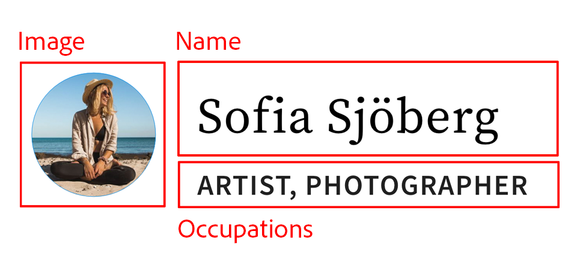
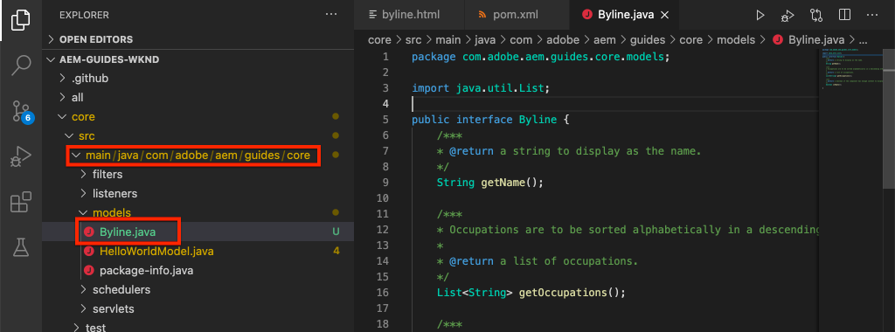

# Benutzerdefinierte Komponente {#custom-component}

In diesem Lernprogramm wird die End-to-End-Erstellung einer benutzerdefinierten AEM-Byline-Komponente behandelt, die Inhalte anzeigt, die in einem Dialog verfasst wurden, und die Entwicklung eines Sling-Modells untersucht, um Geschäftslogik zu kapseln, die die HTML-Datei der Komponente ausfüllt.

## Voraussetzungen {#prerequisites}

Überprüfen Sie die erforderlichen Werkzeuge und Anleitungen zum Einrichten einer [lokalen Entwicklungs-Umgebung](overview.md#local-dev-environment).

### Starterprojekt

>[!NOTE]
>
> Wenn Sie bereits in früheren Teilen des Tutorials verfolgt haben, werden Sie feststellen, dass das Startprojekt für dieses Kapitel die Implementierung beschleunigt. Es enthält einige weitere Vorlagen und viel mehr Inhalt. Als Bonus können Sie den neuen Inhalt und andere Bereiche der Implementierung außerhalb der benutzerdefinierten Komponentenentwicklung erkunden.

Sehen Sie sich den Basiscode an, auf dem das Lernprogramm basiert:

1. Klonen Sie das [github.com/adobe/aem-guides-wknd](https://github.com/adobe/aem-guides-wknd) -Repository.
1. Sehen Sie sich die `custom-component/start` Verzweigung an

   ```shell
   $ git clone git@github.com:adobe/aem-guides-wknd.git ~/code/aem-guides-wknd
   $ cd ~/code/aem-guides-wknd
   $ git checkout custom-component/start
   ```

1. Stellen Sie mithilfe Ihrer Maven-Fähigkeiten eine Codebasis für eine lokale AEM bereit:

   ```shell
   $ cd ~/code/aem-guides-wknd
   $ mvn clean install -PautoInstallSinglePackage
   ```

Sie können den fertigen Code immer auf [GitHub](https://github.com/adobe/aem-guides-wknd/tree/custom-component/solution) Ansicht oder den Code lokal auschecken, indem Sie zur Verzweigung wechseln `custom-component/solution`.

## Vorgabe

1. Verstehen Sie, wie Sie eine benutzerdefinierte AEM-Komponente erstellen.
1. Erfahren Sie, wie Sie Geschäftslogik mit Sling-Modellen einbinden können
1. Verstehen Sie, wie Sie ein Sling-Modell aus einem HTML-Skript verwenden.

## Was Sie erstellen {#byline-component}

>[!VIDEO](https://video.tv.adobe.com/v/30181/?quality=12&learn=on)

In diesem Teil des WKND-Tutorials wird eine Autorenzeilenkomponente erstellt, mit der verfasste Informationen zum Beitragenden eines Artikels angezeigt werden.


*Visuelles Design der Autorenkomponente, bereitgestellt vom WKND-Designteam*

Die Implementierung der Komponente &quot;Byline&quot;umfasst ein Dialogfeld, das den byline-Inhalt erfasst, sowie ein benutzerdefiniertes Sling-Modell, das die folgenden Elemente abruft:

* Name
* Bild
* Berufe

für die Anzeige durch ein HTML-Skript, das den HTML-Code wiedergibt, den der Browser schließlich anzeigt.



*Dekomprimierung der Autorenkomponente*

## Komponente &quot;Autorenzeile erstellen&quot; {#create-byline-component}

Erstellen Sie zunächst die Knotenstruktur der Byline-Komponente und definieren Sie ein Dialogfeld. Dies stellt die Komponente in AEM dar und definiert implizit den Ressourcentyp der Komponente nach ihrem Speicherort im JCR.

Das Dialogfeld zeigt die Schnittstelle an, über die Autoren Inhalte bereitstellen können. Bei dieser Implementierung wird die **Image** -Komponente der AEM WCM-Kernkomponente für das Authoring und Rendering des Bildes der Autorenzeile verwendet, sodass sie als Komponente festgelegt wird `sling:resourceSuperType`.

### Komponentenknoten erstellen {#create-component-node}

1. Navigieren Sie im Modul **ui.apps** zu einem neuen Knoten mit dem Namen `/apps/wknd/components/content` byline **des Typs** und erstellen Sie ihn `cq:Component`.

   

1. Add the following properties to the Byline component&#39;s `cq:Component` node.

   ```plain
   jcr:title = Byline
   jcr:description = Displays a contributor's byline.
   componentGroup = WKND.Content
   sling:resourceSuperType =  core/wcm/components/image/v2/image
   ```

   

   Die Ergebnisse in dieser `.content.xml` XML:

   ```xml
   <?xml version="1.0" encoding="UTF-8"?>
   <jcr:root
       xmlns:sling="https://sling.apache.org/jcr/sling/1.0" xmlns:jcr="https://www.jcp.org/jcr/1.0"
       jcr:primaryType="cq:Component"
       jcr:title="Byline"
       jcr:description="Displays a contributor's byline."
       componentGroup="WKND.Content"
       sling:resourceSuperType="core/wcm/components/image/v2/image"/>
   ```

### HTML-Skript erstellen {#create-the-htl-script}

1. Fügen Sie unter dem `byline` Knoten eine neue Datei hinzu, `byline.html`die für die HTML-Darstellung der Komponente zuständig ist. Es ist wichtig, die Datei mit dem `cq:Component` Knoten zu benennen, da sie zum Standardskript wird, das Sling zum Rendern dieses Ressourcentyps verwendet.

1. hinzufügen Sie den folgenden Code an die `byline.html`.

   ```xml
   <!--/* byline.html */-->
   <div data-sly-use.placeholderTemplate="core/wcm/components/commons/v1/templates.html">
   </div>
   <sly data-sly-call="${placeholderTemplate.placeholder @ isEmpty=true}"></sly>
   ```

`byline.html` wird später [](#byline-htl)erneut angezeigt, sobald das Sling-Modell erstellt wurde. Der aktuelle Status der HTL-Datei ermöglicht die Anzeige der Komponente in einem leeren Status im AEM-Sites-Editor, wenn sie per Drag &amp; Drop auf die Seite gezogen wird.

### Dialogfelddefinition erstellen {#create-the-dialog-definition}

Definieren Sie als Nächstes ein Dialogfeld für die Komponente &quot;Byline&quot;mit den folgenden Feldern:

* **Name**: ein Textfeld, das den Namen des Beitragenden enthält.
* **Bild**: ein Verweis auf das Biobild des Beitragenden.
* **Berufe**: eine Liste der dem Mitarbeiter zugeschriebenen Berufe. Berufe sollten alphabetisch in aufsteigender Reihenfolge sortiert werden (a bis z).

1. Beneath the `byline` component node create a new node named `cq:dialog` of type `nt:unstructured`.
1. Aktualisieren Sie die Datei `cq:dialog` mit der folgenden XML. Am einfachsten ist es, die folgende XML zu öffnen `.content.xml` und zu kopieren/einzufügen.

   ```xml
   <?xml version="1.0" encoding="UTF-8"?>
   <jcr:root xmlns:sling="http://sling.apache.org/jcr/sling/1.0" xmlns:jcr="http://www.jcp.org/jcr/1.0"
           xmlns:nt="http://www.jcp.org/jcr/nt/1.0"
           jcr:primaryType="nt:unstructured"
           jcr:title="Byline"
           sling:resourceType="cq/gui/components/authoring/dialog">
       <content
               jcr:primaryType="nt:unstructured"
               sling:resourceType="granite/ui/components/coral/foundation/container">
           <items jcr:primaryType="nt:unstructured">
               <tabs
                       jcr:primaryType="nt:unstructured"
                       sling:resourceType="granite/ui/components/coral/foundation/tabs"
                       maximized="{Boolean}false">
                   <items jcr:primaryType="nt:unstructured">
                       <asset
                               jcr:primaryType="nt:unstructured"
                               sling:hideResource="{Boolean}false"/>
                       <metadata
                               jcr:primaryType="nt:unstructured"
                               sling:hideResource="{Boolean}true"/>
                       <properties
                               jcr:primaryType="nt:unstructured"
                               jcr:title="Properties"
                               sling:resourceType="granite/ui/components/coral/foundation/container"
                               margin="{Boolean}true">
                           <items jcr:primaryType="nt:unstructured">
                               <columns
                                       jcr:primaryType="nt:unstructured"
                                       sling:resourceType="granite/ui/components/coral/foundation/fixedcolumns"
                                       margin="{Boolean}true">
                                   <items jcr:primaryType="nt:unstructured">
                                       <column
                                               jcr:primaryType="nt:unstructured"
                                               sling:resourceType="granite/ui/components/coral/foundation/container">
                                           <items jcr:primaryType="nt:unstructured">
                                               <name
                                                       jcr:primaryType="nt:unstructured"
                                                       sling:resourceType="granite/ui/components/coral/foundation/form/textfield"
                                                       emptyText="Enter the contributor's name to display."
                                                       fieldDescription="The contributor's name to display."
                                                       fieldLabel="Name"
                                                       name="./name"
                                                       required="{Boolean}true"/>
                                               <occupations
                                                       jcr:primaryType="nt:unstructured"
                                                       sling:resourceType="granite/ui/components/coral/foundation/form/multifield"
                                                       fieldDescription="A list of the contributor's occupations."
                                                       fieldLabel="Occupations"
                                                       required="{Boolean}false">
                                                   <field
                                                           jcr:primaryType="nt:unstructured"
                                                           sling:resourceType="granite/ui/components/coral/foundation/form/textfield"
                                                           emptyText="Enter an occupation"
                                                           name="./occupations"/>
                                               </occupations>
                                           </items>
                                       </column>
                                   </items>
                               </columns>
                           </items>
                       </properties>
                   </items>
               </tabs>
           </items>
       </content>
   </jcr:root>
   ```

   Diese Knotendefinitionen verwenden [Sling Resource Merger](https://sling.apache.org/documentation/bundles/resource-merger.html) , um zu steuern, welche Dialogregisterkarten von der `sling:resourceSuperType` Komponente übernommen werden, in diesem Fall die Image-Komponente **der** Core-Komponenten.

   

### Dialogfeld &quot;Richtlinie erstellen&quot; {#create-the-policy-dialog}

Erstellen Sie nach demselben Ansatz wie bei der Dialogfelderstellung ein Dialogfeld &quot;Richtlinie&quot;(früher &quot;Designdialog&quot;), um unerwünschte Felder in der Richtlinienkonfiguration auszublenden, die aus der Bildkomponente der Kernkomponenten übernommen wurden.

1. Beneath the `byline` `cq:Component` node, create a new node named `cq:design_dialog` of type `nt:unstructured`.
1. Aktualisieren Sie die Datei `cq:design_dialog` mit der folgenden XML. Es ist am einfachsten, die unten stehende XML zu öffnen `.content.xml` und zu kopieren/einzufügen.

   ```xml
   <?xml version="1.0" encoding="UTF-8"?>
   <jcr:root xmlns:sling="http://sling.apache.org/jcr/sling/1.0" xmlns:granite="http://www.adobe.com/jcr/granite/1.0" xmlns:cq="http://www.day.com/jcr/cq/1.0" xmlns:jcr="http://www.jcp.org/jcr/1.0" xmlns:nt="http://www.jcp.org/jcr/nt/1.0"
       jcr:primaryType="nt:unstructured"
       jcr:title="Byline"
       sling:resourceType="cq/gui/components/authoring/dialog">
       <content
               jcr:primaryType="nt:unstructured">
           <items jcr:primaryType="nt:unstructured">
               <tabs
                       jcr:primaryType="nt:unstructured">
                   <items jcr:primaryType="nt:unstructured">
                       <properties
                               jcr:primaryType="nt:unstructured">
                           <items jcr:primaryType="nt:unstructured">
                               <content
                                       jcr:primaryType="nt:unstructured">
                                   <items jcr:primaryType="nt:unstructured">
                                       <decorative
                                               jcr:primaryType="nt:unstructured"
                                               sling:hideResource="{Boolean}true"/>
                                       <altValueFromDAM
                                               jcr:primaryType="nt:unstructured"
                                               sling:hideResource="{Boolean}true"/>
                                       <titleValueFromDAM
                                               jcr:primaryType="nt:unstructured"
                                               sling:hideResource="{Boolean}true"/>
                                       <displayCaptionPopup
                                               jcr:primaryType="nt:unstructured"
                                               sling:hideResource="{Boolean}true"/>
                                       <disableUuidTracking
                                               jcr:primaryType="nt:unstructured"
                                               sling:hideResource="{Boolean}true"/>
                                   </items>
                               </content>
                           </items>
                       </properties>
                       <features
                               jcr:primaryType="nt:unstructured">
                           <items jcr:primaryType="nt:unstructured">
                               <content
                                       jcr:primaryType="nt:unstructured">
                                   <items jcr:primaryType="nt:unstructured">
                                       <accordion
                                               jcr:primaryType="nt:unstructured">
                                           <items jcr:primaryType="nt:unstructured">
                                               <orientation
                                                       jcr:primaryType="nt:unstructured"
                                                       sling:hideResource="{Boolean}true"/>
                                               <crop
                                                       jcr:primaryType="nt:unstructured"
                                                       sling:hideResource="{Boolean}true"/>
                                           </items>
                                       </accordion>
                                   </items>
                               </content>
                           </items>
                       </features>
                   </items>
               </tabs>
           </items>
       </content>
   </jcr:root>
   ```

   Die Grundlage für die vorherige **Richtlinien-Dialog** -XML wurde von der Bildkomponente [der](https://github.com/adobe/aem-core-wcm-components/blob/master/content/src/content/jcr_root/apps/core/wcm/components/image/v2/image/_cq_design_dialog/.content.xml)Kernkomponenten abgerufen.

   Wie in der Dialogfeldkonfiguration wird der [Sling Resource Merger](https://sling.apache.org/documentation/bundles/resource-merger.html) verwendet, um irrelevante Felder auszublenden, die ansonsten von der `sling:resourceSuperType`Seite vererbt werden, wie die Knotendefinitionen mit der `sling:hideResource="{Boolean}true"` Eigenschaft sehen.

### Code bereitstellen {#deploy-the-code}

1. Stellen Sie mithilfe Ihrer Maven-Fähigkeiten die aktualisierte Codebasis auf einer lokalen AEM bereit:

   ```shell
   $ cd ~/code/aem-guides-wknd
   $ mvn clean install -PautoInstallPackage
   ```

### Add the component to a page {#add-the-component-to-a-page}

Um die Dinge einfach zu gestalten und uns auf AEM Komponentenentwicklung zu konzentrieren, fügen wir die Byline-Komponente in ihrem aktuellen Status einer Artikelseite hinzu, um zu überprüfen, ob die `cq:Component` Knotendefinition bereitgestellt und korrekt ist. AEM erkennt die neue Komponentendefinition und das Dialogfeld der Komponente funktioniert für das Authoring.

Da die Komponente &quot;Byline&quot;der [WKND.Content **-Komponentengruppe**](#create-component-node)hinzugefügt wurde, ist sie über die `/apps/wknd/components/content/byline@componentGroup=WKND.Content` Eigenschaft automatisch für jeden **Layout-Container** verfügbar, dessen **Richtlinie** die Komponentengruppe &quot; **** WKND.Content&quot;zulässt, die der Container &quot;Layout&quot;der Artikelseite ist.

#### Drag and drop the component onto the page {#drag-and-drop-the-component-onto-the-page}

1. **Bearbeiten** Sie die Artikelseite unter **AEM > Sites > WKND-Site > Sprache Übergeordnet > Englisch > Zeitschrift > Ultimate Guide to LA Skateparks**.
1. Ziehen Sie von der linken Seitenleiste eine **Autorenzeilenkomponente** auf den **unteren** Rand des Containers Layout der geöffneten Artikelseite.

   

#### Komponente erstellen {#author-the-component}

AEM Autoren konfigurieren und erstellen Komponenten über die Dialoge. An diesem Punkt in der Entwicklung der Byline-Komponente sind die Dialoge für die Datenerfassung enthalten, die Logik zum Rendern des erstellten Inhalts wurde jedoch noch nicht hinzugefügt.

1. Vergewissern Sie sich, dass die **linke Seitenleiste geöffnet** und sichtbar ist und die **Asset-Suche** ausgewählt ist.

   

1. Wählen Sie den Platzhalter **für die** Autorenzeilenkomponente aus, der wiederum die Aktionsleiste anzeigt und auf das **Schraubenschlüsselsymbol** tippt, um das Dialogfeld zu öffnen.

   

1. Öffnen Sie die linke Seitenleiste, während das Dialogfeld geöffnet und die erste Registerkarte (Asset) aktiv ist, und ziehen Sie aus der Asset-Suche ein Bild in die Bild-Dropdownzone. Suchen Sie nach &quot;stacey&quot;, um das Bio-Bild von Stacey Roswells zu finden, das im WKND ui.content-Paket bereitgestellt wird.

   **[stacey-roswells.jpg](assets/custom-component/stacey-roswells.jpg)**

   

1. Nachdem Sie ein Bild hinzugefügt haben, klicken Sie auf die Registerkarte **Eigenschaften** , um den **Namen** und die **Vorgänge** einzugeben.

   Geben Sie bei der Aufnahme von Berufen diese in **umgekehrter alphabetischer** Reihenfolge ein, damit die alphabetische Geschäftslogik, die wir im Sling-Modell implementieren werden, sofort erkennbar ist.

   Tippen Sie unten rechts auf die Schaltfläche **Fertig** , um die Änderungen zu speichern.

   

1. Nach dem Speichern des Dialogfelds navigieren Sie zur [CRXDE Lite](http://localhost:4502/crx/de/index.jsp#/content/wknd/language-masters/en/magazine/guide-la-skateparks/jcr:content/root/responsivegrid/responsivegrid/byline) und überprüfen Sie, wie der Komponenteninhalt auf dem Inhaltsknoten der byline-Komponente unter der AEM gespeichert wird.

   Suchen Sie den Knoten für den Inhalt der Byline-Komponente unter dem `jcr:content/root/responsivegrid/responsivegrid` Knoten, d.h. `/content/wknd/language-masters/en/magazine/guide-la-skateparks/jcr:content/root/responsivegrid/responsivegrid/byline`.

   Beachten Sie, dass die Eigenschaftsnamen `name`, `occupations`und `fileReference` auf dem **byline-Knoten** gespeichert werden.

   Beachten Sie außerdem, dass der Knoten `sling:resourceType` auf `wknd/components/content/byline` den Knoten festgelegt ist, der diesen Content-Knoten an die Byline-Komponentenimplementierung bindet.

   

   */content/wknd/language-masters/de/magazine/guide-la-skateparks/jcr:content/root/responsivegrid/responsivegrid/byline*

## Erstellen eines byline-Sling-Modells {#create-sling-model}

Als Nächstes erstellen wir ein Sling-Modell, das als Datenmodell fungiert und die Geschäftslogik für die Byline-Komponente unterhält.

Sling-Modelle sind durch Anmerkungen angetriebene Java-&quot;POJOs&quot;(einfache alte Java-Objekte), die die Zuordnung von Daten aus der JCR zu Java-Variablen erleichtern und eine Reihe anderer Schönheiten bei der Entwicklung im Kontext von AEM bieten.

### Maven-Abhängigkeiten überprüfen {#maven-dependency}

Das Byline-Sling-Modell wird auf verschiedenen Java-APIs von AEM basieren. Diese APIs werden über die `dependencies` in der POM-Datei des `core` Moduls aufgelistete bereitgestellt.

1. Öffnen Sie die `pom.xml` Datei unten `<src>/aem-guides-wknd/core/pom.xml`.
1. Suchen Sie die Abhängigkeit für die `uber-jar` im Abschnitt Abhängigkeiten der Pom-Datei:

   ```xml
   ...
       <dependency>
           <groupId>com.adobe.aem</groupId>
           <artifactId>uber-jar</artifactId>
           <classifier>apis</classifier>
       </dependency>
   ...
   ```

   Die [uber-jar](https://docs.adobe.com/content/help/en/experience-manager-65/developing/devtools/ht-projects-maven.html#experience-manager-api-dependencies) enthält alle öffentlichen Java-APIs, die von AEM bereitgestellt werden. Beachten Sie, dass in der `core/pom.xml` Datei keine Version angegeben ist. Stattdessen wird die Version in der übergeordnete Reaktoranlage an der Wurzel des Projekts `aem-guides-wknd/pom.xml`aufbewahrt.

1. Suchen Sie die Abhängigkeit für `core.wcm.components.core`:

   ```xml
    <!-- Core Component Dependency -->
       <dependency>
           <groupId>com.adobe.cq</groupId>
           <artifactId>core.wcm.components.core</artifactId>
       </dependency>
   ```

   Dies ist die Gesamtheit der öffentlichen Java-APIs, die von AEM Core-Komponenten bereitgestellt werden. AEM Core Components ist ein Projekt, das außerhalb von AEM gepflegt wird und daher einen separaten Release-Zyklus hat. Aus diesem Grund ist es eine Abhängigkeit, die separat eingeschlossen werden muss und **nicht** in der uber-jar enthalten ist.

   Wie die uber-jar wird die Version für diese Abhängigkeit in der übergeordneten Reaktor-Pom-Datei unter `aem-guides-wknd/pom.xml`.

   Später in diesem Lernprogramm verwenden wir die Klasse &quot;Core Component Image&quot;, um das Bild in der Komponente &quot;Byline&quot;anzuzeigen. Es ist notwendig, die Abhängigkeit der Kernkomponente zu haben, um unser Sling-Modell zu erstellen und zu kompilieren.

### Autorenschnittstelle {#byline-interface}

Erstellen Sie eine öffentliche Java-Schnittstelle für die Autorenzeile. `Byline.java` definiert die öffentlichen Methoden, die zum Antrieb des `byline.html` HTML-Skripts erforderlich sind.

1. Erstellen Sie im `aem-guides-wknd.core` Modul unten `src/main/java,` eine neue Java-Schnittstelle mit dem Namen `Byline.java` , indem Sie mit der rechten Maustaste auf das `com.adobe.aem.guides.wknd.core.models` Paket klicken > Neu > Oberfläche ****. Geben Sie als Schnittstellenname **Autorenzeile** ein und klicken Sie auf &quot;Fertig stellen&quot;.

   

1. Aktualisieren Sie `Byline.java` mit folgenden Methoden:

   ```java
   package com.adobe.aem.guides.wknd.core.models;
   
   import java.util.List;
   
   /**
   * Represents the Byline AEM Component for the WKND Site project.
   **/
   public interface Byline {
       /***
       * @return a string to display as the name.
       */
       String getName();
   
       /***
       * Occupations are to be sorted alphabetically in a descending order.
       *
       * @return a list of occupations.
       */
       List<String> getOccupations();
   
       /***
       * @return a boolean if the component has enough content to display.
       */
       boolean isEmpty();
   }
   ```

   Die ersten beiden Methoden stellen die Werte für den **Namen** und die **Berufe** der Byline-Komponente offen.

   Die `isEmpty()` Methode wird verwendet, um zu ermitteln, ob die Komponente über Inhalte verfügt, die gerendert werden sollen, oder ob sie darauf wartet, konfiguriert zu werden.

   Beachten Sie, dass es keine Methode für das Bild gibt; [Wir werden uns ansehen, warum das später](#tackling-the-image-problem)passiert.

### Byte-Implementierung {#byline-implementation}

`BylineImpl.java` ist die Implementierung des Sling-Modells, das die zuvor definierte `Byline.java` Schnittstelle implementiert. Der vollständige Code für `BylineImpl.java` finden Sie unten in diesem Abschnitt.

1. Erstellen Sie im `core` unten stehenden Modul eine neue Klassendatei mit dem Namen `src/main/java`BylineImpl.java **, indem Sie mit der rechten Maustaste auf das** Paket klicken und dann `com.adobe.aem.guides.wknd.core.models.impl` Neu > Klasse **** wählen.

   Geben Sie als Namen **BylineImpl** ein. hinzufügen der **Byline-Schnittstelle** als Implementierungsschnittstelle.

   

1. Öffnen Sie `BylineImpl.java`. Es wird automatisch mit allen in der Schnittstelle definierten Methoden ausgefüllt `Byline.java`. hinzufügen Sie die Sling-Modellanmerkungen durch Aktualisierung `BylineImpl.java` mit den folgenden Anmerkungen auf Klassenebene. Diese `@Model(..)`Anmerkung macht die Klasse zu einem Sling-Modell.

   ```java
   import org.apache.sling.api.SlingHttpServletRequest;
   import org.apache.sling.models.annotations.Model;
   import org.apache.sling.models.annotations.DefaultInjectionStrategy;
   ...
   @Model(
           adaptables = {SlingHttpServletRequest.class},
           adapters = {Byline.class},
           resourceType = {BylineImpl.RESOURCE_TYPE},
           defaultInjectionStrategy = DefaultInjectionStrategy.OPTIONAL
   )
   public class BylineImpl implements Byline {
       protected static final String RESOURCE_TYPE = "wknd/components/content/byline";
       ...
   }
   ```

   Lassen Sie uns diese Anmerkung und ihre Parameter überprüfen:

   * Die `@Model` Anmerkung registriert BylineImpl als Sling-Modell, wenn sie auf AEM bereitgestellt wird.
   * Der `adaptables` Parameter gibt an, dass dieses Modell durch die Anforderung angepasst werden kann.
   * Der `adapters` Parameter ermöglicht die Registrierung der Implementierungsklasse unter der Byline-Schnittstelle. Dadurch kann das HTL-Skript das Sling-Modell über die Schnittstelle aufrufen (anstelle des impl direkt). [Weitere Informationen zu Adaptern finden Sie hier](https://sling.apache.org/documentation/bundles/models.html#specifying-an-alternate-adapter-class-since-110).
   * Der `resourceType` Verweis auf den Ressourcentyp der Byline-Komponente (zuvor erstellt) hilft bei der Auflösung des richtigen Modells, wenn mehrere Implementierungen vorhanden sind. [Weitere Informationen zum Verbinden einer Modellklasse mit einem Ressourcentyp finden Sie hier](https://sling.apache.org/documentation/bundles/models.html#associating-a-model-class-with-a-resource-type-since-130).

### Implementieren der Sling-Modellmethoden {#implementing-the-sling-model-methods}

#### getName() {#implementing-get-name}

Die erste Methode, die wir behandeln werden, ist `getName()` die, die einfach den Wert zurückgibt, der unter der Eigenschaft im JCR-Inhaltsknoten der byline gespeichert ist `name`.

Dazu wird die `@ValueMapValue` Sling-Modellanmerkung verwendet, um den Wert mithilfe der ValueMap der Anforderungsressource in ein Java-Feld zu injizieren.

```java
...
import org.apache.sling.models.annotations.injectorspecific.ValueMapValue;
...
public class BylineImpl implements Byline {
    ...

    @ValueMapValue
    private String name;

    ...
    @Override
    public String getName() {
        return name;
    }
    ...
}
```

Da die JCR-Eigenschaft denselben Namen wie das Java-Feld hat (beide sind &quot;name&quot;), wird diese Zuordnung automatisch aufgelöst und der Wert der Eigenschaft in das Java-Feld eingefügt. `@ValueMapValue`

#### getOccupations() {#implementing-get-occupations}

Die nächste zu implementierende Methode ist `getOccupations()`. Diese Methode erfasst alle in der JCR-Eigenschaft gespeicherten Berufe `occupations` und gibt eine sortierte (alphabetische) Sammlung zurück.

Die gleiche Technik, `getName()` die im Eigenschaftswert erforscht wird, kann in das Feld Sling Model injiziert werden.

Sobald die JCR-Eigenschaftswerte über das eingefügte Java-Feld im Sling-Modell verfügbar sind, `occupations`kann die Sortierungslogik in der `getOccupations()` Methode angewendet werden.

```java
import java.util.ArrayList;
import java.util.Collections;
...

public class BylineImpl implements Byline {
    ...
    @ValueMapValue
    private List<String> occupations;
    ...
    public List<String> getOccupations() {
        if (occupations != null) {
            Collections.sort(occupations);
            return new ArrayList<String>(occupations);
        } else {
            return Collections.emptyList();
        }
    }
    ...
}
...
```

#### isEmpty() {#implementing-is-empty}

Die letzte öffentliche Methode ist `isEmpty()` die bestimmt, wann die Komponente sich zum Rendern als &quot;ausreichend verfasst&quot;betrachten soll.

Für diese Komponente haben wir Geschäftsanforderungen, wonach alle drei Felder, Name, Bild und Berufe ausgefüllt werden müssen, *bevor* die Komponente wiedergegeben werden kann.

```java
import org.apache.commons.lang3.StringUtils;
...
public class BylineImpl implements Byline {
    ...
    @Override
    public boolean isEmpty() {
        if (StringUtils.isBlank(name)) {
            // Name is missing, but required
            return true;
        } else if (occupations == null || occupations.isEmpty()) {
            // At least one occupation is required
            return true;
        } else if (/* image is not null, logic to be determined */) {
            // A valid image is required
            return true;
        } else {
            // Everything is populated, so this component is not considered empty
            return false;
        }
    }
    ...
}
```

#### Bekämpfung des Bildproblems {#tackling-the-image-problem}

Die Überprüfung der Namen- und Nutzungsbedingungen ist trivial (und die Apache Commons Lang3 bietet die immer praktische [StringUtils](https://commons.apache.org/proper/commons-lang/apidocs/org/apache/commons/lang3/StringUtils.html) -Klasse). Es ist jedoch unklar, wie das **Vorhandensein des Bilds** überprüft werden kann, da die Bildkomponente &quot;Core-Komponenten&quot;zum Aufnehmen des Bilds verwendet wird.

Es gibt zwei Möglichkeiten, dies anzugehen:

1. Überprüfen Sie, ob die `fileReference` JCR-Eigenschaft zu einem Asset aufgelöst wird.
1. Konvertieren Sie diese Ressource in ein Core Component Image Sling Model und stellen Sie sicher, dass die `getSrc()` Methode nicht leer ist.

   Wir werden uns für den **zweiten** Ansatz entscheiden. Der erste Ansatz ist wahrscheinlich ausreichend, aber in diesem Tutorial wird der letztere verwendet werden, um uns zu ermöglichen, andere Funktionen von Sling Modellen zu erkunden.

1. Erstellen Sie eine private Methode, die das Bild abruft. Diese Methode ist privat, da das Bildobjekt nicht im HTML-Code selbst verfügbar gemacht werden muss und nur zum Antrieb von `isEmpty().`

   Die folgende private Methode für `getImage()`:

   ```java
   import com.adobe.cq.wcm.core.components.models.Image;
   ...
   private Image getImage() {
       Image image = null;
       // Figure out how to populate the image variable!
       return image;
   }
   ```

   Wie oben erwähnt, gibt es zwei weitere Ansätze, um das **Bild-Sling-Modell** zu erhalten:

   Die erste verwendet die `@Self` Anmerkung, um die aktuelle Anforderung automatisch an die Kernkomponente anzupassen `Image.class`

   ```java
   @Self
   private Image image;
   ```

   Der zweite verwendet den [Apache Sling ModelFactory](https://sling.apache.org/apidocs/sling10/org/apache/sling/models/factory/ModelFactory.html) OSGi-Dienst, der sehr praktisch ist und uns hilft, Sling-Modelle anderer Typen in Java-Code zu erstellen.

   Wir werden uns für den zweiten Ansatz entscheiden.

   >[!NOTE]
   >
   >In einer realen Implementierung wird der Ansatz &quot;One&quot;bevorzugt, da es die einfachere, elegantere Lösung ist. `@Self` In diesem Tutorial werden wir den zweiten Ansatz verwenden, da es erfordert, dass wir mehr Facetten von Sling-Modellen zu erforschen, die extrem nützlich sind, sind komplexere Komponenten!

   Da Sling-Modelle Java-POJOs und nicht OSGi-Dienste sind, `@Reference` können die üblichen OSGi-Injektionsanmerkungen nicht **verwendet werden. Stattdessen stellen Sling-Modelle eine spezielle Anmerkung** @OSGiService **[](https://sling.apache.org/documentation/bundles/models.html#injector-specific-annotations)** bereit, die ähnliche Funktionen bietet.

1. Aktualisieren Sie `BylineImpl.java` auf die `OSGiService` Anmerkung, um die `ModelFactory`:

   ```java
   import org.apache.sling.models.factory.ModelFactory;
   import org.apache.sling.models.annotations.injectorspecific.OSGiService;
   ...
   public class BylineImpl implements Byline {
       ...
       @OSGiService
       private ModelFactory modelFactory;
   }
   ```

   Wenn `ModelFactory` verfügbar, kann ein Core Component Image Sling Model mit folgenden Funktionen erstellt werden:

   ```java
   modelFactory.getModelFromWrappedRequest(SlingHttpServletRequest request, Resource resource, java.lang.Class<T> targetClass)
   ```

   Diese Methode erfordert jedoch sowohl eine Anforderung als auch eine Ressource, die noch nicht im Sling-Modell verfügbar sind. Um diese zu erhalten, werden mehr Sling Model-Anmerkungen verwendet!

   Um die aktuelle Anforderung abzurufen, kann die **[@Self](https://sling.apache.org/documentation/bundles/models.html#injector-specific-annotations)** -Anmerkung verwendet werden, um die `adaptable` (die im Feld `@Model(..)` als `SlingHttpServletRequest.class`definiert ist) in ein Java-Klassenfeld einzufügen.

1. hinzufügen Sie die **@Self** -Anmerkung, um die **SlingHttpServletRequest-Anforderung** abzurufen:

   ```java
   import org.apache.sling.models.annotations.injectorspecific.Self;
   ...
   @Self
   private SlingHttpServletRequest request;
   ```

   Denken Sie daran, dass die Verwendung des Core Component Image Sling Model eine Option oben war - die `@Self Image image` `@Self` Anmerkung versucht, das adaptive Objekt (in unserem Fall eine SlingHttpServletRequest) einzuschleusen und sich an den Anmerkungsfeldtyp anzupassen. Da das Core Component Image Sling Model von SlingHttpServletRequest-Objekten adaptierbar ist, hätte dies funktioniert und ist weniger Code als unser forschenderer Ansatz.

   Jetzt haben wir die Variablen injiziert, die notwendig sind, um unser Image-Modell über die ModelFactory-API zu instanziieren. Wir werden die Sling Model&#39;s **[@PostConstruct](https://sling.apache.org/documentation/bundles/models.html#postconstruct-methods)** -Anmerkung verwenden, um dieses Objekt zu erhalten, nachdem das Sling-Modell instanziiert wurde.

   `@PostConstruct` ist unglaublich nützlich und fungiert in ähnlicher Kapazität wie ein Konstruktor, aber es wird aufgerufen, nachdem die Klasse instanziiert wurde und alle kommentierten Java-Felder injiziert werden. Während andere Sling-Modellanmerkungen Java-Klassenfelder (Variablen) kommentieren, `@PostConstruct` kommentiert eine void, zero-Parametermethode, die typischerweise benannt wird `init()` (aber beliebig benannt werden kann).

1. hinzufügen **@PostConstruct** -Methode:

   ```java
   import javax.annotation.PostConstruct;
   ...
   public class BylineImpl implements Byline {
       ...
       private Image image;
   
       @PostConstruct
       private void init() {
           image = modelFactory.getModelFromWrappedRequest(request,
                                                           request.getResource(),
                                                           Image.class);
       }
       ...
   }
   ```

   Beachten Sie, dass Sling-Modelle **NICHT** OSGi-Dienste sind, daher ist es sicher, den Klassenstatus beizubehalten. Oft `@PostConstruct` wird der Klassenstatus Sling Model für die spätere Verwendung abgeleitet und eingerichtet, ähnlich dem eines einfachen Konstruktors.

   Beachten Sie, dass das Sling-Modell, wenn die `@PostConstruct` Methode eine Ausnahme ausgibt, nicht instanziiert wird (es ist null).

1. **getImage()** kann jetzt aktualisiert werden, um einfach das Bildobjekt zurückzugeben.

   ```java
   /**
       * @return the Image Sling Model of this resource, or null if the resource cannot create a valid Image Sling Model.
   */
   private Image getImage() {
       return image;
   }
   ```

1. Gehen wir zurück zur Implementierung `isEmpty()` und beenden Sie sie:

   ```java
   @Override
   public boolean isEmpty() {
       ...
       } else if (getImage() == null || StringUtils.isBlank(getImage().getSrc())) {
           // A valid image is required
           return true;
       } else {
       ...
   }
   ```

   Beachten Sie, dass mehrere Aufrufe an nicht problematisch `getImage()` sind, da die initialisierte `image` Klassenvariable zurückgegeben wird und nicht aufgerufen wird, `modelFactory.getModelFromWrappedRequest(...)` was nicht zu teuer ist, es sich aber lohnt, unnötige Aufrufe zu vermeiden.

1. Das endgültige Ergebnis `BylineImpl.java` sollte wie folgt aussehen:

   ```java
   package com.adobe.aem.guides.wknd.core.models.impl;
   
   import java.util.ArrayList;
   import java.util.Collections;
   import java.util.List;
   
   import javax.annotation.PostConstruct;
   
   import org.apache.commons.lang3.StringUtils;
   import org.apache.sling.api.SlingHttpServletRequest;
   import org.apache.sling.models.annotations.DefaultInjectionStrategy;
   import org.apache.sling.models.annotations.Model;
   import org.apache.sling.models.annotations.injectorspecific.OSGiService;
   import org.apache.sling.models.annotations.injectorspecific.Self;
   import org.apache.sling.models.annotations.injectorspecific.ValueMapValue;
   import org.apache.sling.models.factory.ModelFactory;
   
   import com.adobe.aem.guides.wknd.core.models.Byline;
   import com.adobe.cq.wcm.core.components.models.Image;
   
   @Model(
           adaptables = {SlingHttpServletRequest.class},
           adapters = {Byline.class},
           resourceType = {BylineImpl.RESOURCE_TYPE},
           defaultInjectionStrategy = DefaultInjectionStrategy.OPTIONAL
   )
   public class BylineImpl implements Byline {
       protected static final String RESOURCE_TYPE = "wknd/components/content/byline";
   
       @Self
       private SlingHttpServletRequest request;
   
       @OSGiService
       private ModelFactory modelFactory;
   
       @ValueMapValue
       private String name;
   
       @ValueMapValue
       private List<String> occupations;
   
       private Image image;
   
       @PostConstruct
       private void init() {
           image = modelFactory.getModelFromWrappedRequest(request, request.getResource(), Image.class);
       }
   
       @Override
       public String getName() {
           return name;
       }
   
       @Override
       public List<String> getOccupations() {
           if (occupations != null) {
               Collections.sort(occupations);
               return new ArrayList<String>(occupations);
           } else {
               return Collections.emptyList();
           }
       }
   
       @Override
       public boolean isEmpty() {
           final Image image = getImage();
   
           if (StringUtils.isBlank(name)) {
               // Name is missing, but required
               return true;
           } else if (occupations == null || occupations.isEmpty()) {
               // At least one occupation is required
               return true;
           } else if (image == null || StringUtils.isBlank(image.getSrc())) {
               // A valid image is required
               return true;
           } else {
               // Everything is populated, so this component is not considered empty
               return false;
           }
       }
   
       /**
       * @return the Image Sling Model of this resource, or null if the resource cannot create a valid Image Sling Model.
       */
       private Image getImage() {
           return image;
       }
   }
   ```

## Autorenzeile HTL {#byline-htl}

Im `ui.apps` Modul öffnen `/apps/wknd/components/content/byline/byline.html` wir in der früheren Einrichtung der AEM Komponente erstellt.

```html
<div data-sly-use.placeholderTemplate="core/wcm/components/commons/v1/templates.html">
</div>
<sly data-sly-call="${placeholderTemplate.placeholder @ isEmpty=false}"></sly>
```

Sehen wir uns an, was dieses HTML-Skript bisher bewirkt:

* Der Platzhalter `placeholderTemplate` für die Kernkomponenten wird angezeigt, wenn die Komponente nicht vollständig konfiguriert ist. Dadurch wird im AEM Sites-Seiten-Editor ein Feld mit dem Komponententitel gerendert, wie oben in der `cq:Component`Eigenschaft `jcr:title` des Elements definiert.

* Die Variable `data-sly-call="${placeholderTemplate.placeholder @ isEmpty=false}` lädt den oben definierten `placeholderTemplate` Wert und gibt einen booleschen Wert (derzeit fest mit `false`) in die Platzhaltervorlage ein. Wenn `isEmpty` &quot;true&quot;festgelegt ist, wird das graue Feld von der Platzhaltervorlage gerendert, andernfalls wird nichts gerendert.

### Aktualisieren der Autorenzeile HTL

1. Aktualisieren Sie **byline.html** mit der folgenden skelettalen HTML-Struktur:

   ```xml
   <div data-sly-use.placeholderTemplate="core/wcm/components/commons/v1/templates.html"
       class="cmp-byline">
           <div class="cmp-byline__image">
               <!-- Include the Core Components Image Component -->
           </div>
           <h2 class="cmp-byline__name"><!-- Include the name --></h2>
           <p class="cmp-byline__occupations"><!-- Include the occupations --></p>
   </div>
   <sly data-sly-call="${placeholderTemplate.placeholder @ isEmpty=true}"></sly>
   ```

   Beachten Sie, dass die CSS-Klassen der [BEM-Benennungsregel](https://getbem.com/naming/)folgen. Die Verwendung von BEM-Konventionen ist zwar nicht obligatorisch, aber BEM wird empfohlen, da es in CSS-Klassen der Kernkomponente verwendet wird und in der Regel saubere, lesbare CSS-Regeln entstehen.

#### Sling Model-Objekte in HTML instanziieren {#instantiating-sling-model-objects-in-htl}

Die Anweisung [Block verwenden](https://github.com/adobe/htl-spec/blob/master/SPECIFICATION.md#221-use) wird verwendet, um Sling Model-Objekte im HTML-Skript zu instanziieren und sie einer HTL-Variablen zuzuweisen.

`data-sly-use.byline="com.adobe.aem.guides.wknd.models.Byline"` verwendet die von BylineImpl implementierte Byline-Schnittstelle (com.adobe.aem.guides.wknd.models.Byline) und passt die aktuelle SlingHttpServletRequest an. Das Ergebnis wird in einer HTML-Variablenname-Zeile ( `data-sly-use.<variable-name>`) gespeichert.

1. Aktualisieren Sie die Außenseite, `div` um auf das **Byline** Sling-Modell über seine öffentliche Schnittstelle zu verweisen:

   ```xml
   <div data-sly-use.byline="com.adobe.aem.guides.wknd.core.models.Byline"
       data-sly-use.placeholderTemplate="core/wcm/components/commons/v1/templates.html"
       class="cmp-byline">
       ...
   </div>
   ```

#### Zugreifen auf Sling-Modellmethoden {#accessing-sling-model-methods}

HTL leiht von JSTL und verwendet die gleiche Verkürzung von Java-Getter-Methodennamen.

Beispielsweise kann das Aufrufen der `getName()` Methode des Byline-Sling-Modells verkürzt werden, sodass `byline.name`dies auf ähnliche Weise anstatt auf `byline.isEmpty`diese gekürzt werden kann `byline.empty`. Die Verwendung vollständiger Methodennamen `byline.getName` oder `byline.isEmpty`Methoden funktioniert ebenfalls. Beachten Sie, dass die Methoden in HTML niemals aufgerufen `()` werden (ähnlich wie JSTL).

Java-Methoden, die einen Parameter erfordern, **können in HTML nicht verwendet werden** . Das ist per Design, um die Logik in HTML einfach zu halten.

1. Der Name der Autorenzeile kann der Komponente hinzugefügt werden, indem die `getName()` Methode im Byline Sling Model oder in HTL aufgerufen wird: `${byline.name}`.

   Aktualisieren Sie das `h2` Tag:

   ```xml
   <h2 class="cmp-byline__name">${byline.name}</h2>
   ```

#### Verwenden der HTML-Ausdruck-Optionen {#using-htl-expression-options}

[Die Optionen](https://github.com/adobe/htl-spec/blob/master/SPECIFICATION.md#12-available-expression-options) für HTML-Ausdruck dienen als Modifikatoren für Inhalte in HTML und reichen von der Datumsformatierung bis zur i18n-Übersetzung. Ausdruck können auch verwendet werden, um Listen oder Wertesammlungen zu verbinden, was zum Anzeigen der Berufe in einem kommagetrennten Format erforderlich ist.

Ausdruck werden über den `@` Operator im HTML-Ausdruck hinzugefügt.

1. Um der Liste von Berufen mit &quot;, &quot; beizutreten, wird folgender Code verwendet:

   ```html
   <p class="cmp-byline__occupations">${byline.occupations @ join=', '}</p>
   ```

#### Bedingte Anzeige des Platzhalters {#conditionally-displaying-the-placeholder}

Die meisten HTML-Skripten für AEM Komponenten verwenden das **Platzhalterparadigma** , um Autoren einen visuellen Hinweis darauf zu geben, **dass eine Komponente falsch geschrieben wurde und nicht in AEM Publish** angezeigt wird. Die Konvention, diese Entscheidung zu fördern, ist die Implementierung einer Methode auf das unterstützende Sling-Modell der Komponente, in unserem Fall: `Byline.isEmpty()`.

`isEmpty()` wird auf dem Byline Sling-Modell aufgerufen und das Ergebnis (oder vielmehr sein negatives Ergebnis über den `!` Operator) wird in einer HTML-Variablen mit dem Namen `hasContent`:

1. Aktualisieren Sie das äußere Erscheinungsbild, `div` um eine HTML-Variable mit dem Namen `hasContent`:

   ```html
    <div data-sly-use.byline="com.adobe.aem.guides.wknd.core.models.Byline"
         data-sly-use.placeholderTemplate="core/wcm/components/commons/v1/templates.html"
         data-sly-test.hasContent="${!byline.empty}"
         class="cmp-byline">
         ...
   </div>
   ```

   Beachten Sie die Verwendung von `data-sly-test`, der HTML- `test` Block ist interessant, da es sowohl eine HTML-Variable setzt und rendert/nicht das HTML-Element, auf dem es basiert, basierend darauf, ob das Ergebnis des HTML-Ausdrucks ist oder nicht. Wenn &quot;true&quot;, wird das HTML-Element gerendert, andernfalls wird es nicht gerendert.

   Diese HTL-Variable `hasContent` kann jetzt wiederverwendet werden, um den Platzhalter bedingt ein-/auszublenden.

1. Aktualisieren Sie den bedingten Aufruf an die `placeholderTemplate` am unteren Rand der Datei mit folgendem Code:

   ```html
   <sly data-sly-call="${placeholderTemplate.placeholder @ isEmpty=!hasContent}"></sly>
   ```

#### Anzeigen des Bildes mit den Hauptkomponenten {#using-the-core-components-image}

Das HTML-Skript für `byline.html` ist nun fast abgeschlossen und fehlt nur noch das Bild.

```html
<!--/* current progress of byline.html */-->
<div data-sly-use.byline="com.adobe.aem.guides.wknd.core.models.Byline"
     data-sly-use.placeholderTemplate="core/wcm/components/commons/v1/templates.html"
     data-sly-test.hasContent="${!byline.empty}"
     class="cmp-byline">
    <div class="cmp-byline__image">
        <!-- Include the Core Components Image component -->
    </div>
    <h2 class="cmp-byline__name">${byline.name}</h2>
    <p class="cmp-byline__occupations">${byline.occupations @ join=', '}</p>
</div>
<sly data-sly-call="${placeholderTemplate.placeholder @ isEmpty=!hasContent}"></sly>
```

Da wir `sling:resourceSuperType` die Core-Komponenten-Image-Komponente verwenden, um das Authoring des Bildes zu ermöglichen, können wir auch die Core-Komponenten-Image-Komponente verwenden, um das Bild zu rendern!

Dazu müssen wir die aktuelle byline-Ressource einbeziehen, aber den Ressourcentyp der Core-Komponenten-Bildkomponente erzwingen, wobei der Ressourcentyp verwendet wird `core/wcm/components/image/v2/image`. Dies ist ein leistungsstarkes Muster für die Wiederverwendung von Komponenten. Dazu wird der HTL- `data-sly-resource` Block verwendet.

1. Ersetzen Sie die Variable `div` durch eine Klasse von `cmp-byline__image` :

   ```html
   <div class="cmp-byline__image"
       data-sly-resource="${ '.' @ resourceType = 'core/wcm/components/image/v2/image' }"></div>
   ```

   Dies `data-sly-resource`beinhaltet die aktuelle Ressource über den relativen Pfad `'.'`und erzwingt die Einbeziehung der aktuellen Ressource (oder der byline-Inhaltsressource) in den Ressourcentyp von `core/wcm/components/image/v2/image`.

   Der Ressourcentyp &quot;Core-Komponente&quot;wird direkt verwendet und nicht über einen Proxy, weil es sich um eine In-Script-Verwendung handelt und nie auf unseren Inhalt beibehalten wurde.

2. Abgeschlossen `byline.html` unten:

   ```html
   <div data-sly-use.byline="com.adobe.aem.guides.wknd.core.models.Byline"
       data-sly-use.placeholderTemplate="core/wcm/components/commons/v1/templates.html"
       data-sly-test.hasContent="${!byline.empty}"
       class="cmp-byline">
       <div class="cmp-byline__image"
            data-sly-resource="${ '.' @ resourceType = 'core/wcm/components/image/v2/image' }">
       </div>
           <h2 class="cmp-byline__name">${byline.name}</h2>
           <p class="cmp-byline__occupations">${byline.occupations @ join=','}</p>
   </div>
   <sly data-sly-call="${placeholderTemplate.placeholder @ isEmpty=!hasContent}"></sly>
   ```

3. Stellen Sie die Codebasis auf einer lokalen AEM bereit. Da an den POM-Dateien wesentliche Änderungen vorgenommen wurden, führen Sie einen vollständigen Maven-Build aus dem Stammverzeichnis des Projekts aus.

   >[!WARNING]
   >
   > Beachten Sie, dass das WKND-Projekt so eingerichtet ist, dass alle Änderungen in der JCR-Datei überschrieben `ui.content` werden. Daher sollten wir sicherstellen, dass das Projekt nur bereitgestellt wird, um zu vermeiden, dass die Byline-Komponente, die der Artikelseite zuvor hinzugefügt wurde, gelöscht wird `ui.apps` .

   ```shell
   $ cd ~/code/aem-guides-wknd/ui.apps
   $ mvn -PautoInstallPackage clean install
   ...
   Package imported.
   Package installed in 338ms.
   [INFO] ------------------------------------------------------------------------
   [INFO] BUILD SUCCESS
   [INFO] ------------------------------------------------------------------------
   ```

#### Überprüfen der Komponente &quot;Unformatierte Autorenzeile&quot; {#reviewing-the-unstyled-byline-component}

1. Nach der Bereitstellung des Updates navigieren Sie zur [Seite &quot; ](http://localhost:4502/editor.html/content/wknd/language-masters/en/magazine/guide-la-skateparks.html) Ultimate Guide to LA Skateparks&quot;oder zu den Stellen, an denen Sie die Komponente &quot;Byline&quot;weiter oben im Kapitel hinzugefügt haben.

1. Das **Bild**, der **Name** und die **Berufe** werden jetzt angezeigt und wir haben eine nicht formatierte, aber funktionierende Byline-Komponente.

   

#### Überprüfung der Sling-Modellregistrierung {#reviewing-the-sling-model-registration}

Die Sling-Modellen-Status-Ansicht [der](http://localhost:4502/system/console/status-slingmodels) AEM Web-Konsole zeigt alle registrierten Sling-Modelle in AEM an. Das Byline-Sling-Modell kann überprüft werden, ob es installiert und erkannt wurde, indem diese Liste überprüft wird.

Wenn **BylineImpl** in dieser Liste nicht angezeigt wird, ist wahrscheinlich ein Problem mit den Anmerkungen des Sling-Modells aufgetreten oder das Sling-Modell wurde nicht zum registrierten Sling-Modellpaket (com.adobe.aem.guides.wknd.core.models) im Kernprojekt hinzugefügt.


*http://localhost:4502/system/console/status-slingmodels*

## Autorenstile {#byline-styles}

Die Komponente &quot;Byline&quot;muss so gestaltet sein, dass sie mit dem kreativen Design der Komponente &quot;Byline&quot;in Einklang steht. Dies wird durch den Einsatz von SCSS erreicht, das AEM über das Unterprojekt **ui.frontend** Maven unterstützt.

Nach der Formatierung sollte die Byline-Komponente die folgende Ästhetik übernehmen.


*Entwurf von Autorenkomponenten gemäß Definition des WKND-Kreativteams*

### hinzufügen eines Standardstils

hinzufügen Standardstile für die Byline-Komponente. Im **Projekt ui.frontend** unter `/src/main/webpack/components/content`:

1. Create a new folder named `byline`.
1. Erstellen Sie einen neuen Ordner unter dem `byline` Ordner `scss`.
1. Erstellen Sie eine neue Datei unter dem `byline/scss` Ordner `byline.scss`.
1. Erstellen Sie einen neuen Ordner unter dem `byline/scss` Ordner `styles`.
1. Erstellen Sie eine neue Datei unter dem `byline/scss/styles` Ordner `default.scss`.

   

1. Beginn durch Ausfüllen von **byline.scss** , um den Standardstil einzuschließen:

   ```scss
    /* WKND Byline styles */
   @import 'styles/default';
   ```

1. hinzufügen die Byline-Implementierungen CSS (geschrieben als SCSS) in die `default.scss`:

   ```scss
   .cmp-byline {
       $imageSize: 60px;
   
       .cmp-byline__image {
           float: left;
   
       /* This class targets a Core Component Image CSS class */
       .cmp-image__image {
           width: $imageSize;
           height: $imageSize;
           border-radius: $imageSize / 2;
           object-fit: cover;
           }
       }
   
       .cmp-byline__name {
           font-size: $font-size-large;
           font-family: $font-family-serif;
           padding-top: 0.5rem;
           margin-left: $imageSize + 25px;
           margin-bottom: .25rem;
           margin-top:0rem;
       }
   
       .cmp-byline__occupations {
           margin-left: $imageSize + 25px;
           color: $gray;
           font-size: $font-size-xsmall;
           text-transform: uppercase;
       }
   }
   ```

1. Öffnen Sie die Datei `main.scss` im **ui.frontend** -Projekt unter `/src/main/webpack/site` und fügen Sie die folgende Zeile im `/* Components */` Abschnitt hinzu:

   ```scss
   @import '../components/content/byline/scss/byline.scss';
   ```

1. Erstellen und kompilieren Sie das `ui.frontend` Modul mit NPM:

   ```shell
    $ cd ~/code/aem-guides-wknd/ui.frontend
    $ npm run dev
   ```

1. Erstellen und stellen Sie das `ui.apps` Projekt, das das `ui.frontend` Projekt vorübergehend einbezieht, mithilfe von Maven in einer lokalen AEM bereit:

   ```shell
    $ cd ~/code/aem-guides-wknd/ui.apps
    $ mvn clean install -PautoInstallPackage
   ```

   >[!TIP]
   >
   >Möglicherweise müssen Sie den Browser-Cache löschen, um sicherzustellen, dass keine statische CSS bereitgestellt wird, und die Seite mit der Byline-Komponente aktualisieren, um den vollen Stil zu erhalten.

## Putting It Together {#putting-it-together}

Unten sehen Sie, wie die vollständig verfasste und formatierte Komponente &quot;Autorenzeile&quot;auf der AEM aussehen sollte.


Sehen Sie sich das folgende Video an, um einen schnellen Überblick über die in diesem Lernprogramm enthaltenen Elemente zu erhalten.

>[!VIDEO](https://video.tv.adobe.com/v/30174/?quality=12&learn=on)

## Herzlichen Glückwunsch! {#congratulations}

Herzlichen Glückwunsch, Sie haben gerade eine benutzerdefinierte Komponente von Grund auf mit Adobe Experience Manager erstellt!

### Nächste Schritte {#next-steps}

Erfahren Sie mehr über die Entwicklung AEM Komponenten, indem Sie die Erstellung von JUnit-Tests für den Byline-Java-Code untersuchen, um sicherzustellen, dass alles richtig entwickelt und implementierte Geschäftslogik korrekt und vollständig ist.

* [Schreiben von Komponententests oder AEM](unit-testing.md)

Ansicht des fertigen Codes auf [GitHub](https://github.com/adobe/aem-guides-wknd) oder Überprüfung und Bereitstellung des Codes lokal auf der Git-Klammer `custom-component/solution`.

1. Klonen Sie das [github.com/adobe/aem-guides-wknd](https://github.com/adobe/aem-guides-wknd) -Repository.
1. Sehen Sie sich die `custom-component/solution` Verzweigung an

## Fehlerbehebung {#troubleshooting}

### Fehlende Quellordner

Wenn der `src/main/java` Quellordner in Eclipse nicht angezeigt wird, können Sie die Ordner durch Rechtsklick auf src hinzufügen und Ordner für main und java hinzufügen. Nach dem Hinzufügen der Ordner sollte das `src/main/java` Paket angezeigt werden.

### Ungelöste Pakete


>[!NOTE]
>
> Wenn Sie ungelöste Paketimporte für einige der neuen Abhängigkeiten haben, die zum Kernprojekt hinzugefügt werden, versuchen Sie, das aem-guides-work-maven-Projekt zu aktualisieren, das dann wiederum alle Unterprojekte aktualisiert. Klicken Sie dazu mit der rechten Maustaste auf **aem-guides-work > Maven > Projekt** aktualisieren.
