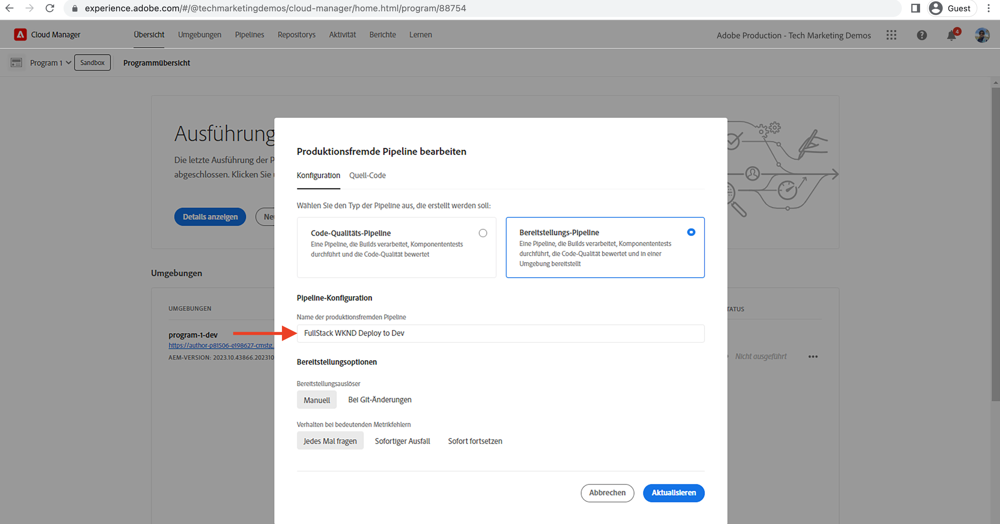
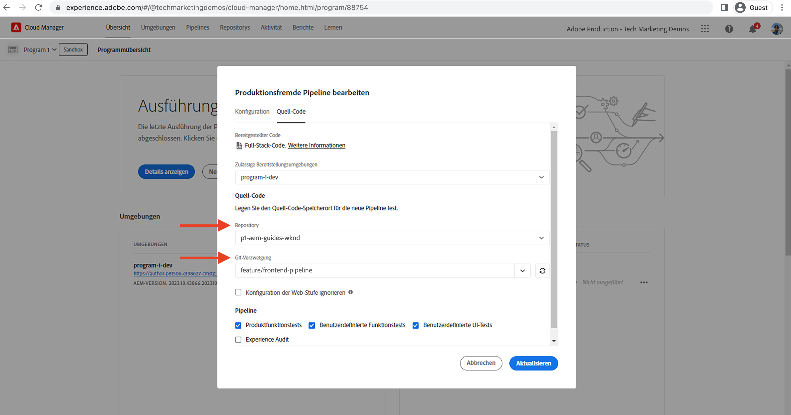
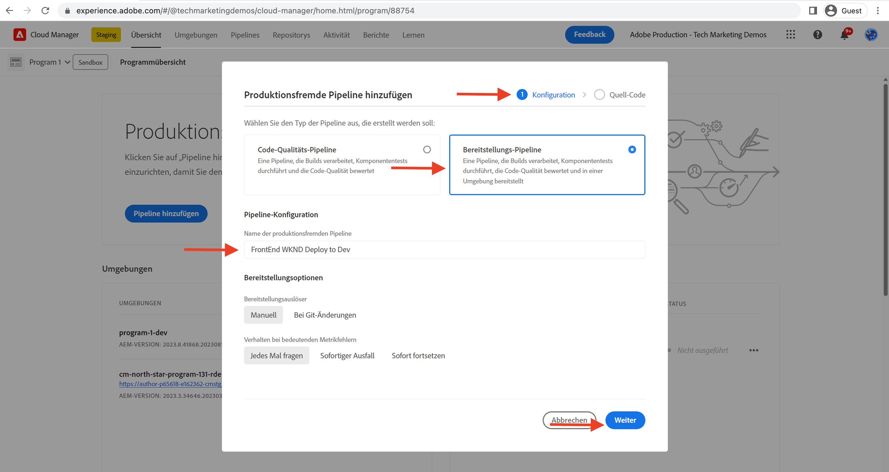

# Bereitstellen mithilfe der Frontend-Pipeline

In diesem Kapitel erstellen wir eine Frontend-Pipeline in Adobe Cloud Manager und führen sie aus. Es werden nur die Dateien aus dem `ui.frontend`-Modul erstellt und dann in AEM as a Cloud Service im integrierten CDN bereitgestellt. Dies ist ein Schritt weg von der `/etc.clientlibs`-basierten Bereitstellung von Frontend-Ressourcen.

## Ziele {#objectives}

* Erstellen Sie eine Frontend-Pipeline und führen Sie sie aus.
* Stellen Sie sicher, dass Frontend-Ressourcen NICHT von `/etc.clientlibs`, sondern von einem neuen Host-Namen bereitgestellt werden, der mit `https://static-` beginnt.

## Verwenden der Frontend-Pipeline

>[!VIDEO](https://video.tv.adobe.com/v/3409420?quality=12&learn=on)

## Voraussetzungen {#prerequisites}

Dies ist ein mehrteiliges Tutorial, und es wird davon ausgegangen, dass Sie die Schritte, die in [Aktualisieren des Standard-AEM-Projekts](./update-project.md) beschrieben werden, abgeschlossen haben.

Stellen Sie sicher, dass Sie die [Berechtigungen zum Erstellen und Bereitstellen von Pipelines in Cloud Manager](https://experienceleague.adobe.com/docs/experience-manager-cloud-manager/content/requirements/users-and-roles.html?lang=de#role-definitions) und [Zugriff auf eine AEM as a Cloud Service-Umgebung](https://experienceleague.adobe.com/docs/experience-manager-cloud-service/content/implementing/using-cloud-manager/manage-environments.html?lang=de) haben.

## Umbenennen einer vorhandenen Pipeline

Benennen Sie die vorhandene Pipeline von __Bereitstellen für Entwicklung__ in __Full-Stack-WKND-Bereitstellung für Entwicklung__ um, indem Sie auf der Registerkarte __Konfiguration__ zum Feld __Name der produktionsfremden Pipeline__ gehen. Dadurch soll direkt am Namen erkennbar sein, ob eine Pipeline Full-Stack oder Frontend ist.

Überprüfen Sie auch auf der Registerkarte __Quell-Code__, ob die Feldwerte für Repository und Git-Verzweigung korrekt sind und die Verzweigung über die Änderungen an Ihrem Frontend-Pipeline-Vertrag verfügt.

## Erstellen einer Frontend-Pipeline

Um __NUR__ die Frontend-Ressourcen aus dem `ui.frontend`-Modul zu erstellen und bereitzustellen, führen Sie die folgenden Schritte aus:

1. Klicken Sie in der Cloud Manager-Benutzeroberfläche im Abschnitt __Pipelines__ auf __Hinzufügen__ und wählen Sie __Produktionsfremde Pipeline hinzufügen__ (bzw. __Produktions-Pipeline hinzufügen__) aus, je nach der AEM as a Cloud Service-Umgebung, für die Sie bereitstellen möchten.

1. Wählen Sie im Dialog __Produktionsfremde Pipeline hinzufügen__ als Teil der Schritte zur __Konfiguration__ die Option __Implementierungs-Pipeline__ aus, nennen Sie sie __Frontend-WKND-Bereitstellung für Entwicklung__ und klicken Sie auf __Weiter__.

1. Wählen Sie als Teil der __Quell-Code__-Schritte die Option __Frontend-Code__ aus und wählen Sie die Umgebung aus __Mögliche Bereitstellungsumgebungen__ aus. Stellen Sie im Abschnitt __Quell-Code__ sicher, dass die Feldwerte für Repository und Git-Verzweigung korrekt sind und der Zweig über die Änderungen an Ihrem Frontend-Pipeline-Vertrag verfügt.
Und __am wichtigsten__ ist, dass für das Feld __Code-Speicherort__ der Wert `/ui.frontend` ist. Klicken Sie schließlich auf __Speichern__.

## Bereitstellungssequenz

* Führen Sie zuerst die neu benannte Pipeline __Full-Stack-WKND-Bereitstellung für Entwicklung__ aus, um die WKND-ClientLib-Dateien aus dem AEM-Repository zu entfernen. Und vor allem sollten Sie AEM für den Frontend-Pipeline-Vertrag vorbereiten, indem Sie __Sling__-Konfigurationsdateien (`SiteConfig`, `HtmlPageItemsConfig`) hinzufügen.

>[!WARNING]
>
>Nach der Fertigstellung der Pipeline __Full-Stack-WKND-Bereitstellung für Entwicklung__ haben Sie eine __unformatierte__ WKND-Site, die defekt erscheinen kann. Bitte planen Sie einen Ausfall ein oder führen Sie die Bereitstellung in Nicht-Spitzenzeiten durch. Dies ist eine einmalige Unterbrechung, die Sie während des erstmaligen Wechsels von der Verwendung einer einzelnen Full-Stack-Pipeline zur Frontend-Pipeline einplanen müssen.

* Führen Sie abschließend die Pipeline __Frontend-WKND-Bereitstellung für Entwicklung__ aus, um nur das `ui.frontend`-Modul zu erstellen und die Frontend-Ressourcen direkt im CDN bereitzustellen.

>[!IMPORTANT]
>
>Sie werden feststellen, dass die __unformatierte__ WKND-Site wieder normal ist und die Ausführung der __Frontend__-Pipeline diesmal viel schneller ging als die der Full-Stack-Pipeline.

## Überprüfen von Stiländerungen und neuem Bereistellungsparadigma

* Öffnen Sie eine Seite der WKND-Site, und Sie können die Textfarbe sehen, die wir verwenden, das __Adobe-Rot__. Die Frontend-Ressourcen-Dateien (CSS, JS) werden vom CDN bereitgestellt. Der Host-Name der Ressourcenanforderung beginnt mit `https://static-pXX-eYY.p123-e456.adobeaemcloud.com/$HASH_VALUE$/theme/site.css`, ebenso wie site.js oder alle anderen statischen Ressourcen, auf die Sie in der `HtmlPageItemsConfig`-Datei verwiesen haben.

>[!TIP]
>
>Der `$HASH_VALUE$` hier ist der gleiche wie der, den Sie im Feld __INHALTSHASH__ der Pipeline __Frontend-WKND-Bereitstellung für Entwicklung__ sehen. AEM wird über die CND-URL der Frontend-Ressource benachrichtigt und der Wert in `/conf/wknd/sling:configs/com.adobe.cq.wcm.core.components.config.HtmlPageItemsConfig/jcr:content` unter der Eigenschaft __prefixPath__ gespeichert.

## Herzlichen Glückwunsch! {#congratulations}

Herzlichen Glückwunsch! Sie haben die Frontend-Pipeline erstellt, ausgeführt und überprüft, die nur das Modul „ui.frontend“ des WKND-Sites-Projekts erstellt und bereitstellt. Jetzt kann Ihr Frontend-Team schnell das Design und das Frontend-Verhalten der Site durchlaufen, außerhalb des Lebenszyklus des gesamten AEM-Projekts.

## Nächste Schritte {#next-steps}

Im nächsten Kapitel [Überlegungen](considerations.md) werden die Auswirkungen auf den Frontend- und den Backend-Entwicklungsprozess behandelt.
