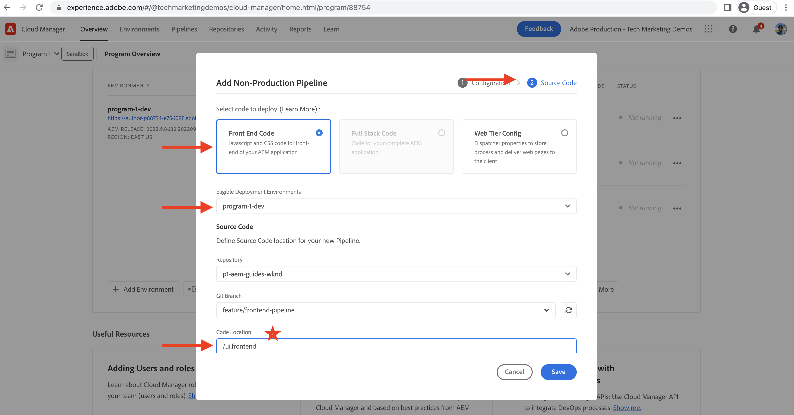

# Bereitstellen mithilfe der Frontend-Pipeline

In diesem Kapitel erstellen und führen wir eine Front-End-Pipeline in Adobe Cloud Manager aus. Es werden nur die Dateien aus `ui.frontend` und stellt sie in AEM as a Cloud Service im integrierten CDN bereit. So weg von der  `/etc.clientlibs` Bereitstellung von Frontend-Ressourcen.

## Ziele {#objectives}

* Erstellen Sie eine Front-End-Pipeline und führen Sie sie aus.
* Sicherstellen, dass Frontend-Ressourcen NICHT von bereitgestellt werden `/etc.clientlibs` aber von einem neuen Hostnamen, der mit `https://static-`

## Verwenden der Front-End-Pipeline

>[!VIDEO](https://video.tv.adobe.com/v/3409420/)

## Voraussetzungen {#prerequisites}

Dies ist ein mehrteiliges Tutorial, und es wird davon ausgegangen, dass die im [Standardprojekt AEM aktualisieren](./update-project.md) wurden abgeschlossen.

Stellen Sie sicher, dass [Berechtigungen zum Erstellen und Bereitstellen von Pipelines in Cloud Manager](https://experienceleague.adobe.com/docs/experience-manager-cloud-manager/content/requirements/users-and-roles.html?lang=en#role-definitions) und [Zugriff auf eine AEM as a Cloud Service Umgebung](https://experienceleague.adobe.com/docs/experience-manager-cloud-service/content/implementing/using-cloud-manager/manage-environments.html).

## Vorhandene Pipeline umbenennen

Umbenennen der vorhandenen Pipeline aus __Bereitstellen in der Entwicklung__ nach  __FullStack WKND-Bereitstellung für Dev__ durch __Konfiguration__ Registerkarte __Name der produktionsfremden Pipeline__ -Feld. Dadurch soll explizit festgelegt werden, ob eine Pipeline vollständig oder Frontend ist, indem nur ihr Name geprüft wird.

Auch in __Quellcode__ überprüfen Sie, ob die Feldwerte für Repository und Git-Verzweigung korrekt sind und sich Ihr Frontend-Pipeline-Vertrag in der Verzweigung ändert.

## Erstellen einer Front-End-Pipeline

nach __NUR__ Erstellen und Bereitstellen der Frontend-Ressourcen aus dem `ui.frontend` -Modul, führen Sie die folgenden Schritte aus:

1. In der Cloud Manager-Benutzeroberfläche können Sie über die __Pipelines__ Abschnitt, klicken Sie auf __Hinzufügen__ Schaltfläche und wählen Sie __Hinzufügen einer produktionsfremden Pipeline__ (oder __Produktions-Pipeline hinzufügen__), basierend auf der AEM as a Cloud Service Umgebung, für die Sie bereitstellen möchten.

1. Im __Hinzufügen einer produktionsfremden Pipeline__ als Teil des __Konfiguration__ die __Bereitstellungs-Pipeline__ Option, nennen Sie sie __FrontEnd-WKND-Bereitstellung für Dev__ und klicken Sie auf __Weiter__

1. Als Teil der __Quellcode__ die __Frontend-Code__ und wählen Sie die Umgebung aus __Förderfähige Bereitstellungsumgebungen__. Im __Quellcode__ stellen sicher, dass die Feldwerte für Repository und Git-Verzweigung korrekt sind und der Zweig Ihre Frontend-Pipeline-Verträge ändert.
und __am wichtigsten__ für __Code-Speicherort__ Feld, dessen Wert lautet `/ui.frontend` und klicken Sie schließlich auf __Speichern__.

## Implementierungssequenz

* Führen Sie zuerst die neu umbenannte __FullStack WKND-Bereitstellung für Dev__ Pipeline zum Entfernen der WKND-clientlib-Dateien aus dem AEM-Repository. Und vor allem sollten Sie die AEM für den Front-End-Pipeline-Vertrag vorbereiten, indem Sie __Sling-Konfiguration__ Dateien (`SiteConfig`, `HtmlPageItemsConfig`).

>[!WARNING]
>
>Nach dem __FullStack WKND-Bereitstellung für Dev__ Pipeline-Fertigstellung: __unformatiert__ WKND-Site, die beschädigt erscheinen kann. Planen Sie einen Ausfall oder eine Bereitstellung in ungeraden Stunden. Dies ist eine einmalige Unterbrechung, die Sie während des ersten Wechsels von der Verwendung einer einzelnen Vollstapel-Pipeline zur Frontend-Pipeline planen müssen.

* Führen Sie abschließend die __FrontEnd-WKND-Bereitstellung für Dev__ nur Pipeline erstellen `ui.frontend` und stellen die Frontend-Ressourcen direkt im CDN bereit.

>[!IMPORTANT]
>
>Sie merken, dass die __unformatiert__ Die WKND-Site ist wieder normal und diesmal __FrontEnd__ Die Pipelineausführung war viel schneller als die Vollstapelpipeline.

## Überprüfen von Stiländerungen und neuen Versandparametern

* Öffnen Sie die beliebige Seite der WKND-Site, und Sie können die Textfarbe sehen, die wir verwenden. __Adobe Rot__ und die Frontend-Ressourcen (CSS, JS)-Dateien werden vom CDN bereitgestellt. Der Hostname der Ressourcenanforderung beginnt mit `https://static-pXX-eYY.p123-e456.adobeaemcloud.com/$HASH_VALUE$/theme/site.css` und ebenso die Datei &quot;site.js&quot;oder alle anderen statischen Ressourcen, auf die Sie in der `HtmlPageItemsConfig` -Datei.

>[!TIP]
>
>Die `$HASH_VALUE$` Hier sehen Sie dasselbe wie in __FrontEnd-WKND-Bereitstellung für Dev__  Pipeline __INHALTSHASH__ -Feld. AEM über die CDN-URL der Frontend-Ressource informiert wird, wird der Wert unter `/conf/wknd/sling:configs/com.adobe.cq.wcm.core.components.config.HtmlPageItemsConfig/jcr:content` under __prefixPath__ -Eigenschaft.

## Herzlichen Glückwunsch! {#congratulations}

Herzlichen Glückwunsch! Sie haben die Front-End-Pipeline erstellt, ausgeführt und überprüft, die nur das Modul &quot;ui.frontend&quot;des WKND Sites-Projekts erstellt und bereitstellt. Jetzt kann Ihr Frontend-Team schnell das Design und das Frontend-Verhalten der Site durchlaufen, außerhalb des gesamten Lebenszyklus AEM Projekts.

## Nächste Schritte {#next-steps}

Im nächsten Kapitel [Überlegungen](considerations.md), werden Sie die Auswirkungen auf den Front-End- und Back-End-Entwicklungsprozess überprüfen.
