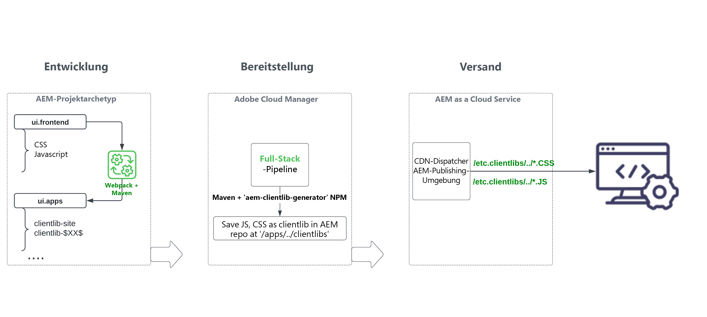

# Überprüfen Sie das Modul „ui.frontend“ des Full-Stack-AEM-Projekts. {#aem-full-stack-ui-frontent}

In diesem Kapitel überprüfen wir die Entwicklung, Implementierung und Bereitstellung von Frontend-Artefakten eines Full-Stack-AEM-Projekts, indem wir uns auf das Modul „ui.frontend“ des __WKND Sites-Projektes__ fokussieren.


## Ziele {#objective}

* Den Build- und Bereitstellungsfluss von Frontend-Artefakten in einem AEM-Full-Stack-Projekt besser verstehen
* Die [Webpack](https://webpack.js.org/)-Konfigurationen des `ui.frontend`-Moduls des AEM-Full-Stack-Projekts überprüfen
* Generierungsprozess der AEM Client-Bibliothek (auch als Clientlibs bezeichnet)

## Frontend-Bereitstellungsfluss für Projekte mit AEM-Full-Stack und schneller Site-Erstellung

>[!IMPORTANT]
>
>In diesem Video wird der Frontend-Fluss für die beiden Projekte **Full-Stack und schnelle Site-Erstellung** erklärt, um den geringfügigen Unterschied beim Modell des Erstellens, Implementierens und Bereitstellens von Frontend-Ressourcen zu beschreiben.

>[!VIDEO](https://video.tv.adobe.com/v/3409344?quality=12&learn=on)

## Voraussetzungen {#prerequisites}


* Klonen Sie das [AEM WKND Sites-Projekt](https://github.com/adobe/aem-guides-wknd)
* Das geklonte AEM WKND Sites-Projekt wurde für AEM as a Cloud Service erstellt und bereitgestellt.

Schauen Sie sich die Datei [README.md](https://github.com/adobe/aem-guides-wknd/blob/main/README.md) des AEM WKND Site-Projekts für weitere Details an.

## Fluss der Frontend-Artefakte eines AEM-Full-Stack-Projekts {#flow-of-frontend-artifacts}

Nachfolgend finden Sie eine allgemeine Darstellung des Flusses von __Entwicklung, Implementierung und Bereitstellung__ der Frontend-Artefakte in einem Full-Stack AEM-Projekt.




Während der Entwicklungsphase werden Frontend-Änderungen wie Stile und Rebranding durchgeführt, indem die CSS- und JS-Dateien aus dem Ordner `ui.frontend/src/main/webpack` aktualisiert werden. Während der Build-Zeit wandeln der [Webpack](https://webpack.js.org/)-Modul-Bundler und das Maven-Plug-in diese Dateien in optimierte AEM-Clientlibs unter dem `ui.apps` Modul um.

Frontend-Änderungen werden bei der Ausführung der [__Full-Stack__-Pipeline im Cloud-Manager](https://experienceleague.adobe.com/docs/experience-manager-cloud-service/content/implementing/using-cloud-manager/cicd-pipelines/introduction-ci-cd-pipelines.html?lang=de) für die AEM as a Cloud Service-Umgebung bereitgestellt.

Die Frontend-Ressourcen werden den Webbrowsern über URI-Pfade bereitgestellt, die mit `/etc.clientlibs/` beginnen, und werden normalerweise im AEM Dispatcher und CDN zwischengespeichert.


>[!NOTE]
>
> Ähnlich verhält es sich mit der __Tour zur schnellen Site-Erstellung in AEM__, wo die [Frontend-Änderungen](https://experienceleague.adobe.com/docs/experience-manager-cloud-service/content/sites/administering/site-creation/quick-site/customize-theme.html?lang=de) in der AEM as a Cloud Service-Umgebung bereitgestellt werden, indem die __Frontend__-Pipeline ausgeführt wird. Siehe dazu [Einrichten der Pipeline](https://experienceleague.adobe.com/docs/experience-manager-cloud-service/content/sites/administering/site-creation/quick-site/pipeline-setup.html?lang=de)

### Überprüfen Sie die Webpack-Konfigurationen im WKND Sites-Projekt. {#development-frontend-webpack-clientlib}

* Es gibt drei __Webpack__-Konfigurationsdateien, die zum Bündeln der WKND Sites-Frontend-Ressourcen verwendet werden.

   1. `webpack.common`: Dies enthält die __gemeinsame__ Konfiguration, um die WKND-Ressourcenbündelung und -optimierung anzuweisen. Die __Output__-Eigenschaft gibt an, wo die konsolidierten Dateien (auch als JavaScript-Bundles bezeichnet, aber nicht zu verwechseln mit den AEM OSGi-Bundles) ausgegeben werden sollen. Der Standardname ist auf `clientlib-site/js/[name].bundle.js` festgelegt.

  ```javascript
      ...
      output: {
              filename: 'clientlib-site/js/[name].bundle.js',
              path: path.resolve(__dirname, 'dist')
          }
      ...    
  ```

   1. `webpack.dev.js` enthält die __Entwicklungskonfiguration__ für den webpack-dev-server und verweist auf die zu verwendende HTML-Vorlage. Sie enthält auch eine Proxy-Konfiguration für eine AEM-Instanz, die auf `localhost:4502` ausgeführt wird.

  ```javascript
      ...
      devServer: {
          proxy: [{
              context: ['/content', '/etc.clientlibs', '/libs'],
              target: 'http://localhost:4502',
          }],
      ...    
  ```

   1. `webpack.prod.js` enthält die __Produktionskonfiguration__ und verwendet die Plug-ins, um die Entwicklungsdateien in optimierte Bundles umzuwandeln.

  ```javascript
      ...
      module.exports = merge(common, {
          mode: 'production',
          optimization: {
              minimize: true,
              minimizer: [
                  new TerserPlugin(),
                  new CssMinimizerPlugin({ ...})
          }
      ...    
  ```


* Die gebündelten Ressourcen werden mithilfe des [AEM-Clientlib-Generator](https://www.npmjs.com/package/aem-clientlib-generator)-Plug-ins in das `ui.apps`-Modul verschoben, wobei die in der Datei `clientlib.config.js` verwaltete Konfiguration verwendet wird.

```javascript
    ...
    const BUILD_DIR = path.join(__dirname, 'dist');
    const CLIENTLIB_DIR = path.join(
    __dirname,
    '..',
    'ui.apps',
    'src',
    'main',
    'content',
    'jcr_root',
    'apps',
    'wknd',
    'clientlibs'
    );
    ...
```

* Das __Frontend-Maven-Plug-in__ von `ui.frontend/pom.xml` orchestriert Webpack-Bundles und die Clientlib-Generierung während der AEM Projekterstellung.

`$ mvn clean install -PautoInstallSinglePackage`

### Bereitstellung in AEM as a Cloud Service {#deployment-frontend-aemaacs}

Die [__Full-Stack__-Pipeline](https://experienceleague.adobe.com/docs/experience-manager-cloud-service/content/implementing/using-cloud-manager/cicd-pipelines/introduction-ci-cd-pipelines.html?lang=de#full-stack-pipeline) stellt diese Änderungen in einer AEM as a Cloud Service-Umgebung bereit.


### Bereitstellung durch AEM as a Cloud Service {#delivery-frontend-aemaacs}

Die Frontend-Ressourcen, die über die Full-Stack-Pipeline bereitgestellt werden, werden von der AEM-Site als `/etc.clientlibs`-Dateien an Webbrowser übermittelt. Sie können dies überprüfen, indem Sie die [öffentlich gehostete WKND-Site](https://wknd.site/content/wknd/us/en.html) und die Quelle der Web-Seite anzeigen.

```html
    ....
    <link rel="stylesheet" href="/etc.clientlibs/wknd/clientlibs/clientlib-site.lc-181cd4102f7f49aa30eea548a7715c31-lc.min.css" type="text/css">

    ...

    <script async src="/etc.clientlibs/wknd/clientlibs/clientlib-site.lc-d4e7c03fe5c6a405a23b3ca1cc3dcd3d-lc.min.js"></script>
    ....
```

## Herzlichen Glückwunsch! {#congratulations}

Herzlichen Glückwunsch, Sie haben das ui.frontend-Modul des Full-Stack-Projekts überprüft.

## Nächste Schritte {#next-steps}

Im nächsten Kapitel [Aktualisieren des Projekts für die Verwendung der Frontend-Pipeline](update-project.md) aktualisieren Sie das AEM WKND Sites-Projekt, um es für den Frontend-Pipeline-Vertrag zu aktivieren.
