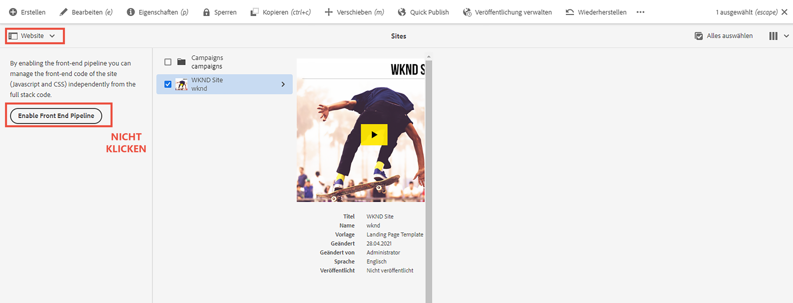

# Aktualisieren des Full-Stack-AEM-Projekts zur Verwendung der Frontend-Pipeline {#update-project-enable-frontend-pipeline}

In diesem Kapitel nehmen wir Konfigurationsänderungen am __WKND Sites-Projekt__ vor, um die Frontend-Pipeline zur Bereitstellung von JavaScript und CSS zu verwenden, anstatt eine vollständige Pipelineausführung erforderlich zu machen. Dies entkoppelt den Entwicklungs- und Bereitstellungslebenszyklus von Frontend- und Backend-Artefakten und ermöglicht so insgesamt einen schnelleren, iterativen Entwicklungsprozess.

## Ziele {#objectives}

* Aktualisieren des Full-Stack-Projekts zur Verwendung der Frontend-Pipeline

## Überblick über die Konfigurationsänderungen im Full-Stack-AEM-Projekt

>[!VIDEO](https://video.tv.adobe.com/v/3409419?quality=12&learn=on)

## Voraussetzungen {#prerequisites}

Dies ist ein mehrteiliges Tutorial und es wird vorausgesetzt, dass Sie das [„ui.frontend“-Modul](./review-uifrontend-module.md) gelesen haben.


## Änderungen am Full-Stack-AEM-Projekt

Es gibt drei projektbezogene Konfigurationsänderungen und eine Stiländerung, die für einen Testlauf bereitgestellt werden sollen. Daher ergeben sich insgesamt vier spezifische Änderungen im WKND-Projekt, um sie für den Frontend-Pipeline-Vertrag zu aktivieren.

1. Entfernen Sie das Modul `ui.frontend` aus dem vollständigen Build-Zyklus

   * Im Stammverzeichnis `pom.xml` des WKND-Sites-Projekts kommentieren Sie den Eintrag `<module>ui.frontend</module>` des Submoduls.

   ```xml
       ...
       <modules>
       <module>all</module>
       <module>core</module>
       <!--
       <module>ui.frontend</module>
       -->                
       <module>ui.apps</module>
       ...
   ```

   * Und kommentarbezogene Abhängigkeit von `ui.apps/pom.xml`

   ```xml
       ...
       <!-- ====================================================================== -->
       <!-- D E P E N D E N C I E S                                                -->
       <!-- ====================================================================== -->
           ...
       <!--
           <dependency>
               <groupId>com.adobe.aem.guides</groupId>
               <artifactId>aem-guides-wknd.ui.frontend</artifactId>
               <version>${project.version}</version>
               <type>zip</type>
           </dependency>
       -->    
       ...
   ```

1. Bereiten Sie das Modul `ui.frontend` für den Frontend-Pipeline-Vertrag vor, indem Sie zwei neue Webpack-Konfigurationsdateien hinzufügen.

   * Kopieren Sie die bestehende `webpack.common.js` als `webpack.theme.common.js`, und ändern Sie die Eigenschaft `output` und die Plugin-Konfigurationsparameter `MiniCssExtractPlugin` und `CopyWebpackPlugin` wie folgt:

   ```javascript
   ...
   output: {
           filename: 'theme/js/[name].js', 
           path: path.resolve(__dirname, 'dist')
       }
   ...
   
   ...
       new MiniCssExtractPlugin({
               filename: 'theme/[name].css'
           }),
       new CopyWebpackPlugin({
           patterns: [
               { from: path.resolve(__dirname, SOURCE_ROOT + '/resources'), to: './clientlib-site' }
           ]
       })
   ...
   ```

   * Kopieren Sie die vorhandene `webpack.prod.js` als `webpack.theme.prod.js`, und ändern Sie den Speicherort der Variablen `common` in der oben genannten Datei als

   ```javascript
   ...
       const common = require('./webpack.theme.common.js');
   ...
   ```

   >[!NOTE]
   >
   >Die obigen beiden Konfigurationsänderungen des „webpack“ sollen unterschiedliche Ausgabedateien und Ordnernamen haben, sodass wir einfach zwischen Clientlib (Full-Stack) und den von Designs generierten (Frontend) Pipeline-Frontend-Artefakten unterscheiden können.
   >
   >Wie Sie vermuten, können die oben genannten Änderungen übersprungen werden, um auch vorhandene Webpack-Konfigurationen zu verwenden. Die folgenden Änderungen sind jedoch erforderlich.
   >
   >Es liegt an Ihnen, wie Sie sie benennen oder organisieren wollen.


   * Vergewissern Sie sich, dass in der Datei `package.json` der Wert der Eigenschaft `name` mit dem Standortnamen aus dem Knoten `/conf` übereinstimmt und dass sie unter der Eigenschaft über `scripts` ein `build`-Skript verfügt, das anweist, wie die Frontend-Dateien aus diesem Modul zu erstellen sind.

   ```javascript
       {
       "name": "wknd",
       "version": "1.0.0",
       ...
   
       "scripts": {
           "build": "webpack --config ./webpack.theme.prod.js"
       }
   
       ...
       }
   ```

1. Bereiten Sie das Modul `ui.content` für die Frontend-Pipeline vor, indem Sie zwei Sling-Konfigurationen hinzufügen.

   * Erstellen Sie eine Datei unter `com.adobe.cq.wcm.core.components.config.HtmlPageItemsConfig` – diese enthält alle Frontend-Dateien, die das Modul `ui.frontend` unter dem Ordner `dist` mithilfe des Webpack-Build-Prozesses erzeugt.

   ```xml
   ...
       <css
       jcr:primaryType="nt:unstructured"
       element="link"
       location="header">
       <attributes
           jcr:primaryType="nt:unstructured">
           <as
               jcr:primaryType="nt:unstructured"
               name="as"
               value="style"/>
           <href
               jcr:primaryType="nt:unstructured"
               name="href"
               value="/theme/site.css"/>
   ...
   ```

   >[!TIP]
   >
   >    Siehe die vollständige [HtmlPageItemsConfig](https://github.com/adobe/aem-guides-wknd/blob/feature/frontend-pipeline/ui.content/src/main/content/jcr_root/conf/wknd/_sling_configs/com.adobe.cq.wcm.core.components.config.HtmlPageItemsConfig/.content.xml) im __AEM WKND-Sites-Projekt__.


   * Zweitens `com.adobe.aem.wcm.site.manager.config.SiteConfig`, wobei der Wert `themePackageName` dem Wert der Eigenschaft `package.json` und `name` entspricht, und `siteTemplatePath` auf den Stubpfad `/libs/wcm/core/site-templates/aem-site-template-stub-2.0.0` verweist.

   ```xml
   ...
       <?xml version="1.0" encoding="UTF-8"?>
       <jcr:root xmlns:sling="http://sling.apache.org/jcr/sling/1.0" xmlns:jcr="http://www.jcp.org/jcr/1.0" xmlns:nt="http://www.jcp.org/jcr/nt/1.0"
               jcr:primaryType="nt:unstructured"
               siteTemplatePath="/libs/wcm/core/site-templates/aem-site-template-stub-2.0.0"
               themePackageName="wknd">
       </jcr:root>
   ...
   ```

   >[!TIP]
   >
   >    Siehe die vollständige [SiteConfig](https://github.com/adobe/aem-guides-wknd/blob/feature/frontend-pipeline/ui.content/src/main/content/jcr_root/conf/wknd/_sling_configs/com.adobe.aem.wcm.site.manager.config.SiteConfig/.content.xml) im __AEM WKND-Sites-Projekt__.

1. Um eine Themen- oder Stiländerung über die Frontend-Pipeline für einen Testlauf bereitzustellen, ändern wir `text-color` auf Adobe-Rot (oder eine andere Farbe Ihrer Wahl), indem wir `ui.frontend/src/main/webpack/base/sass/_variables.scss` aktualisieren.

   ```css
       $black:     #a40606;
       ...
   ```

Senden Sie schließlich diese Änderungen an das Adobe-Git-Repository Ihres Programms.


>[!AVAILABILITY]
>
> Diese Änderungen sind auf GitHub im [__Frontend-Pipeline__](https://github.com/adobe/aem-guides-wknd/tree/feature/frontend-pipeline)-Zweig des __AEM WKND Sites-Projekts__ verfügbar.


## Vorsicht – Schaltfläche _Frontend-Pipeline aktivieren_

Die Option [Site](https://experienceleague.adobe.com/docs/experience-manager-cloud-service/content/sites/authoring/getting-started/basic-handling.html?lang=de) der [Schienenauswahl](https://experienceleague.adobe.com/docs/experience-manager-cloud-service/content/sites/authoring/getting-started/basic-handling.html?lang=de) zeigt die Schaltfläche **Frontend-Pipeline aktivieren** bei Auswahl des Site-Stamms oder der Site-Seite. Wenn Sie auf die Schaltfläche **Frontend-Pipeline aktivieren** klicken, werden die obigen **Sling-Konfigurationen** außer Kraft gesetzt. Stellen Sie sicher, dass Sie **nicht auf diese Schaltfläche klicken**, nachdem Sie die obigen Änderungen über die Cloud Manager-Pipeline bereitgestellt haben.



Wenn versehentlich darauf geklickt wird, müssen Sie die Pipelines erneut ausführen, um sicherzustellen, dass der Frontend-Pipeline-Vertrag und die Änderungen wiederhergestellt werden.

## Herzlichen Glückwunsch! {#congratulations}

Herzlichen Glückwunsch! Sie haben das WKND Sites-Projekt aktualisiert, um es für den Frontend-Pipeline-Vertrag zu aktivieren.

## Nächste Schritte {#next-steps}

Im nächsten Kapitel, [Bereitstellen mithilfe der Frontend-Pipeline](create-frontend-pipeline.md), erstellen und führen Sie eine Frontend-Pipeline aus und überprüfen, wie wir von der „/etc.clientlibs“-basierten Bereitstellung von Frontend-Ressourcen __weggekommen__ sind.
