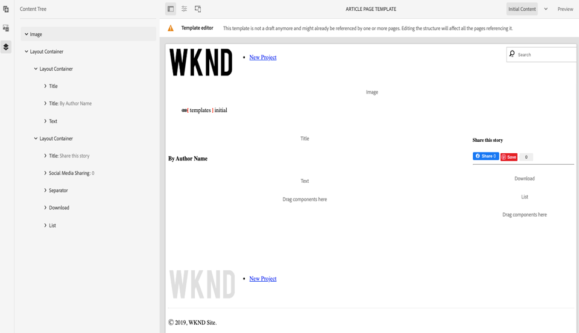
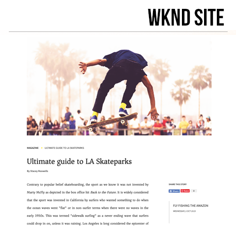

# Seiten und Vorlagen {#pages-and-template}

In diesem Kapitel werden wir die Beziehung zwischen einer Basisseitenkomponente und bearbeitbaren Vorlagen untersuchen. Wir werden eine Artikelvorlage mit unformatiertem Stil auf der Grundlage einiger [AdobeXD](https://www.adobe.com/products/xd.html)-Modelle erstellen. Beim Erstellen der Vorlage werden die Kernkomponenten und die erweiterten Richtlinienkonfigurationen der bearbeitbaren Vorlagen behandelt.

## Voraussetzungen {#prerequisites}

Überprüfen Sie die erforderlichen Werkzeuge und Anleitungen zum Einrichten einer [lokalen Entwicklungs-Umgebung](overview.md#local-dev-environment).

### Starterprojekt

Sehen Sie sich den Basiscode an, auf dem das Lernprogramm basiert:

1. Klonen Sie das [github.com/adobe/aem-guides-wknd](https://github.com/adobe/aem-guides-wknd) -Repository.
1. Schau dir die `pages-templates/start` Verzweigung an.

   ```shell
   $ git clone git@github.com:adobe/aem-guides-wknd.git ~/code/aem-guides-wknd
   $ cd ~/code/aem-guides-wknd
   $ git checkout pages-templates/start
   ```

1. Stellen Sie mithilfe Ihrer Maven-Fähigkeiten eine Codebasis für eine lokale AEM bereit:

   ```shell
   $ cd ~/code/aem-guides-wknd
   $ mvn clean install -PautoInstallSinglePackage
   ```

Sie können den fertigen Code immer auf [GitHub](https://github.com/adobe/aem-guides-wknd/tree/pages-templates/solution) Ansicht oder den Code lokal auschecken, indem Sie zur Verzweigung wechseln `pages-templates/solution`.

## Vorgabe

1. Inspect ein in Adobe XD erstelltes Seitendesign und ordnen Sie es Kernkomponenten zu.
1. Machen Sie sich mit den Details bearbeitbarer Vorlagen vertraut und erfahren Sie, wie Richtlinien verwendet werden können, um eine granulare Steuerung des Seiteninhalts zu erzwingen.
1. Erfahren Sie, wie Vorlagen und Seiten verknüpft werden

## Was Sie erstellen {#what-you-will-build}

In diesem Teil des Tutorials erstellen Sie eine neue Artikelseitenvorlage, mit der neue Artikelseiten erstellt und an einer gemeinsamen Struktur ausgerichtet werden können. Die Artikelseitenvorlage basiert auf Designs und einem in AdobeXD erstellten UI-Kit. Dieses Kapitel konzentriert sich nur auf das Erstellen der Struktur oder des Skeletts der Vorlage. Es werden keine Stile implementiert, aber die Vorlage und die Seiten funktionieren.


## Benutzeroberflächenplanung mit Adobe XD {#adobexd}

In den meisten Fällen ist die Planung für einen neuen Website-Beginn mit Mockups und statischen Designs. [Adobe XD](https://www.adobe.com/products/xd.html) ist ein Design-Tool zum Erstellen von Benutzererlebnissen. Anschließend werden wir ein UI-Kit und -Modelle prüfen, um die Struktur der Artikelseitenvorlage zu planen.

>[!VIDEO](https://video.tv.adobe.com/v/30214/?quality=12&learn=on)

Laden Sie die [WKND-Artikelentwurfsdatei](https://github.com/adobe/aem-guides-wknd/releases/download/aem-guides-wknd-0.0.2/AEM_UI-kit-WKND-article-design.xd)herunter.

## Erstellen einer Kopf- und Fußzeile mit Erlebnisfragmenten {#experience-fragments}

Beim Erstellen globaler Inhalte wie Kopf- oder Fußzeilen wird häufig ein [Erlebnisfragment](https://docs.adobe.com/content/help/en/experience-manager-learn/sites/experience-fragments/experience-fragments-feature-video-use.html)verwendet. Erlebnisfragmente ermöglichen es uns, mehrere Komponenten zu kombinieren, um eine einzelne, referenzierbare Komponente zu erstellen. Erlebnisfragmente haben den Vorteil, dass sie mehrseitige Verwaltung unterstützen, und ermöglichen es uns, verschiedene Kopf- und Fußzeilen pro Gebietsschema zu verwalten.

Als Nächstes aktualisieren wir das Erlebnisfragment, das als Kopf- und Fußzeile verwendet werden soll, um das WKND-Logo hinzuzufügen.

>[!VIDEO](https://video.tv.adobe.com/v/30215/?quality=12&learn=on)

>[!NOTE]
>
> Sehen Ihre Erlebnisfragmente anders aus als im Video? Versuchen Sie, sie zu löschen und die Code-Basis des Startprojekts erneut zu installieren.

Im Folgenden finden Sie die Schritte auf hoher Ebene, die im obigen Video ausgeführt werden.

1. Aktualisieren Sie die Kopfzeile des Erlebnisfragments unter [http://localhost:4502/editor.html/content/experience-fragments/wknd/us/en/site/header/master.html](http://localhost:4502/editor.html/content/experience-fragments/wknd/us/en/site/header/master.html) , um das WKND-dunkle Logo einzuschließen.

   

   *WKND Dark Logo*

1. Aktualisieren Sie den Experience Fragment-Header unter [http://localhost:4502/editor.html/content/experience-fragments/wknd/us/en/site/footer/master.html](http://localhost:4502/editor.html/content/experience-fragments/wknd/us/en/site/footer/master.html) , um das WKND Light-Logo einzuschließen.

   

   *WKND Light-Logo*

## Erstellen der Artikelseitenvorlage

Wenn Sie eine Seite erstellen, müssen Sie eine Vorlage auswählen. Diese wird als Grundlage für die Erstellung der neuen Seite verwendet. Die Vorlage definiert die Struktur der Zielseite, den anfänglichen Inhalt und die zulässigen Komponenten.

Es gibt drei Hauptbereiche für [bearbeitbare Vorlagen](https://docs.adobe.com/content/help/en/experience-manager-65/developing/platform/templates/page-templates-editable.html):

1. **Struktur** : Definiert Komponenten, die Teil der Vorlage sind. Diese können von Inhaltserstellern nicht bearbeitet werden.
1. **Anfänglicher Inhalt** : Definiert Komponenten, mit denen die Vorlage Beginn wird. Diese können von Inhaltserstellern bearbeitet und/oder gelöscht werden
1. **Richtlinien** - legt Konfigurationen fest, wie sich Komponenten verhalten und welche Optionen Autoren zur Verfügung stehen.

Als Nächstes erstellen wir die Artikelseitenvorlage. Dies geschieht in einer lokalen Instanz von AEM.

>[!VIDEO](https://video.tv.adobe.com/v/30217/?quality=12&learn=on)

Im Folgenden finden Sie die Schritte auf hoher Ebene, die im obigen Video ausgeführt werden.

1. Navigieren Sie zum Ordner &quot;WKND Sites Template&quot;: **Werkzeuge** > **Allgemein** > **Vorlagen** > **WKND-Site**
1. Erstellen einer neuen Vorlage mit dem **Vorlagentyp &quot;Leere Seite** für WKND-Site **mit dem Titel &quot;Artikelseitenvorlage&quot;**
1. Konfigurieren Sie im **Strukturierungsmodus** die Vorlage so, dass sie die folgenden Elemente enthält:

   * Erlebnisfragment-Kopfzeile
   * Bild
   * Breadcrumb
   * Container - 8 Spalten breit Desktop, 12 Spalten breit Tablet, Mobil
   * Container - 4 Spalten breit, 12 Spalten breit Tablet, Mobil
   * Erlebnisfragment-Fußzeile

   

   *Struktur - Artikelseitenvorlage*

1. Wechseln Sie zum **anfänglichen Inhaltsmodus** und fügen Sie die folgenden Komponenten als Starterinhalt hinzu:

   * **Wichtigster Container**
      * Titel - Standardgröße von H1
      * Titel - *&quot;Nach Autorenname&quot;* mit einer Größe von H4
      * Text - leer
   * **Container**
      * Titel - *&quot;Diese Geschichte teilen&quot;* mit einer Größe von H5
      * Freigabe in Social Media
      * Trennzeichen
      * Download
      * Liste

   

   *Anfänglicher Inhalt - Artikelseitenvorlage*

1. Aktualisieren Sie die **Eigenschaften** der ersten Seite, um die Benutzerfreigabe für **Facebook** und **Pinterest** zu aktivieren.
1. Laden Sie ein Bild in die **Eigenschaften der** Artikelseitenvorlage hoch, um es leicht zu identifizieren:

   

   *Miniaturansicht der Artikelvorlage*

1. Aktivieren Sie die **Artikelseitenvorlage** im Ordner &quot; [WKND-Site-Vorlagen&quot;](http://localhost:4502/libs/wcm/core/content/sites/templates.html/conf/wknd/settings/wcm/templates).

## Artikelseite erstellen

Nachdem wir nun eine Vorlage haben, erstellen wir eine neue Seite mit dieser Vorlage.

1. Laden Sie das folgende ZIP-Paket [WKND-PagesTemplates-DAM-Assets.zip](assets/pages-templates/WKND-PagesTemplates-DAM-Assets.zip) herunter und installieren Sie es über [CRX Package Manager](http://localhost:4502/crx/packmgr/index.jsp).

   Mit dem obigen Paket werden mehrere Bilder und Assets darunter installiert, die in späteren Schritten zum Füllen einer Artikelseite verwendet `/content/dam/wknd/en/magazine/la-skateparks` werden.

   *Bilder und Assets im obigen Paket sind lizenzfrei mit der Gratifikation von[Unsplash.com](https://unsplash.com/).*

   

1. Erstellen Sie eine neue Seite unter **WKND** > **US** > **en** mit dem Namen **Magazine**. Verwenden Sie die **Inhaltsseitenvorlage** .

   Auf dieser Seite wird eine Struktur zu unserer Site hinzugefügt, die es uns ermöglicht, die Breadcrumb-Komponente in Aktion zu sehen.

1. Anschließend erstellen Sie eine neue Seite unter **WKND** > **US** > **en** > **Magazine**. Verwenden Sie die Vorlage &quot; **Artikelseite** &quot;. Verwenden Sie einen Titel des **Ultimate-Führers zu LA Skateparks** und einen Namen der **guide-la-skateparks**.

   

1. Füllen Sie die Seite mit Inhalten, um die in der [UI-Planung untersuchten Modelle mit dem AdobeXD-Teil](#adobexd) abzugleichen. Beispielartikeltext kann hier [heruntergeladen werden](assets/pages-templates/la-skateparks-copy.txt). Sie sollten Folgendes erstellen können:

   

   >[!NOTE]
   >
   > Die Bildkomponente oben auf der Seite kann bearbeitet, aber nicht entfernt werden. Die Breadcrumb-Komponente wird auf der Seite angezeigt, kann jedoch nicht bearbeitet oder entfernt werden.

## Inspect die Knotenstruktur {#node-structure}

An dieser Stelle ist die Artikelseite eindeutig nicht formatiert. Die Grundstruktur ist jedoch vorhanden. Als Nächstes betrachten wir die Knotenstruktur der Artikelseite, um ein besseres Verständnis der Rolle der Vorlage und der Seitenkomponente, die für die Wiedergabe des Inhalts verantwortlich ist, zu erhalten.

Wir können dies mit dem CRXDE-Lite-Tool auf einer lokalen AEM tun.

1. Öffnen Sie [CRXDE-Lite](http://localhost:4502/crx/de/index.jsp#/content/wknd/us/en/magazine/guide-la-skateparks/jcr%3Acontent) und navigieren Sie mithilfe der Baumstruktur zu `/content/wknd/us/en/magazine/guide-la-skateparks`.

1. Klicken Sie auf die `jcr:content` Node unterhalb der `la-skateparks` Seite und Ansicht der Eigenschaften:

   

   Beachten Sie den Wert für `cq:template`die zuvor erstellte Artikelseitenvorlage, die auf `/conf/wknd/settings/wcm/templates/article-page`diese verweist.

   Beachten Sie auch den Wert von `sling:resourceType`, auf den `wknd/components/structure/page`verweist. Dies ist die vom AEM Projektarchiv erstellte Seitenkomponente, die für die Wiedergabe der Seite auf Basis der Vorlage verantwortlich ist.

1. Erweitern Sie den `jcr:content` Knoten unterhalb `/content/wknd/us/en/magazine/guide-la-skateparks/jcr:content` und Ansicht der Knotenhierarchie:

   

   Sie sollten in der Lage sein, jeden Knoten lose Komponenten zuzuordnen, die erstellt wurden. Überprüfen Sie, ob Sie die verschiedenen Layout-Container identifizieren können, indem Sie die mit dem Präfix versehenen Knoten überprüfen `responsivegrid`.

1. Überprüfen Sie anschließend die Seitenkomponente bei `/apps/wknd/components/structure/page`. Ansicht der Komponenteneigenschaften in der CRXDE Lite:

   

   Beachten Sie, dass sich die Seitenkomponente unter einem Ordner mit dem Namen **structure** befindet. Diese Regel entspricht dem Strukturmodus des Vorlageneditors und wird verwendet, um anzugeben, dass die Seitenkomponente nicht direkt mit Autoren interagiert.

   Beachten Sie, dass es nur 2 HTML-Skripte `customfooterlibs.html` und `customheaderlibs.html` unter der Seitenkomponente gibt. Wie also rendert diese Komponente die Seite?

   Notieren Sie die `sling:resourceSuperType` Eigenschaft und den Wert von `core/wcm/components/page/v2/page`. Mit dieser Eigenschaft kann die Seitenkomponente des WKND alle Funktionen der Komponente &quot;Core Component&quot;übernehmen. Dies ist das erste Beispiel für das so genannte [Proxykomponentenmuster](https://docs.adobe.com/content/help/en/experience-manager-core-components/using/developing/guidelines.html#ProxyComponentPattern). Weitere Informationen finden Sie [hier.](https://docs.adobe.com/content/help/en/experience-manager-core-components/using/developing/guidelines.html).

1. Inspect eine weitere Komponente innerhalb der WKND-Komponenten, die `Breadcrumb` Komponente unter: `/apps/wknd/components/content/breadcrumb`. Beachten Sie, dass dieselbe `sling:resourceSuperType` Eigenschaft gefunden werden kann, aber diesmal verweist sie auf `core/wcm/components/breadcrumb/v2/breadcrumb`. Dies ist ein weiteres Beispiel für die Verwendung des Musters der Proxy-Komponente, um eine Core-Komponente einzuschließen. Tatsächlich sind alle Komponenten in der WKND-Codebasis Stellvertreter von AEM Core Components (mit Ausnahme unserer berühmten HelloWorld-Komponente). Es empfiehlt sich, möglichst viele Funktionen von Core-Komponenten erneut zu verwenden, *bevor* Sie benutzerdefinierten Code schreiben.

1. Überprüfen Sie anschließend die Seite &quot;Kernkomponente&quot;bei `/apps/core/wcm/components/page/v2/page` Verwendung der CRXDE Lite:

   

   Beachten Sie, dass viele weitere Skripte unter dieser Seite enthalten sind. Die Seite &quot;Core-Komponenten&quot;enthält viele Funktionen. Diese Funktion ist in mehrere Skripten unterteilt, um die Wartung und Lesbarkeit zu erleichtern. Sie können die Einbindung der HTML-Skripte verfolgen, indem Sie die `page.html` und nach `data-sly-include`:

   ```html
   <!--/* /apps/core/wcm/components/page/v2/page/page.html */-->
   <!DOCTYPE HTML>
   <html data-sly-use.page="com.adobe.cq.wcm.core.components.models.Page" lang="${page.language}"
           data-sly-use.head="head.html"
           data-sly-use.footer="footer.html"
           data-sly-use.redirect="redirect.html">
       <head data-sly-call="${head.head @ page = page}"></head>
       <body class="${page.cssClassNames}">
           <sly data-sly-test.isRedirectPage="${page.redirectTarget && (wcmmode.edit || wcmmode.preview)}"
               data-sly-call="${redirect.redirect @ redirectTarget = page.redirectTarget}"></sly>
           <sly data-sly-test="${!isRedirectPage}">
               <sly data-sly-include="body.socialmedia_begin.html"></sly>
               <sly data-sly-include="body.html"></sly>
               <sly data-sly-call="${footer.footer @ page = page}"></sly>
               <sly data-sly-include="body.socialmedia_end.html"></sly>
           </sly>
       </body>
   </html>
   ```

   Der andere Grund für das Ausbrechen der HTML in mehrere Skripten besteht darin, dass die Proxy-Komponenten einzelne Skripte überschreiben können, um benutzerdefinierte Geschäftslogik zu implementieren. Die HTML-Skripte `customfooterlibs.html` und `customheaderlibs.html`die HTML-Skripte werden für den expliziten Zweck erstellt, der durch die Implementierung von Projekten außer Kraft gesetzt werden soll.

   Weitere Informationen dazu, wie die bearbeitbare Vorlage in die Darstellung der [Inhaltsseite eingebunden wird, finden Sie in diesem Artikel](https://docs.adobe.com/content/help/en/experience-manager-65/developing/platform/templates/page-templates-editable.html#resultant-content-pages).

1. Inspect die andere Kernkomponente, wie die Breadcrumb bei `/apps/core/wcm/components/breadcrumb/v2/breadcrumb`. Ansicht des `breadcrumb.html` Skripts, um zu verstehen, wie das Markup für die Breadcrumb-Komponente letztendlich generiert wird.

## Speichern von Konfigurationen in der Quellcodeverwaltung {#configuration-persistence}

In vielen Fällen, besonders zu Beginn eines AEM Projekts, ist es nützlich, Konfigurationen wie Vorlagen und zugehörige Inhaltsrichtlinien zur Quellcodeverwaltung beizubehalten. Dadurch wird sichergestellt, dass alle Entwickler mit demselben Inhaltssatz und denselben Konfigurationen arbeiten und zusätzliche Konsistenz zwischen den Umgebung sicherstellen. Sobald ein Projekt eine gewisse Reife erreicht hat, kann die Verwaltung von Vorlagen einer speziellen Gruppe von Stromverbrauchern überlassen werden.

Vorerst behandeln wir die Vorlagen wie andere Codeabschnitte und synchronisieren die **Artikelseitenvorlage** als Teil des Projekts. Bisher haben wir Code von unserem AEM Projekt an eine lokale Instanz von AEM **weitergeleitet** . Die **Artikelseitenvorlage** wurde direkt auf einer lokalen Instanz von AEM erstellt. Daher müssen wir die Vorlage in unser AEM Projekt **ziehen** oder importieren. Das Modul **ui.content** ist zu diesem Zweck im AEM Projekt enthalten.

Die nächsten Schritte werden mit der Eclipse-IDE ausgeführt, können jedoch auch jede IDE verwenden, die Sie zum **Abrufen** oder Importieren von Inhalten aus einer lokalen Instanz von AEM konfiguriert haben.

1. Stellen Sie in der Eclipse-IDE sicher, dass ein Server mit dem AEM Developer Tool-Plug-In für die Verbindung zur lokalen Instanz von AEM gestartet wurde und dass das Modul **ui.content** der Serverkonfiguration hinzugefügt wurde.

   

1. Erweitern Sie das Modul **ui.content** im Project Explorer. Erweitern Sie den `src` Ordner (den Ordner mit dem kleinen Globussymbol) und navigieren Sie zu `/conf/wknd/settings/wcm/templates`.

1. [!UICONTROL Klicken Sie mit der rechten Maustaste auf] den `templates` Knoten und wählen Sie **Aus Server importieren...**:

   

   Bestätigen Sie das Dialogfeld &quot; **Import aus Repository** &quot;und klicken Sie auf **Fertig stellen**. Sie sollten nun den `article-page-template` unterhalb des `templates` Ordners sehen.

1. Wiederholen Sie die Schritte zum Importieren von Inhalten, wählen Sie jedoch den Knoten **Richtlinien** unter `/conf/wknd/settings/wcm/policies`.

   

1. Inspect Sie die `filter.xml` Datei unter `src/main/content/META-INF/vault/filter.xml`.

   ```xml
   <!--ui.content filter.xml-->
   <?xml version="1.0" encoding="UTF-8"?>
   <workspaceFilter version="1.0">
       <filter root="/conf/wknd" mode="merge"/>
       <filter root="/content/wknd" mode="merge"/>
       <filter root="/content/dam/wknd" mode="merge"/>
       <filter root="/content/experience-fragments/wknd" mode="merge"/>
   </workspaceFilter>
   ```

   Die `filter.xml` Datei ist dafür verantwortlich, die Pfade der Knoten zu identifizieren, die mit dem Paket installiert werden. Beachten Sie die `mode="merge"` auf jedem Filter, die anzeigen, dass vorhandene Inhalte nicht geändert werden, sondern nur neue Inhalte hinzugefügt werden. Da Inhaltsersteller diese Pfade möglicherweise aktualisieren, ist es wichtig, dass eine Codebereitstellung Inhalte **nicht** überschreibt. Weitere Informationen zum Arbeiten mit Filterelementen finden Sie in der [FileVault-Dokumentation](https://jackrabbit.apache.org/filevault/filter.html) .

   Vergleichen `ui.content/src/main/content/META-INF/vault/filter.xml` und `ui.apps/src/main/content/META-INF/vault/filter.xml` verstehen Sie die verschiedenen Knoten, die von den einzelnen Modulen verwaltet werden.

   >[!WARNING]
   >
   > Um eine konsistente Bereitstellung der WKND-Referenz-Website sicherzustellen, werden einige Zweige des Projekts so eingerichtet, dass alle Änderungen in der JCR-Datei überschrieben `ui.content` werden. Dies erfolgt standardmäßig, d. h. für Lösungsverzweigungen, da Code/Stile für bestimmte Richtlinien geschrieben werden.

## Herzlichen Glückwunsch! {#congratulations}

Herzlichen Glückwunsch, Sie haben gerade eine neue Vorlage und Seite mit Adobe Experience Manager Sites erstellt.

### Nächste Schritte {#next-steps}

An dieser Stelle ist die Artikelseite eindeutig nicht formatiert. Befolgen Sie das Lernprogramm [clientseitige Bibliotheken und Front-End-Arbeitsablauf](client-side-libraries.md) , um die Best Practices für die Einbeziehung von CSS und JavaScript zu erfahren, um globale Stile auf die Site anzuwenden und einen dedizierten Front-End-Build zu integrieren.

Ansicht des fertigen Codes auf [GitHub](https://github.com/adobe/aem-guides-wknd) oder Überprüfung und Bereitstellung des Codes lokal auf der Git-Klammer `pages-templates/solution`.

1. Klonen Sie das [github.com/adobe/aem-wknd-guides](https://github.com/adobe/aem-guides-wknd) -Repository.
1. Schau dir die `pages-templates/solution` Verzweigung an.
