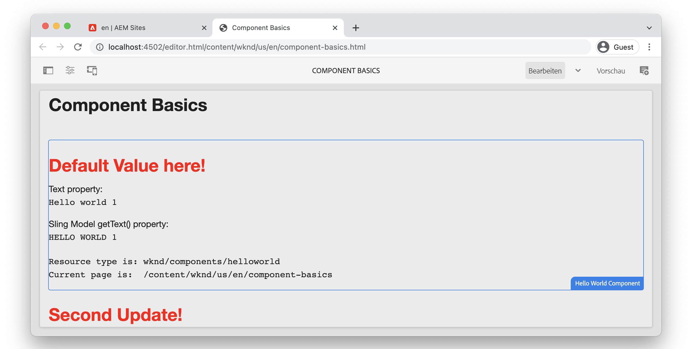

# Komponenten – Grundlagen {#component-basics}

In diesem Kapitel untersuchen wir die zugrunde liegende Technologie einer Adobe Experience Manager (AEM)-Sites-Komponente durch eine einfache `HelloWorld` Beispiel. Es werden kleine Änderungen an einer vorhandenen Komponente vorgenommen, die Themen wie Authoring, HTL, Sling-Modelle, Client-seitige Bibliotheken abdecken.

## Voraussetzungen {#prerequisites}

Überprüfen Sie die erforderlichen Tools und Anweisungen zum Einrichten eines [lokale Entwicklungsumgebung](./overview.md#local-dev-environment).

Die in den Videos verwendete IDE lautet [Visual Studio-Code](https://code.visualstudio.com/) und [VSCode AEM Sync](https://marketplace.visualstudio.com/items?itemName=yamato-ltd.vscode-aem-sync) Plug-in.

## Ziel {#objective}

1. Erfahren Sie mehr über die Rolle von HTL-Vorlagen und Sling-Modellen zum dynamischen Rendern von HTML.
1. Erfahren Sie, wie Dialogfelder zur Erleichterung der Inhaltserstellung verwendet werden.
1. Lernen Sie die Grundlagen von Client-seitigen Bibliotheken kennen, um CSS und JavaScript einzuschließen und eine Komponente zu unterstützen.

## Was Sie erstellen werden {#what-build}

In diesem Kapitel nehmen Sie verschiedene Änderungen an einem einfachen `HelloWorld` -Komponente. Beim Aktualisieren von `HelloWorld` -Komponente erhalten Sie Informationen über die wichtigsten Bereiche der Entwicklung AEM Komponenten.

## Chapter Starter Project {#starter-project}

Dieses Kapitel baut auf einem generischen Projekt auf, das von der [AEM Projektarchetyp](https://github.com/adobe/aem-project-archetype). Sehen Sie sich das folgende Video an und überprüfen Sie die [Voraussetzungen](#prerequisites) um loszulegen!

>[!NOTE]
>
> Wenn Sie das vorherige Kapitel erfolgreich abgeschlossen haben, können Sie das Projekt wiederverwenden und die Schritte zum Auschecken des Starterprojekts überspringen.

>[!VIDEO](https://video.tv.adobe.com/v/330985/?quality=12&learn=on)

Öffnen Sie ein neues Befehlszeilen-Terminal und führen Sie die folgenden Aktionen aus.

1. In einem leeren Verzeichnis klonen Sie die [aem-guides-wknd](https://github.com/adobe/aem-guides-wknd) repository:

   ```shell
   $ git clone git@github.com:adobe/aem-guides-wknd.git --branch tutorial/component-basics-start --single-branch
   ```

   >[!NOTE]
   >
   > Optional können Sie das im vorherigen Kapitel erstellte Projekt weiterhin verwenden. [Projekteinrichtung](./project-setup.md).

1. Navigieren Sie zur  `aem-guides-wknd` Ordner.

   ```shell
   $ cd aem-guides-wknd
   ```

1. Erstellen Sie das Projekt und stellen Sie es mit dem folgenden Befehl in einer lokalen Instanz von AEM bereit:

   ```shell
   $ mvn clean install -PautoInstallSinglePackage
   ```

   >[!NOTE]
   >
   > Wenn Sie AEM 6.5 oder 6.4 verwenden, hängen Sie die `classic` Profile zu beliebigen Maven-Befehlen hinzufügen.

   ```shell
   $ mvn clean install -PautoInstallSinglePackage -Pclassic
   ```

1. Importieren Sie das Projekt in Ihre bevorzugte IDE, indem Sie die Anweisungen zum Einrichten einer [lokale Entwicklungsumgebung](overview.md#local-dev-environment).

## Komponentenbearbeitung {#component-authoring}

Komponenten können als kleine modulare Bausteine einer Webseite betrachtet werden. Um Komponenten wiederverwenden zu können, müssen die Komponenten konfigurierbar sein. Dies erfolgt über das Dialogfeld &quot;Autor&quot;. Als Nächstes erstellen wir eine einfache Komponente und untersuchen, wie Werte aus dem Dialogfeld in AEM beibehalten werden.

>[!VIDEO](https://video.tv.adobe.com/v/330986/?quality=12&learn=on)

Im Folgenden finden Sie die allgemeinen Schritte, die im obigen Video ausgeführt werden.

1. Erstellen Sie eine Seite mit dem Namen **Komponentengrundlagen** unter **WKND-Site** `>` **USA** `>` **en**.
1. Fügen Sie die **Hello World-Komponente** auf die neu erstellte Seite.
1. Öffnen Sie das Dialogfeld für die Komponente und geben Sie Text ein. Speichern Sie die Änderungen, um die Meldung auf der Seite anzuzeigen.
1. Wechseln Sie in den Entwicklermodus, zeigen Sie den Inhaltspfad in CRXDE-Lite an und überprüfen Sie die Eigenschaften der Komponenteninstanz.
1. Verwenden Sie CRXDE-Lite, um die `cq:dialog` und `helloworld.html` Skript aus `/apps/wknd/components/content/helloworld`.

## HTL (HTML-Vorlagensprache) und Dialogfelder {#htl-dialogs}

HTML-Vorlagensprache oder **[HTL](https://experienceleague.adobe.com/docs/experience-manager-htl/content/getting-started.html)** ist eine leichte, serverseitige Vorlagensprache, die von AEM Komponenten zum Rendern von Inhalten verwendet wird.

**Dialogfelder** Definieren Sie die verfügbaren Konfigurationen, die für eine Komponente vorgenommen werden können.

Als Nächstes aktualisieren wir die `HelloWorld` HTL-Skript, um eine zusätzliche Begrüßung vor der Textnachricht anzuzeigen.

>[!VIDEO](https://video.tv.adobe.com/v/330987/?quality=12&learn=on)

Im Folgenden finden Sie die allgemeinen Schritte, die im obigen Video ausgeführt werden.

1. Wechseln Sie zur IDE und öffnen Sie das Projekt zum `ui.apps` -Modul.
1. Öffnen Sie die `helloworld.html` und aktualisieren Sie das HTML Markup.
1. Verwenden Sie die IDE-Tools wie [VSCode AEM Sync](https://marketplace.visualstudio.com/items?itemName=yamato-ltd.vscode-aem-sync) , um die Dateiänderung mit der lokalen AEM zu synchronisieren.
1. Kehren Sie zum Browser zurück und beobachten Sie, dass sich der Komponenten-Renderer geändert hat.
1. Öffnen Sie die `.content.xml` -Datei, die das Dialogfeld für die `HelloWorld` Komponente unter:

   ```plain
   <code>/aem-guides-wknd/ui.apps/src/main/content/jcr_root/apps/wknd/components/helloworld/_cq_dialog/.content.xml
   ```

1. Aktualisieren Sie das Dialogfeld, um ein zusätzliches Textfeld mit dem Namen **Titel** mit dem Namen `./title`:

   ```xml
   <?xml version="1.0" encoding="UTF-8"?>
   <jcr:root xmlns:sling="http://sling.apache.org/jcr/sling/1.0" xmlns:cq="http://www.day.com/jcr/cq/1.0" xmlns:jcr="http://www.jcp.org/jcr/1.0" xmlns:nt="http://www.jcp.org/jcr/nt/1.0"
       jcr:primaryType="nt:unstructured"
       jcr:title="Properties"
       sling:resourceType="cq/gui/components/authoring/dialog">
       <content
           jcr:primaryType="nt:unstructured"
           sling:resourceType="granite/ui/components/coral/foundation/fixedcolumns">
           <items jcr:primaryType="nt:unstructured">
               <column
                   jcr:primaryType="nt:unstructured"
                   sling:resourceType="granite/ui/components/coral/foundation/container">
                   <items jcr:primaryType="nt:unstructured">
                       <title
                           jcr:primaryType="nt:unstructured"
                           sling:resourceType="granite/ui/components/coral/foundation/form/textfield"
                           fieldLabel="Title"
                           name="./title"/>
                       <text
                           jcr:primaryType="nt:unstructured"
                           sling:resourceType="granite/ui/components/coral/foundation/form/textfield"
                           fieldLabel="Text"
                           name="./text"/>
                   </items>
               </column>
           </items>
       </content>
   </jcr:root>
   ```

1. Datei erneut öffnen `helloworld.html`, das das Haupt-HTL-Skript darstellt, das für das Rendern der `HelloWorld` Komponente aus folgendem Pfad:

   ```plain
       <code>/aem-guides-wknd.ui.apps/src/main/content/jcr_root/apps/wknd/components/helloworld/helloworld.html
   ```

1. Aktualisieren `helloworld.html` , um den Wert der **Grußformeln** textfield als Teil eines `H1` Tag:

   ```html
   <div class="cmp-helloworld" data-cmp-is="helloworld">
       <h1 class="cmp-helloworld__title">${properties.title}</h1>
       ...
   </div>
   ```

1. Stellen Sie die Änderungen mithilfe des Entwickler-Plug-ins oder mithilfe Ihrer Maven-Fähigkeiten auf einer lokalen Instanz von AEM bereit.

## Sling-Modelle {#sling-models}

Sling-Modelle sind von Anmerkungen gesteuerte Java™-&quot;POJOs&quot;(Plain Old Java™ Objects), die die Zuordnung von Daten aus JCR zu Java™-Variablen erleichtern. Sie bieten auch mehrere andere Schönheiten bei der Entwicklung im Kontext von AEM.

Nehmen wir als Nächstes einige Aktualisierungen am `HelloWorldModel` Sling-Modell verwenden, um eine gewisse Geschäftslogik auf die im JCR gespeicherten Werte anzuwenden, bevor sie auf die Seite ausgegeben werden.

>[!VIDEO](https://video.tv.adobe.com/v/330988/?quality=12&learn=on)

1. Öffnen Sie die Datei `HelloWorldModel.java`, das mit dem Sling-Modell verwendet wird, das mit der `HelloWorld` -Komponente.

   ```plain
   <code>/aem-guides-wknd.core/src/main/java/com/adobe/aem/guides/wknd/core/models/HelloWorldModel.java
   ```

1. Fügen Sie die folgenden Importanweisungen hinzu:

   ```java
   import org.apache.commons.lang3.StringUtils;
   import org.apache.sling.models.annotations.DefaultInjectionStrategy;
   ```

1. Aktualisieren Sie die `@Model` Anmerkung zur Verwendung von `DefaultInjectionStrategy`:

   ```java
   @Model(adaptables = Resource.class,
      defaultInjectionStrategy = DefaultInjectionStrategy.OPTIONAL)
      public class HelloWorldModel {
      ...
   ```

1. Fügen Sie die folgenden Zeilen zum `HelloWorldModel` -Klasse zum Zuordnen der Werte der JCR-Eigenschaften der Komponente `title` und `text` auf Java™-Variablen:

   ```java
   ...
   @Model(adaptables = Resource.class,
   defaultInjectionStrategy = DefaultInjectionStrategy.OPTIONAL)
   public class HelloWorldModel {
   
       ...
   
       @ValueMapValue
       private String title;
   
       @ValueMapValue
       private String text;
   
       @PostConstruct
       protected void init() {
           ...
   ```

1. Fügen Sie die folgende Methode hinzu `getTitle()` der `HelloWorldModel` -Klasse, die den Wert der Eigenschaft `title`. Diese Methode fügt die zusätzliche Logik hinzu, um den Zeichenfolgenwert &quot;Default Value here&quot;zurückzugeben. if -Eigenschaft `title` null oder leer ist:

   ```java
   /***
   *
   * @return the value of title, if null or blank returns "Default Value here!"
   */
   public String getTitle() {
       return StringUtils.isNotBlank(title) ? title : "Default Value here!";
   }
   ```

1. Fügen Sie die folgende Methode hinzu `getText()` der `HelloWorldModel` -Klasse, die den Wert der Eigenschaft `text`. Diese Methode wandelt den String in alle Großbuchstaben um.

   ```java
       /***
       *
       * @return All caps variation of the text value
       */
   public String getText() {
       return StringUtils.isNotBlank(this.text) ? this.text.toUpperCase() : null;
   }
   ```

1. Erstellen und stellen Sie das Bundle aus dem `core` -Modul:

   ```shell
   $ cd core
   $ mvn clean install -PautoInstallBundle
   ```

   >[!NOTE]
   >
   > Für AEM 6.4/6.5 `mvn clean install -PautoInstallBundle -Pclassic`

1. Datei aktualisieren `helloworld.html` at `aem-guides-wknd.ui.apps/src/main/content/jcr_root/apps/wknd/components/content/helloworld/helloworld.html` , um die neu erstellten Methoden der `HelloWorld` model:

   ```html
   <div class="cmp-helloworld" data-cmp-is="helloworld"
   data-sly-use.model="com.adobe.aem.guides.wknd.core.models.HelloWorldModel">
       <h1 class="cmp-helloworld__title">${model.title}</h1>
       <div class="cmp-helloworld__item" data-sly-test="${properties.text}">
           <p class="cmp-helloworld__item-label">Text property:</p>
           <pre class="cmp-helloworld__item-output" data-cmp-hook-helloworld="property">${properties.text}</pre>
       </div>
       <div class="cmp-helloworld__item" data-sly-test="${model.text}">
           <p class="cmp-helloworld__item-label">Sling Model getText() property:</p>
           <pre class="cmp-helloworld__item-output" data-cmp-hook-helloworld="property">${model.text}</pre>
       </div>
       <div class="cmp-helloworld__item"  data-sly-test="${model.message}">
           <p class="cmp-helloworld__item-label">Model message:</p>
           <pre class="cmp-helloworld__item-output"data-cmp-hook-helloworld="model">${model.message}</pre>
       </div>
   </div>
   ```

1. Stellen Sie die Änderungen mithilfe des Eclipse Developer-Plug-ins oder mithilfe Ihrer Maven-Fähigkeiten auf einer lokalen Instanz von AEM bereit.

## Client-seitige Bibliotheken {#client-side-libraries}

Client-seitige Bibliotheken, `clientlibs` bietet kurz einen Mechanismus zum Organisieren und Verwalten von CSS- und JavaScript-Dateien, die für eine AEM Sites-Implementierung erforderlich sind. Clientseitige Bibliotheken sind die Standardmethode zum Einschließen von CSS und JavaScript in eine Seite in AEM.

Die [ui.frontend](https://experienceleague.adobe.com/docs/experience-manager-core-components/using/developing/archetype/uifrontend.html?lang=de) -Modul ist ein entkoppeltes [Webpack](https://webpack.js.org/) -Projekt, das in den Build-Prozess integriert ist. Dies ermöglicht die Verwendung beliebter Front-End-Bibliotheken wie Sass, LESS und TypeScript. Die `ui.frontend` -Modul wird im Abschnitt [Kapitel zu Client-seitigen Bibliotheken](/help/getting-started-wknd-tutorial-develop/project-archetype/client-side-libraries.md).

Aktualisieren Sie anschließend die CSS-Stile für die `HelloWorld` -Komponente.

>[!VIDEO](https://video.tv.adobe.com/v/340750/?quality=12&learn=on)

Im Folgenden finden Sie die allgemeinen Schritte, die im obigen Video ausgeführt werden.

1. Öffnen Sie ein Terminal-Fenster und navigieren Sie zum `ui.frontend` directory

1. Einstieg `ui.frontend` Verzeichnis ausführen `npm install npm-run-all --save-dev` -Befehl zum Installieren der [npm-run-all](https://www.npmjs.com/package/npm-run-all) Knotenmodul. Dieser Schritt ist **erforderlich für AEM Projektarchetyp 39** in der kommenden Archetyp-Version ist dies nicht erforderlich.

1. Führen Sie als Nächstes den `npm run watch` command:

   ```shell
   $ npm run watch
   ```

1. Wechseln Sie zur IDE und öffnen Sie das Projekt zum `ui.frontend` -Modul.
1. Öffnen Sie die Datei `ui.frontend/src/main/webpack/components/_helloworld.scss`.
1. Aktualisieren Sie die Datei, um einen roten Titel anzuzeigen:

   ```scss
   .cmp-helloworld {}
   .cmp-helloworld__title {
       color: red;
   }
   ```

1. Im Terminal sollte eine Aktivität angezeigt werden, die angibt, dass die `ui.frontend` -Modul kompiliert und synchronisiert die Änderungen mit der lokalen Instanz von AEM.

   ```shell
   Entrypoint site 214 KiB = clientlib-site/site.css 8.45 KiB clientlib-site/site.js 206 KiB
   2022-02-22 17:28:51: webpack 5.69.1 compiled successfully in 119 ms
   change:dist/index.html
   + jcr_root/apps/wknd/clientlibs/clientlib-site/css/site.css
   + jcr_root/apps/wknd/clientlibs/clientlib-site/css
   + jcr_root/apps/wknd/clientlibs/clientlib-site/js/site.js
   + jcr_root/apps/wknd/clientlibs/clientlib-site/js
   + jcr_root/apps/wknd/clientlibs/clientlib-site
   + jcr_root/apps/wknd/clientlibs/clientlib-dependencies/css.txt
   + jcr_root/apps/wknd/clientlibs/clientlib-dependencies/js.txt
   + jcr_root/apps/wknd/clientlibs/clientlib-dependencies
   ```

1. Kehren Sie zum Browser zurück und beobachten Sie, dass sich die Titelfarbe geändert hat.

   

## Herzlichen Glückwunsch! {#congratulations}

Herzlichen Glückwunsch! Sie haben die Grundlagen der Komponentenentwicklung in Adobe Experience Manager gelernt!

### Nächste Schritte {#next-steps}

Kennenlernen der Adobe Experience Manager-Seiten und -Vorlagen im nächsten Kapitel [Seiten und Vorlagen](pages-templates.md). Erfahren Sie, wie Kernkomponenten in das Projekt integriert werden, und lernen Sie erweiterte Richtlinienkonfigurationen bearbeitbarer Vorlagen kennen, um eine gut strukturierte Artikelseitenvorlage zu erstellen.

Anzeigen des fertigen Codes unter [GitHub](https://github.com/adobe/aem-guides-wknd) oder den Code lokal in der Git-Verzweigung überprüfen und bereitstellen `tutorial/component-basics-solution`.
