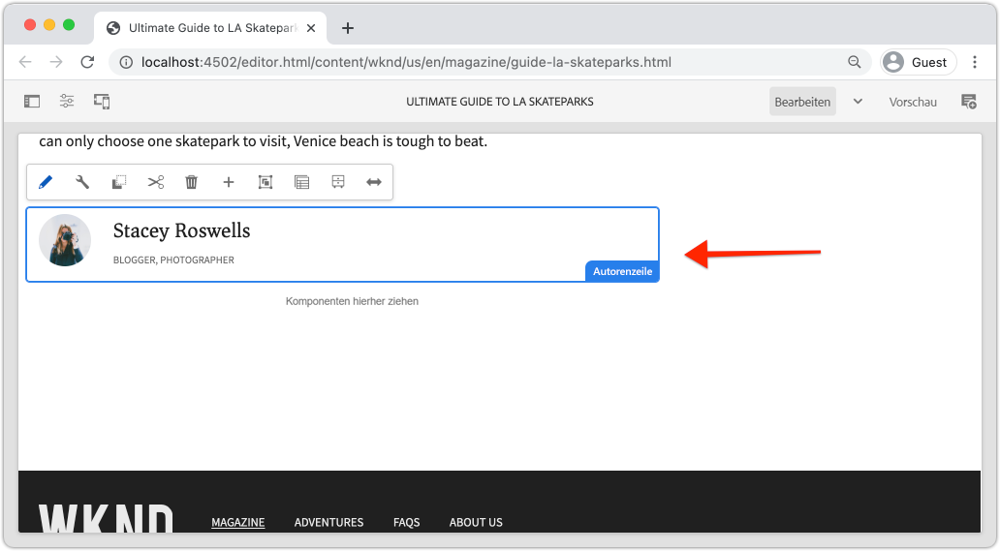
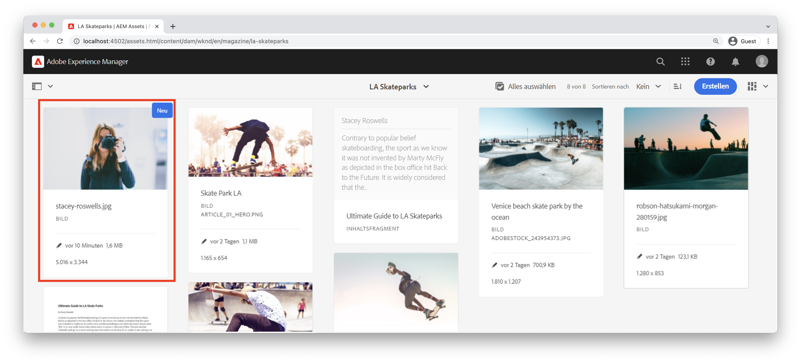
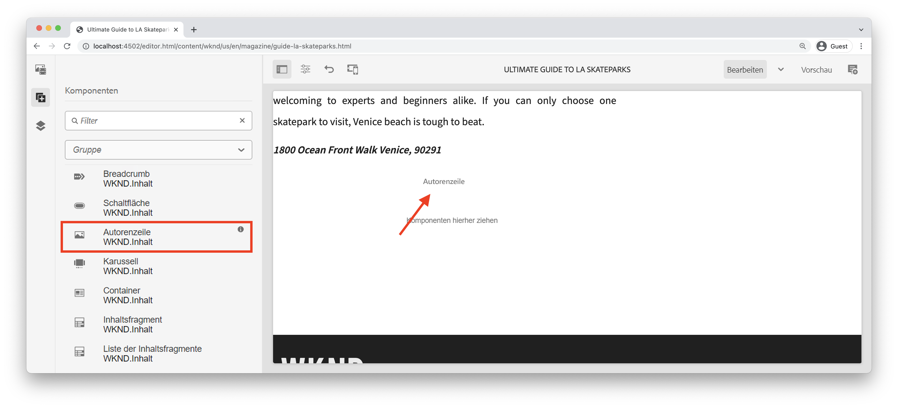
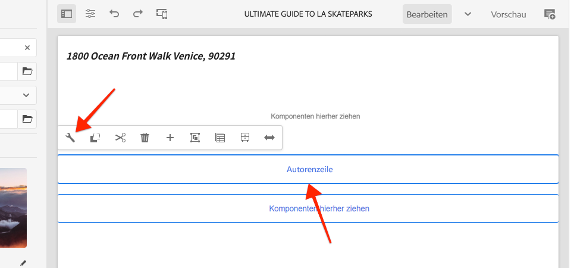
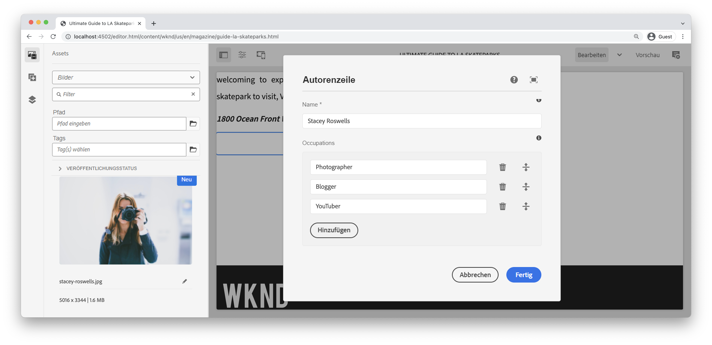
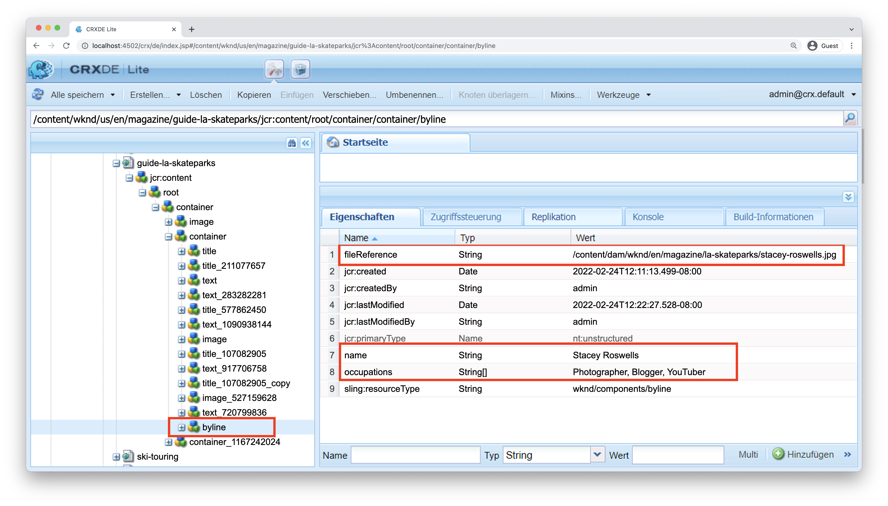
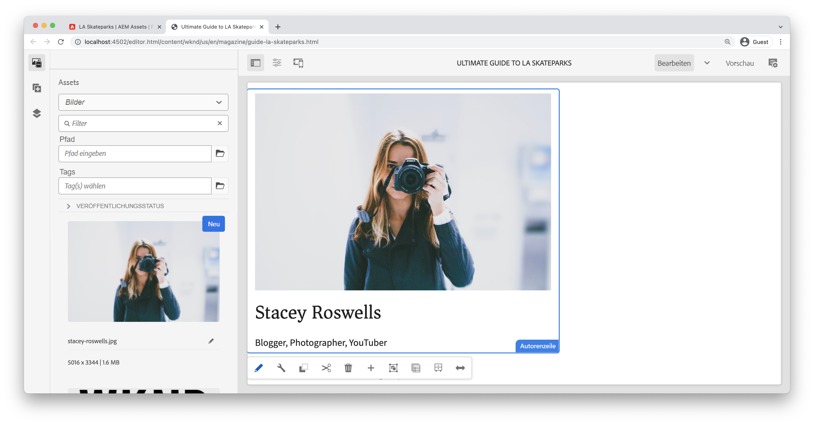
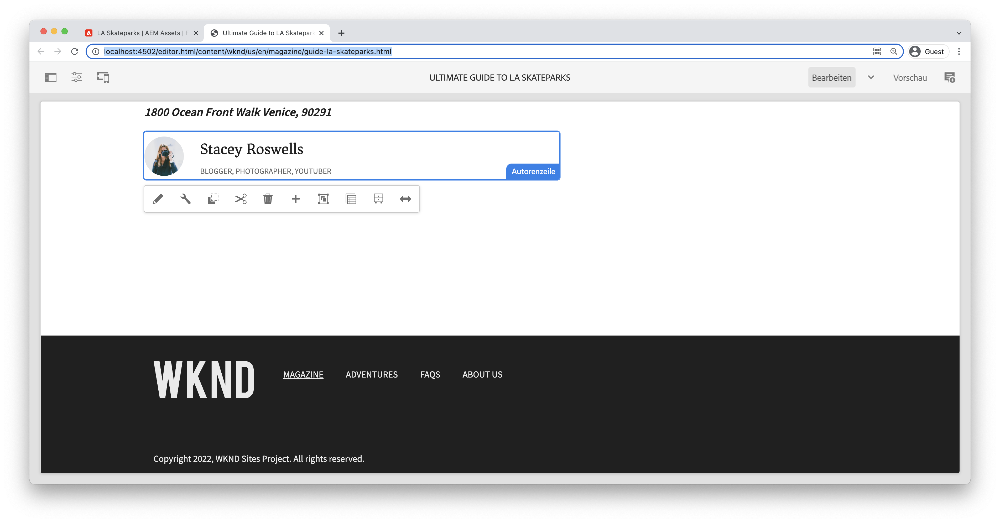

# Benutzerdefinierte Komponente {#custom-component}

In diesem Lernprogramm wird die End-to-End-Erstellung einer benutzerdefinierten AEM-Byline-Komponente behandelt, die Inhalte anzeigt, die in einem Dialog verfasst wurden, und die Entwicklung eines Sling-Modells untersucht, um Geschäftslogik zu kapseln, die die HTML-Datei der Komponente ausfüllt.

## Voraussetzungen {#prerequisites}

Überprüfen Sie die erforderlichen Werkzeuge und Anweisungen zum Einrichten einer [lokalen Entwicklungs-Umgebung](overview.md#local-dev-environment).

### Starterprojekt

>[!NOTE]
>
> Wenn Sie das vorherige Kapitel erfolgreich abgeschlossen haben, können Sie das Projekt erneut verwenden und die Schritte zum Auschecken des Startprojekts überspringen.

Sehen Sie sich den Basiscode an, auf dem das Lernprogramm basiert:

1. Sehen Sie sich die Verzweigung `tutorial/custom-component-start` von [GitHub](https://github.com/adobe/aem-guides-wknd) an.

   ```shell
   $ cd aem-guides-wknd
   $ git checkout tutorial/custom-component-start
   ```

1. Stellen Sie mithilfe Ihrer Maven-Fähigkeiten eine Codebasis für eine lokale AEM bereit:

   ```shell
   $ mvn clean install -PautoInstallSinglePackage
   ```

   >[!NOTE]
   >
   > Wenn Sie AEM 6.5 oder 6.4 verwenden, hängen Sie das `classic`-Profil an beliebige Maven-Befehle an.

   ```shell
   $ mvn clean install -PautoInstallSinglePackage -Pclassic
   ```

Sie können den fertigen Code immer auf [GitHub](https://github.com/adobe/aem-guides-wknd/tree/tutorial/custom-component-solution) oder lokal prüfen, indem Sie zur Verzweigung `tutorial/custom-component-solution` wechseln.

## Vorgabe

1. Verstehen Sie, wie Sie eine benutzerdefinierte AEM-Komponente erstellen.
1. Erfahren Sie, wie Sie Geschäftslogik mit Sling-Modellen einbinden können
1. Verstehen Sie, wie Sie ein Sling-Modell aus einem HTML-Skript verwenden.

## Was Sie erstellen werden {#byline-component}

In diesem Teil des WKND-Tutorials wird eine Autorenzeilenkomponente erstellt, mit der verfasste Informationen zum Beitragenden eines Artikels angezeigt werden.



*Autorenkomponente*

Die Implementierung der Komponente &quot;Byline&quot;umfasst ein Dialogfeld, das den byline-Inhalt erfasst, sowie ein benutzerdefiniertes Sling-Modell, das die folgenden Elemente abruft:

* Name
* Bild
* Berufe

## Autorenzeilenkomponente {#create-byline-component} erstellen

Erstellen Sie zunächst die Knotenstruktur der Byline-Komponente und definieren Sie ein Dialogfeld. Dies stellt die Komponente in AEM dar und definiert implizit den Ressourcentyp der Komponente nach ihrem Speicherort im JCR.

Das Dialogfeld zeigt die Schnittstelle an, über die Autoren Inhalte bereitstellen können. Bei dieser Implementierung wird die Komponente **Bild** der AEM WCM-Kernkomponente zur Bearbeitung des Authoring- und Renderings des Bylinebilds verwendet, sodass sie als `sling:resourceSuperType` der Komponente eingestellt wird.

### Komponentendefinition erstellen {#create-component-definition}

1. Navigieren Sie im Modul **ui.apps** zu `/apps/wknd/components` und erstellen Sie einen neuen Ordner mit dem Namen `byline`.
1. Fügen Sie unter dem Ordner `byline` eine neue Datei mit dem Namen `.content.xml` hinzu.

   

1. Füllen Sie die Datei `.content.xml` mit folgendem Inhalt:

   ```xml
   <?xml version="1.0" encoding="UTF-8"?>
       <jcr:root xmlns:sling="http://sling.apache.org/jcr/sling/1.0" xmlns:cq="http://www.day.com/jcr/cq/1.0" xmlns:jcr="http://www.jcp.org/jcr/1.0"
       jcr:primaryType="cq:Component"
       jcr:title="Byline"
       jcr:description="Displays a contributor's byline."
       componentGroup="WKND Sites Project - Content"
       sling:resourceSuperType="core/wcm/components/image/v2/image"/>
   ```

   Die obige XML-Datei enthält die Definition der Komponente, einschließlich Titel, Beschreibung und Gruppe. Die `sling:resourceSuperType` verweist auf `core/wcm/components/image/v2/image`, die [Core-Image-Komponente](https://experienceleague.adobe.com/docs/experience-manager-core-components/using/components/image.html?lang=de).

### HTML-Skript {#create-the-htl-script} erstellen

1. Fügen Sie unter dem Ordner `byline` eine neue Datei `byline.html` hinzu, die für die HTML-Darstellung der Komponente verantwortlich ist. Es ist wichtig, die Datei mit dem Ordner zu benennen, da sie das Standardskript ist, mit dem Sling diesen Ressourcentyp rendert.

1. hinzufügen Sie den folgenden Code an das `byline.html`.

   ```html
   <!--/* byline.html */-->
   <div data-sly-use.placeholderTemplate="core/wcm/components/commons/v1/templates.html">
   </div>
   <sly data-sly-call="${placeholderTemplate.placeholder @ isEmpty=true}"></sly>
   ```

`byline.html` wird später [ ](#byline-htl)erneut angezeigt, sobald das Sling-Modell erstellt wurde. Der aktuelle Status der HTL-Datei ermöglicht die Anzeige der Komponente in einem leeren Status im AEM-Sites-Editor, wenn sie per Drag &amp; Drop auf die Seite gezogen wird.

### Dialogfelddefinition {#create-the-dialog-definition} erstellen

Definieren Sie als Nächstes ein Dialogfeld für die Komponente &quot;Byline&quot;mit den folgenden Feldern:

* **Name**: ein Textfeld, das den Namen des Beitragenden enthält.
* **Bild**: ein Verweis auf das Biobild des Beitragenden.
* **Berufe**: eine Liste der dem Mitarbeiter zugeschriebenen Berufe. Berufe sollten alphabetisch in aufsteigender Reihenfolge sortiert werden (a bis z).

1. Erstellen Sie unter dem Ordner `byline` einen neuen Ordner mit dem Namen `_cq_dialog`.
1. Fügen Sie unter `byline/_cq_dialog` eine neue Datei mit dem Namen `.content.xml` hinzu. Dies ist die XML-Definition für das Dialogfeld. hinzufügen folgende XML:

   ```xml
   <?xml version="1.0" encoding="UTF-8"?>
   <jcr:root xmlns:sling="http://sling.apache.org/jcr/sling/1.0" xmlns:cq="http://www.day.com/jcr/cq/1.0" xmlns:jcr="http://www.jcp.org/jcr/1.0" xmlns:nt="http://www.jcp.org/jcr/nt/1.0"
           jcr:primaryType="nt:unstructured"
           jcr:title="Byline"
           sling:resourceType="cq/gui/components/authoring/dialog">
       <content
               jcr:primaryType="nt:unstructured"
               sling:resourceType="granite/ui/components/coral/foundation/container">
           <items jcr:primaryType="nt:unstructured">
               <tabs
                       jcr:primaryType="nt:unstructured"
                       sling:resourceType="granite/ui/components/coral/foundation/tabs"
                       maximized="{Boolean}false">
                   <items jcr:primaryType="nt:unstructured">
                       <asset
                               jcr:primaryType="nt:unstructured"
                               sling:hideResource="{Boolean}false"/>
                       <metadata
                               jcr:primaryType="nt:unstructured"
                               sling:hideResource="{Boolean}true"/>
                       <properties
                               jcr:primaryType="nt:unstructured"
                               jcr:title="Properties"
                               sling:resourceType="granite/ui/components/coral/foundation/container"
                               margin="{Boolean}true">
                           <items jcr:primaryType="nt:unstructured">
                               <columns
                                       jcr:primaryType="nt:unstructured"
                                       sling:resourceType="granite/ui/components/coral/foundation/fixedcolumns"
                                       margin="{Boolean}true">
                                   <items jcr:primaryType="nt:unstructured">
                                       <column
                                               jcr:primaryType="nt:unstructured"
                                               sling:resourceType="granite/ui/components/coral/foundation/container">
                                           <items jcr:primaryType="nt:unstructured">
                                               <name
                                                       jcr:primaryType="nt:unstructured"
                                                       sling:resourceType="granite/ui/components/coral/foundation/form/textfield"
                                                       emptyText="Enter the contributor's name to display."
                                                       fieldDescription="The contributor's name to display."
                                                       fieldLabel="Name"
                                                       name="./name"
                                                       required="{Boolean}true"/>
                                               <occupations
                                                       jcr:primaryType="nt:unstructured"
                                                       sling:resourceType="granite/ui/components/coral/foundation/form/multifield"
                                                       fieldDescription="A list of the contributor's occupations."
                                                       fieldLabel="Occupations"
                                                       required="{Boolean}false">
                                                   <field
                                                           jcr:primaryType="nt:unstructured"
                                                           sling:resourceType="granite/ui/components/coral/foundation/form/textfield"
                                                           emptyText="Enter an occupation"
                                                           name="./occupations"/>
                                               </occupations>
                                           </items>
                                       </column>
                                   </items>
                               </columns>
                           </items>
                       </properties>
                   </items>
               </tabs>
           </items>
       </content>
   </jcr:root>
   ```

   Diese Knotendefinitionen des Dialogfelds verwenden den [Sling Resource Merger](https://sling.apache.org/documentation/bundles/resource-merger.html), um zu steuern, welche Dialogfelder von der `sling:resourceSuperType`-Komponente geerbt werden, in diesem Fall die **Core Components&#39; Image-Komponente**.

   

### Dialogfeld &quot;Richtlinie erstellen&quot; {#create-the-policy-dialog}

Erstellen Sie nach demselben Ansatz wie bei der Dialogfelderstellung ein Dialogfeld &quot;Richtlinie&quot;(früher &quot;Designdialog&quot;), um unerwünschte Felder in der Richtlinienkonfiguration auszublenden, die aus der Bildkomponente der Kernkomponenten übernommen wurden.

1. Erstellen Sie unter dem Ordner `byline` einen neuen Ordner mit dem Namen `_cq_design_dialog`.
1. Erstellen Sie unter `byline/_cq_design_dialog` eine neue Datei mit dem Namen `.content.xml`. Aktualisieren Sie die Datei wie folgt: mit der folgenden XML. Es ist am einfachsten, das `.content.xml` zu öffnen und die unten stehende XML zu kopieren/einzufügen.

   ```xml
   <?xml version="1.0" encoding="UTF-8"?>
   <jcr:root xmlns:sling="http://sling.apache.org/jcr/sling/1.0" xmlns:granite="http://www.adobe.com/jcr/granite/1.0" xmlns:cq="http://www.day.com/jcr/cq/1.0" xmlns:jcr="http://www.jcp.org/jcr/1.0" xmlns:nt="http://www.jcp.org/jcr/nt/1.0"
       jcr:primaryType="nt:unstructured"
       jcr:title="Byline"
       sling:resourceType="cq/gui/components/authoring/dialog">
       <content
               jcr:primaryType="nt:unstructured">
           <items jcr:primaryType="nt:unstructured">
               <tabs
                       jcr:primaryType="nt:unstructured">
                   <items jcr:primaryType="nt:unstructured">
                       <properties
                               jcr:primaryType="nt:unstructured">
                           <items jcr:primaryType="nt:unstructured">
                               <content
                                       jcr:primaryType="nt:unstructured">
                                   <items jcr:primaryType="nt:unstructured">
                                       <decorative
                                               jcr:primaryType="nt:unstructured"
                                               sling:hideResource="{Boolean}true"/>
                                       <altValueFromDAM
                                               jcr:primaryType="nt:unstructured"
                                               sling:hideResource="{Boolean}true"/>
                                       <titleValueFromDAM
                                               jcr:primaryType="nt:unstructured"
                                               sling:hideResource="{Boolean}true"/>
                                       <displayCaptionPopup
                                               jcr:primaryType="nt:unstructured"
                                               sling:hideResource="{Boolean}true"/>
                                       <disableUuidTracking
                                               jcr:primaryType="nt:unstructured"
                                               sling:hideResource="{Boolean}true"/>
                                   </items>
                               </content>
                           </items>
                       </properties>
                       <features
                               jcr:primaryType="nt:unstructured">
                           <items jcr:primaryType="nt:unstructured">
                               <content
                                       jcr:primaryType="nt:unstructured">
                                   <items jcr:primaryType="nt:unstructured">
                                       <accordion
                                               jcr:primaryType="nt:unstructured">
                                           <items jcr:primaryType="nt:unstructured">
                                               <orientation
                                                       jcr:primaryType="nt:unstructured"
                                                       sling:hideResource="{Boolean}true"/>
                                               <crop
                                                       jcr:primaryType="nt:unstructured"
                                                       sling:hideResource="{Boolean}true"/>
                                           </items>
                                       </accordion>
                                   </items>
                               </content>
                           </items>
                       </features>
                   </items>
               </tabs>
           </items>
       </content>
   </jcr:root>
   ```

   Die Grundlage für das vorangegangene **Dialogfeld &quot;Richtlinie** XML&quot;wurde von der [Core-Komponenten-Bildkomponente](https://github.com/adobe/aem-core-wcm-components/blob/master/content/src/content/jcr_root/apps/core/wcm/components/image/v2/image/_cq_design_dialog/.content.xml) abgerufen.

   Wie in der Dialogfeldkonfiguration wird [Sling Resource Merger](https://sling.apache.org/documentation/bundles/resource-merger.html) verwendet, um irrelevante Felder auszublenden, die ansonsten von `sling:resourceSuperType` geerbt werden, wie die Knotendefinitionen mit der Eigenschaft `sling:hideResource="{Boolean}true"` erkennen.

### Code {#deploy-the-code} bereitstellen

1. Stellen Sie mithilfe Ihrer Maven-Fähigkeiten die aktualisierte Codebasis auf einer lokalen AEM bereit:

   ```shell
   $ cd aem-guides-wknd
   $ mvn clean install -PautoInstallSinglePackage
   ```

## hinzufügen der Komponente auf einer Seite {#add-the-component-to-a-page}

Um die Dinge einfach zu gestalten und AEM Komponentenentwicklung zu fokussieren, fügen wir die Byline-Komponente in ihrem aktuellen Status einer Article-Seite hinzu, um zu überprüfen, ob die `cq:Component`-Knotendefinition bereitgestellt und korrekt ist. AEM erkennt die neue Komponentendefinition und das Komponentendialogfeld funktioniert für das Authoring.

### hinzufügen ein Bild für das AEM Assets

Laden Sie zunächst einen Beispielkopf nach AEM Assets hoch, um das Bild in der Komponente &quot;Autorenzeile&quot;zu füllen.

1. Navigieren Sie zum Ordner &quot;LA Skateparks&quot;in AEM Assets: [http://localhost:4502/assets.html/content/dam/wknd/en/magazine/la-skateparks](http://localhost:4502/assets.html/content/dam/wknd/en/magazine/la-skateparks).

1. Laden Sie den Head Shot für **[stacey-roswells.jpg](assets/custom-component/stacey-roswells.jpg)** in den Ordner hoch.

   

### Komponente {#author-the-component} erstellen

Fügen Sie dann die Komponente &quot;Byline&quot;einer Seite in AEM hinzu. Da die Komponente &quot;Byline&quot;der Komponentengruppe **WKND-Sites-Projekt - Content** hinzugefügt wurde, steht sie über die `ui.apps/src/main/content/jcr_root/apps/wknd/components/byline/.content.xml`-Definition automatisch jedem **Container zur Verfügung, dessen** Richtlinie **die Komponentengruppe** WKND-Sites-Projekt - Content **zulässt, die die die die die Artikelseite Layout Container ist.**

1. Navigieren Sie zum Artikel LA Skatepark unter: [http://localhost:4502/editor.html/content/wknd/us/en/magazine/guide-la-skateparks.html](http://localhost:4502/editor.html/content/wknd/us/en/magazine/guide-la-skateparks.html)

1. Ziehen Sie aus der linken Seitenleiste eine **Byline-Komponente** auf **unten** des Layout-Containers der geöffneten Artikelseite.

   

1. Vergewissern Sie sich, dass die linke Seitenleiste **geöffnet und sichtbar ist und die** Asset-Suche **ausgewählt ist.**

   

1. Wählen Sie den Platzhalter für die **Byline-Komponente** aus, der wiederum die Aktionsleiste anzeigt, und tippen Sie auf das Symbol **Schraubenschlüssel**, um das Dialogfeld zu öffnen.

   

1. Öffnen Sie die linke Seitenleiste, während das Dialogfeld geöffnet und die erste Registerkarte (Asset) aktiv ist, und ziehen Sie aus der Asset-Suche ein Bild in die Bild-Dropdownzone. Suchen Sie nach &quot;stacey&quot;, um das Bio-Bild von Stacey Roswells zu finden, das im WKND ui.content-Paket bereitgestellt wird.

   

1. Nachdem Sie ein Bild hinzugefügt haben, klicken Sie auf die Registerkarte **Eigenschaften**, um **Name** und **Berufe** einzugeben.

   Geben Sie bei der Aufnahme von Berufen diese in der Reihenfolge **umgekehrt alphabetisch** ein, damit die alphabetische Geschäftslogik, die wir im Sling-Modell implementieren werden, sofort erkennbar ist.

   Tippen Sie unten rechts auf die Schaltfläche **Fertig**, um die Änderungen zu speichern.

   

   AEM Autoren konfigurieren und erstellen Komponenten über die Dialoge. An diesem Punkt in der Entwicklung der Byline-Komponente sind die Dialoge für die Datenerfassung enthalten, die Logik zum Rendern des erstellten Inhalts wurde jedoch noch nicht hinzugefügt. Daher wird nur der Platzhalter angezeigt.

1. Nach dem Speichern des Dialogfelds navigieren Sie zu [CRXDE Lite](http://localhost:4502/crx/de/index.jsp#/content/wknd/us/en/magazine/guide-la-skateparks/jcr%3Acontent/root/container/container/byline) und überprüfen Sie, wie der Komponenteninhalt auf dem Inhalten-Knoten der byline-Komponente unter der AEM gespeichert wird.

   Suchen Sie den Knoten für den Inhalt der Byline-Komponente unter der Seite &quot;LA Skate Parks&quot;, z. B. `/content/wknd/us/en/magazine/guide-la-skateparks/jcr:content/root/container/container/byline`.

   Beachten Sie, dass die Eigenschaftsnamen `name`, `occupations` und `fileReference` auf dem **byline-Knoten** gespeichert werden.

   Beachten Sie außerdem, dass `sling:resourceType` des Knotens auf `wknd/components/content/byline` eingestellt ist. Dies ist das, was diesen Content-Knoten an die Byline-Komponentenimplementierung bindet.

   

## Erstellen eines byline-Sling-Modells {#create-sling-model}

Als Nächstes erstellen wir ein Sling-Modell, das als Datenmodell fungiert und die Geschäftslogik für die Byline-Komponente unterhält.

Sling-Modelle sind durch Anmerkungen angetriebene Java-&quot;POJOs&quot;(einfache alte Java-Objekte), die die Zuordnung von Daten aus der JCR zu Java-Variablen erleichtern und eine Reihe anderer Schönheiten bei der Entwicklung im Kontext von AEM bieten.

### Überprüfung von Maven-Abhängigkeiten {#maven-dependency}

Das Byline-Sling-Modell wird auf verschiedenen Java-APIs von AEM basieren. Diese APIs werden über das `dependencies` bereitgestellt, das in der POM-Datei des Moduls `core` aufgeführt ist. Das für diese Übung verwendete Projekt wurde für AEM als Cloud Service entwickelt. Sie ist jedoch insofern einzigartig, als sie mit AEM 6.5/6.4 kompatibel ist. Daher sind beide Abhängigkeiten für Cloud Service und AEM 6.x enthalten.

1. Öffnen Sie die Datei `pom.xml` unter `<src>/aem-guides-wknd/core/pom.xml`.
1. Suchen Sie die Abhängigkeit für `aem-sdk-api` - **AEM als Cloud Service nur**

   ```xml
   <dependency>
       <groupId>com.adobe.aem</groupId>
       <artifactId>aem-sdk-api</artifactId>
   </dependency>
   ```

   Das [aem-sdk-api](https://experienceleague.adobe.com/docs/experience-manager-cloud-service/implementing/developing/aem-as-a-cloud-service-sdk.html?lang=de#building-for-the-sdk) enthält alle öffentlichen Java-APIs, die von AEM bereitgestellt werden. Das `aem-sdk-api` wird standardmäßig beim Erstellen dieses Projekts verwendet. Die Version wird im übergeordneten Reaktorblock am Stammwerk des Projekts bei `aem-guides-wknd/pom.xml` beibehalten.

1. Suchen Sie die Abhängigkeit für `uber-jar` - **AEM 6.5/6.4 Nur**

   ```xml
   ...
       <dependency>
           <groupId>com.adobe.aem</groupId>
           <artifactId>uber-jar</artifactId>
           <classifier>apis</classifier>
       </dependency>
   ...
   ```

   `uber-jar` wird nur einbezogen, wenn das `classic`-Profil aufgerufen wird, z. B. `mvn clean install -PautoInstallSinglePackage -Pclassic`. Auch dies ist einzigartig in diesem Projekt. In einem realen Projekt, generiert aus dem AEM Projekt Archetype ist `uber-jar` die Standardeinstellung, wenn die angegebene Version von AEM 6.5 oder 6.4 ist.

   Das [uber-jar](https://docs.adobe.com/content/help/en/experience-manager-65/developing/devtools/ht-projects-maven.html#experience-manager-api-dependencies) enthält alle öffentlichen Java-APIs, die von AEM 6.x bereitgestellt werden. Die Version wird im übergeordneten Reaktorblock am Stammverzeichnis des Projekts `aem-guides-wknd/pom.xml` beibehalten.

1. Suchen Sie die Abhängigkeit für `core.wcm.components.core`:

   ```xml
    <!-- Core Component Dependency -->
       <dependency>
           <groupId>com.adobe.cq</groupId>
           <artifactId>core.wcm.components.core</artifactId>
       </dependency>
   ```

   Dies ist die Gesamtheit der öffentlichen Java-APIs, die von AEM Core-Komponenten bereitgestellt werden. AEM Core Components ist ein Projekt, das außerhalb von AEM gepflegt wird und daher einen separaten Release-Zyklus hat. Aus diesem Grund ist es eine Abhängigkeit, die separat eingeschlossen werden muss und **nicht** in `uber-jar` oder `aem-sdk-api` enthalten ist.

   Wie beim uber-jar wird die Version für diese Abhängigkeit in der Datei für den übergeordneten Reaktor unter `aem-guides-wknd/pom.xml` beibehalten.

   Später in diesem Lernprogramm verwenden wir die Klasse &quot;Core Component Image&quot;, um das Bild in der Komponente &quot;Byline&quot;anzuzeigen. Es ist notwendig, die Abhängigkeit der Kernkomponente zu haben, um unser Sling-Modell zu erstellen und zu kompilieren.

### Autorenschnittstelle {#byline-interface}

Erstellen Sie eine öffentliche Java-Schnittstelle für die Autorenzeile. `Byline.java` definiert die öffentlichen Methoden, die zum Antrieb des  `byline.html` HTML-Skripts erforderlich sind.

1. Erstellen Sie im `aem-guides-wknd.core`-Modul unter `core/src/main/java/com/adobe/aem/guides/wknd/core/models` eine neue Datei mit dem Namen `Byline.java`

   

1. Aktualisieren Sie `Byline.java` mit den folgenden Methoden:

   ```java
   package com.adobe.aem.guides.wknd.core.models;
   
   import java.util.List;
   
   /**
   * Represents the Byline AEM Component for the WKND Site project.
   **/
   public interface Byline {
       /***
       * @return a string to display as the name.
       */
       String getName();
   
       /***
       * Occupations are to be sorted alphabetically in a descending order.
       *
       * @return a list of occupations.
       */
       List<String> getOccupations();
   
       /***
       * @return a boolean if the component has enough content to display.
       */
       boolean isEmpty();
   }
   ```

   Die ersten beiden Methoden stellen die Werte für **name** und **Berufe** für die Byline-Komponente offen.

   Die `isEmpty()`-Methode wird verwendet, um zu ermitteln, ob die Komponente über Inhalte verfügt, die gerendert werden sollen, oder ob sie darauf wartet, konfiguriert zu werden.

   Beachten Sie, dass es keine Methode für das Bild gibt; [Wir werden uns ansehen, warum das später](#tackling-the-image-problem) ist.

### Autorenimplementierung {#byline-implementation}

`BylineImpl.java` ist die Implementierung des Sling-Modells, das die zuvor definierte  `Byline.java` Schnittstelle implementiert. Den vollständigen Code für `BylineImpl.java` finden Sie unten in diesem Abschnitt.

1. Erstellen Sie einen neuen Ordner mit dem Namen `impl` unter `core/src/main/java/com/adobe/aem/guides/core/models`.
1. Erstellen Sie im Ordner `impl` eine neue Datei `BylineImpl.java`.

   

1. Öffnen Sie `BylineImpl.java`. Geben Sie an, dass die `Byline`-Schnittstelle implementiert wird. Verwenden Sie die Funktion zum automatischen Ausfüllen der IDE oder aktualisieren Sie die Datei manuell, um die Methoden einzuschließen, die zur Implementierung der `Byline`-Schnittstelle erforderlich sind:

   ```java
   package com.adobe.aem.guides.wknd.core.models.impl;
   import java.util.List;
   import com.adobe.aem.guides.wknd.core.models.Byline;
   
   public class BylineImpl implements Byline {
   
       @Override
       public String getName() {
           // TODO Auto-generated method stub
           return null;
       }
   
       @Override
       public List<String> getOccupations() {
           // TODO Auto-generated method stub
           return null;
       }
   
       @Override
       public boolean isEmpty() {
           // TODO Auto-generated method stub
           return false;
       }
   }
   ```

1. hinzufügen Sie die Sling-Modellanmerkungen, indem Sie `BylineImpl.java` mit den folgenden Anmerkungen auf Klassenebene aktualisieren. Diese `@Model(..)`Anmerkung macht die Klasse zu einem Sling-Modell.

   ```java
   import org.apache.sling.api.SlingHttpServletRequest;
   import org.apache.sling.models.annotations.Model;
   import org.apache.sling.models.annotations.DefaultInjectionStrategy;
   ...
   @Model(
           adaptables = {SlingHttpServletRequest.class},
           adapters = {Byline.class},
           resourceType = {BylineImpl.RESOURCE_TYPE},
           defaultInjectionStrategy = DefaultInjectionStrategy.OPTIONAL
   )
   public class BylineImpl implements Byline {
       protected static final String RESOURCE_TYPE = "wknd/components/content/byline";
       ...
   }
   ```

   Lassen Sie uns diese Anmerkung und ihre Parameter überprüfen:

   * Die `@Model`-Anmerkung registriert BylineImpl als Sling-Modell, wenn es in AEM bereitgestellt wird.
   * Der Parameter `adaptables` gibt an, dass dieses Modell durch die Anforderung angepasst werden kann.
   * Mit dem Parameter `adapters` kann die Implementierungsklasse unter der Byline-Schnittstelle registriert werden. Dadurch kann das HTL-Skript das Sling-Modell über die Schnittstelle aufrufen (anstelle des impl direkt). [Weitere Informationen zu Adaptern finden Sie hier](https://sling.apache.org/documentation/bundles/models.html#specifying-an-alternate-adapter-class-since-110).
   * Das `resourceType` verweist auf den Ressourcentyp der Byline-Komponente (früher erstellt) und hilft, das richtige Modell zu lösen, wenn mehrere Implementierungen vorhanden sind. [Weitere Informationen zum Verbinden einer Modellklasse mit einem Ressourcentyp finden Sie hier](https://sling.apache.org/documentation/bundles/models.html#associating-a-model-class-with-a-resource-type-since-130).

### Implementieren der Sling-Modellmethoden {#implementing-the-sling-model-methods}

#### getName() {#implementing-get-name}

Die erste Methode, die wir behandeln werden, ist `getName()`, die einfach den Wert zurückgibt, der unter der Eigenschaft `name` im JCR-Inhaltsknoten der Byline gespeichert ist.

Dazu wird die Anmerkung zum Sling-Modell `@ValueMapValue` verwendet, um den Wert mithilfe der ValueMap der Ressource der Anforderung in ein Java-Feld zu injizieren.


```java
import org.apache.sling.models.annotations.injectorspecific.ValueMapValue;

public class BylineImpl implements Byline {
    ...
    @ValueMapValue
    private String name;

    ...
    @Override
    public String getName() {
        return name;
    }
    ...
}
```

Da die JCR-Eigenschaft denselben Namen wie das Java-Feld hat (beide &quot;name&quot;), löst `@ValueMapValue` diese Verbindung automatisch auf und fügt den Wert der Eigenschaft in das Java-Feld ein.

#### getOccupations() {#implementing-get-occupations}

Die nächste zu implementierende Methode ist `getOccupations()`. Diese Methode erfasst alle in der JCR-Eigenschaft `occupations` gespeicherten Berufe und gibt eine sortierte (alphabetische) Sammlung davon zurück.

Mit der gleichen Technik, die in `getName()` erforscht wird, kann der Eigenschaftswert in das Feld Sling Model injiziert werden.

Sobald die JCR-Eigenschaftswerte im Sling-Modell über das injizierte Java-Feld `occupations` verfügbar sind, kann die Sortierungslogik in der `getOccupations()`-Methode angewendet werden.


```java
import java.util.ArrayList;
import java.util.Collections;
  ...

public class BylineImpl implements Byline {
    ...
    @ValueMapValue
    private List<String> occupations;
    ...
    @Override
    public List<String> getOccupations() {
        if (occupations != null) {
            Collections.sort(occupations);
            return new ArrayList<String>(occupations);
        } else {
            return Collections.emptyList();
        }
    }
    ...
}
  ...
```


#### isEmpty() {#implementing-is-empty}

Die letzte öffentliche Methode ist `isEmpty()`, die bestimmt, wann die Komponente sich zum Rendern als &quot;ausreichend verfasst&quot;betrachten soll.

Für diese Komponente haben wir Geschäftsanforderungen, wonach alle drei Felder, Name, Bild und Berufe ausgefüllt werden müssen, bevor *die Komponente gerendert werden kann.*


```java
import org.apache.commons.lang3.StringUtils;
  ...
public class BylineImpl implements Byline {
    ...
    @Override
    public boolean isEmpty() {
        if (StringUtils.isBlank(name)) {
            // Name is missing, but required
            return true;
        } else if (occupations == null || occupations.isEmpty()) {
            // At least one occupation is required
            return true;
        } else if (/* image is not null, logic to be determined */) {
            // A valid image is required
            return true;
        } else {
            // Everything is populated, so this component is not considered empty
            return false;
        }
    }
    ...
}
```


#### Beheben des &quot;Bildproblems&quot; {#tackling-the-image-problem}

Die Überprüfung der Namen- und Nutzungsbedingungen ist trivial (und die Apache Commons Lang3 bietet die immer praktische [StringUtils](https://commons.apache.org/proper/commons-lang/apidocs/org/apache/commons/lang3/StringUtils.html)-Klasse). Es ist jedoch unklar, wie die **Präsenz des Bilds** überprüft werden kann, da die Komponente &quot;Core-Komponenten-Image&quot;zum Aufnehmen des Bilds verwendet wird.

Es gibt zwei Möglichkeiten, dies anzugehen:

Überprüfen Sie, ob die JCR-Eigenschaft zu einem Asset aufgelöst wird. `fileReference` ** ORConvertieren Sie diese Ressource in ein Core Component Image Sling Model und stellen Sie sicher, dass die  `getSrc()` Methode nicht leer ist.

Wir werden uns für den **second**-Ansatz entscheiden. Der erste Ansatz ist wahrscheinlich ausreichend, aber in diesem Tutorial wird der letztere verwendet werden, um uns zu ermöglichen, andere Funktionen von Sling Modellen zu erkunden.

1. Erstellen Sie eine private Methode, die das Bild abruft. Diese Methode ist privat, da das Bildobjekt im HTML-Code selbst nicht verfügbar sein muss und nur zum Antrieb von `isEmpty().` verwendet wird

   Die folgende private Methode für `getImage()`:

   ```java
   import com.adobe.cq.wcm.core.components.models.Image;
   ...
   private Image getImage() {
       Image image = null;
       // Figure out how to populate the image variable!
       return image;
   }
   ```

   Wie oben erwähnt, gibt es zwei weitere Ansätze, um das **Bild-Sling-Modell** abzurufen:

   Die erste verwendet die Anmerkung `@Self`, um die aktuelle Anforderung automatisch an die `Image.class` der Core-Komponente anzupassen.

   ```java
   @Self
   private Image image;
   ```

   Die zweite verwendet den Dienst [Apache Sling ModelFactory](https://sling.apache.org/apidocs/sling10/org/apache/sling/models/factory/ModelFactory.html) OSGi, der ein sehr praktischer Dienst ist und uns dabei hilft, Sling-Modelle anderer Typen im Java-Code zu erstellen.

   Wir werden uns für den zweiten Ansatz entscheiden.

   >[!NOTE]
   >
   >In einer realen Implementierung wird der Ansatz &quot;One&quot;bevorzugt, wobei `@Self` verwendet wird, da es die einfachere, elegantere Lösung ist. In diesem Tutorial werden wir den zweiten Ansatz verwenden, da es erfordert, dass wir mehr Facetten von Sling-Modellen zu erforschen, die extrem nützlich sind, sind komplexere Komponenten!

   Da Sling-Modelle Java-POJOs und nicht OSGi-Dienste sind, können die üblichen OSGi-Injektionsanmerkungen `@Reference` **nicht** verwendet werden. Stattdessen bieten Sling-Modelle eine spezielle Anmerkung **[@OSGiService](https://sling.apache.org/documentation/bundles/models.html#injector-specific-annotations)**, die eine ähnliche Funktion bietet.

1. Aktualisieren Sie `BylineImpl.java`, um die `OSGiService`-Anmerkung einzuschließen, um `ModelFactory` einzufügen:

   ```java
   import org.apache.sling.models.factory.ModelFactory;
   import org.apache.sling.models.annotations.injectorspecific.OSGiService;
   ...
   public class BylineImpl implements Byline {
       ...
       @OSGiService
       private ModelFactory modelFactory;
   }
   ```

   Wenn `ModelFactory` verfügbar ist, kann ein Core Component Image Sling Model mit folgenden Funktionen erstellt werden:

   ```java
   modelFactory.getModelFromWrappedRequest(SlingHttpServletRequest request, Resource resource, java.lang.Class<T> targetClass)
   ```

   Diese Methode erfordert jedoch sowohl eine Anforderung als auch eine Ressource, die noch nicht im Sling-Modell verfügbar sind. Um diese zu erhalten, werden mehr Sling Model-Anmerkungen verwendet!

   Um die aktuelle Anforderung abzurufen, kann die Anmerkung **[@self](https://sling.apache.org/documentation/bundles/models.html#injector-specific-annotations)** verwendet werden, um `adaptable` (die in `@Model(..)` als `SlingHttpServletRequest.class` definiert ist) in ein Java-Klassenfeld einzufügen.

1. hinzufügen Sie die Anmerkung **@self**, um die **SlingHttpServletRequest-Anforderung** abzurufen:

   ```java
   import org.apache.sling.models.annotations.injectorspecific.Self;
   ...
   @Self
   private SlingHttpServletRequest request;
   ```

   Denken Sie daran, dass die Verwendung von `@Self Image image` zum Einfügen des Core Component Image Sling Model eine Option oben war - die `@Self` Anmerkung versucht, das adaptive Objekt (in unserem Fall eine SlingHttpServletRequest) einzufügen und sich an den Anmerkungsfeldtyp anzupassen. Da das Core Component Image Sling Model von SlingHttpServletRequest-Objekten adaptierbar ist, hätte dies funktioniert und ist weniger Code als unser forschenderer Ansatz.

   Jetzt haben wir die Variablen injiziert, die notwendig sind, um unser Image-Modell über die ModelFactory-API zu instanziieren. Wir werden die Anmerkung des Sling-Modells **[@PostConstruct](https://sling.apache.org/documentation/bundles/models.html#postconstruct-methods)** verwenden, um dieses Objekt nach der Instanziierung des Sling-Modells zu erhalten.

   `@PostConstruct` ist unglaublich nützlich und fungiert in ähnlicher Kapazität wie ein Konstruktor, aber es wird aufgerufen, nachdem die Klasse instanziiert wurde und alle kommentierten Java-Felder injiziert werden. Während andere Sling-Modellanmerkungen Java-Klassenfelder (Variablen) kommentieren, kommentiert `@PostConstruct` eine void, zero-Parametermethode, die in der Regel `init()` heißt (kann jedoch beliebig benannt werden).

1. hinzufügen **@PostConstruct**-Methode:

   ```java
   import javax.annotation.PostConstruct;
   ...
   public class BylineImpl implements Byline {
       ...
       private Image image;
   
       @PostConstruct
       private void init() {
           image = modelFactory.getModelFromWrappedRequest(request,
                                                           request.getResource(),
                                                           Image.class);
       }
       ...
   }
   ```

   Denken Sie daran, dass Sling-Modelle **NOT** OSGi-Dienste sind. Daher ist es sicher, den Klassenstatus beizubehalten. Oft wird der Klassenstatus von Sling Model für die spätere Verwendung abgeleitet und eingerichtet, ähnlich dem eines einfachen Konstruktors.`@PostConstruct`

   Beachten Sie, dass das Sling-Modell, wenn die `@PostConstruct`-Methode eine Ausnahme ausgibt, nicht instanziiert wird (es ist null).

1. **getImage()**  kann jetzt aktualisiert werden, um das Bildobjekt einfach zurückzugeben.

   ```java
   /**
       * @return the Image Sling Model of this resource, or null if the resource cannot create a valid Image Sling Model.
   */
   private Image getImage() {
       return image;
   }
   ```

1. Gehen wir zurück zu `isEmpty()` und schließen Sie die Implementierung ab:

   ```java
   @Override
   public boolean isEmpty() {
      final Image componentImage = getImage();
   
       if (StringUtils.isBlank(name)) {
           // Name is missing, but required
           return true;
       } else if (occupations == null || occupations.isEmpty()) {
           // At least one occupation is required
           return true;
       } else if (componentImage == null || StringUtils.isBlank(componentImage.getSrc())) {
           // A valid image is required
           return true;
       } else {
           // Everything is populated, so this component is not considered empty
           return false;
       }
   }
   ```

   Beachten Sie, dass mehrere Aufrufe von `getImage()` nicht problematisch sind, da die initialisierte `image`-Klassenvariable zurückgegeben wird und `modelFactory.getModelFromWrappedRequest(...)` nicht aufgerufen wird. Dies ist nicht zu teuer, es lohnt sich jedoch, unnötige Aufrufe zu vermeiden.

1. Das endgültige `BylineImpl.java` sollte wie folgt aussehen:


   ```java
   package com.adobe.aem.guides.wknd.core.models.impl;
   
   import java.util.ArrayList;
   import java.util.Collections;
   import java.util.List;
   import javax.annotation.PostConstruct;
   import org.apache.commons.lang3.StringUtils;
   import org.apache.sling.api.SlingHttpServletRequest;
   import org.apache.sling.models.annotations.DefaultInjectionStrategy;
   import org.apache.sling.models.annotations.Model;
   import org.apache.sling.models.annotations.injectorspecific.OSGiService;
   import org.apache.sling.models.annotations.injectorspecific.Self;
   import org.apache.sling.models.annotations.injectorspecific.ValueMapValue;
   import org.apache.sling.models.factory.ModelFactory;
   import com.adobe.aem.guides.wknd.core.models.Byline;
   import com.adobe.cq.wcm.core.components.models.Image;
   
   @Model(
           adaptables = {SlingHttpServletRequest.class},
           adapters = {Byline.class},
           resourceType = {BylineImpl.RESOURCE_TYPE},
           defaultInjectionStrategy = DefaultInjectionStrategy.OPTIONAL
   )
   public class BylineImpl implements Byline {
       protected static final String RESOURCE_TYPE = "wknd/components/content/byline";
   
       @Self
       private SlingHttpServletRequest request;
   
       @OSGiService
       private ModelFactory modelFactory;
   
       @ValueMapValue
       private String name;
   
       @ValueMapValue
       private List<String> occupations;
   
       private Image image;
   
       @PostConstruct
       private void init() {
           image = modelFactory.getModelFromWrappedRequest(request, request.getResource(), Image.class);
       }
   
       @Override
       public String getName() {
           return name;
       }
   
       @Override
       public List<String> getOccupations() {
           if (occupations != null) {
               Collections.sort(occupations);
               return new ArrayList<String>(occupations);
           } else {
               return Collections.emptyList();
           }
       }
   
       @Override
       public boolean isEmpty() {
           final Image componentImage = getImage();
   
           if (StringUtils.isBlank(name)) {
               // Name is missing, but required
               return true;
           } else if (occupations == null || occupations.isEmpty()) {
               // At least one occupation is required
               return true;
           } else if (componentImage == null || StringUtils.isBlank(componentImage.getSrc())) {
               // A valid image is required
               return true;
           } else {
               // Everything is populated, so this component is not considered empty
               return false;
           }
       }
   
       /**
       * @return the Image Sling Model of this resource, or null if the resource cannot create a valid Image Sling Model.
       */
       private Image getImage() {
           return image;
       }
   }
   ```


## Autorenzeile HTL {#byline-htl}

Öffnen Sie im Modul `ui.apps` `/apps/wknd/components/byline/byline.html`, das wir in der vorherigen Einrichtung der AEM-Komponente erstellt haben.

```html
<div data-sly-use.placeholderTemplate="core/wcm/components/commons/v1/templates.html">
</div>
<sly data-sly-call="${placeholderTemplate.placeholder @ isEmpty=false}"></sly>
```

Sehen wir uns an, was dieses HTML-Skript bisher bewirkt:

* Das `placeholderTemplate` verweist auf den Platzhalter der Kernkomponenten, der angezeigt wird, wenn die Komponente nicht vollständig konfiguriert ist. Dadurch wird im AEM Sites-Seiten-Editor ein Feld mit dem Komponententitel gerendert, wie oben in der `cq:Component`-Eigenschaft `jcr:title` definiert.

* Das `data-sly-call="${placeholderTemplate.placeholder @ isEmpty=false}` lädt die oben definierte `placeholderTemplate`-Variable und gibt einen booleschen Wert (derzeit hartcodiert zu `false`) in die Platzhaltervorlage ein. Wenn `isEmpty` &quot;true&quot;ist, gibt die Platzhaltervorlage das graue Feld wieder, andernfalls wird nichts gerendert.

### Aktualisieren der Autorenzeile HTL

1. Aktualisieren Sie **byline.html** mit der folgenden skelettalen HTML-Struktur:

   ```html
   <div data-sly-use.placeholderTemplate="core/wcm/components/commons/v1/templates.html"
       class="cmp-byline">
           <div class="cmp-byline__image">
               <!--/* Include the Core Components Image Component */-->
           </div>
           <h2 class="cmp-byline__name"><!--/* Include the name */--></h2>
           <p class="cmp-byline__occupations"><!--/* Include the occupations */--></p>
   </div>
   <sly data-sly-call="${placeholderTemplate.placeholder @ isEmpty=true}"></sly>
   ```

   Beachten Sie, dass die CSS-Klassen der [BEM-Benennungsregel](https://getbem.com/naming/) folgen. Die Verwendung von BEM-Konventionen ist zwar nicht obligatorisch, aber BEM wird empfohlen, da es in CSS-Klassen der Kernkomponente verwendet wird und in der Regel saubere, lesbare CSS-Regeln entstehen.

### Instanziieren von Sling Model-Objekten in HTML {#instantiating-sling-model-objects-in-htl}

Die Anweisung [Block verwenden](https://github.com/adobe/htl-spec/blob/master/SPECIFICATION.md#221-use) wird verwendet, um Sling Model-Objekte im HTML-Skript zu instanziieren und sie einer HTML-Variablen zuzuweisen.

`data-sly-use.byline="com.adobe.aem.guides.wknd.models.Byline"` verwendet die von BylineImpl implementierte Byline-Schnittstelle (com.adobe.aem.guides.wknd.models.Byline) und passt die aktuelle SlingHttpServletRequest an. Das Ergebnis wird in einer HTML-Variablenname-Zeile (  `data-sly-use.<variable-name>`) gespeichert.

1. Aktualisieren Sie das äußere `div`, um auf das **Byline** Sling-Modell über seine öffentliche Schnittstelle zu verweisen:

   ```xml
   <div data-sly-use.byline="com.adobe.aem.guides.wknd.core.models.Byline"
       data-sly-use.placeholderTemplate="core/wcm/components/commons/v1/templates.html"
       class="cmp-byline">
       ...
   </div>
   ```

### Zugriff auf Sling-Modellmethoden {#accessing-sling-model-methods}

HTL leiht von JSTL und verwendet die gleiche Verkürzung von Java-Getter-Methodennamen.

Beispielsweise kann das Aufrufen der `getName()`-Methode des Byline-Sling-Modells auf `byline.name` gekürzt werden, ähnlich wie das Aufrufen von `byline.isEmpty`. Dies kann auf `byline.empty` gekürzt werden. Die Verwendung vollständiger Methodennamen `byline.getName` oder `byline.isEmpty` funktioniert ebenfalls. Beachten Sie, dass `()` niemals zum Aufrufen von Methoden in HTL (ähnlich wie JSTL) verwendet werden.

Java-Methoden, die einen Parameter **erfordern, können in HTML nicht verwendet werden.** Das ist per Design, um die Logik in HTML einfach zu halten.

1. Der Name der Autorenzeile kann der Komponente hinzugefügt werden, indem die `getName()`-Methode im Byline Sling Model oder in HTL aufgerufen wird: `${byline.name}`.

   `h2`-Tag aktualisieren:

   ```xml
   <h2 class="cmp-byline__name">${byline.name}</h2>
   ```

### Verwenden von HTML-Ausdruck-Optionen {#using-htl-expression-options}

[HTML-Ausdruck ](https://github.com/adobe/htl-spec/blob/master/SPECIFICATION.md#12-available-expression-options) Optionen dienen als Modifikatoren für Inhalte in HTML und reichen von der Datumsformatierung bis zur i18n-Übersetzung. Ausdruck können auch verwendet werden, um Listen oder Wertesammlungen zu verbinden, was zum Anzeigen der Berufe in einem kommagetrennten Format erforderlich ist.

Ausdruck werden über den Operator `@` im HTML-Ausdruck hinzugefügt.

1. Um der Liste von Berufen mit &quot;, &quot; beizutreten, wird folgender Code verwendet:

   ```html
   <p class="cmp-byline__occupations">${byline.occupations @ join=', '}</p>
   ```

### Bedingte Anzeige des Platzhalters {#conditionally-displaying-the-placeholder}

Die meisten HTML-Skripten für AEM Komponenten verwenden das Platzhalterparadigma **um einen visuellen Hinweis für Autoren** anzuzeigen, dass eine Komponente falsch geschrieben ist und nicht in AEM Publish **angezeigt wird.** Die Konvention, diese Entscheidung zu fördern, ist die Implementierung einer Methode auf das unterstützende Sling-Modell der Komponente, in unserem Fall: `Byline.isEmpty()`.

`isEmpty()` wird auf dem Byline Sling-Modell aufgerufen und das Ergebnis (oder vielmehr sein negatives Ergebnis über den  `!` Operator) wird in einer HTML-Variablen mit dem Namen  `hasContent`:

1. Aktualisieren Sie das äußere `div`, um eine HTML-Variable mit dem Namen `hasContent` zu speichern:

   ```html
    <div data-sly-use.byline="com.adobe.aem.guides.wknd.core.models.Byline"
         data-sly-use.placeholderTemplate="core/wcm/components/commons/v1/templates.html"
         data-sly-test.hasContent="${!byline.empty}"
         class="cmp-byline">
         ...
   </div>
   ```

   Beachten Sie die Verwendung von `data-sly-test`, der HTML-Block `test` ist interessant, da er sowohl eine HTML-Variable festlegt als auch rendert/rendert das HTML-Element, auf dem es basiert, basierend darauf, ob das Ergebnis des HTML-Ausdrucks richtig ist oder nicht. Wenn &quot;true&quot;, wird das HTML-Element gerendert, andernfalls wird es nicht gerendert.

   Die HTML-Variable `hasContent` kann jetzt wiederverwendet werden, um den Platzhalter bedingt ein-/auszublenden.

1. Aktualisieren Sie den bedingten Aufruf für `placeholderTemplate` am unteren Rand der Datei mit folgendem Code:

   ```html
   <sly data-sly-call="${placeholderTemplate.placeholder @ isEmpty=!hasContent}"></sly>
   ```

### Anzeigen des Bildes mit den Hauptkomponenten {#using-the-core-components-image}

Das HTML-Skript für `byline.html` ist jetzt fast abgeschlossen und fehlt nur noch das Bild.

Da wir `sling:resourceSuperType` die Core-Komponenten-Image-Komponente verwenden, um das Authoring des Bildes zu ermöglichen, können wir auch die Core-Komponenten-Image-Komponente verwenden, um das Bild zu rendern!

Dazu müssen wir die aktuelle byline-Ressource einschließen, aber den Ressourcentyp der Core-Komponenten-Image-Komponente erzwingen, wobei der Ressourcentyp `core/wcm/components/image/v2/image` verwendet wird. Dies ist ein leistungsstarkes Muster für die Wiederverwendung von Komponenten. Dazu wird der `data-sly-resource`-Block von HTL verwendet.

1. Ersetzen Sie `div` durch eine Klasse von `cmp-byline__image` durch Folgendes:

   ```html
   <div class="cmp-byline__image"
       data-sly-resource="${ '.' @ resourceType = 'core/wcm/components/image/v2/image' }"></div>
   ```

   Dieses `data-sly-resource` enthält die aktuelle Ressource über den relativen Pfad `'.'` und erzwingt die Einbeziehung der aktuellen Ressource (oder der byline-Inhaltsressource) mit dem Ressourcentyp von `core/wcm/components/image/v2/image`.

   Der Ressourcentyp &quot;Core-Komponente&quot;wird direkt verwendet und nicht über einen Proxy, weil es sich um eine In-Script-Verwendung handelt und nie auf unseren Inhalt beibehalten wurde.

2. Unten wurde `byline.html` abgeschlossen:

   ```html
   <!--/* byline.html */-->
   <div data-sly-use.byline="com.adobe.aem.guides.wknd.core.models.Byline" 
       data-sly-use.placeholderTemplate="core/wcm/components/commons/v1/templates.html"
       data-sly-test.hasContent="${!byline.empty}"
       class="cmp-byline">
       <div class="cmp-byline__image"
           data-sly-resource="${ '.' @ resourceType = 'core/wcm/components/image/v2/image' }">
       </div>
       <h2 class="cmp-byline__name">${byline.name}</h2>
       <p class="cmp-byline__occupations">${byline.occupations @ join=', '}</p>
   </div>
   <sly data-sly-call="${placeholderTemplate.placeholder @ isEmpty=!hasContent}"></sly>
   ```

3. Stellen Sie die Codebasis auf einer lokalen AEM bereit. Da an den POM-Dateien wesentliche Änderungen vorgenommen wurden, führen Sie einen vollständigen Maven-Build aus dem Stammverzeichnis des Projekts aus.

   ```shell
   $ cd aem-guides-wknd/
   $ mvn clean install -PautoInstallSinglePackage
   ```

   Bei der Bereitstellung auf AEM 6.5/6.4 rufen Sie das Profil `classic` auf:

   ```shell
   $ mvn clean install -PautoInstallSinglePackage -Pclassic
   ```

### Überprüfen der nicht formatierten Byline-Komponente {#reviewing-the-unstyled-byline-component}

1. Nach der Bereitstellung des Updates navigieren Sie zur Seite [Ultimate Guide to LA Skateparks ](http://localhost:4502/editor.html/content/wknd/us/en/magazine/guide-la-skateparks.html) oder zu dem Ort, an dem Sie die Komponente Byline weiter oben im Kapitel hinzugefügt haben.

1. Die Komponenten **image**, **name** und **Berufe** werden jetzt angezeigt und haben einen unformatierten, aber funktionierenden Byline-Stil.

   

### Überprüfung der Sling-Modellregistrierung {#reviewing-the-sling-model-registration}

Die Sling Models Status-Ansicht [AEM Web Console zeigt alle registrierten Sling-Modelle in AEM an. ](http://localhost:4502/system/console/status-slingmodels) Das Byline-Sling-Modell kann überprüft werden, ob es installiert und erkannt wurde, indem diese Liste überprüft wird.

Wenn **BylineImpl** in dieser Liste nicht angezeigt wird, liegt wahrscheinlich ein Problem mit den Anmerkungen des Sling-Modells vor oder das Sling-Modell wurde nicht zum registrierten Sling-Modellpaket (com.adobe.aem.guides.wknd.core.models) im Kernprojekt hinzugefügt.


*http://localhost:4502/system/console/status-slingmodels*

## Autorenstile {#byline-styles}

Die Komponente &quot;Byline&quot;muss so gestaltet sein, dass sie mit dem kreativen Design der Komponente &quot;Byline&quot;in Einklang steht. Dies wird durch den Einsatz von SCSS erreicht, das AEM über das Unterprojekt **ui.frontend** Maven unterstützt.

### hinzufügen eines Standardstils

hinzufügen Standardstile für die Byline-Komponente. Im Projekt **ui.frontend** unter `/src/main/webpack/components`:

1. Erstellen Sie eine neue Datei mit dem Namen `_byline.scss`.

   

1. hinzufügen die Byline-Implementierungen CSS (geschrieben als SCSS) in `default.scss`:

   ```scss
   .cmp-byline {
       $imageSize: 60px;
   
       .cmp-byline__image {
           float: left;
   
       /* This class targets a Core Component Image CSS class */
       .cmp-image__image {
           width: $imageSize;
           height: $imageSize;
           border-radius: $imageSize / 2;
           object-fit: cover;
           }
       }
   
       .cmp-byline__name {
           font-size: $font-size-medium;
           font-family: $font-family-serif;
           padding-top: 0.5rem;
           margin-left: $imageSize + 25px;
           margin-bottom: .25rem;
           margin-top:0rem;
       }
   
       .cmp-byline__occupations {
           margin-left: $imageSize + 25px;
           color: $gray;
           font-size: $font-size-xsmall;
           text-transform: uppercase;
       }
   }
   ```

1. Überprüfen Sie `main.scss` bei `ui.frontend/src/main/webpack/site/main.scss`:

   ```scss
   @import 'variables';
   @import 'wkndicons';
   @import 'base';
   @import '../components/**/*.scss';
   @import './styles/*.scss';
   ```

   `main.scss` ist der Haupteinstiegspunkt für die vom  `ui.frontend` Modul enthaltenen Stile. Der reguläre Ausdruck `'../components/**/*.scss'` enthält alle Dateien, die unter den Ordner `components/` fallen.

1. Erstellen Sie das vollständige Projekt und stellen Sie es AEM bereit:

   ```shell
   $ cd aem-guides-wknd/
   $ mvn clean install -PautoInstallSinglePackage
   ```

   Wenn Sie AEM 6.4/6.5 verwenden, fügen Sie das Profil `-Pclassic` hinzu.

   >[!TIP]
   >
   >Möglicherweise müssen Sie den Browser-Cache löschen, um sicherzustellen, dass keine statische CSS bereitgestellt wird, und die Seite mit der Byline-Komponente aktualisieren, um den vollen Stil zu erhalten.

## Zusammenstellen {#putting-it-together}

Unten sehen Sie, wie die vollständig verfasste und formatierte Komponente &quot;Autorenzeile&quot;auf der AEM aussehen sollte.



## Herzlichen Glückwunsch! {#congratulations}

Herzlichen Glückwunsch, Sie haben gerade eine benutzerdefinierte Komponente von Grund auf mit Adobe Experience Manager erstellt!

### Nächste Schritte {#next-steps}

Erfahren Sie mehr über die Entwicklung AEM Komponenten, indem Sie die Erstellung von JUnit-Tests für den Byline-Java-Code untersuchen, um sicherzustellen, dass alles richtig entwickelt und implementierte Geschäftslogik korrekt und vollständig ist.

* [Schreiben von Komponententests oder AEM](unit-testing.md)

Ansicht des fertigen Codes auf [GitHub](https://github.com/adobe/aem-guides-wknd) oder lokale Überprüfung und Bereitstellung des Codes in der Git-Klammer `tutorial/custom-component-solution`.

1. Klonen Sie das [github.com/adobe/aem-guides-wknd](https://github.com/adobe/aem-guides-wknd)-Repository.
1. Sehen Sie sich die Verzweigung `tutorial/custom-component-solution` an.
