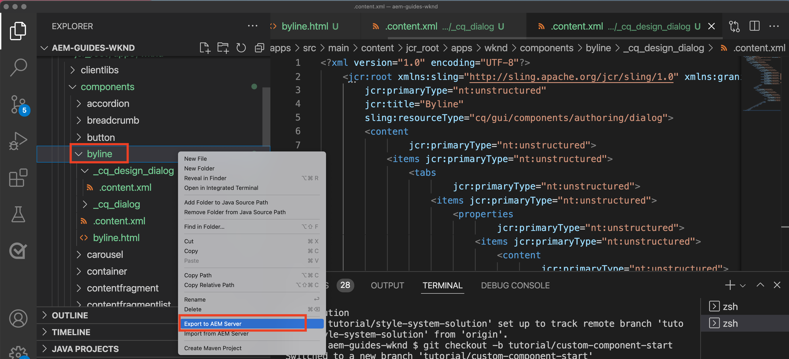

# Benutzerdefinierte Komponente {#custom-component}

In diesem Tutorial wird die End-to-End-Erstellung einer benutzerdefinierten `Byline`-AEM-Komponente dargestellt, die in einem Dialogfeld erstellte Inhalte anzeigt, und die Entwicklung eines Sling-Modells untersucht, um eine Geschäftslogik einzukapseln, die die HTL der Komponente füllt.

## Voraussetzungen {#prerequisites}

Vergegenwärtigen Sie sich die erforderlichen Tools und Anweisungen zum Einrichten einer [lokalen Entwicklungsumgebung](overview.md#local-dev-environment).

### Ausgangsprojekt

>[!NOTE]
>
> Wenn Sie das vorherige Kapitel erfolgreich abgeschlossen haben, können Sie das Projekt wiederverwenden und die Schritte zum Ausprobieren des Ausgangsprojekts überspringen.

Checken Sie den Basis-Code aus, auf dem das Tutorial aufbaut:

1. Checken Sie die Verzweigung `tutorial/custom-component-start` aus [GitHub](https://github.com/adobe/aem-guides-wknd) aus.

   ```shell
   $ cd aem-guides-wknd
   $ git checkout tutorial/custom-component-start
   ```

1. Stellen Sie die Code-Basis mithilfe Ihrer Maven-Kenntnisse in einer lokalen AEM-Instanz bereit:

   ```shell
   $ mvn clean install -PautoInstallSinglePackage
   ```

   >[!NOTE]
   >
   > Wenn Sie AEM 6.5 oder 6.4 verwenden, fügen Sie das `classic`-Profil an beliebige Maven-Befehle an.

   ```shell
   $ mvn clean install -PautoInstallSinglePackage -Pclassic
   ```

Sie können den fertigen Code jederzeit auf [GitHub](https://github.com/adobe/aem-guides-wknd/tree/tutorial/custom-component-solution) ansehen oder den Code lokal herunterladen, indem Sie zu der Verzweigung `tutorial/custom-component-solution` wechseln.

## Ziel

1. Verstehen Sie, wie Sie eine benutzerdefinierte AEM-Komponente aufbauen
1. Erfahren Sie, wie Sie eine Geschäftslogik in Sling-Modelle einkapseln können
1. Verstehen Sie die Verwendung eines Sling-Modells aus einem HTL-Skript

## Was Sie erstellen werden {#what-build}

In diesem Teil des WKND-Tutorials wird eine Autorenzeilenkomponente erstellt, mit der erstellte Informationen über die Mitwirkenden eines Artikels angezeigt werden.


*Autorenzeilenkomponente*

Die Implementierung der Autorenzeilenkomponente umfasst ein Dialogfeld, das den Autorenzeilen-Inhalt erfasst, und ein benutzerdefiniertes Sling-Modell, das die Details abruft, zum Beispiel:

* Name
* Bild
* Berufe

## Erstellen einer Autorenzeilenkomponente {#create-byline-component}

Erstellen Sie zunächst die Knotenstruktur der Autorenzeilenkomponente und definieren Sie ein Dialogfeld. Dies repräsentiert die Komponente in AEM und definiert implizit den Ressourcentyp der Komponente anhand ihres Speicherorts im JCR.

Das Dialogfeld stellt die Schnittstelle zur Verfügung, mit der Autorinnen und Autoren Inhalte bereitstellen können. Für diese Implementierung wird die **Bildkomponente** der AEM-WCM-Kernkomponente verwendet, um das Erstellen und Rendern des Autorenzeilenbildes zu verarbeiten. Daher muss sie als `sling:resourceSuperType` dieser Komponente festgelegt werden.

### Erstellen einer Komponentendefinition {#create-component-definition}

1. Navigieren Sie im Modul **ui.apps** zu `/apps/wknd/components` und erstellen Sie einen Ordner mit dem Namen `byline`.
1. Fügen Sie innerhalb des Ordners `byline` eine Datei mit dem Namen `.content.xml` hinzu

   

1. Füllen Sie die Datei `.content.xml` mit den folgenden Inhalten aus:

   ```xml
   <?xml version="1.0" encoding="UTF-8"?>
       <jcr:root xmlns:sling="http://sling.apache.org/jcr/sling/1.0" xmlns:cq="http://www.day.com/jcr/cq/1.0" xmlns:jcr="http://www.jcp.org/jcr/1.0"
       jcr:primaryType="cq:Component"
       jcr:title="Byline"
       jcr:description="Displays a contributor's byline."
       componentGroup="WKND Sites Project - Content"
       sling:resourceSuperType="core/wcm/components/image/v2/image"/>
   ```

   Die obige XML-Datei stellt die Definition für die Komponente bereit, einschließlich Titel, Beschreibung und Gruppe. Der `sling:resourceSuperType` verweist auf `core/wcm/components/image/v2/image` als [Kernbildkomponente](https://experienceleague.adobe.com/docs/experience-manager-core-components/using/wcm-components/image.html?lang=de).

### Erstellen des HTL-Skripts {#create-the-htl-script}

1. Fügen Sie innerhalb des Ordners `byline` eine Datei `byline.html` hinzu, die für die HTML-Präsentation der Komponente verantwortlich ist. Es ist wichtig, die Datei so wie den Ordner zu benennen, da sie zum Standardskript wird, das Sling verwendet, um diesen Ressourcentyp zu rendern.

1. Fügen Sie den folgenden Code zu `byline.html` hinzu.

   ```html
   <!--/* byline.html */-->
   <div data-sly-use.placeholderTemplate="core/wcm/components/commons/v1/templates.html">
   </div>
   <sly data-sly-call="${placeholderTemplate.placeholder @ isEmpty=true}"></sly>
   ```

Die `byline.html` wird [später erneut aufgerufen](#byline-htl), sobald das Sling-Modell erstellt wurde. Der aktuelle Status der HTL-Datei ermöglicht die Anzeige der Komponente in einem leeren Status im Seiten-Editor von AEM Sites, wenn sie per Drag-and-Drop auf die Seite gezogen wird.

### Erstellen der Dialogfelddefinition {#create-the-dialog-definition}

Definieren Sie als Nächstes ein Dialogfeld für die Autorenzeilenkomponente mit den folgenden Feldern:

* **Name**: ein Textfeld für den Namen des oder der Mitwirkenden.
* **Bild**: ein Verweis auf das Biobild des oder der Mitwirkenden.
* **Berufe**: eine Liste der dem oder der Mitwirkenden zugeschriebenen Berufe. Berufe sollten alphabetisch in aufsteigender Reihenfolge sortiert werden (a bis z).

1. Erstellen Sie im Ordner `byline` einen Ordner namens `_cq_dialog`.
1. Fügen Sie innerhalb von `byline/_cq_dialog` eine Datei mit dem Namen `.content.xml` hinzu. Dies ist die XML-Definition für das Dialogfeld. Fügen Sie folgende XML hinzu:

   ```xml
   <?xml version="1.0" encoding="UTF-8"?>
   <jcr:root xmlns:sling="http://sling.apache.org/jcr/sling/1.0" xmlns:cq="http://www.day.com/jcr/cq/1.0" xmlns:jcr="http://www.jcp.org/jcr/1.0" xmlns:nt="http://www.jcp.org/jcr/nt/1.0"
           jcr:primaryType="nt:unstructured"
           jcr:title="Byline"
           sling:resourceType="cq/gui/components/authoring/dialog">
       <content
               jcr:primaryType="nt:unstructured"
               sling:resourceType="granite/ui/components/coral/foundation/container">
           <items jcr:primaryType="nt:unstructured">
               <tabs
                       jcr:primaryType="nt:unstructured"
                       sling:resourceType="granite/ui/components/coral/foundation/tabs"
                       maximized="{Boolean}false">
                   <items jcr:primaryType="nt:unstructured">
                       <asset
                               jcr:primaryType="nt:unstructured"
                               sling:hideResource="{Boolean}false"/>
                       <metadata
                               jcr:primaryType="nt:unstructured"
                               sling:hideResource="{Boolean}true"/>
                       <properties
                               jcr:primaryType="nt:unstructured"
                               jcr:title="Properties"
                               sling:resourceType="granite/ui/components/coral/foundation/container"
                               margin="{Boolean}true">
                           <items jcr:primaryType="nt:unstructured">
                               <columns
                                       jcr:primaryType="nt:unstructured"
                                       sling:resourceType="granite/ui/components/coral/foundation/fixedcolumns"
                                       margin="{Boolean}true">
                                   <items jcr:primaryType="nt:unstructured">
                                       <column
                                               jcr:primaryType="nt:unstructured"
                                               sling:resourceType="granite/ui/components/coral/foundation/container">
                                           <items jcr:primaryType="nt:unstructured">
                                               <name
                                                       jcr:primaryType="nt:unstructured"
                                                       sling:resourceType="granite/ui/components/coral/foundation/form/textfield"
                                                       emptyText="Enter the contributor's name to display."
                                                       fieldDescription="The contributor's name to display."
                                                       fieldLabel="Name"
                                                       name="./name"
                                                       required="{Boolean}true"/>
                                               <occupations
                                                       jcr:primaryType="nt:unstructured"
                                                       sling:resourceType="granite/ui/components/coral/foundation/form/multifield"
                                                       fieldDescription="A list of the contributor's occupations."
                                                       fieldLabel="Occupations"
                                                       required="{Boolean}false">
                                                   <field
                                                           jcr:primaryType="nt:unstructured"
                                                           sling:resourceType="granite/ui/components/coral/foundation/form/textfield"
                                                           emptyText="Enter an occupation"
                                                           name="./occupations"/>
                                               </occupations>
                                           </items>
                                       </column>
                                   </items>
                               </columns>
                           </items>
                       </properties>
                   </items>
               </tabs>
           </items>
       </content>
   </jcr:root>
   ```

   Diese Knotendefinitionen des Dialogfelds verwenden [Sling Resource Merger](https://sling.apache.org/documentation/bundles/resource-merger.html), um zu steuern, welche Dialogfeldregisterkarten von der `sling:resourceSuperType`-Komponente übernommen werden, in diesem Fall der **Bildkomponente der Kernkomponenten**.

   

### Erstellen des Richtlinien-Dialogfelds {#create-the-policy-dialog}

Erstellen Sie nach demselben Ansatz wie bei der Dialogfelderstellung ein Richtlinien-Dialogfeld (ehemals Dialogfeld „Design“ genannt), um unerwünschte Felder in der Richtlinienkonfiguration auszublenden, die von der Bildkomponente der Kernkomponenten übernommen wurde.

1. Erstellen Sie innerhalb des Ordners `byline` eine Datei namens `_cq_design_dialog`.
1. Erstellen Sie innerhalb von `byline/_cq_design_dialog` eine Datei namens `.content.xml`. Aktualisieren Sie die Datei mit Folgendem: mit der folgenden XML. Es ist am einfachsten, `.content.xml` zu öffnen und die unten stehende XML darin einzufügen.

   ```xml
   <?xml version="1.0" encoding="UTF-8"?>
   <jcr:root xmlns:sling="http://sling.apache.org/jcr/sling/1.0" xmlns:granite="http://www.adobe.com/jcr/granite/1.0" xmlns:cq="http://www.day.com/jcr/cq/1.0" xmlns:jcr="http://www.jcp.org/jcr/1.0" xmlns:nt="http://www.jcp.org/jcr/nt/1.0"
       jcr:primaryType="nt:unstructured"
       jcr:title="Byline"
       sling:resourceType="cq/gui/components/authoring/dialog">
       <content
               jcr:primaryType="nt:unstructured">
           <items jcr:primaryType="nt:unstructured">
               <tabs
                       jcr:primaryType="nt:unstructured">
                   <items jcr:primaryType="nt:unstructured">
                       <properties
                               jcr:primaryType="nt:unstructured">
                           <items jcr:primaryType="nt:unstructured">
                               <content
                                       jcr:primaryType="nt:unstructured">
                                   <items jcr:primaryType="nt:unstructured">
                                       <decorative
                                               jcr:primaryType="nt:unstructured"
                                               sling:hideResource="{Boolean}true"/>
                                       <altValueFromDAM
                                               jcr:primaryType="nt:unstructured"
                                               sling:hideResource="{Boolean}true"/>
                                       <titleValueFromDAM
                                               jcr:primaryType="nt:unstructured"
                                               sling:hideResource="{Boolean}true"/>
                                       <displayCaptionPopup
                                               jcr:primaryType="nt:unstructured"
                                               sling:hideResource="{Boolean}true"/>
                                       <disableUuidTracking
                                               jcr:primaryType="nt:unstructured"
                                               sling:hideResource="{Boolean}true"/>
                                   </items>
                               </content>
                           </items>
                       </properties>
                       <features
                               jcr:primaryType="nt:unstructured">
                           <items jcr:primaryType="nt:unstructured">
                               <content
                                       jcr:primaryType="nt:unstructured">
                                   <items jcr:primaryType="nt:unstructured">
                                       <accordion
                                               jcr:primaryType="nt:unstructured">
                                           <items jcr:primaryType="nt:unstructured">
                                               <orientation
                                                       jcr:primaryType="nt:unstructured"
                                                       sling:hideResource="{Boolean}true"/>
                                               <crop
                                                       jcr:primaryType="nt:unstructured"
                                                       sling:hideResource="{Boolean}true"/>
                                           </items>
                                       </accordion>
                                   </items>
                               </content>
                           </items>
                       </features>
                   </items>
               </tabs>
           </items>
       </content>
   </jcr:root>
   ```

   Die Grundlage für die XML des **Richtlinien-Dialogfelds** stammt aus der [Bildkomponente der Kernkomponenten](https://github.com/adobe/aem-core-wcm-components/blob/main/content/src/content/jcr_root/apps/core/wcm/components/image/v2/image/_cq_design_dialog/.content.xml).

   Wie bei der Dialogfeldkonfiguration wird [Sling Resource Merger](https://sling.apache.org/documentation/bundles/resource-merger.html) verwendet, um irrelevante Felder auszublenden, die ansonsten vom `sling:resourceSuperType` übernommen werden, wie die Knotendefinitionen mit der Eigenschaft `sling:hideResource="{Boolean}true"` zeigen.

### Implementieren des Codes {#deploy-the-code}

1. Synchronisieren Sie die Änderungen in `ui.apps` mit Ihrer IDE oder Ihren Maven-Fähigkeiten.

   

## Hinzufügen der Komponente zu einer Seite {#add-the-component-to-a-page}

Zugunsten der Einfachheit und um den Fokus auf die AEM-Komponentenentwicklung zu bewahren, fügen wir die Autorenzeilenkomponente in ihrem aktuellen Status einer Artikelseite hinzu, um zu prüfen, ob die `cq:Component`-Knotendefinition korrekt ist. Dadurch lässt sich auch überprüfen, ob AEM die neue Komponentendefinition erkennt und ob das Dialogfeld der Komponente für die Erstellung funktioniert.

### Hinzufügen eines Bildes zu AEM Assets

Laden Sie zunächst eine beispielhafte Kopfzeilenaufnahme in AEM Assets hoch, um damit das Bild in der Autorenzeilenkomponente zu befüllen.

1. Navigieren Sie zum Ordner „LA Skateparks“ in AEM Assets: [http://localhost:4502/assets.html/content/dam/wknd/en/magazine/la-skateparks](http://localhost:4502/assets.html/content/dam/wknd/en/magazine/la-skateparks).

1. Laden Sie die Kopfzeilenaufnahme für **[stacey-roswells.jpg](assets/custom-component/stacey-roswells.jpg)** in den Ordner hoch.

   

### Erstellen der Komponente {#author-the-component}

Als Nächstes fügen Sie die Autorenzeilenkomponente einer Seite in AEM hinzu. Da die Autorenzeilenkomponente der Komponentengruppe **WKND Sites-Projekt – Inhalt** über die Definition `ui.apps/src/main/content/jcr_root/apps/wknd/components/byline/.content.xml` hinzugefügt wird, ist sie automatisch für jeden **Container** verfügbar, dessen **Richtlinie** die Komponentengruppe **WKND Sites-Projekt – Inhalt** erlaubt. Sie ist daher im Layout-Container der Artikelseite verfügbar.

1. Navigieren Sie zum Artikel „LA Skatepark“ unter: [http://localhost:4502/editor.html/content/wknd/us/en/magazine/guide-la-skateparks.html](http://localhost:4502/editor.html/content/wknd/us/en/magazine/guide-la-skateparks.html)

1. Ziehen Sie aus der linken Seitenleiste per Drag-and-Drop eine **Autorenzeilenkomponente** zum **Boden** des Layout-Containers der geöffneten Artikelseite.

   

1. Stellen Sie sicher, dass die linke Seitenleiste **geöffnet und sichtbar und der** Asset-Finder** ausgewählt ist.

1. Wählen Sie den **Platzhalter für Autorenzeilenkomponenten**, wodurch wiederum die Aktionsleiste angezeigt wird, und tippen Sie auf das **Schraubenschlüssel**-Symbol, um das Dialogfeld zu öffnen.

1. Öffnen Sie bei offenem Dialogfeld und aktiver erster Registerkarte (Asset) die linke Seitenleiste und ziehen Sie aus dem Asset-Finder ein Bild in die Bild-Ablegezone. Suchen Sie nach „stacey“, um Stacey Roswells Bio-Bild zu finden, das im WKND ui.content-Paket enthalten ist.

   

1. Nachdem Sie ein Bild hinzugefügt haben, klicken Sie auf die Registerkarte **Eigenschaften**, um **Name** und **Berufe** einzugeben.

   Geben Sie bei der Eingabe von Berufen diese in **umgekehrter alphabetischer** Reihenfolge ein, damit die alphabetisch anordnende Business-Logik, die im Sling-Modell implementiert ist, überprüft wird.

   Tippen Sie auf die Schaltfläche **Fertig** unten rechts, um die Änderungen zu speichern.

   

   AEM-Autorinnen und -Autoren konfigurieren und erstellen Komponenten über die Dialogfelder. Zu diesem Zeitpunkt sind bei der Entwicklung der Autorenzeilenkomponente die Dialogfelder zur Datenerfassung enthalten, die Logik zum Rendern des erstellten Inhalts wurde jedoch noch nicht hinzugefügt. Daher wird nur der Platzhalter angezeigt.

1. Navigieren Sie nach dem Speichern des Dialogfelds zu [CRXDE Lite](http://localhost:4502/crx/de/index.jsp#/content/wknd/us/en/magazine/guide-la-skateparks/jcr%3Acontent/root/container/container/byline) und überprüfen Sie, wie der Inhalt der Komponente im Inhaltsknoten der Autorenzeilenkomponente unter der AEM gespeichert wird.

   Suchen Sie den Inhaltsknoten der Autorenzeilenkomponente unter der Seite „LA Skate Parks“, d.h. `/content/wknd/us/en/magazine/guide-la-skateparks/jcr:content/root/container/container/byline`.

   Beachten Sie, dass die Eigenschaftsnamen `name`, `occupations`und `fileReference` in dem **Autorenzeilen-Knoten** gespeichert werden.

   Beachten Sie außerdem, dass der `sling:resourceType` des Knotens auf `wknd/components/content/byline` gesetzt ist, wodurch dieser Inhaltsknoten an die Implementierung der Autorenzeilenkomponente gebunden wird.

   

## Erstellen eines Autorenzeilen-Sling-Modells {#create-sling-model}

Als Nächstes erstellen wir ein Sling-Modell, das als Datenmodell fungiert und die Business-Logik für die Autorenzeilenkomponente speichert.

Sling-Modelle sind von Anmerkungen gesteuerte Java™ POJOs (Plain Old Java™ Objects), die die Zuordnung von Daten aus dem JCR zu Java™-Variablen erleichtern und bei der Entwicklung im AEM-Kontext Effizienz bieten.

### Überprüfen von Maven-Abhängigkeiten {#maven-dependency}

Das Autorenzeilen-Sling-Modell basiert auf mehreren von AEM bereitgestellten Java™-APIs. Diese APIs werden über die `dependencies`, die in der POM-Datei des `core`-Moduls aufgeführt sind, verfügbar gemacht. Das für dieses Tutorial verwendete Projekt wurde für AEM as a Cloud Service entwickelt. Es ist jedoch einzigartig, da es abwärtskompatibel mit AEM 6.5/6.4 ist. Daher sind beide Abhängigkeiten für Cloud Service und AEM 6.x enthalten.

1. Öffnen Sie die Datei `pom.xml` unterhalb von `<src>/aem-guides-wknd/core/pom.xml`.
1. Suchen der Abhängigkeit für `aem-sdk-api` – **Nur AEM as a Cloud Service**

   ```xml
   <dependency>
       <groupId>com.adobe.aem</groupId>
       <artifactId>aem-sdk-api</artifactId>
   </dependency>
   ```

   Die [aem-sdk-api](https://experienceleague.adobe.com/docs/experience-manager-cloud-service/content/implementing/developing/aem-as-a-cloud-service-sdk.html?lang=de) enthält alle öffentlichen Java™-APIs, die von AEM bereitgestellt werden. Die `aem-sdk-api` wird beim Erstellen dieses Projekts standardmäßig verwendet. Die Version wird im übergeordneten Reaktor-POM vom Stamm des Projekts unter `aem-guides-wknd/pom.xml` gepflegt.

1. Suchen Sie die Abhängigkeit für `uber-jar` – **Nur AEM 6.5/6.4**

   ```xml
   ...
       <dependency>
           <groupId>com.adobe.aem</groupId>
           <artifactId>uber-jar</artifactId>
           <classifier>apis</classifier>
       </dependency>
   ...
   ```

   Die `uber-jar` ist nur enthalten, wenn das `classic`-Profil aufgerufen wird, d. h. `mvn clean install -PautoInstallSinglePackage -Pclassic`. Auch dies ist für dieses Projekt einzigartig. In einem realen Projekt, das mithilfe des AEM Projektarchetyps generiert wurde, ist `uber-jar` der Standardwert, wenn die angegebene Version von AEM 6.5 oder 6.4 ist.

   [uber-jar](https://experienceleague.adobe.com/docs/experience-manager-65/developing/devtools/ht-projects-maven.html?lang=de#experience-manager-api-dependencies) enthält alle öffentlichen Java™-APIs, die von AEM 6.x verfügbar gemacht werden. Die Version wird im übergeordneten Reaktor-POM vom Stamm des Projekts `aem-guides-wknd/pom.xml` beibehalten.

1. Suchen der Abhängigkeit für `core.wcm.components.core`:

   ```xml
    <!-- Core Component Dependency -->
       <dependency>
           <groupId>com.adobe.cq</groupId>
           <artifactId>core.wcm.components.core</artifactId>
       </dependency>
   ```

   Dies sind die vollständigen öffentlichen Java™-APIs, die von AEM-Kernkomponenten bereitgestellt werden. „AEM-Kernkomponenten“ ist ein Projekt, das außerhalb von AEM verwaltet wird und daher einen separaten Versionszyklus aufweist. Aus diesem Grund ist es eine Abhängigkeit, die separat eingeschlossen werden muss und **nicht** mit `uber-jar` oder der `aem-sdk-api` aufgenommen wird.

   Wie bei uber-jar wird die Version für diese Abhängigkeit in der übergeordneten Reaktor-POM-Datei von `aem-guides-wknd/pom.xml` gepflegt.

   Später in diesem Tutorial wird die Bild-Klasse der Kernkomponente verwendet, um das Bild in der Autorenzeilenkomponente anzuzeigen. Die Abhängigkeit der Kernkomponente muss vorhanden sein, damit das Sling-Modell erstellt und kompiliert werden kann.

### Autorenzeilen-Schnittstelle {#byline-interface}

Erstellen Sie eine öffentliche Java™-Schnittstelle für die Autorenzeile. Die `Byline.java` definiert die öffentlichen Methoden, die zur Steuerung des HTL-Skripts `byline.html` benötigt werden.

1. Erstellen Sie innerhalb des `core`-Moduls im Ordner `core/src/main/java/com/adobe/aem/guides/wknd/core/models` eine Datei mit dem Namen `Byline.java`

   

1. Aktualisieren Sie `Byline.java` mit den folgenden Methoden:

   ```java
   package com.adobe.aem.guides.wknd.core.models;
   
   import java.util.List;
   
   /**
   * Represents the Byline AEM Component for the WKND Site project.
   **/
   public interface Byline {
       /***
       * @return a string to display as the name.
       */
       String getName();
   
       /***
       * Occupations are to be sorted alphabetically in a descending order.
       *
       * @return a list of occupations.
       */
       List<String> getOccupations();
   
       /***
       * @return a boolean if the component has enough content to display.
       */
       boolean isEmpty();
   }
   ```

   Die ersten beiden Methoden legen die Werte für **Name** und **Berufe** für die Autorenzeilenkomponente fest.

   Die Methode `isEmpty()` wird verwendet, um festzustellen, ob die Komponente über Inhalte verfügt, die gerendert werden sollen, oder ob sie darauf wartet, konfiguriert zu werden.

   Beachten Sie, dass es keine Methode für das Bild gibt. [Das wird später überprüft](#tackling-the-image-problem).

1. Java™-Pakete, die öffentliche Java™-Klassen enthalten, in diesem Fall ein Sling-Modell, müssen mithilfe der Datei `package-info.java` des Pakets versioniert werden.

   Da das Java™-Paket `com.adobe.aem.guides.wknd.core.models` der WKND-Quelle eine Version von `1.0.0` deklariert und eine öffentliche Schnittstelle und Methoden ohne Unterbrechung hinzugefügt werden, muss die Version auf `1.1.0` erhöht werden. Öffnen Sie die Datei unter `core/src/main/java/com/adobe/aem/guides/wknd/core/models/package-info.java` und aktualisieren Sie `@Version("1.0.0")` auf `@Version("2.1.0")`.

   ```
   @Version("2.1.0")
   package com.adobe.aem.guides.wknd.core.models;
   
   import org.osgi.annotation.versioning.Version;
   ```

Wenn Änderungen an den Dateien in diesem Paket vorgenommen werden, muss die [Paketversion semantisch angepasst werden](https://semver.org/). Ansonsten erkennt das [bnd-baseline-maven-plugin](https://github.com/bndtools/bnd/tree/master/maven/bnd-baseline-maven-plugin) des Maven-Projekts eine ungültige Paketversion und bricht den Build ab. Glücklicherweise meldet das Maven-Plug-in bei einem Fehler die ungültige Java™-Paketversion und die erforderliche Version. Aktualisieren Sie die Deklaration `@Version("...")` im `package-info.java` des verletzenden Java™-Pakets zur vom Plug-in empfohlenen Version, um den Fehler zu beheben.

### Implementierung der Autorenzeile {#byline-implementation}

Die `BylineImpl.java` ist die Implementierung des Sling-Modells, das die `Byline.java`-Schnittstelle implementiert, die zuvor definiert wurde. Der vollständige Code für `BylineImpl.java` findet sich unten in diesem Abschnitt.

1. Erstellen Sie einen Ordner mit dem Namen `impl` unter `core/src/main/java/com/adobe/aem/guides/core/models`.
1. Erstellen Sie im Ordner `impl` eine Datei `BylineImpl.java`.

   

1. Öffnen Sie `BylineImpl.java`. Geben Sie an, dass es die `Byline`-Schnittstelle implementiert. Verwenden Sie die Funktionen zur automatischen Vervollständigung der IDE oder aktualisieren Sie die Datei manuell, um die zur Implementierung der `Byline`-Schnittstelle nötigen Methoden einzuschließen:

   ```java
   package com.adobe.aem.guides.wknd.core.models.impl;
   import java.util.List;
   import com.adobe.aem.guides.wknd.core.models.Byline;
   
   public class BylineImpl implements Byline {
   
       @Override
       public String getName() {
           // TODO Auto-generated method stub
           return null;
       }
   
       @Override
       public List<String> getOccupations() {
           // TODO Auto-generated method stub
           return null;
       }
   
       @Override
       public boolean isEmpty() {
           // TODO Auto-generated method stub
           return false;
       }
   }
   ```

1. Fügen Sie die Anmerkungen des Sling-Modells durch Aktualisieren von `BylineImpl.java` mit den folgenden Anmerkungen auf Klassenebene hinzu. Diese Anmerkung `@Model(..)`wandelt die Klasse in ein Sling-Modell um.

   ```java
   import org.apache.sling.api.SlingHttpServletRequest;
   import org.apache.sling.models.annotations.Model;
   import org.apache.sling.models.annotations.DefaultInjectionStrategy;
   ...
   @Model(
           adaptables = {SlingHttpServletRequest.class},
           adapters = {Byline.class},
           resourceType = {BylineImpl.RESOURCE_TYPE},
           defaultInjectionStrategy = DefaultInjectionStrategy.OPTIONAL
   )
   public class BylineImpl implements Byline {
       protected static final String RESOURCE_TYPE = "wknd/components/byline";
       ...
   }
   ```

   Sehen wir uns diese Anmerkung und ihre Parameter an:

   * Die Anmerkung `@Model` registriert BylineImpl als Sling-Modell, wenn es in AEM implementiert wird.
   * Der Parameter `adaptables` gibt an, dass dieses Modell durch die Anfrage angepasst werden kann.
   * Der Parameter `adapters` ermöglicht die Registrierung der Implementierungsklasse unter der Autorenzeilen-Schnittstelle. Dadurch kann das HTL-Skript das Sling-Modell über die Schnittstelle aufrufen (anstelle direkt über die Implementierung). [Weitere Informationen über Adapter finden Sie hier](https://sling.apache.org/documentation/bundles/models.html#specifying-an-alternate-adapter-class-since-110).
   * Der `resourceType` verweist auf den (zuvor erstellten) Autorenzeilenkomponenten-Ressourcentyp und hilft beim Auflösen des richtigen Modells, wenn mehrere Implementierungen vorliegen. [Weitere Informationen zum Verknüpfen einer Modellklasse mit einem Ressourcentyp finden Sie hier.](https://sling.apache.org/documentation/bundles/models.html#associating-a-model-class-with-a-resource-type-since-130)

### Implementieren der Sling-Modell-Methoden {#implementing-the-sling-model-methods}

#### getName() {#implementing-get-name}

Die erste implementierte Methode ist `getName()`. Sie gibt einfach den Wert zurück, der unter der Eigenschaft `name` im JCR-Inhaltsknoten der Autorenzeile gespeichert ist.

Dazu wird die Sling-Modellanmerkung `@ValueMapValue` verwendet, um den Wert mithilfe der ValueMap der Anfrageressource in ein Java™-Feld einzufügen.


```java
import org.apache.sling.models.annotations.injectorspecific.ValueMapValue;

public class BylineImpl implements Byline {
    ...
    @ValueMapValue
    private String name;

    ...
    @Override
    public String getName() {
        return name;
    }
    ...
}
```

Da die JCR-Eigenschaft denselben Namen wie das Java™-Feld verwendet (beide heißen „name“) löst `@ValueMapValue` diese Verknüpfung automatisch auf und fügt den Wert der Eigenschaft in das Java™-Feld ein.

#### getOccupations() {#implementing-get-occupations}

Die nächste zu implementierende Methode ist `getOccupations()`. Diese Methode lädt die in der JCR-Eigenschaft `occupations` gespeicherten Berufe und gibt eine (alphabetisch) sortierte Sammlung davon zurück.

Verwenden Sie die in `getName()` erkundete Technik, um den Eigenschaftswert in das Feld des Sling-Modells einzufügen.

Sobald die JCR-Eigenschaftswerte im Sling-Modell über das eingefügte Java™-Feld `occupations` verfügbar sind, kann die Geschäftslogik zum Sortieren in der Methode `getOccupations()` angewandt werden.


```java
import java.util.ArrayList;
import java.util.Collections;
  ...

public class BylineImpl implements Byline {
    ...
    @ValueMapValue
    private List<String> occupations;
    ...
    @Override
    public List<String> getOccupations() {
        if (occupations != null) {
            Collections.sort(occupations);
            return new ArrayList<String>(occupations);
        } else {
            return Collections.emptyList();
        }
    }
    ...
}
  ...
```


#### isEmpty() {#implementing-is-empty}

Die letzte öffentliche Methode ist `isEmpty()` und bestimmt, wann die Komponente sich selbst als „ausreichend erstellt“ zum Rendern betrachten soll.

Für diese Komponente lautet die Geschäftsanforderung, dass alle drei Felder, `name, image and occupations`, ausgefüllt werden müssen, *bevor* die Komponente gerendert werden kann.


```java
import org.apache.commons.lang3.StringUtils;
  ...
public class BylineImpl implements Byline {
    ...
    @Override
    public boolean isEmpty() {
        if (StringUtils.isBlank(name)) {
            // Name is missing, but required
            return true;
        } else if (occupations == null || occupations.isEmpty()) {
            // At least one occupation is required
            return true;
        } else if (/* image is not null, logic to be determined */) {
            // A valid image is required
            return true;
        } else {
            // Everything is populated, so this component is not considered empty
            return false;
        }
    }
    ...
}
```


#### Beheben des „Bildproblems“ {#tackling-the-image-problem}

Die Überprüfung der Namen- und Arbeitsbedingungen ist trivial und Apache Commons Lang3 bietet die praktische [StringUtils](https://commons.apache.org/proper/commons-lang/apidocs/org/apache/commons/lang3/StringUtils.html)-Klasse. Es ist jedoch unklar, wie das **Vorhandensein des Bildes** validiert werden kann, da die Bildkomponente der Kernkomponenten zum Aufdecken des Bildes verwendet wird.

Es gibt zwei Möglichkeiten, um das zu beheben:

Überprüfen Sie, ob die JCR-Eigenschaft `fileReference` zu einem Asset aufgelöst wird. *ODER* konvertieren Sie diese Ressource in ein Bild-Sling-Modell der Kernkomponente und stellen Sie sicher, dass die Methode `getSrc()` nicht leer ist.

Verwenden wir den **zweiten** Ansatz. Der erste Ansatz ist wahrscheinlich ausreichend, aber in diesem Tutorial wird der letztere verwendet, um andere Funktionen von Sling-Modellen erkunden zu können.

1. Erstellen Sie eine private Methode, die das Bild abruft. Diese Methode bleibt privat, da das Bildobjekt nicht in der HTL selbst verfügbar gemacht werden muss und nur `isEmpty().` unterstützt.

   Fügen Sie die folgende private Methode für `getImage()` hinzu:

   ```java
   import com.adobe.cq.wcm.core.components.models.Image;
   ...
   private Image getImage() {
       Image image = null;
       // Figure out how to populate the image variable!
       return image;
   }
   ```

   Wie oben erwähnt, gibt es zwei weitere Ansätze, um das **Bild-Sling-Modell** aufzurufen:

   Die erste verwendet die Anmerkung `@Self`, um die aktuelle Anforderung automatisch an die `Image.class` der Kernkomponente anzupassen.

   Die zweite verwendet den OSGi-Dienst [Apache Sling ModelFactory](https://sling.apache.org/apidocs/sling10/org/apache/sling/models/factory/ModelFactory.html), einen praktischen Dienst, der das Erstellen von Sling-Modellen anderer Typen in Java™-Code unterstützt.

   Verwenden wir den zweiten Ansatz.

   >[!NOTE]
   >
   >In einer realen Implementierung sollten Sie Ansatz 1 verwenden und `@Self` benutzen. Dies wird bevorzugt, da es die einfachere, elegantere Lösung ist. In dieser Anleitung wird der zweite Ansatz verwendet, da er erfordert, mehr Facetten von Sling-Modellen zu erkunden, die in komplexeren Komponenten nützlich sind!

   Da es sich bei Sling-Modellen um Java™ POJOs und nicht um OSGi-Dienste handelt, **können** die üblichen OSGi-Injection-Anmerkungen `@Reference` nicht verwendet werden. Stattdessen bieten Sling-Modelle eine spezielle Anmerkung **[@OSGiService](https://sling.apache.org/documentation/bundles/models.html#injector-specific-annotations)**, die ähnliche Funktionen bietet.

1. Aktualisieren Sie `BylineImpl.java` so, dass es die Anmerkung `OSGiService` enthält, um die `ModelFactory` einzufügen

   ```java
   import org.apache.sling.models.factory.ModelFactory;
   import org.apache.sling.models.annotations.injectorspecific.OSGiService;
   ...
   public class BylineImpl implements Byline {
       ...
       @OSGiService
       private ModelFactory modelFactory;
   }
   ```

   Wenn die `ModelFactory` verfügbar ist, kann ein Kernkomponenten-Bild-Sling-Modell erstellt werden unter Verwendung von:

   ```java
   modelFactory.getModelFromWrappedRequest(SlingHttpServletRequest request, Resource resource, java.lang.Class<T> targetClass)
   ```

   Diese Methode erfordert jedoch sowohl eine Anfrage als auch eine Ressource, die noch nicht im Sling-Modell verfügbar sind. Um diese zu erhalten, werden mehr Anmerkungen im Sling-Modell verwendet!

   Um die aktuelle Anfrage abzurufen, kann die Anmerkung **[@Self](https://sling.apache.org/documentation/bundles/models.html#injector-specific-annotations)** verwendet werden, um `adaptable` (was in der Variablen `@Model(..)` als `SlingHttpServletRequest.class` definiert ist), in ein Java™-Klassenfeld einzufügen.

1. Fügen Sie die Anmerkung **@Self** zum Abrufen der **SlingHttpServletRequest-Anfrage** hinzu:

   ```java
   import org.apache.sling.models.annotations.injectorspecific.Self;
   ...
   @Self
   private SlingHttpServletRequest request;
   ```

   Denken Sie daran, dass die Verwendung von `@Self Image image` zum Einfügen des Kernkomponenten-Bild-Sling-Modells oben eine Option war – die Anmerkung `@Self` versucht, das anpassbare Objekt (in diesem Fall ein SlingHttpServletRequest) einzufügen und an den Anmerkungsfeldtyp anzupassen. Da das Bild-Sling-Modell der Kernkomponente von SlingHttpServletRequest-Objekten angepasst werden kann, würde dies funktionieren und benötigt weniger Code als der eher explorative `modelFactory`-Ansatz.

   Jetzt werden die Variablen eingefügt, die zum Instanziieren des Bildmodells über die ModelFactory-API erforderlich sind. Verwenden wir die Anmerkung **[@PostConstruct](https://sling.apache.org/documentation/bundles/models.html#postconstruct-methods)** des Sling-Modells, um dieses Objekt nach der Instanziierung des Sling-Modells abzurufen.

   `@PostConstruct` ist unglaublich nützlich und agiert in ähnlicher Kapazität wie ein Konstruktor. Es wird jedoch aufgerufen, nachdem die Klasse instanziiert wurde und alle kommentierten Java™-Felder eingefügt wurden. Während andere Anmerkungen des Sling-Modells Java™-Klassenfelder (Variablen) kommentieren, kommentiert `@PostConstruct` eine Void-, Null-Parametermethode, die normalerweise `init()` genannt wird (jedoch beliebig benannt werden kann).

1. Fügen Sie die Methode **@PostConstruct** hinzu:

   ```java
   import javax.annotation.PostConstruct;
   ...
   public class BylineImpl implements Byline {
       ...
       private Image image;
   
       @PostConstruct
       private void init() {
           image = modelFactory.getModelFromWrappedRequest(request,
                                                           request.getResource(),
                                                           Image.class);
       }
       ...
   }
   ```

   Beachten Sie, dass Sling-Modelle **KEINE** OSGi-Dienste sind, sodass der Klassenstatus problemlos aufrechterhalten werden kann. Häufig leitet `@PostConstruct` den Klassenstatus des Sling-Modells ab und richtet ihn für die spätere Verwendung ein, ähnlich dem, was ein einfacher Konstruktor tut.

   Wenn die Methode `@PostConstruct` eine Ausnahme ausgibt, wird das Sling-Modell nicht instanziiert und entspricht null.

1. **getImage()** kann jetzt aktualisiert werden, um einfach das Bildobjekt zurückzugeben.

   ```java
   /**
       * @return the Image Sling Model of this resource, or null if the resource cannot create a valid Image Sling Model.
   */
   private Image getImage() {
       return image;
   }
   ```

1. Gehen wir zurück zu `isEmpty()` und schließen die Implementierung ab:

   ```java
   @Override
   public boolean isEmpty() {
      final Image componentImage = getImage();
   
       if (StringUtils.isBlank(name)) {
           // Name is missing, but required
           return true;
       } else if (occupations == null || occupations.isEmpty()) {
           // At least one occupation is required
           return true;
       } else if (componentImage == null || StringUtils.isBlank(componentImage.getSrc())) {
           // A valid image is required
           return true;
       } else {
           // Everything is populated, so this component is not considered empty
           return false;
       }
   }
   ```

   Beachten Sie: Mehrere Aufrufe an `getImage()` sind nicht problematisch, da dies die initialisierte `image`-Klassenvariable zurückgibt und nicht `modelFactory.getModelFromWrappedRequest(...)` aufruft, was zwar nicht allzu ressourcenintensiv ist, aber es lohnt sich, unnötige Aufrufe zu vermeiden.

1. Das endgültige `BylineImpl.java` sollte wie folgt aussehen:


   ```java
   package com.adobe.aem.guides.wknd.core.models.impl;
   
   import java.util.ArrayList;
   import java.util.Collections;
   import java.util.List;
   import javax.annotation.PostConstruct;
   import org.apache.commons.lang3.StringUtils;
   import org.apache.sling.api.SlingHttpServletRequest;
   import org.apache.sling.models.annotations.DefaultInjectionStrategy;
   import org.apache.sling.models.annotations.Model;
   import org.apache.sling.models.annotations.injectorspecific.OSGiService;
   import org.apache.sling.models.annotations.injectorspecific.Self;
   import org.apache.sling.models.annotations.injectorspecific.ValueMapValue;
   import org.apache.sling.models.factory.ModelFactory;
   import com.adobe.aem.guides.wknd.core.models.Byline;
   import com.adobe.cq.wcm.core.components.models.Image;
   
   @Model(
           adaptables = {SlingHttpServletRequest.class},
           adapters = {Byline.class},
           resourceType = {BylineImpl.RESOURCE_TYPE},
           defaultInjectionStrategy = DefaultInjectionStrategy.OPTIONAL
   )
   public class BylineImpl implements Byline {
       protected static final String RESOURCE_TYPE = "wknd/components/byline";
   
       @Self
       private SlingHttpServletRequest request;
   
       @OSGiService
       private ModelFactory modelFactory;
   
       @ValueMapValue
       private String name;
   
       @ValueMapValue
       private List<String> occupations;
   
       private Image image;
   
       /**
       * @PostConstruct is immediately called after the class has been initialized
       * but BEFORE any of the other public methods. 
       * It is a good method to initialize variables that is used by methods in the rest of the model
       *
       */
       @PostConstruct
       private void init() {
           // set the image object
           image = modelFactory.getModelFromWrappedRequest(request, request.getResource(), Image.class);
       }
   
       @Override
       public String getName() {
           return name;
       }
   
       @Override
       public List<String> getOccupations() {
           if (occupations != null) {
               Collections.sort(occupations);
               return new ArrayList<String>(occupations);
           } else {
               return Collections.emptyList();
           }
       }
   
       @Override
       public boolean isEmpty() {
           final Image componentImage = getImage();
   
           if (StringUtils.isBlank(name)) {
               // Name is missing, but required
               return true;
           } else if (occupations == null || occupations.isEmpty()) {
               // At least one occupation is required
               return true;
           } else if (componentImage == null || StringUtils.isBlank(componentImage.getSrc())) {
               // A valid image is required
               return true;
           } else {
               // Everything is populated, so this component is not considered empty
               return false;
           }
       }
   
       /**
       * @return the Image Sling Model of this resource, or null if the resource cannot create a valid Image Sling Model.
       */
       private Image getImage() {
           return image;
       }
   }
   ```


## Autorenzeilen-HTL {#byline-htl}

Öffnen Sie im `ui.apps`-Modul `/apps/wknd/components/byline/byline.html`, das bei der vorherigen Einrichtung der AEM-Komponente erstellt wurde.

```html
<div data-sly-use.placeholderTemplate="core/wcm/components/commons/v1/templates.html">
</div>
<sly data-sly-call="${placeholderTemplate.placeholder @ isEmpty=false}"></sly>
```

Sehen wir uns an, was dieses HTL-Skript bisher bewirkt:

* Die `placeholderTemplate` verweist auf den Platzhalter der Kernkomponenten, der angezeigt wird, wenn die Komponente nicht vollständig konfiguriert ist. Dies wird im AEM Sites-Seiteneditor als Feld mit dem Komponententitel gerendert, wie oben bei der Eigenschaft `jcr:title` von `cq:Component` definiert.

* Der `data-sly-call="${placeholderTemplate.placeholder @ isEmpty=false}` lädt die oben definierte `placeholderTemplate` und übergibt einen booleschen Wert (derzeit zu `false` hartcodiert) an die Platzhaltervorlage. Wann `isEmpty` „true“ ist, rendert die Platzhaltervorlage das graue Feld, anderenfalls wird nichts gerendert.

### Aktualisieren der Autorenzeilen-HTL

1. Aktualisieren Sie **byline.html** mit der folgenden Grund-HTML-Struktur:

   ```html
   <div data-sly-use.placeholderTemplate="core/wcm/components/commons/v1/templates.html"
       class="cmp-byline">
           <div class="cmp-byline__image">
               <!--/* Include the Core Components Image Component */-->
           </div>
           <h2 class="cmp-byline__name"><!--/* Include the name */--></h2>
           <p class="cmp-byline__occupations"><!--/* Include the occupations */--></p>
   </div>
   <sly data-sly-call="${placeholderTemplate.placeholder @ isEmpty=true}"></sly>
   ```

   Beachten Sie, dass die CSS-Klassen der [BEM-Namenskonvention](https://getbem.com/naming/) folgen. Obwohl die Verwendung von BEM-Konventionen nicht obligatorisch ist, wird BEM empfohlen, da es in CSS-Klassen der Kernkomponente verwendet wird und im Allgemeinen zu sauberen, lesbaren CSS-Regeln führt.

### Instanziieren von Sling-Modellobjekten in HTL {#instantiating-sling-model-objects-in-htl}

Die [Blockbenutzungs-Anweisung](https://github.com/adobe/htl-spec/blob/master/SPECIFICATION.md#221-use) wird verwendet, um Sling-Modell-Objekte im HTL-Skript zu instanziieren und sie einer HTL-Variable zuzuweisen.

Die `data-sly-use.byline="com.adobe.aem.guides.wknd.models.Byline"` verwendet die von BylineImpl implementierte Autorenzeilen-Schnittstelle (com.adobe.aem.guides.wknd.models.Byline) und passt die aktuelle SlingHttpServletRequest daran an. Das Ergebnis wird in einer HTL-Variablennamen-Autorenzeile gespeichert (`data-sly-use.<variable-name>`).

1. Aktualisieren Sie das äußere `div`, um auf das **Autorenzeilen**-Sling-Modell über seine öffentliche Schnittstelle zu verweisen:

   ```xml
   <div data-sly-use.byline="com.adobe.aem.guides.wknd.core.models.Byline"
       data-sly-use.placeholderTemplate="core/wcm/components/commons/v1/templates.html"
       class="cmp-byline">
       ...
   </div>
   ```

### Zugreifen auf Sling-Modellmethoden {#accessing-sling-model-methods}

HTL leiht von JSTL aus und verwendet dieselbe Abkürzung der Namen von Java™-Getter-Methoden.

Beispielsweise kann das Aufrufen der Methode `getName()` zu `byline.name` gekürzt werden. Ähnlich kann anstelle von `byline.isEmpty` zu `byline.empty` gekürzt werden. Das Verwenden vollständiger Methodennamen, `byline.getName` oder `byline.isEmpty`, funktioniert ebenfalls. Beachten Sie, dass die `()` nie zum Aufrufen von Methoden in HTL verwendet werden (ähnlich wie in JSTL).

Java™-Methoden, für die ein Parameter erforderlich ist, können **nicht** in HTL verwendet werden. Dies ist beabsichtigt, um die Logik in HTL einfach zu halten.

1. Sie können den Autorenzeilennamen der Komponente hinzufügen, indem Sie die Methode `getName()` im Autorenzeilen-Sling-Modell oder in HTL `${byline.name}` aufrufen.

   Aktualisieren Sie das `h2`-Tag:

   ```xml
   <h2 class="cmp-byline__name">${byline.name}</h2>
   ```

### Verwendung der HTL-Ausdruck-Optionen {#using-htl-expression-options}

[Optionen für HTL-Ausdrücke](https://github.com/adobe/htl-spec/blob/master/SPECIFICATION.md#12-available-expression-options) agieren als Modifikatoren für Inhalte in HTL und reichen von der Datumsformatierung bis zur i18n-Übersetzung. Ausdrücke können auch verwendet werden, um Listen oder Arrays von Werten zu verknüpfen, die erforderlich sind, um die Berufe in einem kommagetrennten Format anzuzeigen.

Sie können Expressions über den `@`-Operator im HTL-Ausdruck hinzufügen.

1. Um die Liste der Berufe mit „, “ zu verbinden, wird der folgende Code verwendet:

   ```html
   <p class="cmp-byline__occupations">${byline.occupations @ join=', '}</p>
   ```

### Bedingte Anzeige des Platzhalters {#conditionally-displaying-the-placeholder}

Die meisten HTL-Skripte für AEM-Komponenten verwenden das **Platzhalter-Paradigma** zum Bereitstellen eines visuellen Hinweises für Autorinnen und Autoren darüber, **dass eine Komponente falsch erstellt wurde und nicht in AEM Publish angezeigt wird**. Um diese Entscheidung zu fördern, besteht die Konvention, eine Methode auf dem unterstützenden Sling-Modell der Komponente zu implementieren, in diesem Fall: `Byline.isEmpty()`.

Die Methode `isEmpty()` wird im Autorenzeilen-Sling-Modell aufgerufen und das Ergebnis (oder eher das negative Ergebnis, über den `!`-Operator) wird in einer HTL-Variable namens `hasContent` gespeichert:

1. Aktualisieren Sie das äußere `div`, um eine HTL-Variable mit dem Namen `hasContent` zu speichern:

   ```html
    <div data-sly-use.byline="com.adobe.aem.guides.wknd.core.models.Byline"
         data-sly-use.placeholderTemplate="core/wcm/components/commons/v1/templates.html"
         data-sly-test.hasContent="${!byline.empty}"
         class="cmp-byline">
         ...
   </div>
   ```

   Beachten Sie: Bei der Verwendung von `data-sly-test` ist der HTL-`test`-Block ausschlaggebend: Er legt eine HTL-Variable fest und rendert/rendert nicht das HTML-Element, in dem sie sich befindet. Er basiert auf dem Ergebnis der HTL-Ausdrucksauswertung. Bei „true“ wird das HTML-Element gerendert, andernfalls wird es nicht gerendert.

   Diese HTL-Variable `hasContent` kann jetzt wiederverwendet werden, um den Platzhalter bedingt ein- oder auszublenden.

1. Aktualisieren Sie den bedingten Aufruf an die `placeholderTemplate` unten in der Datei mit folgendem Code:

   ```html
   <sly data-sly-call="${placeholderTemplate.placeholder @ isEmpty=!hasContent}"></sly>
   ```

### Anzeigen des Bildes mithilfe von Kernkomponenten {#using-the-core-components-image}

Das HTL-Skript für `byline.html` ist nun fast vollständig, es fehlt nur noch das Bild.

Weil der `sling:resourceSuperType` auf die Bildkomponente der Kernkomponente zum Erstellen des Bildes verweist, kann die Bildkomponente der Kernkomponente zum Rendern des Bildes verwendet werden.

Dazu schließen wir die aktuelle Autorenzeilen-Ressource ein, erzwingen jedoch den Ressourcentyp der Bildkomponente der Kernkomponente unter Verwendung des Ressourcentyps `core/wcm/components/image/v2/image`. Dies ist ein leistungsstarkes Muster für die Wiederverwendung von Komponenten. Zu diesem Zweck wird der Block `data-sly-resource` von HTL verwendet.

1. Ersetzen Sie das `div` durch eine Klasse von `cmp-byline__image` mit dem Folgenden:

   ```html
   <div class="cmp-byline__image"
       data-sly-resource="${ '.' @ resourceType = 'core/wcm/components/image/v2/image' }"></div>
   ```

   Diese `data-sly-resource` enthält die aktuelle Ressource über den relativen Pfad `'.'` und erzwingt die Einbeziehung der aktuellen Ressource (oder der Autorenzeilen-Inhaltsressource) in den Ressourcentyp von `core/wcm/components/image/v2/image`.

   Der Ressourcentyp „Kernkomponente“ wird direkt und nicht über einen Proxy verwendet, da es sich hierbei um eine Verwendung im Skript handelt und er nie im Inhalt beibehalten wird.

2. Vollständige `byline.html` unten:

   ```html
   <!--/* byline.html */-->
   <div data-sly-use.byline="com.adobe.aem.guides.wknd.core.models.Byline" 
       data-sly-use.placeholderTemplate="core/wcm/components/commons/v1/templates.html"
       data-sly-test.hasContent="${!byline.empty}"
       class="cmp-byline">
       <div class="cmp-byline__image"
           data-sly-resource="${ '.' @ resourceType = 'core/wcm/components/image/v2/image' }">
       </div>
       <h2 class="cmp-byline__name">${byline.name}</h2>
       <p class="cmp-byline__occupations">${byline.occupations @ join=', '}</p>
   </div>
   <sly data-sly-call="${placeholderTemplate.placeholder @ isEmpty=!hasContent}"></sly>
   ```

3. Implementieren Sie die Code-Basis in einer lokalen AEM-Instanz. Da Änderungen an `core` und `ui.apps` vorgenommen wurden, müssen beide Module implementiert werden.

   ```shell
   $ cd aem-guides-wknd/ui.apps
   $ mvn clean install -PautoInstallPackage
   ```

   ```shell
   $ cd ../core
   $ mvn clean install -PautoInstallBundle
   ```

   Zum Bereitstellen in AEM 6.5/6.4 rufen Sie das `classic`-Profil auf:

   ```shell
   $ cd ../core
   $ mvn clean install -PautoInstallBundle -Pclassic
   ```

   >[!CAUTION]
   >
   > Sie können auch das gesamte Projekt aus dem Stammverzeichnis mithilfe des Maven-Profils `autoInstallSinglePackage` erstellen, dadurch können jedoch die Inhaltsänderungen auf der Seite überschrieben werden. Dies liegt daran, dass `ui.content/src/main/content/META-INF/vault/filter.xml` für den Code am Anfang des Tutorials geändert wurde, um den vorhandenen AEM-Inhalt sauber zu überschreiben. In einem realen Szenario ist dies kein Problem.

### Überprüfen der nicht formatierten Autorenzeilenkomponente {#reviewing-the-unstyled-byline-component}

1. Navigieren Sie nach der Implementierung der Aktualisierung zur Seite [Ultimate Guide to LA Skateparks ](http://localhost:4502/editor.html/content/wknd/us/en/magazine/guide-la-skateparks.html) bzw. dorthin, wo Sie die Autorenzeilenkomponente zuvor im Kapitel hinzugefügt haben.

1. Das **Bild**, der **Name** und die **Berufe** werden nun angezeigt, und es liegt eine unformatierte, aber funktionierende Autorenzeilenkomponente vor.

   

### Überprüfen der Sling-Modellregistrierung {#reviewing-the-sling-model-registration}

Die [Statusansicht der Sling-Modelle der AEM-Web-Konsole](http://localhost:4502/system/console/status-slingmodels) zeigt alle registrierten Sling-Modelle in AEM an. Das Autorenzeilen-Sling-Modell kann durch Überprüfen dieser Liste als installiert und erkannt validiert werden.

Wenn die Variable **BylineImpl** nicht in dieser Liste angezeigt wird, gibt es wahrscheinlich ein Problem mit den Anmerkungen des Sling-Modells, oder das Modell wurde nicht zum richtigen Paket (`com.adobe.aem.guides.wknd.core.models`) im Kernprojekt hinzugefügt.


*<http://localhost:4502/system/console/status-slingmodels>*

## Autorenzeilenstile {#byline-styles}

Um die Autorenzeilenkomponente an dem bereitgestellten kreativen Design auszurichten, können wir sie formatieren. Das erreichen wir durch die Verwendung der SCSS-Datei und die Aktualisierung der Datei im **ui.frontend**-Modul.

### Hinzufügen eines Standardstils

Fügen Sie Standardstile für die Autorenzeilenkomponente hinzu.

1. Kehren Sie zur IDE und zum **ui.frontend**-Projekt unter `/src/main/webpack/components` zurück:
1. Erstellen Sie eine Datei mit dem Namen `_byline.scss`.

   

1. Fügen Sie die CSS für die Implementierung der Autorenzeile (geschrieben als SCSS) in `_byline.scss` ein:

   ```scss
   .cmp-byline {
       $imageSize: 60px;
   
       .cmp-byline__image {
           float: left;
   
       /* This class targets a Core Component Image CSS class */
       .cmp-image__image {
           width: $imageSize;
           height: $imageSize;
           border-radius: $imageSize / 2;
           object-fit: cover;
           }
       }
   
       .cmp-byline__name {
           font-size: $font-size-medium;
           font-family: $font-family-serif;
           padding-top: 0.5rem;
           margin-left: $imageSize + 25px;
           margin-bottom: .25rem;
           margin-top:0rem;
       }
   
       .cmp-byline__occupations {
           margin-left: $imageSize + 25px;
           color: $gray;
           font-size: $font-size-xsmall;
           text-transform: uppercase;
       }
   }
   ```

1. Öffnen Sie ein Terminal und navigieren Sie zum `ui.frontend`-Modul.
1. Starten Sie den `watch`-Prozess mit dem folgenden npm-Befehl:

   ```shell
   $ cd ui.frontend/
   $ npm run watch
   ```

1. Kehren Sie zum Browser zurück und navigieren Sie zum [Artikel zu LA SkateParks](http://localhost:4502/editor.html/content/wknd/us/en/magazine/guide-la-skateparks.html). Sie sollten die aktualisierten Stile für die Komponente sehen.

   

   >[!TIP]
   >
   > Möglicherweise müssen Sie den Browser-Cache löschen, um sicherzustellen, dass kein veraltetes CSS bereitgestellt wird, und die Seite mit der Autorenzeilenkomponente aktualisieren, um die volle Formatierung zu erhalten.

## Herzlichen Glückwunsch! {#congratulations}

Herzlichen Glückwunsch! Sie haben eine benutzerdefinierte Komponente mit Adobe Experience Manager von Grund auf neu erstellt!

### Nächste Schritte {#next-steps}

Erfahren Sie mehr über die Entwicklung von AEM-Komponenten, indem Sie lernen, wie Sie JUnit-Tests für den Autorenzeilen-Java™-Code schreiben, um sicherzustellen, dass alles ordnungsgemäß entwickelt und die implementierte Geschäftslogik korrekt und vollständig ist.

* [Schreiben von Komponententests oder AEM-Komponenten](unit-testing.md)

Sehen Sie sich den fertigen Code auf [GitHub](https://github.com/adobe/aem-guides-wknd) an oder überprüfen Sie den Code und stellen Sie ihn lokal auf der Git-Verzweigung `tutorial/custom-component-solution` bereit.

1. Klonen Sie das Repository [github.com/adobe/aem-guides-wknd](https://github.com/adobe/aem-guides-wknd).
1. Checken Sie die Verzweigung `tutorial/custom-component-solution` aus
