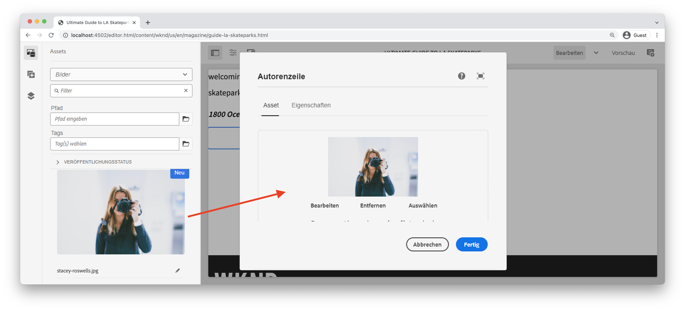

# Benutzerdefinierte Komponente {#custom-component}

In diesem Tutorial wird die End-to-End-Erstellung einer benutzerdefinierten AEM-Byline-Komponente beschrieben, die in einem Dialogfeld verfasste Inhalte anzeigt. Außerdem wird untersucht, wie ein Sling-Modell entwickelt wird, um eine Geschäftslogik einzukapseln, die die HTL der Komponente füllt.

## Voraussetzungen {#prerequisites}

Überprüfen Sie die erforderlichen Tools und Anweisungen zum Einrichten einer [lokalen Entwicklungsumgebung](overview.md#local-dev-environment).

### Starterprojekt

>[!NOTE]
>
> Wenn Sie das vorherige Kapitel erfolgreich abgeschlossen haben, können Sie das Projekt wiederverwenden und die Schritte zum Auschecken des Starterprojekts überspringen.

Sehen Sie sich den Basis-Code an, auf dem das Tutorial aufbaut:

1. Sehen Sie sich die Verzweigung `tutorial/custom-component-start` von [GitHub](https://github.com/adobe/aem-guides-wknd) an.

   ```shell
   $ cd aem-guides-wknd
   $ git checkout tutorial/custom-component-start
   ```

1. Stellen Sie die Codebasis mithilfe Ihrer Maven-Kenntnisse in einer lokalen AEM-Instanz bereit:

   ```shell
   $ mvn clean install -PautoInstallSinglePackage
   ```

   >[!NOTE]
   >
   > Wenn Sie AEM 6.5 oder 6.4 verwenden, hängen Sie das Profil `classic` an beliebige Maven-Befehle an.

   ```shell
   $ mvn clean install -PautoInstallSinglePackage -Pclassic
   ```

Sie können den fertigen Code immer auf [GitHub](https://github.com/adobe/aem-guides-wknd/tree/tutorial/custom-component-solution) anzeigen oder den Code lokal auschecken, indem Sie zu der Verzweigung `tutorial/custom-component-solution` wechseln.

## Zielsetzung

1. Informationen zum Erstellen einer benutzerdefinierten AEM-Komponente
1. Erfahren Sie, wie Sie Geschäftslogik mit Sling-Modellen einbinden können.
1. Grundlegendes zur Verwendung eines Sling-Modells aus einem HTL-Skript

## Was Sie erstellen werden {#byline-component}

In diesem Teil des WKND-Tutorials wird eine Byline-Komponente erstellt, mit der verfasste Informationen über den Beitragenden eines Artikels angezeigt werden.


*Byte-Komponente*

Die Implementierung der Byline-Komponente umfasst ein Dialogfeld, das den byline-Inhalt erfasst, sowie ein benutzerdefiniertes Sling-Modell, das die von der Byline abruft:

* Name
* Bild
* Berufe

## Erstellen einer Byte-Komponente {#create-byline-component}

Erstellen Sie zunächst die Knotenstruktur der Byline-Komponente und definieren Sie ein Dialogfeld. Dies stellt die Komponente in AEM dar und definiert implizit den Ressourcentyp der Komponente anhand ihres Speicherorts im JCR.

Das Dialogfeld stellt die Benutzeroberfläche bereit, die Autoren von Inhalten bereitstellen können. Für diese Implementierung wird die Komponente **Bild** der AEM WCM-Kernkomponente genutzt, um das Authoring und Rendering des Byline-Bildes zu verarbeiten. Daher wird sie als `sling:resourceSuperType` unserer Komponente festgelegt.

### Komponentendefinition erstellen {#create-component-definition}

1. Navigieren Sie im Modul **ui.apps** zu `/apps/wknd/components` und erstellen Sie einen neuen Ordner mit dem Namen `byline`.
1. Fügen Sie unter dem Ordner `byline` eine neue Datei mit dem Namen `.content.xml` hinzu.

   

1. Füllen Sie die Datei `.content.xml` mit folgendem Inhalt:

   ```xml
   <?xml version="1.0" encoding="UTF-8"?>
       <jcr:root xmlns:sling="http://sling.apache.org/jcr/sling/1.0" xmlns:cq="http://www.day.com/jcr/cq/1.0" xmlns:jcr="http://www.jcp.org/jcr/1.0"
       jcr:primaryType="cq:Component"
       jcr:title="Byline"
       jcr:description="Displays a contributor's byline."
       componentGroup="WKND Sites Project - Content"
       sling:resourceSuperType="core/wcm/components/image/v2/image"/>
   ```

   Die obige XML-Datei stellt die Definition für die Komponente bereit, einschließlich Titel, Beschreibung und Gruppe. `sling:resourceSuperType` verweist auf `core/wcm/components/image/v2/image`, die die [Kernbildkomponente](https://experienceleague.adobe.com/docs/experience-manager-core-components/using/components/image.html?lang=de) ist.

### HTML-Skript erstellen {#create-the-htl-script}

1. Fügen Sie unter dem Ordner `byline` eine neue Datei `byline.html` hinzu, die für die HTML-Darstellung der Komponente verantwortlich ist. Es ist wichtig, die Datei mit dem Ordner zu benennen, da sie zum Standardskript wird, das Sling zum Rendern dieses Ressourcentyps verwendet.

1. Fügen Sie den folgenden Code zum `byline.html` hinzu.

   ```html
   <!--/* byline.html */-->
   <div data-sly-use.placeholderTemplate="core/wcm/components/commons/v1/templates.html">
   </div>
   <sly data-sly-call="${placeholderTemplate.placeholder @ isEmpty=true}"></sly>
   ```

`byline.html` wird später  [erneut besucht](#byline-htl), sobald das Sling-Modell erstellt wurde. Der aktuelle Status der HTL-Datei ermöglicht die Anzeige der Komponente in einem leeren Status im Seiten-Editor von AEM Sites, wenn sie per Drag-and-Drop auf die Seite gezogen wird.

### Erstellen der Dialogfelddefinition {#create-the-dialog-definition}

Definieren Sie als Nächstes ein Dialogfeld für die Komponente Byline mit den folgenden Feldern:

* **Name**: ein Textfeld, in dem der Name des Beitragenden angegeben wird.
* **Bild**: einen Verweis auf das Biobild des Mitwirkenden.
* **Berufe**: eine Liste der dem Beitragenden zugeschriebenen Berufe. Berufe sollten alphabetisch in aufsteigender Reihenfolge sortiert werden (a bis z).

1. Erstellen Sie unter dem Ordner `byline` einen neuen Ordner mit dem Namen `_cq_dialog`.
1. Fügen Sie unter `byline/_cq_dialog` eine neue Datei mit dem Namen `.content.xml` hinzu. Dies ist die XML-Definition für das Dialogfeld. Fügen Sie die folgende XML hinzu:

   ```xml
   <?xml version="1.0" encoding="UTF-8"?>
   <jcr:root xmlns:sling="http://sling.apache.org/jcr/sling/1.0" xmlns:cq="http://www.day.com/jcr/cq/1.0" xmlns:jcr="http://www.jcp.org/jcr/1.0" xmlns:nt="http://www.jcp.org/jcr/nt/1.0"
           jcr:primaryType="nt:unstructured"
           jcr:title="Byline"
           sling:resourceType="cq/gui/components/authoring/dialog">
       <content
               jcr:primaryType="nt:unstructured"
               sling:resourceType="granite/ui/components/coral/foundation/container">
           <items jcr:primaryType="nt:unstructured">
               <tabs
                       jcr:primaryType="nt:unstructured"
                       sling:resourceType="granite/ui/components/coral/foundation/tabs"
                       maximized="{Boolean}false">
                   <items jcr:primaryType="nt:unstructured">
                       <asset
                               jcr:primaryType="nt:unstructured"
                               sling:hideResource="{Boolean}false"/>
                       <metadata
                               jcr:primaryType="nt:unstructured"
                               sling:hideResource="{Boolean}true"/>
                       <properties
                               jcr:primaryType="nt:unstructured"
                               jcr:title="Properties"
                               sling:resourceType="granite/ui/components/coral/foundation/container"
                               margin="{Boolean}true">
                           <items jcr:primaryType="nt:unstructured">
                               <columns
                                       jcr:primaryType="nt:unstructured"
                                       sling:resourceType="granite/ui/components/coral/foundation/fixedcolumns"
                                       margin="{Boolean}true">
                                   <items jcr:primaryType="nt:unstructured">
                                       <column
                                               jcr:primaryType="nt:unstructured"
                                               sling:resourceType="granite/ui/components/coral/foundation/container">
                                           <items jcr:primaryType="nt:unstructured">
                                               <name
                                                       jcr:primaryType="nt:unstructured"
                                                       sling:resourceType="granite/ui/components/coral/foundation/form/textfield"
                                                       emptyText="Enter the contributor's name to display."
                                                       fieldDescription="The contributor's name to display."
                                                       fieldLabel="Name"
                                                       name="./name"
                                                       required="{Boolean}true"/>
                                               <occupations
                                                       jcr:primaryType="nt:unstructured"
                                                       sling:resourceType="granite/ui/components/coral/foundation/form/multifield"
                                                       fieldDescription="A list of the contributor's occupations."
                                                       fieldLabel="Occupations"
                                                       required="{Boolean}false">
                                                   <field
                                                           jcr:primaryType="nt:unstructured"
                                                           sling:resourceType="granite/ui/components/coral/foundation/form/textfield"
                                                           emptyText="Enter an occupation"
                                                           name="./occupations"/>
                                               </occupations>
                                           </items>
                                       </column>
                                   </items>
                               </columns>
                           </items>
                       </properties>
                   </items>
               </tabs>
           </items>
       </content>
   </jcr:root>
   ```

   Diese Dialogfeldknotendefinitionen verwenden den [Sling Resource Merger](https://sling.apache.org/documentation/bundles/resource-merger.html), um zu steuern, welche Dialogfeldregisterkarten von der `sling:resourceSuperType`-Komponente geerbt werden, in diesem Fall die Bildkomponente **Kernkomponenten**.

   

### Dialogfeld &quot;Richtlinie erstellen&quot; {#create-the-policy-dialog}

Erstellen Sie nach demselben Ansatz wie bei der Dialogfelderstellung ein Dialogfeld &quot;Richtlinie&quot;(ehemals &quot;Design Dialog&quot;), um unerwünschte Felder in der Richtlinienkonfiguration auszublenden, die von der Bildkomponente der Kernkomponenten übernommen wurde.

1. Erstellen Sie unter dem Ordner `byline` einen neuen Ordner mit dem Namen `_cq_design_dialog`.
1. Erstellen Sie unter `byline/_cq_design_dialog` eine neue Datei mit dem Namen `.content.xml`. Aktualisieren Sie die Datei mit folgendem Code: mit der folgenden XML-Datei. Am einfachsten ist es, den `.content.xml` zu öffnen und den unten stehenden XML-Code zu kopieren/einzufügen.

   ```xml
   <?xml version="1.0" encoding="UTF-8"?>
   <jcr:root xmlns:sling="http://sling.apache.org/jcr/sling/1.0" xmlns:granite="http://www.adobe.com/jcr/granite/1.0" xmlns:cq="http://www.day.com/jcr/cq/1.0" xmlns:jcr="http://www.jcp.org/jcr/1.0" xmlns:nt="http://www.jcp.org/jcr/nt/1.0"
       jcr:primaryType="nt:unstructured"
       jcr:title="Byline"
       sling:resourceType="cq/gui/components/authoring/dialog">
       <content
               jcr:primaryType="nt:unstructured">
           <items jcr:primaryType="nt:unstructured">
               <tabs
                       jcr:primaryType="nt:unstructured">
                   <items jcr:primaryType="nt:unstructured">
                       <properties
                               jcr:primaryType="nt:unstructured">
                           <items jcr:primaryType="nt:unstructured">
                               <content
                                       jcr:primaryType="nt:unstructured">
                                   <items jcr:primaryType="nt:unstructured">
                                       <decorative
                                               jcr:primaryType="nt:unstructured"
                                               sling:hideResource="{Boolean}true"/>
                                       <altValueFromDAM
                                               jcr:primaryType="nt:unstructured"
                                               sling:hideResource="{Boolean}true"/>
                                       <titleValueFromDAM
                                               jcr:primaryType="nt:unstructured"
                                               sling:hideResource="{Boolean}true"/>
                                       <displayCaptionPopup
                                               jcr:primaryType="nt:unstructured"
                                               sling:hideResource="{Boolean}true"/>
                                       <disableUuidTracking
                                               jcr:primaryType="nt:unstructured"
                                               sling:hideResource="{Boolean}true"/>
                                   </items>
                               </content>
                           </items>
                       </properties>
                       <features
                               jcr:primaryType="nt:unstructured">
                           <items jcr:primaryType="nt:unstructured">
                               <content
                                       jcr:primaryType="nt:unstructured">
                                   <items jcr:primaryType="nt:unstructured">
                                       <accordion
                                               jcr:primaryType="nt:unstructured">
                                           <items jcr:primaryType="nt:unstructured">
                                               <orientation
                                                       jcr:primaryType="nt:unstructured"
                                                       sling:hideResource="{Boolean}true"/>
                                               <crop
                                                       jcr:primaryType="nt:unstructured"
                                                       sling:hideResource="{Boolean}true"/>
                                           </items>
                                       </accordion>
                                   </items>
                               </content>
                           </items>
                       </features>
                   </items>
               </tabs>
           </items>
       </content>
   </jcr:root>
   ```

   Die Grundlage für das vorherige **Policy dialog** XML wurde von der [Kernkomponenten-Bildkomponente](https://github.com/adobe/aem-core-wcm-components/blob/master/content/src/content/jcr_root/apps/core/wcm/components/image/v2/image/_cq_design_dialog/.content.xml) abgerufen.

   Wie in der Dialogfeldkonfiguration wird [Sling Resource Merger](https://sling.apache.org/documentation/bundles/resource-merger.html) verwendet, um irrelevante Felder auszublenden, die ansonsten von `sling:resourceSuperType` übernommen werden, wie dies in den Knotendefinitionen mit der Eigenschaft `sling:hideResource="{Boolean}true"` erkennbar ist.

### Bereitstellen des Codes {#deploy-the-code}

1. Stellen Sie die aktualisierte Codebasis mithilfe Ihrer Maven-Fähigkeiten in einer lokalen AEM-Instanz bereit:

   ```shell
   $ cd aem-guides-wknd
   $ mvn clean install -PautoInstallSinglePackage
   ```

## Komponente zu einer Seite hinzufügen {#add-the-component-to-a-page}

Um Dinge einfach zu halten und uns auf die Entwicklung AEM Komponenten zu konzentrieren, fügen wir die Byline-Komponente in ihrem aktuellen Status einer Artikelseite hinzu, um zu überprüfen, ob die `cq:Component`-Knotendefinition bereitgestellt und korrekt ist. AEM erkennt die neue Komponentendefinition und das Dialogfeld der Komponente funktioniert für die Bearbeitung.

### Hinzufügen eines Bildes zur AEM Assets

Laden Sie zunächst einen Beispielkopfzeilenshot in AEM Assets hoch, um das Bild in der Byline-Komponente zu füllen.

1. Navigieren Sie zum Ordner LA Skateparks in AEM Assets: [http://localhost:4502/assets.html/content/dam/wknd/en/magazine/la-skateparks](http://localhost:4502/assets.html/content/dam/wknd/en/magazine/la-skateparks).

1. Laden Sie den Head-Shot für **[stacey-roswells.jpg](assets/custom-component/stacey-roswells.jpg)** in den Ordner hoch.

   

### Komponente erstellen {#author-the-component}

Als Nächstes fügen Sie die Komponente &quot;Byline&quot;einer Seite in AEM hinzu. Da wir die Komponente &quot;Byline&quot;zur **WKND Sites Project - Content** Komponentengruppe hinzugefügt haben, ist sie über die Definition `ui.apps/src/main/content/jcr_root/apps/wknd/components/byline/.content.xml` automatisch für jeden **Container** verfügbar, dessen **Richtlinie** die Komponentengruppe **WKND Sites Project - Content** zulässt, die das Layout der Seite des Artikels enthält Container ist.

1. Navigieren Sie zum Artikel LA Skatepark unter: [http://localhost:4502/editor.html/content/wknd/us/en/magazine/guide-la-skateparks.html](http://localhost:4502/editor.html/content/wknd/us/en/magazine/guide-la-skateparks.html)

1. Ziehen Sie eine **Byline-Komponente** aus der linken Seitenleiste auf **bottom** des Layout-Containers der geöffneten Artikelseite.

   

1. Stellen Sie sicher, dass die linke Seitenleiste **geöffnet** und sichtbar ist und **Asset Finder** ausgewählt ist.

   

1. Wählen Sie den **Byline-Komponenten-Platzhalter** aus, der wiederum die Aktionsleiste anzeigt, und tippen Sie auf das Symbol **Schraubenschlüssel**, um das Dialogfeld zu öffnen.

   

1. Öffnen Sie das Dialogfeld und öffnen Sie die erste Registerkarte (Asset), öffnen Sie die linke Seitenleiste und ziehen Sie aus der Asset-Suche ein Bild in die Dropzone Bild . Suchen Sie nach &quot;stacey&quot;, um das Bio-Bild von Stacey Roswells zu finden, das im WKND ui.content-Paket bereitgestellt wird.

   

1. Nachdem Sie ein Bild hinzugefügt haben, klicken Sie auf die Registerkarte **Eigenschaften** , um **Name** und **Berufe** einzugeben.

   Geben Sie bei der Aufnahme von Berufen diese in der Reihenfolge **umgekehrt alphabetisch** ein, damit die alphabetisierende Geschäftslogik, die wir im Sling-Modell implementieren werden, leicht ersichtlich ist.

   Tippen Sie unten rechts auf die Schaltfläche **Fertig** , um die Änderungen zu speichern.

   

   AEM Autoren konfigurieren und erstellen Komponenten über die Dialogfelder. Zu diesem Zeitpunkt in der Entwicklung der Byline-Komponente sind die Dialogfelder zur Datenerfassung enthalten, die Logik zum Rendern des erstellten Inhalts wurde jedoch noch nicht hinzugefügt. Daher wird nur der Platzhalter angezeigt.

1. Navigieren Sie nach dem Speichern des Dialogfelds zu [CRXDE Lite](http://localhost:4502/crx/de/index.jsp#/content/wknd/us/en/magazine/guide-la-skateparks/jcr%3Acontent/root/container/container/byline) und überprüfen Sie, wie der Komponenteninhalt auf dem Inhaltsknoten der byline-Komponente unter der AEM gespeichert wird.

   Suchen Sie den Inhaltsknoten der Byline-Komponente unter der Seite LA Skate Parks (z. B. `/content/wknd/us/en/magazine/guide-la-skateparks/jcr:content/root/container/container/byline`).

   Beachten Sie, dass die Eigenschaftsnamen `name`, `occupations` und `fileReference` im **byline-Knoten** gespeichert sind.

   Beachten Sie außerdem, dass der Knoten `sling:resourceType` auf `wknd/components/content/byline` gesetzt ist. Dies ist der Knoten, der diesen Inhaltsknoten an die Implementierung der Byline-Komponente bindet.

   

## Erstellen eines Byline Sling-Modells {#create-sling-model}

Als Nächstes erstellen wir ein Sling-Modell, das als Datenmodell fungiert und die Geschäftslogik für die Byline-Komponente speichert.

Sling-Modelle sind von Anmerkungen gesteuerte Java-&quot;POJOs&quot;(Plain Old Java Objects), die die Zuordnung von Daten aus dem JCR zu Java-Variablen erleichtern und eine Reihe anderer Eigenschaften bei der Entwicklung im Kontext von AEM bieten.

### Überprüfen von Maven-Abhängigkeiten {#maven-dependency}

Das Byline-Sling-Modell stützt sich auf mehrere von AEM bereitgestellte Java-APIs. Diese APIs werden über die `dependencies` bereitgestellt, die in der POM-Datei des Moduls `core` aufgeführt sind. Das für dieses Tutorial verwendete Projekt wurde für AEM als Cloud Service erstellt. Es ist jedoch insofern einzigartig, als es mit AEM 6.5/6.4 abwärtskompatibel ist. Daher sind beide Abhängigkeiten für Cloud Service und AEM 6.x enthalten.

1. Öffnen Sie die Datei `pom.xml` unter `<src>/aem-guides-wknd/core/pom.xml`.
1. Suchen Sie die Abhängigkeit für `aem-sdk-api` - **AEM als Cloud Service nur**

   ```xml
   <dependency>
       <groupId>com.adobe.aem</groupId>
       <artifactId>aem-sdk-api</artifactId>
   </dependency>
   ```

   Das [aem-sdk-api](https://experienceleague.adobe.com/docs/experience-manager-cloud-service/implementing/developing/aem-as-a-cloud-service-sdk.html?lang=de#building-for-the-sdk) enthält alle öffentlichen Java-APIs, die von AEM bereitgestellt werden. `aem-sdk-api` wird beim Erstellen dieses Projekts standardmäßig verwendet. Die Version wird im übergeordneten Reaktorpom beibehalten, der sich im Stammverzeichnis des Projekts unter `aem-guides-wknd/pom.xml` befindet.

1. Suchen Sie die Abhängigkeit für `uber-jar` - **AEM 6.5/6.4 Only**

   ```xml
   ...
       <dependency>
           <groupId>com.adobe.aem</groupId>
           <artifactId>uber-jar</artifactId>
           <classifier>apis</classifier>
       </dependency>
   ...
   ```

   `uber-jar` ist nur enthalten, wenn das Profil `classic` aufgerufen wird, d. h. `mvn clean install -PautoInstallSinglePackage -Pclassic`. Auch dies ist für dieses Projekt einzigartig. In einem realen Projekt, das vom AEM Projektarchetyp generiert wurde, ist `uber-jar` die Standardeinstellung, wenn die angegebene Version von AEM 6.5 oder 6.4 ist.

   Das [uber-jar](https://docs.adobe.com/content/help/en/experience-manager-65/developing/devtools/ht-projects-maven.html#experience-manager-api-dependencies) enthält alle öffentlichen Java-APIs, die von AEM 6.x bereitgestellt werden. Die Version wird im übergeordneten Reaktorpom verwaltet, der sich im Stammverzeichnis des Projekts `aem-guides-wknd/pom.xml` befindet.

1. Suchen Sie die Abhängigkeit für `core.wcm.components.core`:

   ```xml
    <!-- Core Component Dependency -->
       <dependency>
           <groupId>com.adobe.cq</groupId>
           <artifactId>core.wcm.components.core</artifactId>
       </dependency>
   ```

   Dies ist die Gesamtheit der öffentlichen Java-APIs, die von AEM Kernkomponenten bereitgestellt werden. AEM Kernkomponenten ist ein Projekt, das außerhalb von AEM verwaltet wird und daher einen separaten Versionszyklus aufweist. Aus diesem Grund ist es eine Abhängigkeit, die separat eingeschlossen werden muss und **nicht** in `uber-jar` oder `aem-sdk-api` enthalten ist.

   Wie die uber-jar wird die Version für diese Abhängigkeit in der übergeordneten Reaktor pom-Datei unter `aem-guides-wknd/pom.xml` beibehalten.

   Später in diesem Tutorial verwenden wir die Image-Klasse der Kernkomponente, um das Bild in der Byline-Komponente anzuzeigen. Die Abhängigkeit der Kernkomponente muss vorhanden sein, damit unser Sling-Modell erstellt und kompiliert werden kann.

### Byte-Schnittstelle {#byline-interface}

Erstellen Sie eine öffentliche Java-Schnittstelle für die Byline. `Byline.java` definiert die öffentlichen Methoden, die zum Antrieb des  `byline.html` HTL-Skripts erforderlich sind.

1. Erstellen Sie im `aem-guides-wknd.core`-Modul unter `core/src/main/java/com/adobe/aem/guides/wknd/core/models` eine neue Datei mit dem Namen `Byline.java`

   

1. Aktualisieren Sie `Byline.java` mit den folgenden Methoden:

   ```java
   package com.adobe.aem.guides.wknd.core.models;
   
   import java.util.List;
   
   /**
   * Represents the Byline AEM Component for the WKND Site project.
   **/
   public interface Byline {
       /***
       * @return a string to display as the name.
       */
       String getName();
   
       /***
       * Occupations are to be sorted alphabetically in a descending order.
       *
       * @return a list of occupations.
       */
       List<String> getOccupations();
   
       /***
       * @return a boolean if the component has enough content to display.
       */
       boolean isEmpty();
   }
   ```

   Die ersten beiden Methoden legen die Werte für die **name** und **Berufe** für die Byline-Komponente offen.

   Mit der `isEmpty()`-Methode wird bestimmt, ob die Komponente über zu rendernden Inhalt verfügt oder darauf wartet, konfiguriert zu werden.

   Beachten Sie, dass es keine Methode für das Bild gibt. [Wir werden uns ansehen, warum dies später](#tackling-the-image-problem) ist.

1. Java-Pakete, die öffentliche Java-Klassen enthalten, in diesem Fall ein Sling-Modell, müssen mit der `package-info.java` -Datei des Pakets versioniert werden.

Da das Java-Paket der WKND-Quelle `com.adobe.aem.guides.wknd.core.models` als Version von `2.0.0` deklariert ist und wir eine innovative öffentliche Schnittstelle und Methoden hinzufügen, muss die Version auf `2.1.0` erhöht werden. Öffnen Sie die Datei unter `core/src/main/java/com/adobe/aem/guides/wknd/core/models/package-info.java` und aktualisieren Sie `@Version("2.0.0")` auf `@Version("2.1.0")`.

    &quot;
    @Version(&quot;2.1.0&quot;)
    package com.adobe.aem.guides.wknd.core.models;
    
    import org.osgi.annotation.versioning.Version;
    &quot;

Wenn Änderungen an den Dateien in diesem Paket vorgenommen werden, muss die [Paketversion semantisch](https://semver.org/) angepasst werden. Wenn nicht, erkennt das Maven-Projekt [bnd-baseline-maven-plugin](https://github.com/bndtools/bnd/tree/master/maven/bnd-baseline-maven-plugin) eine ungültige Paketversion und bricht die erstellte Version. Glücklicherweise meldet das Maven-Plug-in bei Fehlern die ungültige Java-Paketversion sowie die Version, die es sein sollte. Die `@Version("...")` -Deklaration im verletzenden Java-Paket `package-info.java` wurde gerade auf die vom Plug-in empfohlene Version aktualisiert.

### Byte-Implementierung {#byline-implementation}

`BylineImpl.java` ist die Implementierung des Sling-Modells, das die zuvor definierte  `Byline.java` Schnittstelle implementiert. Den vollständigen Code für `BylineImpl.java` finden Sie unten in diesem Abschnitt.

1. Erstellen Sie einen neuen Ordner mit dem Namen `impl` unter `core/src/main/java/com/adobe/aem/guides/core/models`.
1. Erstellen Sie im Ordner `impl` eine neue Datei `BylineImpl.java`.

   

1. Öffnen Sie `BylineImpl.java`. Geben Sie an, dass die `Byline`-Schnittstelle implementiert wird. Verwenden Sie die automatischen Vervollständigungsfunktionen der IDE oder aktualisieren Sie die Datei manuell, um die Methoden einzuschließen, die zur Implementierung der `Byline`-Schnittstelle erforderlich sind:

   ```java
   package com.adobe.aem.guides.wknd.core.models.impl;
   import java.util.List;
   import com.adobe.aem.guides.wknd.core.models.Byline;
   
   public class BylineImpl implements Byline {
   
       @Override
       public String getName() {
           // TODO Auto-generated method stub
           return null;
       }
   
       @Override
       public List<String> getOccupations() {
           // TODO Auto-generated method stub
           return null;
       }
   
       @Override
       public boolean isEmpty() {
           // TODO Auto-generated method stub
           return false;
       }
   }
   ```

1. Fügen Sie die Anmerkungen des Sling-Modells hinzu, indem Sie `BylineImpl.java` mit den folgenden Anmerkungen auf Klassenebene aktualisieren. Diese `@Model(..)`Anmerkung macht die Klasse zu einem Sling-Modell.

   ```java
   import org.apache.sling.api.SlingHttpServletRequest;
   import org.apache.sling.models.annotations.Model;
   import org.apache.sling.models.annotations.DefaultInjectionStrategy;
   ...
   @Model(
           adaptables = {SlingHttpServletRequest.class},
           adapters = {Byline.class},
           resourceType = {BylineImpl.RESOURCE_TYPE},
           defaultInjectionStrategy = DefaultInjectionStrategy.OPTIONAL
   )
   public class BylineImpl implements Byline {
       protected static final String RESOURCE_TYPE = "wknd/components/content/byline";
       ...
   }
   ```

   Sehen wir uns diese Anmerkung und ihre Parameter an:

   * Die `@Model`-Anmerkung registriert BylineImpl als Sling-Modell, wenn es in AEM bereitgestellt wird.
   * Der Parameter `adaptables` gibt an, dass dieses Modell durch die Anfrage angepasst werden kann.
   * Mit dem Parameter `adapters` kann die Implementierungsklasse unter der Byline-Schnittstelle registriert werden. Dadurch kann das HTL-Skript das Sling-Modell über die -Schnittstelle aufrufen (anstatt direkt über die impl-Schnittstelle). [Weitere Informationen zu Adaptern finden Sie hier](https://sling.apache.org/documentation/bundles/models.html#specifying-an-alternate-adapter-class-since-110).
   * Der `resourceType` verweist auf den (zuvor erstellten) Byline-Komponentenkomponenten-Ressourcentyp und hilft beim Auflösen des richtigen Modells, wenn mehrere Implementierungen vorhanden sind. [Weitere Informationen zum Verknüpfen einer Modellklasse mit einem Ressourcentyp finden Sie hier](https://sling.apache.org/documentation/bundles/models.html#associating-a-model-class-with-a-resource-type-since-130).

### Implementieren der Sling-Modell-Methoden {#implementing-the-sling-model-methods}

#### getName() {#implementing-get-name}

Die erste Methode, die wir angehen werden, ist `getName()`, die einfach den Wert zurückgibt, der im JCR-Inhaltsknoten der Zeile unter der Eigenschaft `name` gespeichert ist.

Dazu wird die Anmerkung des Sling-Modells `@ValueMapValue` verwendet, um den Wert mithilfe der ValueMap der Ressource Anforderung in ein Java-Feld einzufügen.


```java
import org.apache.sling.models.annotations.injectorspecific.ValueMapValue;

public class BylineImpl implements Byline {
    ...
    @ValueMapValue
    private String name;

    ...
    @Override
    public String getName() {
        return name;
    }
    ...
}
```

Da die JCR-Eigenschaft denselben Namen wie das Java-Feld hat (beide &quot;name&quot;), löst `@ValueMapValue` diese Zuordnung automatisch auf und injiziert den Wert der Eigenschaft in das Java-Feld.

#### getOccupations() {#implementing-get-occupations}

Die nächste zu implementierende Methode ist `getOccupations()`. Diese Methode erfasst alle Berufe, die in der JCR-Eigenschaft `occupations` gespeichert sind, und gibt eine sortierte (alphabetisch) Sammlung dieser Berufe zurück.

Mit derselben Technik, die in `getName()` erforscht wird, kann der Eigenschaftswert in das Feld des Sling-Modells eingefügt werden.

Sobald die JCR-Eigenschaftswerte im Sling-Modell über das eingefügte Java-Feld `occupations` verfügbar sind, kann die Sortierbetriebslogik in der `getOccupations()`-Methode angewendet werden.


```java
import java.util.ArrayList;
import java.util.Collections;
  ...

public class BylineImpl implements Byline {
    ...
    @ValueMapValue
    private List<String> occupations;
    ...
    @Override
    public List<String> getOccupations() {
        if (occupations != null) {
            Collections.sort(occupations);
            return new ArrayList<String>(occupations);
        } else {
            return Collections.emptyList();
        }
    }
    ...
}
  ...
```


#### isEmpty() {#implementing-is-empty}

Die letzte öffentliche Methode ist `isEmpty()` , die bestimmt, wann die Komponente sich zum Rendern als &quot;ausreichend erstellt&quot;betrachten soll.

Für diese Komponente verfügen wir über Geschäftsanforderungen, denen zufolge alle drei Felder, Name, Bild und Berufe ausgefüllt werden müssen, *bevor* die Komponente gerendert werden kann.


```java
import org.apache.commons.lang3.StringUtils;
  ...
public class BylineImpl implements Byline {
    ...
    @Override
    public boolean isEmpty() {
        if (StringUtils.isBlank(name)) {
            // Name is missing, but required
            return true;
        } else if (occupations == null || occupations.isEmpty()) {
            // At least one occupation is required
            return true;
        } else if (/* image is not null, logic to be determined */) {
            // A valid image is required
            return true;
        } else {
            // Everything is populated, so this component is not considered empty
            return false;
        }
    }
    ...
}
```


#### Behebung des Bildproblems {#tackling-the-image-problem}

Die Überprüfung der Namen- und Nutzungsbedingungen ist trivial (und die Apache Commons Lang3 bietet die immer nützliche Klasse [StringUtils](https://commons.apache.org/proper/commons-lang/apidocs/org/apache/commons/lang3/StringUtils.html)). Es ist jedoch unklar, wie die **Präsenz des Bildes** überprüft werden kann, da die Kernkomponenten-Bildkomponente zum Aufdecken des Bildes verwendet wird.

Es gibt zwei Möglichkeiten, dies anzugehen:

Überprüfen Sie, ob die JCR-Eigenschaft `fileReference` zu einem Asset aufgelöst wird. ** ORConvertieren Sie diese Ressource in ein Bild-Sling-Modell der Kernkomponente und stellen Sie sicher, dass die  `getSrc()` Methode nicht leer ist.

Wir werden uns für den **second**-Ansatz entscheiden. Der erste Ansatz ist wahrscheinlich ausreichend, aber in diesem Tutorial wird dieser verwendet werden, um uns zu ermöglichen, andere Funktionen von Sling-Modellen zu untersuchen.

1. Erstellen Sie eine private Methode, die das Bild abruft. Diese Methode ist privat, da das Bildobjekt nicht in der HTL selbst verfügbar gemacht werden muss und nur zum Antrieb von `isEmpty().` verwendet wird

   Die folgende private Methode für `getImage()`:

   ```java
   import com.adobe.cq.wcm.core.components.models.Image;
   ...
   private Image getImage() {
       Image image = null;
       // Figure out how to populate the image variable!
       return image;
   }
   ```

   Wie oben erwähnt, gibt es zwei weitere Ansätze zum Abrufen des **Bild-Sling-Modells**:

   Die erste verwendet die `@Self`-Anmerkung, um die aktuelle Anforderung automatisch an die `Image.class` der Kernkomponente anzupassen.

   ```java
   @Self
   private Image image;
   ```

   Die zweite verwendet den OSGi-Dienst [Apache Sling ModelFactory](https://sling.apache.org/apidocs/sling10/org/apache/sling/models/factory/ModelFactory.html), der ein sehr praktischer Dienst ist und uns beim Erstellen von Sling-Modellen anderer Typen im Java-Code unterstützt.

   Wir werden uns für den zweiten Ansatz entscheiden.

   >[!NOTE]
   >
   >In einer realen Implementierung wird der Ansatz &quot;One&quot;mit `@Self` bevorzugt, da es die einfachere, elegantere Lösung ist. In diesem Tutorial verwenden wir den zweiten Ansatz, da wir dazu gezwungen sind, mehr Facetten von Sling-Modellen zu untersuchen, die äußerst nützlich sind, sind komplexere Komponenten!

   Da Sling-Modelle Java POJOs sind und keine OSGi-Dienste, können die üblichen OSGi-Injektionsanmerkungen `@Reference` **nicht** verwendet werden. Stattdessen bieten Sling-Modelle eine spezielle Anmerkung **[@OSGiService](https://sling.apache.org/documentation/bundles/models.html#injector-specific-annotations)**, die ähnliche Funktionen bietet.

1. Aktualisieren Sie `BylineImpl.java`, um die `OSGiService` -Anmerkung einzuschließen, um `ModelFactory` einzufügen:

   ```java
   import org.apache.sling.models.factory.ModelFactory;
   import org.apache.sling.models.annotations.injectorspecific.OSGiService;
   ...
   public class BylineImpl implements Byline {
       ...
       @OSGiService
       private ModelFactory modelFactory;
   }
   ```

   Wenn `ModelFactory` verfügbar ist, kann ein Kernkomponente Bild-Sling-Modell erstellt werden, indem Folgendes verwendet wird:

   ```java
   modelFactory.getModelFromWrappedRequest(SlingHttpServletRequest request, Resource resource, java.lang.Class<T> targetClass)
   ```

   Diese Methode erfordert jedoch sowohl eine Anforderung als auch eine Ressource, die noch nicht im Sling-Modell verfügbar sind. Um diese zu erhalten, werden weitere Anmerkungen des Sling-Modells verwendet!

   Um die aktuelle Anforderung abzurufen, kann die Anmerkung **[@Self](https://sling.apache.org/documentation/bundles/models.html#injector-specific-annotations)** verwendet werden, um `adaptable` (die in `@Model(..)` als `SlingHttpServletRequest.class` definiert ist) in ein Java-Klassenfeld einzufügen.

1. Fügen Sie die Anmerkung **@Self** hinzu, um die **SlingHttpServletRequest-Anfrage** zu erhalten:

   ```java
   import org.apache.sling.models.annotations.injectorspecific.Self;
   ...
   @Self
   private SlingHttpServletRequest request;
   ```

   Denken Sie daran, dass die Verwendung von `@Self Image image` zum Einfügen des Kernkomponenten-Bildsling-Modells eine der oben genannten Optionen war. Die `@Self` -Anmerkung versucht, das adaptive Objekt (in diesem Fall ein SlingHttpServletRequest) einzufügen und sich an den Anmerkungsfeldtyp anzupassen. Da das Kernkomponente Image Sling-Modell von SlingHttpServletRequest-Objekten angepasst werden kann, hätte dies funktioniert und ist weniger Code als unser forschenderer Ansatz.

   Jetzt haben wir die Variablen eingefügt, die erforderlich sind, um unser Bildmodell über die ModelFactory-API zu instanziieren. Wir werden die **[@PostConstruct](https://sling.apache.org/documentation/bundles/models.html#postconstruct-methods)**-Anmerkung des Sling-Modells verwenden, um dieses Objekt nach der Sling-Modell-Instanziierung abzurufen.

   `@PostConstruct` ist unglaublich nützlich und fungiert in ähnlicher Kapazität als Konstruktor. Es wird jedoch aufgerufen, nachdem die Klasse instanziiert und alle kommentierten Java-Felder eingefügt wurden. Während andere Anmerkungen des Sling-Modells Java-Klassenfelder (Variablen) kommentieren, kommentiert `@PostConstruct` eine ungültige, Null-Parametermethode, die normalerweise `init()` heißt (kann jedoch zu jeder beliebigen Bezeichnung verwendet werden).

1. Fügen Sie die Methode **@PostConstruct** hinzu:

   ```java
   import javax.annotation.PostConstruct;
   ...
   public class BylineImpl implements Byline {
       ...
       private Image image;
   
       @PostConstruct
       private void init() {
           image = modelFactory.getModelFromWrappedRequest(request,
                                                           request.getResource(),
                                                           Image.class);
       }
       ...
   }
   ```

   Denken Sie daran, dass Sling-Modelle **NOT** OSGi-Dienste sind. Daher ist es sicher, den Klassenstatus zu erhalten. Häufig leitet `@PostConstruct` den Sling-Modell-Klassenstatus für die spätere Verwendung ab und richtet ihn ein, ähnlich wie bei einem einfachen Konstruktor.

   Beachten Sie, dass, wenn die `@PostConstruct`-Methode eine Ausnahme ausgibt, das Sling-Modell nicht instanziiert wird (es ist null).

1. **getImage()** kann jetzt aktualisiert werden, um einfach das Bildobjekt zurückzugeben.

   ```java
   /**
       * @return the Image Sling Model of this resource, or null if the resource cannot create a valid Image Sling Model.
   */
   private Image getImage() {
       return image;
   }
   ```

1. Gehen wir zurück zu `isEmpty()` und schließen Sie die Implementierung ab:

   ```java
   @Override
   public boolean isEmpty() {
      final Image componentImage = getImage();
   
       if (StringUtils.isBlank(name)) {
           // Name is missing, but required
           return true;
       } else if (occupations == null || occupations.isEmpty()) {
           // At least one occupation is required
           return true;
       } else if (componentImage == null || StringUtils.isBlank(componentImage.getSrc())) {
           // A valid image is required
           return true;
       } else {
           // Everything is populated, so this component is not considered empty
           return false;
       }
   }
   ```

   Beachten Sie, dass mehrere Aufrufe von `getImage()` nicht problematisch sind, da die initialisierte Klassenvariable `image` zurückgegeben wird und `modelFactory.getModelFromWrappedRequest(...)` nicht aufgerufen wird. Dies ist zwar nicht zu teuer, es lohnt sich jedoch, unnötige Aufrufe zu vermeiden.

1. Das endgültige `BylineImpl.java` sollte wie folgt aussehen:


   ```java
   package com.adobe.aem.guides.wknd.core.models.impl;
   
   import java.util.ArrayList;
   import java.util.Collections;
   import java.util.List;
   import javax.annotation.PostConstruct;
   import org.apache.commons.lang3.StringUtils;
   import org.apache.sling.api.SlingHttpServletRequest;
   import org.apache.sling.models.annotations.DefaultInjectionStrategy;
   import org.apache.sling.models.annotations.Model;
   import org.apache.sling.models.annotations.injectorspecific.OSGiService;
   import org.apache.sling.models.annotations.injectorspecific.Self;
   import org.apache.sling.models.annotations.injectorspecific.ValueMapValue;
   import org.apache.sling.models.factory.ModelFactory;
   import com.adobe.aem.guides.wknd.core.models.Byline;
   import com.adobe.cq.wcm.core.components.models.Image;
   
   @Model(
           adaptables = {SlingHttpServletRequest.class},
           adapters = {Byline.class},
           resourceType = {BylineImpl.RESOURCE_TYPE},
           defaultInjectionStrategy = DefaultInjectionStrategy.OPTIONAL
   )
   public class BylineImpl implements Byline {
       protected static final String RESOURCE_TYPE = "wknd/components/content/byline";
   
       @Self
       private SlingHttpServletRequest request;
   
       @OSGiService
       private ModelFactory modelFactory;
   
       @ValueMapValue
       private String name;
   
       @ValueMapValue
       private List<String> occupations;
   
       private Image image;
   
       @PostConstruct
       private void init() {
           image = modelFactory.getModelFromWrappedRequest(request, request.getResource(), Image.class);
       }
   
       @Override
       public String getName() {
           return name;
       }
   
       @Override
       public List<String> getOccupations() {
           if (occupations != null) {
               Collections.sort(occupations);
               return new ArrayList<String>(occupations);
           } else {
               return Collections.emptyList();
           }
       }
   
       @Override
       public boolean isEmpty() {
           final Image componentImage = getImage();
   
           if (StringUtils.isBlank(name)) {
               // Name is missing, but required
               return true;
           } else if (occupations == null || occupations.isEmpty()) {
               // At least one occupation is required
               return true;
           } else if (componentImage == null || StringUtils.isBlank(componentImage.getSrc())) {
               // A valid image is required
               return true;
           } else {
               // Everything is populated, so this component is not considered empty
               return false;
           }
       }
   
       /**
       * @return the Image Sling Model of this resource, or null if the resource cannot create a valid Image Sling Model.
       */
       private Image getImage() {
           return image;
       }
   }
   ```


## Byline HTL {#byline-htl}

Öffnen Sie im Modul `ui.apps` `/apps/wknd/components/byline/byline.html` , das wir in der vorherigen Einrichtung der AEM-Komponente erstellt haben.

```html
<div data-sly-use.placeholderTemplate="core/wcm/components/commons/v1/templates.html">
</div>
<sly data-sly-call="${placeholderTemplate.placeholder @ isEmpty=false}"></sly>
```

Sehen wir uns an, was dieses HTL-Skript bisher bewirkt:

* Der `placeholderTemplate` verweist auf den Platzhalter der Kernkomponenten, der angezeigt wird, wenn die Komponente nicht vollständig konfiguriert ist. Dadurch wird im AEM Sites-Seiteneditor ein Feld mit dem Komponententitel gerendert, wie oben in der `cq:Component`-Eigenschaft `jcr:title` definiert.

* Der `data-sly-call="${placeholderTemplate.placeholder @ isEmpty=false}` lädt den oben definierten `placeholderTemplate` und übergibt einen booleschen Wert (derzeit hartcodiert zu `false`) in die Platzhaltervorlage. Wenn `isEmpty` &quot;true&quot;ist, rendert die Platzhaltervorlage das graue Feld, andernfalls wird nichts gerendert.

### Aktualisieren der Byline-HTL

1. Aktualisieren Sie **byline.html** mit der folgenden HTML-Skelettstruktur:

   ```html
   <div data-sly-use.placeholderTemplate="core/wcm/components/commons/v1/templates.html"
       class="cmp-byline">
           <div class="cmp-byline__image">
               <!--/* Include the Core Components Image Component */-->
           </div>
           <h2 class="cmp-byline__name"><!--/* Include the name */--></h2>
           <p class="cmp-byline__occupations"><!--/* Include the occupations */--></p>
   </div>
   <sly data-sly-call="${placeholderTemplate.placeholder @ isEmpty=true}"></sly>
   ```

   Beachten Sie, dass die CSS-Klassen der [BEM-Namenskonvention](https://getbem.com/naming/) folgen. Obwohl die Verwendung von BEM-Konventionen nicht obligatorisch ist, wird BEM empfohlen, da es in CSS-Klassen der Kernkomponenten verwendet wird und im Allgemeinen zu sauberen, lesbaren CSS-Regeln führt.

### Instanziieren von Sling-Modell-Objekten in HTL {#instantiating-sling-model-objects-in-htl}

Die [Use block statement](https://github.com/adobe/htl-spec/blob/master/SPECIFICATION.md#221-use) wird verwendet, um Sling-Modellobjekte im HTL-Skript zu instanziieren und sie einer HTL-Variablen zuzuweisen.

`data-sly-use.byline="com.adobe.aem.guides.wknd.models.Byline"` verwendet die von BylineImpl implementierte Byline-Schnittstelle (com.adobe.aem.guides.wknd.models.Byline) und passt die aktuelle SlingHttpServletRequest an. Das Ergebnis wird in einer HTL-Variablennamen-Zeile (  `data-sly-use.<variable-name>`) gespeichert.

1. Aktualisieren Sie das äußere `div`, um auf das **Byline** Sling-Modell über seine öffentliche Oberfläche zu verweisen:

   ```xml
   <div data-sly-use.byline="com.adobe.aem.guides.wknd.core.models.Byline"
       data-sly-use.placeholderTemplate="core/wcm/components/commons/v1/templates.html"
       class="cmp-byline">
       ...
   </div>
   ```

### Zugreifen auf Sling-Modellmethoden {#accessing-sling-model-methods}

HTL leiht von JSTL und verwendet dieselbe Verkürzung der Namen von Java-Getter-Methoden.

Beispielsweise kann das Aufrufen der `getName()`-Methode des Byline-Sling-Modells auf `byline.name` gekürzt werden. Ähnlich wie bei `byline.isEmpty` kann dies auf `byline.empty` gekürzt werden. Die Verwendung vollständiger Methodennamen `byline.getName` oder `byline.isEmpty` funktioniert ebenfalls. Beachten Sie, dass `()` niemals zum Aufrufen von Methoden in HTL verwendet werden (ähnlich wie bei JSTL).

Java-Methoden, für die ein Parameter **Kann** erforderlich ist, können in HTL verwendet werden. Dies ist beabsichtigt, um die Logik in HTL einfach zu halten.

1. Der Byline-Name kann der Komponente hinzugefügt werden, indem die `getName()`-Methode im Byline-Sling-Modell oder in HTL aufgerufen wird: `${byline.name}`.

   Aktualisieren Sie das Tag `h2` :

   ```xml
   <h2 class="cmp-byline__name">${byline.name}</h2>
   ```

### Verwendung der HTL-Ausdrucksoptionen {#using-htl-expression-options}

[HTL-Ausdrücke ](https://github.com/adobe/htl-spec/blob/master/SPECIFICATION.md#12-available-expression-options) Optionen dienen als Modifikatoren für Inhalte in HTL und reichen von der Datumsformatierung bis zur i18n-Übersetzung. Ausdrücke können auch verwendet werden, um Listen oder Arrays von Werten zu verknüpfen. Dies ist es, was erforderlich ist, um die Berufe in einem kommagetrennten Format anzuzeigen.

Ausdrücke werden über den Operator `@` im HTL-Ausdruck hinzugefügt.

1. Um der Liste der Berufe mit &quot;, &quot;beizutreten, wird der folgende Code verwendet:

   ```html
   <p class="cmp-byline__occupations">${byline.occupations @ join=', '}</p>
   ```

### Bedingte Anzeige des Platzhalters {#conditionally-displaying-the-placeholder}

Die meisten HTL-Skripte für AEM Komponenten nutzen das **Platzhalterparadigm**, um Autoren einen visuellen Hinweis **zu geben, der angibt, dass eine Komponente falsch erstellt wurde und nicht in AEM Publish** angezeigt wird. Die Konvention, um diese Entscheidung zu fördern, besteht darin, eine Methode auf dem unterstützenden Sling-Modell der Komponente zu implementieren, in unserem Fall: `Byline.isEmpty()`.

`isEmpty()` wird im Byline-Sling-Modell aufgerufen und das Ergebnis (bzw. sein Negativ über den  `!` Operator) wird in einer HTL-Variablen mit dem Namen  `hasContent`gespeichert:

1. Aktualisieren Sie den äußeren `div`, um eine HTL-Variable mit dem Namen `hasContent` zu speichern:

   ```html
    <div data-sly-use.byline="com.adobe.aem.guides.wknd.core.models.Byline"
         data-sly-use.placeholderTemplate="core/wcm/components/commons/v1/templates.html"
         data-sly-test.hasContent="${!byline.empty}"
         class="cmp-byline">
         ...
   </div>
   ```

   Beachten Sie die Verwendung von `data-sly-test`, der HTL-Block `test` ist insofern interessant, als er eine HTL-Variable festlegt UND das HTML-Element, auf dem sie basiert, rendert/rendert, basierend darauf, ob das Ergebnis des HTL-Ausdrucks wahr ist oder nicht. Wenn &quot;wahr&quot;, wird das HTML-Element gerendert, andernfalls wird es nicht gerendert.

   Diese HTL-Variable `hasContent` kann jetzt wiederverwendet werden, um den Platzhalter bedingt ein-/auszublenden.

1. Aktualisieren Sie den bedingten Aufruf für `placeholderTemplate` am unteren Rand der Datei mit folgendem Code:

   ```html
   <sly data-sly-call="${placeholderTemplate.placeholder @ isEmpty=!hasContent}"></sly>
   ```

### Anzeigen des Bildes mit Kernkomponenten {#using-the-core-components-image}

Das HTL-Skript für `byline.html` ist jetzt fast abgeschlossen und fehlt nur noch das Bild.

Da wir `sling:resourceSuperType` die Kernkomponenten-Bildkomponente verwenden, um das Authoring des Bildes bereitzustellen, können wir auch die Kernkomponente &quot;Bild&quot;verwenden, um das Bild zu rendern!

Dazu müssen wir die aktuelle Byline-Ressource einbeziehen, aber den Ressourcentyp der Kernkomponenten-Bildkomponente erzwingen, indem der Ressourcentyp `core/wcm/components/image/v2/image` verwendet wird. Dies ist ein leistungsstarkes Muster für die Wiederverwendung von Komponenten. Dazu wird der Block `data-sly-resource` der HTL verwendet.

1. Ersetzen Sie `div` durch eine Klasse von `cmp-byline__image` durch Folgendes:

   ```html
   <div class="cmp-byline__image"
       data-sly-resource="${ '.' @ resourceType = 'core/wcm/components/image/v2/image' }"></div>
   ```

   Diese `data-sly-resource`, die aktuelle Ressource über den relativen Pfad `'.'` eingeschlossen, erzwingt die Einbeziehung der aktuellen Ressource (oder der byline-Inhaltsressource) mit dem Ressourcentyp `core/wcm/components/image/v2/image`.

   Der Ressourcentyp &quot;Kernkomponente&quot;wird direkt und nicht über einen Proxy verwendet, da es sich hierbei um eine Verwendung im Skript handelt und niemals in unserem Inhalt beibehalten wird.

2. Abgeschlossen `byline.html` unten:

   ```html
   <!--/* byline.html */-->
   <div data-sly-use.byline="com.adobe.aem.guides.wknd.core.models.Byline" 
       data-sly-use.placeholderTemplate="core/wcm/components/commons/v1/templates.html"
       data-sly-test.hasContent="${!byline.empty}"
       class="cmp-byline">
       <div class="cmp-byline__image"
           data-sly-resource="${ '.' @ resourceType = 'core/wcm/components/image/v2/image' }">
       </div>
       <h2 class="cmp-byline__name">${byline.name}</h2>
       <p class="cmp-byline__occupations">${byline.occupations @ join=', '}</p>
   </div>
   <sly data-sly-call="${placeholderTemplate.placeholder @ isEmpty=!hasContent}"></sly>
   ```

3. Stellen Sie die Codebasis in einer lokalen AEM-Instanz bereit. Da an den POM-Dateien umfangreiche Änderungen vorgenommen wurden, führen Sie einen vollständigen Maven-Build aus dem Stammverzeichnis des Projekts aus.

   ```shell
   $ cd aem-guides-wknd/
   $ mvn clean install -PautoInstallSinglePackage
   ```

   Bei der Bereitstellung auf AEM 6.5/6.4 rufen Sie das Profil `classic` auf:

   ```shell
   $ mvn clean install -PautoInstallSinglePackage -Pclassic
   ```

### Überprüfen der nicht formatierten Byline-Komponente {#reviewing-the-unstyled-byline-component}

1. Navigieren Sie nach der Bereitstellung des Updates zur Seite [Ultimate Guide to LA Skateparks ](http://localhost:4502/editor.html/content/wknd/us/en/magazine/guide-la-skateparks.html) oder wo immer Sie die Komponente Byline zuvor im Kapitel hinzugefügt haben.

1. Die **image**, **name** und **Berufe** werden jetzt angezeigt und wir haben eine nicht formatierte, aber arbeitende Byline-Komponente.

   

### Überprüfen der Sling-Modellregistrierung {#reviewing-the-sling-model-registration}

Die Statusansicht der AEM [Sling-Modelle der Web-Konsole](http://localhost:4502/system/console/status-slingmodels) zeigt alle registrierten Sling-Modelle in AEM an. Das Byline Sling-Modell kann durch Überprüfen dieser Liste als installiert und erkannt validiert werden.

Wenn **BylineImpl** nicht in dieser Liste angezeigt wird, liegt wahrscheinlich ein Problem mit den Anmerkungen des Sling-Modells vor oder das Sling-Modell wurde dem registrierten Sling-Models-Paket (com.adobe.aem.guides.wknd.core.models) im Kernprojekt nicht hinzugefügt.


*http://localhost:4502/system/console/status-slingmodels*

## Byte-Stile {#byline-styles}

Die Byline-Komponente muss so formatiert sein, dass sie mit dem kreativen Design für die Byline-Komponente ausgerichtet wird. Dies wird mithilfe von SCSS erreicht, AEM Unterstützung für über das Maven-Unterprojekt **ui.frontend** bereitstellt.

### Standardstil hinzufügen

Fügen Sie Standardstile für die Byline-Komponente hinzu. Im Projekt **ui.frontend** unter `/src/main/webpack/components`:

1. Erstellen Sie eine neue Datei mit dem Namen `_byline.scss`.

   

1. Fügen Sie die Byline-Implementierungs-CSS (geschrieben als SCSS) in den `default.scss` hinzu:

   ```scss
   .cmp-byline {
       $imageSize: 60px;
   
       .cmp-byline__image {
           float: left;
   
       /* This class targets a Core Component Image CSS class */
       .cmp-image__image {
           width: $imageSize;
           height: $imageSize;
           border-radius: $imageSize / 2;
           object-fit: cover;
           }
       }
   
       .cmp-byline__name {
           font-size: $font-size-medium;
           font-family: $font-family-serif;
           padding-top: 0.5rem;
           margin-left: $imageSize + 25px;
           margin-bottom: .25rem;
           margin-top:0rem;
       }
   
       .cmp-byline__occupations {
           margin-left: $imageSize + 25px;
           color: $gray;
           font-size: $font-size-xsmall;
           text-transform: uppercase;
       }
   }
   ```

1. Überprüfen Sie `main.scss` unter `ui.frontend/src/main/webpack/site/main.scss`:

   ```scss
   @import 'variables';
   @import 'wkndicons';
   @import 'base';
   @import '../components/**/*.scss';
   @import './styles/*.scss';
   ```

   `main.scss` ist der Haupteinstiegspunkt für die vom  `ui.frontend` Modul enthaltenen Stile. Der reguläre Ausdruck `'../components/**/*.scss'` enthält alle Dateien im Ordner `components/` .

1. Erstellen Sie das vollständige Projekt und stellen Sie es für AEM bereit:

   ```shell
   $ cd aem-guides-wknd/
   $ mvn clean install -PautoInstallSinglePackage
   ```

   Wenn Sie AEM 6.4/6.5 verwenden, fügen Sie das Profil `-Pclassic` hinzu.

   >[!TIP]
   >
   >Möglicherweise müssen Sie den Browser-Cache löschen, um sicherzustellen, dass kein veraltetes CSS bereitgestellt wird, und die Seite mit der Byline-Komponente aktualisieren, um den vollen Stil zu erhalten.

## Zusammenstellen {#putting-it-together}

Unten sehen Sie, wie die vollständig erstellte und formatierte Byline-Komponente auf der AEM aussehen sollte.


## Herzlichen Glückwunsch! {#congratulations}

Herzlichen Glückwunsch! Sie haben gerade eine benutzerdefinierte Komponente von Grund auf neu mit Adobe Experience Manager erstellt!

### Nächste Schritte {#next-steps}

Erfahren Sie mehr über AEM Komponentenentwicklung, indem Sie lernen, wie Sie JUnit-Tests für den Byline-Java-Code schreiben, um sicherzustellen, dass alles ordnungsgemäß entwickelt und implementierte Geschäftslogik korrekt und vollständig ist.

* [Schreiben von Komponententests oder AEM](unit-testing.md)

Zeigen Sie den fertigen Code auf [GitHub](https://github.com/adobe/aem-guides-wknd) an oder überprüfen Sie den Code und stellen Sie ihn lokal in der Git-Klammer `tutorial/custom-component-solution` bereit.

1. Klonen Sie das Repository [github.com/adobe/aem-guides-wknd](https://github.com/adobe/aem-guides-wknd).
1. Sehen Sie sich die Verzweigung `tutorial/custom-component-solution` an
