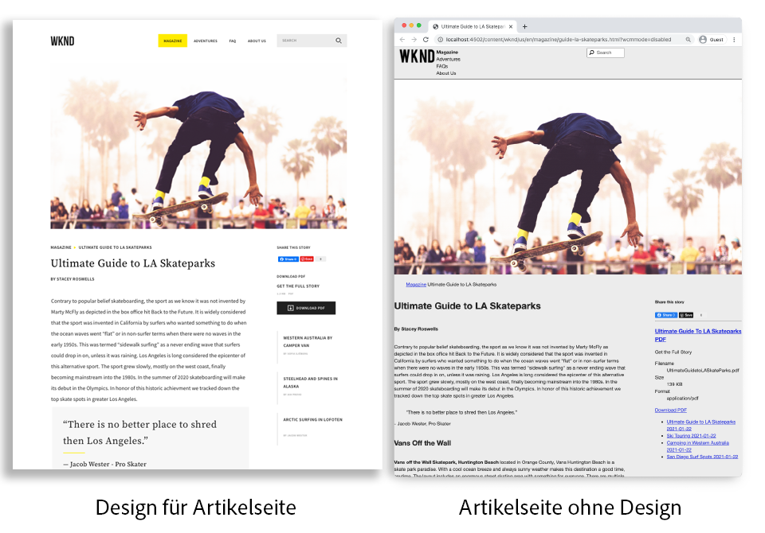
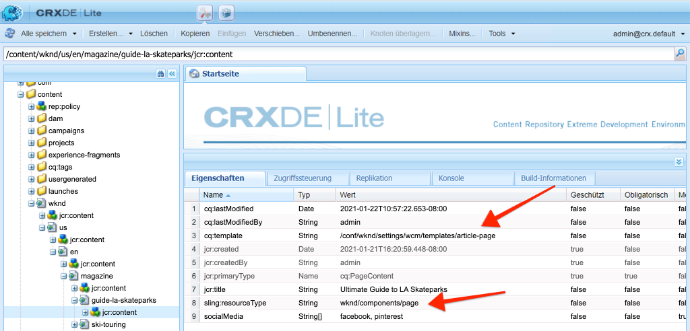
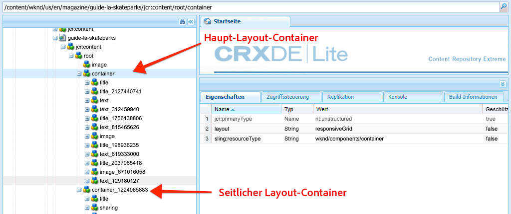
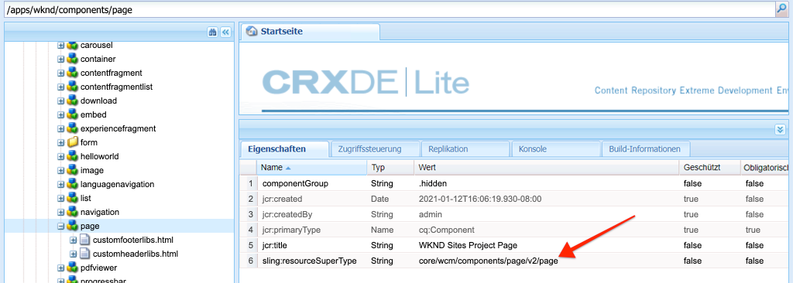
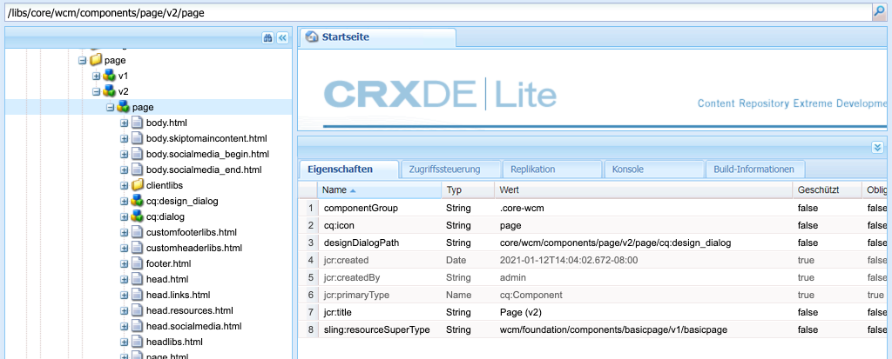

# Seiten und Vorlagen {#pages-and-template}

In diesem Kapitel werden wir die Beziehung zwischen einer Basisseitenkomponente und bearbeitbaren Vorlagen untersuchen. Wir werden eine nicht formatierte Artikelvorlage erstellen, die auf einigen Modelldarstellungen von [AdobeXD](https://www.adobe.com/products/xd.html) basiert. Beim Erstellen der Vorlage werden Kernkomponenten und erweiterte Richtlinienkonfigurationen der bearbeitbaren Vorlagen behandelt.

## Voraussetzungen {#prerequisites}

Überprüfen Sie die erforderlichen Tools und Anweisungen zum Einrichten einer [lokalen Entwicklungsumgebung](overview.md#local-dev-environment).

### Starterprojekt

>[!NOTE]
>
> Wenn Sie das vorherige Kapitel erfolgreich abgeschlossen haben, können Sie das Projekt wiederverwenden und die Schritte zum Auschecken des Starterprojekts überspringen.

Sehen Sie sich den Basis-Code an, auf dem das Tutorial aufbaut:

1. Sehen Sie sich die Verzweigung `tutorial/pages-templates-start` von [GitHub](https://github.com/adobe/aem-guides-wknd) an.

   ```shell
   $ cd ~/code/aem-guides-wknd
   $ git checkout tutorial/pages-templates-start
   ```

1. Stellen Sie die Codebasis mithilfe Ihrer Maven-Kenntnisse in einer lokalen AEM-Instanz bereit:

   ```shell
   $ mvn clean install -PautoInstallSinglePackage
   ```

   >[!NOTE]
   >
   > Wenn Sie AEM 6.5 oder 6.4 verwenden, hängen Sie das Profil `classic` an beliebige Maven-Befehle an.

   ```shell
   $ mvn clean install -PautoInstallSinglePackage -Pclassic
   ```

Sie können den fertigen Code immer auf [GitHub](https://github.com/adobe/aem-guides-wknd/tree/pages-templates/solution) anzeigen oder den Code lokal auschecken, indem Sie zu der Verzweigung `tutorial/pages-templates-solution` wechseln.

## Vorgabe

1. Inspect ist ein in Adobe XD erstellter Seitenentwurf und ordnet ihn Kernkomponenten zu.
1. Machen Sie sich mit den Details bearbeitbarer Vorlagen vertraut und erfahren Sie, wie Richtlinien verwendet werden können, um eine granulare Steuerung des Seiteninhalts zu erzwingen.
1. Erfahren Sie, wie Vorlagen und Seiten verknüpft werden

## Was Sie erstellen werden {#what-you-will-build}

In diesem Teil des Tutorials erstellen Sie eine neue Artikelseitenvorlage, die verwendet werden kann, um neue Artikelseiten zu erstellen und an einer gemeinsamen Struktur auszurichten. Die Artikelseitenvorlage basiert auf Designs und einem in Adobe XD erstellten UI-Kit. Dieses Kapitel konzentriert sich ausschließlich auf die Erstellung der Struktur oder des Skeletts der Vorlage. Es werden keine Stile implementiert, aber die Vorlage und die Seiten funktionieren.



## Benutzeroberflächenplanung mit Adobe XD {#adobexd}

In den meisten Fällen beginnt die Planung für eine neue Website mit Stichproben und statischen Designs. [Adobe ](https://www.adobe.com/products/xd.html) XDist ein Design-Tool zum Erstellen von Benutzererlebnissen. Als Nächstes werden wir ein UI-Kit und Modelle untersuchen, um die Struktur der Artikelseitenvorlage zu planen.

>[!VIDEO](https://video.tv.adobe.com/v/30214/?quality=12&learn=on)

**Laden Sie die  [WKND-Artikelentwurfsdatei](https://github.com/adobe/aem-guides-wknd/releases/download/aem-guides-wknd-0.0.2/AEM_UI-kit-WKND-article-design.xd)** herunter.

>[!NOTE]
>
> Ein generisches [AEM Kernkomponenten-UI-Kit ist auch](https://experienceleague.adobe.com/docs/experience-manager-learn/assets/AEM-CoreComponents-UI-Kit.xd) als Ausgangspunkt für benutzerdefinierte Projekte verfügbar.

## Erstellen der Artikelseitenvorlage

Wenn Sie eine Seite erstellen, müssen Sie eine Vorlage auswählen. Diese wird als Grundlage für die Erstellung der neuen Seite verwendet. Die Vorlage definiert die Struktur der resultierenden Seite, den anfänglichen Inhalt und die zulässigen Komponenten.

Es gibt drei Hauptbereiche von [Bearbeitbare Vorlagen](https://experienceleague.adobe.com/docs/experience-manager-65/developing/platform/templates/page-templates-editable.html):

1. **Struktur**  - definiert Komponenten, die Teil der Vorlage sind. Diese können von Inhaltsautoren nicht bearbeitet werden.
1. **Anfänglicher Inhalt**  - definiert Komponenten, mit denen die Vorlage beginnen soll. Diese können von Inhaltsautoren bearbeitet und/oder gelöscht werden
1. **Richtlinien**  - Definition von Konfigurationen zum Verhalten von Komponenten und zu den verfügbaren Optionen für Autoren.

Erstellen Sie anschließend eine neue Vorlage in AEM, die der Struktur der Sicherungen entspricht. Dies geschieht in einer lokalen Instanz von AEM. Führen Sie die folgenden Schritte aus:

>[!VIDEO](https://video.tv.adobe.com/v/330991/?quality=12&learn=on)

Allgemeine Schritte für das folgende Video:

### Strukturkonfigurationen

1. Erstellen Sie eine neue Vorlage mit dem Namen **Seitenvorlagentyp** mit dem Namen **Artikelseite**.
1. Wechseln Sie in den Modus **Struktur** .
1. Fügen Sie die Komponente **Experience Fragment** hinzu, um als **Header** oben in der Vorlage zu fungieren.
   * Konfigurieren Sie die Komponente so, dass sie auf `/content/experience-fragments/wknd/us/en/site/header/master` verweist.
   * Legen Sie die Richtlinie auf **Seitenkopf** fest und stellen Sie sicher, dass das **Standardelement** auf `header` gesetzt ist. Das Element `header`wird im nächsten Kapitel mit CSS angesprochen.
1. Fügen Sie die Komponente **Experience Fragment** hinzu, um als **Fußzeile** am unteren Rand der Vorlage zu fungieren.
   * Konfigurieren Sie die Komponente so, dass sie auf `/content/experience-fragments/wknd/us/en/site/footer/master` verweist.
   * Legen Sie die Richtlinie auf **Seitenfußzeile** fest und stellen Sie sicher, dass das **Standardelement** auf `footer` gesetzt ist. Das Element `footer` wird im nächsten Kapitel mit CSS angesprochen.
1. Sperren Sie den **main** -Container, der beim anfänglichen Erstellen der Vorlage enthalten war.
   * Legen Sie die Richtlinie auf **Page Main** fest und stellen Sie sicher, dass das **Standardelement** auf `main` gesetzt ist. Das Element `main` wird im nächsten Kapitel mit CSS angesprochen.
1. Fügen Sie eine **Image**-Komponente zum **main**-Container hinzu.
   * Entsperren Sie die Komponente **Bild**.
1. Fügen Sie eine Komponente **Breadcrumb** unter der Komponente **Bild** im Hauptbehälter hinzu.
   * Erstellen Sie eine neue Richtlinie für die Komponente **Breadcrumb** mit dem Namen **Artikelseite - Breadcrumb**. Setzen Sie die **Navigationsstartebene** auf **4**.
1. Fügen Sie eine Komponente **Container** unter der Komponente **Breadcrumb** und innerhalb des Containers **main** hinzu. Dies fungiert als **Inhaltscontainer** für die Vorlage.
   * Entsperren Sie den Container **Inhalt**.
   * Legen Sie die Richtlinie auf **Seiteninhalt** fest.
1. Fügen Sie eine weitere **Container**-Komponente unter dem **Inhaltscontainer** hinzu. Dies fungiert als **Seitenleiste**-Container für die Vorlage.
   * Entsperren Sie den Container **Seitenleiste**.
   * Erstellen Sie eine neue Richtlinie mit dem Namen **Artikelseite - Seitenleiste**.
   * Konfigurieren Sie die **Zulässige Komponenten** unter **WKND Sites Project - Content** so, dass Folgendes eingeschlossen ist: **Schaltfläche**, **Download**, **Bild**, **Liste**, **Trennzeichen**, **Social Media Sharing**, **Text** und **Titel**.
1. Aktualisieren Sie die Richtlinie des Seitenstamm-Containers. Dies ist der äußere Behälter der Vorlage. Legen Sie die Richtlinie auf **Seitenstamm** fest.
   * Legen Sie unter **Container Settings** **Layout** auf **Responsives Raster** fest.
1. Layout-Modus für den **Inhaltscontainer** einbinden. Ziehen Sie den Ziehpunkt von rechts nach links und verkleinern Sie den Container auf 8 Spalten breit.
1. Layout-Modus für den **Seitenleisten-Container** einbinden. Ziehen Sie den Ziehpunkt von rechts nach links und verkleinern Sie den Container auf 4 Spalten breit. Ziehen Sie dann den linken Ziehpunkt von links nach rechts 1 Spalte, um den Container 3 Spalten breit zu machen und eine 1-Spaltenlücke zwischen dem **Inhaltscontainer** zu belassen.
1. Öffnen Sie den mobilen Emulator und wechseln Sie zu einem mobilen Breakpoint. Wiederholen Sie den Layout-Modus und machen Sie den **Inhaltscontainer** und den **Seitenleisten-Container** zur vollständigen Breite der Seite. Dadurch werden die Container vertikal im mobilen Breakpoint gestapelt.
1. Aktualisieren Sie die Richtlinie der Komponente **Text** im Container **Inhalt**.
   * Legen Sie die Richtlinie auf **Content text** fest.
   * Aktivieren Sie unter **Plugins** > **Absatzstile** die Option **Absatzstile aktivieren** und stellen Sie sicher, dass der **Anführungsblock** aktiviert ist.

### Erstmalige Inhaltskonfigurationen

1. Wechseln Sie in den Modus **Anfänglicher Inhalt** .
1. Fügen Sie der Komponente **Inhaltscontainer** eine Komponente **Titel** hinzu. Dies dient als Titel des Artikels. Wenn er leer gelassen wird, wird automatisch der Titel der aktuellen Seite angezeigt.
1. Fügen Sie eine zweite **Title**-Komponente unterhalb der ersten Titelkomponente hinzu.
   * Konfigurieren Sie die Komponente mit dem Text: &quot;Nach Autor&quot;. Dies wird ein Textplatzhalter sein.
   * Legen Sie den Typ auf `H4` fest.
1. Fügen Sie eine Komponente **Text** unter der Komponente **Nach Autor** Titel hinzu.
1. Fügen Sie eine Komponente **Titel** zum **Seitenleisten-Container** hinzu.
   * Konfigurieren Sie die Komponente mit dem Text: &quot;Diese Geschichte teilen&quot;.
   * Legen Sie den Typ auf `H5` fest.
1. Fügen Sie eine Komponente **Social Media Sharing** unter der Komponente **Geben Sie diese Meldung** Titel frei.
1. Fügen Sie eine Komponente **Trennzeichen** unter der Komponente **Social Media Sharing** hinzu.
1. Fügen Sie eine **Download**-Komponente unter der Komponente **Trennzeichen** hinzu.
1. Fügen Sie eine **List**-Komponente unter der Komponente **Download** hinzu.
1. Aktualisieren Sie die **Anfängliche Seiteneigenschaften** für die Vorlage.
   * Überprüfen Sie unter **Social Media** > **Social Media Sharing** die Option **Facebook** und **Pinterest**

### Aktivieren Sie die Vorlage und fügen Sie eine Miniatur hinzu

1. Zeigen Sie die Vorlage in der Vorlagenkonsole an, indem Sie zu [http://localhost:4502/libs/wcm/core/content/sites/templates.html/conf/wknd](http://localhost:4502/libs/wcm/core/content/sites/templates.html/conf/wknd) navigieren.
1. **** Aktivieren Sie die Vorlage &quot;Artikelseite&quot;.
1. Bearbeiten Sie die Eigenschaften der Vorlage &quot;Artikelseite&quot;und laden Sie die folgende Miniaturansicht hoch, um die mit der Vorlage &quot;Artikelseite&quot;erstellten Seiten schnell zu identifizieren:

   

## Kopf- und Fußzeile mit Experience Fragments aktualisieren {#experience-fragments}

Eine gängige Praxis bei der Erstellung globaler Inhalte wie Kopf- oder Fußzeilen besteht darin, ein [Experience Fragment](https://docs.adobe.com/content/help/en/experience-manager-learn/sites/experience-fragments/experience-fragments-feature-video-use.html) zu verwenden. Experience Fragments ermöglicht es Benutzern, mehrere Komponenten zu kombinieren, um eine einzelne, referenzierbare Komponente zu erstellen. Experience Fragments bieten den Vorteil, dass die Verwaltung mehrerer Websites und [Lokalisierung](https://experienceleague.adobe.com/docs/experience-manager-core-components/using/components/experience-fragment.html?lang=en#localized-site-structure) unterstützt werden.

Der AEM Projektarchetyp generiert eine Kopf- und Fußzeile. Aktualisieren Sie anschließend die Experience Fragments, um sie an die Modelle anzupassen. Führen Sie die folgenden Schritte aus:

>[!VIDEO](https://video.tv.adobe.com/v/330992/?quality=12&learn=on)

Allgemeine Schritte für das folgende Video:

1. Laden Sie das Beispielinhaltspaket **[WKND-PagesTemplates-Content-Assets.zip](assets/pages-templates/WKND-PagesTemplates-Content-Assets.zip)** herunter.
1. Laden Sie das Inhaltspaket mit Package Manager unter [http://localhost:4502/crx/packmgr/index.jsp](http://localhost:4502/crx/packmgr/index.jsp) hoch und installieren Sie es.
1. Aktualisieren Sie die Vorlage Webvariante , die die Vorlage für Experience Fragments unter [http://localhost:4502/editor.html/conf/wknd/settings/wcm/templates/xf-web-variation/structure.html](http://localhost:4502/editor.html/conf/wknd/settings/wcm/templates/xf-web-variation/structure.html) ist.
   * Aktualisieren Sie die Richtlinie für die Komponente **Container** in der Vorlage.
   * Legen Sie die Richtlinie auf **XF Root** fest.
   * Wählen Sie unter **Zulässige Komponenten** die Komponentengruppe **WKND Sites Project - Structure** aus, um **Sprachnavigation**, **Navigation** und die Komponenten **Schnellsuche** einzuschließen.

### Header-Experience Fragment aktualisieren

1. Öffnen Sie das Experience Fragment, das die Kopfzeile unter [http://localhost:4502/editor.html/content/experience-fragments/wknd/us/en/site/header/master.html](http://localhost:4502/editor.html/content/experience-fragments/wknd/us/en/site/header/master.html) rendert.
1. Konfigurieren Sie den Stamm **Container** des Fragments. Dies ist der äußere **Container**.
   * Setzen Sie **Layout** auf **Responsives Raster**
1. Fügen Sie das dunkle **WKND-Logo** als Bild am oberen Rand des **Containers** hinzu. Das Logo war im Paket enthalten, das in einem vorherigen Schritt installiert wurde.
   * Ändern Sie das Layout des dunklen **WKND-Logos** in **2**-Spalten breit. Ziehen Sie die Griffe von rechts nach links.
   * Konfigurieren Sie das Logo mit **Alternativtext** des &quot;WKND-Logos&quot;.
   * Konfigurieren Sie das Logo auf **Link** auf `/content/wknd/us/en` der Startseite.
1. Konfigurieren Sie die Komponente **Navigation** , die bereits auf der Seite platziert ist.
   * Setzen Sie **Stammebenen ausschließen** auf **1**.
   * Setzen Sie die **Navigationsstrukturtiefe** auf **1**.
   * Ändern Sie das Layout der Komponente **Navigation** in **8** in die Breite der Spalten. Ziehen Sie die Griffe von rechts nach links.
1. Entfernen Sie die Komponente **Sprachnavigation** .
1. Ändern Sie das Layout der Komponente **Suche** in **2** in die Breite der Spalten. Ziehen Sie die Griffe von rechts nach links. Alle Komponenten sollten jetzt horizontal auf einer einzigen Zeile ausgerichtet werden.

### Fußzeile für Experience Fragment aktualisieren

1. Öffnen Sie das Experience Fragment, das die Fußzeile unter [http://localhost:4502/editor.html/content/experience-fragments/wknd/us/en/site/footer/master.html](http://localhost:4502/editor.html/content/experience-fragments/wknd/us/en/site/footer/master.html) rendert.
1. Konfigurieren Sie den Stamm **Container** des Fragments. Dies ist der äußere **Container**.
   * Setzen Sie **Layout** auf **Responsives Raster**
1. Fügen Sie das **WKND Light Logo** als Bild am oberen Rand des **Containers** hinzu. Das Logo war im Paket enthalten, das in einem vorherigen Schritt installiert wurde.
   * Ändern Sie das Layout des **WKND-Light-Logos** in **2**-Spalten breit. Ziehen Sie die Griffe von rechts nach links.
   * Konfigurieren Sie das Logo mit **Alternativtext** von &quot;WKND Logo Light&quot;.
   * Konfigurieren Sie das Logo auf **Link** auf `/content/wknd/us/en` der Startseite.
1. Fügen Sie unter dem Logo eine Komponente **Navigation** hinzu. Konfigurieren Sie die Komponente **Navigation**:
   * Setzen Sie **Stammebenen ausschließen** auf **1**.
   * Deaktivieren Sie **Sammlung aller untergeordneten Seiten**.
   * Setzen Sie die **Navigationsstrukturtiefe** auf **1**.
   * Ändern Sie das Layout der Komponente **Navigation** in **8** in die Breite der Spalten. Ziehen Sie die Griffe von rechts nach links.

## Artikelseite erstellen

Erstellen Sie anschließend eine neue Seite mithilfe der Vorlage &quot;Artikelseite&quot;. Verfassen Sie den Inhalt der Seite so, dass er mit den Site-Stichproben übereinstimmt. Führen Sie die folgenden Schritte aus:

>[!VIDEO](https://video.tv.adobe.com/v/330993/?quality=12&learn=on)

Allgemeine Schritte für das folgende Video:

1. Navigieren Sie zur Sites-Konsole unter [http://localhost:4502/sites.html/content/wknd/us/en/magazine](http://localhost:4502/sites.html/content/wknd/us/en/magazine).
1. Erstellen Sie eine neue Seite unter **WKND** > **US** > **EN** > **Magazine**.
   * Wählen Sie die Vorlage **Artikelseite** aus.
   * Legen Sie unter **Properties** **Title** auf &quot;Ultimate Guide to LA Skateparks&quot;fest.
   * Setzen Sie **Name** auf &quot;guide-la-skateparks&quot;.
1. Ersetzen Sie **By Author** Title durch den Text &quot;By Stacey Roswells&quot;.
1. Aktualisieren Sie die Komponente **Text** , um einen Absatz zum Ausfüllen des Artikels einzufügen. Sie können die folgende Textdatei als Kopie verwenden: [la-skate-parks-copy.txt](assets/pages-templates/la-skateparks-copy.txt).
1. Fügen Sie eine weitere **Text**-Komponente hinzu.
   * Aktualisieren Sie die Komponente, um das Anführungszeichen einzuschließen: &quot;Es gibt keinen besseren Ort, um ihn zu teilen, als Los Angeles.&quot;
   * Bearbeiten Sie den Rich-Text-Editor im Vollbildmodus und ändern Sie das obige Anführungszeichen, um das Element **Anführungsblock** zu verwenden.
1. Fahren Sie mit dem Füllen des Hauptteils des Artikels fort, um mit den Sicherungen zu übereinstimmen.
1. Konfigurieren Sie die Komponente **Download** , um eine PDF-Version des Artikels zu verwenden.
   * Klicken Sie unter **Download** > **Eigenschaften** auf das Kontrollkästchen **Den Titel aus dem DAM-Asset abrufen**.
   * Setzen Sie **Description** auf: &quot;Get the Full Story&quot;.
   * Setzen Sie **Aktionstext** auf: &quot;PDF herunterladen&quot;.
1. Konfigurieren Sie die Komponente **List** .
   * Wählen Sie unter **List Settings** > **Build List Using** die Option **Child Pages**.
   * Setzen Sie die **Übergeordnete Seite** auf `/content/wknd/us/en/magazine`.
   * Aktivieren Sie unter **Elementeinstellungen** die Option **Elemente verknüpfen** und aktivieren Sie die Option **Datum anzeigen**.

## Inspect der Knotenstruktur {#node-structure}

An dieser Stelle ist die Artikelseite eindeutig unformatiert. Die Grundstruktur ist jedoch vorhanden. Überprüfen Sie anschließend die Knotenstruktur der Artikelseite, um ein besseres Verständnis der Rolle der Vorlage, Seite und Komponenten zu erhalten.

Verwenden Sie das CRXDE-Lite-Tool auf einer lokalen AEM-Instanz, um die zugrunde liegende Knotenstruktur anzuzeigen.

1. Öffnen Sie [CRXDE-Lite](http://localhost:4502/crx/de/index.jsp#/content/wknd/us/en/magazine/guide-la-skateparks/jcr%3Acontent) und navigieren Sie mithilfe der Baumstruktur zu `/content/wknd/us/en/magazine/guide-la-skateparks`.

1. Klicken Sie auf den Knoten `jcr:content` unter der Seite `la-skateparks` und zeigen Sie die Eigenschaften an:

   

   Beachten Sie den Wert für `cq:template`, der auf `/conf/wknd/settings/wcm/templates/article-page` verweist, die zuvor erstellte Artikelseitenvorlage.

   Beachten Sie auch den Wert von `sling:resourceType`, der auf `wknd/components/page` verweist. Dies ist die Seitenkomponente, die vom AEM Projektarchetyp erstellt wurde und für das Rendern der Seite basierend auf der Vorlage verantwortlich ist.

1. Erweitern Sie den Knoten `jcr:content` unter `/content/wknd/us/en/magazine/guide-la-skateparks/jcr:content` und zeigen Sie die Knotenhierarchie an:

   

   Sie sollten in der Lage sein, jeden Knoten lose Komponenten zuzuordnen, die erstellt wurden. Überprüfen Sie, ob Sie die verschiedenen Layout-Container identifizieren können, indem Sie die Knoten überprüfen, denen `container` vorangestellt ist.

1. Überprüfen Sie dann die Seitenkomponente unter `/apps/wknd/components/page`. Zeigen Sie die Komponenteneigenschaften in CRXDE Lite an:

   

   Beachten Sie, dass sich unter der Seitenkomponente nur zwei HTL-Skripte befinden: `customfooterlibs.html` und `customheaderlibs.html`. *Wie rendert diese Komponente die Seite?*

   Die Eigenschaft `sling:resourceSuperType` verweist auf `core/wcm/components/page/v2/page`. Mit dieser Eigenschaft kann die Seitenkomponente der WKND **alle** der Funktionalität der Kernkomponente-Seitenkomponente übernehmen. Dies ist das erste Beispiel für etwas, das [Proxy Component Pattern](https://docs.adobe.com/content/help/en/experience-manager-core-components/using/developing/guidelines.html#ProxyComponentPattern) genannt wird. Weitere Informationen finden Sie [hier.](https://docs.adobe.com/content/help/en/experience-manager-core-components/using/developing/guidelines.html).

1. Inspect eine weitere Komponente innerhalb der WKND-Komponenten, die Komponente `Breadcrumb` unter: `/apps/wknd/components/breadcrumb`. Beachten Sie, dass dieselbe `sling:resourceSuperType`-Eigenschaft gefunden werden kann, diesmal jedoch auf `core/wcm/components/breadcrumb/v2/breadcrumb` verweist. Dies ist ein weiteres Beispiel für die Verwendung des Proxy-Komponentenmusters zum Einschließen einer Kernkomponente. Tatsächlich sind alle Komponenten in der WKND-Codebasis Proxys von AEM Kernkomponenten (mit Ausnahme unserer berühmten Komponente &quot;HelloWorld&quot;). Es empfiehlt sich, möglichst viele der Funktionen von Kernkomponenten erneut zu verwenden *bevor* benutzerdefinierten Code schreibt.

1. Überprüfen Sie anschließend die Kernkomponentenseite unter `/libs/core/wcm/components/page/v2/page` mithilfe der CRXDE Lite:

   >[!NOTE]
   >
   > In AEM 6.5/6.4 befinden sich die Kernkomponenten unter `/apps/core/wcm/components`. In AEM as a Cloud Service befinden sich die Kernkomponenten unter `/libs` und werden automatisch aktualisiert.

   

   Beachten Sie, dass unter dieser Seite viele weitere Skripte enthalten sind. Die Seite &quot;Kernkomponente&quot;enthält viele Funktionen. Diese Funktion ist in mehrere Skripte unterteilt, um die Wartung und Lesbarkeit zu erleichtern. Sie können die Einbindung der HTL-Skripte nachverfolgen, indem Sie `page.html` öffnen und nach `data-sly-include` suchen:

   ```html
   <!--/* /libs/core/wcm/components/page/v2/page/page.html */-->
   <!DOCTYPE HTML>
   <html data-sly-use.page="com.adobe.cq.wcm.core.components.models.Page" lang="${page.language}"
       data-sly-use.head="head.html"
       data-sly-use.footer="footer.html"
       data-sly-use.redirect="redirect.html">
       <head data-sly-call="${head.head @ page = page}"></head>
       <body class="${page.cssClassNames}"
           id="${page.id}"
           data-cmp-data-layer-enabled="${page.data ? true : false}">
           <script data-sly-test.dataLayerEnabled="${page.data}">
           window.adobeDataLayer = window.adobeDataLayer || [];
           adobeDataLayer.push({
               page: JSON.parse("${page.data.json @ context='scriptString'}"),
               event:'cmp:show',
               eventInfo: {
                   path: 'page.${page.id @ context="scriptString"}'
               }
           });
           </script>
           <sly data-sly-test.isRedirectPage="${page.redirectTarget && (wcmmode.edit || wcmmode.preview)}"
               data-sly-call="${redirect.redirect @ redirectTarget = page.redirectTarget}"></sly>
           <sly data-sly-test="${!isRedirectPage}">
               <sly data-sly-include="body.skiptomaincontent.html"></sly>
               <sly data-sly-include="body.socialmedia_begin.html"></sly>
               <sly data-sly-include="body.html"></sly>
               <sly data-sly-call="${footer.footer @ page = page}"></sly>
               <sly data-sly-include="body.socialmedia_end.html"></sly>
           </sly>
       </body>
   </html>
   ```

   Der andere Grund für das Ausschlüsseln der HTL in mehrere Skripte besteht darin, den Proxy-Komponenten zu ermöglichen, einzelne Skripte zu überschreiben, um benutzerdefinierte Geschäftslogik zu implementieren. Die HTL-Skripte `customfooterlibs.html` und `customheaderlibs.html` werden für den expliziten Zweck erstellt, der durch die Implementierung von Projekten überschrieben werden soll.

   Weitere Informationen dazu, wie die bearbeitbare Vorlage in das Rendering der [Inhaltsseite eingebunden wird, finden Sie in diesem Artikel](https://experienceleague.adobe.com/docs/experience-manager-65/developing/platform/templates/page-templates-editable.html).

1. Inspect die andere Kernkomponente, z. B. die Breadcrumb bei `/libs/core/wcm/components/breadcrumb/v2/breadcrumb`. Zeigen Sie das Skript `breadcrumb.html` an, um zu verstehen, wie das Markup für die Breadcrumb-Komponente letztendlich generiert wird.

## Speichern von Konfigurationen in der Quell-Code-Verwaltung {#configuration-persistence}

In vielen Fällen ist es insbesondere zu Beginn eines AEM-Projekts nützlich, Konfigurationen wie Vorlagen und zugehörige Inhaltsrichtlinien zur Quell-Code-Verwaltung beizubehalten. Dadurch wird sichergestellt, dass alle Entwickler mit demselben Inhalt und denselben Konfigurationen arbeiten und zusätzliche Konsistenz zwischen Umgebungen sichergestellt wird. Sobald ein Projekt einen gewissen Reifegrad erreicht hat, kann die Verwaltung von Vorlagen einer speziellen Gruppe von Power-Benutzern übertragen werden.

Zunächst werden wir die Vorlagen wie andere Codeabschnitte behandeln und die **Artikelseitenvorlage** im Rahmen des Projekts synchronisieren. Bis jetzt haben wir **den Code** von unserem AEM-Projekt an eine lokale Instanz von AEM übertragen. Die **Artikelseitenvorlage** wurde direkt auf einer lokalen Instanz von AEM erstellt. Daher müssen wir die Vorlage **importieren** in unser AEM Projekt. Das Modul **ui.content** ist zu diesem Zweck im AEM Projekt enthalten.

Die nächsten Schritte werden mit der VSCode IDE mit dem Plug-in [VSCode AEM Sync](https://marketplace.visualstudio.com/items?itemName=yamato-ltd.vscode-aem-sync&amp;ssr=false#overview) durchgeführt. Sie können jedoch eine beliebige IDE verwenden, die Sie für **import** konfiguriert haben, oder Inhalte aus einer lokalen Instanz von AEM importieren.

1. Öffnen Sie im VSCode das Projekt `aem-guides-wknd` .

1. Erweitern Sie das Modul **ui.content** im Projekt-Explorer. Erweitern Sie den Ordner `src` und navigieren Sie zu `/conf/wknd/settings/wcm/templates`.

1. [!UICONTROL Klicken Sie mit der rechten Maustaste ] auf den  `templates` Ordner und wählen Sie  **Import von AEM Server** aus:

   

   Die `article-page`-Vorlagen sollten importiert und die `page-content`- und `xf-web-variation`-Vorlagen sollten ebenfalls aktualisiert werden.

   

1. Wiederholen Sie die Schritte zum Importieren von Inhalten, wählen Sie jedoch den Ordner **policies** unter `/conf/wknd/settings/wcm/policies` aus.

   

1. Inspect die Datei `filter.xml` unter `ui.content/src/main/content/META-INF/vault/filter.xml`.

   ```xml
   <!--ui.content filter.xml-->
   <?xml version="1.0" encoding="UTF-8"?>
   <workspaceFilter version="1.0">
       <filter root="/conf/wknd" mode="merge"/>
       <filter root="/content/wknd" mode="merge"/>
       <filter root="/content/dam/wknd" mode="merge"/>
       <filter root="/content/experience-fragments/wknd" mode="merge"/>
   </workspaceFilter>
   ```

   Die `filter.xml`-Datei ist dafür verantwortlich, die Pfade von Knoten zu identifizieren, die mit dem Paket installiert werden. Beachten Sie die `mode="merge"` in jedem Filter, die darauf hinweisen, dass der vorhandene Inhalt nicht geändert wird, sondern nur neue Inhalte hinzugefügt werden. Da Inhaltsautoren diese Pfade möglicherweise aktualisieren, ist es wichtig, dass bei einer Codebereitstellung **nicht** Inhalte überschrieben werden. Weitere Informationen zum Arbeiten mit Filterelementen finden Sie in der [FileVault-Dokumentation](https://jackrabbit.apache.org/filevault/filter.html) .

   Vergleichen Sie `ui.content/src/main/content/META-INF/vault/filter.xml` und `ui.apps/src/main/content/META-INF/vault/filter.xml` , um die verschiedenen Knoten zu verstehen, die von den einzelnen Modulen verwaltet werden.

   >[!WARNING]
   >
   > Um eine konsistente Bereitstellung der WKND-Referenz-Site sicherzustellen, werden einige Verzweigungen des Projekts so eingerichtet, dass `ui.content` alle Änderungen im JCR überschreibt. Dies erfolgt standardmäßig, d. h. für Lösungsverzweigungen, da Code/Stile für bestimmte Richtlinien geschrieben werden.

## Herzlichen Glückwunsch! {#congratulations}

Herzlichen Glückwunsch, Sie haben soeben eine neue Vorlage und Seite mit Adobe Experience Manager Sites erstellt.

### Nächste Schritte {#next-steps}

An dieser Stelle ist die Artikelseite eindeutig unformatiert. Im Tutorial [Client-seitige Bibliotheken und Frontend-Workflow](client-side-libraries.md) erfahren Sie mehr über die Best Practices für die Einbeziehung von CSS und JavaScript, um globale Stile auf die Site anzuwenden und einen dedizierten Front-End-Build zu integrieren.

Zeigen Sie den fertigen Code auf [GitHub](https://github.com/adobe/aem-guides-wknd) an oder überprüfen Sie den Code und stellen Sie ihn lokal in der Git-Klammer `tutorial/pages-templates-solution` bereit.

1. Klonen Sie das Repository [github.com/adobe/aem-wknd-guides](https://github.com/adobe/aem-guides-wknd).
1. Sehen Sie sich die Verzweigung `tutorial/pages-templates-solution` an.
