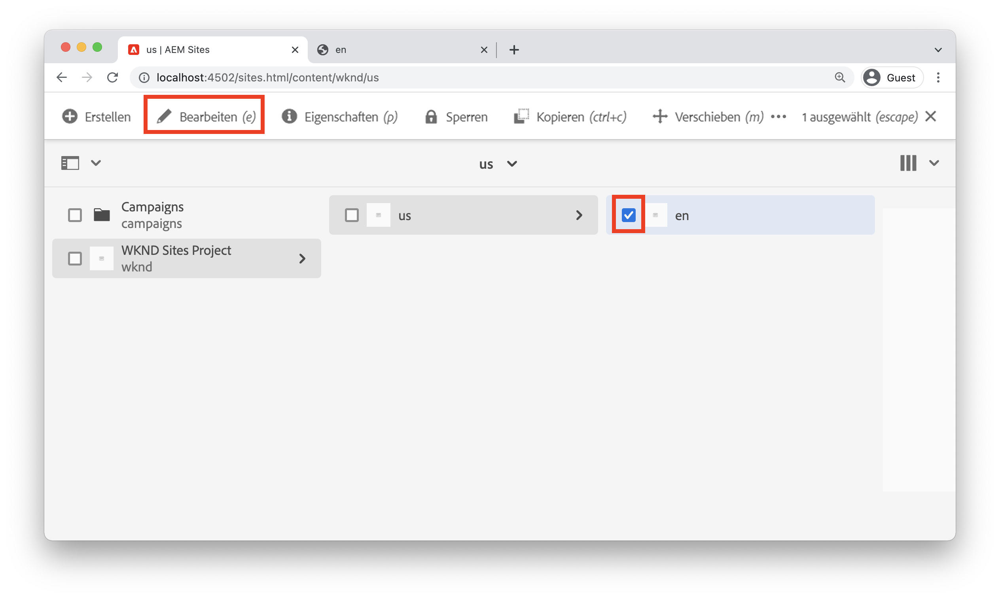
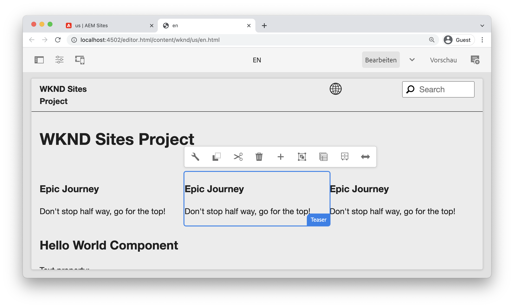
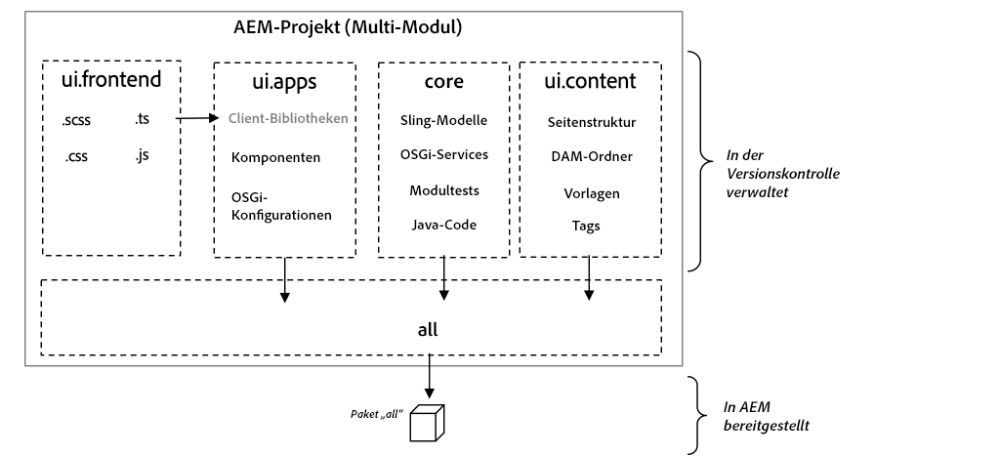
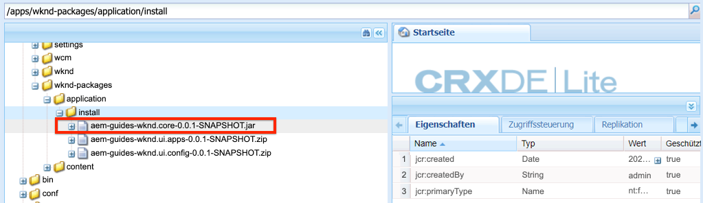
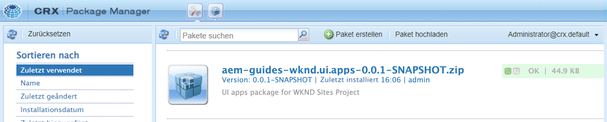

# Projekt-Setup {#project-setup}

Dieses Lernprogramm umfasst die Erstellung eines Maven-Multi-Module-Projekts zur Verwaltung des Codes und der Konfigurationen für eine Adobe Experience Manager-Site.

## Voraussetzungen {#prerequisites}

Überprüfen Sie die erforderlichen Werkzeuge und Anweisungen zum Einrichten einer [lokalen Entwicklungs-Umgebung](../overview.md#local-dev-environment). Stellen Sie sicher, dass eine neue Instanz von Adobe Experience Manager lokal verfügbar ist und dass keine zusätzlichen Beispiel-/Demopakete installiert wurden (außer den erforderlichen Service Packs).

## Vorgabe {#objective}

1. Erfahren Sie, wie Sie mit einem Maven-Archetyp ein neues AEM Projekt erstellen.
1. Machen Sie sich mit den verschiedenen Modulen vertraut, die vom AEM-Projektarchetyp generiert wurden und wie sie zusammenarbeiten.
1. Verstehen Sie, wie AEM Kernkomponenten in ein AEM Projekt einbezogen werden.

## Was Sie erstellen werden {#what-build}

>[!VIDEO](https://video.tv.adobe.com/v/30152/?quality=12&learn=on)

In diesem Kapitel erstellen Sie ein neues Adobe Experience Manager-Projekt mit dem AEM [Projekttyp](https://github.com/adobe/aem-project-archetype). Ihr AEM-Projekt enthält den gesamten Code, den Inhalt und die Konfigurationen, die für eine Sites-Implementierung verwendet werden. Das in diesem Kapitel erstellte Projekt wird als Grundlage für die Implementierung der WKND-Site dienen und in künftigen Kapiteln aufbauen.

**Was ist ein Maven-Projekt?** -  [Apache ](https://maven.apache.org/) Mavenis ist ein Software-Management-Tool zum Aufbau von Projekten. *Alle Adobe Experience* Manager-Implementierungen verwenden Maven-Projekte, um benutzerdefinierten Code zu erstellen, zu verwalten und über AEM bereitzustellen.

**Was ist ein Maven-Archetyp?** - Ein  [Maven-](https://maven.apache.org/archetype/index.html) Archetyp ist eine Vorlage oder ein Muster zum Generieren neuer Projekte. Der AEM Projekt-Archetyp ermöglicht es uns, ein neues Projekt mit einem benutzerdefinierten Namensraum zu erstellen und eine Projektstruktur einzubinden, die sich an Best Practices orientiert und unser Projekt erheblich beschleunigt.

## Projekt {#create} erstellen

Es gibt mehrere Optionen zum Erstellen eines Maven-Multi-Modul-Projekts für AEM. Dieses Tutorial nutzt den AEM [Maven-Projekttyp **26**](https://github.com/adobe/aem-project-archetype). Cloud Manager bietet außerdem einen UI-Assistenten](https://docs.adobe.com/content/help/en/experience-manager-cloud-manager/using/getting-started/create-an-application-project.html), um die Erstellung eines AEM Anwendungsprojekts zu starten. [ Das zugrunde liegende Projekt, das von der Benutzeroberfläche von Cloud Manager generiert wurde, ergibt dieselbe Struktur wie die direkte Verwendung des Archetyps.

>[!NOTE]
>
>Dieses Lernprogramm verwendet Version **26** des Archetyps. Es empfiehlt sich immer, die **letzte** Version des Archetyps zu verwenden, um ein neues Projekt zu erstellen.

Die nächste Reihe von Schritten erfolgt mit einem UNIX-basierten Befehlszeilenterminal, sollte jedoch bei Verwendung eines Windows-Terminals ähnlich sein.

1. Öffnen Sie ein Befehlszeilenterminal. Überprüfen Sie, ob Maven installiert ist:

   ```shell
   $ mvn --version
   Apache Maven 3.6.2
   Maven home: /Library/apache-maven-3.6.2
   Java version: 11.0.4, vendor: Oracle Corporation, runtime: /Library/Java/JavaVirtualMachines/jdk-11.0.4.jdk/Contents/Home
   ```

1. Stellen Sie sicher, dass das Profil **adobe-public** aktiv ist, indem Sie den folgenden Befehl ausführen:

   ```shell
   $ mvn help:effective-settings
       ...
   <activeProfiles>
       <activeProfile>adobe-public</activeProfile>
   </activeProfiles>
   <pluginGroups>
       <pluginGroup>org.apache.maven.plugins</pluginGroup>
       <pluginGroup>org.codehaus.mojo</pluginGroup>
   </pluginGroups>
   </settings>
   [INFO] ------------------------------------------------------------------------
   [INFO] BUILD SUCCESS
   [INFO] ------------------------------------------------------------------------
   [INFO] Total time:  0.856 s
   ```

   Wenn Sie **not** nicht **suchen, sehen Sie in der Datei adobe-public**, dass auf die Adobe Repo in Ihrer `~/.m2/settings.xml`-Datei nicht richtig verwiesen wird. Bitte wiederholen Sie die Schritte zur Installation und Konfiguration von Apache Maven in [einer lokalen Entwicklungs-Umgebung](https://docs.adobe.com/content/help/en/experience-manager-learn/foundation/development/set-up-a-local-aem-development-environment.html#install-apache-maven).

1. Navigieren Sie zu einem Ordner, in dem Sie das AEM Projekt erstellen möchten. Dies kann ein beliebiger Ordner sein, in dem Sie den Quellcode Ihres Projekts verwalten möchten. Beispiel: Ordner `code` unter dem Basisordner des Benutzers:

   ```shell
   $ cd ~/code
   ```

1. Fügen Sie Folgendes in die Befehlszeile zu [Generieren des Projekts im Stapelmodus](https://maven.apache.org/archetype/maven-archetype-plugin/examples/generate-batch.html) ein:

   ```shell
   mvn -B archetype:generate \
       -D archetypeGroupId=com.adobe.aem \
       -D archetypeArtifactId=aem-project-archetype \
       -D archetypeVersion=26 \
       -D appTitle="WKND Sites Project" \
       -D appId="wknd" \
       -D groupId="com.adobe.aem.guides.wknd" \
       -D artifactId="aem-guides-wknd" \
       -D version="0.0.1-SNAPSHOT" \
       -D aemVersion="cloud"
   ```

   >[!NOTE]
   >
   > Bei Targeting AEM 6.5.5+ ersetzen Sie `aemVersion="cloud"` durch `aemVersion="6.5.5"`. Verwenden Sie beim Targeting von 6.4.8+ `aemVersion="6.4.8"`.

   Eine vollständige Liste der verfügbaren Eigenschaften zum Konfigurieren eines Projekts [finden Sie hier](https://github.com/adobe/aem-project-archetype#available-properties).

1. Die folgende Ordner- und Dateistruktur wird vom Maven-Archetyp auf Ihrem lokalen Dateisystem generiert:

   ```plain
    ~/code/
       |--- aem-guides-wknd/
           |--- all/
           |--- core/
           |--- ui.apps/
           |--- ui.apps.structure/
           |--- ui.config/
           |--- ui.content/
           |--- ui.frontend/
           |--- ui.tests /
           |--- it.tests/
           |--- dispatcher/
           |--- analyse/
           |--- pom.xml
           |--- README.md
           |--- .gitignore
   ```

## Bereitstellen und Erstellen des Projekts {#build}

Erstellen Sie den Projektcode und stellen Sie ihn auf einer lokalen Instanz von AEM bereit.

1. Vergewissern Sie sich, dass eine Autoreninstanz AEM lokal am Port **4502** ausgeführt wird.
1. Navigieren Sie in der Befehlszeile zum Projektverzeichnis `aem-guides-wknd`.

   ```shell
   $ cd aem-guides-wknd
   ```

1. Führen Sie den folgenden Befehl aus, um das gesamte Projekt zu erstellen und für AEM bereitzustellen:

   ```shell
   $ mvn clean install -PautoInstallSinglePackage
   ```

   Der Build dauert etwa eine Minute und sollte mit der folgenden Meldung enden:

   ```
   ...
   [INFO] ------------------------------------------------------------------------
   [INFO] Reactor Summary for aem-guides-wknd 0.0.1-SNAPSHOT:
   [INFO]
   [INFO] aem-guides-wknd .................................... SUCCESS [  0.269 s]
   [INFO] WKND Sites Project - Core .......................... SUCCESS [  8.047 s]
   [INFO] WKND Sites Project - UI Frontend ................... SUCCESS [01:02 min]
   [INFO] WKND Sites Project - Repository Structure Package .. SUCCESS [  1.985 s]
   [INFO] WKND Sites Project - UI apps ....................... SUCCESS [  8.037 s]
   [INFO] WKND Sites Project - UI content .................... SUCCESS [  4.672 s]
   [INFO] WKND Sites Project - UI config ..................... SUCCESS [  0.313 s]
   [INFO] WKND Sites Project - All ........................... SUCCESS [  0.270 s]
   [INFO] WKND Sites Project - Integration Tests ............. SUCCESS [ 15.571 s]
   [INFO] WKND Sites Project - Dispatcher .................... SUCCESS [  0.232 s]
   [INFO] WKND Sites Project - UI Tests ...................... SUCCESS [  0.728 s]
   [INFO] WKND Sites Project - Project Analyser .............. SUCCESS [ 33.398 s]
   [INFO] ------------------------------------------------------------------------
   [INFO] BUILD SUCCESS
   [INFO] ------------------------------------------------------------------------
   [INFO] Total time:  02:18 min
   [INFO] Finished at: 2021-01-31T12:33:56-08:00
   [INFO] ------------------------------------------------------------------------
   ```

   Das Maven-Profil `autoInstallSinglePackage` kompiliert die einzelnen Projektmodule und stellt ein einzelnes Paket für die AEM Instanz bereit. Standardmäßig wird dieses Paket auf einer AEM Instanz bereitgestellt, die lokal am Port **4502** und mit den Anmeldeinformationen von `admin:admin` ausgeführt wird.

1. Navigieren Sie zu Package Manager auf Ihrer lokalen AEM: [http://localhost:4502/crx/packmgr/index.jsp](http://localhost:4502/crx/packmgr/index.jsp). Es sollten Pakete für `aem-guides-wknd.ui.apps`, `aem-guides-wknd.ui.config`, `aem-guides-wknd.ui.content` und `aem-guides-wknd.all` angezeigt werden.

1. Navigieren Sie zur Sites-Konsole: [http://localhost:4502/sites.html/content](http://localhost:4502/sites.html/content). Die WKND-Site wird eine der Sites sein. Es wird eine Site-Struktur mit einer Hierarchie der US- und Sprachmeister enthalten. Diese Site-Hierarchie basiert auf den Werten für `language_country` und `isSingleCountryWebsite`, wenn das Projekt mit dem Archetyp generiert wird.

1. Öffnen Sie die Seite **US** `>` **Englisch**, indem Sie die Seite auswählen und in der Menüleiste auf die Schaltfläche **Bearbeiten** klicken:

   

1. Starterinhalt wurde bereits erstellt und es stehen mehrere Komponenten zur Verfügung, die einer Seite hinzugefügt werden können. Experimentieren Sie mit diesen Komponenten, um eine Vorstellung von der Funktionalität zu erhalten. Im nächsten Kapitel lernen Sie die Grundlagen einer Komponente kennen.

   

   *Beispielinhalt, der vom Archetyp generiert wurde*

## Inspect des Projekts {#project-structure}

Das generierte AEM Projekt besteht aus einzelnen Maven Modulen, die jeweils eine andere Rolle haben. Dieses Tutorial und der Großteil der Entwicklungsumgebung konzentrieren sich auf die folgenden Module:

* [core](https://docs.adobe.com/content/help/en/experience-manager-core-components/using/developing/archetype/core.html)  - Java Code, in erster Linie Back-End-Entwickler.
* [ui.frontend](https://docs.adobe.com/content/help/en/experience-manager-core-components/using/developing/archetype/uifrontend.html)  - Enthält Quellcode für CSS, JavaScript, Sass, Type Script, vorwiegend für Front-End-Entwickler.
* [ui.apps](https://docs.adobe.com/content/help/en/experience-manager-core-components/using/developing/archetype/uiapps.html)  - Enthält Komponenten- und Dialogdefinitionen, bettet kompiliertes CSS und JavaScript als Client-Bibliotheken ein.
* [ui.content](https://docs.adobe.com/content/help/en/experience-manager-core-components/using/developing/archetype/uicontent.html)  - enthält Strukturinhalte und Konfigurationen wie bearbeitbare Vorlagen, Metadaten-Schemas (/content, /conf).

* **all**  - dies ist ein leeres Maven-Modul, das die oben genannten Module zu einem einzigen Paket zusammenfasst, das auf einer AEM Umgebung bereitgestellt werden kann.



Weitere Informationen zu den Maven-Modulen finden Sie in der AEM [Dokumentation zu Projektarchiv](https://docs.adobe.com/content/help/en/experience-manager-core-components/using/developing/archetype/overview.html).****

### Aufnahme der Kernkomponenten {#core-components}

[AEM Core ](https://docs.adobe.com/content/help/de-DE/experience-manager-core-components/using/introduction.html) Components sind ein Satz standardisierter Web-Content-Management-Komponenten (WCM) für AEM. Diese Komponenten bieten einen Grundsatz an Funktionen und sind so konzipiert, dass sie für einzelne Projekte gestaltet, angepasst und erweitert werden können.

AEM als Cloud Service-Umgebung enthalten die neueste Version von [AEM Kernkomponenten](https://docs.adobe.com/content/help/en/experience-manager-core-components/using/introduction.html). Daher enthalten für AEM als Cloud Service generierte Projekte **nicht** eine Einbettung AEM Kernkomponenten.

Bei AEM 6.5/6.4 generierten Projekten bettet der Archetyp [AEM Kernkomponenten](https://docs.adobe.com/content/help/en/experience-manager-core-components/using/introduction.html) automatisch in das Projekt ein. Es empfiehlt sich, AEM 6.5/6.4 AEM Hauptkomponenten einzubetten, um sicherzustellen, dass die neueste Version mit Ihrem Projekt bereitgestellt wird. Weitere Informationen darüber, wie Kernkomponenten im Projekt [enthalten sind, finden Sie hier](https://docs.adobe.com/content/help/en/experience-manager-core-components/using/developing/archetype/using.html#core-components).

## Source Control Management {#source-control}

Es empfiehlt sich immer, eine Form der Quellcodeverwaltung zu verwenden, um den Code in Ihrer Anwendung zu verwalten. Dieses Lernprogramm verwendet Git und GitHub. Es gibt mehrere Dateien, die von Maven und/oder der IDE der Wahl generiert werden, die vom SCM ignoriert werden sollten.

Maven erstellt einen Ordner für Zielgruppen, sobald Sie das Codepaket erstellen und installieren. Der Ordner und der Inhalt der Zielgruppe sollten von SCM ausgeschlossen werden.

Beachten Sie, dass unter `ui.apps` viele `.content.xml` Dateien erstellt werden. Diese XML-Dateien ordnen die Knotentypen und Eigenschaften von Inhalten zu, die in der JCR-Datei installiert sind. Diese Dateien sind kritisch und sollten **nicht** ignoriert werden.

Der AEM Projektarchiv generiert eine Beispieldatei `.gitignore`, die als Ausgangspunkt verwendet werden kann, für den Dateien sicher ignoriert werden können. Die Datei wird bei `<src>/aem-guides-wknd/.gitignore` generiert.

## Herzlichen Glückwunsch! {#congratulations}

Herzlichen Glückwunsch, Sie haben gerade Ihr erstes AEM Projekt erstellt!

### Nächste Schritte {#next-steps}

Verstehen Sie die zugrunde liegende Technologie einer Adobe Experience Manager (AEM)-Sites-Komponente mithilfe eines einfachen `HelloWorld`-Beispiels mit dem Lehrgang [Komponentengrundlagen](component-basics.md).

## Erweiterte Maven-Befehle (Bonus) {#advanced-maven-commands}

Während der Entwicklung können Sie mit nur einem der Module arbeiten und vermeiden, das gesamte Projekt zu bauen, um Zeit zu sparen. Möglicherweise möchten Sie die Bereitstellung auch direkt auf einer AEM Publish-Instanz oder möglicherweise auf einer Instanz von AEM durchführen, die nicht auf Port 4502 ausgeführt wird.

Als Nächstes werden wir einige zusätzliche Maven-Profil und -Befehle betrachten, die Sie für mehr Flexibilität während der Entwicklung verwenden können.

### Kernmodul {#core-module}

Das **[core](https://docs.adobe.com/content/help/en/experience-manager-core-components/using/developing/archetype/core.html)**-Modul enthält den gesamten Java-Code, der mit dem Projekt verknüpft ist. Bei der Erstellung wird ein OSGi-Bundle zur AEM bereitgestellt. So erstellen Sie nur dieses Modul:

1. Navigieren Sie zum Ordner `core` (unter `aem-guides-wknd`):

   ```shell
   $ cd core/
   ```

1. Führen Sie folgenden Befehl aus:

   ```shell
   $ mvn clean install -PautoInstallBundle
   ...
   [INFO] --- sling-maven-plugin:2.4.0:install (install-bundle) @ aem-guides-wknd.core ---
   [INFO] Installing Bundle aem-guides-wknd.core(~/code/aem-guides-wknd/core/target/aem-guides-wknd.core-0.0.1-SNAPSHOT.jar) to http://localhost:4502/system/console via WebConsole
   [INFO] Bundle installed
   [INFO] ------------------------------------------------------------------------
   [INFO] BUILD SUCCESS
   [INFO] ------------------------------------------------------------------------
   [INFO] Total time:  8.558 s
   ```

1. Navigieren Sie zu [http://localhost:4502/system/console/bundles](http://localhost:4502/system/console/bundles). Dies ist die OSGi-Webkonsole und enthält Informationen zu allen auf der AEM Instanz installierten Bundles.

1. Schalten Sie die Sortierspalte **Id** um und das WKND-Bundle sollte installiert und aktiv sein.

   

1. Sie können die &quot;physische&quot;Position der JAR-Datei in [CRXDE-Lite](http://localhost:4502/crx/de/index.jsp#/apps/wknd-packages/application/install/aem-guides-wknd.core-1.0.0-SNAPSHOT.jar) sehen:

   

### Ui.apps- und Ui.content-Module {#apps-content-module}

Das Maven-Modul **[ui.apps](https://docs.adobe.com/content/help/en/experience-manager-core-components/using/developing/archetype/uiapps.html)** enthält den gesamten Rendercode, der für die Site unter `/apps` benötigt wird. Dazu gehört auch CSS/JS, das im AEM Format [clientlibs](https://docs.adobe.com/content/help/en/experience-manager-cloud-service/implementing/developing/clientlibs.html) gespeichert wird. Dazu gehören auch [HTL](https://docs.adobe.com/content/help/de-DE/experience-manager-htl/using/overview.html)-Skripte zum Rendern von dynamischem HTML. Sie können sich das Modul **ui.apps** als Zuordnung zur Struktur in der JCR vorstellen, jedoch in einem Format, das auf einem Dateisystem gespeichert und der Quellcodeverwaltung verpflichtet werden kann. Das Modul **ui.apps** enthält nur Code.

So erstellen Sie das folgende Modul:

1. Über die Befehlszeile. Navigieren Sie zum Ordner `ui.apps` (unter `aem-guides-wknd`):

   ```shell
   $ cd ../ui.apps
   ```

1. Führen Sie folgenden Befehl aus:

   ```shell
   $ mvn clean install -PautoInstallPackage
   ...
   Package installed in 122ms.
   [INFO] ------------------------------------------------------------------------
   [INFO] BUILD SUCCESS
   [INFO] ------------------------------------------------------------------------
   [INFO] Total time:  6.972 s
   [INFO] Finished at: 2019-12-06T14:44:12-08:00
   [INFO] ------------------------------------------------------------------------
   ```

1. Navigieren Sie zu [http://localhost:4502/crx/packmgr/index.jsp](http://localhost:4502/crx/packmgr/index.jsp). Sie sollten das `ui.apps`-Paket als erstes installiertes Paket sehen und es sollte einen aktuelleren Zeitstempel haben als eines der anderen Pakete.

   

1. Kehren Sie zur Befehlszeile zurück und führen Sie den folgenden Befehl aus (im Ordner `ui.apps`):

   ```shell
   $ mvn -PautoInstallPackagePublish clean install
   ...
   [INFO] --- content-package-maven-plugin:1.0.2:install (install-package-publish) @ aem-guides-wknd.ui.apps ---
   [INFO] Installing aem-guides-wknd.ui.apps (/Users/dgordon/code/aem-guides-wknd/ui.apps/target/aem-guides-wknd.ui.apps-0.0.1-SNAPSHOT.zip) to http://localhost:4503/crx/packmgr/service.jsp
   [INFO] I/O exception (java.net.ConnectException) caught when processing request: Connection refused (Connection refused)
   [INFO] Retrying request
   [INFO] I/O exception (java.net.ConnectException) caught when processing request: Connection refused (Connection refused)
   [INFO] Retrying request
   [INFO] I/O exception (java.net.ConnectException) caught when processing request: Connection refused (Connection refused)
   [INFO] Retrying request
   [INFO] ------------------------------------------------------------------------
   [INFO] BUILD FAILURE
   [INFO] ------------------------------------------------------------------------
   [INFO] Total time:  6.717 s
   [INFO] Finished at: 2019-12-06T14:51:45-08:00
   [INFO] ------------------------------------------------------------------------
   ```

   Das Profil `autoInstallPackagePublish` dient zum Bereitstellen des Pakets auf einer Publish-Umgebung, die auf Port **4503** ausgeführt wird. Der obige Fehler wird erwartet, wenn eine AEM Instanz, die auf http://localhost:4503 ausgeführt wird, nicht gefunden werden kann.

1. Führen Sie schließlich den folgenden Befehl aus, um das `ui.apps`-Paket an Port **4504** bereitzustellen:

   ```shell
   $ mvn -PautoInstallPackage clean install -Daem.port=4504
   ...
   [INFO] --- content-package-maven-plugin:1.0.2:install (install-package) @ aem-guides-wknd.ui.apps ---
   [INFO] Installing aem-guides-wknd.ui.apps (/Users/dgordon/code/aem-guides-wknd/ui.apps/target/aem-guides-wknd.ui.apps-0.0.1-SNAPSHOT.zip) to http://localhost:4504/crx/packmgr/service.jsp
   [INFO] I/O exception (java.net.ConnectException) caught when processing request: Connection refused (Connection refused)
   [INFO] Retrying request
   [INFO] I/O exception (java.net.ConnectException) caught when processing request: Connection refused (Connection refused)
   [INFO] Retrying request
   [INFO] I/O exception (java.net.ConnectException) caught when processing request: Connection refused (Connection refused)
   [INFO] Retrying request
   [INFO] ------------------------------------------------------------------------
   [INFO] BUILD FAILURE
   [INFO] --------------------------------------------------------------------
   ```

   Es wird erneut ein Buildfehler erwartet, wenn keine AEM Instanz auf Port **4504** verfügbar ist. Der Parameter `aem.port` wird in der POM-Datei unter `aem-guides-wknd/pom.xml` definiert.

Das Modul **[ui.content](https://docs.adobe.com/content/help/en/experience-manager-core-components/using/developing/archetype/uicontent.htm)** ist genauso strukturiert wie das Modul **ui.apps**. Der einzige Unterschied besteht darin, dass das Modul **ui.content** den Inhalt **mutable** enthält. **&quot;** Mutablecontent&quot;bezieht sich im Wesentlichen auf Nicht-Code-Konfigurationen wie Vorlagen, Richtlinien oder Ordnerstrukturen, die in der Quellcodeverwaltung gespeichert sind,  **** aber auf einer AEM direkt geändert werden können. Dies wird im Kapitel zu Seiten und Vorlagen ausführlicher untersucht.

Die gleichen Maven-Befehle, die zum Erstellen des Moduls **ui.apps** verwendet werden, können zum Erstellen des Moduls **ui.content** verwendet werden. Wiederholen Sie die oben genannten Schritte im Ordner **ui.content**.
