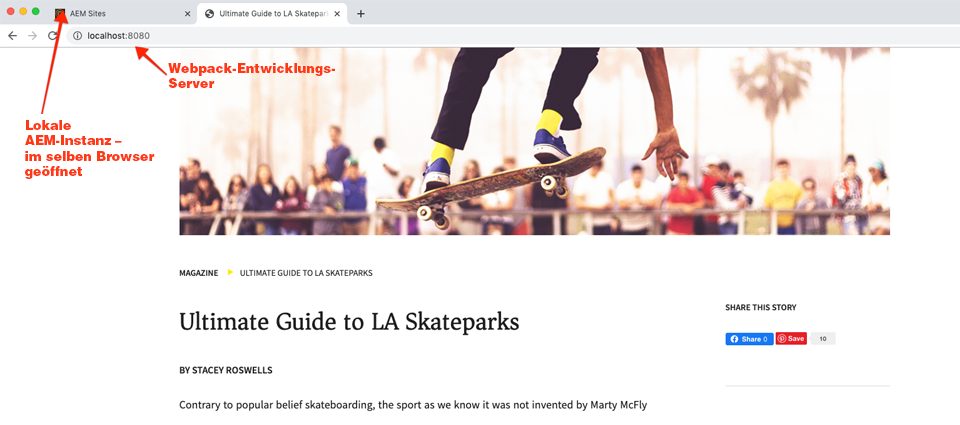

# Entwickeln mit dem Stilsystem {#developing-with-the-style-system}

Erfahren Sie, wie Sie einzelne Stile implementieren und Kernkomponenten mithilfe des Stilsystems von Experience Manager wiederverwenden. In diesem Tutorial wird die Entwicklung für das Stilsystem beschrieben, um Kernkomponenten mit markenspezifischem CSS und erweiterten Richtlinienkonfigurationen des Vorlagen-Editors zu erweitern.

## Voraussetzungen {#prerequisites}

Überprüfen Sie die erforderlichen Tools und Anweisungen zum Einrichten einer [lokalen Entwicklungsumgebung](overview.md#local-dev-environment).

Es wird außerdem empfohlen, das Tutorial [Client-seitige Bibliotheken und Frontend-Workflow](client-side-libraries.md) zu lesen, um die Grundlagen von Client-seitigen Bibliotheken und den verschiedenen Frontend-Tools, die in das AEM Projekt integriert sind, zu verstehen.

### Starterprojekt

>[!NOTE]
>
> Wenn Sie das vorherige Kapitel erfolgreich abgeschlossen haben, können Sie das Projekt wiederverwenden und die Schritte zum Auschecken des Starterprojekts überspringen.

Sehen Sie sich den Basis-Code an, auf dem das Tutorial aufbaut:

1. Sehen Sie sich die Verzweigung `tutorial/style-system-start` von [GitHub](https://github.com/adobe/aem-guides-wknd) an.

   ```shell
   $ cd aem-guides-wknd
   $ git checkout tutorial/style-system-start
   ```

1. Stellen Sie die Codebasis mithilfe Ihrer Maven-Kenntnisse in einer lokalen AEM-Instanz bereit:

   ```shell
   $ mvn clean install -PautoInstallSinglePackage
   ```

   >[!NOTE]
   >
   > Wenn Sie AEM 6.5 oder 6.4 verwenden, hängen Sie das Profil `classic` an beliebige Maven-Befehle an.

   ```shell
   $ mvn clean install -PautoInstallSinglePackage -Pclassic
   ```

Sie können den fertigen Code immer auf [GitHub](https://github.com/adobe/aem-guides-wknd/tree/tutorial/style-system-solution) anzeigen oder den Code lokal auschecken, indem Sie zu der Verzweigung `tutorial/style-system-solution` wechseln.

## Vorgabe

1. Erfahren Sie, wie Sie das Stilsystem verwenden, um markenspezifische CSS auf AEM Kernkomponenten anzuwenden.
1. Erfahren Sie mehr über die BEM-Notation und wie sie verwendet werden kann, um Stile sorgfältig zu definieren.
1. Wenden Sie erweiterte Richtlinienkonfigurationen mit bearbeitbaren Vorlagen an.

## Was Sie erstellen werden {#what-you-will-build}

In diesem Kapitel verwenden wir die Funktion [Stilsystem](https://docs.adobe.com/content/help/de-DE/experience-manager-learn/sites/page-authoring/style-system-feature-video-use.html), um Varianten der auf der Artikelseite verwendeten Komponenten **Titel** und **Text** zu erstellen.


*Für die Titelkomponente verfügbaren Stil unterstreichen*

## Hintergrund {#background}

Mit dem [Stilsystem](https://docs.adobe.com/content/help/de-DE/experience-manager-65/developing/components/style-system.html) können Entwickler und Vorlagen-Editoren mehrere visuelle Varianten einer Komponente erstellen. Autoren können dann entscheiden, welcher Stil beim Erstellen einer Seite verwendet werden soll. Wir werden das Stilsystem im Rest des Tutorials nutzen, um mehrere einzigartige Stile zu erreichen und gleichzeitig Kernkomponenten in einem Ansatz mit geringem Code zu nutzen.

Die allgemeine Idee des Stilsystems besteht darin, dass Autoren verschiedene Stile dafür wählen können, wie eine Komponente aussehen soll. Die &quot;Stile&quot;werden durch zusätzliche CSS-Klassen unterstützt, die in das äußere div einer Komponente eingefügt werden. In den Client-Bibliotheken werden CSS-Regeln basierend auf diesen Stilklassen hinzugefügt, sodass die Komponente das Erscheinungsbild ändert.

Eine detaillierte Dokumentation für das Stilsystem finden Sie hier ](https://experienceleague.adobe.com/docs/experience-manager-cloud-service/sites/authoring/features/style-system.html?lang=de). [ Es gibt auch ein großartiges [technisches Video zum Verständnis des Stilsystems](https://experienceleague.adobe.com/docs/experience-manager-learn/sites/developing/style-system-technical-video-understand.html).

## Stil unterstreichen - Titel {#underline-style}

Die [Titelkomponente](https://experienceleague.adobe.com/docs/experience-manager-core-components/using/components/title.html) wurde im Projekt unter `/apps/wknd/components/title` als Teil des Moduls **ui.apps** bereitgestellt. Die Standardstile der Überschriftenelemente (`H1`, `H2`, `H3`...) wurden bereits im Modul **ui.frontend** implementiert.

Die [WKND-Artikelentwürfe](assets/pages-templates/wknd-article-design.xd) enthalten einen eindeutigen Stil für die Titelkomponente mit einer Unterstreichung. Anstatt zwei Komponenten zu erstellen oder das Komponentendialogfeld zu ändern, kann das Stilsystem verwendet werden, um Autoren die Möglichkeit zu geben, einen Unterstrichstil hinzuzufügen.


### Inspect Title-Markup

Als Frontend-Entwickler besteht der erste Schritt zum Formatieren einer Kernkomponente darin, das von der Komponente generierte Markup zu verstehen.

1. Öffnen Sie einen neuen Browser und zeigen Sie die Komponente Titel auf der Website AEM Kernkomponentenbibliothek an: [https://www.aemcomponents.dev/content/core-components-examples/library/page-authoring/title.html](https://www.aemcomponents.dev/content/core-components-examples/library/page-authoring/title.html)

1. Unten finden Sie das Markup für die Komponente Titel :

   ```html
   <div class="cmp-title">
       <h1 class="cmp-title__text">Lorem Ipsum</h1>
   </div>
   ```

   Die BEM-Notation der Titelkomponente:

   ```plain
   BLOCK cmp-title
       ELEMENT cmp-title__text
   ```

1. Das Stilsystem fügt dem äußeren div um die Komponente herum eine CSS-Klasse hinzu. Daher ähnelt das Markup, das wir als Ziel auswählen werden, etwa Folgendem:

   ```html
   <div class="STYLE-SYSTEM-CLASS-HERE"> <!-- Custom CSS class - implementation gets to define this -->
       <div class="cmp-title">
           <h1 class="cmp-title__text">Lorem Ipsum</h1>
       </div>
   </div>
   ```

### Implementieren des &quot;Underline Style&quot;- ui.frontend

Implementieren Sie anschließend den Stil &quot;Unterstrichen&quot;mit dem Modul **ui.frontend** unseres Projekts. Wir verwenden den Webpack Development Server, der im Paket mit dem Modul **ui.frontend** enthalten ist, um eine Vorschau der Stile *vor der* Bereitstellung auf einer lokalen Instanz von AEM anzuzeigen.

1. Starten Sie den webpack-Dev-Server, indem Sie den folgenden Befehl im Modul **ui.frontend** ausführen:

   ```shell
   $ cd ~/code/aem-guides-wknd/ui.frontend/
   $ npm start
   
   > aem-maven-archetype@1.0.0 start code/aem-guides-wknd/ui.frontend
   > webpack-dev-server --open --config ./webpack.dev.js
   ```

   Dadurch sollte ein Browser unter [http://localhost:8080](http://localhost:8080) geöffnet werden.

   >[!NOTE]
   >
   > Wenn Bilder fehlerhaft erscheinen, stellen Sie sicher, dass das Startprojekt auf einer lokalen Instanz von AEM bereitgestellt wurde (auf Port 4502 ausgeführt) und der verwendete Browser sich auch bei der lokalen AEM-Instanz angemeldet hat.

   

1. Öffnen Sie in der IDE die Datei `index.html` unter: `ui.frontend/src/main/webpack/static/index.html`. Dies ist das statische Markup, das vom Webpack Development Server verwendet wird.
1. Suchen Sie in `index.html` nach einer Instanz der Titelkomponente, der der Unterstrichstil hinzugefügt werden soll, indem Sie im Dokument nach *cmp-title* suchen. Wählen Sie die Komponente Titel mit dem Text *&quot;Vans off the Wall Skatepark&quot;* (Zeile 218). Fügen Sie die Klasse `cmp-title--underline` zum umgebenden div hinzu:

   ```diff
   - <div class="title aem-GridColumn--phone--12 aem-GridColumn aem-GridColumn--default--8">
   + <div class="cmp-title--underline title aem-GridColumn--phone--12 aem-GridColumn aem-GridColumn--default--8">
        <div data-cmp-data-layer="{&#34;title-8bea562fa0&#34;:{&#34;@type&#34;:&#34;wknd/components/title&#34;,&#34;repo:modifyDate&#34;:&#34;2021-01-22T18:54:20Z&#34;,&#34;dc:title&#34;:&#34;Vans Off the Wall&#34;}}" id="title-8bea562fa0" class="cmp-title">
            <h2 class="cmp-title__text">Vans Off the Wall</h2>
        </div>
    </div>
   ```

1. Kehren Sie zum Browser zurück und stellen Sie sicher, dass die zusätzliche Klasse im Markup angezeigt wird.
1. Kehren Sie zum Modul **ui.frontend** zurück und aktualisieren Sie die Datei `title.scss` unter: `ui.frontend/src/main/webpack/components/_title.scss`:

   ```css
   /* Add Title Underline Style */
   .cmp-title--underline {
       .cmp-title__text {
           &:after {
           display: block;
               width: 84px;
               padding-top: 8px;
               content: '';
               border-bottom: 2px solid $brand-primary;
           }
       }
   }
   ```

   >[!NOTE]
   >
   >Es wird als Best Practice erachtet, Stile immer eng auf die Zielkomponente zu verteilen. Dadurch wird sichergestellt, dass sich zusätzliche Stile nicht auf andere Bereiche der Seite auswirken.
   >
   >Alle Kernkomponenten halten die **[BEM-Notation](https://github.com/adobe/aem-core-wcm-components/wiki/css-coding-conventions)** ein. Es empfiehlt sich, beim Erstellen eines Standardstils für eine Komponente die äußere CSS-Klasse als Ziel festzulegen. Eine weitere Best Practice ist, Klassennamen, die von der BEM-Notation der Kernkomponente angegeben werden, anstelle von HTML-Elementen auszuwählen.

1. Kehren Sie erneut zum Browser zurück und Sie sollten sehen, dass der Stil Unterstrichen hinzugefügt wurde:

   

1. Beenden Sie den Webpack Development Server.

### Eine Titelrichtlinie hinzufügen

Als Nächstes müssen wir eine neue Richtlinie für Titelkomponenten hinzufügen, damit Inhaltsautoren den Stil &quot;Unterstrichen&quot;wählen können, der auf bestimmte Komponenten angewendet werden soll. Dies geschieht mit dem Vorlagen-Editor in AEM.

1. Stellen Sie die Codebasis mithilfe Ihrer Maven-Fähigkeiten in einer lokalen AEM-Instanz bereit:

   ```shell
   $ cd ~/code/aem-guides-wknd
   $ mvn clean install -PautoInstallSinglePackage
   ```

1. Navigieren Sie zur Vorlage **Artikelseite** unter: [http://localhost:4502/editor.html/conf/wknd/settings/wcm/templates/article-page/structure.html](http://localhost:4502/editor.html/conf/wknd/settings/wcm/templates/article-page/structure.html)

1. Wählen Sie im Modus **Struktur** im Hauptmodus **Layout-Container** das Symbol **Richtlinie** neben der Komponente **Titel**, die unter *Zulässige Komponenten* aufgeführt ist:

   

1. Erstellen Sie eine neue Richtlinie für die Komponente Titel mit den folgenden Werten:

   *Richtlinienname **:  **WKND-Titel**

   *Eigenschaften*  >  *Registerkarte &quot;Stile&quot;* >  *Neuen Stil hinzufügen*

   **Unterstreichen** :  `cmp-title--underline`

   

   Klicken Sie auf **Fertig** , um die Änderungen an der Titelrichtlinie zu speichern.

   >[!NOTE]
   >
   > Der Wert `cmp-title--underline` entspricht der CSS-Klasse, die wir zuvor bei der Entwicklung im Modul **ui.frontend** angesprochen haben.

### Anwenden des Unterstrichstils

Als Autor können wir schließlich festlegen, dass der Unterstrichstil auf bestimmte Titelkomponenten angewendet wird.

1. Navigieren Sie zum Artikel **La Skateparks** im AEM Sites-Editor unter: [http://localhost:4502/editor.html/content/wknd/us/en/magazine/guide-la-skateparks.html](http://localhost:4502/editor.html/content/wknd/us/en/magazine/guide-la-skateparks.html)
1. Wählen Sie im Modus **Bearbeiten** eine Titelkomponente aus. Klicken Sie auf das Symbol **aintbrush** und wählen Sie den Stil **Unterstrichen** aus:

   

   Als Autor sollten Sie den Stil ein-/ausschalten können.

1. Klicken Sie auf das Symbol **Seiteninformationen** > **Als veröffentlicht anzeigen** , um die Seite außerhalb AEM Editors zu überprüfen.

   

   Verwenden Sie Ihre Browser-Entwickler-Tools, um zu überprüfen, ob das Markup um die Titelkomponente mit der CSS-Klasse `cmp-title--underline` auf das äußere div angewendet wird.

## Stil des Anführungszeichens - Text {#text-component}

Wiederholen Sie anschließend ähnliche Schritte, um einen eindeutigen Stil auf die [Textkomponente](https://experienceleague.adobe.com/docs/experience-manager-core-components/using/components/text.html) anzuwenden. Die Textkomponente wurde im Projekt unter `/apps/wknd/components/text` als Teil des Moduls **ui.apps** bereitgestellt. Die Standardstile von Absatzelementen wurden bereits in **ui.frontend** implementiert.

Die [WKND-Artikelentwürfe](assets/pages-templates/wknd-article-design.xd) enthalten einen eindeutigen Stil für die Textkomponente mit einem Anführungsblock:


### Markup der Inspect-Textkomponente

Wieder werden wir das Markup der Textkomponente überprüfen.

1. Überprüfen Sie das Markup für die Textkomponente unter: [https://www.aemcomponents.dev/content/core-components-examples/library/page-authoring/text.html](https://www.aemcomponents.dev/content/core-components-examples/library/page-authoring/text.html)

1. Unten finden Sie das Markup für die Textkomponente:

   ```html
   <div class="text">
       <div class="cmp-text" data-cmp-data-layer="{&quot;text-2d9d50c5a7&quot;:{&quot;@type&quot;:&quot;core/wcm/components/text/v2/text&quot;,&quot;repo:modifyDate&quot;:&quot;2019-01-22T11:56:17Z&quot;,&quot;xdm:text&quot;:&quot;<p>Lorem ipsum dolor sit amet, consectetur adipiscing elit, sed do eiusmod tempor incididunt ut labore et dolore magna aliqua. Eu mi bibendum neque egestas congue quisque egestas. Varius morbi enim nunc faucibus a pellentesque. Scelerisque eleifend donec pretium vulputate sapien nec sagittis.</p>\n&quot;}}" id="text-2d9d50c5a7">
           <p>Lorem ipsum dolor sit amet, consectetur adipiscing elit, sed do eiusmod tempor incididunt ut labore et dolore magna aliqua. Eu mi bibendum neque egestas congue quisque egestas. Varius morbi enim nunc faucibus a pellentesque. Scelerisque eleifend donec pretium vulputate sapien nec sagittis.</p>
       </div>
   </div>
   ```

   Die BEM-Notation der Textkomponente:

   ```plain
   BLOCK cmp-text
       ELEMENT
   ```

1. Das Stilsystem fügt dem äußeren div um die Komponente herum eine CSS-Klasse hinzu. Daher ähnelt das Markup, das wir als Ziel auswählen werden, etwa Folgendem:

   ```html
   <div class="text STYLE-SYSTEM-CLASS-HERE"> <!-- Custom CSS class - implementation gets to define this -->
       <div class="cmp-text" data-cmp-data-layer="{&quot;text-2d9d50c5a7&quot;:{&quot;@type&quot;:&quot;core/wcm/components/text/v2/text&quot;,&quot;repo:modifyDate&quot;:&quot;2019-01-22T11:56:17Z&quot;,&quot;xdm:text&quot;:&quot;<p>Lorem ipsum dolor sit amet, consectetur adipiscing elit, sed do eiusmod tempor incididunt ut labore et dolore magna aliqua. Eu mi bibendum neque egestas congue quisque egestas. Varius morbi enim nunc faucibus a pellentesque. Scelerisque eleifend donec pretium vulputate sapien nec sagittis.</p>\n&quot;}}" id="text-2d9d50c5a7">
           <p>Lorem ipsum dolor sit amet, consectetur adipiscing elit, sed do eiusmod tempor incididunt ut labore et dolore magna aliqua. Eu mi bibendum neque egestas congue quisque egestas. Varius morbi enim nunc faucibus a pellentesque. Scelerisque eleifend donec pretium vulputate sapien nec sagittis.</p>
       </div>
   </div>
   ```

### Implementieren des Anführungszeichenblock-Stils - ui.frontend

Als Nächstes implementieren wir den Stil des Anführungsblocks mit dem Modul **ui.frontend** unseres Projekts.

1. Starten Sie den webpack-Dev-Server, indem Sie den folgenden Befehl im Modul **ui.frontend** ausführen:

   ```shell
   $ cd ~/code/aem-guides-wknd/ui.frontend/
   $ npm start
   ```

1. Öffnen Sie in der IDE die Datei `index.html` unter: `ui.frontend/src/main/webpack/static/index.html`.
1. Suchen Sie in `index.html` eine Instanz der Textkomponente, indem Sie nach dem Text *&quot;Jacob Wester&quot;* (Zeile 210) suchen. Fügen Sie die Klasse `cmp-text--quote` zum umgebenden div hinzu:

   ```diff
   - <div class="text aem-GridColumn--phone--12 aem-GridColumn aem-GridColumn--default--8">
   + <div class="cmp-text--quote text aem-GridColumn--phone--12 aem-GridColumn aem-GridColumn--default--8">
        <div data-cmp-data-layer="{&#34;text-a15f39a83a&#34;:{&#34;@type&#34;:&#34;wknd/components/text&#34;,&#34;repo:modifyDate&#34;:&#34;2021-01-22T00:23:27Z&#34;,&#34;xdm:text&#34;:&#34;&lt;blockquote>&amp;quot;There is no better place to shred then Los Angeles.”&lt;/blockquote>\r\n&lt;p>- Jacob Wester, Pro Skater&lt;/p>\r\n&#34;}}" id="text-a15f39a83a" class="cmp-text">
            <blockquote>&quot;There is no better place to shred then Los Angeles.”</blockquote>
            <p>- Jacob Wester, Pro Skater</p>
        </div>
    </div>
   ```

1. Aktualisieren Sie die Datei `text.scss` unter: `ui.frontend/src/main/webpack/components/_text.scss`:

   ```css
   /* WKND Text Quote style */
   .cmp-text--quote {
       .cmp-text {
           background-color: $brand-third;
           margin: 1em 0em;
           padding: 1em;
   
           blockquote {
               border: none;
               font-size: $font-size-large;
               font-family: $font-family-serif;
               padding: 14px 14px;
               margin: 0;
               margin-bottom: 0.5em;
   
               &:after {
                   border-bottom: 2px solid $brand-primary; /*yellow border */
                   content: '';
                   display: block;
                   position: relative;
                   top: 0.25em;
                   width: 80px;
               }
           }
           p {
               font-family:  $font-family-serif;
           }
       }
   }
   ```

   >[!CAUTION]
   >
   > In diesem Fall werden rohe HTML-Elemente von den Stilen angesprochen. Dies liegt daran, dass die Textkomponente einen Rich-Text-Editor für Inhaltsautoren bereitstellt. Die Erstellung von Stilen direkt mit RTE-Inhalten sollte mit Vorsicht erfolgen, und es ist umso wichtiger, die Stile genauer zu definieren.

1. Kehren Sie erneut zum Browser zurück und Sie sollten sehen, wie der Stil des Anführungsblocks hinzugefügt wurde:

   

1. Beenden Sie den Webpack Development Server.

### Eine Textrichtlinie hinzufügen

Als Nächstes fügen Sie eine neue Richtlinie für die Textkomponenten hinzu.

1. Stellen Sie die Codebasis mithilfe Ihrer Maven-Kenntnisse in einer lokalen AEM-Instanz bereit:

   ```shell
   $ cd ~/code/aem-guides-wknd
   $ mvn clean install -PautoInstallSinglePackage
   ```

1. Navigieren Sie zur **Artikelseitenvorlage** unter: [http://localhost:4502/editor.html/conf/wknd/settings/wcm/templates/article-page/structure.html](http://localhost:4502/editor.html/conf/wknd/settings/wcm/templates/article-page/structure.html)).

1. Wählen Sie im Modus **Struktur** im Hauptmodus **Layout-Container** das Symbol **Richtlinie** neben der Komponente **Text**, die unter *Zulässige Komponenten* aufgeführt ist:

   

1. Aktualisieren Sie die Textkomponentenrichtlinie mit den folgenden Werten:

   *Richtlinienname **:  **Inhaltstext**

   *Plug-ins*  >  *Absatzstile*  > Absatzstile  *aktivieren*

   *Registerkarte &quot;Stile&quot;* >  *Neuen Stil hinzufügen*

   **Anführungsblock** :  `cmp-text--quote`

   

   

   Klicken Sie auf **Fertig** , um die Änderungen an der Textrichtlinie zu speichern.

### Anwenden des Anführungszeichenblock-Stils

1. Navigieren Sie zum Artikel **La Skateparks** im AEM Sites-Editor unter: [http://localhost:4502/editor.html/content/wknd/us/en/magazine/guide-la-skateparks.html](http://localhost:4502/editor.html/content/wknd/us/en/magazine/guide-la-skateparks.html)
1. Wählen Sie im Modus **Bearbeiten** eine Textkomponente aus. Bearbeiten Sie die Komponente, um ein Anführungszeichenelement einzuschließen:

   

1. Wählen Sie die Textkomponente aus, klicken Sie auf das Symbol **pinsel** und wählen Sie den Stil **Anführungsblock** aus:

   

   Als Autor sollten Sie den Stil ein-/ausschalten können.

## Feste Breite - Container (Bonus) {#layout-container}

Container-Komponenten wurden verwendet, um die grundlegende Struktur der Artikelseitenvorlage zu erstellen und die Ablageflächen bereitzustellen, damit Inhaltsautoren Inhalte auf einer Seite hinzufügen können. Container können auch das Stilsystem nutzen und Autoren von Inhalten noch mehr Optionen zum Entwerfen von Layouts bieten.

Der **Hauptbehälter** der Artikelseitenvorlage enthält die beiden Container, die Authoring-fähig sind, und hat eine feste Breite.


*Hauptbehälter in der Artikelseitenvorlage*.

Die Richtlinie des **Hauptcontainers** legt das Standardelement auf `main` fest:


Das CSS, das den **Hauptcontainer** fixiert, wird im Modul **ui.frontend** unter `ui.frontend/src/main/webpack/site/styles/container_main.scss` festgelegt:

```SCSS
main.container {
    padding: .5em 1em;
    max-width: $max-content-width;
    float: unset!important;
    margin: 0 auto!important;
    clear: both!important;
}
```

Anstatt das HTML-Element `main` als Ziel festzulegen, kann das Stilsystem verwendet werden, um einen **Stil mit fester Breite** als Teil der Container-Richtlinie zu erstellen. Das Stilsystem bietet Benutzern die Möglichkeit, zwischen **Containern mit fester Breite** und **Fluid width** umzuschalten.

1. **Bonusaufgabe**  - Nutzen Sie die aus den vorherigen Übungen gewonnenen Erfahrungen und verwenden Sie das Stilsystem, um eine  **feste** Breite und  **fließende** Breitenstile für die Container-Komponente zu implementieren.

## Herzlichen Glückwunsch! {#congratulations}

Herzlichen Glückwunsch! Die Artikelseite ist fast vollständig formatiert und Sie haben praktische Erfahrungen mit dem AEM Stilsystem gesammelt.

### Nächste Schritte {#next-steps}

Erfahren Sie, wie Sie eine [benutzerdefinierte AEM-Komponente](custom-component.md) erstellen, die in einem Dialogfeld verfasste Inhalte anzeigt, und wie Sie ein Sling-Modell entwickeln können, um eine Geschäftslogik einzukapseln, die die HTL der Komponente füllt.

Zeigen Sie den fertigen Code auf [GitHub](https://github.com/adobe/aem-guides-wknd) an oder überprüfen Sie den Code und stellen Sie ihn lokal in der Git-Klammer `tutorial/style-system-solution` bereit.

1. Klonen Sie das Repository [github.com/adobe/aem-wknd-guides](https://github.com/adobe/aem-guides-wknd).
1. Sehen Sie sich die Verzweigung `tutorial/style-system-solution` an.
