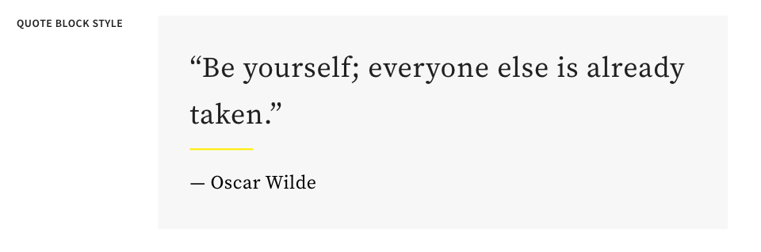

# Entwickeln mit dem Stilsystem {#developing-with-the-style-system}

Erfahren Sie, wie Sie einzelne Stile implementieren und Kernkomponenten mithilfe des Stilsystems von Experience Manager wiederverwenden. In diesem Tutorial werden Entwicklungsschritte für das Stilsystem beschrieben, mit denen Kernkomponenten mit markenspezifischem CSS und erweiterten Richtlinienkonfigurationen des Vorlageneditors erweitert werden.

## Voraussetzungen {#prerequisites}

Vergegenwärtigen Sie sich die erforderlichen Tools und Anweisungen zum Einrichten einer [lokalen Entwicklungsumgebung](overview.md#local-dev-environment).

Außerdem wird empfohlen, das Tutorial [Client-seitige Bibliotheken und Frontend-Workflow](client-side-libraries.md) zu lesen, um die Grundlagen der Client-seitigen Bibliotheken und der verschiedenen in das AEM-Projekt integrierten Frontend-Tools zu verstehen.

### Ausgangsprojekt

>[!NOTE]
>
> Wenn Sie das vorherige Kapitel erfolgreich abgeschlossen haben, können Sie das Projekt wiederverwenden und die Schritte zum Ausprobieren des Ausgangsprojekts überspringen.

Checken Sie den Basis-Code aus, auf dem das Tutorial aufbaut:

1. Checken Sie die Verzweigung `tutorial/style-system-start` aus [GitHub](https://github.com/adobe/aem-guides-wknd) aus.

   ```shell
   $ cd aem-guides-wknd
   $ git checkout tutorial/style-system-start
   ```

1. Stellen Sie die Code-Basis mithilfe Ihrer Maven-Kenntnisse in einer lokalen AEM-Instanz bereit:

   ```shell
   $ mvn clean install -PautoInstallSinglePackage
   ```

   >[!NOTE]
   >
   > Wenn Sie AEM 6.5 oder 6.4 verwenden, fügen Sie das `classic`-Profil an beliebige Maven-Befehle an.

   ```shell
   $ mvn clean install -PautoInstallSinglePackage -Pclassic
   ```

Sie können den fertigen Code jederzeit auf [GitHub](https://github.com/adobe/aem-guides-wknd/tree/tutorial/style-system-solution) ansehen oder den Code lokal herunterladen, indem Sie zu der Verzweigung `tutorial/style-system-solution` wechseln.

## Ziel

1. Erfahren Sie, wie Sie das Stilsystem verwenden, um markenspezifische CSS auf AEM-Kernkomponenten anzuwenden.
1. Erfahren Sie mehr über die BEM-Notation und wie sie verwendet werden kann, um Stile sorgfältig zu definieren.
1. Wenden Sie erweiterte Richtlinienkonfigurationen mit bearbeitbaren Vorlagen an.

## Was Sie erstellen werden {#what-build}

Dieses Kapitel verwendet die Funktion [Stilsystem](https://experienceleague.adobe.com/docs/experience-manager-learn/sites/page-authoring/style-system-feature-video-use.html?lang=de), um Variationen der Komponenten **Titel** und **Text** zu erstellen, die auf der Artikelseite verwendet werden.


*Der für die Titelkomponente verfügbare Unterstreichungsstil*

## Hintergrund {#background}

Das [Stilsystem](https://experienceleague.adobe.com/docs/experience-manager-65/authoring/siteandpage/style-system.html?lang=de) ermöglicht es Entwickelnden und Vorlagen-Editierenden, mehrere visuelle Varianten einer Komponente zu erstellen. Autorinnen und Autoren können dann ihrerseits entscheiden, welchen Stil sie beim Verfassen einer Seite verwenden möchten. Das Stilsystem wird im weiteren Verlauf des Tutorials verwendet, um verschiedene einzigartige Stile zu erzielen und dabei in einem Low-Code-Ansatz Kernkomponenten zu verwenden.

Der Grundgedanke des Stilsystems ist, dass Autorinnen und Autoren verschiedene Stile für das Aussehen einer Komponente auswählen können. Die „Stile“ werden durch zusätzliche CSS-Klassen unterstützt, die in das äußere div-Element einer Komponente eingeführt werden. In den Client-Bibliotheken werden CSS-Regeln auf der Grundlage dieser Stilklassen hinzugefügt, damit die Komponente ihr Erscheinungsbild ändert.

Eine [ausführliche Dokumentation zu Stilsystemen finden Sie hier](https://experienceleague.adobe.com/docs/experience-manager-cloud-service/content/sites/authoring/features/style-system.html?lang=de). Es gibt auch ein interessantes [technisches Video zum Verständnis des Stilsystems](https://experienceleague.adobe.com/docs/experience-manager-learn/sites/developing/style-system-technical-video-understand.html?lang=de).

## Unterstreichungsstil – Titel {#underline-style}

Die [Titelkomponente](https://experienceleague.adobe.com/docs/experience-manager-core-components/using/wcm-components/title.html?lang=de) wurde unter `/apps/wknd/components/title` als Teil des **ui.apps**-Moduls in das Projekt integriert. Die Standardstile der Überschriftenelemente (`H1`, `H2`, `H3`...) wurden bereits im Modul **ui.frontend** implementiert.

Die [WKND-Artikelentwürfe](assets/pages-templates/wknd-article-design.xd) enthalten einen einzigartigen Stil für die Titelkomponente mit einer Unterstreichung. Anstatt zwei Komponenten zu erstellen oder das Komponentendialogfeld zu ändern, kann das Stilsystem verwendet werden, um Autorinnen und Autoren die Möglichkeit zu geben, einen Unterstreichungsstil hinzuzufügen.


### Hinzufügen einer Titelrichtlinie

Im Folgenden fügen wir eine Richtlinie für die Titelkomponenten hinzu, damit die Autorinnen und Autoren von Inhalten den Stil „Unterstreichen“ auswählen und auf bestimmte Komponenten anwenden können. Dies geschieht mit dem Vorlageneditor in AEM.

1. Navigieren Sie zur **Artikelseiten**-Vorlage über: [http://localhost:4502/editor.html/conf/wknd/settings/wcm/templates/article-page/structure.html](http://localhost:4502/editor.html/conf/wknd/settings/wcm/templates/article-page/structure.html)

1. Wählen Sie im **Strukturmodus** im **Haupt-Layout-Container** das Symbol **Richtlinie** neben der Komponente **Titel**, die unter *Zugelassene Komponenten* aufgeführt ist:

   

1. Erstellen Sie eine Richtlinie für die Titelkomponente mit den folgenden Werten:

   *Richtlinientitel&#42;*: **WKND-Titel**

   *Eigenschaften* > *Registerkarte „Stil“* > *Neuen Stil hinzufügen*

   **Unterstreichen**: `cmp-title--underline`

   

   Klicken Sie auf **Fertig**, um die Änderungen an der Titelrichtlinie zu speichern.

   >[!NOTE]
   >
   > Der Wert `cmp-title--underline` füllt die CSS-Klasse im äußeren div des HTML-Markups der Komponente.

### Anwenden des Unterstrichstils

Als Verfassende können wir den Unterstreichungsstil auf bestimmte Titelkomponenten anwenden.

1. Navigieren Sie zu dem Artikel **La Skateparks** im AEM Sites-Editor unter: [http://localhost:4502/editor.html/content/wknd/us/en/magazine/guide-la-skateparks.html](http://localhost:4502/editor.html/content/wknd/us/en/magazine/guide-la-skateparks.html)
1. Wählen Sie im Modus **Bearbeiten** eine Titelkomponente. Klicken Sie auf das Symbol **Pinsel** und wählen Sie den Stil **Unterstreichen**:

   

   >[!NOTE]
   >
   > An dieser Stelle tritt keine sichtbare Änderung auf, da der Stil `underline` nicht implementiert worden ist. In der nächsten Übung wird dieser Stil implementiert.

1. Klicken Sie auf das Symbol **Seiteninformationen** > **Als veröffentlicht anzeigen**, um die Seite außerhalb des AEM-Editors zu überprüfen.
1. Verwenden Sie Ihre Browser-Entwickler-Tools, um zu überprüfen, ob das Markup um die Titelkomponente die CSS-Klasse `cmp-title--underline` auf das äußere div angewendet hat.

   

   ```html
   <div class="title cmp-title--underline">
       <div data-cmp-data-layer="{&quot;title-b6450e9cab&quot;:{&quot;@type&quot;:&quot;wknd/components/title&quot;,&quot;repo:modifyDate&quot;:&quot;2022-02-23T17:34:42Z&quot;,&quot;dc:title&quot;:&quot;Vans Off the Wall Skatepark&quot;}}" 
       id="title-b6450e9cab" class="cmp-title">
           <h2 class="cmp-title__text">Vans Off the Wall Skatepark</h2>
       </div>
   </div>
   ```

### Implementierung des Unterstrichstils – ui.frontend

Als nächstes implementieren Sie den Unterstrichstil mit dem Modul **ui.frontend** des AEM-Projekts. Der Webpack-Entwicklungs-Server, der mit dem Modul **ui.frontend** gebündelt ist, wird verwendet, um eine Vorschau der Stile *vor* der Bereitstellung in einer lokalen Instanz von AEM anzuzeigen.

1. Starten Sie den `watch`-Prozess innerhalb des **ui.frontend**-Moduls:

   ```shell
   $ cd ~/code/aem-guides-wknd/ui.frontend/
   $ npm run watch
   ```

   Dadurch wird ein Prozess gestartet, der Änderungen im `ui.frontend`-Modul überwacht und die Änderungen mit der AEM-Instanz synchronisiert.


1. Kehren Sie zu Ihrer IDE zurück und öffnen Sie die Datei `_title.scss` in `ui.frontend/src/main/webpack/components/_title.scss`.
1. Führen Sie eine neue Regel ein, die auf die Klasse `cmp-title--underline` abzielt:

   ```scss
   /* Default Title Styles */
   .cmp-title {}
   .cmp-title__text {}
   .cmp-title__link {}
   
   /* Add Title Underline Style */
   .cmp-title--underline {
       .cmp-title__text {
           &:after {
           display: block;
               width: 84px;
               padding-top: 8px;
               content: '';
               border-bottom: 2px solid $brand-primary;
           }
       }
   }
   ```

   >[!NOTE]
   >
   >Es gilt als Best Practice, Stile immer eng an die Zielkomponente zu binden. Dadurch wird sichergestellt, dass zusätzliche Stile keine Auswirkungen auf andere Bereiche der Seite haben.
   >
   >Alle Kernkomponenten halten sich an die **[BEM-Notation](https://github.com/adobe/aem-core-wcm-components/wiki/css-coding-conventions)**. Es empfiehlt sich, die äußere CSS-Klasse zu verwenden, wenn Sie einen Standardstil für eine Komponente erstellen. Eine weitere Best Practice ist die Verwendung von Klassennamen, die durch die Kernkomponenten-BEM-Notation spezifiziert sind, anstatt von HTML-Elementen.

1. Kehren Sie zu Ihrem Browser und der AEM-Seite zurück. Sie sollten sehen, dass der Unterstrichstil hinzugefügt wurde:

   

1. Im AEM-Editor sollten Sie nun in der Lage sein, den Stil **Unterstrich** ein- und auszuschalten und zu sehen, dass die Änderungen visuell reflektiert werden.

## Zitatblock-Stil – Text {#text-component}

Als nächstes wiederholen Sie ähnliche Schritte, um für die [Textkomponente](https://experienceleague.adobe.com/docs/experience-manager-core-components/using/wcm-components/text.html?lang=de) einen eigenen Stil anzuwenden. Die Textkomponente wurde unter `/apps/wknd/components/text` als Teil des **ui.apps**-Moduls in das Projekt eingefügt. Die Standardstile für Absatzelemente wurden bereits in **ui.frontend** implementiert.

Die [WKND Artikelentwürfe](assets/pages-templates/wknd-article-design.xd) enthalten einen eindeutigen Stil für die Textkomponente mit einem Zitatblock:



### Hinzufügen einer Textrichtlinie

Fügen Sie nun eine Richtlinie für die Textkomponenten hinzu.

1. Navigieren Sie zur **Artikelseiten-Vorlage** von: [http://localhost:4502/editor.html/conf/wknd/settings/wcm/templates/article-page/structure.html](http://localhost:4502/editor.html/conf/wknd/settings/wcm/templates/article-page/structure.html).

1. Wählen Sie im **Strukturmodus** im **Haupt-Layout-Container** das Symbol **Richtlinie** neben der **Textkomponente**, die unter *Zugelassene Komponenten* aufgeführt ist:

   

1. Aktualisieren Sie die Richtlinie der Textkomponente mit den folgenden Werten:

   *Richtlinienname&#42;*: **Inhaltstext**

   *Plug-ins* > *Absatzformate* > *Absatzstile aktivieren*

   *Registerkarte „Stile“* > *Neuen Stil hinzufügen*

   **Zitatblock** : `cmp-text--quote`

   

   

   Klicken Sie auf **Fertig**, um die Änderungen an der Textrichtlinie zu speichern.

### Anwenden des Zitatblock-Stils

1. Navigieren Sie zu dem Artikel **La Skateparks** im AEM Sites-Editor unter [http://localhost:4502/editor.html/content/wknd/us/en/magazine/guide-la-skateparks.html](http://localhost:4502/editor.html/content/wknd/us/en/magazine/guide-la-skateparks.html)
1. Wählen Sie im **Bearbeiten**-Modus eine Textkomponente. Bearbeiten Sie die Komponente, um ein Zitat-Element einzuschließen:

   

1. Markieren Sie die Textkomponente, klicken Sie auf das Symbol **Pinsel** und wählen Sie den **Zitatblock-Stil**:

   

1. Verwenden Sie die Entwicklerwerkzeuge des Browsers, um das Markup zu überprüfen. Der Klassenname `cmp-text--quote` sollte nun dem äußeren div der Komponente hinzugefügt worden sein: 

   ```html
   <!-- Quote Block style class added -->
   <div class="text cmp-text--quote">
       <div data-cmp-data-layer="{&quot;text-60910f4b8d&quot;:{&quot;@type&quot;:&quot;wknd/components/text&quot;,&quot;repo:modifyDate&quot;:&quot;2022-02-24T00:55:26Z&quot;,&quot;xdm:text&quot;:&quot;<blockquote>&amp;nbsp; &amp;nbsp; &amp;nbsp;&amp;quot;There is no better place to shred then Los Angeles&amp;quot;</blockquote>\r\n<p>- Jacob Wester, Pro Skater</p>\r\n&quot;}}" id="text-60910f4b8d" class="cmp-text">
           <blockquote>&nbsp; &nbsp; &nbsp;"There is no better place to shred then Los Angeles"</blockquote>
           <p>- Jacob Wester, Pro Skater</p>
       </div>
   </div>
   ```

### Implementieren des Zitatblock-Stils – ui.frontend

Als Nächstes implementieren wir den Zitatblock-Stil mit dem **ui.frontend**-Modul des AEM-Projekts.

1. Wenn er nicht bereits läuft, starten Sie den `watch`-Prozess innerhalb des **ui.frontend**-Moduls:

   ```shell
   $ npm run watch
   ```

1. Aktualisieren Sie die Datei `text.scss` in `ui.frontend/src/main/webpack/components/_text.scss`:

   ```css
   /* Default text style */
   .cmp-text {}
   .cmp-text__paragraph {}
   
   /* WKND Text Quote style */
   .cmp-text--quote {
       .cmp-text {
           background-color: $brand-third;
           margin: 1em 0em;
           padding: 1em;
   
           blockquote {
               border: none;
               font-size: $font-size-large;
               font-family: $font-family-serif;
               padding: 14px 14px;
               margin: 0;
               margin-bottom: 0.5em;
   
               &:after {
                   border-bottom: 2px solid $brand-primary; /*yellow border */
                   content: '';
                   display: block;
                   position: relative;
                   top: 0.25em;
                   width: 80px;
               }
           }
           p {
               font-family:  $font-family-serif;
           }
       }
   }
   ```

   >[!CAUTION]
   >
   > In diesem Fall werden Roh-HTML-Elemente von den Stilen anvisiert. Dies liegt daran, dass die Textkomponente einen Rich-Text-Editor für Inhaltsautorinnen und -autoren bereitstellt. Bei der Erstellung von Stilen, die direkt auf RTE-Inhalte angewendet werden, ist Vorsicht geboten und es ist noch wichtiger, die Stile genau zu definieren.

1. Kehren Sie erneut zum Browser zurück. Sie sollten sehen, dass der Zitatblock-Stil hinzugefügt wurde:

   

1. Beenden Sie den Webpack Development Server.

## Feste Breite – Container (Bonus) {#layout-container}

Container-Komponenten wurden verwendet, um die grundlegende Struktur der Artikelseitenvorlage zu erstellen und die Ablageflächen bereitzustellen, damit Inhaltsautorinnen und -autoren Inhalte auf einer Seite hinzufügen können. Container können auch das Stilsystem verwenden und Autorinnen und Autoren von Inhalten noch mehr Optionen zum Entwerfen von Layouts bieten.

Der **Haupt-Container** der Vorlage für die Artikelseite enthält die beiden bearbeitbare Container und hat eine feste Breite.


*Haupt-Container in der Artikelseitenvorlage*.

Die Richtlinie des **Haupt-Containers** setzt das Standardelement auf `main`:


Das CSS, das den **Haupt-Container** fixiert, wird im **ui.frontend**-Modul in `ui.frontend/src/main/webpack/site/styles/container_main.scss` eingestellt:

```SCSS
main.container {
    padding: .5em 1em;
    max-width: $max-content-width;
    float: unset!important;
    margin: 0 auto!important;
    clear: both!important;
}
```

Anstatt auf das `main` HTML-Element abzuzielen, könnte das Stilsystem verwendet werden, um einen Stil **Feste Breite** als Teil der Container-Richtlinie zu erstellen. Das Stilsystem könnte den Benutzenden die Möglichkeit geben, zwischen **Fester Breite** und **Fließender Breite** umzuschalten.

1. **Bonusaufgabe** – Nutzen Sie das Gelernte aus den vorangegangenen Übungen und verwenden Sie das Stilsystem, um zwei Stile **Feste Breite** und **Fließende Breite** für die Container-Komponente zu implementieren.

## Herzlichen Glückwunsch! {#congratulations}

Herzlichen Glückwunsch! Die Artikelseite ist fast fertig formatiert und Sie haben praktische Erfahrungen mit dem AEM-Stilsystem gesammelt.

### Nächste Schritte {#next-steps}

Lernen Sie die gesamten Schritte zur Erstellung einer [benutzerdefinierten AEM-Komponente](custom-component.md) kennen, die in einem Dialog verfasste Inhalte anzeigt, und lernen Sie die Entwicklung eines Sling-Modells kennen, um die Geschäftslogik einzukapseln, die die HTL der Komponente füllt.

Sehen Sie sich den fertigen Code auf [GitHub](https://github.com/adobe/aem-guides-wknd) an oder überprüfen Sie den Code und stellen Sie ihn lokal auf der Git-Verzweigung `tutorial/style-system-solution` bereit.

1. Klonen Sie das Repository [github.com/adobe/aem-wknd-guides](https://github.com/adobe/aem-guides-wknd).
1. Checken Sie die Verzweigung `tutorial/style-system-solution` aus.
