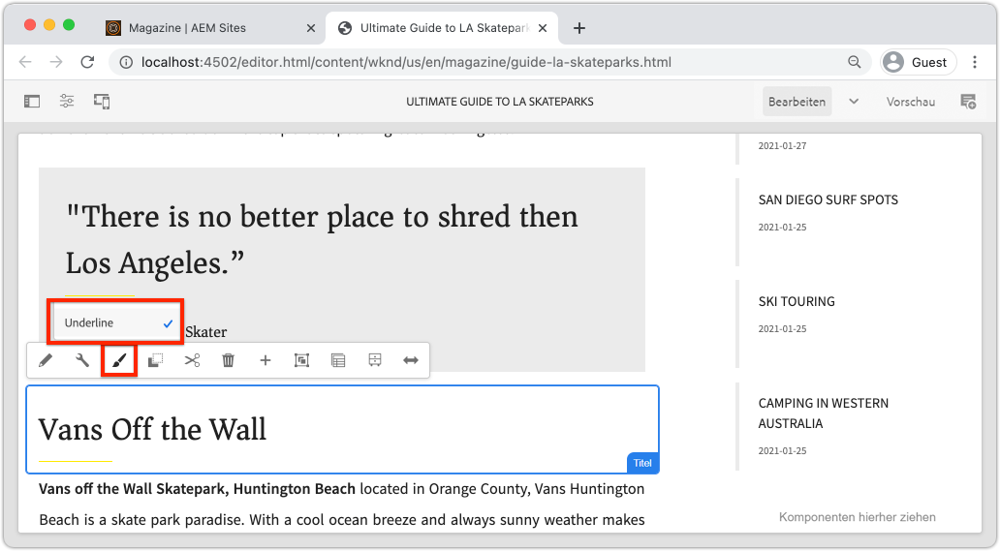

# Entwickeln mit dem Stilsystem {#developing-with-the-style-system}

Erfahren Sie, wie Sie einzelne Stile implementieren und Kernkomponenten mithilfe des Stilsystems von Experience Manager wiederverwenden. In diesem Tutorial wird die Entwicklung für das Stilsystem beschrieben, um Kernkomponenten mit markenspezifischem CSS und erweiterten Richtlinienkonfigurationen des Vorlagen-Editors zu erweitern.

## Voraussetzungen {#prerequisites}

Überprüfen Sie die erforderlichen Tools und Anweisungen zum Einrichten eines [lokale Entwicklungsumgebung](overview.md#local-dev-environment).

Außerdem wird empfohlen, die [Client-seitige Bibliotheken und Frontend-Workflow](client-side-libraries.md) Tutorial zum Verständnis der Grundlagen von Client-seitigen Bibliotheken und den verschiedenen Frontend-Tools, die in das AEM Projekt integriert sind.

### Starterprojekt

>[!NOTE]
>
> Wenn Sie das vorherige Kapitel erfolgreich abgeschlossen haben, können Sie das Projekt wiederverwenden und die Schritte zum Auschecken des Starterprojekts überspringen.

Sehen Sie sich den Basis-Code an, auf dem das Tutorial aufbaut:

1. Sehen Sie sich die `tutorial/style-system-start` Verzweigung aus [GitHub](https://github.com/adobe/aem-guides-wknd)

   ```shell
   $ cd aem-guides-wknd
   $ git checkout tutorial/style-system-start
   ```

1. Stellen Sie die Codebasis mithilfe Ihrer Maven-Kenntnisse in einer lokalen AEM-Instanz bereit:

   ```shell
   $ mvn clean install -PautoInstallSinglePackage
   ```

   >[!NOTE]
   >
   > Wenn Sie AEM 6.5 oder 6.4 verwenden, hängen Sie die `classic` Profile zu beliebigen Maven-Befehlen hinzufügen.

   ```shell
   $ mvn clean install -PautoInstallSinglePackage -Pclassic
   ```

Sie können den fertigen Code immer in [GitHub](https://github.com/adobe/aem-guides-wknd/tree/tutorial/style-system-solution) oder den Code lokal auszuchecken, indem Sie zu der Verzweigung wechseln `tutorial/style-system-solution`.

## Ziel

1. Erfahren Sie, wie Sie das Stilsystem verwenden, um markenspezifische CSS auf AEM Kernkomponenten anzuwenden.
1. Erfahren Sie mehr über die BEM-Notation und wie sie verwendet werden kann, um Stile sorgfältig zu definieren.
1. Wenden Sie erweiterte Richtlinienkonfigurationen mit bearbeitbaren Vorlagen an.

## Was Sie erstellen werden {#what-you-will-build}

In diesem Kapitel verwenden wir die [Stilsystemfunktion](https://experienceleague.adobe.com/docs/experience-manager-learn/sites/page-authoring/style-system-feature-video-use.html?lang=de) , um Varianten der **Titel** und **Text** Komponenten, die auf der Artikelseite verwendet werden.



*Für die Titelkomponente verfügbaren Stil unterstreichen*

## Hintergrund {#background}

Die [Stilsystem](https://experienceleague.adobe.com/docs/experience-manager-65/authoring/siteandpage/style-system.html) ermöglicht es Entwicklern und Vorlagen-Editoren, mehrere visuelle Varianten einer Komponente zu erstellen. Autoren können dann entscheiden, welcher Stil beim Erstellen einer Seite verwendet werden soll. Wir werden das Stilsystem im Rest des Tutorials nutzen, um mehrere einzigartige Stile zu erreichen und gleichzeitig Kernkomponenten in einem Ansatz mit geringem Code zu nutzen.

Die allgemeine Idee des Stilsystems besteht darin, dass Autoren verschiedene Stile dafür wählen können, wie eine Komponente aussehen soll. Die &quot;Stile&quot;werden durch zusätzliche CSS-Klassen unterstützt, die in das äußere div einer Komponente eingefügt werden. In den Client-Bibliotheken werden CSS-Regeln basierend auf diesen Stilklassen hinzugefügt, sodass die Komponente das Erscheinungsbild ändert.

Sie finden [Detaillierte Dokumentation zum Stilsystem finden Sie hier .](https://experienceleague.adobe.com/docs/experience-manager-cloud-service/sites/authoring/features/style-system.html?lang=de). Es gibt auch eine große [Technisches Video zum Verständnis des Stilsystems](https://experienceleague.adobe.com/docs/experience-manager-learn/sites/developing/style-system-technical-video-understand.html).

## Stil unterstreichen - Titel {#underline-style}

Die [Titelkomponente](https://experienceleague.adobe.com/docs/experience-manager-core-components/using/components/title.html) wurde in das Projekt unter `/apps/wknd/components/title` als Teil der **ui.apps** -Modul. Die Standardstile für Überschriftenelemente (`H1`, `H2`, `H3`...) bereits im **ui.frontend** -Modul.

Die [WKND-Artikelentwürfe](assets/pages-templates/wknd-article-design.xd) enthalten einen eindeutigen Stil für die Titelkomponente mit einer Unterstreichung. Anstatt zwei Komponenten zu erstellen oder das Komponentendialogfeld zu ändern, kann das Stilsystem verwendet werden, um Autoren die Möglichkeit zu geben, einen Unterstrichstil hinzuzufügen.


### Eine Titelrichtlinie hinzufügen

Fügen Sie eine neue Richtlinie für Titel -Komponenten hinzu, damit Inhaltsautoren den Unterstrichstil auswählen können, der auf bestimmte Komponenten angewendet werden soll. Dies geschieht mit dem Vorlagen-Editor in AEM.

1. Navigieren Sie zum **Artikelseite** Vorlage unter: [http://localhost:4502/editor.html/conf/wknd/settings/wcm/templates/article-page/structure.html](http://localhost:4502/editor.html/conf/wknd/settings/wcm/templates/article-page/structure.html)

1. In **Struktur** -Modus im Hauptmodus **Layout-Container**, wählen Sie die **Politik** Symbol neben **Titel** Komponente aufgeführt unter *Zugelassene Komponenten*:

   

1. Erstellen Sie eine neue Richtlinie für die Komponente Titel mit den folgenden Werten:

   *Richtlinienname **: **WKND-Titel**

   *Eigenschaften* > *Registerkarte &quot;Stile&quot;* > *Neuen Stil hinzufügen*

   **Unterstreichen** : `cmp-title--underline`

   

   Klicken **Fertig** , um die Änderungen an der Titelrichtlinie zu speichern.

   >[!NOTE]
   >
   > Der Wert `cmp-title--underline` füllt die CSS-Klasse im äußeren div des HTML-Markups der Komponente.

### Anwenden des Unterstrichstils

Als Autor wenden Sie den Unterstrichstil auf bestimmte Titelkomponenten an.

1. Navigieren Sie zum **La Skateparks** Artikel im AEM Sites-Editor unter: [http://localhost:4502/editor.html/content/wknd/us/en/magazine/guide-la-skateparks.html](http://localhost:4502/editor.html/content/wknd/us/en/magazine/guide-la-skateparks.html)
1. In **Bearbeiten** -Modus eine Titelkomponente auswählen. Klicken Sie auf **Pinsel** und wählen Sie das **Unterstreichen** style:

   

   >[!NOTE]
   >
   > An dieser Stelle erfolgt keine sichtbare Änderung, da `underline` -Stil wurde nicht implementiert. In der nächsten Übung wird dieser Stil implementiert.

1. Klicken Sie auf **Seiteninformationen** Symbol > **Als veröffentlicht anzeigen** , um die Seite außerhalb AEM Editors zu überprüfen.
1. Überprüfen Sie mithilfe der Entwicklertools Ihres Browsers, ob das Markup um die Titelkomponente über die CSS-Klasse verfügt. `cmp-title--underline` auf das äußere div angewendet.

   

   ```html
   <div class="title cmp-title--underline">
       <div data-cmp-data-layer="{&quot;title-b6450e9cab&quot;:{&quot;@type&quot;:&quot;wknd/components/title&quot;,&quot;repo:modifyDate&quot;:&quot;2022-02-23T17:34:42Z&quot;,&quot;dc:title&quot;:&quot;Vans Off the Wall Skatepark&quot;}}" 
       id="title-b6450e9cab" class="cmp-title">
           <h2 class="cmp-title__text">Vans Off the Wall Skatepark</h2>
       </div>
   </div>
   ```

### Implementieren des &quot;Underline Style&quot;- ui.frontend

Als Nächstes implementieren Sie den Stil &quot;Unterstrichen&quot;mit **ui.frontend** -Modul unseres Projekts. Wir verwenden den Webpack Development Server, der im Paket mit dem **ui.frontend** -Modul zur Vorschau der Stile *before* Bereitstellung in einer lokalen Instanz von AEM.

1. Starten Sie die `watch` -Prozess innerhalb von **ui.frontend** -Modul:

   ```shell
   $ cd ~/code/aem-guides-wknd/ui.frontend/
   $ npm run watch
   ```

   Dadurch wird ein Prozess gestartet, der Änderungen im `ui.frontend` und synchronisieren Sie die Änderungen mit der AEM-Instanz.


1. Geben Sie Ihre IDE zurück und öffnen Sie die Datei . `_title.scss` befindet sich unter: `ui.frontend/src/main/webpack/components/_title.scss`.
1. Einführung einer neuen Regel, die auf die `cmp-title--underline` -Klasse:

   ```scss
   /* Default Title Styles */
   .cmp-title {}
   .cmp-title__text {}
   .cmp-title__link {}
   
   /* Add Title Underline Style */
   .cmp-title--underline {
       .cmp-title__text {
           &:after {
           display: block;
               width: 84px;
               padding-top: 8px;
               content: '';
               border-bottom: 2px solid $brand-primary;
           }
       }
   }
   ```

   >[!NOTE]
   >
   >Es wird als Best Practice erachtet, Stile immer eng auf die Zielkomponente zu verteilen. Dadurch wird sichergestellt, dass sich zusätzliche Stile nicht auf andere Bereiche der Seite auswirken.
   >
   >Alle Kernkomponenten halten **[BEM-Notation](https://github.com/adobe/aem-core-wcm-components/wiki/css-coding-conventions)**. Es empfiehlt sich, beim Erstellen eines Standardstils für eine Komponente die äußere CSS-Klasse als Ziel festzulegen. Eine weitere Best Practice ist, Klassennamen, die von der BEM-Notation der Kernkomponente angegeben werden, anstelle von HTML-Elementen zu verwenden.

1. Kehren Sie zum Browser und zur AEM Seite zurück. Es sollte der Stil Unterstrichen hinzugefügt werden:

   

1. Im AEM-Editor sollten Sie jetzt in der Lage sein, die **Unterstreichen** und die visuell reflektierten Änderungen zu sehen.

## Anführungszeichenblock-Stil - Text {#text-component}

Wiederholen Sie als Nächstes ähnliche Schritte, um einen eindeutigen Stil auf die [Textkomponente](https://experienceleague.adobe.com/docs/experience-manager-core-components/using/components/text.html?lang=de). Die Textkomponente wurde in das Projekt unter `/apps/wknd/components/text` als Teil der **ui.apps** -Modul. Die Standardstile für Absatzelemente wurden bereits im Abschnitt **ui.frontend**.

Die [WKND-Artikelentwürfe](assets/pages-templates/wknd-article-design.xd) enthalten einen eindeutigen Stil für die Textkomponente mit einem Anführungszeichenblock:


### Eine Textrichtlinie hinzufügen

Als Nächstes fügen Sie eine neue Richtlinie für die Textkomponenten hinzu.

1. Navigieren Sie zum **Artikelseitenvorlage** befindet sich unter: [http://localhost:4502/editor.html/conf/wknd/settings/wcm/templates/article-page/structure.html](http://localhost:4502/editor.html/conf/wknd/settings/wcm/templates/article-page/structure.html).

1. In **Struktur** -Modus im Hauptmodus **Layout-Container**, wählen Sie die **Politik** Symbol neben **Text** Komponente aufgeführt unter *Zugelassene Komponenten*:

   

1. Aktualisieren Sie die Textkomponentenrichtlinie mit den folgenden Werten:

   *Richtlinienname **: **Inhaltstext**

   *Plugins* > *Absatzformate* > *Absatzstile aktivieren*

   *Registerkarte &quot;Stile&quot;* > *Neuen Stil hinzufügen*

   **Anführungsblock** : `cmp-text--quote`

   

   

   Klicken **Fertig** , um die Änderungen an der Textrichtlinie zu speichern.

### Anwenden des Anführungszeichenblock-Stils

1. Navigieren Sie zum **La Skateparks** Artikel im AEM Sites-Editor unter: [http://localhost:4502/editor.html/content/wknd/us/en/magazine/guide-la-skateparks.html](http://localhost:4502/editor.html/content/wknd/us/en/magazine/guide-la-skateparks.html)
1. In **Bearbeiten** -Modus eine Textkomponente auswählen. Bearbeiten Sie die Komponente, um ein Anführungszeichenelement einzuschließen:

   

1. Wählen Sie die Textkomponente aus und klicken Sie auf die **Pinsel** und wählen Sie das **Anführungsblock** style:

   

1. Verwenden Sie die Entwicklertools des Browsers, um das Markup zu überprüfen. Sie sollten den Klassennamen sehen `cmp-text--quote` wurde zum äußeren Div der Komponente hinzugefügt:

   ```html
   <!-- Quote Block style class added -->
   <div class="text cmp-text--quote">
       <div data-cmp-data-layer="{&quot;text-60910f4b8d&quot;:{&quot;@type&quot;:&quot;wknd/components/text&quot;,&quot;repo:modifyDate&quot;:&quot;2022-02-24T00:55:26Z&quot;,&quot;xdm:text&quot;:&quot;<blockquote>&amp;nbsp; &amp;nbsp; &amp;nbsp;&amp;quot;There is no better place to shred then Los Angeles&amp;quot;</blockquote>\r\n<p>- Jacob Wester, Pro Skater</p>\r\n&quot;}}" id="text-60910f4b8d" class="cmp-text">
           <blockquote>&nbsp; &nbsp; &nbsp;"There is no better place to shred then Los Angeles"</blockquote>
           <p>- Jacob Wester, Pro Skater</p>
       </div>
   </div>
   ```

### Implementieren des Anführungszeichenblock-Stils - ui.frontend

Als Nächstes implementieren wir den Stil des Anführungszeichens mit der **ui.frontend** -Modul unseres Projekts.

1. Wenn sie noch nicht ausgeführt wird, starten Sie die `watch` -Prozess innerhalb von **ui.frontend** -Modul:

   ```shell
   $ npm run watch
   ```

1. Datei aktualisieren `text.scss` befindet sich unter: `ui.frontend/src/main/webpack/components/_text.scss`:

   ```css
   /* Default text style */
   .cmp-text {}
   .cmp-text__paragraph {}
   
   /* WKND Text Quote style */
   .cmp-text--quote {
       .cmp-text {
           background-color: $brand-third;
           margin: 1em 0em;
           padding: 1em;
   
           blockquote {
               border: none;
               font-size: $font-size-large;
               font-family: $font-family-serif;
               padding: 14px 14px;
               margin: 0;
               margin-bottom: 0.5em;
   
               &:after {
                   border-bottom: 2px solid $brand-primary; /*yellow border */
                   content: '';
                   display: block;
                   position: relative;
                   top: 0.25em;
                   width: 80px;
               }
           }
           p {
               font-family:  $font-family-serif;
           }
       }
   }
   ```

   >[!CAUTION]
   >
   > In diesem Fall werden Roh-HTML-Elemente von den Stilen angesprochen. Dies liegt daran, dass die Textkomponente einen Rich-Text-Editor für Inhaltsautoren bereitstellt. Die Erstellung von Stilen direkt mit RTE-Inhalten sollte mit Vorsicht erfolgen, und es ist umso wichtiger, die Stile genauer zu definieren.

1. Kehren Sie erneut zum Browser zurück und Sie sollten sehen, wie der Stil des Anführungsblocks hinzugefügt wurde:

   

1. Beenden Sie den Webpack Development Server.

## Feste Breite - Container (Bonus) {#layout-container}

Container-Komponenten wurden verwendet, um die grundlegende Struktur der Artikelseitenvorlage zu erstellen und die Ablageflächen bereitzustellen, damit Inhaltsautoren Inhalte auf einer Seite hinzufügen können. Container können auch das Stilsystem nutzen und Autoren von Inhalten noch mehr Optionen zum Entwerfen von Layouts bieten.

Die **Hauptbehälter** der Vorlage &quot;Artikelseite&quot;enthält die beiden Container, die Authoring-fähig sind, und hat eine feste Breite.


*Hauptbehälter in der Artikelseitenvorlage*.

Die Politik der **Hauptbehälter** setzt das Standardelement auf `main`:


Die CSS, die die **Hauptbehälter** festgelegt ist, wird in **ui.frontend** -Modul an `ui.frontend/src/main/webpack/site/styles/container_main.scss` :

```SCSS
main.container {
    padding: .5em 1em;
    max-width: $max-content-width;
    float: unset!important;
    margin: 0 auto!important;
    clear: both!important;
}
```

Anstatt die `main` HTML-Element verwenden, kann das Stilsystem zum Erstellen eines **Feste Breite** -Stil als Teil der Container-Richtlinie. Das Stilsystem bietet Benutzern die Möglichkeit, zwischen **Feste Breite** und **Fließbreite** Container.

1. **Bonusaufgabe** - Nutzung der Erfahrungen aus früheren Übungen und Verwendung des Stilsystems zur Implementierung einer **Feste Breite** und **Fließbreite** Stile für die Container-Komponente.

## Herzlichen Glückwunsch! {#congratulations}

Herzlichen Glückwunsch! Die Artikelseite ist fast vollständig formatiert und Sie haben praktische Erfahrungen mit dem AEM Stilsystem gesammelt.

### Nächste Schritte {#next-steps}

Hier erfahren Sie, wie Sie eine [benutzerdefinierte AEM](custom-component.md) , der Inhalte anzeigt, die in einem Dialogfeld erstellt wurden, und die Entwicklung eines Sling-Modells untersucht, um die Geschäftslogik einzukapseln, die die HTL der Komponente füllt.

Anzeigen des fertigen Codes unter [GitHub](https://github.com/adobe/aem-guides-wknd) oder den Code lokal in der Git-Klammer überprüfen und bereitstellen `tutorial/style-system-solution`.

1. Klonen Sie die [github.com/adobe/aem-wknd-guides](https://github.com/adobe/aem-guides-wknd) Repository.
1. Sehen Sie sich die `tutorial/style-system-solution` -Verzweigung.
