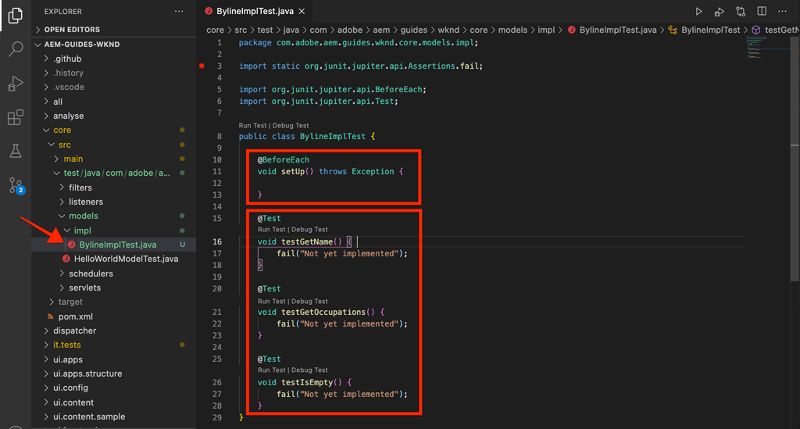

# Unit-Tests {#unit-testing}

Dieses Tutorial behandelt die Implementierung eines Komponententests, der das Verhalten des Sling-Modells der Byline-Komponente überprüft, das im [Benutzerdefinierte Komponente](./custom-component.md) Tutorial.

## Voraussetzungen {#prerequisites}

Überprüfen Sie die erforderlichen Tools und Anweisungen zum Einrichten eines [lokale Entwicklungsumgebung](overview.md#local-dev-environment).

_Wenn sowohl Java 8 als auch Java 11 auf dem System installiert sind, kann der VS-Code-Test-Runner beim Ausführen der Tests die niedrigere Java-Laufzeit auswählen, was zu Testfehlern führt. Wenn dies der Fall ist, deinstallieren Sie Java 8._

### Starterprojekt

>[!NOTE]
>
> Wenn Sie das vorherige Kapitel erfolgreich abgeschlossen haben, können Sie das Projekt wiederverwenden und die Schritte zum Auschecken des Starterprojekts überspringen.

Sehen Sie sich den Basis-Code an, auf dem das Tutorial aufbaut:

1. Sehen Sie sich die `tutorial/unit-testing-start` Verzweigung aus [GitHub](https://github.com/adobe/aem-guides-wknd)

   ```shell
   $ cd aem-guides-wknd
   $ git checkout tutorial/unit-testing-start
   ```

1. Stellen Sie die Codebasis mithilfe Ihrer Maven-Kenntnisse in einer lokalen AEM-Instanz bereit:

   ```shell
   $ mvn clean install -PautoInstallSinglePackage
   ```

   >[!NOTE]
   >
   > Wenn Sie AEM 6.5 oder 6.4 verwenden, hängen Sie die `classic` Profile zu beliebigen Maven-Befehlen hinzufügen.

   ```shell
   $ mvn clean install -PautoInstallSinglePackage -Pclassic
   ```

Sie können den fertigen Code immer in [GitHub](https://github.com/adobe/aem-guides-wknd/tree/tutorial/unit-testing-start) oder den Code lokal auszuchecken, indem Sie zu der Verzweigung wechseln `tutorial/unit-testing-start`.

## Ziel

1. Machen Sie sich mit den Grundlagen von Komponententests vertraut.
1. Erfahren Sie mehr über Frameworks und Tools, die häufig zum Testen AEM Codes verwendet werden.
1. Verstehen Sie Optionen zum Mocken oder Simulieren AEM Ressourcen beim Schreiben von Komponententests.

## Hintergrund {#unit-testing-background}

In diesem Tutorial erfahren wir, wie Sie [Unit-Tests](https://en.wikipedia.org/wiki/Unit_testing) für die [Sling-Modell](https://sling.apache.org/documentation/bundles/models.html) (erstellt in der [Erstellen einer benutzerdefinierten AEM-Komponente](custom-component.md)). Unit-Tests sind in Java geschriebene Build-Time-Tests, die das erwartete Verhalten von Java-Code überprüfen. Jeder Komponententest ist in der Regel klein und validiert die Ausgabe einer Methode (oder von Einheiten) anhand der erwarteten Ergebnisse.

Wir setzen AEM Best Practices ein und setzen Folgendes ein:

* [JUnit 5](https://junit.org/junit5/)
* [Mockito Testing Framework](https://site.mockito.org/)
* [wcm.io Test Framework](https://wcm.io/testing/) (aufbaut auf [Apache Sling Mocks](https://sling.apache.org/documentation/development/sling-mock.html))

## Unit-Tests und Adobe Cloud Manager {#unit-testing-and-adobe-cloud-manager}

[Adobe Cloud Manager](https://experienceleague.adobe.com/docs/experience-manager-cloud-manager/using/introduction-to-cloud-manager.html?lang=de) integriert die Ausführung von Komponententests und [CodereBerichte](https://experienceleague.adobe.com/docs/experience-manager-cloud-manager/using/how-to-use/understand-your-test-results.html#code-quality-testing) in die CI/CD-Pipeline zu integrieren, um die Best Practice für Unit-Tests AEM Code zu fördern.

Obwohl Einheitentestcode für jede Codebasis eine gute Vorgehensweise ist, ist es bei der Verwendung von Cloud Manager wichtig, die Codequalitätstests und -berichte zu nutzen, indem für Cloud Manager Komponententests bereitgestellt werden.

## Aktualisieren der Maven-Testabhängigkeiten {#inspect-the-test-maven-dependencies}

Der erste Schritt besteht darin, Maven-Abhängigkeiten zu untersuchen, um das Schreiben und Ausführen der Tests zu unterstützen. Es sind vier Abhängigkeiten erforderlich:

1. JUnit5
1. Mockito Test Framework
1. Apache Sling Mocks
1. AEM Mocks Test Framework (by io.wcm)

Die **JUnit5**, **Mockito** und **AEM** Testabhängigkeiten werden während der Einrichtung automatisch zum Projekt hinzugefügt, indem die [AEM Maven-Archetyp](project-setup.md).

1. Um diese Abhängigkeiten anzuzeigen, öffnen Sie den übergeordneten Reactor-POM unter **aem-guides-wknd/pom.xml**, navigieren Sie zum `<dependencies>..</dependencies>` und zeigen Sie die Abhängigkeiten für JUnit, Mockito, Apache Sling Mocks und AEM Mock-Tests von io.wcm unter `<!-- Testing -->`.
1. Stellen Sie sicher, dass `io.wcm.testing.aem-mock.junit5` auf **4.1.0**:

   ```xml
   <dependency>
       <groupId>io.wcm</groupId>
       <artifactId>io.wcm.testing.aem-mock.junit5</artifactId>
       <version>4.1.0</version>
       <scope>test</scope>
   </dependency>
   ```

   >[!CAUTION]
   >
   > Archetyp **35** generiert das Projekt mit `io.wcm.testing.aem-mock.junit5` version **4.1.8**. Bitte downloaden Sie **4.1.0** um dem Rest dieses Kapitels zu folgen.

1. Öffnen **aem-guides-wknd/core/pom.xml** und sehen Sie, dass die entsprechenden Testabhängigkeiten verfügbar sind.

   Ein paralleler Quellordner im **core** Das Projekt enthält die Komponententests und alle unterstützenden Testdateien. Diese **test** -Ordner ermöglicht die Trennung von Testklassen vom Quellcode, ermöglicht es jedoch, dass die Tests so funktionieren, als ob sie in denselben Paketen wie der Quellcode leben.

## Erstellen des JUnit-Tests {#creating-the-junit-test}

Unit-Tests ordnen in der Regel 1-zu-1 Java-Klassen zu. In diesem Kapitel schreiben wir einen JUnit-Test für die **BylineImpl.java**: das Sling-Modell, das die Byline-Komponente unterstützt.


*Speicherort, an dem Unit-Tests gespeichert werden.*

1. Erstellen Sie einen Komponententest für die `BylineImpl.java` , indem Sie eine neue Java-Klasse unter `src/test/java` in einer Java-Paketordnerstruktur, die den Speicherort der zu testenden Java-Klasse widerspiegelt.

   

   Da wir testen

   * `src/main/java/com/adobe/aem/guides/wknd/core/models/impl/BylineImpl.java`

   Erstellen einer entsprechenden Komponententest-Java-Klasse unter

   * `src/test/java/com/adobe/aem/guides/wknd/core/models/impl/BylineImplTest.java`

   Die `Test` Suffix in der Testdatei der Einheit, `BylineImplTest.java` ist eine Konvention, die es uns ermöglicht,

   1. Einfache Identifizierung als Testdatei _für_ `BylineImpl.java`
   1. Unterscheiden Sie aber auch die Testdatei. _von_ die zu prüfende Klasse, `BylineImpl.java`


## Überprüfen von BylineImplTest.java {#reviewing-bylineimpltest-java}

Zu diesem Zeitpunkt ist die JUnit-Testdatei eine leere Java-Klasse.

1. Aktualisieren Sie die Datei mit dem folgenden Code:

   ```java
   package com.adobe.aem.guides.wknd.core.models.impl;
   
   import static org.junit.jupiter.api.Assertions.*;
   
   import org.junit.jupiter.api.BeforeEach;
   import org.junit.jupiter.api.Test;
   
   public class BylineImplTest {
   
       @BeforeEach
       void setUp() throws Exception {
   
       }
   
       @Test 
       void testGetName() { 
           fail("Not yet implemented");
       }
   
       @Test 
       void testGetOccupations() { 
           fail("Not yet implemented");
       }
   
       @Test 
       void testIsEmpty() { 
           fail("Not yet implemented");
       }
   }
   ```

1. Die erste Methode `public void setUp() { .. }` mit Anmerkungen in JUnit `@BeforeEach`, der den JUnit-Test-Runner anweist, diese Methode auszuführen, bevor jede Testmethode in dieser Klasse ausgeführt wird. Dies bietet einen praktischen Ort zum Initialisieren des allgemeinen Teststatus, der für alle Tests erforderlich ist.

1. Die folgenden Methoden sind die Testmethoden, deren Namen mit dem Präfix `test` nach Konvention und mit dem `@Test` -Anmerkung. Beachten Sie, dass alle unsere Tests standardmäßig fehlschlagen, da wir sie noch nicht implementiert haben.

   Zunächst beginnen wir mit einer einzelnen Testmethode für jede öffentliche Methode in der Klasse, die wir testen, also:

   | BylineImpl.java |  | BylineImplTest.java |
   | ------------------|--------------|---------------------|
   | getName() | wird von | testGetName() |
   | getOccupations() | wird von | testGetOccupations() |
   | isEmpty() | wird von | testIsEmpty() |

   Diese Methoden können bei Bedarf erweitert werden, wie wir später in diesem Kapitel sehen werden.

   Wenn diese JUnit-Testklasse (auch als JUnit-Testfall bezeichnet) ausgeführt wird, wird jede Methode mit dem `@Test` wird als Test ausgeführt, der entweder bestehen oder fehlschlagen kann.



*`core/src/test/java/com/adobe/aem/guides/wknd/core/models/impl/BylineImplTest.java`*

1. Führen Sie den JUnit-Testfall aus, indem Sie mit der rechten Maustaste auf die `BylineImplTest.java` Datei und Tippen **Ausführen**.
Wie erwartet schlagen alle Tests fehl, da sie noch nicht implementiert wurden.

   

   *Rechtsklicken Sie auf BylineImplTests.java > Ausführen*

## Überprüfen von BylineImpl.java {#reviewing-bylineimpl-java}

Beim Schreiben von Komponententests gibt es zwei Hauptansätze:

* [TDD- oder Test-gesteuerte Entwicklung](https://en.wikipedia.org/wiki/Test-driven_development), was bedeutet, die Unit-Tests schrittweise zu schreiben, unmittelbar vor der Entwicklung der Implementierung; einen Test schreiben, schreiben Sie die Implementierung, um den Test zu bestehen.
* Implementierung erste Entwicklung, die die Entwicklung von Arbeitscode zuerst und dann das Schreiben von Tests zur Validierung des Codes umfasst.

In diesem Tutorial wird der letztgenannte Ansatz verwendet (da wir bereits eine funktionierende **BylineImpl.java** in einem vorherigen Kapitel). Aus diesem Grund müssen wir das Verhalten der öffentlichen Methoden überprüfen und verstehen, aber auch einige der Implementierungsdetails. Dies mag im Gegenteil klingen, da sich ein guter Test nur um die Ein- und Ausgänge kümmern sollte, aber bei AEM gibt es eine Reihe von Implementierungserwägungen, die für die Erstellung von Funktionstests zu verstehen sind.

TDD im Kontext von AEM erfordert ein hohes Maß an Fachwissen und wird am besten von AEM Entwicklern übernommen, die über AEM Entwicklung und Unit-Tests von AEM Code verfügen.

## Einrichten AEM Testkontexts  {#setting-up-aem-test-context}

Der Großteil des für AEM geschriebenen Codes beruht auf JCR-, Sling- oder AEM-APIs, die wiederum erfordern, dass der Kontext einer ausgeführten AEM ordnungsgemäß ausgeführt wird.

Da Komponententests beim Build ausgeführt werden, gibt es außerhalb des Kontexts einer laufenden AEM-Instanz keinen solchen Kontext. Um dies zu erleichtern, [wcm.io&#39;s AEM Mocks](https://wcm.io/testing/aem-mock/usage.html) erstellt einen nachgeahmten Kontext, der es diesen APIs ermöglicht, _meist_ als ob sie in AEM laufen.

1. Erstellen Sie einen AEM Kontext mit **wcm.io&#39;s** `AemContext` in **BylineImplTest.java** durch Hinzufügen als JUnit-Erweiterung, die mit `@ExtendWith` der **BylineImplTest.java** -Datei. Die Erweiterung übernimmt alle erforderlichen Initialisierungs- und Bereinigungsaufgaben. Erstellen Sie eine Klassenvariable für `AemContext` die für alle Testmethoden verwendet werden können.

   ```java
   import org.junit.jupiter.api.extension.ExtendWith;
   import io.wcm.testing.mock.aem.junit5.AemContext;
   import io.wcm.testing.mock.aem.junit5.AemContextExtension;
   ...
   
   @ExtendWith(AemContextExtension.class)
   class BylineImplTest {
   
       private final AemContext ctx = new AemContext();
   ```

   Diese Variable, `ctx`, stellt einen nachgeahmten AEM-Kontext bereit, der eine Reihe von AEM und Sling-Abstraktionen bietet:

   * Das BylineImpl Sling-Modell wird in diesem Kontext registriert
   * In diesem Kontext werden JCR-Inhaltsstrukturen nachahmen erstellt.
   * Benutzerdefinierte OSGi-Dienste können in diesem Kontext registriert werden.
   * Bietet eine Vielzahl gängiger erforderlicher Modellobjekte und Helfer wie SlingHttpServletRequest-Objekte, eine Vielzahl von nachgeahmten Sling- und AEM OSGi-Services wie ModelFactory, PageManager, Page, Template, ComponentManager, Component, TagManager, Tag usw.
      * *Beachten Sie, dass nicht alle Methoden für diese Objekte implementiert sind!*
   * und [viel mehr](https://wcm.io/testing/aem-mock/usage.html)!

   Die **`ctx`** -Objekt dient als Einstiegspunkt für den Großteil unseres nachgeahmten Kontexts.

1. Im `setUp(..)` -Methode, die vor jedem `@Test` -Methode einen gemeinsamen Tracking-Teststatus definieren:

   ```java
   @BeforeEach
   public void setUp() throws Exception {
       ctx.addModelsForClasses(BylineImpl.class);
       ctx.load().json("/com/adobe/aem/guides/wknd/core/models/impl/BylineImplTest.json", "/content");
   }
   ```

   * **`addModelsForClasses`** registriert das zu testende Sling-Modell im nachgeahmten AEM Kontext, damit es im `@Test` -Methoden.
   * **`load().json`** lädt Ressourcenstrukturen in den nachgeahmten Kontext, sodass der Code mit diesen Ressourcen interagieren kann, als ob sie von einem echten Repository bereitgestellt würden. Die Ressourcendefinitionen in der Datei **`BylineImplTest.json`** werden in den JCR-Kontext nachahmen unter geladen. **/content**.
   * **`BylineImplTest.json`** noch nicht vorhanden ist, also erstellen wir sie und definieren die JCR-Ressourcenstrukturen, die für den Test benötigt werden.

1. Die JSON-Dateien, die die nachgeahmten Ressourcenstrukturen darstellen, werden unter **core/src/test/resources** nach demselben Paketpfad wie die JUnit Java-Testdatei folgen.

   Erstellen Sie eine neue JSON-Datei unter `core/test/resources/com/adobe/aem/guides/wknd/core/models/impl` benannt **BylineImplTest.json** mit folgendem Inhalt:

   ```json
   {
       "byline": {
       "jcr:primaryType": "nt:unstructured",
       "sling:resourceType": "wknd/components/content/byline"
       }
   }
   ```

   

   Diese JSON definiert eine nachgeahmte Ressource (JCR-Knoten) für den Byline-Komponententest. An dieser Stelle verfügt die JSON über den Mindestsatz von Eigenschaften, die erforderlich sind, um eine Inhaltsressource für die Byline-Komponente darzustellen, die `jcr:primaryType` und `sling:resourceType`.

   Eine allgemeine Regel beim Arbeiten mit Komponententests besteht darin, den Mindestsatz an nachgeahmten Inhalten, Kontext und Code zu erstellen, der für die Erfüllung jedes Tests erforderlich ist. Vermeiden Sie die Versuchung, vor dem Schreiben der Tests einen vollständigen Tracking-Kontext zu erstellen, da dies häufig zu unnötigen Artefakten führt.

   Jetzt mit der Existenz von **BylineImplTest.json**, wenn `ctx.json("/com/adobe/aem/guides/wknd/core/models/impl/BylineImplTest.json", "/content")` ausgeführt wird, werden die nachgeahmten Ressourcendefinitionen in den Kontext am Pfad geladen **/content.**

## Testen von getName() {#testing-get-name}

Nachdem wir nun ein grundlegendes Tracking-Kontext-Setup haben, schreiben wir unseren ersten Test für **getName() von BylineImpl**. Diese Prüfung muss sicherstellen, dass die Methode **getName()** gibt den richtigen verfassten Namen zurück, der im Ordner &quot;**name&quot;** -Eigenschaft.

1. Aktualisieren Sie die **testGetName**() Methode in **BylineImplTest.java** wie folgt:

   ```java
   import com.adobe.aem.guides.wknd.core.models.Byline;
   ...
   @Test
   public void testGetName() {
       final String expected = "Jane Doe";
   
       ctx.currentResource("/content/byline");
       Byline byline = ctx.request().adaptTo(Byline.class);
   
       String actual = byline.getName();
   
       assertEquals(expected, actual);
   }
   ```

   * **`String expected`** legt den erwarteten Wert fest. Wir setzen dies auf &quot;**Jane Fertig**&quot;.
   * **`ctx.currentResource`** legt den Kontext der nachgeahmten Ressource fest, mit der der Code ausgewertet werden soll, sodass dieser auf **/content/byline** da dort die nachgeahmte Inhaltsressource geladen wird.
   * **`Byline byline`** instanziiert das Byline Sling-Modell, indem es vom mock Request -Objekt angepasst wird.
   * **`String actual`** ruft die Methode auf, die wir testen, `getName()`, im Byline Sling Model -Objekt.
   * **`assertEquals`** bestätigt, dass der erwartete Wert mit dem vom byline-Sling-Modellobjekt zurückgegebenen Wert übereinstimmt. Wenn diese Werte nicht gleich sind, schlägt der Test fehl.

1. Führen Sie den Test aus.. und er schlägt mit einer `NullPointerException`.

   Beachten Sie, dass dieser Test NICHT fehlschlägt, da wir nie eine `name` -Eigenschaft in der JSON-nachahmen -Datei verwenden, was dazu führt, dass der Test fehlschlägt, die Testausführung jedoch nicht auf diesen Punkt gelangt ist! Dieser Test schlägt aufgrund eines `NullPointerException` im Byline-Objekt selbst.

1. Im `BylineImpl.java`, wenn `@PostConstruct init()` gibt eine Ausnahme aus, die verhindert, dass das Sling-Modell instanziiert wird, und bewirkt, dass dieses Sling-Modell-Objekt null ist.

   ```java
   @PostConstruct
   private void init() {
       image = modelFactory.getModelFromWrappedRequest(request, request.getResource(), Image.class);
   }
   ```

   Es stellt sich heraus, dass der ModelFactory-OSGi-Dienst zwar über die `AemContext` (über den Apache Sling-Kontext) werden nicht alle Methoden implementiert, einschließlich `getModelFromWrappedRequest(...)` , der in der BylineImpl-Variablen `init()` -Methode. Dies führt zu einer [AbstractMethodError](https://docs.oracle.com/en/java/javase/11/docs/api/java.base/java/lang/AbstractMethodError.html), die `init()` fehlschlagen und die daraus resultierende Anpassung der `ctx.request().adaptTo(Byline.class)` ist ein Null-Objekt.

   Da die bereitgestellten Mocks unseren Code nicht aufnehmen können, müssen wir den nachgeahmten Kontext selbst implementieren. Dazu können wir Mockito verwenden, um ein Modell-Factory-Objekt zu erstellen, das ein nachgeahmtes Bildobjekt zurückgibt, wenn `getModelFromWrappedRequest(...)` aufgerufen wird.

   Da dieser nachgeahmte Kontext auch vorhanden sein muss, um das Byline Sling-Modell instanziieren zu können, können wir ihn zum `@Before setUp()` -Methode. Wir müssen auch die `MockitoExtension.class` der `@ExtendWith` -Anmerkung über **BylineImplTest** -Klasse.

   ```java
   package com.adobe.aem.guides.wknd.core.models.impl;
   
   import org.mockito.junit.jupiter.MockitoExtension;
   import org.mockito.Mock;
   
   import com.adobe.aem.guides.wknd.core.models.Byline;
   import com.adobe.cq.wcm.core.components.models.Image;
   
   import io.wcm.testing.mock.aem.junit5.AemContext;
   import io.wcm.testing.mock.aem.junit5.AemContextExtension;
   
   import org.apache.sling.models.factory.ModelFactory;
   import org.junit.jupiter.api.BeforeEach;
   import org.junit.jupiter.api.Test;
   import org.junit.jupiter.api.extension.ExtendWith;
   
   import static org.junit.jupiter.api.Assertions.*;
   import static org.mockito.Mockito.*;
   import org.apache.sling.api.resource.Resource;
   
   @ExtendWith({ AemContextExtension.class, MockitoExtension.class })
   public class BylineImplTest {
   
       private final AemContext ctx = new AemContext();
   
       @Mock
       private Image image;
   
       @Mock
       private ModelFactory modelFactory;
   
       @BeforeEach
       public void setUp() throws Exception {
           ctx.addModelsForClasses(BylineImpl.class);
   
           ctx.load().json("/com/adobe/aem/guides/wknd/core/models/impl/BylineImplTest.json", "/content");
   
           lenient().when(modelFactory.getModelFromWrappedRequest(eq(ctx.request()), any(Resource.class), eq(Image.class)))
                   .thenReturn(image);
   
           ctx.registerService(ModelFactory.class, modelFactory, org.osgi.framework.Constants.SERVICE_RANKING,
                   Integer.MAX_VALUE);
       }
   
       @Test
       void testGetName() { ...
   }
   ```

   * **`@ExtendWith({AemContextExtension.class, MockitoExtension.class})`** markiert die Testfallklasse, die mit der [Mockito JUnit Jupiter-Erweiterung](https://www.javadoc.io/page/org.mockito/mockito-junit-jupiter/latest/org/mockito/junit/jupiter/MockitoExtension.html) ermöglicht die Verwendung der @Mock-Anmerkungen zum Definieren von nachgeahmten Objekten auf Klassenebene.
   * **`@Mock private Image`** erstellt ein nachgeahmtes Objekt vom Typ `com.adobe.cq.wcm.core.components.models.Image`. Beachten Sie, dass dies auf Klassenebene definiert ist, sodass bei Bedarf `@Test` -Methoden können das Verhalten nach Bedarf ändern.
   * **`@Mock private ModelFactory`** erstellt ein nachgeahmtes Objekt vom Typ ModelFactory. Beachten Sie, dass dies ein reines Mockito-Modell ist und keine Methoden implementiert hat. Beachten Sie, dass dies auf Klassenebene definiert ist, sodass bei Bedarf `@Test`-Methoden können das Verhalten nach Bedarf ändern.
   * **`when(modelFactory.getModelFromWrappedRequest(..)`** registriert Tracking-Verhalten für wann `getModelFromWrappedRequest(..)` wird auf dem ModelFactory -Objekt nachgeahmt. Das in `thenReturn (..)` gibt das nachgeahmte Bildobjekt zurück. Beachten Sie, dass dieses Verhalten nur aufgerufen wird, wenn: Der erste Parameter entspricht dem `ctx`das -Anfrageobjekt, der zweite Parameter ist ein beliebiges Resource -Objekt und der dritte Parameter muss die Image-Klasse der Kernkomponenten sein. Wir akzeptieren jede Ressource, da wir bei unseren Tests die `ctx.currentResource(...)` zu verschiedenen nachgeahmten Ressourcen, die im Abschnitt **BylineImplTest.json**. Beachten Sie, dass wir die **lenient()** striktheit, da wir dieses Verhalten der ModelFactory später überschreiben wollen.
   * **`ctx.registerService(..)`.** registriert das ModelFactory -Objekt in AEMContext mit dem höchsten Service-Rang. Dies ist erforderlich, da die ModelFactory in der BylineImpl-Variablen `init()` wird über die `@OSGiService ModelFactory model` -Feld. Für die Injektion von AEMContext **our** Nachahmenobjekt, das Aufrufe von `getModelFromWrappedRequest(..)`, müssen wir ihn als den höchsten Rangdienst dieses Typs (ModelFactory) registrieren.

1. Führen Sie den Test erneut aus, und es schlägt erneut fehl, aber diesmal ist die Nachricht klar, warum sie fehlgeschlagen ist.

   

   *testGetName()-Fehler aufgrund von Assertion*

   Wir erhalten eine **AssertionError** was bedeutet, dass die assert-Bedingung im Test fehlgeschlagen ist, und uns die **erwarteter Wert &quot;Jane Doe&quot;** aber die **Istwert ist null**. Dies ist sinnvoll, da &quot;**name&quot;** -Eigenschaft wurde nicht zur Nachahmung hinzugefügt **/content/byline** Ressourcendefinition in **BylineImplTest.json**, also fügen wir es hinzu:

1. Aktualisieren **BylineImplTest.json** zu definieren `"name": "Jane Doe".`

   ```json
   {
       "byline": {
       "jcr:primaryType": "nt:unstructured",
       "sling:resourceType": "wknd/components/content/byline",
       "name": "Jane Doe"
       }
   }
   ```

1. Führen Sie den Test erneut aus und **`testGetName()`** jetzt geht&#39;s los!

   


## Testen von getOccupations() {#testing-get-occupations}

Ok großartig! Unser erster Test ist bestanden! Fahren wir fort und testen wir `getOccupations()`. Da die Initialisierung des nachgeahmten Kontexts im `@Before setUp()`-Methode verwenden, ist dies für alle `@Test` -Methoden in diesem Testfall, einschließlich `getOccupations()`.

Denken Sie daran, dass diese Methode eine alphabetisch sortierte Liste der Berufe (absteigend) zurückgeben muss, die in der Eigenschaft &quot;Berufe&quot;gespeichert sind.

1. Aktualisieren **`testGetOccupations()`** wie folgt:

   ```java
   import java.util.List;
   import com.google.common.collect.ImmutableList;
   ...
   @Test
   public void testGetOccupations() {
       List<String> expected = new ImmutableList.Builder<String>()
                               .add("Blogger")
                               .add("Photographer")
                               .add("YouTuber")
                               .build();
   
       ctx.currentResource("/content/byline");
       Byline byline = ctx.request().adaptTo(Byline.class);
   
       List<String> actual = byline.getOccupations();
   
       assertEquals(expected, actual);
   }
   ```

   * **`List<String> expected`** das erwartete Ergebnis festlegen.
   * **`ctx.currentResource`** legt die aktuelle Ressource fest, um den Kontext mit der Definition der nachgeahmten Ressource unter /content/byline zu vergleichen. Dadurch wird sichergestellt, dass **BylineImpl.java** wird im Kontext unserer nachgeahmten Ressource ausgeführt.
   * **`ctx.request().adaptTo(Byline.class)`** instanziiert das Byline Sling-Modell, indem es vom mock Request -Objekt angepasst wird.
   * **`byline.getOccupations()`** ruft die Methode auf, die wir testen, `getOccupations()`, im Byline Sling Model -Objekt.
   * **`assertEquals(expected, actual)`** bestätigt, dass die erwartete Liste mit der tatsächlichen Liste übereinstimmt.

1. Denken Sie daran, genau wie **`getName()`** über **BylineImplTest.json** definiert keine Berufe, sodass dieser Test fehlschlägt, wenn wir ihn durchführen, da `byline.getOccupations()` gibt eine leere Liste zurück.

   Aktualisieren **BylineImplTest.json** um eine Liste der Berufe aufzunehmen, und sie sind in nicht alphabetischer Reihenfolge festgelegt, um sicherzustellen, dass unsere Tests bestätigen, dass die Berufe alphabetisch nach **`getOccupations()`**.

   ```json
   {
       "byline": {
       "jcr:primaryType": "nt:unstructured",
       "sling:resourceType": "wknd/components/content/byline",
       "name": "Jane Doe",
       "occupations": ["Photographer", "Blogger", "YouTuber"]
       }
   }
   ```

1. Führen Sie den Test aus, und wieder bestehen wir! Sieht aus, als ob die sortierten Berufe funktionieren!

   

   *testGetOccupations() durchläuft*

## Testen von isEmpty() {#testing-is-empty}

Die letzte zu testende Methode **`isEmpty()`**.

Test `isEmpty()` ist interessant, da es Tests für eine Vielzahl von Bedingungen erfordert. Überprüfen **BylineImpl.java** s `isEmpty()` -Methode die folgenden Bedingungen müssen getestet werden:

* Gibt &quot;true&quot;zurück, wenn der Name leer ist
* Rückgabe &quot;true&quot;, wenn Berufe null oder leer sind
* Gibt &quot;true&quot;zurück, wenn das Bild null ist oder keine src-URL aufweist
* &quot;false&quot;zurückgeben, wenn Name, Beruf und Bild (mit einer src-URL) vorhanden sind

Dazu müssen wir neue Testmethoden erstellen, die jeweils eine bestimmte Bedingung testen sowie neue nachgeahmte Ressourcenstrukturen in `BylineImplTest.json` , um diese Tests durchzuführen.

Beachten Sie, dass wir mit dieser Prüfung Tests überspringen konnten, wann `getName()`, `getOccupations()` und `getImage()` leer sind, da das erwartete Verhalten dieses Status über getestet wird. `isEmpty()`.

1. Beim ersten Test wird die Bedingung einer brandneuen Komponente getestet, für die keine Eigenschaften festgelegt sind.

   Hinzufügen einer neuen Ressourcendefinition zu `BylineImplTest.json`, wobei ihm der semantische Name &quot;**leer**&quot;

   ```json
   {
       "byline": {
           "jcr:primaryType": "nt:unstructured",
           "sling:resourceType": "wknd/components/content/byline",
           "name": "Jane Doe",
           "occupations": ["Photographer", "Blogger", "YouTuber"]
       },
       "empty": {
           "jcr:primaryType": "nt:unstructured",
           "sling:resourceType": "wknd/components/content/byline"
       }
   }
   ```

   **`"empty": {...}`** definieren eine neue Ressourcendefinition mit dem Namen &quot;leer&quot;, die nur über eine `jcr:primaryType` und `sling:resourceType`.

   Denken Sie daran, zu laden `BylineImplTest.json` in `ctx` vor der Ausführung jeder Testmethode in `@setUp`, sodass diese neue Ressourcendefinition sofort in Tests verfügbar ist unter **/content/empty.**

1. Aktualisieren `testIsEmpty()` Setzen Sie die aktuelle Ressource wie folgt auf den neuen **leer**&quot; nachahmen der Ressourcendefinition.

   ```java
   @Test
   public void testIsEmpty() {
       ctx.currentResource("/content/empty");
       Byline byline = ctx.request().adaptTo(Byline.class);
   
       assertTrue(byline.isEmpty());
   }
   ```

   Führen Sie den Test aus und stellen Sie sicher, dass er erfolgreich ist.

1. Erstellen Sie anschließend eine Reihe von Methoden, um sicherzustellen, dass alle erforderlichen Datenpunkte (Name, Berufe oder Bild) leer sind. `isEmpty()` gibt &quot;true&quot;zurück.

   Für jeden Test wird eine separate nachgeahmte Ressourcendefinition verwendet. Update **BylineImplTest.json** mit zusätzlichen Ressourcendefinitionen für **ohne Namen** und **ohne Berufe**.

   ```json
   {
       "byline": {
           "jcr:primaryType": "nt:unstructured",
           "sling:resourceType": "wknd/components/content/byline",
           "name": "Jane Doe",
           "occupations": ["Photographer", "Blogger", "YouTuber"]
       },
       "empty": {
           "jcr:primaryType": "nt:unstructured",
           "sling:resourceType": "wknd/components/content/byline"
       },
       "without-name": {
           "jcr:primaryType": "nt:unstructured",
           "sling:resourceType": "wknd/components/content/byline",
           "occupations": "[Photographer, Blogger, YouTuber]"
       },
       "without-occupations": {
           "jcr:primaryType": "nt:unstructured",
           "sling:resourceType": "wknd/components/content/byline",
           "name": "Jane Doe"
       }
   }
   ```

   Erstellen Sie die folgenden Testmethoden, um jeden dieser Status zu testen.

   ```java
   @Test
   public void testIsEmpty() {
       ctx.currentResource("/content/empty");
   
       Byline byline = ctx.request().adaptTo(Byline.class);
   
       assertTrue(byline.isEmpty());
   }
   
   @Test
   public void testIsEmpty_WithoutName() {
       ctx.currentResource("/content/without-name");
   
       Byline byline = ctx.request().adaptTo(Byline.class);
   
       assertTrue(byline.isEmpty());
   }
   
   @Test
   public void testIsEmpty_WithoutOccupations() {
       ctx.currentResource("/content/without-occupations");
   
       Byline byline = ctx.request().adaptTo(Byline.class);
   
       assertTrue(byline.isEmpty());
   }
   
   @Test
   public void testIsEmpty_WithoutImage() {
       ctx.currentResource("/content/byline");
   
       lenient().when(modelFactory.getModelFromWrappedRequest(eq(ctx.request()),
           any(Resource.class),
           eq(Image.class))).thenReturn(null);
   
       Byline byline = ctx.request().adaptTo(Byline.class);
   
       assertTrue(byline.isEmpty());
   }
   
   @Test
   public void testIsEmpty_WithoutImageSrc() {
       ctx.currentResource("/content/byline");
   
       when(image.getSrc()).thenReturn("");
   
       Byline byline = ctx.request().adaptTo(Byline.class);
   
       assertTrue(byline.isEmpty());
   }
   ```

   **`testIsEmpty()`** Tests mit der Definition der leeren nachgeahmten Ressource und bestätigt, dass `isEmpty()` ist wahr.

   **`testIsEmpty_WithoutName()`** Tests anhand einer nachgeahmten Ressourcendefinition, die Berufe, aber keinen Namen aufweist.

   **`testIsEmpty_WithoutOccupations()`** Tests anhand einer nachgeahmten Ressourcendefinition, die einen Namen, aber keine Berufe hat.

   **`testIsEmpty_WithoutImage()`** -Tests mit einer nachgeahmten Ressourcendefinition mit einem Namen und Berufen, legt jedoch fest, dass das nachgeahmte Bild auf null zurückgesetzt wird. Beachten Sie, dass wir die `modelFactory.getModelFromWrappedRequest(..)`Verhalten definiert in `setUp()` , um sicherzustellen, dass das von diesem Aufruf zurückgegebene Bildobjekt null ist. Die Funktion &quot;Mockito stubs&quot;ist streng und möchte keinen doppelten Code. Deshalb setzen wir die Models mit **`lenient`** -Einstellungen, um explizit festzustellen, dass wir das Verhalten im `setUp()` -Methode.

   **`testIsEmpty_WithoutImageSrc()`** Tests mit einer nachgeahmten Ressourcendefinition mit einem Namen und Berufen, legt jedoch fest, dass das nachgeahmte Bild eine leere Zeichenfolge zurückgibt, wenn `getSrc()` aufgerufen wird.

1. Schreiben Sie abschließend einen Test, um sicherzustellen, dass **isEmpty()** gibt &quot;false&quot;zurück, wenn die Komponente ordnungsgemäß konfiguriert ist. Für diese Bedingung können wir **/content/byline** , die eine vollständig konfigurierte Byline-Komponente darstellt.

   ```java
   @Test
   public void testIsNotEmpty() {
       ctx.currentResource("/content/byline");
       when(image.getSrc()).thenReturn("/content/bio.png");
   
       Byline byline = ctx.request().adaptTo(Byline.class);
   
       assertFalse(byline.isEmpty());
   }
   ```

1. Führen Sie nun alle Komponententests in der Datei BylineImplTest.java aus und überprüfen Sie die Ausgabe des Java-Testberichts.


## Ausführen von Komponententests im Rahmen des Builds {#running-unit-tests-as-part-of-the-build}

Unit-Tests werden ausgeführt, um als Teil des Maven-Builds zu bestehen. Dadurch wird sichergestellt, dass alle Tests erfolgreich bestanden werden, bevor eine Anwendung bereitgestellt wird. Wenn Sie Maven-Ziele wie Paket oder Installation ausführen, wird automatisch aufgerufen und die Übergabe aller Komponententests im Projekt ist erforderlich.

```shell
$ mvn package
```


```shell
$ mvn package
```

Ebenso schlägt der Build fehl, wenn wir eine Testmethode so ändern, dass sie fehlschlägt, und zeigt an, welcher Test fehlgeschlagen ist und warum.


## Code überprüfen {#review-the-code}

Anzeigen des fertigen Codes unter [GitHub](https://github.com/adobe/aem-guides-wknd) oder den Code lokal in der Git-Klammer überprüfen und bereitstellen `tutorial/unit-testing-solution`.
