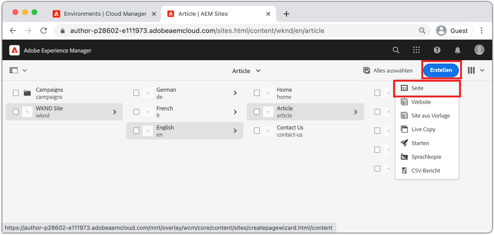
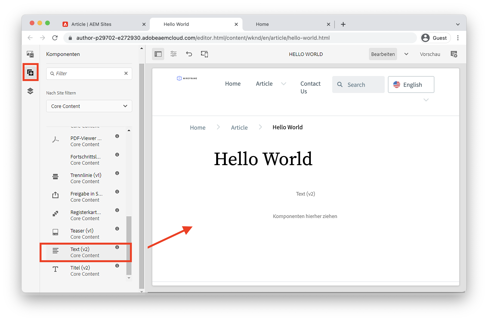
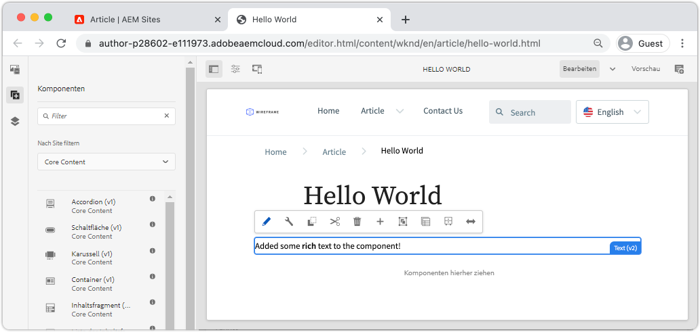
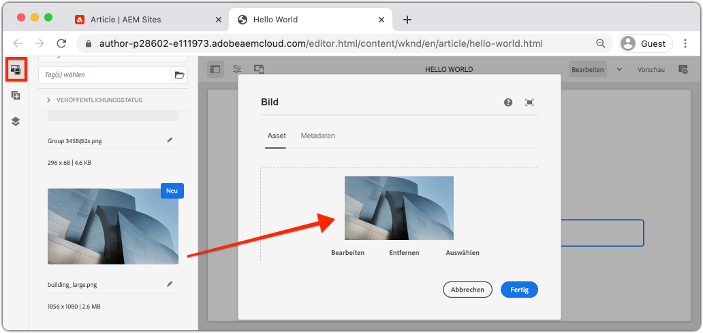
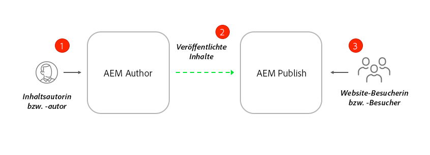
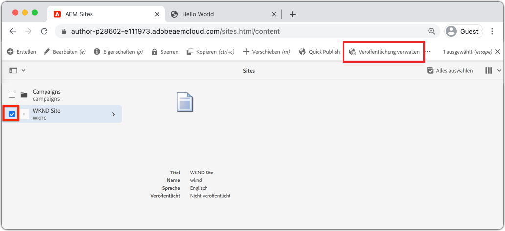
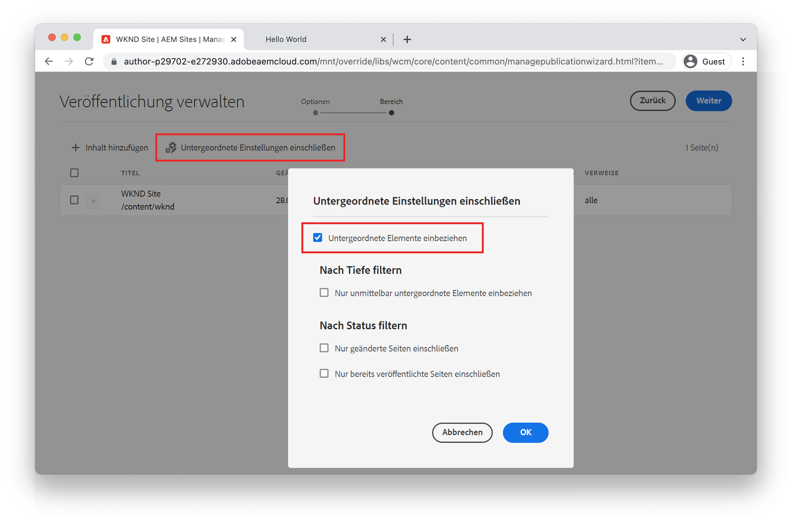
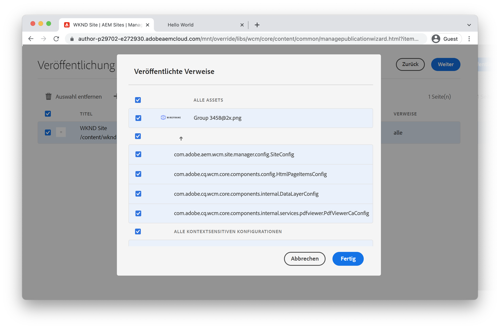
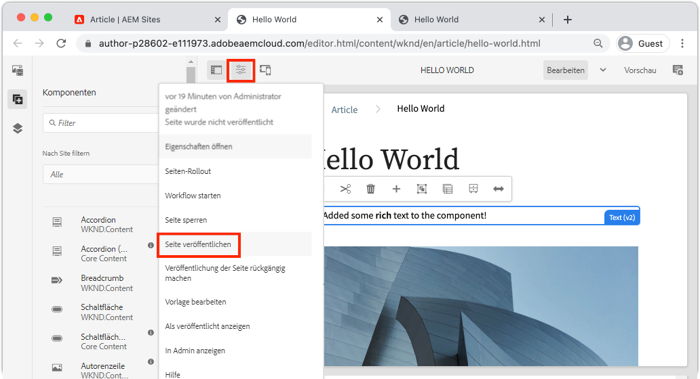

# Authoring- und Veröffentlichungsänderungen {#author-content-publish}

>[!CAUTION]
>
> Die hier präsentierten Funktionen zur schnellen Site-Erstellung werden in der zweiten Jahreshälfte 2021 veröffentlicht. Die zugehörige Dokumentation steht zu Vorschauen zur Verfügung.

Es ist wichtig zu verstehen, wie ein Benutzer Inhalte für die Website aktualisieren wird. In diesem Kapitel werden wir die Persona eines **Inhaltsautor** übernehmen und einige redaktionelle Aktualisierungen der Website, die im vorherigen Kapitel generiert wurden. Am Ende des Kapitels veröffentlichen wir die Änderungen, um zu verstehen, wie die Live-Site aktualisiert wird.

## Voraussetzungen {#prerequisites}

Dies ist ein mehrteiliges Lernprogramm und es wird davon ausgegangen, dass die im Kapitel [Erstellen einer Site](./create-site.md) beschriebenen Schritte abgeschlossen wurden.

## Vorgabe {#objective}

1. Verstehen Sie die Konzepte von **Seiten** und **Komponenten** in AEM Sites.
1. Erfahren Sie, wie Sie den Inhalt der Website aktualisieren.
1. Erfahren Sie, wie Sie Änderungen an der Live-Site veröffentlichen.

## Neue Seite {#create-page} erstellen

Eine Website ist in der Regel in Seiten unterteilt, um ein mehrseitiges Erlebnis zu schaffen. AEM strukturiert Inhalte auf dieselbe Weise. Als Nächstes erstellen Sie eine neue Seite für die Site.

1. Melden Sie sich beim AEM **Autor** Dienst an, der im vorherigen Kapitel verwendet wurde.
1. Klicken Sie im Bildschirm &quot;AEM Beginn&quot;auf **Sites** > **WKND-Site** > **Englisch** > **Article**
1. Klicken Sie in der oberen rechten Ecke auf **Erstellen** > **Seite**.

   

   Dadurch wird der Assistent **Seite erstellen** angezeigt.

1. Wählen Sie die Vorlage **Artikelseite** und klicken Sie auf **Weiter**.

   Seiten in AEM werden auf der Grundlage einer Seitenvorlage erstellt. Seitenvorlagen werden im Kapitel [Seitenvorlagen](page-templates.md) genauer untersucht.

1. Geben Sie unter **Eigenschaften** einen **Titel** von &quot;Hello World&quot;ein.
1. Legen Sie **Name** auf `hello-world` fest und klicken Sie auf **Erstellen**.

   

1. Klicken Sie im Popup-Dialogfeld auf **Öffnen**, um die neu erstellte Seite zu öffnen.

## Komponente {#author-component} erstellen

AEM Komponenten können als kleine Bausteine einer Webseite betrachtet werden. Indem die Benutzeroberfläche in logische Abschnitte oder Komponenten unterteilt wird, wird die Verwaltung erheblich vereinfacht. Zur Wiederverwendung von Komponenten müssen die Komponenten konfigurierbar sein. Dies erfolgt über den Autorendialog.

AEM bietet eine Reihe von [Kernkomponenten](https://experienceleague.adobe.com/docs/experience-manager-core-components/using/introduction.html?lang=de), die einsatzbereit sind. Die Bereiche **Kernkomponenten** reichen von einfachen Elementen wie [Text](https://experienceleague.adobe.com/docs/experience-manager-core-components/using/components/text.html) und [Bild](https://experienceleague.adobe.com/docs/experience-manager-core-components/using/components/image.html) bis hin zu komplexeren Benutzeroberflächenelementen wie einem [Karussell](https://experienceleague.adobe.com/docs/experience-manager-core-components/using/components/carousel.html).

Als Nächstes erstellen wir einige Komponenten mit AEM Seiten-Editor.

1. Navigieren Sie zur Seite **Hallo Welt**, die in der vorherigen Übung erstellt wurde.
1. Stellen Sie sicher, dass Sie sich im Modus **Bearbeiten** befinden und klicken Sie in der linken Seitenleiste auf das Symbol **Komponenten**.

   

   Dadurch wird die Komponentenbibliothek geöffnet und die verfügbaren Komponenten, die auf der Seite verwendet werden können, werden Liste.

1. Blättern Sie nach unten und **Ziehen Sie + Ablegen** eine **Text (v2)**-Komponente in den bearbeitbaren Hauptbereich der Seite.

   

1. Markieren Sie die Komponente **Text** und klicken Sie dann auf das Symbol **Schraubenschlüssel** , um das Dialogfeld der Komponente zu öffnen. Geben Sie Text ein und speichern Sie die Änderungen im Dialogfeld.

   

   Die Komponente **Text** sollte jetzt den Rich-Text auf der Seite anzeigen.

1. Wiederholen Sie die oben genannten Schritte, allerdings ziehen Sie eine Instanz der Komponente **Image(v2)** auf die Seite. Öffnen Sie das Dialogfeld der Komponente **Bild**.

1. Wechseln Sie in der linken Leiste zur **Asset-Suche**, indem Sie auf das Symbol **Assets** klicken .
1. **Ziehen Sie das** Dropan-Bild in das Dialogfeld der Komponente und klicken Sie auf  **** Doneze, um die Änderungen zu speichern.

   

1. Beachten Sie, dass auf der Seite Komponenten wie **Title**, **Navigation**, **Suche** vorhanden sind, die repariert wurden. Diese Bereiche werden als Teil der Seitenvorlage konfiguriert und können nicht auf einer einzelnen Seite geändert werden. Dies wird im nächsten Kapitel näher untersucht.

Experimentieren Sie mit einigen der anderen Komponenten. Dokumentation zu jeder [Core-Komponente finden Sie hier](https://experienceleague.adobe.com/docs/experience-manager-core-components/using/introduction.html). Eine detaillierte Videoreihe zum [Seiten-Authoring finden Sie hier](https://experienceleague.adobe.com/docs/experience-manager-learn/sites/page-authoring/aem-sites-authoring-overview.html).

## Veröffentlichungsaktualisierungen {#publish-updates}

AEM Umgebung werden zwischen einem **Autorendienst** und einem **Veröffentlichungsdienst** aufgeteilt. In diesem Kapitel haben wir einige Änderungen an der Site am **Autorendienst** vorgenommen. Damit Site-Besucher die Änderungen Ansicht haben, müssen sie im **Publish-Dienst** veröffentlicht werden.

*Inhaltsfluss auf hoher Ebene vom Autor zum Veröffentlichen*

**1.** Inhaltsersteller nehmen Aktualisierungen am Site-Inhalt vor. Die Updates können als Live-Vorschau angezeigt, geprüft und genehmigt werden.

**2.** Der Inhalt ist veröffentlicht. Die Veröffentlichung kann bei Bedarf ausgeführt oder für ein künftiges Datum geplant werden.

**3.** Site-Besucher sehen die Änderungen, die im Veröffentlichungsdienst widergespiegelt werden.

### Änderungen veröffentlichen

Als Nächstes veröffentlichen wir die Änderungen.

1. Navigieren Sie im Bildschirm &quot;AEM Beginn&quot;zu **Sites** und wählen Sie **WKND-Site**.
1. Klicken Sie in der Menüleiste auf **Veröffentlichung verwalten**.

   

   Da es sich hierbei um eine ganz neue Site handelt, möchten wir alle Seiten veröffentlichen und können den Assistenten zum Verwalten von Veröffentlichungen verwenden, um genau zu definieren, was veröffentlicht werden muss.

1. Lassen Sie unter **Optionen** die Standardeinstellungen auf **Veröffentlichen** und planen Sie sie für **Jetzt**. Klicken Sie auf **Weiter**.
1. Wählen Sie unter **Scope** die **WKND-Site** und klicken Sie auf **Untergeordnete Elemente einschließen**. Deaktivieren Sie im Dialogfeld alle Kontrollkästchen. Wir möchten die vollständige Website veröffentlichen.

   

1. Klicken Sie auf die Schaltfläche **Veröffentlichte Referenzen**. Überprüfen Sie im Dialogfeld, ob alles markiert ist. Dazu gehören die **Grundlegende AEM-Site-Vorlage** und verschiedene Konfigurationen, die von der Site-Vorlage generiert wurden. Klicken Sie zum Aktualisieren auf **Fertig**.

   

1. Klicken Sie abschließend in der oberen rechten Ecke auf **Veröffentlichen**, um den Inhalt zu veröffentlichen.

## Ansicht veröffentlichte Inhalte {#publish}

Navigieren Sie anschließend zum Veröffentlichungsdienst, um die Änderungen Ansicht.

1. Eine einfache Möglichkeit, die URL des Veröffentlichungsdienstes abzurufen, besteht darin, die Autor-URL zu kopieren und das `author`-Wort durch `publish` zu ersetzen. Beispiel:

   * **Autoren-URL** - `https://author-pYYYY-eXXXX.adobeaemcloud.com/`
   * **URL**  veröffentlichen -  `https://publish-pYYYY-eXXXX.adobeaemcloud.com/`

1. hinzufügen Sie `/content/wknd.html` zur Veröffentlichungs-URL, damit die endgültige URL wie folgt aussieht: `https://publish-pYYYY-eXXXX.adobeaemcloud.com/content/wknd.html`.

   >[!NOTE]
   >
   > Ändern Sie `wknd.html` entsprechend dem Namen Ihrer Site, wenn Sie bei der [Site-Erstellung](create-site.md) einen eindeutigen Namen angegeben haben.

1. Wenn Sie zur Veröffentlichungs-URL navigieren, sollte die Site ohne die AEM Authoring-Funktion angezeigt werden.

   

1. Klicken Sie im Menü **Navigation** auf **Artikel** > **Hallo Welt**, um zur zuvor erstellten Seite &quot;Hallo Welt&quot;zu navigieren.
1. Kehren Sie zum **AEM-Autorendienst** zurück und nehmen Sie einige zusätzliche Inhaltsänderungen im Seiten-Editor vor.
1. Veröffentlichen Sie diese Änderungen direkt im Seiteneditor, indem Sie auf das Symbol **Seiteneigenschaften** > **Seite veröffentlichen** klicken

   

1. Kehren Sie zum **AEM Publish Service** zurück, um die Änderungen Ansicht. Die Updates werden höchstwahrscheinlich nicht sofort angezeigt. **** Der Grund dafür ist, dass der **AEM Publish-Dienst** [Zwischenspeicherung über einen Apache-Webserver und CDN](https://experienceleague.adobe.com/docs/experience-manager-cloud-service/implementing/content-delivery/caching.html) beinhaltet. Standardmäßig werden HTML-Inhalte für ca. 5 Minuten zwischengespeichert.

1. Um den Cache für Test-/Debugging-Zwecke zu umgehen, fügen Sie einfach einen Abfrage-Parameter wie `?nocache=true` hinzu. Die URL würde wie `https://publish-pYYYY-eXXXX.adobeaemcloud.com/content/wknd/en/article/hello-world.html?nocache=true` aussehen. Weitere Informationen zur Cachestrategie und den verfügbaren Konfigurationen finden Sie hier.

1. Sie können auch die URL zum Veröffentlichungsdienst in Cloud Manager suchen. Navigieren Sie zum Programm **Cloud Manager** > **Umgebung** > **Umgebung**.

   

   Unter **Umgebung-Segmente** finden Sie Links zu den Diensten **Autor** und **Veröffentlichen**.

## Herzlichen Glückwunsch! {#congratulations}

Herzlichen Glückwunsch, Sie haben gerade Änderungen an Ihrer AEM Site verfasst und veröffentlicht!

### Nächste Schritte {#next-steps}

Erfahren Sie, wie Sie [Seitenvorlagen](./page-templates.md) erstellen und ändern. Verstehen Sie die Beziehung zwischen einer Seitenvorlage und einer Seite. Erfahren Sie, wie Sie die Richtlinien einer Seitenvorlage konfigurieren, um granulare Governance und Markenkonsistenz für Inhalte bereitzustellen.  Eine gut strukturierte Artikelvorlage für Zeitschriften wird auf der Grundlage eines Mockups von Adobe XD erstellt.
