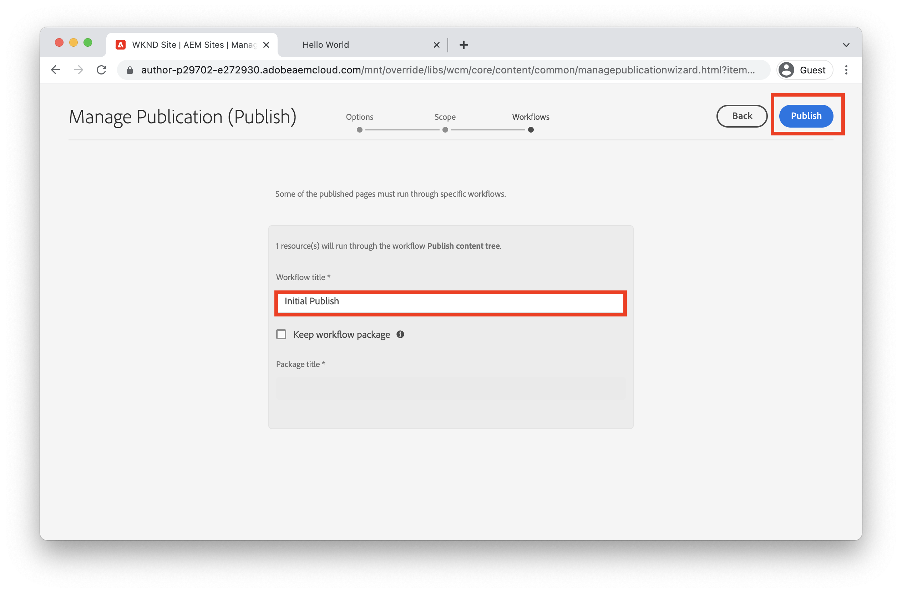

# Einführung in das Verfassen und Veröffentlichen {#author-content-publish}

Es ist wichtig zu verstehen, wie Benutzende Inhalte für die Website aktualisieren. In diesem Kapitel werden wir die Rolle eines **Inhaltsautors** übernehmen und nehmen einige redaktionelle Aktualisierungen an der im vorherigen Kapitel erstellten Site vor. Am Ende des Kapitels veröffentlichen wir die Änderungen, um zu verstehen, wie die Live-Site aktualisiert wird.

## Voraussetzungen {#prerequisites}

Dies ist ein mehrteiliges Tutorial, und es wird davon ausgegangen, dass die im Kapitel [Erstellen einer Site](./create-site.md) beschriebenen Schritte abgeschlossen sind.

## Ziel {#objective}

1. Verstehen der Konzepte von **Seiten** und **Komponenten** in AEM Sites.
1. Erfahren Sie, wie Sie den Inhalt der Website aktualisieren.
1. Erfahren Sie, wie Sie Änderungen an der Live-Site veröffentlichen.

## Erstellen einer neuen Seite {#create-page}

Eine Website ist in der Regel in mehrere Seiten unterteilt, um ein mehrseitiges Erlebnis zu schaffen. AEM strukturiert Inhalte auf die gleiche Weise. Als Nächstes erstellen Sie eine neue Seite für die Site.

1. Melden Sie sich bei dem im vorherigen Kapitel verwendeten AEM-**Autoren**-Service an.
1. Klicken Sie im AEM-Startbildschirm auf **Sites** > **WKND-Site** > **Englisch** > **Artikel**
1. Klicken Sie in der oberen rechten Ecke auf **Erstellen** > **Seite**.

   

   Daraufhin wird der Assistent **Seite erstellen** aufgerufen.

1. Wählen Sie die Vorlage **Artikelseite** und klicken Sie auf **Weiter**.

   Seiten in AEM werden basierend auf einer Seitenvorlage erstellt. Seitenvorlagen werden im Kapitel [Seitenvorlagen](page-templates.md) ausführlich behandelt.

1. Unter **Eigenschaften** geben Sie als **Titel** „Hello World“ ein.
1. Legen Sie den **Namen** auf `hello-world` fest und klicken Sie auf **Erstellen**.

   

1. Klicken Sie im Popup-Dialogfeld auf **Öffnen**, um die neu erstellte Seite zu öffnen.

## Erstellen einer Komponente {#author-component}

AEM-Komponenten können als kleine, modulare Bausteine einer Web-Seite betrachtet werden. Durch die Unterteilung der Benutzeroberfläche in logische Abschnitte oder Komponenten wird die Verwaltung wesentlich einfacher. Um Komponenten wiederverwenden zu können, müssen die Komponenten konfigurierbar sein. Dies erfolgt über das Dialogfeld „Autor“.

AEM bietet eine Reihe von [Kernkomponenten](https://experienceleague.adobe.com/docs/experience-manager-core-components/using/introduction.html?lang=de), die für den Einsatz in der Produktion geeignet sind. Die **Kernkomponenten** reichen von grundlegenden Elementen wie [Text](https://experienceleague.adobe.com/docs/experience-manager-core-components/using/components/text.html?lang=de) und [Bild](https://experienceleague.adobe.com/docs/experience-manager-core-components/using/components/image.html?lang=de) bis zu komplexeren Benutzeroberflächenelementen wie einem [Karussell](https://experienceleague.adobe.com/docs/experience-manager-core-components/using/components/carousel.html?lang=de).

Als Nächstes erstellen Sie einige Komponenten mit dem AEM-Seiteneditor.

1. Navigieren Sie zur **Hello World**-Seite, die in der vorherigen Übung erstellt wurde.
1. Stellen Sie sicher, dass Sie sich im Modus **Bearbeiten** befinden, und klicken Sie in der linken Seitenleiste auf das Symbol **Komponenten**.

   

   Dadurch wird die Komponentenbibliothek geöffnet und die verfügbaren Komponenten aufgelistet, die auf der Seite verwendet werden können.

1. Scrollen Sie nach unten und ziehen Sie per **Drag-and-Drop** die Komponente **Text (v2)** auf den bearbeitbaren Hauptbereich der Seite.

   

1. Klicken Sie auf die **Textkomponente**, um sie zu markieren, und klicken Sie dann auf das **Schraubenschlüssel**-Symbol , um den Komponentendialog zu öffnen. Geben Sie einen Text ein und speichern Sie die Änderungen im Dialogfeld.

   

   Die **Textkomponente** sollte nun den Rich-Text auf der Seite anzeigen.

1. Wiederholen Sie die obigen Schritte, ziehen Sie jedoch eine Instanz der Komponente **Image(v2)** auf die Seite. Öffnen Sie das Dialogfeld der **Bildkomponente**.

1. Wechseln Sie in der linken Leiste zu **Asset-Suche**, indem Sie auf das Symbol **Assets**  klicken.
1. **Ziehen** Sie ein Bild in das Dialogfeld der Komponente und klicken Sie auf **Fertig**, um die Änderungen zu speichern.

   

1. Beachten Sie, dass sich einige Komponenten auf der Seite befinden, wie z. B. **Titel**, **Navigation**, **Suche**, die fest sind. Diese Bereiche werden als Teil der Seitenvorlage konfiguriert und können nicht auf einer einzelnen Seite geändert werden. Dies wird im nächsten Kapitel näher untersucht.

Experimentieren Sie mit den anderen Komponenten. Dokumentationen zu den einzelnen [Kernkomponenten finden Sie hier](https://experienceleague.adobe.com/docs/experience-manager-core-components/using/introduction.html?lang=de). Eine detaillierte Videoserie zur [Seitenbearbeitung finden Sie hier](https://experienceleague.adobe.com/docs/experience-manager-learn/sites/page-authoring/aem-sites-authoring-overview.html?lang=de).

## Veröffentlichen von Aktualisierungen {#publish-updates}

AEM-Umgebungen sind in einen **Autoren-Service** und einen **Veröffentlichung-Service** unterteilt. In diesem Kapitel haben wir mehrere Änderungen an der Site im **Autoren-Service** vorgenommen. Damit Besuchende der Site die Änderungen anzeigen können, müssen wir sie im **Veröffentlichungs-Service** veröffentlichen.

*Inhaltsfluss von Author zu Publish*

**1.** Inhaltsautorinnen und -autoren nehmen Aktualisierungen am Site-Inhalt vor. Die Aktualisierungen können als Vorschau angezeigt, geprüft und genehmigt werden, um live geschaltet zu werden.

**2.** Der Inhalt wird veröffentlicht. Die Veröffentlichung kann bei Bedarf erfolgen oder für ein künftiges Datum geplant werden.

**3.** Besuchende der Site sehen die Änderungen, die in den Veröffentlichungs-Service übernommen werden.

### Veröffentlichen der Änderungen

Als Nächstes veröffentlichen wir die Änderungen.

1. Navigieren Sie im AEM-Startbildschirm zu **Sites** und wählen Sie die **WKND-Site** aus.
1. Klicken Sie in der Menüleiste auf **Veröffentlichung verwalten**.

   

   Da es sich um eine brandneue Site handelt, möchten wir alle Seiten veröffentlichen und können den Assistenten „Veröffentlichung verwalten“ verwenden, um genau zu definieren, was veröffentlicht werden muss.

1. Lassen Sie unter **Optionen** die Standardeinstellungen auf **Veröffentlichen** und planen Sie die Veröffentlichung für **Jetzt**. Klicken Sie auf **Weiter**.
1. Wählen Sie unter **Anwendungsbereich** die **WKND-Site** aus und klicken Sie auf **Untergeordnete Einstellungen einschließen**. Aktivieren Sie im Dialogfeld die Option **Untergeordnete Elemente einschließen**. Deaktivieren Sie die übrigen Felder, um sicherzustellen, dass die gesamte Site veröffentlicht wird.

   

1. Klicken Sie auf die Schaltfläche **Veröffentlichte Verweise**. Überprüfen Sie im Dialogfeld, ob alles aktiviert ist. Dies umfasst die **Standard-Site-Vorlage** und mehrere Konfigurationen, die von der Site-Vorlage generiert wurden. Klicken Sie zur Aktualisierung auf **Fertig**.

   

1. Aktivieren Sie abschließend das Kontrollkästchen neben **WKND-Site** und klicken Sie oben rechts auf **Weiter**.
1. Geben Sie im Schritt **Workflows** einen **Workflow-Titel** an. Dies kann ein beliebiger Text sein, und er kann später als Teil eines Audit-Protokolls nützlich sein. Geben Sie „Erstveröffentlichung“ ein und klicken Sie auf **Veröffentlichen**.

## Anzeigen veröffentlichter Inhalte {#publish}

Navigieren Sie anschließend zum Veröffentlichungs-Service, um die Änderungen anzuzeigen.

1. Eine einfache Möglichkeit, die URL des Veröffentlichungs-Service abzurufen, besteht darin, die Autoren-URL zu kopieren und `author` durch das Wort `publish` zu ersetzen. Zum Beispiel:

   * **Autoren-URL** – `https://author-pYYYY-eXXXX.adobeaemcloud.com/`
   * **Veröffentlichungs-URL** – `https://publish-pYYYY-eXXXX.adobeaemcloud.com/`

1. Fügen Sie `/content/wknd.html` zur Veröffentlichungs-URL hinzu, sodass die endgültige URL wie folgt aussieht: `https://publish-pYYYY-eXXXX.adobeaemcloud.com/content/wknd.html`.

   >[!NOTE]
   >
   > Ändern Sie `wknd.html` so, dass der Name Ihrer Site angegeben wird, wenn Sie während der [Site-Erstellung](create-site.md) einen eindeutigen Namen angegeben haben.

1. Wenn Sie zur Veröffentlichungs-URL navigieren, sollte die Site ohne die AEM-Authoring-Funktion angezeigt werden.

   

1. Klicken Sie im Menü **Navigation** auf **Artikel** > **Hello World**, um zur zuvor erstellten „Hello World“-Seite zu navigieren.
1. Kehren Sie zum **AEM-Autoren-Service** zurück und nehmen Sie einige zusätzliche Inhaltsänderungen im Seiteneditor vor.
1. Veröffentlichen Sie diese Änderungen direkt aus dem Seiteneditor heraus, indem Sie auf das Symbol **Seiteneigenschaften** > **Seite veröffentlichen** klicken.

   

1. Kehren Sie zum **AEM-Veröffentlichungs-Service** zurück, um die Änderungen anzuzeigen. Wahrscheinlich werden Sie die Aktualisierungen **nicht** sofort sehen. Dies liegt daran, dass der **AEM-Veröffentlichungs-Service** das [Caching über einen Apache-Webserver und ein CDN](https://experienceleague.adobe.com/docs/experience-manager-cloud-service/implementing/content-delivery/caching.html?lang=de) beinhaltet. Standardmäßig werden HTML-Inhalte ca. 5 Minuten lang zwischengespeichert.

1. Um den Cache für Test-/Debugging-Zwecke zu umgehen, fügen Sie einfach einen Abfrageparameter wie `?nocache=true` hinzu. Die URL sieht dann wie folgt aus: `https://publish-pYYYY-eXXXX.adobeaemcloud.com/content/wknd/en/article/hello-world.html?nocache=true`. Weitere Informationen zur Cachestrategie und den verfügbaren Konfigurationen [finden Sie hier](https://experienceleague.adobe.com/docs/experience-manager-cloud-service/implementing/content-delivery/overview.html?lang=de).

1. Sie finden die URL zum Veröffentlichungs-Service auch in Cloud Manager. Navigieren Sie zum **Cloud Manager-Programm** > **Umgebungen** > **Umgebung**.

   

   Unter **Umgebungssegmente** finden Sie Links zum **Autoren-** und **Veröffentlichungs**-Service.

## Herzlichen Glückwunsch! {#congratulations}

Herzlichen Glückwunsch, Sie haben gerade Änderungen an Ihrer AEM Site verfasst und veröffentlicht!

### Nächste Schritte {#next-steps}

Bei einer realen Implementierung geht in der Regel die Planung einer Site mit Mockups und Benutzeroberflächen-Designs der eigentlichen Site-Erstellung voraus. Erfahren Sie in [Benutzeroberflächenplanung mit Adobe XD](./ui-planning-adobe-xd.md), wie Sie mit Adobe XD-UI-Kits Ihre Adobe Experience Manager Sites-Implementierung entwerfen und beschleunigen können.

Möchten Sie weiterhin die Funktionen von AEM Sites erkunden? Sie können direkt zum Kapitel [Seitenvorlagen](./page-templates.md) springen, um die Beziehung zwischen einer Seitenvorlage und einer Seite zu verstehen.

