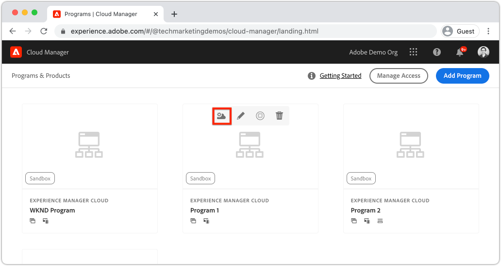
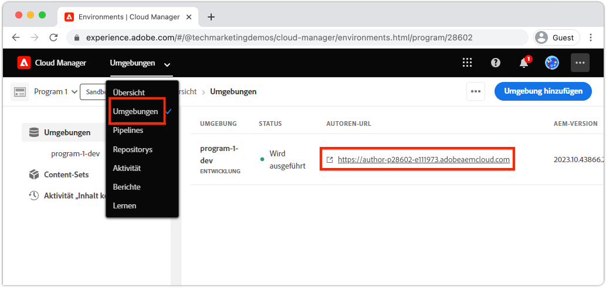
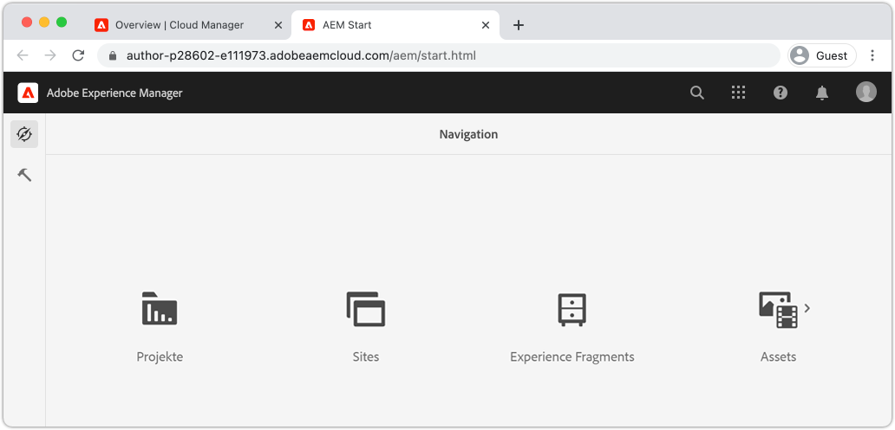
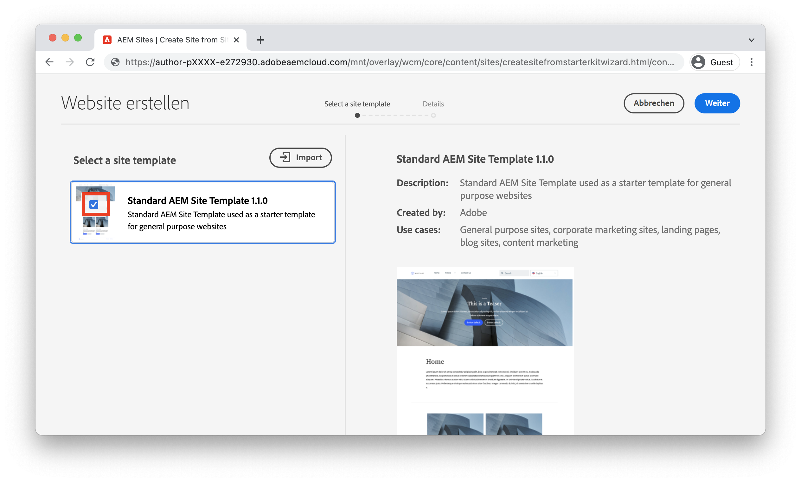
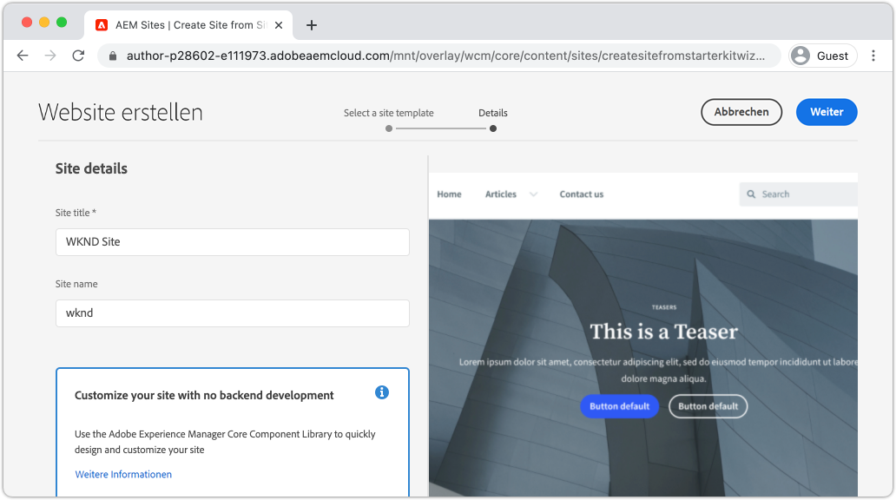
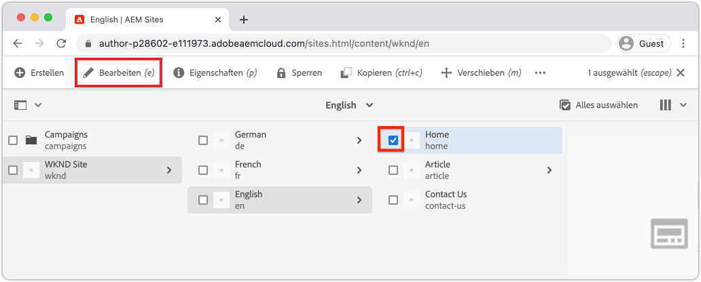
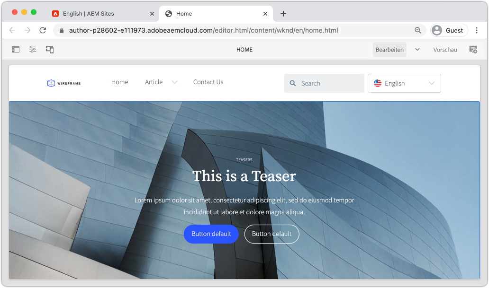

# Erstellen einer Site {#create-site}

>[!CAUTION]
>
> Die hier präsentierten Funktionen zur schnellen Site-Erstellung werden in der zweiten Jahreshälfte 2021 veröffentlicht. Die zugehörige Dokumentation steht zu Vorschauen zur Verfügung.

In diesem Kapitel wird die Einrichtung einer neuen Site in Adobe Experience Manager behandelt. Die von der Adobe bereitgestellte Standard-Site-Vorlage wird als Ausgangspunkt verwendet.

## Voraussetzungen {#prerequisites}

Die Schritte in diesem Kapitel finden in einem Adobe Experience Manager als Cloud Service-Umgebung statt. Stellen Sie sicher, dass Sie administrativen Zugriff auf die AEM Umgebung haben. Es wird empfohlen, ein [Sandbox-Programm](https://experienceleague.adobe.com/docs/experience-manager-cloud-service/onboarding/getting-access/sandbox-programs/introduction-sandbox-programs.html) und [Development-Umgebung](https://experienceleague.adobe.com/docs/experience-manager-cloud-service/implementing/using-cloud-manager/manage-environments.html?lang=de) zu verwenden, wenn Sie dieses Lernprogramm abschließen.

Weitere Informationen finden Sie in der [Onboarding-Dokumentation](https://experienceleague.adobe.com/docs/experience-manager-cloud-service/onboarding/home.html).

## Vorgabe {#objective}

1. Hier erfahren Sie, wie Sie mit dem Assistenten zum Erstellen von Sites eine neue Site erstellen.
1. Machen Sie sich mit der Rolle von Site-Vorlagen vertraut.
1. Entdecken Sie die generierte AEM.

## Melden Sie sich bei Adobe Experience Manager Authoring {#author} an

Als ersten Schritt melden Sie sich bei Ihrem AEM als Cloud Service-Umgebung an. AEM Umgebung werden zwischen einem **Autorendienst** und einem **Veröffentlichungsdienst** aufgeteilt.

* **Autorendienst**  - wo Site-Inhalte erstellt, verwaltet und aktualisiert werden. Normalerweise haben nur interne Benutzer Zugriff auf den **Autorendienst** und befinden sich hinter einem Anmeldebildschirm.
* **Publish-Dienst** : Host die Live-Website. Dieser Dienst wird Endbenutzern angezeigt und ist normalerweise öffentlich verfügbar.

Die meisten Übungen finden mit dem **Autorendienst** statt.

1. Navigieren Sie zum Adobe Experience Cloud [https://experience.adobe.com/](https://experience.adobe.com/). Melden Sie sich mit Ihrem persönlichen Konto oder einem Firmen-/Schulkonto an.
1. Vergewissern Sie sich, dass im Menü die richtige Organisation ausgewählt ist, und klicken Sie auf **Experience Manager**.

   

1. Klicken Sie unter **Cloud Manager** auf **Starten**.
1. Bewegen Sie den Mauszeiger über das gewünschte Programm und klicken Sie auf das Symbol **Cloud Manager-Programm**.

   

1. Klicken Sie im oberen Menü auf **Umgebung**, um die bereitgestellten Umgebung Ansicht.

1. Suchen Sie die gewünschte Umgebung und klicken Sie auf die **Autoren-URL**.

   

   >[!NOTE]
   >
   >Es wird empfohlen, eine **Development**-Umgebung für dieses Lernprogramm zu verwenden.

1. Im AEM **Autorendienst** wird eine neue Registerkarte gestartet. Klicken Sie auf **Mit Adobe** anmelden und Sie sollten automatisch mit denselben Experience Cloud-Anmeldeinformationen angemeldet sein.

1. Nach der Umleitung und Authentifizierung sollte nun der Bildschirm &quot;AEM Beginn&quot;angezeigt werden.

   

>[!NOTE]
>
> Haben Sie Probleme beim Zugriff auf Experience Manager? Überprüfen Sie die [Onboarding-Dokumentation](https://experienceleague.adobe.com/docs/experience-manager-cloud-service/onboarding/home.html)

## Grundlegende Site-Vorlage herunterladen

Eine Site-Vorlage bietet einen Ausgangspunkt für eine neue Site. Eine Site-Vorlage umfasst einige grundlegende Themen, Seitenvorlagen, Konfigurationen und Beispielinhalte. Was genau in der Site-Vorlage enthalten ist, hängt vom Entwickler ab. Adobe bietet eine **Grundlegende Site-Vorlage**, um neue Implementierungen zu beschleunigen.

1. Öffnen Sie eine neue Browser-Registerkarte und navigieren Sie zum Projekt &quot;Grundlegende Site-Vorlage&quot;auf GitHub: [https://github.com/adobe/aem-site-template-basic](https://github.com/adobe/aem-site-template-basic). Das Projekt ist Open-Source und lizenziert für die Verwendung durch jedermann.
1. Klicken Sie auf **Releases** und navigieren Sie zum [neuesten Release](https://github.com/adobe/aem-site-template-basic/releases/latest).
1. Erweitern Sie das Dropdown-Feld **Assets** und laden Sie die ZIP-Vorlagendatei herunter:

   

   Diese ZIP-Datei wird in der nächsten Übung verwendet.

   >[!NOTE]
   >
   > Dieses Tutorial wurde mit der Version **5.0.0** der einfachen Site-Vorlage geschrieben. Beim Starten eines neuen Projekts wird immer empfohlen, die neueste Version zu verwenden.

## Eine neue Site erstellen

Als Nächstes erstellen Sie eine neue Site mithilfe der Site-Vorlage aus der vorherigen Übung.

1. Kehren Sie zur AEM Umgebung zurück. Navigieren Sie im Bildschirm &quot;AEM Beginn&quot;zu **Sites**.
1. Klicken Sie in der oberen rechten Ecke auf **Erstellen** > **Site (Vorlage)**. Dadurch wird der **Site-Assistent erstellen** angezeigt.
1. Klicken Sie unter **Wählen Sie eine Site-Vorlage** auf die Schaltfläche **Importieren**.

   Laden Sie die Vorlagendatei **.zip** hoch, die Sie aus der vorherigen Übung heruntergeladen haben.

1. Wählen Sie **Grundlegende AEM Site-Vorlage** und klicken Sie auf **Weiter**.

   

1. Geben Sie unter **Site-Details** > **Site-Titel** `WKND Site` ein.
1. Geben Sie unter **Site-Name** `wknd` ein.

   

   >[!NOTE]
   >
   > Wenn Sie eine freigegebene AEM Umgebung verwenden, fügen Sie der **Site-Name** eine eindeutige Kennung hinzu. Beispiel `wknd-johndoe`. Dadurch wird sichergestellt, dass mehrere Benutzer das gleiche Lernprogramm ohne Kollisionen abschließen können.

1. Klicken Sie auf **Erstellen**, um die Site zu erstellen. Klicken Sie auf **Fertig** im Dialogfeld **Erfolg**, wenn AEM die Website erstellt hat.

## Die neue Site

1. Navigieren Sie zur AEM Sites-Konsole, falls noch nicht vorhanden.
1. Eine neue **WKND-Site** wurde generiert. Es wird eine Site-Struktur mit einer mehrsprachigen Hierarchie enthalten.
1. Öffnen Sie die Seite **Englisch** > **Home**, indem Sie die Seite markieren und auf die Schaltfläche **Bearbeiten** in der Menüleiste klicken:

   

1. Starterinhalt wurde bereits erstellt und es stehen mehrere Komponenten zur Verfügung, die einer Seite hinzugefügt werden können. Experimentieren Sie mit diesen Komponenten, um eine Vorstellung von der Funktionalität zu erhalten. Im nächsten Kapitel lernen Sie die Grundlagen einer Komponente kennen.

   

   *Von der Site-Vorlage bereitgestellter Beispielinhalt*

## Herzlichen Glückwunsch! {#congratulations}

Herzlichen Glückwunsch, Sie haben gerade Ihre erste AEM Site erstellt!

### Nächste Schritte {#next-steps}

Verwenden Sie den Seiteneditor in Adobe Experience Manager, AEM, um den Inhalt der Site im Kapitel [Autoreninhalt und Veröffentlichen](author-content-publish.md) zu aktualisieren. Erfahren Sie, wie atomare Komponenten für die Aktualisierung von Inhalten konfiguriert werden können. Machen Sie sich mit dem Unterschied zwischen einer AEM Author- und einer AEM Publish-Umgebung vertraut und lernen Sie, wie Sie Updates auf der Live-Site veröffentlichen.
