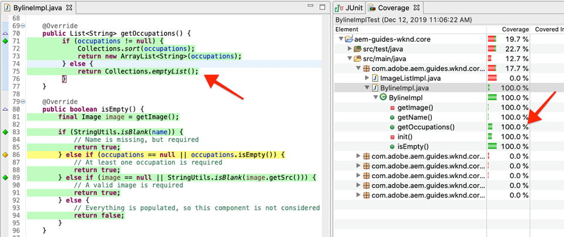

# Unit-Tests {#unit-testing}

Dieses Lernprogramm umfasst die Implementierung eines Komponententests, der das Verhalten des Sling-Modells der Komponente &quot;Byline&quot;überprüft, das im Lernprogramm &quot; [Benutzerspezifische Komponente](./custom-component.md) &quot;erstellt wurde.

## Voraussetzungen {#prerequisites}

Sehen Sie sich den Basiscode an, auf dem das Lernprogramm basiert:

1. Klonen Sie das [github.com/adobe/aem-guides-wknd](https://github.com/adobe/aem-guides-wknd) -Repository.
1. Sehen Sie sich die `unit-testing/start` Verzweigung an

```shell
$ git clone git@github.com:adobe/aem-guides-wknd.git ~/code/aem-guides-wknd
$ cd ~/code/aem-guides-wknd
$ git checkout unit-testing/start
```

Sie können den fertigen Code immer auf [GitHub](https://github.com/adobe/aem-guides-wknd/tree/unit-testing/solution) Ansicht oder den Code lokal auschecken, indem Sie zur Verzweigung wechseln `unit-testing/solution`.

## Vorgabe

1. Machen Sie sich mit den Grundlagen von Komponententests vertraut.
1. Erfahren Sie mehr über Frameworks und Tools, die häufig zum Testen AEM Codes verwendet werden.
1. Machen Sie sich mit den Optionen für das Verspotten oder Simulieren AEM Ressourcen beim Schreiben von Komponententests vertraut.

## Hintergrund {#unit-testing-background}

In diesem Lernprogramm werden wir erforschen, wie Sie [Komponententests](https://en.wikipedia.org/wiki/Unit_testing) für das [Sling-Modell](https://sling.apache.org/documentation/bundles/models.html) der Komponente &quot;Byline&quot;schreiben können (erstellt in der Komponente [](custom-component.md)Erstellen einer benutzerdefinierten AEM). Komponententests sind in Java geschriebene Buildzeittests, mit denen das erwartete Verhalten von Java-Code überprüft wird. Jeder Komponententest ist in der Regel klein und validiert die Ausgabe einer Methode (oder von Arbeitseinheiten) mit den erwarteten Ergebnissen.

Wir werden AEM Best Practices einsetzen und Folgendes nutzen:

* [JUnit 5](https://junit.org/junit5/)
* [Mockito Testing Framework](https://site.mockito.org/)
* [wcm.io Test Framework](https://wcm.io/testing/) (das auf [Apache Sling Mocks](https://sling.apache.org/documentation/development/sling-mock.html)aufbaut)

>[!VIDEO](https://video.tv.adobe.com/v/30207/?quality=12&learn=on)

## Komponententests und Adobe Cloud Manager {#unit-testing-and-adobe-cloud-manager}

[Adobe Cloud Manager](https://docs.adobe.com/content/help/de-DE/experience-manager-cloud-manager/using/introduction-to-cloud-manager.html) integriert die Ausführung von Komponententests und den [Code-Coverage-Berichte](https://docs.adobe.com/content/help/en/experience-manager-cloud-manager/using/how-to-use/understand-your-test-results.html#code-quality-testing) in seine CI/CD-Pipeline, um die Best Practice für Komponententests AEM Code zu fördern und zu fördern.

Obwohl Komponententestcode für jede Codebasis eine gute Vorgehensweise ist, ist es bei der Verwendung von Cloud Manager wichtig, die Codequalitätstests und die Berichte-Funktionen zu nutzen, indem Komponententests für die Ausführung von Cloud Manager bereitgestellt werden.

## Inspect - Maven-Abhängigkeiten testen {#inspect-the-test-maven-dependencies}

Der erste Schritt besteht darin, Maven-Abhängigkeiten zu überprüfen, um das Schreiben und Ausführen der Tests zu unterstützen. Es sind vier Abhängigkeiten erforderlich:

1. JUnit5
1. Mockito Test Framework
1. Apache Sling Mocks
1. AEM Mocks Test Framework (von io.wcm)

Die **Testabhängigkeiten JUnit5**, **Mockito** und **AEM Mocks** werden während der Einrichtung automatisch mit dem [AEM Maven-Archetyp](project-setup.md)hinzugefügt.

1. Um diese Abhängigkeiten Ansicht, öffnen Sie das übergeordneten Reactor-POM unter **aem-guides-wknd/pom.xml**, navigieren Sie zum Ordner `<dependencies>..</dependencies>` und stellen Sie sicher, dass die folgenden Abhängigkeiten definiert sind:

   ```xml
   <dependencies>
       ...
       <!-- Testing -->
       <dependency>
           <groupId>org.junit</groupId>
           <artifactId>junit-bom</artifactId>
           <version>5.5.2</version>
           <type>pom</type>
           <scope>import</scope>
       </dependency>
       <dependency>
           <groupId>org.slf4j</groupId>
           <artifactId>slf4j-simple</artifactId>
           <version>1.7.25</version>
           <scope>test</scope>
       </dependency>
       <dependency>
           <groupId>org.mockito</groupId>
           <artifactId>mockito-core</artifactId>
           <version>2.25.1</version>
           <scope>test</scope>
       </dependency>
       <dependency>
           <groupId>org.mockito</groupId>
           <artifactId>mockito-junit-jupiter</artifactId>
           <version>2.25.1</version>
           <scope>test</scope>
       </dependency>
       <dependency>
           <groupId>junit-addons</groupId>
           <artifactId>junit-addons</artifactId>
           <version>1.4</version>
           <scope>test</scope>
       </dependency>
       <dependency>
           <groupId>io.wcm</groupId>
           <artifactId>io.wcm.testing.aem-mock.junit5</artifactId>
           <!-- Prefer the latest version of AEM Mock Junit5 dependency -->
           <version>2.5.2</version>
           <scope>test</scope>
       </dependency>
       ...
   </dependencies>
   ```

1. Öffnen Sie **aem-guides-wknd/core/pom.xml** und Ansicht, dass die entsprechenden Testabhängigkeiten verfügbar sind:

   ```xml
   ...
   <dependency>
       <groupId>org.junit.jupiter</groupId>
       <artifactId>junit-jupiter</artifactId>
       <scope>test</scope>
   </dependency>
   <dependency>
       <groupId>org.mockito</groupId>
       <artifactId>mockito-core</artifactId>
       <scope>test</scope>
   </dependency>
   <dependency>
       <groupId>org.mockito</groupId>
       <artifactId>mockito-junit-jupiter</artifactId>
       <scope>test</scope>
   </dependency>
   <dependency>
       <groupId>junit-addons</groupId>
       <artifactId>junit-addons</artifactId>
   </dependency>
   <dependency>
       <groupId>io.wcm</groupId>
       <artifactId>io.wcm.testing.aem-mock.junit5</artifactId>
   </dependency>
   ...
   ```

   Ein paralleler Quellordner im **Kernprojekt** enthält die Komponententests und alle zugehörigen Testdateien. Dieser **Ordner &quot;test** &quot;bietet eine Trennung von Testklassen vom Quellcode, ermöglicht es den Tests jedoch, so zu handeln, als ob sie in denselben Paketen wie der Quellcode leben würden.

## JUnit-Test erstellen {#creating-the-junit-test}

Komponententests ordnen in der Regel 1-zu-1 Java-Klassen zu. In diesem Kapitel schreiben wir einen JUnit-Test für **BylineImpl.java**, das Sling-Modell, das die Byline-Komponente unterstützt.


*Speicherort der Komponententests.*

1. Wir können dies in Eclipse tun, indem Sie mit der rechten Maustaste auf die Java-Klasse zu testen und wählen Sie **Neu > Andere > Java > JUnit > JUnit Test Case**.

   

1. Überprüfen Sie im ersten Bildschirm des Assistenten Folgendes:

   * Der JUnit-Testtyp ist **New JUnit Jupiter-Test** , da dies die JUnit Maven-Abhängigkeiten sind, die in unserem **pom.xml-Test** eingerichtet wurden.
   * Das **Paket** ist das Java-Paket der zu testenden Klasse (`BylineImpl.java`)
   * Der Ordner &quot;Source&quot;verweist auf das **Kernprojekt** (`aem-guides-wknd.core/src/test/java`), das Eclipse anweist, wo die Testdateien der Einheit gespeichert werden.
   * Der `setUp()` Methodenstamm wird manuell erstellt. werden wir sehen, wie das später verwendet wird.
   * Die zu testende Klasse ist `BylineImpl.java`die Java-Klasse, die wir testen möchten.

   

   *Assistent für JUnit-Testfall - Schritt 2*

1. Klicken Sie unten im Assistenten auf die Schaltfläche **Weiter** .

   Dieser nächste Schritt hilft bei der automatischen Generierung von Testmethoden. Normalerweise verfügt jede öffentliche Methode der Java-Klasse über mindestens eine entsprechende Testmethode, bei der das Verhalten überprüft wird. Oft wird ein Komponententest über mehrere Testmethoden verfügen, die eine einzige öffentliche Methode testen, wobei jede eine andere Gruppe von Eingaben oder Zuständen darstellt.

   Wählen Sie im Assistenten alle unter `BylineImpl`stehenden Methoden aus, mit Ausnahme `init()` der Methode, die vom Sling-Modell intern (via `@PostConstruct`) verwendet wird. Wir werden das `init()` durch Testen aller anderen Methoden effektiv testen, da die anderen Methoden erfolgreich `init()` ausgeführt werden.

   Neue Testmethoden können jederzeit der JUnit-Testklasse hinzugefügt werden. Diese Seite des Assistenten dient lediglich der Einfachheit.

   

   *Assistent für JUnit-Testfälle (Fortsetzung)*

1. Klicken Sie unten im Assistenten auf die Schaltfläche &quot;Fertig stellen&quot;, um die JUnit5-Testdatei zu generieren.
1. Überprüfen Sie, ob die JUnit5-Testdatei in der entsprechenden Paketstruktur unter **aem-guides-wknd.core** > **/src/test/java** als Datei mit dem Namen `BylineImplTest.java`erstellt wurde.

## Überprüfen von BylineImplTest.java {#reviewing-bylineimpltest-java}

Unsere Testdatei enthält eine Reihe automatisch generierter Methoden. An diesem Punkt gibt es nichts AEM Bestimmtes an dieser JUnit-Testdatei.

Die erste Methode ist `public void setUp() { .. }` mit Anmerkungen versehen `@BeforeEach`.

Die `@BeforeEach` Anmerkung ist eine JUnit-Anmerkung, die den JUnit-Test, der ausgeführt wird, anweist, diese Methode auszuführen, bevor jede Testmethode in dieser Klasse ausgeführt wird.

Die nachfolgenden Methoden sind die Testmethoden selbst und werden als solche mit der `@Test` Anmerkung gekennzeichnet. Beachten Sie, dass alle Tests standardmäßig als fehlerhaft eingestellt sind.

Wenn diese JUnit-Testklasse (auch als JUnit-Testfall bezeichnet) ausgeführt wird, wird jede mit der `@Test` Klasse markierte Methode als Test ausgeführt, der entweder bestehen oder fehlschlagen kann.


*`core/src/test/java/com/adobe/aem/guides/wknd/core/models/impl/BylineImplTest.java`*

1. Führen Sie den JUnit-Test Case aus, indem Sie mit der rechten Maustaste auf den Klassennamen klicken und **Ausführen als > JUnit-Test** ausführen.

   

   *Klicken Sie mit der rechten Maustaste auf BylineImplTests.java > Ausführen als > JUnit-Test*

1. Wie erwartet schlagen alle Tests fehl.

   

   *JUnit-Ansicht unter Eclipse > Fenster > Ansicht anzeigen > Java > JUnit*

## Überprüfen von BylineImpl.java {#reviewing-bylineimpl-java}

Beim Schreiben von Komponententests gibt es zwei primäre Ansätze:

* [TDD- oder testgesteuerte Entwicklung](https://en.wikipedia.org/wiki/Test-driven_development), bei der die Komponententests inkrementell geschrieben werden, unmittelbar vor der Entwicklung der Implementierung; schreiben Sie einen Test, schreiben Sie die Implementierung, um den Test bestehen zu lassen.
* Implementierung - erste Entwicklung, bei der zunächst Arbeitscode entwickelt und dann Tests geschrieben werden, die diesen Code validieren.

In diesem Tutorial wird der letztgenannte Ansatz verwendet (wie wir bereits eine funktionierende **BylineImpl.java** in einem vorherigen Kapitel erstellt haben). Aus diesem Grund müssen wir das Verhalten seiner öffentlichen Methoden überprüfen und verstehen, aber auch einige seiner Implementierungsdetails. Dies mag widersprüchlich klingen, da bei einem guten Test nur die Ein- und Ausgänge berücksichtigt werden sollten, aber bei AEM gibt es eine Reihe von Implementierungserwägungen, die zu verstehen sind, um die laufenden Tests zu erstellen.

TDD im Kontext von AEM erfordert ein hohes Maß an Expertise und wird am besten von AEM Entwicklern übernommen, die AEM Entwicklung und Komponententests von AEM Code beherrschen.

>[!VIDEO](https://video.tv.adobe.com/v/30208/?quality=12&learn=on)

## Einrichten AEM Testkontexts  {#setting-up-aem-test-context}

Die meisten für AEM geschriebenen Codes basieren auf JCR-, Sling- oder AEM-APIs, die wiederum eine ordnungsgemäße Ausführung des AEM erfordern.

Da Komponententests beim Build ausgeführt werden, gibt es außerhalb des Kontexts einer laufenden AEM keine solche Ressource. Um dies zu erleichtern, erstellen die AEM Mocks [von](https://wcm.io/testing/aem-mock/usage.html) wcm.io einen Musterkontext, der es diesen APIs erlaubt, meist so zu handeln, als würden sie in AEM ausgeführt.

1. Erstellen Sie einen AEM Kontext mit **wcm.io&#39;s** `AemContext` in **BylineImplTest.java** , indem Sie ihn als JUnit-Erweiterung hinzufügen, die mit `@ExtendWith` der Datei **BylineImplTest.java** dekoriert ist. Die Erweiterung übernimmt alle erforderlichen Initialisierungs- und Bereinigungs-Aufgaben. Erstellen Sie eine Klassenvariable, `AemContext` die für alle Testmethoden verwendet werden kann.

   ```java
   import org.junit.jupiter.api.extension.ExtendWith;
   import io.wcm.testing.mock.aem.junit5.AemContext;
   import io.wcm.testing.mock.aem.junit5.AemContextExtension;
   ...
   
   @ExtendWith(AemContextExtension.class)
   class BylineImplTest {
   
       private final AemContext ctx = new AemContext();
   ```

   Diese Variable `ctx`stellt einen AEM Kontext offen, der eine Reihe von AEM- und Sling-Abstraktionen bietet:

   * Das BylineImpl Sling-Modell wird in diesem Zusammenhang registriert
   * In diesem Zusammenhang werden Muster-JCR-Inhaltsstrukturen erstellt.
   * Benutzerspezifische OSGi-Dienste können in diesem Kontext registriert werden.
   * Bietet eine Vielzahl häufig verwendeter Musterobjekte und Helfer, wie SlingHttpServletRequest-Objekte, eine Vielzahl von Sling- und AEM OSGi-Diensten wie ModelFactory, PageManager, Page, Template, ComponentManager, Component, TagManager, TagManager usw.
      * *Beachten Sie, dass nicht alle Methoden für diese Objekte implementiert sind!*
   * And [much more](https://wcm.io/testing/aem-mock/usage.html)!

   Das **`ctx`** Objekt dient als Einstiegspunkt für den Großteil unseres Mock-Kontexts.

1. Definieren Sie in der `setUp(..)` Methode, die vor jeder `@Test` Methode ausgeführt wird, einen gemeinsamen Teststatus für Muster:

   ```java
   @BeforeEach
   public void setUp() throws Exception {
       ctx.addModelsForClasses(BylineImpl.class);
       ctx.load().json("/com/adobe/aem/guides/wknd/core/models/impl/BylineImplTest.json", "/content");
   }
   ```

   * **`addModelsForClasses`** registriert das zu testende Sling-Modell in das Modell AEM Kontext, damit es in den `@Test` Methoden instanziiert werden kann.
   * **`load().json`** lädt Ressourcenstrukturen in den Modellkontext, sodass der Code mit diesen Ressourcen interagieren kann, als ob sie von einem echten Repository bereitgestellt würden. Die Ressourcendefinitionen in der Datei **`BylineImplTest.json`** werden in den JCR-Musterkontext unter **/content** geladen.
   * **`BylineImplTest.json`** ist noch nicht vorhanden, also erstellen wir es und definieren die JCR-Ressourcenstrukturen, die für den Test benötigt werden.

1. Die JSON-Dateien, die die Modellressourcenstrukturen darstellen, werden unter &quot; **core/src/test/resources** &quot;gespeichert und folgen demselben Paketpfad wie die JUnit Java-Testdatei.

   Erstellen Sie eine neue JSON-Datei unter **core/test/resources/com/adobe/aem/guides/worknd/core/models/impl** mit dem Namen **BylineImplTest.json** mit folgendem Inhalt:

   ```json
   {
       "byline": {
       "jcr:primaryType": "nt:unstructured",
       "sling:resourceType": "wknd/components/content/byline"
       }
   }
   ```

   

   Dieses JSON definiert eine Modell-Ressourcendefinition für den Byline-Komponententest. Zu diesem Zeitpunkt verfügt die JSON über den Mindestsatz an Eigenschaften, die erforderlich sind, um eine Inhaltsressource für die Byline-Komponente, die Inhaltsressource `jcr:primaryType` und `sling:resourceType`, darzustellen.

   Eine allgemeine Regel bei der Arbeit mit Komponententests besteht darin, den minimalen Satz von Musterinhalten, -kontext und -code zu erstellen, der für jeden Test erforderlich ist. Vermeiden Sie die Versuchung, einen kompletten Modellkontext zu erstellen, bevor Sie die Tests schreiben, da dies häufig zu unnötigen Artefakten führt.

   Nun, da **BylineImplTest.json** vorhanden ist, werden bei Ausführung die `ctx.json("/com/adobe/aem/guides/wknd/core/models/impl/BylineImplTest.json", "/content")` Protokollressourcendefinitionen in den Kontext am Pfad **/Inhalt geladen.**

## Testen von getName() {#testing-get-name}

Jetzt, da wir eine grundlegende Konfiguration des Musterkontexts haben, schreiben wir unseren ersten Test für **BylineImpl&#39;s getName()**. Dieser Test muss sicherstellen, dass die Methode **getName()** den korrekten verfassten Namen zurückgibt, der in der Eigenschaft &quot;**name&quot;** der Ressource gespeichert ist.

1. Aktualisieren Sie die **Methode testGetName**() in **BylineImplTest.java** wie folgt:

   ```java
   import com.adobe.aem.guides.wknd.core.components.Byline;
   import static org.junit.jupiter.api.Assertions.assertEquals;
   ...
   @Test
   public void testGetName() {
       final String expected = "Jane Doe";
   
       ctx.currentResource("/content/byline");
       Byline byline = ctx.request().adaptTo(Byline.class);
   
       String actual = byline.getName();
   
       assertEquals(expected, actual);
   }
   ```

   * **`String expected`** legt den erwarteten Wert fest. Wir setzen dies auf &quot;**Jane Fertig**&quot;.
   * **`ctx.currentResource`** legt den Kontext der zu bewertenden Modellressource fest, damit dieser auf **/content/byline** eingestellt ist, da dort die Ressource zum Laden von mock-byline-Inhalten geladen wird.
   * **`Byline byline`** instanziiert das Byline-Sling-Modell, indem es vom mock Request-Objekt aus angepasst wird.
   * **`String actual`** ruft die Methode auf, die wir testen, `getName()`auf dem Objekt des Byline-Sling-Modells.
   * **`assertEquals`** bestätigt, dass der erwartete Wert mit dem vom byline-Sling-Modellobjekt zurückgegebenen Wert übereinstimmt. Wenn diese Werte nicht gleich sind, schlägt der Test fehl.

1. Führen Sie den Test aus... und es schlägt mit einem `NullPointerException`Fehler fehl.

   Beachten Sie, dass dieser Test NICHT fehlschlägt, da wir im JSON-Modell keine `name` Eigenschaft definiert haben, die dazu führt, dass der Test fehlschlägt, aber die Testausführung ist nicht an diesen Punkt gelangt! Dieser Test schlägt fehl, weil das Objekt `NullPointerException` sich selbst befindet.

1. Im obigen Video [zur Überprüfung von BylineImpl.java](#reviewing-bylineimpl-java) besprechen wir, wie wenn eine Ausnahme `@PostConstruct init()` ausgelöst wird, die verhindert, dass das Sling-Modell instanziiert wird. Und das passiert hier.

   ```java
   @PostConstruct
   private void init() {
       image = modelFactory.getModelFromWrappedRequest(request, request.getResource(), Image.class);
   }
   ```

   Es stellt sich heraus, dass zwar der ModelFactory OSGi-Dienst über die `AemContext` (über den Apache Sling Context) bereitgestellt wird, aber nicht alle Methoden implementiert sind, einschließlich `getModelFromWrappedRequest(...)` der in der BylineImpl- `init()` Methode aufgerufen wird. Dies führt zu einem [AbstractMethodError](https://docs.oracle.com/javase/8/docs/api/java/lang/AbstractMethodError.html), der im Begriff `init()` zum Fehlschlagen führt, und die resultierende Anpassung des `ctx.request().adaptTo(Byline.class)` Objekts ist ein Null-Objekt.

   Da die bereitgestellten Mocks unseren Code nicht aufnehmen können, müssen wir den Mock-Kontext selbst implementieren. Dazu können wir Mockito verwenden, um ein Modell-Modell-Factory-Objekt zu erstellen, das ein Mock-Image-Objekt zurückgibt, wenn darauf aufgerufen `getModelFromWrappedRequest(...)` wird.

   Da zur Instanziierung des Byline-Sling-Modells dieser Modellkontext vorhanden sein muss, können wir ihn der `@Before setUp()` Methode hinzufügen. Außerdem müssen wir die Anmerkung `MockitoExtension.class` zur `@ExtendWith` BylineImplTest-Klasse hinzufügen **** .

   ```java
   package com.adobe.aem.guides.wknd.core.models.impl;
   
   import org.mockito.junit.jupiter.MockitoExtension;
   import org.mockito.Mock;
   
   import com.adobe.aem.guides.wknd.core.models.Byline;
   import com.adobe.cq.wcm.core.components.models.Image;
   
   import io.wcm.testing.mock.aem.junit5.AemContext;
   import io.wcm.testing.mock.aem.junit5.AemContextExtension;
   
   import org.apache.sling.models.factory.ModelFactory;
   import org.junit.jupiter.api.BeforeEach;
   import org.junit.jupiter.api.Test;
   import org.junit.jupiter.api.extension.ExtendWith;
   
   import static org.junit.jupiter.api.Assertions.assertEquals;
   import static org.junit.jupiter.api.Assertions.fail;
   import static org.mockito.Mockito.*;
   import org.apache.sling.api.resource.Resource;
   
   @ExtendWith({ AemContextExtension.class, MockitoExtension.class })
   public class BylineImplTest {
   
       private final AemContext ctx = new AemContext();
   
       @Mock
       private Image image;
   
       @Mock
       private ModelFactory modelFactory;
   
       @BeforeEach
       public void setUp() throws Exception {
           ctx.addModelsForClasses(BylineImpl.class);
   
           ctx.load().json("/com/adobe/aem/guides/wknd/core/models/impl/BylineImplTest.json", "/content");
   
           lenient().when(modelFactory.getModelFromWrappedRequest(eq(ctx.request()), any(Resource.class), eq(Image.class)))
                   .thenReturn(image);
   
           ctx.registerService(ModelFactory.class, modelFactory, org.osgi.framework.Constants.SERVICE_RANKING,
                   Integer.MAX_VALUE);
       }
   
       @Test
       void testGetName() { ...
   }
   ```

   * **`@ExtendWith({AemContextExtension.class, MockitoExtension.class})`** markiert die Test Case-Klasse, die mit der [Mockito JUnit Jupiter Extension](https://www.javadoc.io/page/org.mockito/mockito-junit-jupiter/latest/org/mockito/junit/jupiter/MockitoExtension.html) ausgeführt werden soll, die die Verwendung der @Mock-Anmerkungen zum Definieren von Musterobjekten auf Klassenebene ermöglicht.
   * **`@Mock private Image`** erstellt ein Musterobjekt des Typs `com.adobe.cq.wcm.core.components.models.Image`. Beachten Sie, dass dies auf der Klassenebene definiert wird, damit die Methoden nach Bedarf ihr Verhalten ändern können `@Test` .
   * **`@Mock private ModelFactory`** erstellt ein Musterobjekt des Typs ModelFactory. Beachten Sie, dass es sich hierbei um einen reinen Mockito-Modell handelt und keine Methoden implementiert wurden. Beachten Sie, dass dies auf Klassenebene definiert wird, damit `@Test`Methoden nach Bedarf ihr Verhalten ändern können.
   * **`when(modelFactory.getModelFromWrappedRequest(..)`** registriert das Modellverhalten für den Zeitpunkt, zu dem das ModelFactory-Objekt aufgerufen `getModelFromWrappedRequest(..)` wird. Das in definierte Ergebnis `thenReturn (..)` ist die Rückgabe des Objekts &quot;mock Image&quot;. Beachten Sie, dass dieses Verhalten nur dann aufgerufen wird, wenn: Der erste Parameter entspricht dem Anforderungsobjekt des `ctx`Benutzers, der zweite Parameter ist ein beliebiges Resource-Objekt und der dritte Parameter muss die Core Components Image-Klasse sein. Wir akzeptieren jede Ressource, da wir während unserer Tests die `ctx.currentResource(...)` auf verschiedene Mock-Ressourcen einstellen, die in der **BylineImplTest.json** definiert sind. Beachten Sie, dass wir die **lenient()** -striktheit hinzufügen, da wir dieses Verhalten der ModelFactory später überschreiben möchten.
   * **`ctx.registerService(..)`.** registriert das Modell ModelFactory-Objekt in AemContext mit dem höchsten Service-Rang. Dies ist erforderlich, da die im BylineImpl verwendete ModelFactory über das `init()` Feld eingefügt `@OSGiService ModelFactory model` wird. Damit der AemContext **unser** Mock-Objekt injizieren kann, das Aufrufe verarbeitet, müssen wir ihn als den höchsten Rang (ModelFactory) registrieren `getModelFromWrappedRequest(..)`.

1. Führen Sie den Test erneut aus, und es schlägt erneut fehl, aber diesmal ist die Meldung klar, warum sie fehlgeschlagen ist.

   

   *testGetName()-Fehler aufgrund der Zusicherung*

   Wir erhalten einen **AssertionError** , was bedeutet, dass die Assertion-Bedingung im Test fehlgeschlagen ist. Der **erwartete Wert lautet &quot;Jane Doe&quot;** , der **tatsächliche Wert ist jedoch null**. Dies ist sinnvoll, da die &quot;**name&quot;** -Eigenschaft nicht der Definition der Ressource &quot;mock **/content/byline** &quot;in **BylineImplTest.json** hinzugefügt wurde. Fügen Sie also Folgendes hinzu:

1. Aktualisieren Sie **BylineImplTest.json** , um `"name": "Jane Doe".`

   ```json
   {
       "byline": {
       "jcr:primaryType": "nt:unstructured",
       "sling:resourceType": "wknd/components/content/byline",
       "name": "Jane Doe"
       }
   }
   ```

1. Führen Sie den Test erneut aus und **`testGetName()`** bestanden Sie jetzt!

## Testen von getOccupations() {#testing-get-occupations}

Ok großartig! Unser erster Test ist bestanden! Lasst uns fortfahren und testen `getOccupations()`. Da die Initialisierung des Musterkontexts in der `@Before setUp()`Methode erfolgt ist, steht dies allen `@Test` Methoden in diesem Testfall einschließlich `getOccupations()`zur Verfügung.

Denken Sie daran, dass bei dieser Methode eine alphabetisch sortierte Liste von Berufen (absteigend) zurückgegeben werden muss, die in der Eigenschaft &quot;Berufe&quot;gespeichert ist.

1. Aktualisieren Sie **`testGetOccupations()`** wie folgt:

   ```java
   import java.util.List;
   import com.google.common.collect.ImmutableList;
   ...
   @Test
   public void testGetOccupations() {
       List<String> expected = new ImmutableList.Builder<String>()
                               .add("Blogger")
                               .add("Photographer")
                               .add("YouTuber")
                               .build();
   
       ctx.currentResource("/content/byline");
       Byline byline = ctx.request().adaptTo(Byline.class);
   
       List<String> actual = byline.getOccupations();
   
       assertEquals(expected, actual);
   }
   ```

   * **`List<String> expected`** definieren Sie das erwartete Ergebnis.
   * **`ctx.currentResource`** legt die aktuelle Ressource fest, um den Kontext mit der Definition der zu prüfenden Ressource unter /content/byline zu vergleichen. Dadurch wird sichergestellt, dass die Datei **BylineImpl.java** im Kontext unserer Modelressource ausgeführt wird.
   * **`ctx.request().adaptTo(Byline.class)`** instanziiert das Byline-Sling-Modell, indem es vom mock Request-Objekt aus angepasst wird.
   * **`byline.getOccupations()`** ruft die Methode auf, die wir testen, `getOccupations()`auf dem Objekt des Byline-Sling-Modells.
   * **`assertEquals(expected, actual)`** bestätigt, dass die erwartete Liste mit der tatsächlichen Liste identisch ist.

1. Denken Sie daran, wie **`getName()`** oben, dass die **BylineImplTest.json** keine Berufe definiert. Daher schlägt dieser Test fehl, wenn wir ihn ausführen, da `byline.getOccupations()` eine leere Liste zurückgegeben wird.

   Aktualisieren Sie **BylineImplTest.json** , um eine Liste von Berufen einzuschließen. Diese werden in nicht alphabetischer Reihenfolge eingestellt, um sicherzustellen, dass unsere Tests überprüfen, ob die Berufe nach sortiert sind **`getOccupations()`**.

   ```json
   {
       "byline": {
       "jcr:primaryType": "nt:unstructured",
       "sling:resourceType": "wknd/components/content/byline",
       "name": "Jane Doe",
       "occupations": ["Photographer", "Blogger", "YouTuber"]
       }
   }
   ```

1. Führen Sie den Test aus, und wieder bestehen wir! Sieht aus, als ob die sortierten Berufe funktionieren!

   

   *testGetOccupations()-Durchgänge*

## Test isEmpty() {#testing-is-empty}

Die letzte zu testende Methode **`isEmpty()`**.

Testen `isEmpty()` ist interessant, da es Tests für eine Vielzahl von Bedingungen erfordert. Bei der Überprüfung der **Methode von** BylineImpl.java `isEmpty()` müssen die folgenden Bedingungen getestet werden:

* &quot;true&quot;zurückgeben, wenn der Name leer ist
* return true, wenn Berufe null oder leer sind
* return true, wenn das Bild null ist oder keine src-URL hat
* &quot;false&quot;zurückgeben, wenn Name, Beruf und Bild (mit einer src-URL) vorhanden sind

Dazu müssen wir neue Testmethoden erstellen, bei denen jeweils eine bestimmte Bedingung sowie neue Strukturen für die Modellressourcen getestet werden, um diese Tests `BylineImplTest.json` zu fördern.

Beachten Sie, dass diese Prüfung es uns ermöglichte, Tests zu überspringen, wenn `getName()`, `getOccupations()` und `getImage()` sind leer, da das erwartete Verhalten dieses Status getestet wird über `isEmpty()`.

1. Beim ersten Test wird die Bedingung einer brandneuen Komponente getestet, für die keine Eigenschaften festgelegt wurden.

   hinzufügen einer neuen Ressourcendefinition `BylineImplTest.json`mit dem semantischen Namen &quot;**leer**&quot;

   ```json
   {
       "byline": {
       "jcr:primaryType": "nt:unstructured",
       "sling:resourceType": "wknd/components/content/byline",
       "name": "Jane Doe",
       "occupations": ["Photographer", "Blogger", "YouTuber"]
       },
       "empty": {
       "jcr:primaryType": "nt:unstructured",
       "sling:resourceType": "wknd/components/content/byline"
       }
   }
   ```

   **`"empty": {...}`** definieren Sie eine neue Ressourcendefinition mit dem Namen &quot;leer&quot;, die nur ein `jcr:primaryType` und `sling:resourceType`hat.

   Denken Sie daran, dass wir `BylineImplTest.json` vor der Ausführung jeder Testmethode in geladen werden, `ctx` sodass diese neue Ressourcendefinition sofort in Tests mit `@setUp`**/content/empty verfügbar ist.**

1. Aktualisieren Sie `testIsEmpty()` wie folgt und stellen Sie die aktuelle Ressource auf die neue Definition für &quot;**leere**&quot;Musterressourcen ein.

   ```java
   @Test
   public void testIsEmpty() {
       ctx.currentResource("/content/empty");
       Byline byline = ctx.request().adaptTo(Byline.class);
   
       assertTrue(byline.isEmpty());
   }
   ```

   Führen Sie den Test aus und stellen Sie sicher, dass er erfolgreich ist.

1. Erstellen Sie anschließend einen Satz von Methoden, um sicherzustellen, dass &quot;true&quot;zurückgegeben wird, wenn eines der erforderlichen Datenpunkte (Name, Berufe oder Bild) leer ist `isEmpty()` .

   Aktualisieren Sie für jeden Test **BylineImplTest.json** mit den zusätzlichen Ressourcendefinitionen für **ohne Namen** und **ohne Berufe**.

   ```json
   {
       "byline": {
       "jcr:primaryType": "nt:unstructured",
       "sling:resourceType": "wknd/components/content/byline",
       "name": "Jane Doe",
       "occupations": ["Photographer", "Blogger", "YouTuber"]
       },
       "empty": {
       "jcr:primaryType": "nt:unstructured",
       "sling:resourceType": "wknd/components/content/byline"
       },
       "without-name": {
       "jcr:primaryType": "nt:unstructured",
       "sling:resourceType": "wknd/components/content/byline",
       "occupations": "[Photographer, Blogger, YouTuber]"
       },
       "without-occupations": {
       "jcr:primaryType": "nt:unstructured",
       "sling:resourceType": "wknd/components/content/byline",
       "name": "Jane Doe"
       }
   }
   ```

   Erstellen Sie die folgenden Testmethoden, um jeden dieser Status zu testen.

   ```java
   @Test
   public void testIsEmpty() {
       ctx.currentResource("/content/empty");
   
       Byline byline = ctx.request().adaptTo(Byline.class);
   
       assertTrue(byline.isEmpty());
   }
   
   @Test
   public void testIsEmpty_WithoutName() {
       ctx.currentResource("/content/without-name");
   
       Byline byline = ctx.request().adaptTo(Byline.class);
   
       assertTrue(byline.isEmpty());
   }
   
   @Test
   public void testIsEmpty_WithoutOccupations() {
       ctx.currentResource("/content/without-occupations");
   
       Byline byline = ctx.request().adaptTo(Byline.class);
   
       assertTrue(byline.isEmpty());
   }
   
   @Test
   public void testIsEmpty_WithoutImage() {
       ctx.currentResource("/content/byline");
   
       lenient().when(modelFactory.getModelFromWrappedRequest(eq(ctx.request()),
           any(Resource.class),
           eq(Image.class))).thenReturn(null);
   
       Byline byline = ctx.request().adaptTo(Byline.class);
   
       assertTrue(byline.isEmpty());
   }
   
   @Test
   public void testIsEmpty_WithoutImageSrc() {
       ctx.currentResource("/content/byline");
   
       when(image.getSrc()).thenReturn("");
   
       Byline byline = ctx.request().adaptTo(Byline.class);
   
       assertTrue(byline.isEmpty());
   }
   ```

   **`testIsEmpty()`** -Tests gegen die Definition der leeren Musterressource und stellt fest, dass dies wahr `isEmpty()` ist.

   **`testIsEmpty_WithoutName()`** -Tests gegen eine Modellressourcendefinition, die Berufe, aber keinen Namen hat.

   **`testIsEmpty_WithoutOccupations()`** -Tests mit einer modellbasierten Ressourcendefinition, die einen Namen, aber keine Berufe hat.

   **`testIsEmpty_WithoutImage()`** -Tests mit einer Asset-Definition mit einem Namen und Berufen, stellt jedoch das Bild des Musters auf null zurück. Beachten Sie, dass das in definierte `modelFactory.getModelFromWrappedRequest(..)`Verhalten überschrieben werden soll, `setUp()` um sicherzustellen, dass das von diesem Aufruf zurückgegebene Bildobjekt null ist. Die Mockito Stubs Funktion ist streng und will keinen doppelten Code. Daher setzen wir den Mock mit **`lenient`** Einstellungen, um explizit zu beachten, dass wir das Verhalten in der `setUp()` Methode überschreiben.

   **`testIsEmpty_WithoutImageSrc()`** -Tests mit einer Asset-Definition mit einem Namen und Berufen, stellt jedoch beim Aufrufen eine leere Zeichenfolge für das Bild des Musters ein, wenn `getSrc()` diese zurückgegeben wird.

1. Schreiben Sie schließlich einen Test, um sicherzustellen, dass **isEmpty()** false zurückgibt, wenn die Komponente ordnungsgemäß konfiguriert ist. Für diese Bedingung können wir **/content/byline** wiederverwenden, die eine vollständig konfigurierte Byline-Komponente darstellt.

   ```java
   @Test
   public void testIsNotEmpty() {
   ctx.currentResource("/content/byline");
   when(image.getSrc()).thenReturn("/content/bio.png");
   
   Byline byline = ctx.request().adaptTo(Byline.class);
   
   assertFalse(byline.isEmpty());
   }
   ```

## Codeabdeckung {#code-coverage}

Coverage ist die Menge des Quellcodes, der von Komponententests abgedeckt wird. Moderne IDEs bieten Werkzeuge, mit denen automatisch überprüft wird, welcher Quellcode im Verlauf der Komponententests ausgeführt wird. Obwohl die Codeabdeckung an sich kein Indikator für die Codequalität ist, ist es hilfreich zu verstehen, ob es wichtige Bereiche des Quellcodes gibt, die nicht durch Komponententests getestet wurden.

1. Klicken Sie in Eclipse Project Explorer mit der rechten Maustaste auf **BylineImplTest.java** und wählen Sie **Coverage As > JUnit Test**

   Vergewissern Sie sich, dass die Ansicht für die Zusammenfassung der Abdeckung geöffnet ist (&quot;Fenster&quot;> &quot;Ansicht anzeigen&quot;> &quot;Andere&quot;> &quot;Java&quot;> &quot;Reichweite&quot;).

   Dadurch werden die Komponententests in dieser Datei ausgeführt und ein Bericht mit der Covererbung bereitgestellt. Das Drillen in die Klasse und die Methoden geben klarere Hinweise darüber, welche Teile der Datei getestet werden und welche nicht.

   

   *Übersicht über den Code*

   Eclipse bietet eine schnelle Ansicht, wie viele Klassen und Methoden vom Komponententest abgedeckt werden. Eclipse even color codes the lines of code:

   * **Grün** ist Code, der von mindestens einem Test ausgeführt wird
   * **Gelb** bedeutet einen Zweig, der durch keinen Test bewertet wird
   * **Rot** zeigt Code an, der von keinem Test ausgeführt wird

1. Im Coverage-Bericht wurde die Verzweigung identifiziert, die ausgeführt wird, wenn das Feld Berufe null ist und eine leere Liste zurückgibt, wird nie ausgewertet. Dies wird angezeigt, wenn die Zeilen 571 und 86 gelb gefärbt sind, eine Verzweigung des if/else-Werts nicht ausgeführt wird und die rote Linie 75 zeigt an, dass die Codezeile nie ausgeführt wird.

   

1. Dies kann behoben werden, indem ein Test hinzugefügt wird, `getOccupations()` der sicherstellt, dass eine leere Liste zurückgegeben wird, wenn kein Wert für die Ressource vorhanden ist. hinzufügen Sie die folgende neue Testmethode auf **BylineImplTests.java**.

   ```java
   @Test
   public void testGetOccupations_WithoutOccupations() {
       List<String> expected = Collections.emptyList();
   
       ctx.currentResource("/content/empty");
       Byline byline = ctx.request().adaptTo(Byline.class);
   
       List<String> actual = byline.getOccupations();
   
       assertEquals(expected, actual);
   }
   ```

   **`Collections.emptyList();`** legt den erwarteten Wert auf eine leere Liste fest.

   **`ctx.currentResource("/content/empty")`** setzt die aktuelle Ressource auf /content/empty, von der bekanntermaßen keine Eigenschaft &quot;Berufe&quot;definiert ist.

1. Wenn Sie Coverage As erneut ausführen, wird berichtet, dass **BylineImpl.java** jetzt zu 100 % abgedeckt ist. Es gibt jedoch noch einen Zweig, der in isEmpty() nicht ausgewertet wird, was wiederum mit den Berufen zu tun hat. In diesem Fall werden die Berufe == null ausgewertet, jedoch ist dies nicht der Fall, da keine Definition für die beschreibende Ressource festgelegt wurde `"occupations": []`.

   

   *Coverage mit testGetOccupations_withoutOccupations()*

1. Dies lässt sich einfach lösen, indem eine weitere Testmethode erstellt wird, die eine Modell-Ressourcendefinition verwendet, die die Berufe auf das leere Array setzt.

   hinzufügen Sie eine neue Modell-Ressourcendefinition auf **BylineImplTest.json** , die eine Kopie von **&quot;ohne Berufe&quot;** ist, und fügen Sie eine Besatzungseigenschaft hinzu, die auf das leere Array gesetzt ist, und nennen Sie sie **&quot;ohne Berufe-leeres Array&quot;**.

   ```json
   "without-occupations-empty-array": {
      "jcr:primaryType": "nt:unstructured",
      "sling:resourceType": "wknd/components/content/byline",
      "name": "Jane Doe",
      "occupations": []
    }
   ```

   Erstellen Sie eine neue **@Test** -Methode, in `BylineImplTest.java` der diese neue Modell-Ressource verwendet wird, gibt &quot;true&quot; `isEmpty()` zurück.

   ```java
   @Test
   public void testIsEmpty_WithEmptyArrayOfOccupations() {
       ctx.currentResource("/content/without-occupations-empty-array");
   
       Byline byline = ctx.request().adaptTo(Byline.class);
   
       assertTrue(byline.isEmpty());
   }
   ```

   

   *Coverage mit testIsEmpty_withEmptyArrayOfOccupations()*

1. Mit dieser letzten Ergänzung `BylineImpl.java` genießt 100% Code-Abdeckung mit allen bedingten Pfaden ausgewertet.

   Die Tests validieren das erwartete Verhalten von `BylineImpl` ohne dabei auf einen minimalen Satz von Implementierungsdetails zurückgreifen zu müssen.

## Ausführen von Komponententests als Teil des Builds {#running-unit-tests-as-part-of-the-build}

Komponententests werden ausgeführt, um als Teil des Maven-Builds zu bestehen. Dadurch wird sichergestellt, dass alle Tests erfolgreich bestanden, bevor eine Anwendung bereitgestellt wird. Die Ausführung von Maven-Zielen wie Paket oder Installation wird automatisch aufgerufen und erfordert die Übergabe aller Komponententests im Projekt.

```shell
$ mvn package
```


```shell
$ mvn package
```

Ebenso schlägt der Build fehl, wenn eine Testmethode in einen Fehler umgewandelt wird, und es wird berichtet, welche Testmethode fehlgeschlagen ist und warum.


## Code überprüfen {#review-the-code}

Ansicht des fertigen Codes auf [GitHub](https://github.com/adobe/aem-guides-wknd) oder Überprüfung und Bereitstellung des Codes lokal auf der Git-Klammer `unit-testing/solution`.
