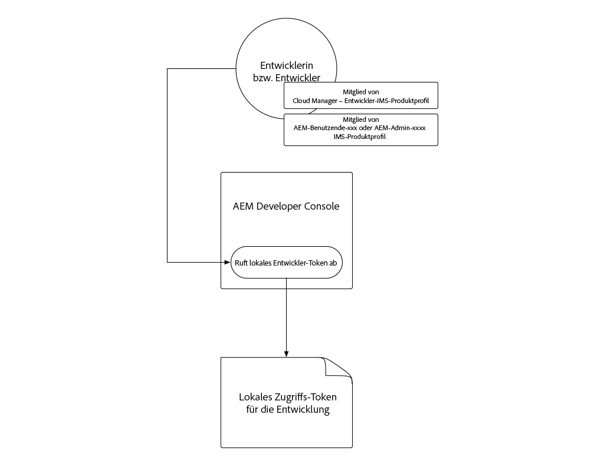
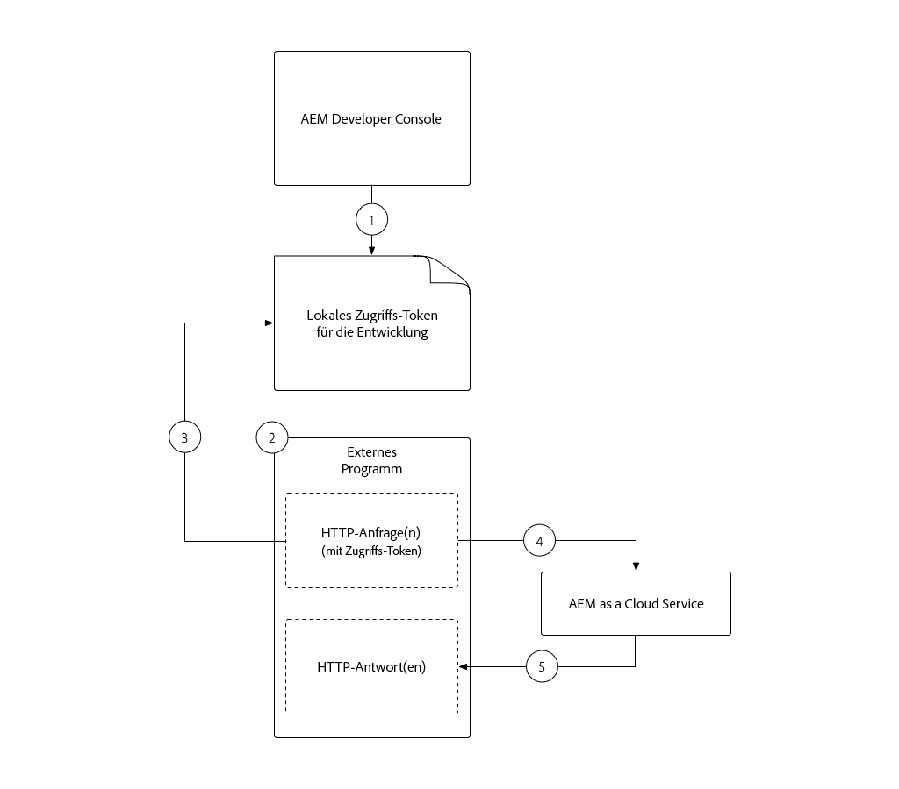
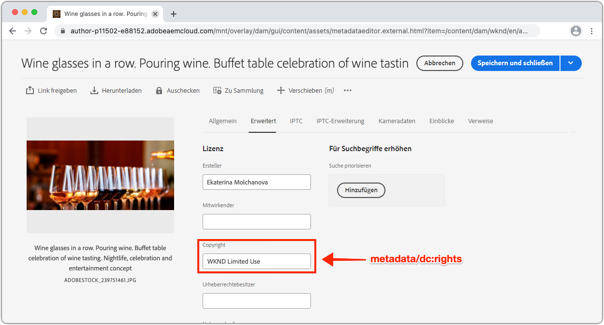

# Zugriffstoken für lokale Entwicklung

Entwickler, die Integrationen erstellen, für die ein programmatischer Zugriff auf AEM als Cloud Service erforderlich ist, benötigen eine einfache, schnelle Möglichkeit, temporäre Zugriffstoken für AEM zu erhalten, um Aktivitäten für die lokale Entwicklung zu erleichtern. Um diese Anforderung zu erfüllen, ermöglicht AEM Developer Console Entwicklern, selbst temporäre Zugriffstoken zu erstellen, die für den programmgesteuerten Zugriff auf AEM verwendet werden können.

>[!VIDEO](https://video.tv.adobe.com/v/330477/?quality=12&learn=on)

## Zugriffstoken für lokale Entwicklung erstellen



Das Zugriffstoken für lokale Entwicklung bietet Zugriff auf die AEM Author- und Veröffentlichungsdienste als Benutzer, der das Token generiert hat, zusammen mit den Berechtigungen. Geben Sie dieses Token nicht frei, obwohl es sich hierbei um ein Entwicklungstoken handelt, oder speichern Sie es im Quellcode-Steuerelement.

1. Vergewissern Sie sich in [Adobe Admin Console](https://adminconsole.adobe.com/), dass Sie, der Entwickler, Mitglied von:
   + __Cloud Manager -__ DeveloperIMS Product Profil (gewährt Zugriff auf AEM Developer Console)
   + Entweder das Profil __AEM Administratoren__ oder __AEM Benutzer__ IMS-Produkt für den Dienst der AEM Umgebung, in das das Zugriffstoken integriert wird
   + Sandbox-AEM als Cloud Service-Umgebung erfordern nur eine Mitgliedschaft im __AEM-Profil &quot;Administratoren__&quot;oder __AEM Benutzer__
1. Melden Sie sich bei [Adobe Cloud Manager](https://my.cloudmanager.adobe.com) an
1. Öffnen Sie das Programm mit dem AEM als Cloud Service-Umgebung, die in
1. Tippen Sie auf das Auslassungszeichen __neben der Umgebung im Abschnitt__ Umgebung __und wählen Sie__ Developer Console ____
1. Tippen Sie auf die Registerkarte __Integrationen__
1. Tippen Sie auf die Schaltfläche __Lokales Entwicklungstoken abrufen__
1. Tippen Sie auf die Schaltfläche __Herunterladen__ in der oberen linken Ecke, um die JSON-Datei mit dem Wert `accessToken` herunterzuladen und die JSON-Datei an einem sicheren Speicherort auf Ihrem Entwicklungscomputer zu speichern.
   + Dies ist Ihr 24-Stunden-Entwickler-Zugriffstoken für die AEM als Cloud Service-Umgebung.


## Das Zugriffstoken Lokale Entwicklung{#use-local-development-access-token}



1. Laden Sie das temporäre Zugriffstoken für lokale Entwicklung von AEM Developer Console herunter
   + Das Zugriffstoken für lokale Entwicklung läuft alle 24 Stunden ab, sodass Entwickler täglich neue Zugriffstoken herunterladen müssen
1. Es wird eine externe Anwendung entwickelt, die programmgesteuert mit AEM als Cloud Service interagiert
1. Die externe Anwendung liest sich im Zugriffstoken &quot;Lokale Entwicklung&quot;
1. Die externe Anwendung erstellt HTTP-Anforderungen AEM als Cloud Service und fügt dem Autorisierungs-Header der HTTP-Anforderungen das Zugriffstoken &quot;Lokale Entwicklung&quot;als Platzhalter-Token hinzu
1. AEM wenn ein Cloud Service die HTTP-Anforderung empfängt, die Anforderung authentifiziert, die von der HTTP-Anforderung angeforderte Arbeit ausführt und eine HTTP-Antwort an die externe Anwendung zurückgibt

### Die externe Beispielanwendung

Wir erstellen eine einfache externe JavaScript-Anwendung, um zu veranschaulichen, wie der programmgesteuerte Zugriff auf AEM als Cloud Service über HTTPS mithilfe des lokalen Developer-Zugriffstokens erfolgt. Dies veranschaulicht, wie _beliebige Anwendungen oder Systeme, die außerhalb von AEM ausgeführt werden, unabhängig von Framework oder Sprache, das Zugriffstoken verwenden können, um sich programmgesteuert für AEM als Cloud Service zu authentifizieren und darauf zuzugreifen._ Im nächsten Abschnitt [werden wir diesen Anwendungscode aktualisieren, um den Ansatz zum Generieren eines Tokens für die Verwendung in der Produktion zu unterstützen.](./service-credentials.md)

Diese Beispielanwendung wird über die Befehlszeile ausgeführt und aktualisiert AEM Asset-Metadaten mithilfe von AEM Assets HTTP-APIs wie folgt:

1. Liest in Parametern über die Befehlszeile (`getCommandLineParams()`)
1. Ruft das Zugriffstoken ab, mit dem sich AEM als Cloud Service authentifizieren (`getAccessToken(...)`)
1. Liste aller Assets in einem AEM Asset-Ordner, der in einem Befehlszeilenparameter (`listAssetsByFolder(...)`) angegeben ist
1. Aktualisieren Sie die Metadaten der aufgelisteten Assets mit Werten, die in den Befehlszeilenparametern (`updateMetadata(...)`) angegeben sind.

Das Schlüsselelement bei der programmatischen Authentifizierung für AEM mithilfe des Zugriffstokens ist das Hinzufügen eines HTTP-Anforderungsheaders für die Autorisierung zu allen an AEM gerichteten HTTP-Anforderungen im folgenden Format:

+ `Authorization: Bearer ACCESS_TOKEN`

## Ausführen der externen Anwendung

1. Stellen Sie sicher, dass [Node.js](/help/cloud-service/local-development-environment/development-tools.md?lang=en#node-js) auf Ihrem lokalen Entwicklungscomputer installiert ist, auf dem die externe Anwendung ausgeführt wird.
1. Laden Sie die externe Beispielanwendung [herunter und dekomprimieren Sie sie.](./assets/aem-guides_token-authentication-external-application.zip)
1. Führen Sie in der Befehlszeile im Ordner dieses Projekts `npm install` aus
1. Kopieren Sie das heruntergeladene Zugriffstoken für lokale Entwicklung [in eine Datei mit dem Namen `local_development_token.json` im Stammordner des Projekts](#download-local-development-access-token)
   + Aber denken Sie daran, nie eine Anmeldedaten zu Git!
1. Öffnen Sie `index.js` und überprüfen Sie den Code und die Kommentare der externen Anwendung.

   ```javascript
   const fetch = require('node-fetch');
   const fs = require('fs');
   const auth = require('@adobe/jwt-auth');
   
   // The root context of the Assets HTTP API
   const ASSETS_HTTP_API = '/api/assets';
   
   // Command line parameters
   let params = { };
   
   /**
   * Application entry point function
   */
   (async () => {
       console.log('Example usage: node index.js aem=https://author-p1234-e5678.adobeaemcloud.com propertyName=metadata/dc:rights "propertyValue=WKND Limited Use" folder=/wknd/en/adventures/napa-wine-tasting file=credentials-file.json' );
   
       // Parse the command line parameters
       params = getCommandLineParams();
   
       // Set the access token to be used in the HTTP requests to be local development access token
       params.accessToken = await getAccessToken(params.developerConsoleCredentials);
   
       // Get a list of all the assets in the specified assets folder
       let assets = await listAssetsByFolder(params.folder);
   
       // For each asset, update it's metadata
       await assets.forEach(asset => updateMetadata(asset, { 
           [params.propertyName]: params.propertyValue 
       }));
   })();
   
   /**
   * Returns a list of Assets HTTP API asset URLs that reference the assets in the specified folder.
   * 
   * https://experienceleague.adobe.com/docs/experience-manager-cloud-service/assets/admin/mac-api-assets.html?lang=en#retrieve-a-folder-listing
   * 
   * @param {*} folder the Assets HTTP API folder path (less the /content/dam path prefix)
   */
   async function listAssetsByFolder(folder) {
       return fetch(`${params.aem}${ASSETS_HTTP_API}${folder}.json`, {
               method: 'get',
               headers: { 
                   'Content-Type': 'application/json',
                   'Authorization': 'Bearer ' + params.accessToken // Provide the AEM access token in the Authorization header
               },
           })
           .then(res => {
               console.log(`${res.status} - ${res.statusText} @ ${params.aem}${ASSETS_HTTP_API}${folder}.json`);
   
               // If success, return the JSON listing assets, otherwise return empty results
               return res.status === 200 ? res.json() : { entities: [] };
           })
           .then(json => { 
               // Returns a list of all URIs for each non-content fragment asset in the folder
               return json.entities
                   .filter((entity) => entity['class'].indexOf('asset/asset') === -1 && !entity.properties.contentFragment)
                   .map(asset => asset.links.find(link => link.rel.find(r => r === 'self')).href);
           });
   }
   
   /**
   * Update the metadata of an asset in AEM
   * 
   * https://experienceleague.adobe.com/docs/experience-manager-cloud-service/assets/admin/mac-api-assets.html?lang=en#update-asset-metadata
   * 
   * @param {*} asset the Assets HTTP API asset URL to update
   * @param {*} metadata the metadata to update the asset with
   */
   async function updateMetadata(asset, metadata) {        
       await fetch(`${asset}`, {
               method: 'put',
               headers: { 
                   'Content-Type': 'application/json',
                   'Authorization': 'Bearer ' + params.accessToken // Provide the AEM access token in the Authorization header
               },
               body: JSON.stringify({
                   class: 'asset',
                   properties: metadata
               })
           })
           .then(res => { 
               console.log(`${res.status} - ${res.statusText} @ ${asset}`);
           });
   }
   
   /**
   * Parse and return the command line parameters. Expected params are:
   * 
   * - aem = The AEM as a Cloud Service hostname to connect to.
   *              Example: https://author-p12345-e67890.adobeaemcloud.com
   * - folder = The asset folder to update assets in. Note that the Assets HTTP API do NOT use the JCR `/content/dam` path prefix.
   *              Example: '/wknd/en/adventures/napa-wine-tasting'
   * - propertyName = The asset property name to update. Note this is relative to the [dam:Asset]/jcr:content node of the asset.
   *              Example: metadata/dc:rights
   * - propertyValue = The value to update the asset property (specified by propertyName) with.
   *              Example: "WKND Free Use"
   * - file = The path to the JSON file that contains the credentials downloaded from AEM Developer Console
   *              Example: local_development_token_cm_p1234-e5678.json 
   */
   function getCommandLineParams() {
       let parameters = {};
   
       // Parse the command line params, splitting on the = delimiter
       for (let i = 2; i < process.argv.length; i++) {
           let key = process.argv[i].split('=')[0];
           let value = process.argv[i].split('=')[1];
   
           parameters[key] = value;
       };
   
       // Read in the credentials from the provided JSON file
       if (parameters.file) {
           parameters.developerConsoleCredentials = JSON.parse(fs.readFileSync(parameters.file));
       }
   
       console.log(parameters);
   
       return parameters;
   }
   
   async function getAccessToken(developerConsoleCredentials) {s
       if (developerConsoleCredentials.accessToken) {
           // This is a Local Development access token
           return developerConsoleCredentials.accessToken;
       } 
   }
   ```

   Überprüfen Sie die `fetch(..)`-Aufrufe in den `listAssetsByFolder(...)`- und `updateMetadata(...)`-Aufrufen und `headers` definieren Sie den `Authorization`-HTTP-Anforderungsheader mit dem Wert `Bearer ACCESS_TOKEN`. So authentifiziert sich die HTTP-Anforderung, die von der externen Anwendung stammt, als Cloud Service AEM.

   ```javascript
   ...
   return fetch(`${params.aem}${ASSETS_HTTP_API}${folder}.json`, {
               method: 'get',
               headers: { 
                   'Content-Type': 'application/json',
                   'Authorization': 'Bearer ' + params.accessToken // Provide the AEM access token in the Authorization header
               },
   })...
   ```

   Alle HTTP-Anforderungen, die als Cloud Service AEM werden sollen, müssen das Zugriffstoken &quot;Inhaber&quot;im Autorisierungs-Header festlegen. Denken Sie daran, jeder AEM als Cloud Service-Umgebung erfordert sein eigenes Zugriffstoken. Entwicklungs-Zugriffstoken wird nicht auf Stage oder Produktion funktionieren, Stage&#39;s wird nicht auf Entwicklung oder Produktion und Produktion funktioniert nicht auf Entwicklung oder Stage!

1. Führen Sie mithilfe der Befehlszeile aus dem Stammverzeichnis des Projekts die Anwendung aus und übergeben Sie die folgenden Parameter:

   ```shell
   $ node index.js \
       aem=https://author-p1234-e5678.adobeaemcloud.com \
       folder=/wknd/en/adventures/napa-wine-tasting \
       propertyName=metadata/dc:rights \
       propertyValue="WKND Limited Use" \
       file=local_development_token.json
   ```

   Die folgenden Parameter werden übergeben:

   + `aem`: Das Schema und der Hostname des AEM als Umgebung des Cloud Service, mit dem der Antrag interagiert (z. B.  `https://author-p1234-e5678.adobeaemcloud.com`).
   + `folder`: Der Pfad des Asset-Ordners, dessen Assets mit dem  `propertyValue`aktualisiert werden; Fügen Sie NICHT das  `/content/dam` Präfix hinzu (z. B.  `/wknd/en/adventures/napa-wine-tasting`)
   + `propertyName`: Der Name der zu aktualisierenden Asset-Eigenschaft relativ zu  `[dam:Asset]/jcr:content` (z. B.  `metadata/dc:rights`).
   + `propertyValue`: Der Wert,  `propertyName` auf den der Wert festgelegt wird. Werte mit Leerzeichen müssen mit  `"` (z. B.  `"WKND Limited Use"`)
   + `file`: Der relative Dateipfad zur JSON-Datei, die von AEM Developer Console heruntergeladen wurde.

   Eine erfolgreiche Ausführung der Anwendungsergebnisausgabe für jedes aktualisierte Asset:

   ```shell
   200 - OK @ https://author-p1234-e5678.adobeaemcloud.com/api/assets/wknd/en/adventures/napa-wine-tasting.json
   200 - OK @ https://author-p1234-e5678.adobeaemcloud.com/api/assets/wknd/en/adventures/napa-wine-tasting/AdobeStock_277654931.jpg.json
   200 - OK @ https://author-p1234-e5678.adobeaemcloud.com/api/assets/wknd/en/adventures/napa-wine-tasting/AdobeStock_239751461.jpg.json
   200 - OK @ https://author-p1234-e5678.adobeaemcloud.com/api/assets/wknd/en/adventures/napa-wine-tasting/AdobeStock_280313729.jpg.json
   200 - OK @ https://author-p1234-e5678.adobeaemcloud.com/api/assets/wknd/en/adventures/napa-wine-tasting/AdobeStock_286664352.jpg.json
   ```

### Überprüfen der Metadaten-Aktualisierung in AEM

Überprüfen Sie, ob die Metadaten aktualisiert wurden, indem Sie sich bei der AEM als Cloud Service-Umgebung anmelden (stellen Sie sicher, dass auf denselben Host zugegriffen wird, der an den Befehlszeilenparameter `aem` weitergeleitet wird).

1. Melden Sie sich bei der AEM als Cloud Service-Umgebung an, mit der die externe Anwendung interagiert hat (verwenden Sie denselben Host, der im Befehlszeilenparameter `aem` bereitgestellt wird)
1. Navigieren Sie zum Ordner __Assets__ > __Dateien__
1. Navigieren Sie zu dem Asset-Ordner, der vom Befehlszeilenparameter `folder` angegeben wird, z. B. __WKND__ > __Englisch__ > __Abenteuer__ > __Napa Wine Testing__
1. Öffnen Sie das Element __Properties__ für alle (Nicht-Inhaltsfragment) im Ordner
1. Tippen Sie auf die Registerkarte __Erweitert__
1. Überprüfen Sie den Wert der aktualisierten Eigenschaft, z. B. __Copyright__, der der aktualisierten `metadata/dc:rights` JCR-Eigenschaft zugeordnet wird, die den Wert widerspiegelt, der im Parameter `propertyValue` angegeben wird, z. B. __WKND Eingeschränkte Verwendung__



## Nächste Schritte

Da wir nun mit dem lokalen Entwicklungstoken programmatisch auf AEM als Cloud Service zugegriffen haben, müssen wir die Anwendung aktualisieren, um mit Dienstanmeldeinformationen umzugehen, damit diese Anwendung in einem Produktionskontext verwendet werden kann.

+ [Verwendung von Dienstberechtigungen](./service-credentials.md)
