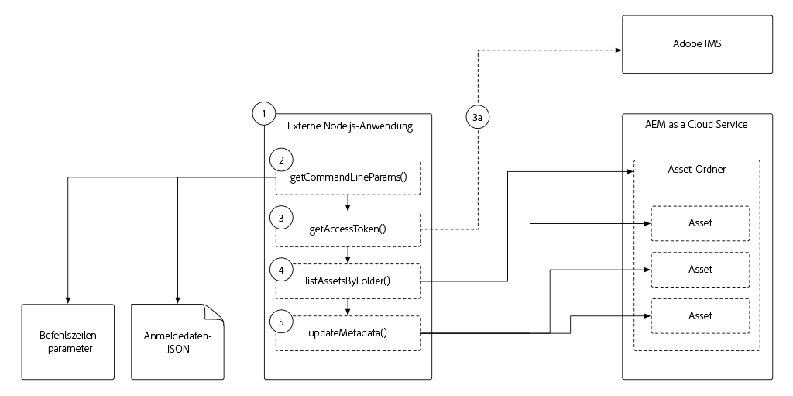

# Token-basierte Authentifizierung als Cloud Service AEM

In diesem Tutorial sollten Sie genau untersuchen, wie eine externe Anwendung programmgesteuert authentifizieren und mit AEM als Cloud Service über HTTP mithilfe von Zugriffstoken interagieren kann.

>[!VIDEO](https://video.tv.adobe.com/v/330460/?quality=12&learn=on)

## Voraussetzungen

Stellen Sie sicher, dass folgende Elemente vorhanden sind, bevor Sie mit diesem Lernprogramm beginnen:

1. Zugriff auf mich AEM als Cloud Service-Umgebung (vorzugsweise eine Umgebung zur Entwicklung oder ein Sandbox-Programm)
1. Mitgliedschaft im AEM als Authoring-Dienst der Umgebung AEM Administrator Product Profil
1. Mitgliedschaft in oder Zugriff auf Ihre Adobe IMS Organisg Administrator (sie müssen eine einmalige Initialisierung der [Dienstanmeldeinformationen](./service-credentials.md) durchführen))
1. Die neueste [WKND-Site](https://github.com/adobe/aem-guides-wknd) wurde auf Ihrer Cloud Service-Umgebung bereitgestellt

## Überblick über externe Anwendungen

Dieses Lernprogramm verwendet eine [einfache Node.js-Anwendung](./assets/aem-guides_token-authentication-external-application.zip), die von der Befehlszeile ausgeführt wird, um Asset-Metadaten auf AEM als Cloud Service mit der [Assets HTTP-API](https://experienceleague.adobe.com/docs/experience-manager-cloud-service/assets/admin/mac-api-assets.html?lang=de) zu aktualisieren.

Der Ausführungsfluss der Node.js-Anwendung lautet wie folgt:

1. Die Anwendung Node.js wird über die Befehlszeile aufgerufen
1. Befehlszeilenparameter definieren:
   + Der AEM als Cloud Service-Autorendiensthost, mit dem eine Verbindung hergestellt werden soll (`aem`)
   + Der AEM Asset-Ordner, dessen Assets aktualisiert werden (`folder`)
   + Die zu aktualisierende Metadateneigenschaft und der zu aktualisierende Wert (`propertyName` und `propertyValue`)
   + Der lokale Pfad zur Datei mit den erforderlichen Berechtigungen für den Zugriff auf AEM als Cloud Service (`file`)
1. Das Zugriffstoken, mit dem AEM authentifiziert wird, stammt aus der JSON-Datei, die über den Befehlszeilenparameter `file` bereitgestellt wird.

   a. Wenn die für die nicht-lokale Entwicklung verwendeten Dienstberechtigungen in der JSON-Datei (`file`) bereitgestellt werden, wird das Zugriffstoken aus der Adobe IMS-APIs abgerufen
1. Die Anwendung verwendet das Zugriffstoken, um auf alle Assets im Ordner zuzugreifen, die im Befehlszeilenparameter `folder` angegeben sind, und sie Liste.
1. Für jedes Asset im Ordner aktualisiert die Anwendung die Metadaten auf Grundlage des Eigenschaftsnamens und des Wertes, die in den Befehlszeilenparametern `propertyName` und `propertyValue` angegeben sind.

Während diese Beispielanwendung Node.js ist, können diese Interaktionen mit unterschiedlichen Programmiersprachen entwickelt und von anderen externen Systemen ausgeführt werden.

## Zugriffstoken für lokale Entwicklung

Lokale Entwicklungs-Zugriffstoken werden für eine bestimmte AEM als Cloud Service-Umgebung generiert und bieten Zugriff auf Autoren- und Veröffentlichungsdienste.  Diese Zugriffstoken sind temporär und dürfen nur bei der Entwicklung von externen Anwendungen oder Systemen verwendet werden, die mit AEM über HTTP interagieren. Statt dass Entwickler Bonafide-Service-Anmeldeinformationen erhalten und verwalten müssen, können sie schnell und einfach ein temporäres Zugriffstoken erstellen, das ihnen die Entwicklung ihrer Integration ermöglicht.

+ [Verwendung des Zugriffstokens &quot;Lokale Entwicklung&quot;](./local-development-access-token.md)

## Dienstberechtigungen

Dienstberechtigungen sind die Anmeldeinformationen, die in allen Szenarien ohne Entwicklungszweck - am offensichtlichsten bei der Produktion - verwendet werden, die eine externe Anwendung oder das System in die Lage versetzen, sich als Cloud Service über HTTP AEM zu authentifizieren und mit ihnen zu interagieren. Dienstanmeldeinformationen selbst werden nicht zur Authentifizierung an AEM gesendet, sondern die externe Anwendung verwendet diese, um eine JWT zu generieren, die mit Adobe IMS-APIs _für_ ein Zugriffstoken ausgetauscht wird, das dann zur Authentifizierung von HTTP-Anfragen für AEM als Cloud Service verwendet werden kann.

+ [Verwendung von Dienstberechtigungen](./service-credentials.md)

## Zusätzliche Ressourcen

+ [Beispielanwendung herunterladen](./assets/aem-guides_token-authentication-external-application.zip)
+ Andere Codebeispiele für die Erstellung und den Austausch von JWT
   + [Codebeispiele für Node.js, Java, Python, C#.NET und PHP](https://www.adobe.io/authentication/auth-methods.html#!AdobeDocs/adobeio-auth/master/JWT/samples/samples.md)
   + [JavaScript/Axios-basiertes Codebeispiel](https://github.com/adobe/aemcs-api-client-lib)
