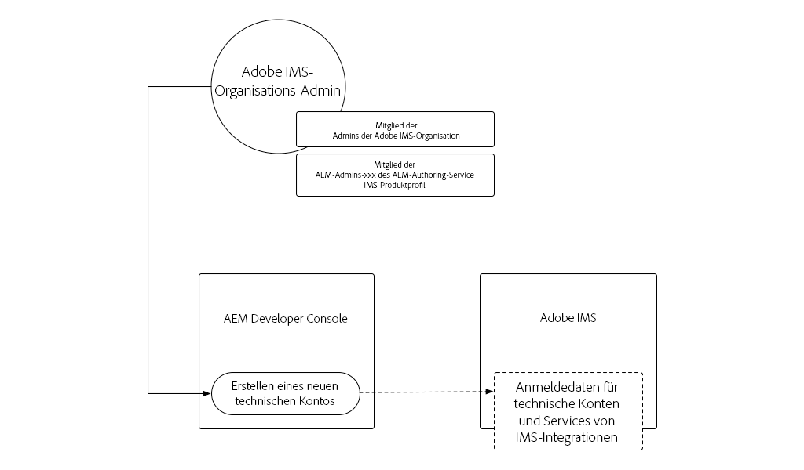
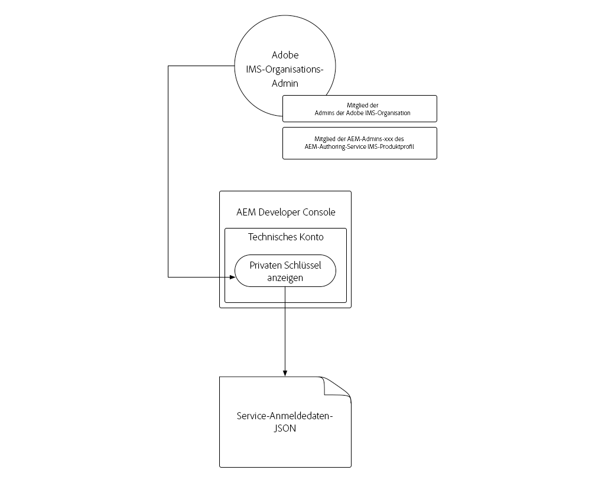
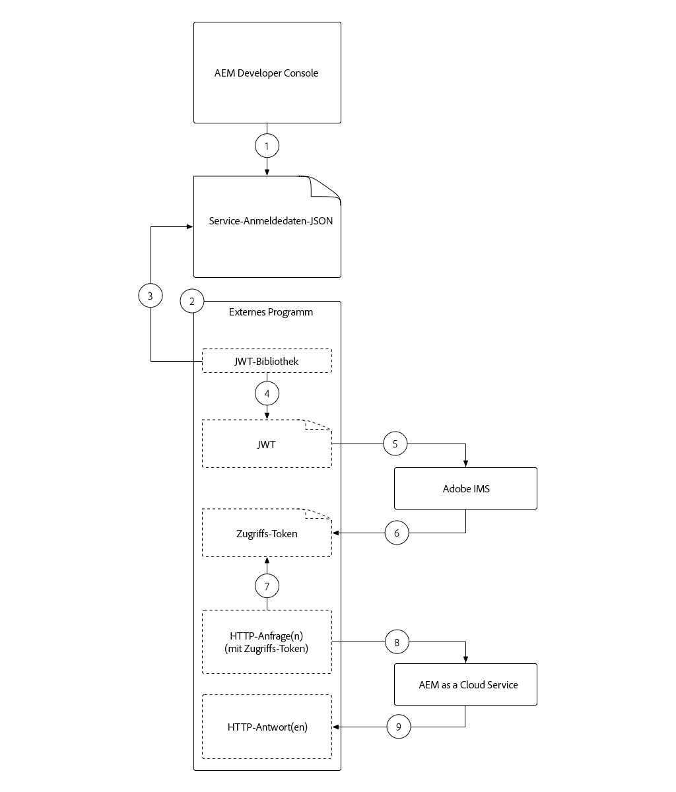
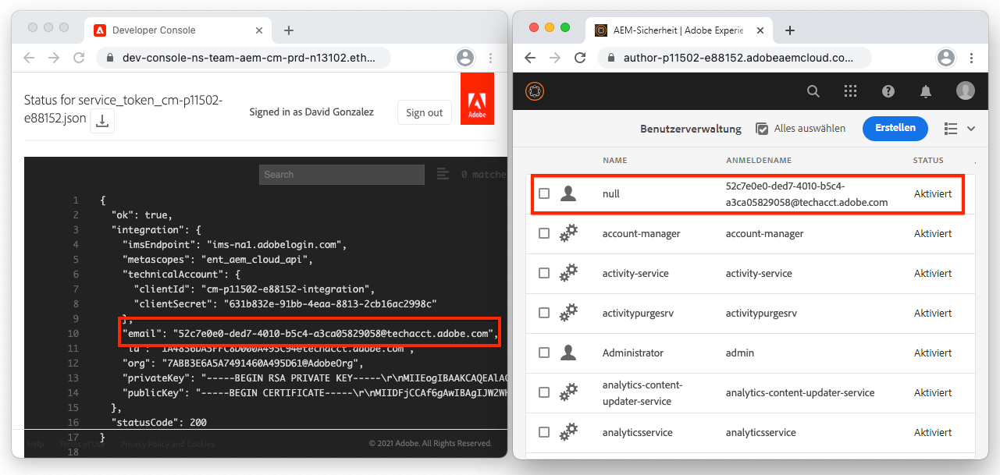
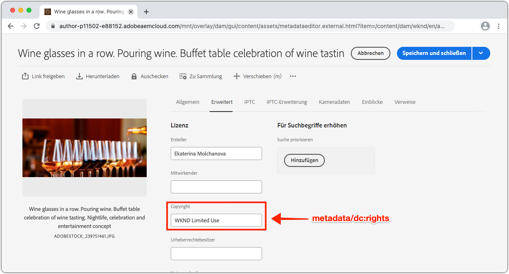

# Dienstberechtigungen

Integrationen mit AEM als Cloud Service müssen sicher authentifizieren können, um AEM. AEM Developer Console gewährt Zugriff auf Dienstanmeldeinformationen, mit denen externe Anwendungen, Systeme und Dienste programmgesteuert mit AEM Author- oder Publish-Diensten über HTTP interagieren können.

>[!VIDEO](https://video.tv.adobe.com/v/330460/?quality=12&learn=on)

Dienst-Anmeldeinformationen können ähnliche [Lokale Entwicklungs-Zugriffstoken](./local-development-access-token.md) erscheinen, sich jedoch in einigen wichtigen Punkten unterscheiden:

+ Dienstanmeldeinformationen sind _keine_-Zugriffstoken, sondern Anmeldeinformationen, die zum Abrufen von Zugriffstoken verwendet werden.
+ Dienstberechtigungen sind dauerhaft und ändern sich nur, wenn sie widerrufen werden, während Zugriffstoken für lokale Entwicklung täglich ablaufen.
+ Dienstberechtigungen für eine AEM als Cloud Service-Umgebung sind einem einzelnen AEM zugeordnet, während sich Zugriffstoken für lokale Entwicklung als AEM Benutzer authentifizieren, der das Zugriffstoken generiert hat.

## Dienstberechtigungen generieren

Die Generierung von Dienstanmeldeinformationen erfolgt in zwei Schritte:

1. Initialisierung einmaliger Dienstanmeldeinformationen durch einen IMS-Organisationsadministrator der Adobe
1. Herunterladen und Verwenden des JSON-Dienstes &quot;Dienstberechtigungen&quot;

### Initialisierung von Dienstanmeldeinformationen

Dienstberechtigungen erfordern im Gegensatz zu lokalen Entwicklungs-Zugriffstoken eine einmalige Initialisierung durch Ihren Adobe Org IMS Administrator, bevor sie heruntergeladen werden können.



__Dies ist eine einmalige Initialisierung pro AEM als Cloud Service-Umgebung__

1. Vergewissern Sie sich, dass Sie als Administrator Ihrer Adobe bei IMS Org angemeldet sind
1. Melden Sie sich bei [Adobe Cloud Manager](https://my.cloudmanager.adobe.com) an
1. Öffnen Sie das Programm mit dem AEM als Cloud Service-Umgebung, um die Konfiguration der Dienstberechtigungen für
1. Tippen Sie im Abschnitt __Umgebung__ auf das Auslassungszeichen neben der Umgebung und wählen Sie __Entwicklerkonsole__
1. Tippen Sie auf die Registerkarte __Integrationen__
1. Tippen Sie auf die Schaltfläche __Dienstanmeldeinformationen abrufen__
1. Die Dienstberechtigungen werden initialisiert und als JSON angezeigt


Sobald die Anmeldeinformationen der AEM als Cloud Service-Umgebung initialisiert wurden, können andere Benutzer sie herunterladen.

### Dienstberechtigungen herunterladen



Beim Herunterladen der Dienstberechtigungen werden dieselben Schritte wie bei der Initialisierung ausgeführt. Wenn die Initialisierung noch nicht erfolgt ist, wird dem Benutzer ein Fehler angezeigt, wenn er auf die Schaltfläche __Get Service Credentials__ tippt.

1. Vergewissern Sie sich, dass Sie Mitglied des IMS-Profils __Cloud Manager - Developer__ sind (das Zugriff auf AEM Developer Console gewährt)
   + Sandbox-AEM als Cloud Service-Umgebung erfordern nur eine Mitgliedschaft im __AEM-Profil &quot;Administratoren__&quot;oder __AEM Benutzer__
1. Melden Sie sich bei [Adobe Cloud Manager](https://my.cloudmanager.adobe.com) an
1. Öffnen Sie das Programm mit dem AEM als Cloud Service-Umgebung, die in
1. Tippen Sie im Abschnitt __Umgebung__ auf das Auslassungszeichen neben der Umgebung und wählen Sie __Entwicklerkonsole__
1. Tippen Sie auf die Registerkarte __Integrationen__
1. Tippen Sie auf die Schaltfläche __Dienstanmeldeinformationen abrufen__
1. Tippen Sie auf die Schaltfläche &quot;Herunterladen&quot;in der oberen linken Ecke, um die JSON-Datei mit dem Wert &quot;Dienstanmeldeinformationen&quot;herunterzuladen und die Datei an einem sicheren Speicherort zu speichern.
   + _Wenn diese Dienstberechtigungen beeinträchtigt sind, wenden Sie sich umgehend an den Support der Adobe, damit diese widerrufen werden._

## Dienstberechtigungen installieren

Die Dienstberechtigungen enthalten die erforderlichen Informationen zum Generieren einer JWT, die gegen ein Zugriffstoken getauscht wird, das zur Authentifizierung mit AEM als Cloud Service verwendet wird. Die Dienstberechtigungen müssen an einem sicheren Ort gespeichert werden, auf den die externen Anwendungen, Systeme oder Dienste, die sie für den Zugriff auf AEM verwenden, zugreifen können. Wie und wo die Dienstanmeldeinformationen verwaltet werden, ist für jeden Kunden eindeutig.

Aus Gründen der Einfachheit werden die Service-Anmeldeinformationen in diesem Lernprogramm über die Befehlszeile weitergeleitet. Arbeiten Sie jedoch mit Ihrem IT Security-Team zusammen, um zu verstehen, wie diese Anmeldeinformationen gemäß den Sicherheitsrichtlinien Ihres Unternehmens gespeichert und aufgerufen werden können.

1. Kopieren Sie die JSON-Datei [für Dienstberechtigungen in eine Datei mit dem Namen `service_token.json` im Stammordner des Projekts](#download-service-credentials)
   + Aber denken Sie daran, nie eine Anmeldedaten zu Git!

## Dienstberechtigungen verwenden

Die Dienstberechtigungen, ein vollständig geformtes JSON-Objekt, sind nicht mit dem JWT- oder dem Zugriffstoken identisch. Stattdessen werden die Dienstberechtigungen (die einen privaten Schlüssel enthalten) verwendet, um eine JWT zu generieren, die mit Adobe IMS APIs für ein Zugriffstoken ausgetauscht wird.



1. Dienstberechtigungen von AEM Developer Console an einen sicheren Speicherort herunterladen
1. Eine externe Anwendung muss programmgesteuert mit AEM als Cloud Service-Umgebung interagieren
1. Die externe Anwendung liest in den Dienstberechtigungen von einem sicheren Speicherort aus
1. Die externe Anwendung verwendet Informationen aus den Dienstberechtigungen, um ein JWT-Token zu erstellen.
1. Das JWT-Token wird an die Adobe IMS gesendet, um ein Zugriffstoken auszutauschen
1. Adobe IMS gibt ein Zugriffstoken zurück, das verwendet werden kann, um auf AEM als Cloud Service zuzugreifen
   + Für Zugriffstoken kann ein Ablaufdatum beantragt werden. Es ist am besten, das Zugriffstoken kurz zu halten und bei Bedarf zu aktualisieren.
1. Die externe Anwendung stellt HTTP-Anforderungen an AEM als Cloud Service und fügt das Zugriffstoken als Platzhalter-Token zum Autorisierungs-Header der HTTP-Anforderungen hinzu.
1. AEM wenn ein Cloud Service die HTTP-Anforderung empfängt, die Anforderung authentifiziert, die von der HTTP-Anforderung angeforderte Arbeit ausführt und eine HTTP-Antwort an die externe Anwendung zurückgibt

### Aktualisierungen der externen Anwendung

Für den Zugriff auf AEM als Cloud Service mit den Dienstanmeldeinformationen muss unsere externe Anwendung auf drei Arten aktualisiert werden:

1. Lesen Sie die Informationen in den Dienstanmeldeinformationen.
   + Aus Gründen der Einfachheit lesen wir diese aus der heruntergeladenen JSON-Datei. In realen Anwendungsszenarien müssen jedoch die Dienstberechtigungen gemäß den Sicherheitsrichtlinien Ihres Unternehmens sicher gespeichert werden
1. Erstellen einer JWT aus den Dienstberechtigungen
1. JWT gegen ein Zugriffstoken austauschen
   + Wenn Dienstberechtigungen vorhanden sind, verwendet unsere externe Anwendung dieses Zugriffstoken anstelle des Zugriffstokens für lokale Entwicklung, wenn sie auf AEM als Cloud Service zugreift

In diesem Lernprogramm wird das Modul `@adobe/jwt-auth` npm der Adobe verwendet, um sowohl (1) die JWT aus den Dienstanmeldeinformationen zu generieren, als auch (2) sie in einem Funktionsaufruf für ein Zugriffstoken auszutauschen. Wenn Ihre Anwendung nicht auf JavaScript basiert, lesen Sie bitte den [Beispielcode in anderen Sprachen](https://www.adobe.io/authentication/auth-methods.html#!AdobeDocs/adobeio-auth/master/JWT/samples/samples.md), um zu erfahren, wie Sie eine JWT aus den Dienstanmeldeinformationen erstellen, und tauschen Sie sie gegen ein Zugriffstoken mit der Adobe IMS aus.

## Lesen Sie die Dienstanmeldeinformationen.

Überprüfen Sie die Datei `getCommandLineParams()` und sehen Sie, dass wir die JSON-Dateien für Dienstanmeldeinformationen mit demselben Code lesen können, der im JSON-Zugriffstoken für lokale Entwicklung verwendet wurde.

```javascript
function getCommandLineParams() {
    ...

    // Read in the credentials from the provided JSON file
    // Since both the Local Development Access Token and Service Credentials files are JSON, this same approach can be re-used
    if (parameters.file) {
        parameters.developerConsoleCredentials = JSON.parse(fs.readFileSync(parameters.file));
    }

    ...
    return parameters;
}
```

## Erstellen einer JWT und Austauschen eines Zugriffstokens

Sobald die Dienstberechtigungen gelesen wurden, werden sie zum Generieren einer JWT verwendet, die dann mit der Adobe IMS-APIs für ein Zugriffstoken ausgetauscht wird, das dann zum Zugriff auf AEM als Cloud Service verwendet werden kann.

Diese Beispielanwendung basiert auf Node.js. Daher sollten Sie das Modul [@adobe/jwt-auth](https://www.npmjs.com/package/@adobe/jwt-auth) npm verwenden, um die (1) JWT-Erstellung und den (20) Austausch mit Adobe IMS zu erleichtern. Wenn Ihre Anwendung in einer anderen Sprache entwickelt wurde, lesen Sie bitte [die entsprechenden Codebeispiele](https://www.adobe.io/authentication/auth-methods.html#!AdobeDocs/adobeio-auth/master/JWT/samples/samples.md), wie die HTTP-Anforderung zur Adobe von IMS mit anderen Programmiersprachen erstellt wird.

1. Aktualisieren Sie `getAccessToken(..)`, um den Inhalt der JSON-Datei zu überprüfen und festzustellen, ob sie ein lokales Entwicklungs-Zugriffstoken oder eine Dienstberechtigung darstellt. Dies lässt sich leicht erreichen, indem geprüft wird, ob die `.accessToken`-Eigenschaft vorhanden ist, die nur für das Local Development Zugriffstoken JSON vorhanden ist.

Wenn Dienstberechtigungen angegeben sind, generiert die Anwendung eine JWT und tauscht sie mit der Adobe IMS gegen ein Zugriffstoken aus. Wir verwenden die [@adobe/jwt-auth](https://www.npmjs.com/package/@adobe/jwt-auth)-Funktion `auth(...)`, die beide eine JWT generiert und sie in einem Funktionsaufruf gegen ein Zugriffstoken eintauscht.  Die Parameter für `auth(..)` sind ein [JSON-Objekt, das aus spezifischen Informationen](https://www.npmjs.com/package/@adobe/jwt-auth#config-object) besteht, die im JSON-Dienst &quot;Dienstberechtigungen&quot;verfügbar sind, wie unten im Code beschrieben.

```javascript
 async function getAccessToken(developerConsoleCredentials) {

     if (developerConsoleCredentials.accessToken) {
         // This is a Local Development access token
         return developerConsoleCredentials.accessToken;
     } else {
         // This is the Service Credentials JSON object that must be exchanged with Adobe IMS for an access token
         let serviceCredentials = developerConsoleCredentials.integration;

         // Use the @adobe/jwt-auth library to pass the service credentials generated a JWT and exchange that with Adobe IMS for an access token.
         // If other programming languages are used, please see these code samples: https://www.adobe.io/authentication/auth-methods.html#!AdobeDocs/adobeio-auth/master/JWT/samples/samples.md
         let { access_token } = await auth({
             clientId: serviceCredentials.technicalAccount.clientId, // Client Id
             technicalAccountId: serviceCredentials.id,              // Technical Account Id
             orgId: serviceCredentials.org,                          // Adobe IMS Org Id
             clientSecret: serviceCredentials.technicalAccount.clientSecret, // Client Secret
             privateKey: serviceCredentials.privateKey,              // Private Key to sign the JWT
             metaScopes: serviceCredentials.metascopes.split(','),   // Meta Scopes defining level of access the access token should provide
             ims: `https://${serviceCredentials.imsEndpoint}`,       // IMS endpoint used to obtain the access token from
         });

         return access_token;
     }
 }
```

    Je nachdem, welche JSON-Datei - entweder das Local Development Zugriffstoken JSON oder das Service Credentials JSON - über diesen Kommandozeilenparameter &quot;file&quot;weitergegeben wird, leitet die Anwendung nun ein Zugriffstoken ab.
    
    Denken Sie daran, dass die Dienstberechtigungen zwar nicht ablaufen, JWT und das entsprechende Zugriffstoken dies jedoch tun und 12 Stunden nach der Ausgabe aktualisiert werden müssen. Dies kann mithilfe eines &quot;refresh_token&quot;[bereitgestellt von Adobe IMS](https://www.adobe.io/authentication/auth-methods.html#!AdobeDocs/adobeio-auth/master/OAuth/OAuth.md#access-tokens) erfolgen.

1. Nachdem diese Änderungen vorgenommen wurden und die JSON-Datei &quot;Dienstberechtigungen&quot;von der AEM Developer Console heruntergeladen wurde (und aus Gründen der Einfachheit im Ordner `service_token.json` mit diesem `index.js` gespeichert wurde), führen Sie die Anwendung aus, die den Befehlszeilenparameter `file` durch `service_token.json` ersetzt, und aktualisieren Sie `propertyValue` auf einen neuen Wert, damit die Auswirkungen in AEM sichtbar werden.

   ```shell
   $ node index.js \
       aem=https://author-p1234-e5678.adobeaemcloud.com \
       folder=/wknd/en/adventures/napa-wine-tasting \
       propertyName=metadata/dc:rights \
       propertyValue="WKND Restricted Use" \
       file=service_token.json
   ```

   Die Ausgabe an das Terminal sieht wie folgt aus:

   ```shell
   200 - OK @ https://author-p1234-e5678.adobeaemcloud.com/api/assets/wknd/en/adventures/napa-wine-tasting.json
   403 - Forbidden @ https://author-p1234-e5678.adobeaemcloud.com/api/assets/wknd/en/adventures/napa-wine-tasting/AdobeStock_277654931.jpg.json
   403 - Forbidden @ https://author-p1234-e5678.adobeaemcloud.com/api/assets/wknd/en/adventures/napa-wine-tasting/AdobeStock_239751461.jpg.json
   403 - Forbidden @ https://author-p1234-e5678.adobeaemcloud.com/api/assets/wknd/en/adventures/napa-wine-tasting/AdobeStock_280313729.jpg.json
   403 - Forbidden @ https://author-p1234-e5678.adobeaemcloud.com/api/assets/wknd/en/adventures/napa-wine-tasting/AdobeStock_286664352.jpg.json
   ```

   Die Zeilen __403 - Verboten__ weisen auf Fehler in den HTTP-API-Aufrufen hin, die AEM als Cloud Service ausführen. Diese 403 Verbotenen Fehler treten beim Versuch auf, die Metadaten der Assets zu aktualisieren.

   Der Grund dafür ist, dass das Zugriffstoken auf der Grundlage der Dienstanmeldeinformationen die Anforderung an die AEM mit einem automatisch erstellten AEM authentifiziert, das standardmäßig nur über Lesezugriff verfügt. Um die Anwendung Schreibzugriff auf AEM bereitzustellen, muss dem technischen Konto AEM dem Zugriffstoken zugewiesenen Benutzer AEM die Berechtigung erteilt werden.

## Zugriff in AEM konfigurieren

Das Zugriffstoken, das auf Dienstanmeldeinformationen basiert, verwendet ein technisches Konto AEM Benutzer, das Mitglied der Benutzergruppe AEM Mitarbeiter ist.



Sobald das technische Konto AEM Benutzer in AEM vorhanden ist (nach der ersten HTTP-Anforderung mit dem Zugriffstoken), können die Berechtigungen dieses AEM Benutzers wie andere AEM verwaltet werden.

1. Suchen Sie zunächst den AEM Namen des technischen Kontos, indem Sie die JSON-Datei für Dienstanmeldeinformationen öffnen, die Sie von AEM Developer Console heruntergeladen haben, und suchen Sie den `integration.email`-Wert, der wie folgt aussehen sollte: `12345678-abcd-9000-efgh-0987654321c@techacct.adobe.com`.
1. Melden Sie sich beim Autorendienst der entsprechenden AEM Umgebung als AEM Administrator an
1. Navigieren Sie zu __Tools__ > __Sicherheit__ > __Benutzer__
1. Suchen Sie den AEM Benutzer mit dem in Schritt 1 identifizierten Anmeldenamen __und öffnen Sie dessen__ Eigenschaften ____
1. Navigieren Sie zur Registerkarte __Gruppen__ und fügen Sie die Gruppe __DAM-Benutzer__ hinzu (die als Schreibzugriff auf Assets fungieren)
1. Tippen Sie auf __Speichern und Schließen__

Führen Sie die Anwendung erneut aus, wenn das technische Konto in AEM zum Zugriff auf Schreibberechtigungen für Assets berechtigt ist:

```shell
$ node index.js \
    aem=https://author-p1234-e5678.adobeaemcloud.com \
    folder=/wknd/en/adventures/napa-wine-tasting \
    propertyName=metadata/dc:rights \
    propertyValue="WKND Restricted Use" \
    file=service_token.json
```

Die Ausgabe an das Terminal sieht wie folgt aus:

```
200 - OK @ https://author-p1234-e5678.adobeaemcloud.com/api/assets/wknd/en/adventures/napa-wine-tasting.json
200 - OK @ https://author-p1234-e5678.adobeaemcloud.com/api/assets/wknd/en/adventures/napa-wine-tasting/AdobeStock_277654931.jpg.json
200 - OK @ https://author-p1234-e5678.adobeaemcloud.com/api/assets/wknd/en/adventures/napa-wine-tasting/AdobeStock_286664352.jpg.json
200 - OK @ https://author-p1234-e5678.adobeaemcloud.com/api/assets/wknd/en/adventures/napa-wine-tasting/AdobeStock_239751461.jpg.json
200 - OK @ https://author-p1234-e5678.adobeaemcloud.com/api/assets/wknd/en/adventures/napa-wine-tasting/AdobeStock_280313729.jpg.json
```

## Änderungen überprüfen

1. Melden Sie sich bei der AEM als Cloud Service-Umgebung an, die aktualisiert wurde (mit demselben Hostnamen, der im Befehlszeilenparameter `aem` angegeben wird)
1. Navigieren Sie zum Ordner __Assets__ > __Dateien__
1. Navigieren Sie zu dem Asset-Ordner, der vom Befehlszeilenparameter `folder` angegeben wird, z. B. __WKND__ > __Englisch__ > __Abenteuer__ > __Napa Wine Testing__
1. Öffnen Sie die __Eigenschaften__ für ein beliebiges Asset im Ordner
1. Navigieren Sie zur Registerkarte __Erweitert__
1. Überprüfen Sie den Wert der aktualisierten Eigenschaft, z. B. __Copyright__, der der aktualisierten `metadata/dc:rights` JCR-Eigenschaft zugeordnet wird, die nun den Wert widerspiegelt, der im Parameter `propertyValue` angegeben wurde, z. B. __Eingeschränkte Verwendung mit WKND__



## Dienstberechtigungen sperren


## Herzlichen Glückwunsch!

Jetzt, da wir programmatisch auf AEM als Cloud Service über ein örtliches Entwicklungs-Zugriffstoken zugegriffen haben, sowie ein produktionsfähiges Service-to-Service-Zugriffstoken!

