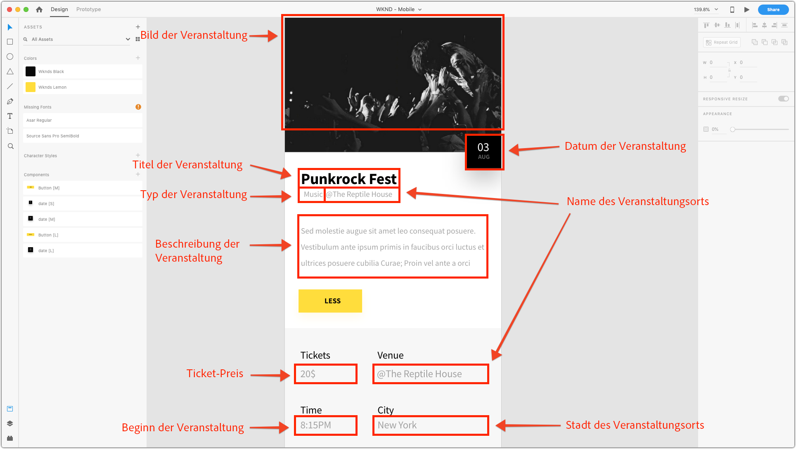
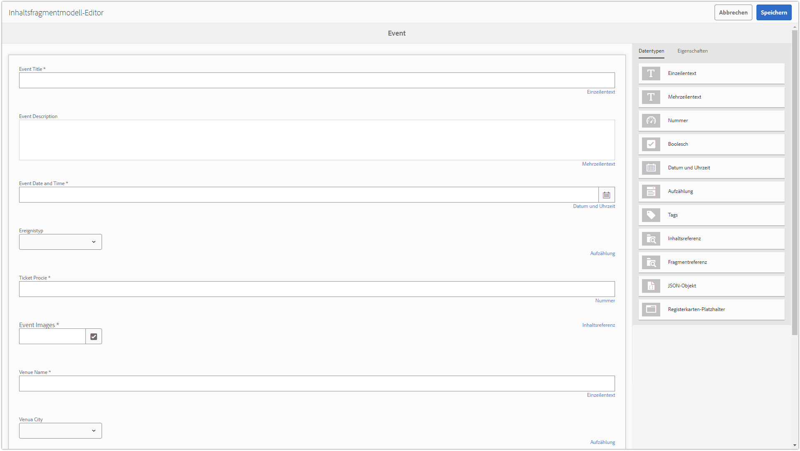

# Kapitel 2 - Verwendung von Inhaltsfragmentmodellen

AEM Inhaltsfragmentmodelle definieren Inhaltsschemata, mit denen die Erstellung von Rohinhalten durch AEM-Autoren in Vorlagen erstellt werden kann. Dieser Ansatz ähnelt der Strukturvorlage oder dem formularbasierten Authoring. Das Schlüsselkonzept mit Inhaltsfragmenten besteht darin, dass der erstellte Inhalt von der Präsentation unabhängig ist. Das bedeutet, dass er für die Verwendung über mehrere Kanäle vorgesehen ist. Dabei wird über die aufnehmende Anwendung, AEM, eine Einzelseitenanwendung oder eine Mobile App gesteuert, wie der Inhalt dem Benutzer angezeigt wird.

Das Hauptanliegen des Inhaltsfragments besteht darin, Folgendes sicherzustellen:

1. Der richtige Inhalt wird vom Autor erfasst
2. Der Inhalt kann in einem strukturierten und gut verständlichen Format für anspruchsvolle Anwendungen verfügbar gemacht werden.

In diesem Kapitel wird die Aktivierung und Definition von Inhaltsfragmentmodellen beschrieben, die zum Definieren einer normalisierten Datenstruktur und einer Authoring-Oberfläche für die Modellierung und Erstellung von &quot;Ereignissen&quot;verwendet werden.

## Aktivieren von Inhaltsfragmentmodellen  

Inhaltsfragmentmodelle **must** aktiviert über **[AEM [!UICONTROL Konfigurationsbrowser]](https://experienceleague.adobe.com/docs/experience-manager-cloud-service/implementing/developing/configurations.html?lang=de)**.

Wenn Inhaltsfragmentmodelle **not** für eine Konfiguration aktiviert ist, wird die **[!UICONTROL Erstellen] > [!UICONTROL Inhaltsfragment]** wird für die entsprechende AEM nicht angezeigt.

>[!NOTE]
>
>AEM Konfigurationen stellen einen Satz von [kontextsensitive Mandantenkonfigurationen](https://sling.apache.org/documentation/bundles/context-aware-configuration/context-aware-configuration.html) gespeichert unter `/conf`. Normalerweise korrelieren AEM Konfigurationen mit einer bestimmten Website, die in AEM Sites verwaltet wird, oder einer Geschäftseinheit, die für einen Inhaltsuntersatz (Assets, Seiten usw.) verantwortlich ist. in AEM.
>
>Damit sich eine Konfiguration auf eine Inhaltshierarchie auswirkt, muss die Konfiguration über das `cq:conf` -Eigenschaft in dieser Inhaltshierarchie. (Dies wird für die [!DNL WKND Mobile] Konfiguration in **Schritt 5** unten).
>
>Wenn die `global` -Konfiguration verwendet wird, gilt die Konfiguration für alle Inhalte und `cq:conf` nicht festgelegt werden.
>
>Weitere Informationen finden Sie in der Dokumentation zum [[!UICONTROL Konfigurationsbrowser].](https://experienceleague.adobe.com/docs/experience-manager-cloud-service/implementing/developing/configurations.html)

1. Melden Sie sich bei der AEM-Autoreninstanz als Benutzer mit entsprechenden Berechtigungen an, um die entsprechende Konfiguration zu ändern.
   * In diesem Tutorial wird die **admin** -Benutzer verwendet werden.
1. Navigieren Sie zu **[!UICONTROL Tool] > [!UICONTROL Allgemein] > [!UICONTROL Konfigurationsbrowser]**
1. Tippen Sie auf **Ordnersymbol** neben **[!DNL WKND Mobile]** , um auszuwählen, und tippen Sie dann auf **[!UICONTROL Bearbeiten] button** oben links.
1. Auswählen **[!UICONTROL Inhaltsfragmentmodelle]** und tippen Sie auf **[!UICONTROL Speichern und schließen]** oben rechts.

   Dies ermöglicht Inhaltsfragmentmodelle in Inhaltsstrukturen von Asset-Ordnern, die die [!DNL WKND Mobile] -Konfiguration angewendet.

   >[!NOTE]
   >
   >Diese Konfigurationsänderung kann nicht über die [!UICONTROL AEM] Web-Benutzeroberfläche. So machen Sie diese Konfiguration rückgängig:
   >    
   >    1. Öffnen Sie [CRXDE Lite](http://localhost:4502/crx/de)
   >    1. Navigieren Sie zu `/conf/wknd-mobile/settings/dam/cfm`
   >    1. Löschen Sie die `models` Knoten

   >    
   >Alle vorhandenen Inhaltsfragmentmodelle, die mit dieser Konfiguration erstellt wurden, werden gelöscht und ihre Definitionen werden unter `/conf/wknd-mobile/settings/dam/cfm/models`.

1. Wenden Sie die **[!DNL WKND Mobile]** -Konfiguration **[!DNL WKND Mobile]Asset-Ordner** , damit Inhaltsfragmente aus Inhaltsfragmentmodellen in dieser Assets-Ordnerhierarchie erstellt werden können:

   1. Navigieren Sie zu **[!UICONTROL AEM] > [!UICONTROL Assets] > [!UICONTROL Dateien]**
   1. Wählen Sie die **[!UICONTROL WKND Mobile] Ordner**
   1. Tippen Sie auf **[!UICONTROL Eigenschaften]** Schaltfläche in der oberen Aktionsleiste zum Öffnen [!UICONTROL Ordnereigenschaften]
   1. In [!UICONTROL Ordnereigenschaften]Tippen Sie auf die **[!UICONTROL Cloud Services]** tab
   1. Überprüfen Sie die **[!UICONTROL Cloud-Konfiguration]** -Feld auf **/conf/wknd-mobile**
   1. Tippen **[!UICONTROL Speichern und schließen]** oben rechts, um Änderungen beizubehalten

>[!VIDEO](https://video.tv.adobe.com/v/28336/?quality=12&learn=on)

>[!WARNING]
>
> __Inhaltsfragmentmodelle__ von __Tools > Assets__ nach __Tools > Allgemein__.

## Grundlagen zum Erstellen des Inhaltsfragmentmodells

Bevor wir das Inhaltsfragmentmodell definieren, sollten wir uns das Erlebnis ansehen, das wir durchführen werden, um sicherzustellen, dass wir alle erforderlichen Datenpunkte erfassen. Dazu werden wir das Design von Mobile Apps überprüfen und die Design-Elemente der Erfassung von Inhalten zuordnen.

Wir können die Datenpunkte, die ein Ereignis definieren, wie folgt aufschlüsseln:

Mit dem Mapping bewaffnet können wir das Inhaltsfragment definieren, das zur Erfassung und letztendlich zur Offenlegung der Ereignisdaten verwendet wird.

## Erstellen des Inhaltsfragmentmodells

1. Navigieren Sie zu **[!UICONTROL Instrumente] > [!UICONTROL Allgemein] > [!UICONTROL Inhaltsfragmentmodelle]**.
1. Tippen Sie auf **[!DNL WKND Mobile]** Ordner, der geöffnet werden soll.
1. Tippen **[!UICONTROL Erstellen]** , um den Assistenten zur Erstellung von Inhaltsfragmentmodellen zu öffnen.
1. Eingabe **[!DNL Event]** als **[!UICONTROL Modelltitel]** *(Beschreibung ist optional)* und tippen **[!UICONTROL Erstellen]** speichern.

>[!VIDEO](https://video.tv.adobe.com/v/28337/?quality=12&learn=on)

## Definieren der Struktur des Inhaltsfragmentmodells

1. Navigieren Sie zu **[!UICONTROL Instrumente] > [!UICONTROL Allgemein] > [!UICONTROL Inhaltsfragmentmodelle] >[!DNL WKND]**.
1. Wählen Sie die **[!DNL Event]** Inhaltsfragmentmodell und tippen Sie auf **[!UICONTROL Bearbeiten]** in der oberen Aktionsleiste.
1. Aus dem **[!UICONTROL Datentypen] tab** Ziehen Sie rechts die **[!UICONTROL Einzelzeilentext]** in die linke Dropzone, um die **[!DNL Question]** -Feld.
1. Stellen Sie die neue **[!UICONTROL Einzelzeilentext]** auf der linken Seite ausgewählt ist und die **[!UICONTROL Eigenschaften] tab** auf der rechten Seite ausgewählt ist. Füllen Sie die Felder Eigenschaften wie folgt aus:

   * [!UICONTROL Rendern als] : `textfield`
   * [!UICONTROL Feldbezeichnung] : `Event Title`
   * [!UICONTROL Eigenschaftsname] : `eventTitle`
   * [!UICONTROL Max. Länge] : 25
   * [!UICONTROL Erforderlich] : `Yes`

Wiederholen Sie diese Schritte mit den unten definierten Eingabedefinitionen, um den Rest des Ereignisinhaltsfragmentmodells zu erstellen.

>[!NOTE]
>
> Die **Eigenschaftsname** -Felder MÜSSEN exakt übereinstimmen, da die Android-Anwendung so programmiert ist, dass sie diese Namen ausgibt.

### Ereignisbeschreibung

* [!UICONTROL Datentyp] : `Multi-line text`
* [!UICONTROL Feldbezeichnung] : `Event Description`
* [!UICONTROL Eigenschaftsname] : `eventDescription`
* [!UICONTROL Standardtyp] : `Rich text`

### Ereignisdatum und -zeit

* [!UICONTROL Datentyp] : `Date and time`
* [!UICONTROL Feldbezeichnung] : `Event Date and Time`
* [!UICONTROL Eigenschaftsname] : `eventDateAndTime`
* [!UICONTROL Erforderlich] : `Yes`

### Ereignistyp

* [!UICONTROL Datentyp] : `Enumeration`
* [!UICONTROL Feldbezeichnung] : `Event Type`
* [!UICONTROL Eigenschaftsname] : `eventType`
* [!UICONTROL Optionen] : `Art,Music,Performance,Photography`

### Ticketpreis

* [!UICONTROL Datentyp] : `Number`
* [!UICONTROL Rendern als] : `numberfield`
* [!UICONTROL Feldbezeichnung] : `Ticket Price`
* [!UICONTROL Eigenschaftsname] : `eventPrice`
* [!UICONTROL Typ] : `Integer`
* [!UICONTROL Erforderlich] : `Yes`

### Ereignisbild

* [!UICONTROL Datentyp] : `Content Reference`
* [!UICONTROL Rendern als] : `contentreference`
* [!UICONTROL Feldbezeichnung] : `Event Image`
* [!UICONTROL Eigenschaftsname] : `eventImage`
* [!UICONTROL Stammverzeichnis] : `/content/dam/wknd-mobile/images`
* [!UICONTROL Erforderlich] : `Yes`

### Name des Veranstaltungsorts

* [!UICONTROL Datentyp] : `Single-line text`
* [!UICONTROL Rendern als] : `textfield`
* [!UICONTROL Feldbezeichnung] : `Venue Name`
* [!UICONTROL Eigenschaftsname] : `venueName`
* [!UICONTROL Max. Länge] : 20
* [!UICONTROL Erforderlich] : `Yes`

### Stadt

* [!UICONTROL Datentyp] : `Enumeration`
* [!UICONTROL Feldbezeichnung] : `Venue City`
* [!UICONTROL Eigenschaftsname] : `venueCity`
* [!UICONTROL Optionen] : `Basel,London,Los Angeles,Paris,New York,Tokyo`

>[!VIDEO](https://video.tv.adobe.com/v/28335/?quality=12&learn=on)

>[!NOTE]
>
>Die **[!UICONTROL Eigenschaftsname]** bezeichnet die **both** den Namen der JCR-Eigenschaft, in der dieser Wert gespeichert wird, sowie den Schlüssel in der JSON-Datei . Dies sollte ein semantischer Name sein, der sich während der Lebensdauer des Inhaltsfragmentmodells nicht ändert.

Nachdem Sie die Erstellung des Inhaltsfragmentmodells abgeschlossen haben, sollten Sie am Ende eine Definition haben, die wie folgt aussieht:

## Nächster Schritt

Installieren Sie optional die [com.adobe.aem.guides.wknd-mobile.content.chapter-2.zip](https://github.com/adobe/aem-guides-wknd-mobile/releases/latest) Inhaltspaket in der AEM-Autoreninstanz über [AEM Package Manager](http://localhost:4502/crx/packmgr/index.jsp). Dieses Paket enthält die Konfigurationen und Inhalte, die in diesem Teil des Tutorials beschrieben werden.

* [Kapitel 3 - Erstellen von Inhaltsfragmenten für Ereignisse](./chapter-3.md)
