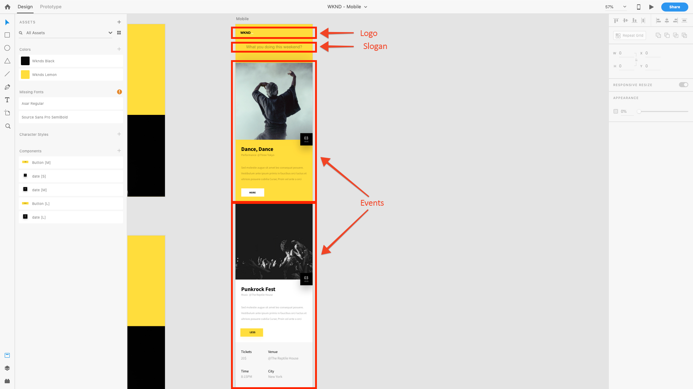

# Kapitel 4 – Definieren von Content Services-Vorlagen

Kapitel 4 des AEM Headless-Tutorials behandelt die Rolle von AEM bearbeitbaren Vorlagen im Kontext von AEM Content Services. Bearbeitbare Vorlagen werden verwendet, um die JSON-Inhaltsstruktur zu definieren, die AEM Content Services über die Komposition von Content Services-fähigen AEM-Komponenten für Clients bereitstellt.

## Erlernen der Rolle von Vorlagen in AEM Content Services

AEM bearbeitbare Vorlagen werden verwendet, um die HTTP-Endpunkte zu definieren, auf die zugegriffen wird, um den Ereignisinhalt als JSON verfügbar zu machen.

Traditionell AEM bearbeitbare Vorlagen werden zur Definition von Webseiten verwendet, doch diese Verwendung ist lediglich eine Konvention. Bearbeitbare Vorlagen können verwendet werden, um **beliebige** Inhalte zusammenzustellen. Wie auf diese Inhalte zugegriffen wird: als HTML in einem Browser, als JSON, das von JavaScript (AEM-SPA-Editor) oder einer mobilen App genutzt wird, hängt davon ab, wie die Seite angefordert wird.

In AEM Content Services werden bearbeitbare Vorlagen verwendet, um festzulegen, wie die JSON-Daten bereitgestellt werden.

Für die App [!DNL WKND Mobile] erstellen wir eine einzelne bearbeitbare Vorlage, die zur Steuerung eines einzelnen API-Endpunkts verwendet wird. Dieses Beispiel ist zwar einfach, um die Konzepte von AEM Headless zu veranschaulichen, doch können Sie mehrere Seiten (oder Endpunkte) erstellen, die jeweils verschiedene Inhaltssätze bereitstellen, um eine komplexere und besser organisierte API zu erstellen.

## Grundlegendes zum API-Endpunkt

Um zu verstehen, wie wir unseren API-Endpunkt zusammenstellen und welche Inhalte für unsere [!DNL WKND Mobile]-App bereitgestellt werden sollen, müssen wir uns das Design noch einmal ansehen.

Wie wir sehen können, müssen wir drei logische Inhaltssätze für die App bereitstellen.

1. Das **Logo**
2. Der **Slogan**
3. Die Liste der **Ereignisse**

Zu diesem Zweck können wir diese Anforderungen auf AEM-Komponenten (und in unserem Fall AEM WCM-Kernkomponenten) abbilden, um den erforderlichen Inhalt als JSON darzustellen.

1. Das **Logo** wird über eine **Bildkomponente** dargestellt.
2. Der **Slogan** wird durch eine **Textkomponente** dargestellt
3. Die Liste der **Ereignisse** wird über eine **Inhaltsfragment-Listenkomponente** dargestellt, die wiederum auf eine Reihe von Ereignis-Inhaltsfragmenten verweist.

>[!NOTE]
>
>Um den JSON-Export von Seiten und Komponenten durch AEM Content Service zu unterstützen, müssen die Seiten und Komponenten **von AEM WCM-Kernkomponenten** abgeleitet werden.
>
>[AEM WCM-Kernkomponenten](https://github.com/Adobe-Marketing-Cloud/aem-core-wcm-components) verfügen über integrierte Funktionen zur Unterstützung eines normalisierten JSON-Schemas exportierter Seiten und Komponenten. Alle in diesem Tutorial verwendeten WKND Mobile-Komponenten (Seite, Bild, Text und Inhaltsfragmentliste) werden von AEM WCM-Kernkomponenten abgeleitet.

## Definieren der Ereignis-API-Vorlage

1. Öffnen Sie **[!UICONTROL Tools] > [!UICONTROL Allgemein] > [!UICONTROL Vorlagen] >[!DNL WKND Mobile]**.

1. Erstellen Sie die Vorlage **[!DNL Events API]**:

   1. Tippen Sie auf **[!UICONTROL Erstellen]** in der oberen Aktionsleiste
   1. Wählen Sie die Vorlage **[!DNL WKND Mobile - Empty Page]**
   1. Tippen Sie auf **[!UICONTROL Weiter]** in der oberen Aktionsleiste
   1. Geben Sie **[!DNL Events API]** in das Feld [!UICONTROL Vorlagentitel] ein
   1. Tippen Sie auf **[!UICONTROL Erstellen]** in der oberen Aktionsleiste
   1. Tippen Sie auf **[!UICONTROL Öffnen]**, um die neue Vorlage zur Bearbeitung zu öffnen

1. Zunächst lassen wir die drei identifizierten AEM-Komponenten zu, die wir für die Modellierung des Inhalts benötigen, indem wir die [!UICONTROL Richtlinie] des Stamm-[!UICONTROL Layout-Containers] bearbeiten. Stellen Sie sicher, dass der **[!UICONTROL Struktur]**-Modus aktiv ist, wählen Sie **[!DNL Layout Container \[Root\]]** und tippen Sie auf die Schaltfläche **[!UICONTROL Richtlinie]**.
1. Suchen Sie unter **[!UICONTROL Eigenschaften] > [!UICONTROL Zugelassene Komponenten]** nach **[!DNL WKND Mobile]**. Lassen Sie die folgenden Komponenten aus der [!DNL WKND Mobile] Komponentengruppe zu, damit sie auf der [!DNL Events]-API-Seite verwendet werden können.

   * **[!DNL WKND Mobile > Image]**

      * Das Logo für die App

   * **[!DNL WKND Mobile > Text]**

      * Der Einführungstext der App

   * **[!DNL WKND Mobile > Content Fragment List]**

      * Die Liste der Ereigniskategorien, die in der App angezeigt werden können

1. Tippen Sie nach Abschluss auf das Häkchen **[!UICONTROL Fertig]** in der oberen rechten Ecke.
1. **Aktualisieren** Sie das Browser-Fenster, um die neue Liste [!UICONTROL Zugelassene Komponenten] in der linken Leiste zu sehen.
1. Ziehen Sie aus der Komponentensuche in der linken Leiste die folgenden AEM-Komponenten hinein:
   1. **[!DNL Image]** für das Logo
   2. **[!DNL Text]** für den Slogan
   3. **[!DNL Content Fragment List]** für die Ereignisse
1. **Markieren Sie jede der oben genannten Komponenten** und drücken Sie die Schaltfläche **Entsperren**.
1. Stellen Sie jedoch sicher, dass der **Layout-Container** **gesperrt** ist, um zu verhindern, dass andere Komponenten hinzugefügt oder diese drei Komponenten entfernt werden.
1. Tippen Sie auf **[!UICONTROL Seiteninformationen] > [!UICONTROL In Admin anzeigen]**, um zur Vorlagenauflistung für [!DNL WKND Mobile] zurückzukehren. Wählen Sie die neu erstellte **[!DNL Events API]**-Vorlage und tippen Sie in der oberen Aktionsleiste auf **[!UICONTROL Aktivieren]**.

>[!VIDEO](https://video.tv.adobe.com/v/28342?quality=12&learn=on)

>[!NOTE]
>
> Beachten Sie, dass die Komponenten, die zum Aufdecken des Inhalts verwendet werden, der Vorlage selbst hinzugefügt und gesperrt werden. Auf diese Weise können Autorinnen und Autoren die vordefinierten Komponenten bearbeiten, jedoch nicht beliebig Komponenten hinzufügen oder entfernen, da eine Änderung an der API selbst die Annahmen rund um die JSON-Struktur beschädigen und Apps beschädigen könnte, die diese verwenden. Alle APIs müssen stabil sein.

## Nächste Schritte

Installieren Sie optional das Inhaltspaket [com.adobe.aem.guides.wknd-mobile.content.chapter-4.zip](https://github.com/adobe/aem-guides-wknd-mobile/releases/latest) in AEM Author über [Package Manager von AEM](http://localhost:4502/crx/packmgr/index.jsp). Dieses Paket enthält die in diesem und den vorangegangenen Kapiteln des Tutorials beschriebenen Konfigurationen und Inhalte.

* [Kapitel 5 – Inhaltserstellung für Inhaltsdienstseiten](./chapter-5.md)
