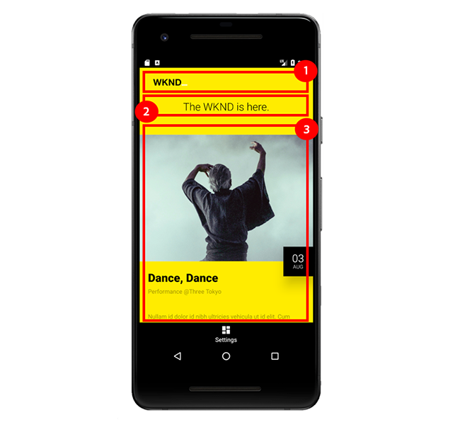

# Kapitel 7 - Verwenden AEM Content Services von einer mobilen App

Kapitel 7 des Tutorials verwendet eine native Android Mobile-App, um Inhalte von AEM Content Services zu konsumieren.

## Die mobile Android-App

In diesem Lernprogramm wird eine **einfache native Android Mobile App** verwendet, um von AEM Content Services bereitgestellte Ereignis-Inhalte zu verwenden und anzuzeigen.

Die Verwendung von [Android](https://developer.android.com/) ist weitgehend unwichtig, und die nutzende mobile App könnte in einem beliebigen Framework für jede mobile Plattform geschrieben werden, z. B. iOS.

Android wird für ein Tutorial verwendet, da es möglich ist, einen Android Emulator unter Windows, macOs und Linux auszuführen, seine Beliebtheit und dass es als Java geschrieben werden kann, eine Sprache, die von AEM Entwicklern gut verstanden wird.

*Die Android Mobile-App des Tutorials soll ****nicht das Erstellen von Android Mobile-Apps anleiten oder bewährte Verfahren für die Android-Entwicklung vermitteln, sondern vielmehr veranschaulichen, wie AEM Content Services über eine mobile Anwendung genutzt werden können.*

### Wie AEM Content Services das Erlebnis der mobilen App fördern



1. Das **logo**, wie durch die [!DNL Events API]-Seitenkomponente **Image** definiert.
1. Die **Tag-Zeile** wie auf der [!DNL Events API]-Seite **Textkomponente** definiert.
1. Diese **Ereignis-Liste** wird aus der Serialisierung der Ereignis Content Fragments abgeleitet, die über die konfigurierte **Inhaltsfragment-Liste-Komponente** bereitgestellt wird.

## Mobile App-Demonstration

>[!VIDEO](https://video.tv.adobe.com/v/28345/?quality=12&learn=on)

### Mobile App für die Verwendung ohne localhost konfigurieren

Wenn AEM Publish nicht auf **http://localhost:4503** ausgeführt wird, können Host und Anschluss in der Mobile App [!DNL Settings] aktualisiert werden, um auf die Eigenschaft AEM Publish-Host/-Anschluss zu verweisen.

>[!VIDEO](https://video.tv.adobe.com/v/28344/?quality=12&learn=on)

## Lokales Ausführen der mobilen App

1. Laden Sie das [Android Studio](https://developer.android.com/studio/install) herunter und installieren Sie es, um den Android Emulator zu installieren.
1. **Herunterladen** der Android- [!DNL APK] Datei  [GitHub > Assets > wknd-mobile.x.xapk](https://github.com/adobe/aem-guides-wknd-mobile/releases/latest)
1. Öffnen Sie **Android Studio**
   * Beim ersten Start von Android Studio wird eine Aufforderung zur Installation von [!DNL Android SDK] angezeigt. Akzeptieren Sie die Standardwerte und beenden Sie die Installation.
1. Öffnen Sie Android Studio und wählen Sie **Profil oder Debug APK**
1. Wählen Sie die in Schritt 2 heruntergeladene APK-Datei (**wknd-mobile.x.x.x.apk**) und klicken Sie auf **OK**
   * Wenn Sie aufgefordert werden, **Neuen Ordner erstellen** oder **Vorhandenen verwenden** zu verwenden, wählen Sie **Vorhandenes verwenden**.
1. Klicken Sie beim ersten Start von Android Studio mit der rechten Maustaste auf **wknd-mobile.x.x** in der Liste &quot;Projekte&quot;und wählen Sie **Moduleinstellungen öffnen**.
   * Wählen Sie unter **Module > wknd-mobile.x.x.x > Abhängigkeiten tab** **Android API 29 Platform**. Tippen Sie auf OK, um die Änderungen zu schließen und zu speichern.
   * Andernfalls wird beim Versuch, den Emulator zu starten, die Fehlermeldung &quot;Bitte wählen Sie Android SDK&quot;angezeigt.
1. Öffnen Sie den **AVD Manager**, indem Sie **Werkzeuge > AVD Manager** auswählen oder auf das Symbol **AVD Manager** in der oberen Leiste tippen.
1. Klicken Sie im Fenster **AVD Manager** auf **+ Virtuelles Gerät erstellen...**, wenn Sie noch kein Gerät registriert haben.
   1. Wählen Sie links die Kategorie **Phone** aus.
   1. Wählen Sie ein **Pixel 2**.
   1. Klicken Sie auf die Schaltfläche **Weiter**.
   1. Wählen Sie **Q** mit **API Level 29**.
      * Beim ersten Start von AVD Manager werden Sie aufgefordert, die versionierte API herunterzuladen. Klicken Sie auf den Link Herunterladen neben der Q-Version und schließen Sie den Download und die Installation ab.
   1. Klicken Sie auf die Schaltfläche **Weiter**.
   1. Klicken Sie auf die Schaltfläche **Fertigstellen**.
1. Schließen Sie das Fenster **AVD Manager**.
1. Wählen Sie in der oberen Menüleiste **wknd-mobile.x.x.x** aus der Dropdownliste **Konfigurationen ausführen/bearbeiten**.
1. Tippen Sie auf die Schaltfläche **Ausführen** neben der ausgewählten **Konfiguration ausführen/bearbeiten**
1. Wählen Sie im Popup das neu erstellte virtuelle Gerät **[!DNL Pixel 2 API 29]** und tippen Sie auf **OK**
1. Wenn die App [!DNL WKND Mobile] nicht sofort geladen wird, suchen Sie das **[!DNL WKND]**-Symbol auf dem Android-Startbildschirm des Emulators und tippen Sie darauf.
   * Wenn der Emulator gestartet wird, der Emulator jedoch schwarz bleibt, tippen Sie im Fenster &quot;Werkzeuge&quot;des Emulators neben dem Emulator-Fenster auf die Schaltfläche **power**.
   * Um innerhalb des virtuellen Geräts einen Bildlauf durchzuführen, halten Sie die Taste gedrückt und ziehen Sie.
   * Um den Inhalt von AEM zu aktualisieren, ziehen Sie von oben nach unten, bis das Aktualisierungssymbol
angezeigt und veröffentlicht.

>[!VIDEO](https://video.tv.adobe.com/v/28341/?quality=12&learn=on)

## Der Code der mobilen App

In diesem Abschnitt wird der Android Mobile App-Code hervorgehoben, der am häufigsten interagiert und von AEM Content Services und seiner JSON-Ausgabe abhängig ist.

Nach dem Laden führt die Mobile App `HTTP GET` zu `/content/wknd-mobile/en/api/events.model.json`, dem AEM Content Services-Endpunkt, der konfiguriert wurde, den Inhalt für die mobile App bereitzustellen.

Da die bearbeitbare Vorlage der Ereignisses-API (`/content/wknd-mobile/en/api/events.model.json`) gesperrt ist, kann die mobile App kodiert werden, um an bestimmten Stellen in der JSON-Antwort nach bestimmten Informationen zu suchen.

### Code-Fluss auf hoher Ebene

1. Beim Öffnen der App wird eine `HTTP GET`-Anforderung an AEM Publish unter `/content/wknd-mobile/en/api/events.model.json` aufgerufen, um den Inhalt zum Füllen der Benutzeroberfläche der mobilen App zu erfassen.[!DNL WKND Mobile]
2. Nach Erhalt des Inhalts von AEM werden alle drei Ansichten der Mobile App, das **logo, die Tag-Zeile und die Ereignis-Liste**, mit dem Inhalt von AEM initialisiert.
   * Um den AEM an das Element &quot;Ansicht&quot;der mobilen App zu binden, ist das JSON, das jede AEM darstellt, ein Objekt, das einem Java-POJO zugeordnet ist, das wiederum an das Element &quot;Android-Ansicht&quot;gebunden ist.
      * Bildkomponente JSON → Logo-POJO → Logo-ImageView
      * Text Component JSON → TagLine POJO → Text ImageView
      * Content Fragment Liste JSON → Ereignisses POJO → Ereignisses RecyclerView
   * *Der Mobile App-Code kann die JSON den POJOs zuordnen, da die Orte innerhalb der größeren JSON-Antwort bekannt sind. Denken Sie daran, dass die JSON-Schlüssel &quot;image&quot;, &quot;text&quot;und &quot;contentfragmentlist&quot;von den Knotennamen der AEM Komponenten bestimmt werden. Wenn sich diese Knotennamen ändern, wird die Mobile App beschädigt, da sie nicht weiß, wie der erforderliche Inhalt aus den JSON-Daten bezogen werden soll.*

#### Aufrufen des AEM Content Services-Endpunkts

Im Folgenden wird der Code im `MainActivity` der mobilen App destilliert, der für das Aufrufen AEM Content Services verantwortlich ist, um die Inhalte zu erfassen, die das Erlebnis für die mobile App fördern.

```
protected void onCreate(Bundle savedInstanceState) {
    ...
    // Create the custom objects that will map the JSON -> POJO -> View elements
    final List<ViewBinder> viewBinders = new ArrayList<>();

    viewBinders.add(new LogoViewBinder(this, getAemHost(), (ImageView) findViewById(R.id.logo)));
    viewBinders.add(new TagLineViewBinder(this, (TextView) findViewById(R.id.tagLine)));
    viewBinders.add(new EventsViewBinder(this, getAemHost(), (RecyclerView) findViewById(R.id.eventsList)));
    ...
    initApp(viewBinders);
}

private void initApp(final List<ViewBinder> viewBinders) {
    final String aemUrl = getAemUrl(); // -> http://localhost:4503/content/wknd-mobile/en/api/events.mobile.json
    JsonObjectRequest request = new JsonObjectRequest(aemUrl, null,
        new Response.Listener<JSONObject>() {
            @Override
            public void onResponse(JSONObject response) {
                for (final ViewBinder viewBinder : viewBinders) {
                    viewBinder.bind(response);
                }
            }
        },
        ...
    );
}
```

`onCreate(..)` ist der Initialisierungshaken für die Mobile App und registriert die 3 benutzerdefinierten  `ViewBinders` für die Analyse der JSON-Datei und die Bindung der Werte an die  `View` Elemente.

`initApp(...)` wird dann aufgerufen, wodurch die HTTP-GET an den AEM Content Services-Endpunkt in AEM Publish gesendet wird, um den Inhalt zu erfassen. Nach Erhalt einer gültigen JSON-Antwort wird die JSON-Antwort an jedes `ViewBinder`-Element übergeben, das für die Analyse der JSON und die Bindung an das mobile `View`-Element verantwortlich ist.

#### Analyse der JSON-Antwort

Als Nächstes betrachten wir die `LogoViewBinder`, die einfach ist, aber einige wichtige Überlegungen.

```
public class LogoViewBinder implements ViewBinder {
    ...
    public void bind(JSONObject jsonResponse) throws JSONException, IOException {
        final JSONObject components = jsonResponse.getJSONObject(":items").getJSONObject("root").getJSONObject(":items");

        if (components.has("image")) {
            final Image image = objectMapper.readValue(components.getJSONObject("image").toString(), Image.class);

            final String imageUrl = aemHost + image.getSrc();
            Glide.with(context).load(imageUrl).into(logo);
        } else {
            Log.d("WKND", "Missing Logo");
        }
    }
}
```

Die erste Zeile von `bind(...)` navigiert die JSON-Antwort mit den Schlüsseln **:items → root → :items**, die den AEM Layout-Container darstellen, dem die Komponenten hinzugefügt wurden.

Von hier aus wird nach einem Schlüssel mit dem Namen **image** geprüft, der die Image-Komponente darstellt (erneut ist es wichtig, dass dieser Knotenname → JSON-Schlüssel stabil ist). Wenn dieses Objekt vorhanden ist, wird es über die Bibliothek Jackson `ObjectMapper` gelesen und der benutzerdefinierten Bild-POJO](#image-pojo) zugeordnet. [ Das Bild-POJO wird unten beschrieben.

Schließlich wird das Logo `src` mithilfe der Hilfsbibliothek [!DNL Glide] in die Android ImageView geladen.

Beachten Sie, dass das AEM Schema, der Host und der Anschluss (über `aemHost`) für die AEM Publish-Instanz bereitgestellt werden müssen, da AEM Content Services nur den JCR-Pfad bereitstellt (d. h. `/content/dam/wknd-mobile/images/wknd-logo.png`) zum referenzierten Inhalt.

#### Bild-POJO{#image-pojo}

Obwohl optional, hilft die Verwendung des [Jackson ObjectMapper](https://fasterxml.github.io/jackson-databind/javadoc/2.9/com/fasterxml/jackson/databind/ObjectMapper.html) oder ähnlicher Funktionen, die von anderen Bibliotheken wie Gson bereitgestellt werden, bei der Zuordnung komplexer JSON-Strukturen zu Java-POJOs, ohne dass die direkten Beziehungen zu den nativen JSON-Objekten selbst erforderlich sind. In diesem einfachen Fall ordnen wir die `src`-Taste vom `image` JSON-Objekt zum `src`-Attribut im Bild-POJO direkt über die `@JSONProperty`-Anmerkung zu.

```
package com.adobe.aem.guides.wknd.mobile.android.models;

import com.fasterxml.jackson.annotation.JsonProperty;

public class Image {
    @JsonProperty(value = "src")
    private String src;

    public String getSrc() {
        return src;
    }
}
```

Das Ereignis POJO, das die Auswahl vieler weiterer Datenpunkte aus dem JSON-Objekt erfordert, profitiert von dieser Technik mehr als das einfache Image, das wir nur wünschen, ist das `src`.

## Erleben Sie Mobile App Experience

Nachdem Sie wissen, wie AEM Content Services das native Mobile-Erlebnis fördern kann, führen Sie die folgenden Schritte aus und sehen Sie, welche Änderungen in der Mobile App übernommen wurden.

Führen Sie nach jedem Schritt eine Pull-to-Aktualisierung der mobilen App durch und überprüfen Sie das Update auf das mobile Erlebnis.

1. **new [!DNL Event] Content Fragment** erstellen und veröffentlichen
1. Rückgängigmachen der Veröffentlichung eines **vorhandenen [!DNL Event] Inhaltsfragments**
1. Veröffentlichen Sie ein Update in der **Tag-Zeile**

## Herzlichen Glückwunsch

**Sie haben das AEM Headless Tutorial abgeschlossen!**

Weitere Informationen zu AEM Content Services und AEM als Headless-CMS finden Sie in der Dokumentation und den Unterstützungsmaterialien der Adobe:

* [Inhaltsfragmente verwenden](https://experienceleague.adobe.com/docs/experience-manager-learn/sites/content-fragments/understand-content-fragments-and-experience-fragments.html)
* [Benutzerhandbuch zu AEM WCM-Hauptkomponenten](https://docs.adobe.com/content/help/de-DE/experience-manager-core-components/using/introduction.html)
* [Bibliothek der WCM-Hauptkomponenten](https://opensource.adobe.com/aem-core-wcm-components/library.html)
* [AEM WCM Kernkomponenten GitHub-Projekt](https://github.com/adobe/aem-core-wcm-components)
* [AEM WCM-Kernkomponenten - Fragen Sie den Experten](https://helpx.adobe.com/experience-manager/kt/eseminars/ask-the-expert/aem-content-services.html)
* [Codebeispiel für Komponenten-Exporter](https://github.com/Adobe-Consulting-Services/acs-aem-samples/blob/master/bundle/src/main/java/com/adobe/acs/samples/models/SampleComponentExporter.java)
