# Inhaltsfragmente erstellen

Im [vorheriges Kapitel](/help/headless-tutorial/graphql/advanced-graphql/create-content-fragment-models.md), haben Sie fünf Inhaltsfragmentmodelle erstellt: Person, Team, Standort, Adresse und Kontaktinformationen. Dieses Kapitel führt Sie durch die Schritte zum Erstellen von Inhaltsfragmenten anhand dieser Modelle. Außerdem wird untersucht, wie Sie Ordnerrichtlinien erstellen, um zu begrenzen, welche Inhaltsfragmentmodelle im Ordner verwendet werden können.

## Voraussetzungen {#prerequisites}

Dieses Dokument ist Teil eines mehrteiligen Tutorials. Stellen Sie sicher, dass [vorheriges Kapitel](create-content-fragment-models.md) vor der Fortsetzung dieses Kapitels abgeschlossen wurde.

## Ziele {#objectives}

In diesem Kapitel erfahren Sie, wie Sie:

* Erstellen von Ordnern und Festlegen von Beschränkungen mithilfe von Ordnerrichtlinien
* Erstellen von Fragmentverweisen direkt aus dem Inhaltsfragment-Editor
* Datentypen &quot;Registerkarte&quot;, &quot;Datum&quot;und &quot;JSON-Objekt&quot;verwenden
* Einfügen von Inhalten und Fragmentverweisen in den mehrzeiligen Texteditor
* Mehrere Fragmentverweise hinzufügen
* Verschachteln von Inhaltsfragmenten

## Beispielinhalt installieren {#sample-content}

Installieren Sie ein AEM-Paket, das mehrere Ordner und Beispielbilder enthält, die zur Beschleunigung des Tutorials verwendet werden.

1. Download [Advanced-GraphQL-Tutorial-Starter-Package-1.1.zip](/help/headless-tutorial/graphql/advanced-graphql/assets/tutorial-files/Advanced-GraphQL-Tutorial-Starter-Package-1.1.zip)
1. Navigieren Sie AEM zu **Instrumente** > **Implementierung** > **Pakete** für den Zugriff **Package Manager**.
1. Laden Sie das im vorherigen Schritt heruntergeladene Paket (ZIP-Datei) hoch und installieren Sie es.

   

## Erstellen von Ordnern und Festlegen von Beschränkungen mithilfe von Ordnerrichtlinien

Wählen Sie auf der AEM-Startseite die Option **Assets** > **Dateien** > **WKND Shared** > **englisch**. Hier sehen Sie die verschiedenen Inhaltsfragmentkategorien, einschließlich Abenteuer und Mitwirkende.

### Erstellen von Ordnern {#create-folders}

Navigieren Sie zur **Abenteuer** Ordner. Sie können sehen, dass Ordner für Teams und Standorte bereits erstellt wurden, um Teams und Standorte mit Inhaltsfragmenten zu speichern.

Erstellen Sie einen Ordner für Inhaltsfragmente von Instruktoren, die auf dem Personen-Inhaltsfragmentmodell basieren.

1. Wählen Sie auf der Seite Abenteuer die Option **Erstellen** > **Ordner** in der oberen rechten Ecke.

   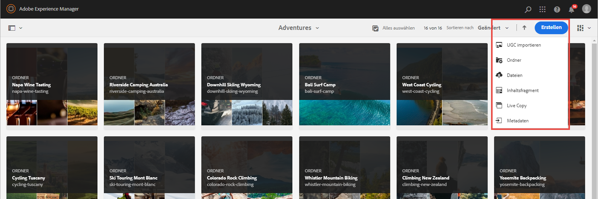

1. Geben Sie im angezeigten Modal Ordner erstellen in der **Titel** -Feld. Beachten Sie die &quot;s&quot;am Ende. Die Titel der Ordner, die viele Fragmente enthalten, müssen Plural sein. Wählen Sie **Erstellen** aus.

   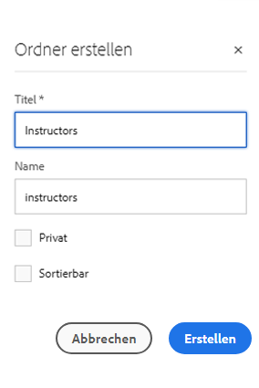

   Sie haben jetzt einen Ordner zum Speichern von Adventure Instructors erstellt.

### Festlegen von Beschränkungen mithilfe von Ordnerrichtlinien

Mit AEM können Sie Berechtigungen und Richtlinien für Inhaltsfragmentordner definieren. Durch die Verwendung von Berechtigungen können Sie nur bestimmten Benutzern (Autoren) oder Gruppen von Autoren Zugriff auf bestimmte Ordner gewähren. Durch die Verwendung von Ordnerrichtlinien können Sie einschränken, welche Inhaltsfragmentmodelle Autoren in diesen Ordnern verwenden können. In diesem Beispiel beschränken wir einen Ordner auf die Modelle Person und Kontaktinformationen . So konfigurieren Sie eine Ordnerrichtlinie:

1. Wählen Sie die **Instructor** Ordner, den Sie erstellt haben, und wählen Sie **Eigenschaften** über die Navigationsleiste am oberen Bildschirmrand.

   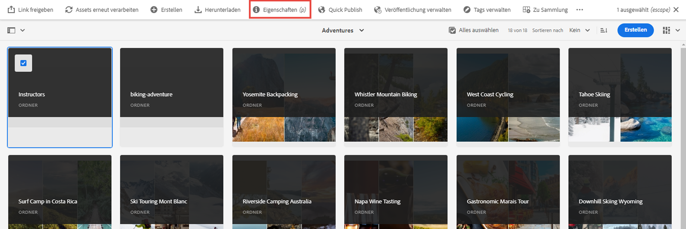

1. Wählen Sie die **Richtlinien** Registerkarte und dann Auswahl aufheben **Vererbt von /content/dam/wknd-shared**. Im **Zulässige Inhaltsfragmentmodelle nach Pfad** das Ordnersymbol.

   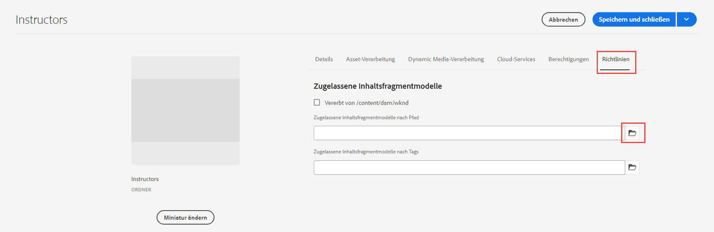

1. Folgen Sie im sich öffnenden Dialogfeld Pfad auswählen dem Pfad **conf** > **WKND Shared**. Das im vorherigen Kapitel erstellte Modell für Personen-Inhaltsfragmente enthält einen Verweis auf das Inhaltsfragmentmodell &quot;Kontaktinformationen&quot;. Die Modelle Person und Kontaktinfo müssen im Ordner Instructors erlaubt sein, um ein Instructor Content Fragment zu erstellen. Auswählen **Person** und **Kontaktangaben** und drücken Sie dann **Auswählen** , um das Dialogfeld zu schließen.

   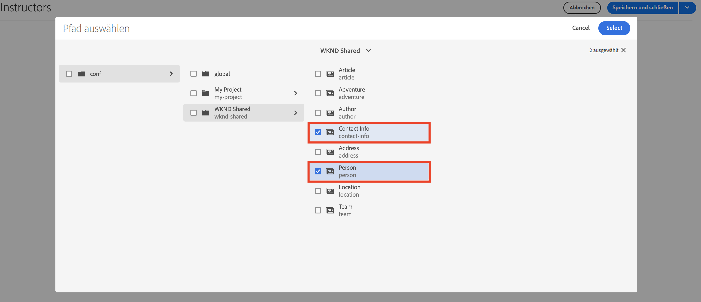

1. Auswählen **Speichern und schließen** und wählen Sie **OK** im Erfolgsdialogfeld angezeigt.

1. Sie haben jetzt eine Ordnerrichtlinie für den Ordner &quot;Instructors&quot;konfiguriert. Navigieren Sie zur **Instructor** Ordner und wählen Sie **Erstellen** > **Inhaltsfragment**. Die einzigen Modelle, die Sie jetzt auswählen können, sind **Person** und **Kontaktangaben**.

   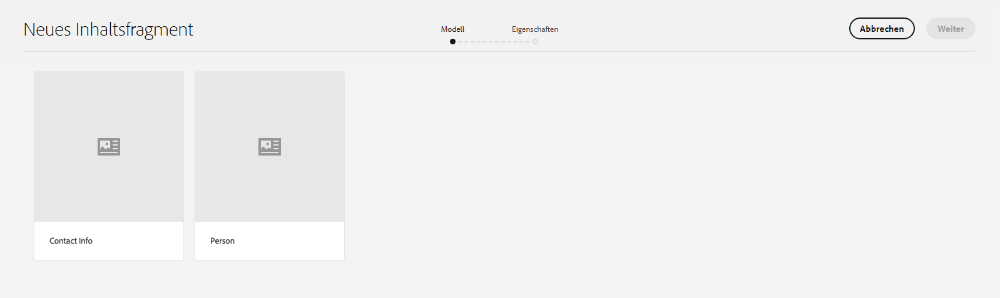

## Autoren-Inhaltsfragmente für Instruktoren

Navigieren Sie zur **Instructor** Ordner. Erstellen wir von hier aus einen verschachtelten Ordner, in dem die Kontaktinformationen der Instruktoren gespeichert werden.

Führen Sie die im Abschnitt [Erstellen von Ordnern](#create-folders) um einen Ordner mit dem Titel &quot;Kontaktinfo&quot;zu erstellen. Der verschachtelte Ordner übernimmt die Ordnerrichtlinien des übergeordneten Ordners. Sie können spezifischere Richtlinien konfigurieren, sodass der neu erstellte Ordner nur die Verwendung des Modells Kontaktinformationen erlaubt.

### Erstellen eines Instructor-Inhaltsfragments

Erstellen wir vier Personen, die einem Team von Adventure Instructors hinzugefügt werden können.

1. Erstellen Sie im Ordner &quot;Instructors&quot;ein Inhaltsfragment, das auf dem Personen-Inhaltsfragmentmodell basiert, und geben Sie ihm den Titel &quot;Jacob Wester&quot;ein.

   Das neu erstellte Inhaltsfragment sieht wie folgt aus:

   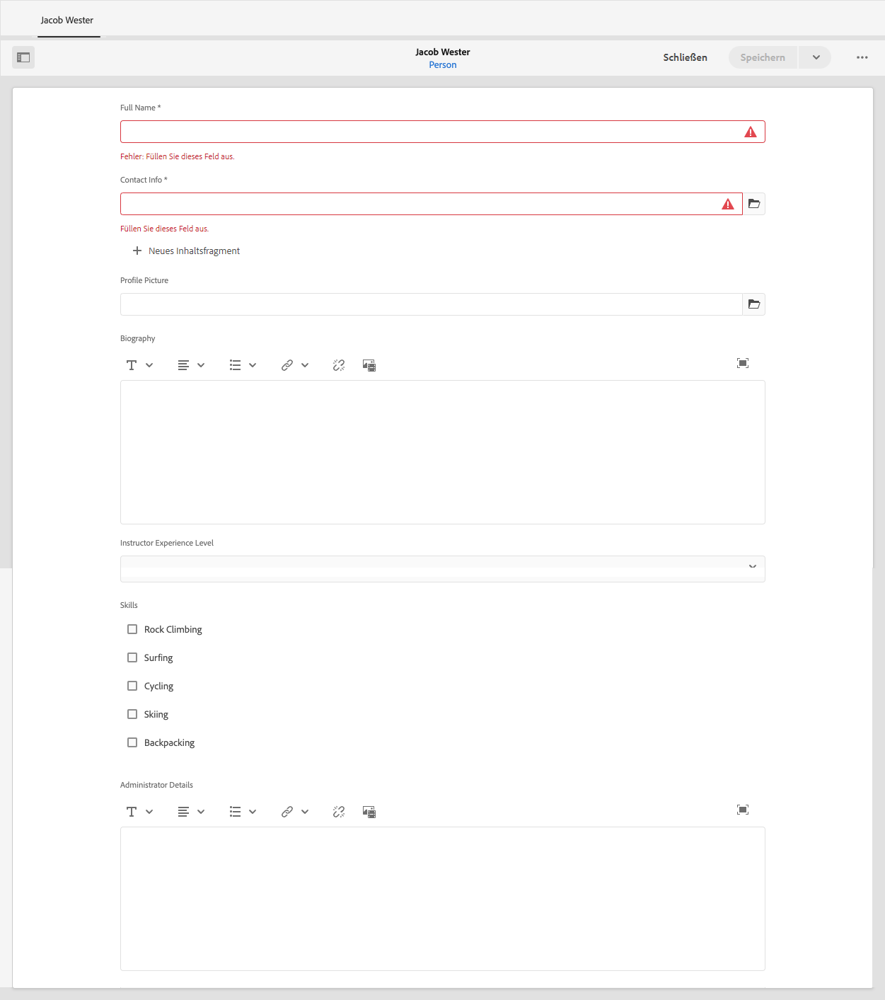

1. Geben Sie den folgenden Inhalt in die Felder ein:

   * **Vollständiger Name**: Jacob Wester
   * **Biografie**: Jacob Wester ist seit zehn Jahren Wanderlehrer und hat jede Minute davon geliebt! Jacob ist ein Abenteuersucher mit Talent für Klettern und Backpacken. Jacob ist der Gewinner von Kletterwettbewerben, einschließlich der Schlacht der Bucht Boulding Wettbewerb. Jacob lebt derzeit in Kalifornien.
   * **Assistentenerfahrungsstufe**: Expert
   * **Qualifikationen**: Rock Climbing, Surfen, Backpacken
   * **Administratordetails**: Jacob Wester koordiniert seit drei Jahren Backpackerabenteuer.

1. Im **Profilbild** -Feld einen Inhaltsverweis zu einem Bild hinzufügen. Navigieren Sie zu **WKND Shared** > **englisch** > **Mitwirkende** > **jacob_wester.jpg** , um einen Pfad zum Bild zu erstellen.

### Fragmentverweis aus dem Inhaltsfragment-Editor erstellen {#fragment-reference-from-editor}

AEM ermöglicht die direkte Erstellung eines Fragmentverweises über den Inhaltsfragment-Editor. Erstellen wir einen Verweis auf Jacobs Kontaktinformationen.

1. Auswählen **Neues Inhaltsfragment** unterhalb der **Kontaktangaben** -Feld.

   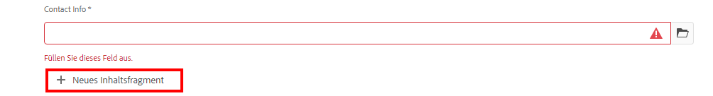

1. Das Modal &quot;Neues Inhaltsfragment&quot;wird geöffnet. Folgen Sie auf der Registerkarte Ziel auswählen dem Pfad **Abenteuer** > **Instructor** und aktivieren Sie das Kontrollkästchen neben dem **Kontaktangaben** Ordner. Auswählen **Nächste** um mit der Registerkarte Eigenschaften fortzufahren.

   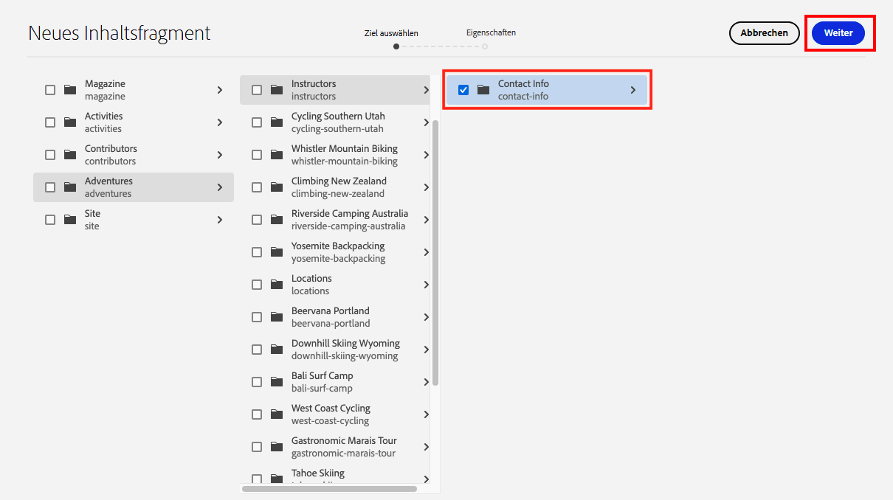

1. Geben Sie auf der Registerkarte Eigenschaften &quot;Jacob Wester Contact Info&quot;im **Titel** -Feld. Auswählen **Erstellen** und drücken Sie dann **Öffnen** im Erfolgsdialogfeld angezeigt.

   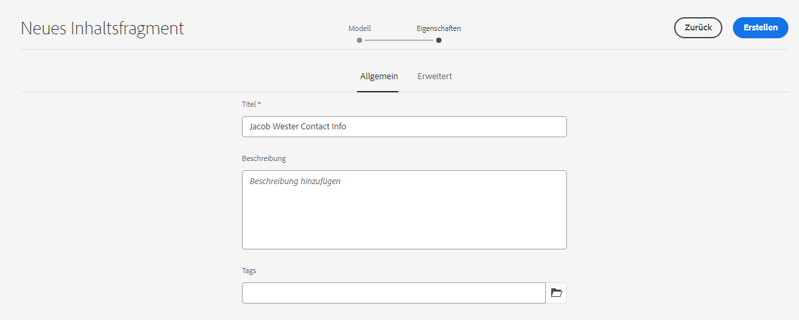

   Es werden neue Felder angezeigt, mit denen Sie das Inhaltsfragment &quot;Kontaktinformationen&quot;bearbeiten können.

   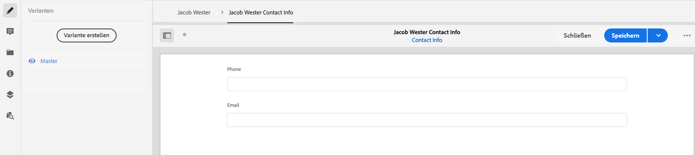

1. Geben Sie den folgenden Inhalt in die Felder ein:

   * **Telefon**: 209-888-0000
   * **Email**: jwester@wknd.com

   Wenn Sie fertig sind, wählen Sie **Speichern**. Sie haben jetzt ein Inhaltsfragment für Kontaktinformationen erstellt.

1. Um zurück zum Inhaltsfragment &quot;Instructor&quot;zu navigieren, wählen Sie **Jacob Wester** in der linken oberen Ecke des Editors.

   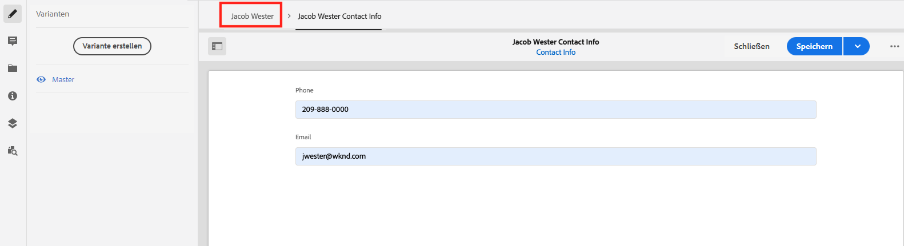

   Die **Kontaktangaben** enthält nun den Pfad zum referenzierten Fragment &quot;Kontaktinformationen&quot;. Dies ist ein verschachtelter Fragmentverweis. Das fertige Inhaltsfragment des Instructors sieht wie folgt aus:

   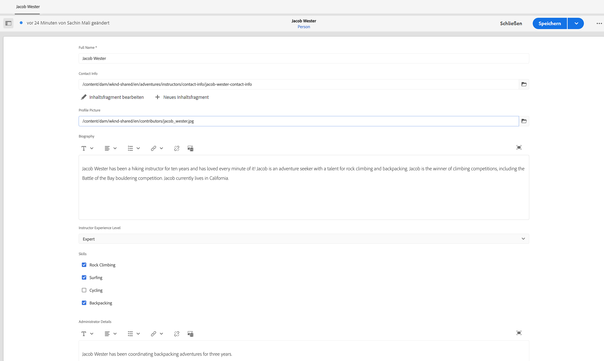

1. Auswählen **Speichern und schließen** , um das Inhaltsfragment zu speichern. Sie verfügen jetzt über ein neues Inhaltsfragment für einen Instructor.

### Zusätzliche Fragmente erstellen

Führen Sie denselben Prozess durch, wie im Abschnitt [vorheriger Abschnitt](#fragment-reference-from-editor) , um drei weitere Inhaltsfragmente für Instruktoren und drei Inhaltsfragmente für Kontaktinformationen für diese Instruktoren zu erstellen. Fügen Sie den folgenden Inhalt in die Instructors-Fragmente ein:

**Stacey Roswells**

| Felder | Werte |
| --- | --- |
| Inhaltsfragmenttitel | Stacey Roswells |
| Vollständiger Name | Stacey Roswells |
| Informationen zu Kontaktperson | /content/dam/wknd-shared/en/adventures/Instructors/contact-info/stacey-roswells-contact-info |
| Profilbild | /content/dam/wknd-shared/en/contributors/stacey-roswells.jpg |
| Biografie | Stacey Roswells ist ein erfahrener Bergsteiger und Abenteurer. Stacey, geboren in Baltimore, Maryland, ist das jüngste von sechs Kindern. Staceys Vater war ein Offizierskolonel der US-Marine und Mutter war ein moderner Tanzlehrer. Staceys Familie bewegte sich häufig mit den Dienstaufträgen des Vaters und machte die ersten Bilder, als der Vater in Thailand stationiert war. Hier lernte Stacey auch Bergsteigen. |
| Assistentenerfahrungsstufe | Erweitert |
| Kompetenzen | Felsenklettern | Skifahren | Backpackung |

**Kumar Selvaraj**

| Felder | Werte |
| --- | --- |
| Inhaltsfragmenttitel | Kumar Selvaraj |
| Vollständiger Name | Kumar Selvaraj |
| Informationen zu Kontaktperson | /content/dam/wknd-shared/en/adventures/Instructors/contact-info/kumar-selvaraj-contact-info |
| Profilbild | /content/dam/wknd-shared/en/contributors/kumar-selvaraj.jpg |
| Biografie | Kumar Selvaraj ist ein erfahrener AMGA zertifizierter Profi-Lehrer, dessen Hauptziel es ist, Studenten beim Klettern und Wandern zu unterstützen. |
| Assistentenerfahrungsstufe | Erweitert |
| Kompetenzen | Felsenklettern | Backpackung |

**Ayo Ogunadende**

| Felder | Werte |
| --- | --- |
| Inhaltsfragmenttitel | Ayo Ogunadende |
| Vollständiger Name | Ayo Ogunadende |
| Informationen zu Kontaktperson | /content/dam/wknd-shared/en/adventures/Instructors/contact-info/ayo-ogunadende-contact-info |
| Profilbild | /content/dam/wknd-shared/en/contributors/ayo-ogunseinde-237739.jpg |
| Biografie | Ayo Ogunadende ist professioneller Kletterer und Backpacker, der in Fresno, Zentralkalifornien, lebt. Ayos Ziel ist es, Wanderer auf ihren episch-nationalen Parkabenteuern zu führen. |
| Assistentenerfahrungsstufe | Erweitert |
| Kompetenzen | Felsenklettern | Radfahren | Backpackung |

Lassen Sie die **Zusätzliche Informationen** leer.

Fügen Sie die folgenden Informationen in die Fragmente &quot;Kontaktinformationen&quot;ein:

| Inhaltsfragmenttitel | Telefon | E-Mail |
| ------- | -------- | -------- |
| Kontaktinformationen zu Stacey Roswells | 209-888-0011 | sroswells@wknd.com |
| Kumar Selvaraj Kontaktinformationen | 209-888-0002 | kselvaraj@wknd.com |
| Kontaktinformationen zu Ayo Ogunadende | 209-888-0304 | aogunseinde@wknd.com |

Sie sind jetzt bereit, ein Team zu erstellen!

## Erstellen von Inhaltsfragmenten für Standorte

Navigieren Sie zur **Standorte** Ordner. Hier sehen Sie zwei verschachtelte Ordner, die bereits erstellt wurden: Yosemite Nationalpark und Yosemite Valley Lodge.

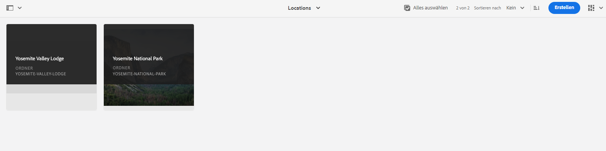

Ignorieren Sie jetzt den Ordner Yosemite Valley Lodge . Wir kehren später in diesem Abschnitt dazu zurück, wenn wir einen Ort erstellen, der als Startseite für unser Lehrerteam fungiert.

Navigieren Sie zur **Yosemite-Nationalpark** Ordner. Derzeit enthält es nur ein Bild des Yosemite-Nationalparks. Erstellen wir ein Inhaltsfragment mithilfe des Inhaltsfragmentmodells &quot;Position&quot;und nennen es &quot;Yosemite-Nationalpark&quot;.

### Registerkartenplatzhalter

AEM ermöglicht Ihnen die Verwendung von Tabstopp-Platzhaltern, um verschiedene Inhaltstypen zu gruppieren und Ihre Inhaltsfragmente leichter zu lesen und zu verwalten. Im vorherigen Kapitel haben Sie dem Standortmodell Registerkarten-Platzhalter hinzugefügt. Daher hat das Inhaltsfragment &quot;Position&quot;jetzt zwei Registerkartenabschnitte: **Standortdetails** und **Standort-Adresse**.

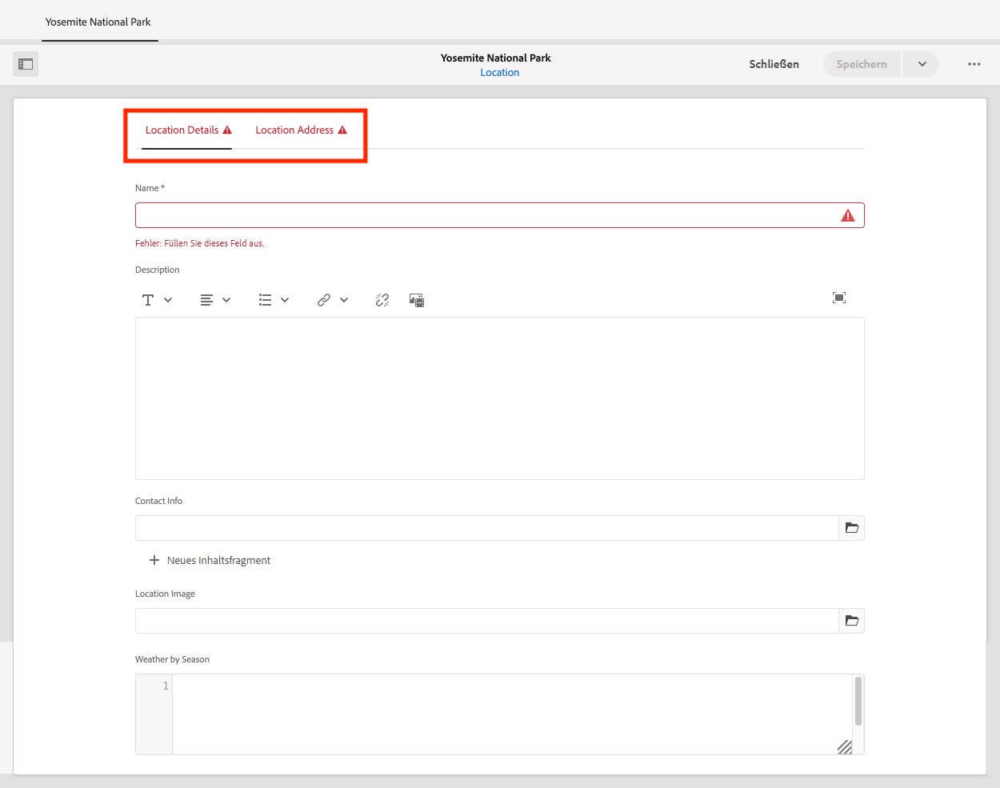

Die **Standortdetails** enthält die **Name**, **Beschreibung**, **Kontaktangaben**, **Standortbild** und **Wetter nach Saison** -Felder, während die **Standort-Adresse** enthält einen Verweis auf ein Adressinhaltsfragment. Die Registerkarten verdeutlichen, welche Inhaltstypen ausgefüllt werden müssen, sodass die Inhaltserstellung einfacher zu verwalten ist.

### JSON-Objektdatentyp

Die **Wetter nach Saison** -Feld ist ein JSON-Objekt-Datentyp, d. h. es akzeptiert Daten im JSON-Format. Dieser Datentyp ist flexibel und kann für alle Daten verwendet werden, die Sie in Ihren Inhalt aufnehmen möchten.

Sie können die im vorherigen Kapitel erstellte Feldbeschreibung anzeigen, indem Sie den Mauszeiger über das Informationssymbol auf der rechten Seite des Felds bewegen.


In diesem Fall müssen wir das durchschnittliche Wetter für den Standort angeben. Geben Sie die folgenden Daten ein:

```json
{
    "summer": "81 / 89°F",
    "fall": "56 / 83°F",
    "winter": "46 / 51°F",
    "spring": "57 / 71°F"
}
```

Die **Wetter nach Saison** -Feld sollte nun wie folgt aussehen:


### Inhalt hinzufügen

Fügen wir den Rest des Inhalts zum Location Content Fragment hinzu, um die Informationen im nächsten Kapitel mit GraphQL abzufragen.

1. Im **Standortdetails** die folgenden Informationen in die Felder ein:

   * **Name**: Yosemite-Nationalpark
   * **Beschreibung**: Der Yosemite Nationalpark liegt in den Bergen der Sierra Nevada in Kalifornien. Es ist berühmt für seine herrlichen Wasserfälle, riesigen Sequoia-Bäumen und die ikonische Aussicht auf die Felsen El Capitan und Half Dome. Wandern und Campen sind die besten Möglichkeiten, Yosemite zu erleben. Zahlreiche Wege bieten unendliche Möglichkeiten für Abenteuer und Erkundung.

1. Aus dem **Kontaktangaben** erstellen Sie ein Inhaltsfragment, das auf dem Modell &quot;Kontaktinformationen&quot;basiert, und nennen Sie es &quot;Yosemite National Park Contact Info&quot;. Gehen Sie wie im vorherigen Abschnitt beschrieben vor [Erstellen eines Fragmentverweises aus dem Editor](#fragment-reference-from-editor) und geben Sie die folgenden Daten in die Felder ein:

   * **Telefon**: 209-999-0000
   * **Email**: yosemite@wknd.com

1. Aus dem **Standortbild** -Feld, navigieren Sie zu **Abenteuer** > **Standorte** > **Yosemite-Nationalpark** > **yosemite-national-park.jpeg** , um einen Pfad zum Bild zu erstellen.

   Denken Sie daran, im vorherigen Kapitel, das Sie die Bildvalidierung konfiguriert haben, daran, dass die Abmessungen des Standortbilds weniger als 2560 x 1800 betragen und die Dateigröße weniger als 3 MB betragen muss.

1. Mit allen hinzugefügten Informationen wird die **Standortdetails** Die Registerkarte sieht nun wie folgt aus:

   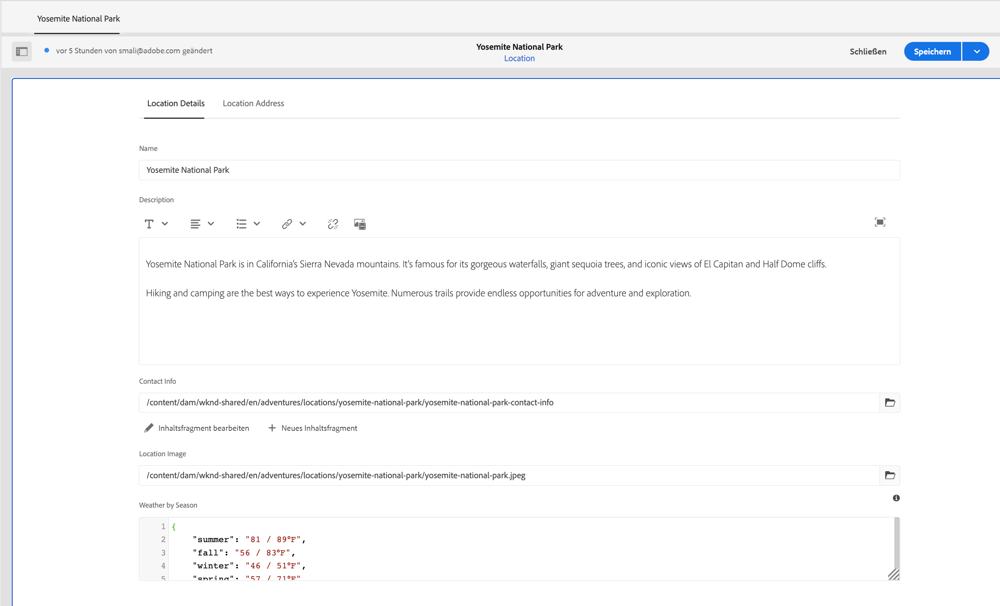

1. Navigieren Sie zur **Standort-Adresse** Registerkarte. Aus dem **Adresse** erstellen Sie ein Inhaltsfragment mit dem Titel &quot;Yosemite National Park Address&quot;mithilfe des Fragment-Modells für Adressinhalte, das Sie im vorherigen Kapitel erstellt haben. Führen Sie denselben Prozess aus, wie im Abschnitt [Erstellen eines Fragmentverweises aus dem Editor](#fragment-reference-from-editor) und geben Sie die folgenden Daten in die Felder ein:

   * **Straße**: 9010 Curry Village Drive
   * **Ort**: Yosemite Valley
   * **state**: CA
   * **Postleitzahl**: 95389
   * **Land**: Vereinigte Staaten

1. Die **Standort-Adresse** Der Tab des Fragments Yosemite National Park sieht wie folgt aus:

   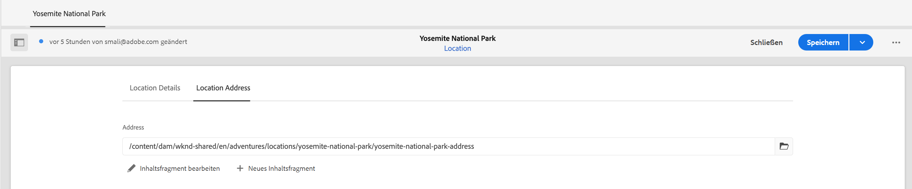

1. Klicken Sie auf **Speichern und schließen**.

### Erstellen eines weiteren Fragments

1. Navigieren Sie zur **Yosemite Valley Lodge** Ordner. Erstellen Sie ein Inhaltsfragment mit dem Location Content Fragment-Modell und nennen Sie es &quot;Yosemite Valley Lodge&quot;.

1. Im **Standortdetails** die folgenden Informationen in die Felder ein:

   * **Name**: Yosemite Valley Lodge
   * **Beschreibung**: Yosemite Valley Lodge ist ein Zentrum für Gruppenversammlungen und Aktivitäten wie Einkaufen, Essen, Angeln, Wandern und vieles mehr.

1. Aus dem **Kontaktangaben** erstellen Sie ein Inhaltsfragment, das auf dem Modell &quot;Kontaktinformationen&quot;basiert, und geben Sie ihm den Titel &quot;Yosemite Valley Lodge Contact Info&quot;. Führen Sie denselben Prozess aus, wie im Abschnitt [Erstellen eines Fragmentverweises aus dem Editor](#fragment-reference-from-editor) und geben Sie die folgenden Daten in die Felder des neuen Inhaltsfragments ein:

   * **Telefon**: 209-992-0000
   * **Email**: yosemitelodge@wknd.com

   Speichern Sie das neu erstellte Inhaltsfragment.

1. Navigieren Sie zurück zu **Yosemite Valley Lodge** und gehen Sie zu **Standort-Adresse** Registerkarte. Aus dem **Adresse** erstellen Sie ein Inhaltsfragment mit dem Titel &quot;Yosemite Valley-Lodge-Adresse&quot;mithilfe des Fragment-Modells für Adressinhalte, das Sie im vorherigen Kapitel erstellt haben. Führen Sie denselben Prozess aus, wie im Abschnitt [Erstellen eines Fragmentverweises aus dem Editor](#fragment-reference-from-editor) und geben Sie die folgenden Daten in die Felder ein:

   * **Straße**: 9006 Yosemite Lodge Drive
   * **Ort**: Yosemite-Nationalpark
   * **state**: CA
   * **Postleitzahl**: 95389
   * **Land**: Vereinigte Staaten

   Speichern Sie das neu erstellte Inhaltsfragment.

1. Navigieren Sie zurück zu **Yosemite Valley Lodge**, wählen Sie **Speichern und schließen**. Die **Yosemite Valley Lodge** -Ordner enthält jetzt drei Inhaltsfragmente: Yosemite Valley Lodge, Yosemite Valley Lodge Kontaktinformationen und Yosemite Valley Lodge-Adresse.

   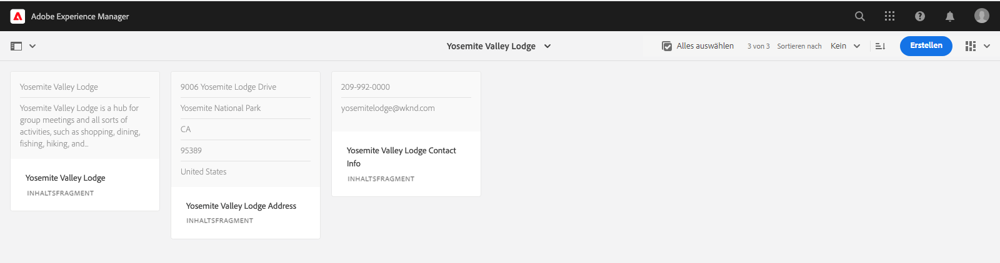

## Erstellen eines Team-Inhaltsfragments

Durchsuchen von Ordnern nach **Teams** > **Yosemite-Team**. Sie können sehen, dass der Ordner &quot;Yosemite Team&quot;derzeit nur das Teamlogo enthält.

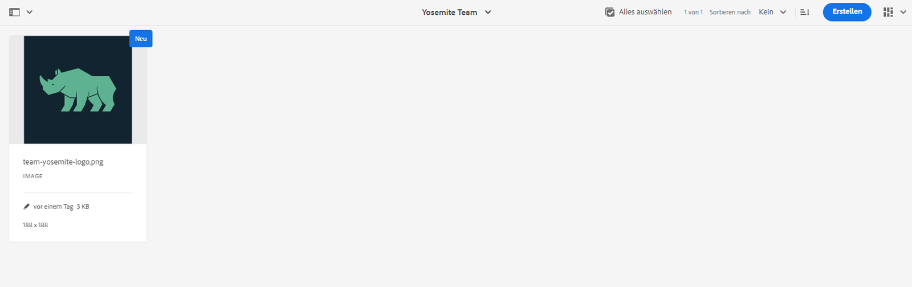

Erstellen wir ein Inhaltsfragment mit dem Team Content Fragment-Modell und nennen es &quot;Yosemite Team&quot;.

### Inhalts- und Fragmentverweise im mehrzeiligen Texteditor

AEM ermöglicht es Ihnen, Inhalte und Fragmentverweise direkt zum mehrzeiligen Texteditor hinzuzufügen und später mithilfe von GraphQL-Abfragen abzurufen. Fügen wir sowohl Inhalte als auch Fragmentverweise in die **Beschreibung** -Feld.

1. Fügen Sie zunächst den folgenden Text zum **Beschreibung** -Feld: &quot;Das Team professioneller Abenteurer und Wanderlehrer, die im Yosemite Nationalpark arbeiten.&quot;

1. Um eine Inhaltsreferenz hinzuzufügen, wählen Sie die **Asset einfügen** in der Symbolleiste des mehrzeiligen Texteditors angezeigt.

   

1. Wählen Sie im angezeigten Modal die Option **team-yosemite-logo.png** und Presse **Auswählen**.

   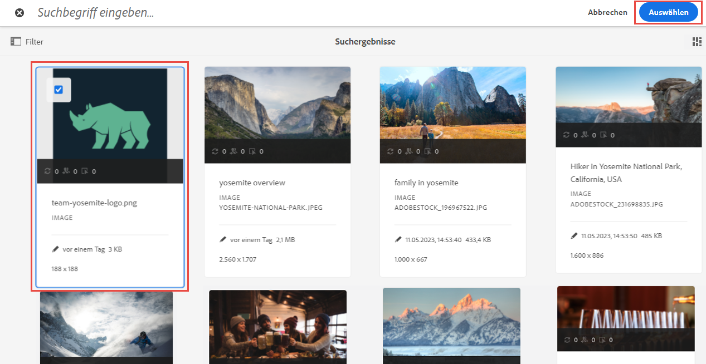

   Die Inhaltsreferenz wird jetzt der **Beschreibung** -Feld.

Denken Sie daran, dass im vorherigen Kapitel Fragmentverweise zum **Beschreibung** -Feld. Fügen wir hier einen hinzu.

1. Wählen Sie die **Inhaltsfragment einfügen** in der Symbolleiste des mehrzeiligen Texteditors angezeigt.

   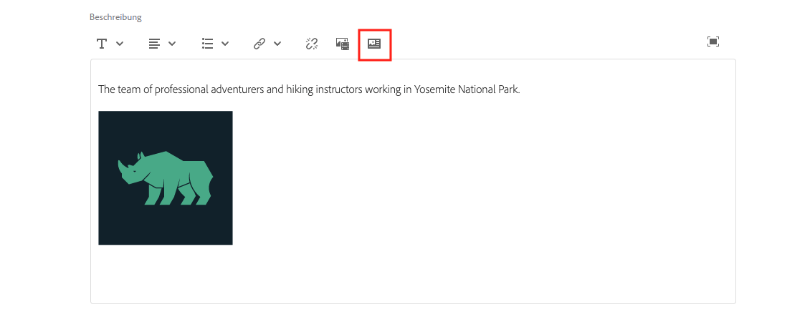

1. Navigieren Sie zu **WKND Shared** > **englisch** > **Abenteuer** > **Standorte** > **Yosemite Valley Lodge** > **Yosemite Valley Lodge**. Presse **Auswählen** , um das Inhaltsfragment einzufügen.

   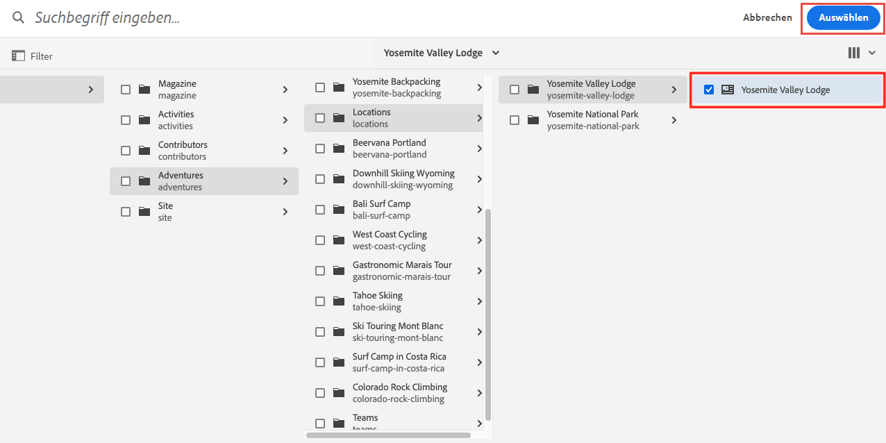

   Die **Beschreibung** -Feld sieht nun wie folgt aus:

   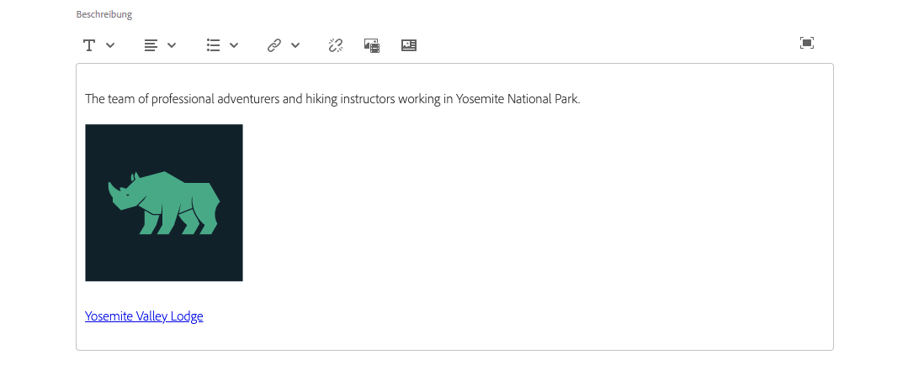

Sie haben jetzt die Inhalts- und Fragmentverweise direkt zum mehrzeiligen Texteditor hinzugefügt.

### Datums- und Uhrzeitdatentyp

Sehen wir uns den Datentyp Datum und Uhrzeit an. Wählen Sie die **Kalender** rechts neben dem Symbol **Team-Gründungsdatum** -Feld, um die Kalenderansicht zu öffnen.

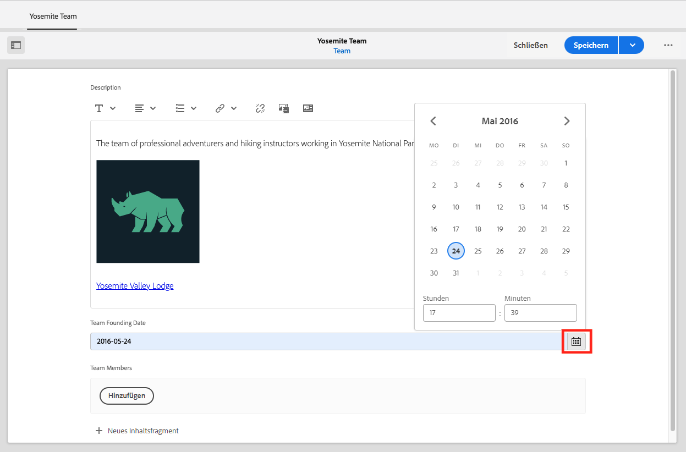

Vergangene oder zukünftige Daten können mit den Vorwärts- und Rückwärts-Pfeilen auf beiden Seiten des Monats festgelegt werden. Nehmen wir an, das Yosemite-Team wurde am 24. Mai 2016 gegründet, also legen wir das Datum für diesen Zeitpunkt fest.

### Mehrere Fragmentverweise hinzufügen

Fügen wir dem Fragmentverweis für Team-Mitglieder &quot;Instructors&quot;hinzu.

1. Auswählen **Hinzufügen** im **Team-Mitglieder** -Feld.

   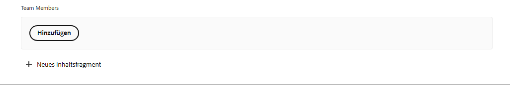

1. Wählen Sie im neuen Feld, das angezeigt wird, das Ordnersymbol aus, um das Modal Pfad auswählen zu öffnen. Durchsuchen Sie Ordner nach **WKND Shared** > **englisch** > **Abenteuer** > **Instructor** und aktivieren Sie dann das Kontrollkästchen neben **jacob-wester**. Presse **Auswählen** , um den Pfad zu speichern.

   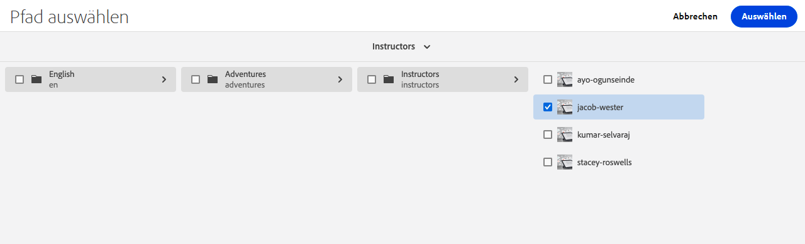

1. Wählen Sie die **Hinzufügen** dreimal. Verwenden Sie die neuen Felder, um die verbleibenden drei Instructors zum Team hinzuzufügen. Die **Team-Mitglieder** -Feld sieht nun wie folgt aus:

   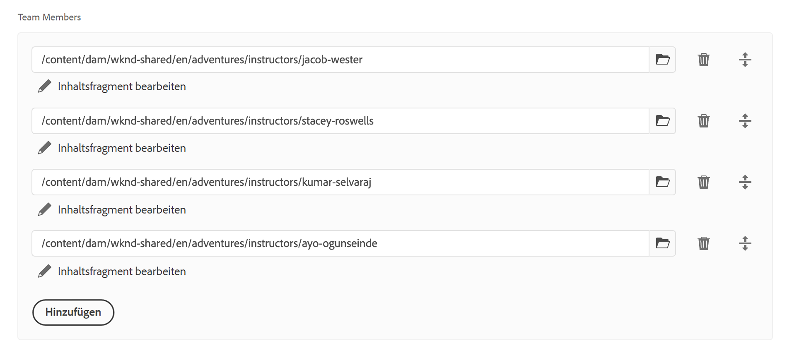

1. Auswählen **Speichern und schließen** , um das Team-Inhaltsfragment zu speichern.

### Fragmentverweise zu einem Adventure-Inhaltsfragment hinzufügen

Abschließend fügen wir unsere neu erstellten Inhaltsfragmente einem Abenteuer hinzu.

1. Navigieren Sie zu **Abenteuer** > **Yosemite Backpacken** und öffnen Sie das Inhaltsfragment &quot;Yosemite Backpacken&quot;. Unten im Formular sehen Sie die drei Felder, die Sie im vorherigen Kapitel erstellt haben: **Standort**, **Instructor Team** und **Administrator**.

1. Fügen Sie den Fragmentverweis im **Standort** -Feld. Der Standortpfad sollte auf das Inhaltsfragment des Yosemite-Nationalparks verweisen, das Sie erstellt haben: `/content/dam/wknd-shared/en/adventures/locations/yosemite-national-park/yosemite-national-park`.

1. Fügen Sie den Fragmentverweis im **Instructor Team** -Feld. Der Team-Pfad sollte auf das von Ihnen erstellte Inhaltsfragment des Yosemite-Teams verweisen: `/content/dam/wknd-shared/en/adventures/teams/yosemite-team/yosemite-team`. Dies ist ein verschachtelter Fragmentverweis. Das Team Content Fragment enthält einen Verweis auf das Personen-Modell, das auf die Modelle Kontaktinfo und Adresse verweist. Daher haben Sie verschachtelte Inhaltsfragmente auf drei Ebenen nach unten.

1. Fügen Sie den Fragmentverweis im **Administrator** -Feld. Nehmen wir an, Jacob Wester ist Administrator für das Yosemite Backpackaging Adventure. Der Pfad sollte zum Jacob Wester-Inhaltsfragment führen und wie folgt aussehen: `/content/dam/wknd-shared/en/adventures/instructors/jacob-wester`.

1. Sie haben nun drei Fragmentverweise zu einem Adventure-Inhaltsfragment hinzugefügt. Die Felder sehen wie folgt aus:

   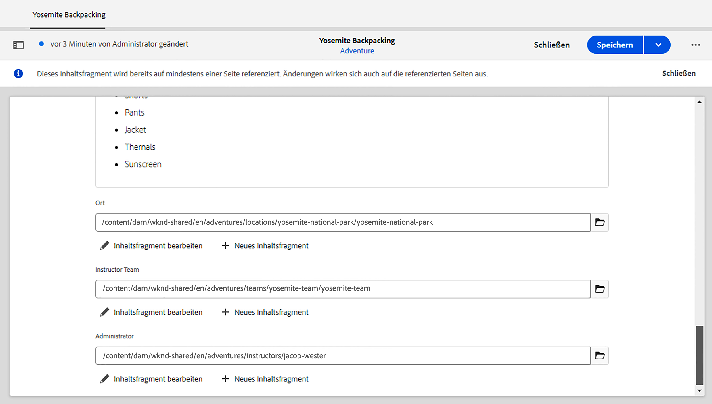

1. Auswählen **Speichern und schließen** , um Ihren Inhalt zu speichern.

## Herzlichen Glückwunsch!

Herzlichen Glückwunsch! Sie haben jetzt Inhaltsfragmente basierend auf den erweiterten Inhaltsfragmentmodellen erstellt, die im vorherigen Kapitel erstellt wurden. Sie haben auch eine Ordnerrichtlinie erstellt, um zu begrenzen, welche Inhaltsfragmentmodelle in einem Ordner ausgewählt werden können.

## Nächste Schritte

Im [Nächstes Kapitel](/help/headless-tutorial/graphql/advanced-graphql/explore-graphql-api.md), erfahren Sie mehr über das Senden erweiterter GraphQL-Abfragen mithilfe der integrierten Entwicklungsumgebung (IDE) für GraphiQL. Mit diesen Abfragen können wir die in diesem Kapitel erstellten Daten anzeigen und diese Abfragen schließlich zur WKND-App hinzufügen.
