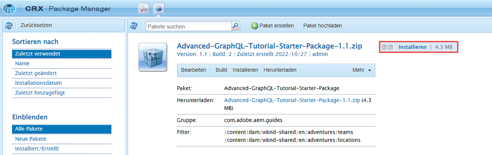
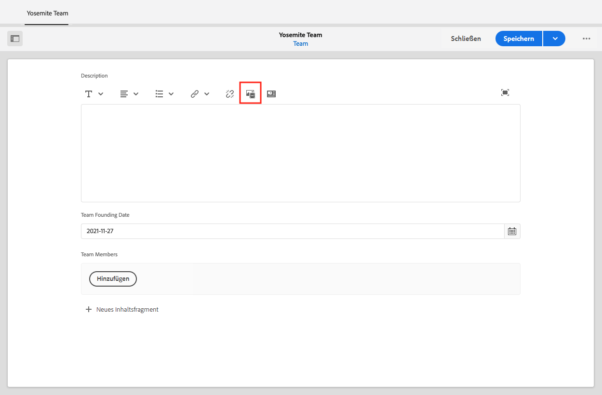

# Erstellen von Inhaltsfragmenten

Im [vorherigen Kapitel](/help/headless-tutorial/graphql/advanced-graphql/create-content-fragment-models.md) haben Sie fünf Inhaltsfragmentmodelle erstellt: Person, Team, Standort, Adresse und Kontaktinformationen. Dieses Kapitel führt Sie durch die Schritte zum Erstellen von Inhaltsfragmenten anhand dieser Modelle. Außerdem wird untersucht, wie Sie Ordnerrichtlinien erstellen, um zu begrenzen, welche Inhaltsfragmentmodelle im Ordner verwendet werden können.

## Voraussetzungen {#prerequisites}

Dieses Dokument ist Teil eines mehrteiligen Tutorials. Bitte vergewissern Sie sich, dass Sie das [vorige Kapitel](create-content-fragment-models.md) abgeschlossen haben, bevor Sie mit diesem Kapitel fortfahren.

## Ziele {#objectives}

In diesem Kapitel erfahren Sie, wie Sie:

* Erstellen von Ordnern und Festlegen von Beschränkungen mithilfe von Ordnerrichtlinien
* Erstellen von Fragmentverweisen direkt aus dem Inhaltsfragment-Editor
* Verwenden der Datentypen „Registerkarte“, „Datum“ und „JSON-Objekt“
* Einfügen von Inhalten und Fragmentverweisen in den mehrzeiligen Texteditor
* Hinzufügen mehrerer Fragmentverweise
* Verschachteln von Inhaltsfragmenten

## Installieren eines Beispielinhalts {#sample-content}

Installieren Sie ein AEM-Paket, das mehrere Ordner und Beispielbilder enthält, die zur Beschleunigung des Tutorials verwendet werden.

1. Laden Sie [Advanced-GraphQL-Tutorial-Starter-Package-1.1.zip](/help/headless-tutorial/graphql/advanced-graphql/assets/tutorial-files/Advanced-GraphQL-Tutorial-Starter-Package-1.1.zip) herunter
1. Navigieren Sie in AEM zu **Tools** > **Bereitstellung** > **Pakete**, um auf den **Package Manager** zuzugreifen.
1. Laden Sie das im vorherigen Schritt heruntergeladene Paket (die ZIP-Datei) hoch und installieren Sie es.

   

## Erstellen von Ordnern und Festlegen von Beschränkungen mithilfe von Ordnerrichtlinien

Wählen Sie auf der AEM-Homepage **Assets** > **Dateien** > **WKND Shared** > **English**. Hier sehen Sie die verschiedenen Inhaltsfragmentkategorien, einschließlich Adventures und Mitwirkende.

### Erstellen von Ordnern {#create-folders}

Navigieren Sie zum Ordner **Adventures**. Sie können sehen, dass Ordner für Teams und Standorte bereits erstellt wurden, um Inhaltsfragmente für Teams und Standorte zu speichern.

Erstellen Sie einen Ordner für Lehrpersonal-Inhaltsfragmente, die auf dem Personen-Inhaltsfragmentmodell basieren.

1. Wählen Sie auf der Adventures-Seite **Erstellen** > **Ordner** in der oberen rechten Ecke.

   

1. Geben Sie im erscheinenden Modal „Ordner erstellen“ in das Feld **Titel** „Lehrpersonal“ ein. Beachten Sie das „s“ am Ende. Die Titel der Ordner, die viele Fragmente enthalten, müssen Plural sein. Wählen Sie **Erstellen** aus.

   

   Sie haben jetzt einen Ordner zum Speichern von Adventure-Lehrpersonal erstellt.

### Festlegen von Beschränkungen mithilfe von Ordnerrichtlinien

Mit AEM können Sie Berechtigungen und Richtlinien für Inhaltsfragmentordner definieren. Durch die Verwendung von Berechtigungen können Sie nur bestimmten Benutzenden (Autorinnen und Autoren) oder Gruppen von diesen Zugriff auf bestimmte Ordner gewähren. Durch die Verwendung von Ordnerrichtlinien können Sie einschränken, welche Inhaltsfragmentmodelle in diesen Ordnern Autorinnen und Autoren verwenden können. In diesem Beispiel beschränken wir einen Ordner auf die Modelle „Person“ und „Kontaktinformationen“. So konfigurieren Sie eine Ordnerrichtlinie:

1. Wählen Sie den Ordner **Lehrpersonal**, den Sie erstellt haben, und wählen Sie dann **Eigenschaften** in der oberen Navigationsleiste.

   

1. Wählen Sie die Registerkarte **Richtlinien** und entfernen Sie die Markierung **geerbt von /content/dam/wknd-shared**. Wählen Sie im Feld **Zugelassene Inhaltsfragmentmodelle nach Pfad** das Ordnersymbol.

   

1. Folgen Sie im sich öffnenden Dialogfeld „Pfad auswählen“ dem Pfad **conf** > **WKND Shared**. Das im vorherigen Kapitel erstellte Modell für Personen-Inhaltsfragmente enthält einen Verweis auf das Inhaltsfragmentmodell „Kontaktinformationen“. Die Modelle „Person“ und „Kontaktinfo“ müssen im Ordner „Lehrpersonal“ erlaubt sein, um ein Lehrpersonal-Inhaltsfragment erstellen zu können. Wählen Sie **Person** und **Kontaktinformationen** aus und klicken Sie dann auf **Auswählen**, um das Dialogfeld zu schließen.

   

1. Wählen Sie **Speichern und schließen** und klicken Sie in dem daraufhin angezeigten Erfolgsdialog auf **OK**.

1. Sie haben jetzt eine Ordnerrichtlinie für den Ordner „Lehrpersonal“ konfiguriert. Navigieren Sie in den Ordner **Lehrpersonal** und wählen Sie **Erstellen** > **Inhaltsfragment**. Die einzigen Modelle, die Sie jetzt auswählen können, sind **Person** und **Kontaktinformationen**.

   

## Verfassen von Inhaltsfragmenten für Lehrpersonal

Navigieren Sie zum Ordner **Lehrpersonal**. Erstellen wir von hier aus einen verschachtelten Ordner, in dem die Kontaktinformationen des Lehrpersonals gespeichert werden.

Befolgen Sie die im Abschnitt [Erstellen von Ordnern](#create-folders) beschriebenen Schritte, um einen Ordner mit dem Titel „Kontaktinformationen“ zu erstellen. Der verschachtelte Ordner übernimmt die Ordnerrichtlinien des übergeordneten Ordners. Wenn Sie möchten, können Sie spezifischere Richtlinien konfigurieren, sodass der neu erstellte Ordner nur die Verwendung des Modells „Kontaktinformationen“ erlaubt.

### Erstellen eines Lehrpersonal-Inhaltsfragments

Erstellen wir vier Personen, die einem Team von Adventure-Lehrpersonal hinzugefügt werden können.

1. Erstellen Sie im Ordner „Lehrpersonal“ ein Inhaltsfragment auf der Grundlage des Inhaltsfragmentmodells „Person“ und geben Sie ihm den Titel „Jakob Wester“.

   Das neu erstellte Inhaltsfragment sieht wie folgt aus:

   

1. Geben Sie den folgenden Inhalt in die Felder ein:

   * **Vollständiger Name**: Jakob Wester
   * **Biografie**: Jakob Wester ist seit zehn Jahren Wanderlehrkraft und hat jede Minute davon geliebt! Jakob ist abenteuerlustig, mit Talent für Klettern und Backpacken. Jakob hat mehrere Kletterwettbewerbe gewonnen, einschließlich der „Battle of the Bay bouldering competition“. Jakob lebt derzeit in Kalifornien.
   * **Lehrpersonal-Erfahrungsstufe**: Experte
   * **Qualifikationen**: Klettern, Surfen, Backpacken
   * **Administratordetails**: Jakob Wester koordiniert seit drei Jahren Backpacker-Adventures.

1. Fügen Sie im Feld **Profilbild** einen Inhaltsverweis auf ein Bild hinzu. Navigieren Sie zu **WKND Shared** > **English** > **Contributors** > **jacob_wester.jpg**, um einen Pfad zu dem Bild zu erstellen.

### Erstellen eines Fragmentverweises im Inhaltsfragment-Editor {#fragment-reference-from-editor}

AEM ermöglicht die direkte Erstellung eines Fragmentverweises über den Inhaltsfragment-Editor. Erstellen wir einen Verweis auf Jakobs Kontaktinformationen.

1. Wählen Sie **Neues Inhaltsfragment** unterhalb des Feldes **Kontaktinformationen**.

   

1. Das Modal „Neues Inhaltsfragment“ wird geöffnet. Folgen Sie auf der Registerkarte „Ziel auswählen“ dem Pfad **Adventures** > **Instructors** und aktivieren Sie das Kontrollkästchen neben dem Ordner **Kontaktinformationen**. Wählen Sie **Weiter**, um zur Registerkarte „Eigenschaften“ zu gelangen.

   

1. Geben Sie auf der Registerkarte „Eigenschaften“ in das Feld **Titel** „Jakob Wester Kontaktinformationen“ ein. Wählen Sie **Erstellen**, und drücken Sie dann **Öffnen** in dem erscheinenden Erfolgsdialogfeld.

   

   Es werden neue Felder angezeigt, mit denen Sie das Inhaltsfragment für Kontaktinformationen bearbeiten können.

   

1. Geben Sie den folgenden Inhalt in die Felder ein:

   * **Telefon**: 209-888-0000
   * **Email**: jwester@wknd.com

   Wenn Sie fertig sind, wählen Sie **Speichern**. Sie haben jetzt ein Inhaltsfragment für Kontaktinformationen erstellt.

1. Um zurück zum Inhaltsfragment des Lehrpersonals zu navigieren, wählen Sie **Jakob Wester** in der linken oberen Ecke des Editors.

   

   Das Feld **Kontaktinformationen** enthält nun den Pfad zum referenzierten Kontaktinformationen-Fragment. Dies ist ein verschachtelter Fragmentverweis. Das fertige Inhaltsfragment des Lehrpersonals sieht wie folgt aus:

   

1. Wählen Sie **Speichern und schließen**, um das Inhaltsfragment zu speichern. Sie verfügen jetzt über ein neues Lehrpersonal-Inhaltsfragment.

### Erstellen von zusätzlichen Fragmenten

Führen Sie denselben Prozess durch, wie im Abschnitt [vorheriger Abschnitt](#fragment-reference-from-editor), um drei weitere Inhaltsfragmente für Lehrpersonal und drei Inhaltsfragmente für Kontaktinformationen für dieses Lehrpersonal zu erstellen. Fügen Sie den folgenden Inhalt in die Lehrpersonal-Fragmente ein:

**Stacey Roswells**

| Felder | Werte |
| --- | --- |
| Inhaltsfragmenttitel | Stacey Roswells |
| Vollständiger Name | Stacey Roswells |
| Kontaktinformationen | /content/dam/wknd-shared/en/adventures/Instructors/contact-info/stacey-roswells-contact-info |
| Profilfoto | /content/dam/wknd-shared/en/contributors/stacey-roswells.jpg |
| Biografie | Stacey Roswells ist eine versierte Kletterin und in alpinen Abenteurerin. Stacey, geboren in Baltimore, Maryland, ist das jüngste von sechs Kindern. Staceys Vater war Oberstleutnant in der US-Marine und ihre Mutter war Lehrerin für modernen Tanz. Staceys Familie zog häufig durch die Arbeitsaufträge des Vaters um und sie begann mit dem Fotografieren, als der Vater in Thailand stationiert war. Hier lernte Stacey auch Klettern. |
| Lehrpersonal-Erfahrungsstufe | Erweitert |
| Kompetenzen | Klettern | Skifahren | Backpacking |

**Kumar Selvaraj**

| Felder | Werte |
| --- | --- |
| Inhaltsfragmenttitel | Kumar Selvaraj |
| Vollständiger Name | Kumar Selvaraj |
| Kontaktinformationen | /content/dam/wknd-shared/en/adventures/Instructors/contact-info/kumar-selvaraj-contact-info |
| Profilfoto | /content/dam/wknd-shared/en/contributors/kumar-selvaraj.jpg |
| Biografie | Kumar Selvaraj ist ein erfahrenes AMGA zertifiziertes Lehrpersonal, dessen Hauptziel es ist, Studierende beim Klettern und Wandern zu unterstützen. |
| Lehrpersonal-Erfahrungsstufe | Erweitert |
| Kompetenzen | Klettern | Backpacking |

**Ayo Ogunadende**

| Felder | Werte |
| --- | --- |
| Inhaltsfragmenttitel | Ayo Ogunadende |
| Vollständiger Name | Ayo Ogunadende |
| Kontaktinformationen | /content/dam/wknd-shared/en/adventures/Instructors/contact-info/ayo-ogunadende-contact-info |
| Profilfoto | /content/dam/wknd-shared/en/contributors/ayo-ogunseinde-237739.jpg |
| Biografie | Ayo Ogunadende ist eine professionelle Kletterin und Backpackerin, die in Fresno, Zentralkalifornien, lebt. Ayos Ziel ist es, Wandernden auf ihren episch-nationalen Parkabenteuern zu begleiten. |
| Lehrpersonal-Erfahrungsstufe | Erweitert |
| Kompetenzen | Rock Climbing | Cycling | Backpacking |

Lassen Sie das Feld **Zusätzliche Informationen** leer.

Fügen Sie die folgenden Informationen in die Fragmente mit den Kontaktinformationen ein:

| Inhaltsfragmenttitel | Telefon | E-Mail |
| ------- | -------- | -------- |
| Kontaktinformationen zu Stacey Roswells | 209-888-0011 | sroswells@wknd.com |
| Kontaktinformationen zu Kumar Selvaraj | 209-888-0002 | kselvaraj@wknd.com |
| Kontaktinformationen zu Ayo Ogunseinde | 209-888-0304 | aogunseinde@wknd.com |

Sie sind jetzt bereit, ein Team zu erstellen!

## Erstellen von Inhaltsfragmenten für Standorte

Navigieren Sie zum Ordner **Standorte**. Hier sehen Sie zwei verschachtelte Ordner, die bereits erstellt wurden: „Yosemite Nationalpark“ und „Yosemite Valley Lodge“.


Ignorieren Sie den Ordner „Yosemite Valley Lodge“ vorerst. Wir werden später in diesem Abschnitt darauf zurückkommen, wenn wir einen Standort schaffen, der als Heimatbasis für unser Lehrpersonal-Team dient.

Navigieren Sie zum Ordner **Yosemite-Nationalpark**. Derzeit enthält er nur ein Bild des Yosemite-Nationalparks. Erstellen wir ein Inhaltsfragment mit dem Modell für Ortsinhaltsfragmente und geben wir ihm den Titel „Yosemite National Park“.

### Platzhalter für Registerkarten

In AEM können Sie Platzhalter für Registerkarten verwenden, um verschiedene Inhaltstypen zu gruppieren und Ihre Inhaltsfragmente einfacher zu lesen und zu verwalten. Im vorherigen Kapitel haben Sie dem Standortmodell Platzhalter für Registerkarten hinzugefügt. Infolgedessen hat das Standort-Inhaltsfragment jetzt zwei Registerkartenabschnitte: **Standortdetails** und **Standortadresse**.


Die Registerkarte **Ortsangaben** enthält die Felder **Name**, **Beschreibung**, **Kontaktinformationen**, **Standortbild** und **Wetter nach Jahreszeit**, während die Registerkarte **Standortadresse** einen Verweis auf ein Adressinhaltsfragment enthält. Die Registerkarten verdeutlichen, welche Inhaltstypen ausgefüllt werden müssen, sodass die Inhaltserstellung einfacher zu verwalten ist.

### JSON-Objektdatentyp

Das Feld **Wetter nach Saison** hat den Datentyp JSON-Objekt, d. h. es akzeptiert Daten im JSON-Format. Dieser Datentyp ist flexibel und kann für alle Daten verwendet werden, die Sie in Ihren Inhalt aufnehmen möchten.

Sie können die im vorherigen Kapitel erstellte Feldbeschreibung anzeigen, indem Sie den Mauszeiger über das Informationssymbol auf der rechten Seite des Felds bewegen.


In diesem Fall müssen wir das durchschnittliche Wetter für den Standort angeben. Geben Sie die folgenden Daten ein:

```json
{
    "summer": "81 / 89°F",
    "fall": "56 / 83°F",
    "winter": "46 / 51°F",
    "spring": "57 / 71°F"
}
```

Das Feld **Wetter nach Saison** sollte nun wie folgt aussehen:


### Inhalt hinzufügen

Fügen wir den Rest des Inhalts zum Standort-Inhaltsfragment hinzu, um die Informationen im nächsten Kapitel mit GraphQL abzufragen.

1. Geben Sie in der Registerkarte **Standortdetails** die folgenden Informationen in die Felder ein:

   * **Name**: Yosemite-Nationalpark
   * **Beschreibung**: Der Yosemite-Nationalpark liegt in den Bergen der Sierra Nevada in Kalifornien. Es ist berühmt für seine herrlichen Wasserfälle, riesigen Sequoia-Bäume und die legendäre Aussicht auf die Felsen El Capitan und Half Dome. Wandern und Campen sind die besten Möglichkeiten, Yosemite zu erleben. Zahlreiche Wege bieten unendliche Möglichkeiten für Adventures und Erkundung.

1. Erstellen Sie aus dem Feld **Kontaktinformationen** ein Inhaltsfragment auf der Grundlage des Kontaktinformationsmodells und betiteln Sie es mit „Yosemite Nationalpark Kontaktinformationen“. Folgen Sie dem gleichen Prozess wie im vorherigen Abschnitt [Erstellen eines Fragmentverweises im Editor](#fragment-reference-from-editor) und geben Sie die folgenden Daten in die Felder ein:

   * **Telefon**: 209-999-0000
   * **E-Mail**: yosemite@wknd.com

1. Suchen Sie im Feld **Standortbild** nach **Adventures** > **Locations** > **Yosemite National Park** > **yosemite-national-park.jpeg**, um einen Pfad zu dem Bild zu erstellen.

   Denken Sie daran, dass Sie im vorigen Kapitel die Bildvalidierung konfiguriert haben, sodass die Abmessungen des Standortbildes kleiner als 2560 x 1800 und die Dateigröße kleiner als 3 MB sein müssen.

1. Mit allen hinzugefügten Informationen wird die Registerkarte **Standortdetails** nun wie folgt aussehen:

   

1. Navigieren Sie zur Registerkarte **Standortadresse**. Erstellen Sie aus dem Feld **Adresse** ein Inhaltsfragment mit dem Titel „Adresse des Yosemite-Nationalparks“, indem Sie das Inhaltsfragmentmodell für Adressen verwenden, das Sie im vorherigen Kapitel erstellt haben. Führen Sie denselben Prozess aus, wie im Abschnitt [Erstellen eines Fragmentverweises im Editor](#fragment-reference-from-editor) und geben Sie die folgenden Daten in die Felder ein:

   * **Straße**: 9010 Curry Village Drive
   * **Stadt**: Yosemite Valley
   * **Bundesstaat**: CA
   * **PLZ**: 95389
   * **Land**: Vereinigte Staaten

1. Die ausgefüllte Registerkarte **Standortadresse** des Fragments „Yosemite Nationalpark“ sieht wie folgt aus:

   

1. Klicken Sie auf **Speichern und schließen**.

### Erstellen eines weiteren Fragments

1. Navigieren Sie zum Ordner **Yosemite Valley Lodge**. Erstellen Sie ein Inhaltsfragment mit dem Standort-Inhaltsfragmentmodell und nennen Sie es „Yosemite Valley Lodge“.

1. Geben Sie auf der Registerkarte **Standortdetails** die folgenden Informationen in die Felder ein:

   * **Name**: Yosemite Valley Lodge
   * **Beschreibung**: Yosemite Valley Lodge ist ein Zentrum für Gruppenversammlungen und Aktivitäten wie Einkaufen, Essen, Angeln, Wandern und vieles mehr.

1. Erstellen Sie aus dem Feld **Kontaktangaben** ein Inhaltsfragment, das auf dem Modell „Kontaktinformationen“ basiert, und geben Sie ihm den Titel „Yosemite Valley Lodge Kontaktinfo“. Folgen Sie dem gleichen Prozess wie im Abschnitt [Erstellen eines Fragmentverweises im Editor](#fragment-reference-from-editor) beschrieben und geben Sie die folgenden Daten in die Felder des neuen Inhaltsfragments ein:

   * **Telefon**: 209-992-0000
   * **E-Mail**: yosemitelodge@wknd.com

   Speichern Sie das neu erstellte Inhaltsfragment.

1. Navigieren Sie zurück zu **Yosemite Valley Lodge** und gehen Sie zur Registerkarte **Standortadresse**. Erstellen Sie aus dem Feld **Adresse** ein Inhaltsfragment mit dem Titel „Yosemite Valley Lodge-Adresse“ unter Verwendung des Adressen-Inhaltsfragmentmodells, das Sie im vorherigen Kapitel erstellt haben. Führen Sie denselben Prozess aus wie im Abschnitt [Erstellen eines Fragmentverweises im Editor](#fragment-reference-from-editor) beschrieben und geben Sie die folgenden Daten in die Felder ein:

   * **Straße**: 9006 Yosemite Lodge Drive
   * **Stadt**: Yosemite-Nationalpark
   * **Bundesstaat**: CA
   * **PLZ**: 95389
   * **Land**: Vereinigte Staaten

   Speichern Sie das neu erstellte Inhaltsfragment.

1. Navigieren Sie zurück zu **Yosemite Valley Lodge** und wählen Sie dann **Speichern und schließen**. Der Ordner **Yosemite Valley Lodge** enthält jetzt drei Inhaltsfragmente: Yosemite Valley Lodge, Yosemite Valley Lodge-Kontaktinformationen und Yosemite Valley Lodge-Adresse.

   

## Erstellen eines Team-Inhaltsfragments

Durchsuchen Sie die Ordnernnach **Teams** > **Yosemite-Team**. Sie können sehen, dass der Ordner „Yosemite Team“ derzeit nur das Team-Logo enthält.


Erstellen wir ein Inhaltsfragment mit dem Team-Inhaltsfragmentmodell und nennen es „Yosemite Team“.

### Inhalts- und Fragmentverweise im mehrzeiligen Texteditor

Mit AEM können Sie Inhalts- und Fragmentverweise direkt in den mehrzeiligen Texteditor einfügen und später mithilfe von GraphQL-Abfragen abrufen. Fügen wir sowohl Inhalts- als auch Fragmentverweise in das Feld **Beschreibung** ein.

1. Fügen Sie zunächst den folgenden Text zum Feld **Beschreibung** hinzu: „Das Team professioneller Adventure-Personen und Wander-Lehrpersonal, die im Yosemite-Nationalpark arbeiten.“

1. Um eine Inhaltsreferenz hinzuzufügen, wählen Sie das Symbol **Asset einfügen**, das in der Symbolleiste des mehrzeiligen Texteditors angezeigt wird.

   

1. Wählen Sie in dem erscheinenden Modal **Team-yosemite-logo.png** und drücken Sie **Auswählen**.

   

   Die Inhaltsreferenz wird nun in das Feld **Beschreibung** eingefügt.

Erinnern Sie sich daran, dass Sie im vorherigen Kapitel erlaubt haben, dass Fragmentverweise in das Feld **Beschreibung** eingefügt werden. Fügen wir hier einen hinzu.

1. Wählen Sie das Symbol für **Inhaltsfragmente einfügen** aus, das in der Symbolleiste des mehrzeiligen Texteditors angezeigt wird.

   

1. Navigieren Sie zu **WKND Shared** > **Englisch** > **Adventures** > **Locations** > **Yosemite Valley Lodge** > **Yosemite Valley Lodge**. Drücken Sie **Auswählen**, um das Inhaltsfragment einzufügen.

   

   Das Feld **Beschreibung** sieht nun wie folgt aus:

   

Sie haben jetzt die Inhalts- und Fragmentverweise direkt zum mehrzeiligen Texteditor hinzugefügt.

### Datums- und Uhrzeitdatentyp

Sehen wir uns den Datums- und Uhrzeitdatentyp an Wählen Sie das Symbol **Kalender** auf der rechten Seite des Feldes **Team-Gründungsdatum**, um die Kalenderansicht zu öffnen.


Vergangene oder zukünftige Daten können mit den Vorwärts- und Rückwärts-Pfeilen auf beiden Seiten des Monats festgelegt werden. Nehmen wir an, das Yosemite-Team wurde am 24.05.2016 gegründet, also legen wir das Datum für diesen Zeitpunkt fest.

### Hinzufügen mehrerer Fragmentverweise

Fügen wir dem Fragmentverweis für Team-Mitglieder „Lehrpersonal“ hinzu.

1. Wählen Sie **Hinzufügen** im Feld **Team-Mitglieder**.

   

1. Wählen Sie in dem neu erscheinenden Feld das Ordnersymbol, um das Modal „Pfad auswählen“ zu öffnen. Durchsuchen Sie Ordner nach **WKND Shared** > **English** > **Adventures** > **Instructors** und aktivieren Sie dann das Kontrollkästchen neben **jacob-wester**. Drücken Sie **Auswählen**, um den Pfad zu speichern.

   

1. Wählen Sie die Taste **Hinzufügen** noch dreimal. Verwenden Sie die neuen Felder, um die verbleibenden drei Lehrpersonen zum Team hinzuzufügen. Das Feld **Team-Mitglieder** sieht nun wie folgt aus:

   

1. Wählen Sie **Speichern und Schließen**, um das Team-Inhaltsfragment zu speichern.

### Fügen Sie Fragmentverweise zu einem Adventure-Inhaltsfragment hinzu

Abschließend fügen wir unsere neu erstellten Inhaltsfragmente einem Adventure hinzu.

1. Navigieren Sie zu **Adventures** > **Yosemite Backpacking** und öffnen Sie das Inhaltsfragment „Yosemite Backpacking“. Unten im Formular sehen Sie die drei Felder, die Sie im vorherigen Kapitel erstellt haben: **Standort**, **Lehrpersonal-Team** und **Administrator**.

1. Fügen Sie den Fragmentverweis in das Feld **Standort** ein. Der Standortpfad sollte auf das Inhaltsfragment des Yosemite-Nationalparks verweisen, das Sie erstellt haben: `/content/dam/wknd-shared/en/adventures/locations/yosemite-national-park/yosemite-national-park`.

1. Fügen Sie den Fragmentverweis in das Feld **Lehrpersonal-Team** ein. Der Team-Pfad sollte auf das von Ihnen erstellte Inhaltsfragment des Yosemite-Teams verweisen: `/content/dam/wknd-shared/en/adventures/teams/yosemite-team/yosemite-team`. Dies ist ein verschachtelter Fragmentverweis. Das Team-Inhaltsfragment enthält einen Verweis auf das Personen-Modell, das auf die Modelle Kontaktinfo und Adresse verweist. Daher haben Sie verschachtelte Inhaltsfragmente auf drei Ebenen nach unten.

1. Fügen Sie den Fragmentverweis im Feld **Administrator** ein. Nehmen wir an, Jacob Wester ist Administrator für das Yosemite Backpacking-Adventure. Der Pfad sollte zum Jacob Wester-Inhaltsfragment führen und wie folgt aussehen: `/content/dam/wknd-shared/en/adventures/instructors/jacob-wester`.

1. Sie haben nun drei Fragmentverweise zu einem Adventure-Inhaltsfragment hinzugefügt. Die Felder sehen wie folgt aus:

   

1. Wählen Sie **Speichern und Schließen**, um Ihren Inhalt zu speichern.

## Herzlichen Glückwunsch!

Herzlichen Glückwunsch! Sie haben nun Inhaltsfragmente auf der Grundlage der im vorherigen Kapitel erstellten erweiterten Inhaltsfragmentmodelle erstellt. Sie haben weiterhin eine Ordnerrichtlinie erstellt, um zu begrenzen, welche Inhaltsfragmentmodelle in einem Ordner ausgewählt werden können.

## Nächste Schritte

Im [nächsten Kapitel](/help/headless-tutorial/graphql/advanced-graphql/explore-graphql-api.md) erfahren Sie mehr über das Senden erweiterter GraphQL-Abfragen mithilfe der integrierten Entwicklungsumgebung (IDE) für GraphiQL. Mit diesen Abfragen können wir die in diesem Kapitel erstellten Daten anzeigen und diese Abfragen schließlich zur WKND-App hinzufügen.
