# Erstellen von Inhaltsfragmentmodellen {#create-content-fragment-models}

In diesem Kapitel werden die Schritte zum Erstellen von fünf Inhaltsfragmentmodellen erläutert:

* **Kontaktinformationen**
* **Adresse**
* **Person**
* **Standort**
* **Team**

Inhaltsfragmentmodelle ermöglichen das Definieren von Beziehungen zwischen Inhaltstypen und das Beibehalten von Beziehungen wie Schemata. Verwenden Sie verschachtelte Fragmentverweise, verschiedene Inhaltsdatentypen und den Registerkartentyp für eine visuelle Inhaltsorganisation. Erweiterte Datentypen wie Registerkarten-Platzhalter, Fragmentverweise, JSON-Objekte und der Datentyp Datum und Uhrzeit.

In diesem Kapitel wird auch beschrieben, wie Sie die Gültigkeitsprüfungsregeln für Inhaltsreferenzen wie Bilder verbessern können.

## Voraussetzungen {#prerequisites}

Dies ist ein fortgeschrittenes Tutorial. Bevor Sie mit diesem Kapitel fortfahren, vergewissern Sie sich bitte, dass Sie die [Schnelleinrichtung](../quick-setup/cloud-service.md) abgeschlossen haben. Stellen Sie für das fortgeschrittene Tutorial sicher, dass Sie auch das vorherige Kapitel [Übersicht](../overview.md) gelesen haben, um weitere Informationen über die Einrichtung zu erhalten.

## Ziele {#objectives}

* Erstellen von Inhaltsfragmentmodellen.
* Fügen Sie den Modellen Registerkarten-Platzhalter, Datum und Uhrzeit, JSON-Objekte, Fragmentverweise und Inhaltsreferenzen hinzu.
* Fügen Sie Validierungen zu Inhaltsreferenzen hinzu.

## Überblick zu Inhaltsfragmentmodellen {#content-fragment-model-overview}

Das folgende Video bietet eine kurze Einführung in Inhaltsfragmentmodelle und deren Verwendung in diesem Tutorial.

>[!VIDEO](https://video.tv.adobe.com/v/340037?quality=12&learn=on)

## Erstellen von Inhaltsfragmentmodellen {#create-models}

Erstellen wir einige Inhaltsfragmentmodelle für die WKND-App. Wenn Sie eine grundlegende Einführung in das Erstellen von Inhaltsfragmentmodellen benötigen, lesen Sie bitte das entsprechende Kapitel im [grundlegenden Tutorial](../multi-step/content-fragment-models.md).

1. Navigieren Sie zu **Tools** > **Allgemein** > **Inhaltsfragmentmodelle**.

   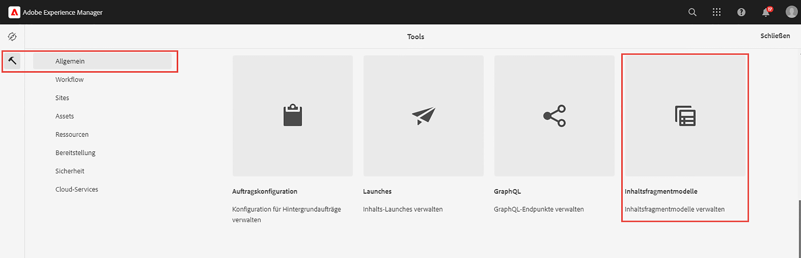

1. Wählen Sie **WKND Shared**, um die Liste der vorhandenen Inhaltsfragmentmodelle für die Site anzuzeigen.

### Kontaktinformationsmodell {#contact-info-model}

Erstellen Sie anschließend ein Modell, das die Kontaktinformationen für eine Person oder einen Standort enthält.

1. Wählen Sie **Erstellen** in der oberen rechten Ecke.

1. Geben Sie dem Modell den Namen „Kontaktinfo“ und wählen Sie dann **Erstellen**. Wählen Sie im modalen Erfolgsfenster, das angezeigt wird, die Option **Öffnen**, um das neu erstellte Modell zu bearbeiten.

1. Ziehen Sie zunächst ein **einzeiliges Textfeld** auf das Modell. Geben Sie ihm auf der Registerkarte **Eigenschaften** die **Feldbezeichnung** „Telefon“. Der Eigenschaftsname wird automatisch als `phone` eingefügt. Aktivieren Sie das Kontrollkästchen, um das Feld **erforderlich** zu machen.

1. Navigieren Sie zur Registerkarte **Datentypen** und fügen Sie dann unter dem Feld „Telefon“ ein weiteres **einzeiliges Textfeld** hinzu. Geben Sie ihm die **Feldbezeichnung** „E-Mail“ und setzen Sie es ebenfalls auf **Erforderlich**.

Adobe Experience Manager verfügt über einige integrierte Validierungsmethoden. Mit diesen Validierungsmethoden können Sie bestimmten Feldern in Ihren Inhaltsfragmentmodellen Governance-Regeln hinzufügen. Fügen wir in diesem Fall eine Validierungsregel hinzu, um sicherzustellen, dass Benutzende beim Ausfüllen dieses Felds nur gültige E-Mail-Adressen eingeben können. Wählen Sie in der Dropdown-Liste **Validierungstyp** die Option **E-Mail** aus.

Ihr fertiges Inhaltsfragmentmodell sollte wie folgt aussehen:

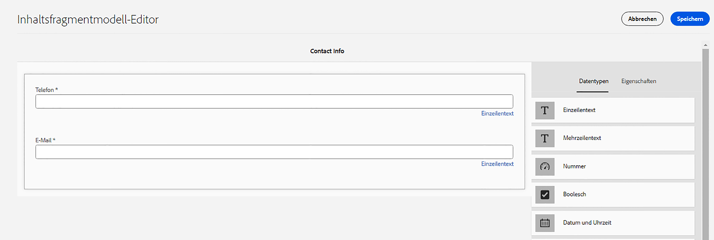

Wählen Sie anschließend **Speichern**, um Ihre Änderungen zu bestätigen und den Inhaltsfragmentmodell-Editor zu schließen.

### Adressmodell {#address-model}

Erstellen Sie anschließend ein Modell für eine Adresse.

1. Wählen Sie in **WKND Shared** oben rechts die Option **Erstellen** aus.

1. Geben Sie den Titel „Adresse“ ein und wählen Sie dann **Erstellen**. Wählen Sie im modalen Erfolgsfenster, das angezeigt wird, die Option **Öffnen**, um das neu erstellte Modell zu bearbeiten.

1. Ziehen Sie per Drag-and-Drop ein **einzeiliges Textfeld** auf das Modell und geben Sie ihm die **Feldbezeichnung** „Adresse“. Der Eigenschaftsname wird dann als `streetAddress` ausgefüllt. Wählen Sie das Kontrollkästchen **Erforderlich** aus.

1. Wiederholen Sie die obigen Schritte und fügen Sie dem Modell vier weitere Felder „Einzelzeilentext“ hinzu. Verwenden Sie die folgenden Bezeichnungen:

   * Stadt
   * Bundesland
   * Postleitzahl
   * Land

1. Klicken Sie auf **Speichern**, um die Änderungen am Adressmodell zu speichern.

   Das vollständige Fragmentmodell „Adresse“ sollte wie folgt aussehen:
   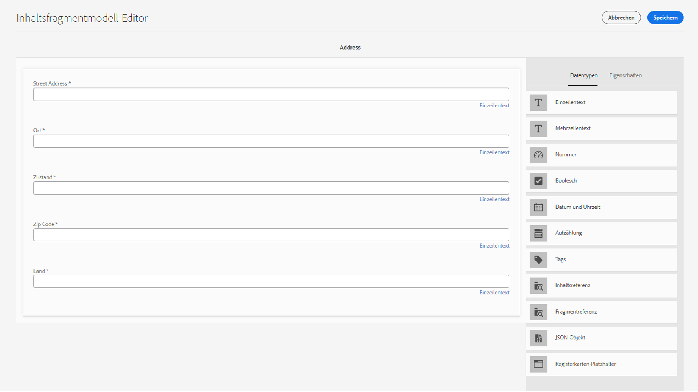

### Personenmodell {#person-model}

Erstellen Sie anschließend ein Modell, das Informationen zu einer Person enthält.

1. Klicken Sie oben rechts auf **Erstellen**.

1. Geben Sie dem Modell den Titel „Person“ und wählen Sie **Erstellen** aus. Wählen Sie im modalen Erfolgsfenster, das angezeigt wird, die Option **Öffnen**, um das neu erstellte Modell zu bearbeiten.

1. Ziehen Sie zunächst per Drag-and-Drop ein **einzeiliges Textfeld** auf das Modell. Geben Sie als **Feldbezeichnung** „Vollständiger Name“ an. Der Eigenschaftsname wird automatisch als `fullName` eingefügt. Aktivieren Sie das Kontrollkästchen, um das Feld **Erforderlich** zu machen.

   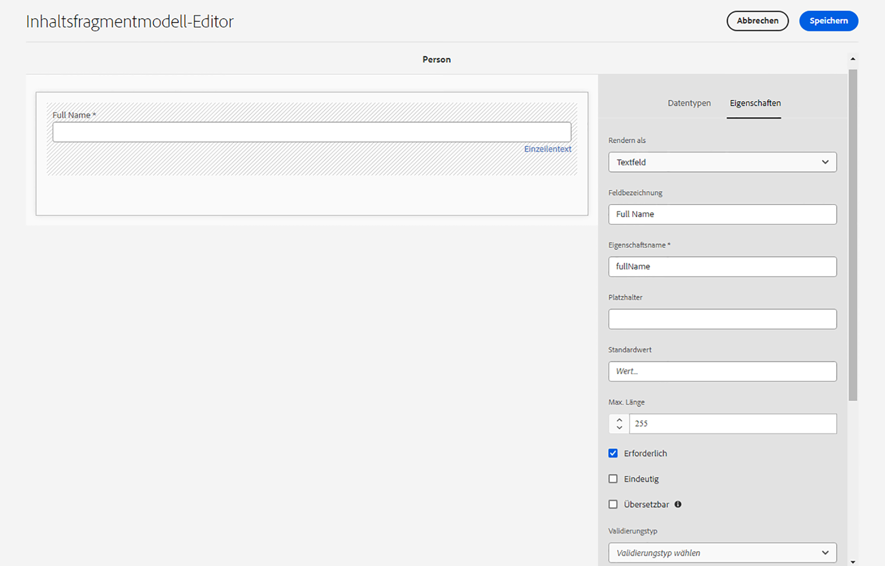

1. Inhaltsfragmentmodelle können in anderen Modellen referenziert werden. Navigieren Sie zur Registerkarte **Datentypen**, ziehen Sie das Feld **Fragmentverweis** per Drag-and-Drop und geben Sie ihm die Bezeichnung „Kontaktinfo“.

1. Wählen Sie in der Registerkarte **Eigenschaften** unter **Zulässige Inhaltsfragmentmodelle** das Ordnersymbol aus und wählen Sie dann das **Kontaktinfo**-Fragmentmodell aus, das Sie zuvor erstellt haben.

1. Fügen Sie ein **Inhaltsreferenz**-Feld hinzu und geben Sie ihm die **Feldbezeichnung** „Profilbild“. Wählen Sie das Ordnersymbol unter **Stammverzeichnis** aus, um das Pfadauswahlmodal zu öffnen. Wählen Sie einen Stammpfad aus, indem Sie **Inhalt** > **Assets** auswählen, und aktivieren Sie dann das Kontrollkästchen für **WKND Shared**. Klicken Sie auf **Auswählen** rechts oben, um den Pfad zu speichern. Der endgültige Textpfad sollte `/content/dam/wknd-shared` lauten.

   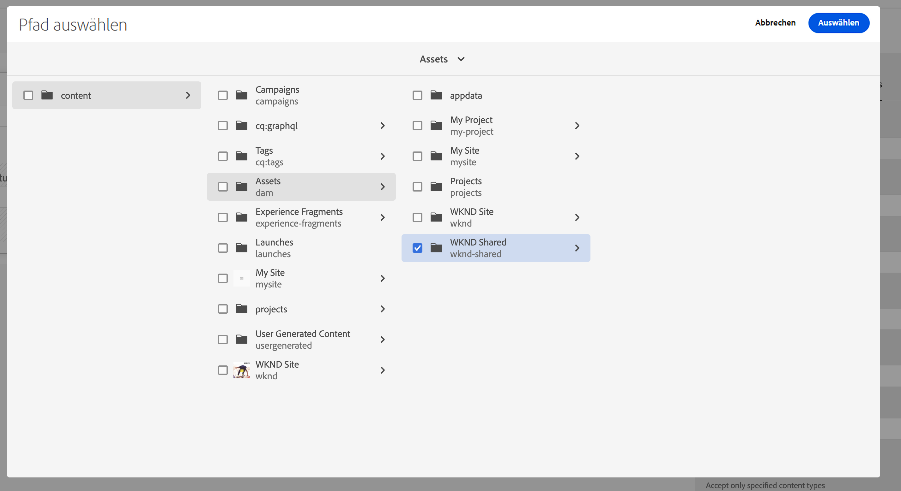

1. Wählen Sie unter **Nur angegebene Inhaltstypen akzeptieren** „Bild“ aus.

   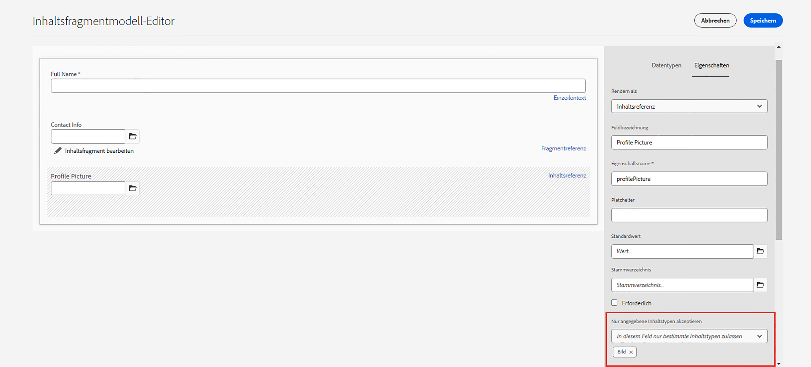

1. Um die Größe und die Abmessungen der Grafikdatei zu begrenzen, sehen wir uns einige Validierungsoptionen für das Inhaltsreferenzfeld an.

   Wählen Sie unter **Nur angegebene Dateigröße akzeptieren** „Kleiner oder gleich“ aus, woraufhin unten zusätzliche Felder angezeigt werden.
   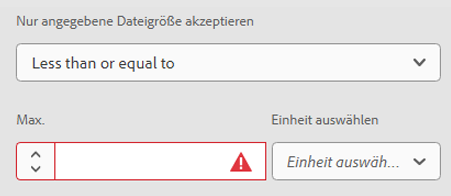

1. Geben Sie für **Maximal** „5“ und für **Einheit auswählen** „Megabyte (MB)“ aus. Bei dieser Validierung können nur Bilder der angegebenen Größe ausgewählt werden.

1. Wählen Sie unter **Nur angegebene Bildbreite akzeptieren** „Maximale Breite“ aus. Geben Sie im Feld **Maximal (Pixel)** „10000“ ein. Wählen Sie dieselben Optionen für **Nur eine angegebene Bildhöhe akzeptieren** aus.

   Diese Überprüfungen stellen sicher, dass hinzugefügte Bilder die angegebenen Werte nicht überschreiten. Die Validierungsregeln sollten jetzt wie folgt aussehen:

   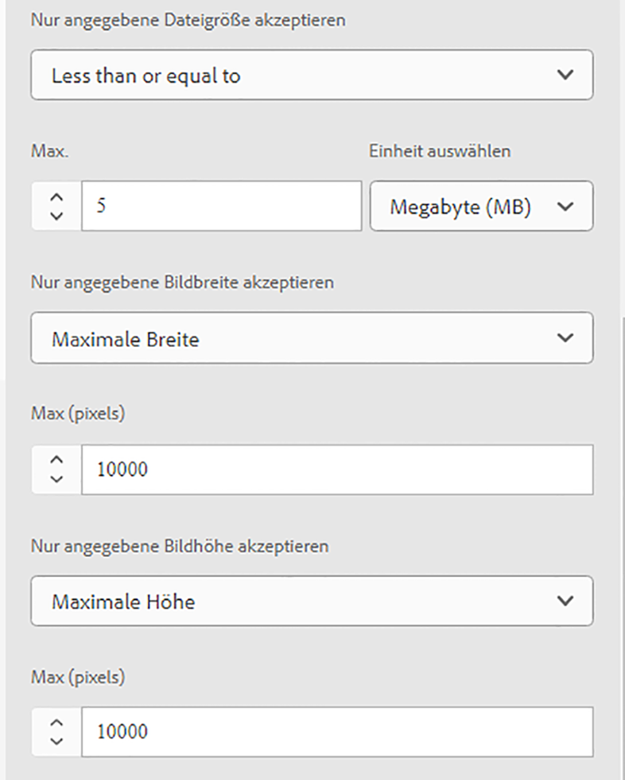

1. Fügen Sie ein Feld **Mehrzeiliger Text** hinzu und geben Sie ihm die **Feldbezeichnung** „Biografie“. Lassen Sie die Dropdown-Liste **Standardtyp** auf der Option „Rich Text“.

   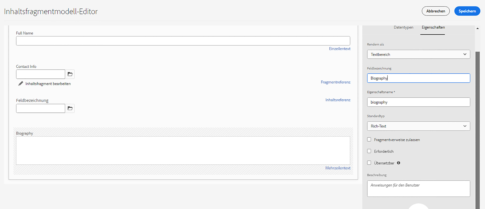

1. Navigieren Sie zur Registerkarte **Datentypen** und ziehen Sie ein **Auflistungsfeld** unter „Biografie“. Wählen Sie anstelle der Standardeinstellung **Rendern als** die Option **Dropdown** aus und geben Sie ihr die **Feldbezeichnung** „Ausbilder-Erfahrungsstufe“. Geben Sie eine Auswahl von Optionen für die Ausbilder-Erfahrungsstufe ein, z. B. _Versiert, Fortgeschritten, Mittleres Niveau_.

1. Ziehen Sie als Nächstes per Drag-and-Drop ein weiteres **Auflistungsfeld** unter „Ausbilder-Erfahrungsstufe“ und wählen Sie „Kontrollkästchen“ unterhalb der Option **Rendern als**. Geben Sie ihm die **Feldbezeichnung** „Fähigkeiten“. Geben Sie verschiedene Fähigkeiten ein, wie Rock Climbing, Surfing, Cycling, Skiing und Backpacking. Die Beschriftung der Option und der Optionswert sollten wie folgt übereinstimmen:

   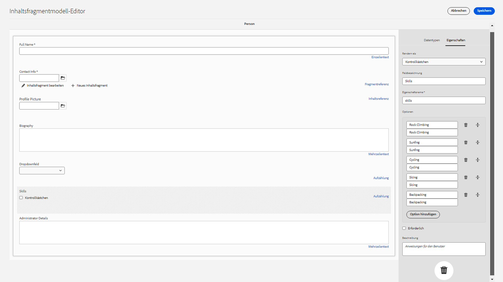

1. Erstellen Sie abschließend die Feldbezeichnung „Administrator-Details“ mit einem Feld **Mehrzeiliger Text**.

Klicken Sie auf **Speichern**, um Ihre Änderungen zu bestätigen und den Inhaltsfragmentmodell-Editor zu schließen.

### Standortmodell {#location-model}

Das nächste Inhaltsfragmentmodell beschreibt einen physischen Standort. Dieses Modell verwendet Platzhalter für Registerkarten. Registerkarten-Platzhalter helfen durch die Kategorisierung des Inhalts bei der Organisation Ihrer Datentypen im Modell-Editor und des Inhalts im Fragment-Editor. Jeder Platzhalter erstellt im Inhaltsfragment-Editor eine Registerkarte, die einer Registerkarte in einem Browser ähnelt. Das Standortmodell sollte über zwei Registerkarten verfügen: Standort-Details und Standort-Adresse.

1. Wählen Sie wie zuvor **Erstellen** aus, um ein anderes Inhaltsfragmentmodell zu erstellen. Geben Sie als Modelltitel „Standort“ ein. Wählen Sie im modalen Erfolgsfenster, das angezeigt wird, **Erstellen** und dann **Öffnen**.

1. Fügen Sie ein Feld **Registerkarten-Platzhalter** zum Modell hinzu und beschriften Sie es mit „Standortdetails“.

1. Platzieren Sie ein **einzeiliges Textfeld** per Drag-and-Drop und beschriften Sie ihn mit „Name“. Fügen Sie unterhalb dieser Feldbeschriftung ein Feld **Mehrzeiliger Text** ein und beschriften Sie es mit „Beschreibung“.

1. Fügen Sie als Nächstes einen **Fragmentverweis** hinzu und beschriften Sie ihn mit „Kontaktinfo“. Wählen Sie auf der Registerkarte „Eigenschaften“ unter **Zulässige Inhaltsfragmentmodelle** das **Ordnersymbol** aus und wählen Sie das zuvor erstellte Fragmentmodell „Kontaktinfo“ aus.

1. Fügen Sie unter „Kontaktinfo“ eine **Inhaltsreferenz** hinzu. Beschriften Sie sie mit „Standortbild“. Das **Stammverzeichnis** sollte `/content/dam/wknd-shared.` sein. Wählen Sie unter **Nur angegebene Inhaltstypen akzeptieren** „Bild“ aus.

1. Wir fügen auch ein Feld **JSON-Objekt** unterhalb von „Standortbild“ hinzu. Da dieser Datentyp flexibel ist, kann er zur Anzeige beliebiger Daten verwendet werden, die Sie in Ihren Inhalt aufnehmen möchten. In diesem Fall wird das JSON-Objekt verwendet, um Informationen über das Wetter anzuzeigen. Beschriften Sie das JSON-Objekt mit „Wetter nach Jahreszeit“. Fügen Sie auf der Registerkarte **Eigenschaften** eine **Beschreibung** hinzu, damit es für die Benutzenden klar ersichtlich ist, welche Daten hier eingegeben werden sollen: „JSON-Daten zum Wetter am Veranstaltungsort nach Jahreszeit (Frühling, Sommer, Herbst, Winter)“.

   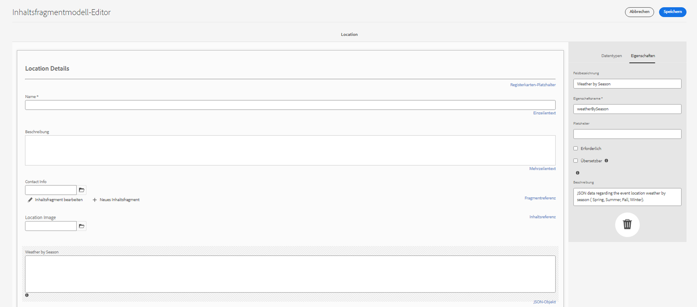

1. Fügen Sie zum Erstellen der Registerkarte „Standortadresse“ ein Feld **Registerkarten-Platzhalter** zum Modell hinzu und beschriften es mit „Standortadresse“.

1. Platzieren Sie per Drag-and-Drop einen **Fragmentverweis**, beschriften Sie ihn über die Registerkarte „Eigenschaften“ mit „Adresse“ und wählen Sie unter **Zulässige Inhaltsfragmentmodelle** das Modell **Adresse** aus.

1. Klicken Sie auf **Speichern**, um Ihre Änderungen zu bestätigen und den Inhaltsfragmentmodell-Editor zu schließen. Das fertige Standortmodell sollte wie folgt angezeigt werden:

   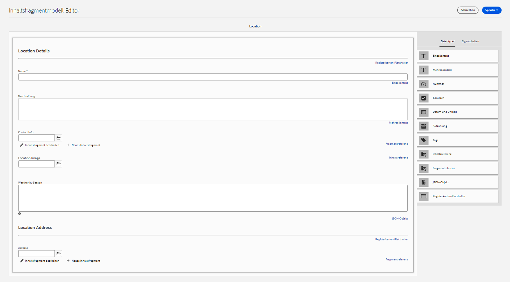

### Team-Modell {#team-model}

Erstellen Sie abschließend ein Modell, das ein Team von Personen beschreibt.

1. Wählen Sie dazu auf der Seite **WKND Shared** die Option **Erstellen** aus, um ein anderes Inhaltsfragmentmodell zu erstellen. Geben Sie als Titel für das Modell „Team“ ein. Wählen Sie wie zuvor im modalen Erfolgsfenster, das angezeigt wird, **Erstellen** aus, gefolgt von **Öffnen**.

1. Fügen Sie ein Feld **Mehrzeiliger Text** zum Formular hinzu. Geben Sie unter **Feldbezeichnung** „Beschreibung“ ein.

1. Fügen Sie ein Feld **Datum und Uhrzeit** zum Modell hinzu und beschriften es mit „Team-Gründungsdatum“. Behalten Sie in diesem Fall die Standardeinstellung „Datum“ für den **Typ** bei, doch beachten Sie, dass auch „Datum und Uhrzeit“ oder „Zeit“ verwendet werden können.

   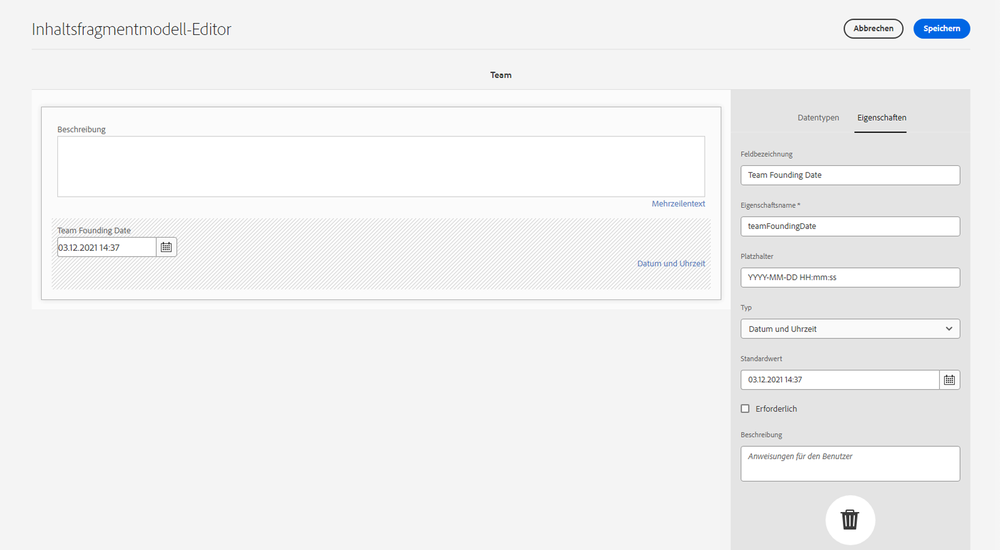

1. Navigieren Sie zur Registerkarte **Datentypen**. Fügen Sie unter „Team-Gründungsdatum“ einen **Fragmentverweis** hinzu. Wählen Sie in der Dropdown-Liste **Rendern als** die Option „Mehfachfeld“ aus. Geben Sie als **Feldbezeichnung** „Team-Mitglieder“ ein. Dieses Feld ist verknüpft mit dem Modell _Person_, das zuvor erstellt wurde. Da es sich bei dem Datentyp um ein Mehrfachfeld handelt, können mehrere Personenfragmente hinzugefügt werden, sodass ein Team von Personen erstellt werden kann.

   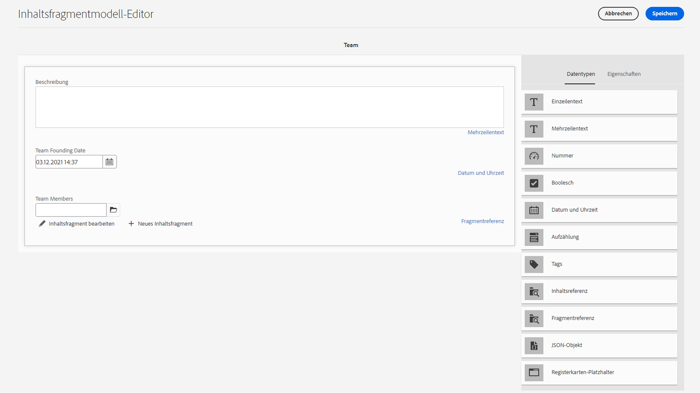

1. Verwenden Sie unter **Zulässige Inhaltsfragmentmodelle** das Ordnersymbol, um das Modal „Pfad auswählen“ zu öffnen, und wählen Sie dann das Modell **Person** aus. Klicken Sie auf **Auswählen**, um den Pfad zu speichern.

   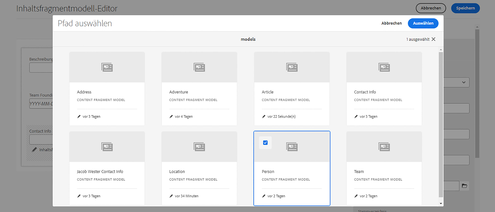

1. Klicken Sie auf **Speichern**, um Ihre Änderungen zu bestätigen und den Inhaltsfragmentmodell-Editor zu schließen.

## Hinzufügen von Fragmentverweisen zum Adventure-Modell {#fragment-references}

Ähnlich wie das Team-Modell einen Fragmentverweis auf das Personen-Modell hat, müssen die Team- und Standortmodelle vom Adventure-Modell referenziert werden, um diese neuen Modelle in der WKND-App anzuzeigen.

1. Wählen Sie auf der Seite **WKND Shared** das **Adventure**-Modell aus und klicken Sie dann in der oberen Navigationsleiste auf **Bearbeiten**.

   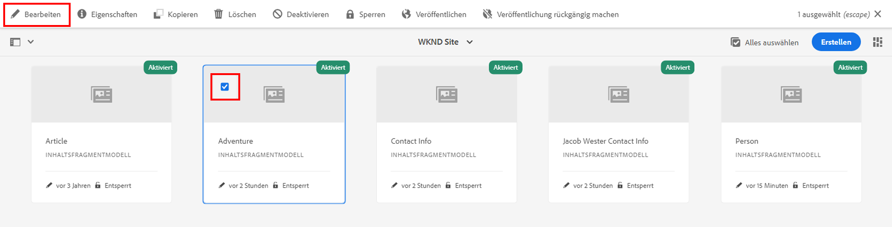

1. Fügen Sie am unteren Rand des Formulars unter „Was ist mitzubringen?“ ein **Fragmentverweis**-Feld hinzu. Geben Sie als **Feldbezeichnung** „Standort“ ein. Wählen Sie unter **Zulässige Inhaltsfragmentmodelle** das **Standort**-Modell aus.

   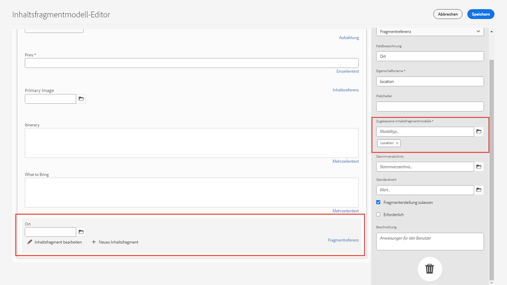

1. Fügen Sie eine weiteres **Fragmentverweis**-Feld hinzu und beschriften Sie es mit „Ausbilder-Team“. Wählen Sie unter **Zulässige Inhaltsfragmentmodelle** das **Team**-Modell aus.

   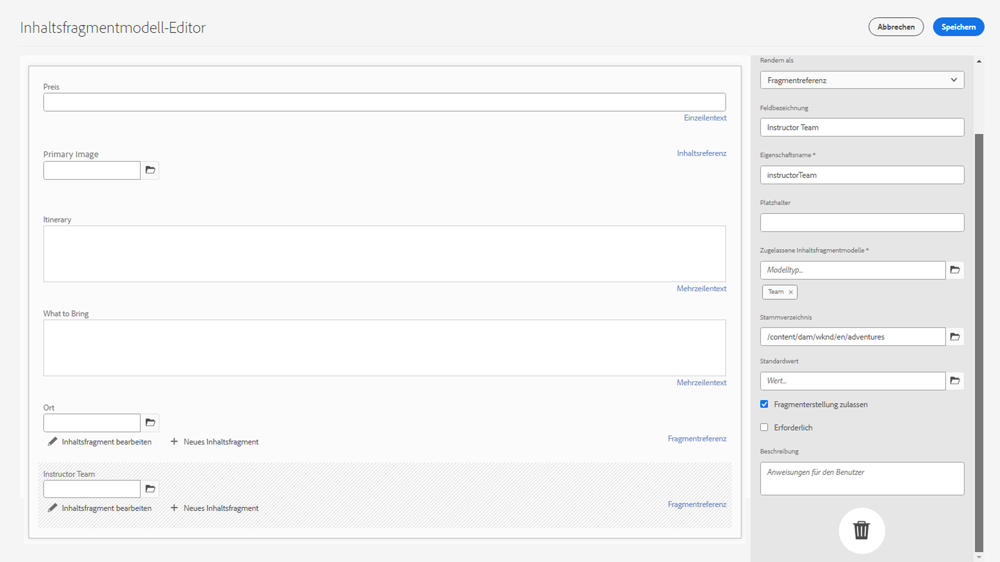

1. Fügen Sie ein weiteres **Fragmentverweis**-Feld hinzu und beschriften Sie es mit „Administrator“.

   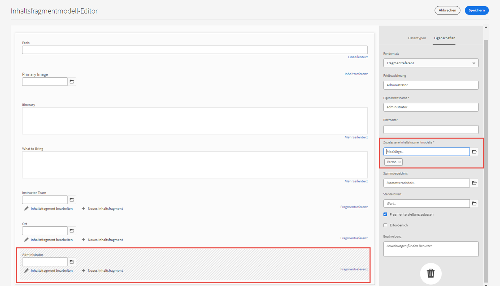

1. Wählen Sie **Speichern** aus, um Ihre Änderungen zu bestätigen und den Inhaltsfragmentmodell-Editor zu schließen.

## Best Practices {#best-practices}

Es gibt einige Best Practices beim Erstellen von Inhaltsfragmentmodellen:

* Erstellen Sie Modelle, die UX-Komponenten zugeordnet sind. Beispielsweise verfügt die WKND-App über Inhaltsfragmentmodelle für Adventures, Artikel und Standorte. Sie können auch Kopfzeilen, Promotions oder Haftungsausschlüsse hinzufügen. Jedes dieser Beispiele bildet eine spezifische UX-Komponente.

* Erstellen Sie so wenige Modelle wie möglich. Durch die Begrenzung der Anzahl von Modellen können Sie die Wiederverwendung maximieren und das Content-Management vereinfachen.

* Verschachteln Sie Inhaltsfragmentmodelle nur so tief wie nötig. Denken Sie daran, dass die Verschachtelung mit Fragmentverweisen oder Inhaltsreferenzen erreicht wird. Ziehen Sie maximal fünf Verschachtelungsebenen in Betracht.

## Herzlichen Glückwunsch! {#congratulations}

Herzlichen Glückwunsch! Sie haben jetzt Registerkarten hinzugefügt, die Datentypen für Datum und Uhrzeit sowie JSON-Objekte verwendet und mehr über Fragmentverweise und Inhaltsreferenzen erfahren. Sie haben auch Validierungsregeln für Inhaltsreferenzen hinzugefügt.

## Nächste Schritte {#next-steps}

Das nächste Kapitel dieser Reihe wird Folgendes umfassen: [Authoring mit Inhaltsfragmenten](/help/headless-tutorial/graphql/advanced-graphql/author-content-fragments.md) aus den Modellen, die Sie in diesem Kapitel erstellt haben. Erfahren Sie, wie Sie die in diesem Kapitel eingeführten Datentypen verwenden und Ordnerrichtlinien erstellen, um zu begrenzen, welche Inhaltsfragmentmodelle in einem Asset-Ordner erstellt werden können.

Obwohl dies für dieses Tutorial optional ist, stellen Sie sicher, dass Sie alle Inhalte in realen Produktionssituationen veröffentlichen. Eine Übersicht der Autoren- und Veröffentlichungsumgebungen in AEM finden Sie in den
[AEM Headless- und GraphQL-Videoserien](/help/headless-tutorial/graphql/video-series/author-publish-architecture.md).
