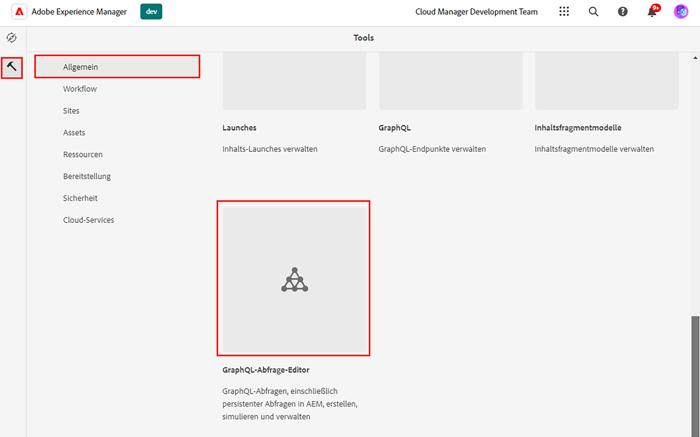
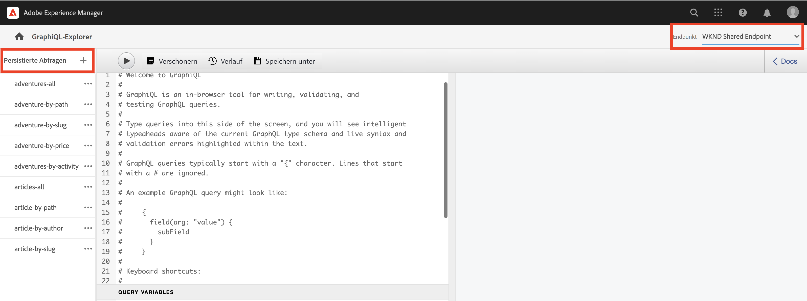
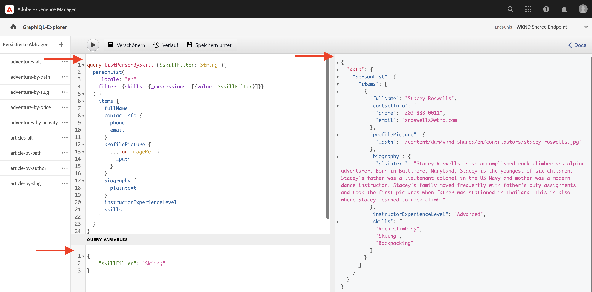

# Erkunden Sie die AEM GraphQL API

Mit der GraphQL-API in AEM können Sie Inhaltsfragmentdaten für nachgelagerte Anwendungen verfügbar machen. Im grundlegenden Tutorial [Mehrstufiges GraphQL-Tutorial](../multi-step/explore-graphql-api.md)verwendet haben, haben Sie den GraphiQL Explorer zum Testen und Verfeinern der GraphQL-Abfragen verwendet.

In diesem Kapitel verwenden Sie den GraphiQL Explorer, um erweiterte Abfragen zu definieren, um Daten der Inhaltsfragmente zu erfassen, die Sie in der [vorheriges Kapitel](../advanced-graphql/author-content-fragments.md).

## Voraussetzungen {#prerequisites}

Dieses Dokument ist Teil eines mehrteiligen Tutorials. Bevor Sie mit diesem Kapitel fortfahren, vergewissern Sie sich bitte, dass die vorherigen Kapitel abgeschlossen sind.

## Ziele {#objectives}

In diesem Kapitel erfahren Sie, wie Sie:

* Filtern einer Liste von Inhaltsfragmenten mit Verweisen mithilfe von Abfragevariablen
* Filtern von Inhalten in einem Fragmentverweis
* Abfragen von Inline-Inhalten und Fragmentverweisen aus einem mehrzeiligen Textfeld
* Abfrage mithilfe von Anweisungen
* Abfrage nach dem Content-Typ JSON-Objekt

## Verwenden des GraphiQL Explorer


Die [GraphiQL Explorer](https://experienceleague.adobe.com/docs/experience-manager-cloud-service/content/headless/graphql-api/graphiql-ide.html) ermöglicht es Entwicklern, Abfragen für Inhalte in der aktuellen AEM-Umgebung zu erstellen und zu testen. Mit dem GraphQL-Tool können Benutzer auch **beibehalten oder speichern** -Abfragen, die von Clientanwendungen in einer Produktionseinstellung verwendet werden sollen.

Erkunden Sie als Nächstes die Leistungsfähigkeit AEM GraphQL-API mit dem integrierten GraphiQL Explorer.

1. Navigieren Sie im Bildschirm AEM Start zu **Instrumente** > **Allgemein** > **GraphQL-Abfrage-Editor**.

   

>[!IMPORTANT]
>
>In einigen Versionen von AEM (6.X.X) muss das Tool GraphiQL Explorer (auch GraphiQL IDE genannt) manuell installiert werden. Befolgen Sie [Anweisung von hier](../how-to/install-graphiql-aem-6-5.md).

1. Stellen Sie oben rechts sicher, dass der Endpunkt auf **WKND Shared Endpoint**. Ändern der _Endpunkt_ Dropdown-Wert Hier zeigt den vorhandenen _Beständige Abfragen_ in der oberen linken Ecke.

   

Dadurch werden alle Abfragen auf Modelle angewendet, die in der **WKND Shared** Projekt.


## Filtern einer Liste von Inhaltsfragmenten mithilfe von Abfragevariablen

Im vorherigen [Mehrstufiges GraphQL-Tutorial](../multi-step/explore-graphql-api.md), haben Sie grundlegende persistente Abfragen definiert und verwendet, um Inhaltsfragmentdaten abzurufen. Hier erweitern Sie dieses Wissen und filtern Inhaltsfragmentdaten, indem Sie Variablen an die persistenten Abfragen übergeben.

Bei der Entwicklung von Clientanwendungen müssen Sie normalerweise Inhaltsfragmente basierend auf dynamischen Argumenten filtern. Mit der AEM GraphQL-API können Sie diese Argumente als Variablen in einer Abfrage übergeben, um die Erstellung von Zeichenfolgen zur Laufzeit auf Client-Seite zu vermeiden. Weitere Informationen zu GraphQL-Variablen finden Sie in der [GraphQL-Dokumentation](https://graphql.org/learn/queries/#variables).

In diesem Beispiel werden alle Instruktoren abgefragt, die eine bestimmte Fähigkeit besitzen.

1. Fügen Sie in die GraphiQL-IDE die folgende Abfrage in den linken Bereich ein:

   ```graphql
   query listPersonBySkill ($skillFilter: String!){
     personList(
       _locale: "en"
       filter: {skills: {_expressions: [{value: $skillFilter}]}}
     ) {
       items {
         fullName
         contactInfo {
           phone
           email
         }
         profilePicture {
           ... on ImageRef {
             _path
           }
         }
         biography {
           plaintext
         }
         instructorExperienceLevel
         skills
       }
     }
   }
   ```

   Die `listPersonBySkill` -Abfrage akzeptiert eine Variable (`skillFilter`), die erforderlich ist `String`. Diese Abfrage führt eine Suche für alle Personen-Inhaltsfragmente durch und filtert sie basierend auf der `skills` und die übergebene Zeichenfolge `skillFilter`.

   Die `listPersonBySkill` enthält `contactInfo` -Eigenschaft, die einen Fragmentverweis auf das in den vorherigen Kapiteln definierte Modell &quot;Kontaktinfo&quot;darstellt. Das Modell Kontaktinformationen enthält `phone` und `email` -Felder. Mindestens eines dieser Felder in der Abfrage muss vorhanden sein, damit es ordnungsgemäß ausgeführt werden kann.

   ```graphql
   contactInfo {
           phone
           email
         }
   ```

1. Als Nächstes definieren wir `skillFilter` und alle Instruktoren, die im Skifahren befähigt sind. Fügen Sie die folgende JSON-Zeichenfolge in den Bereich &quot;Query Variables&quot;in die GraphiQL-IDE ein:

   ```json
   {
       "skillFilter": "Skiing"
   }
   ```

1. Führen Sie die Abfrage aus. Das Ergebnis sollte in etwa wie folgt aussehen:

   ```json
   {
     "data": {
       "personList": {
         "items": [
           {
             "fullName": "Stacey Roswells",
             "contactInfo": {
               "phone": "209-888-0011",
               "email": "sroswells@wknd.com"
             },
             "profilePicture": {
               "_path": "/content/dam/wknd-shared/en/contributors/stacey-roswells.jpg"
             },
             "biography": {
               "plaintext": "Stacey Roswells is an accomplished rock climber and alpine adventurer. Born in Baltimore, Maryland, Stacey is the youngest of six children. Stacey's father was a lieutenant colonel in the US Navy and mother was a modern dance instructor. Stacey's family moved frequently with father's duty assignments and took the first pictures when father was stationed in Thailand. This is also where Stacey learned to rock climb."
             },
             "instructorExperienceLevel": "Advanced",
             "skills": [
               "Rock Climbing",
               "Skiing",
               "Backpacking"
             ]
           }
         ]
       }
     }
   }
   ```

Drücken Sie die **Play** im oberen Menü, um die Abfrage auszuführen. Sie sollten die Ergebnisse der Inhaltsfragmente aus dem vorherigen Kapitel sehen:



## Filtern von Inhalten in einem Fragmentverweis

Mit der AEM GraphQL-API können Sie verschachtelte Inhaltsfragmente abfragen. Im vorherigen Kapitel haben Sie drei neue Fragmentverweise zu einem Abenteuer-Inhaltsfragment hinzugefügt: `location`, `instructorTeam`und `administrator`. Filtern wir nun alle Adventures nach jedem Administrator, der einen bestimmten Namen hat.

>[!CAUTION]
>
>Nur ein Modell darf als Referenz verwendet werden, damit diese Abfrage ordnungsgemäß ausgeführt werden kann.

1. Fügen Sie in die GraphiQL-IDE die folgende Abfrage in den linken Bereich ein:

   ```graphql
   query getAdventureAdministratorDetailsByAdministratorName ($name: String!){
     adventureList(
     _locale: "en"
       filter: {administrator: {fullName: {_expressions: [{value: $name}]}}}
     ) {
       items {
         title
         administrator {
           fullName
           contactInfo {
             phone
             email
           }
           administratorDetails {
             json
           }
         }
       }
     }
   }
   ```

1. Fügen Sie anschließend die folgende JSON-Zeichenfolge in das Bedienfeld &quot;Abfragevariablen&quot;ein:

   ```json
   {
       "name": "Jacob Wester"
   }
   ```

   Die `getAdventureAdministratorDetailsByAdministratorName` Abfrage filtert alle Abenteuer für beliebige `administrator` von `fullName` &quot;Jacob Wester&quot;zurück, der Informationen aus zwei verschachtelten Inhaltsfragmenten zurückgibt: Adventure und Instructor.

1. Führen Sie die Abfrage aus. Das Ergebnis sollte in etwa wie folgt aussehen:

   ```json
   {
     "data": {
       "adventureList": {
         "items": [
           {
             "title": "Yosemite Backpacking",
             "administrator": {
               "fullName": "Jacob Wester",
               "contactInfo": {
                 "phone": "209-888-0000",
                 "email": "jwester@wknd.com"
               },
               "administratorDetails": {
                 "json": [
                   {
                     "nodeType": "paragraph",
                     "content": [
                       {
                         "nodeType": "text",
                         "value": "Jacob Wester has been coordinating backpacking adventures for three years."
                       }
                     ]
                   }
                 ]
               }
             }
           }
         ]
       }
     }
   }
   ```

## Abfragen von Inline-Verweisen aus einem mehrzeiligen Textfeld {#query-rte-reference}

Mit der AEM GraphQL API können Sie in mehrzeiligen Textfeldern nach Inhalten und Fragmentverweisen abfragen. Im vorherigen Kapitel haben Sie beide Referenztypen zum **Beschreibung** -Feld des Yosemite-Team-Inhaltsfragments. Nun rufen wir diese Verweise ab.

1. Fügen Sie in die GraphiQL-IDE die folgende Abfrage in den linken Bereich ein:

   ```graphql
   query getTeamByAdventurePath ($fragmentPath: String!){
     adventureByPath (_path: $fragmentPath) {
       item {
         instructorTeam {
           _metadata {
             stringMetadata {
               name
               value
             }
         }
           teamFoundingDate
           description {
             plaintext
           }
         }
       }
       _references {
         ... on ImageRef {
           __typename
           _path
         }
         ... on LocationModel {
           __typename
           _path
           name
           address {
             streetAddress
             city
             zipCode
             country
           }
           contactInfo {
             phone
             email
           }
         }
       }
     }
   }
   ```

   Die `getTeamByAdventurePath` Abfrage filtert alle Abenteuer nach Pfad und gibt Daten für die `instructorTeam` Fragmentverweis eines bestimmten Abenteuers.

   `_references` ist ein systemgeneriertes Feld, das verwendet wird, um Verweise anzuzeigen, einschließlich derjenigen, die in mehrzeilige Textfelder eingefügt werden.

   Die `getTeamByAdventurePath` Abfrage ruft mehrere Verweise ab. Zunächst wird die integrierte `ImageRef` -Objekt zum Abrufen der `_path` und `__typename` von Bildern, die als Inhaltsreferenzen in das mehrzeilige Textfeld eingefügt wurden. Als Nächstes verwendet er `LocationModel` , um die Daten des im selben Feld eingefügten Location Content Fragment abzurufen.

   Die Abfrage enthält auch die `_metadata` -Feld. Auf diese Weise können Sie den Namen des Team Content Fragments abrufen und später in der WKND-App anzeigen.

1. Fügen Sie als Nächstes die folgende JSON-Zeichenfolge in das Bedienfeld &quot;Abfragevariablen&quot;ein, um das Yosemite-Backpackerabenteuer zu erhalten:

   ```json
   {
       "fragmentPath": "/content/dam/wknd-shared/en/adventures/yosemite-backpacking/yosemite-backpacking"
   }
   ```

1. Führen Sie die Abfrage aus. Das Ergebnis sollte in etwa wie folgt aussehen:

   ```json
   {
     "data": {
       "adventureByPath": {
         "item": {
           "instructorTeam": {
             "_metadata": {
               "stringMetadata": [
                 {
                   "name": "title",
                   "value": "Yosemite Team"
                 },
                 {
                   "name": "description",
                   "value": ""
                 }
               ]
             },
             "teamFoundingDate": "2016-05-24",
             "description": {
               "plaintext": "\n\nThe team of professional adventurers and hiking instructors working in Yosemite National Park.\n\nYosemite Valley Lodge"
             }
           }
         },
         "_references": [
           {
             "__typename": "LocationModel",
             "_path": "/content/dam/wknd-shared/en/adventures/locations/yosemite-valley-lodge/yosemite-valley-lodge",
             "name": "Yosemite Valley Lodge",
             "address": {
               "streetAddress": "9006 Yosemite Lodge Drive",
               "city": "Yosemite National Park",
               "zipCode": "95389",
               "country": "United States"
             },
             "contactInfo": {
               "phone": "209-992-0000",
               "email": "yosemitelodge@wknd.com"
             }
           },
           {
             "__typename": "ImageRef",
             "_path": "/content/dam/wknd-shared/en/adventures/teams/yosemite-team/team-yosemite-logo.png"
           }
         ]
       }
     }
   }
   ```

   Die `_references` zeigt sowohl das Logo-Bild als auch das Yosemite Valley Lodge Content Fragment an, das in das **Beschreibung** -Feld.


## Abfrage mithilfe von Anweisungen

Manchmal müssen Sie bei der Entwicklung von Clientanwendungen die Struktur Ihrer Abfragen bedingt ändern. In diesem Fall können Sie mit der AEM GraphQL API GraphQL-Anweisungen verwenden, um das Verhalten Ihrer Abfragen anhand der bereitgestellten Kriterien zu ändern. Weitere Informationen zu GraphQL-Direktiven finden Sie im [GraphQL-Dokumentation](https://graphql.org/learn/queries/#directives).

Im [vorheriger Abschnitt](#query-rte-reference), haben Sie gelernt, wie Sie in mehrzeiligen Textfeldern nach Inline-Verweisen abfragen können. Der Inhalt wurde aus dem `description` im `plaintext` Format. Als Nächstes erweitern wir diese Abfrage und verwenden eine Anweisung, um bedingt abzurufen. `description` im `json` -Format.

1. Fügen Sie in die GraphiQL-IDE die folgende Abfrage in den linken Bereich ein:

   ```graphql
   query getTeamByAdventurePath ($fragmentPath: String!, $includeJson: Boolean!){
     adventureByPath(_path: $fragmentPath) {
       item {
         instructorTeam {
           _metadata{
             stringMetadata{
               name
               value
             }
           }
           teamFoundingDate
           description {
             plaintext
             json @include(if: $includeJson)
           }
         }
       }
       _references {
         ... on ImageRef {
           __typename
           _path
         }
         ... on LocationModel {
           __typename
           _path
           name
           address {
             streetAddress
             city
             zipCode
             country
           }
           contactInfo {
             phone
             email
           }
         }
       }
     }
   }
   ```

   Die oben stehende Abfrage akzeptiert eine weitere Variable (`includeJson`), die erforderlich ist `Boolean`, auch als Abfragerichtlinie bezeichnet. Eine Direktive kann verwendet werden, um Daten aus dem `description` im Feld `json` Format basierend auf dem booleschen Wert, der übergeben wird `includeJson`.

1. Fügen Sie anschließend die folgende JSON-Zeichenfolge in das Bedienfeld &quot;Abfragevariablen&quot;ein:

   ```json
   {
     "fragmentPath": "/content/dam/wknd-shared/en/adventures/yosemite-backpacking/yosemite-backpacking",
     "includeJson": false
   }
   ```

1. Führen Sie die Abfrage aus. Sie sollten dasselbe Ergebnis erhalten wie im vorherigen Abschnitt auf [Anleitung zum Abfragen von Inline-Verweisen in mehrzeiligen Textfeldern](#query-rte-reference).

1. Aktualisieren Sie die `includeJson` Richtlinie `true` und führen Sie die Abfrage erneut aus. Das Ergebnis sollte in etwa wie folgt aussehen:

   ```json
   {
     "data": {
       "adventureByPath": {
         "item": {
           "instructorTeam": {
             "_metadata": {
               "stringMetadata": [
                 {
                   "name": "title",
                   "value": "Yosemite Team"
                 },
                 {
                   "name": "description",
                   "value": ""
                 }
               ]
             },
             "teamFoundingDate": "2016-05-24",
             "description": {
               "plaintext": "\n\nThe team of professional adventurers and hiking instructors working in Yosemite National Park.\n\nYosemite Valley Lodge",
               "json": [
                 {
                   "nodeType": "paragraph",
                   "content": [
                     {
                       "nodeType": "reference",
                       "data": {
                         "path": "/content/dam/wknd-shared/en/adventures/teams/yosemite-team/team-yosemite-logo.png",
                         "mimetype": "image/png"
                       }
                     }
                   ]
                 },
                 {
                   "nodeType": "paragraph",
                   "content": [
                     {
                       "nodeType": "text",
                       "value": "The team of professional adventurers and hiking instructors working in Yosemite National Park."
                     }
                   ]
                 },
                 {
                   "nodeType": "paragraph",
                   "content": [
                     {
                       "nodeType": "reference",
                       "data": {
                         "href": "/content/dam/wknd-shared/en/adventures/locations/yosemite-valley-lodge/yosemite-valley-lodge",
                         "type": "fragment"
                       },
                       "value": "Yosemite Valley Lodge"
                     }
                   ]
                 }
               ]
             }
           }
         },
         "_references": [
           {
             "__typename": "LocationModel",
             "_path": "/content/dam/wknd-shared/en/adventures/locations/yosemite-valley-lodge/yosemite-valley-lodge",
             "name": "Yosemite Valley Lodge",
             "address": {
               "streetAddress": "9006 Yosemite Lodge Drive",
               "city": "Yosemite National Park",
               "zipCode": "95389",
               "country": "United States"
             },
             "contactInfo": {
               "phone": "209-992-0000",
               "email": "yosemitelodge@wknd.com"
             }
           },
           {
             "__typename": "ImageRef",
             "_path": "/content/dam/wknd-shared/en/adventures/teams/yosemite-team/team-yosemite-logo.png"
           }
         ]
       }
     }
   }
   ```

## Abfrage nach dem Content-Typ JSON-Objekt

Denken Sie daran, dass Sie im vorherigen Kapitel über die Bearbeitung von Inhaltsfragmenten ein JSON-Objekt zum **Wetter nach Saison** -Feld. Rufen wir diese Daten jetzt im Standortinhaltsfragment ab.

1. Fügen Sie in die GraphiQL-IDE die folgende Abfrage in den linken Bereich ein:

   ```graphql
   query getLocationDetailsByLocationPath ($fragmentPath: String!) {
     locationByPath(_path: $fragmentPath) {
       item {
         name
         description {
           json
         }
         contactInfo {
           phone
           email
         }
         locationImage {
           ... on ImageRef {
             _path
           }
         }
         weatherBySeason
         address {
           streetAddress
           city
           state
           zipCode
           country
         }
       }
     }
   }
   ```

1. Fügen Sie anschließend die folgende JSON-Zeichenfolge in das Bedienfeld &quot;Abfragevariablen&quot;ein:

   ```json
   {
     "fragmentPath": "/content/dam/wknd-shared/en/adventures/locations/yosemite-national-park/yosemite-national-park"
   }
   ```

1. Führen Sie die Abfrage aus. Das Ergebnis sollte in etwa wie folgt aussehen:

   ```json
   {
     "data": {
       "locationByPath": {
         "item": {
           "name": "Yosemite National Park",
           "description": {
             "json": [
               {
                 "nodeType": "paragraph",
                 "content": [
                   {
                     "nodeType": "text",
                     "value": "Yosemite National Park is in California's Sierra Nevada mountains. It's famous for its gorgeous waterfalls, giant sequoia trees, and iconic views of El Capitan and Half Dome cliffs."
                   }
                 ]
               },
               {
                 "nodeType": "paragraph",
                 "content": [
                   {
                     "nodeType": "text",
                     "value": "Hiking and camping are the best ways to experience Yosemite. Numerous trails provide endless opportunities for adventure and exploration."
                   }
                 ]
               }
             ]
           },
           "contactInfo": {
             "phone": "209-999-0000",
             "email": "yosemite@wknd.com"
           },
           "locationImage": {
             "_path": "/content/dam/wknd-shared/en/adventures/locations/yosemite-national-park/yosemite-national-park.jpeg"
           },
           "weatherBySeason": {
             "summer": "81 / 89°F",
             "fall": "56 / 83°F",
             "winter": "46 / 51°F",
             "spring": "57 / 71°F"
           },
           "address": {
             "streetAddress": "9010 Curry Village Drive",
             "city": "Yosemite Valley",
             "state": "CA",
             "zipCode": "95389",
             "country": "United States"
           }
         }
       }
     }
   }
   ```

   Die `weatherBySeason` enthält das JSON-Objekt, das im vorherigen Kapitel hinzugefügt wurde.

## Alle Inhalte gleichzeitig abfragen

Bisher wurden mehrere Abfragen ausgeführt, um die Funktionen der AEM GraphQL-API zu veranschaulichen.

Dieselben Daten können nur mit einer einzigen Abfrage abgerufen werden. Diese Abfrage wird später in der Clientanwendung verwendet, um zusätzliche Informationen wie Ort, Teamname und Teammitglieder eines Abenteuers abzurufen:

```graphql
query getAdventureDetailsBySlug($slug: String!) {
  adventureList(filter: {slug: {_expressions: [{value: $slug}]}}) {
    items {
      _path
      title
      activity
      adventureType
      price
      tripLength
      groupSize
      difficulty
      primaryImage {
        ... on ImageRef {
          _path
          mimeType
          width
          height
        }
      }
      description {
        html
        json
      }
      itinerary {
        html
        json
      }
      location {
        _path
        name
        description {
          html
          json
        }
        contactInfo {
          phone
          email
        }
        locationImage {
          ... on ImageRef {
            _path
          }
        }
        weatherBySeason
        address {
          streetAddress
          city
          state
          zipCode
          country
        }
      }
      instructorTeam {
        _metadata {
          stringMetadata {
            name
            value
          }
        }
        teamFoundingDate
        description {
          json
        }
        teamMembers {
          fullName
          contactInfo {
            phone
            email
          }
          profilePicture {
            ... on ImageRef {
              _path
            }
          }
          instructorExperienceLevel
          skills
          biography {
            html
          }
        }
      }
      administrator {
        fullName
        contactInfo {
          phone
          email
        }
        biography {
          html
        }
      }
    }
    _references {
      ... on ImageRef {
        _path
        mimeType
      }
      ... on LocationModel {
        _path
        __typename
      }
    }
  }
}


# in Query Variables
{
  "slug": "yosemite-backpacking"
}
```

## Herzlichen Glückwunsch!

Herzlichen Glückwunsch! Sie haben jetzt erweiterte Abfragen getestet, um Daten zu den Inhaltsfragmenten zu erfassen, die Sie im vorherigen Kapitel erstellt haben.

## Nächste Schritte

Im [Nächstes Kapitel](/help/headless-tutorial/graphql/advanced-graphql/graphql-persisted-queries.md), erfahren Sie, wie Sie GraphQL-Abfragen beibehalten und warum es Best Practice ist, persistente Abfragen in Ihren Anwendungen zu verwenden.
