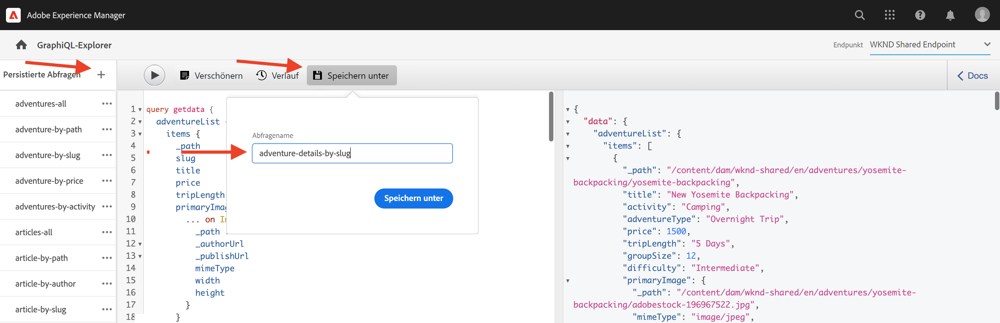
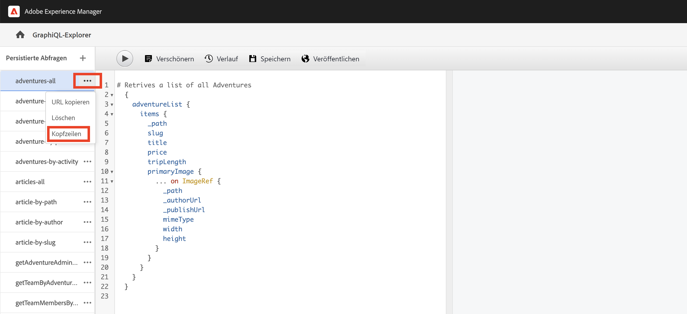
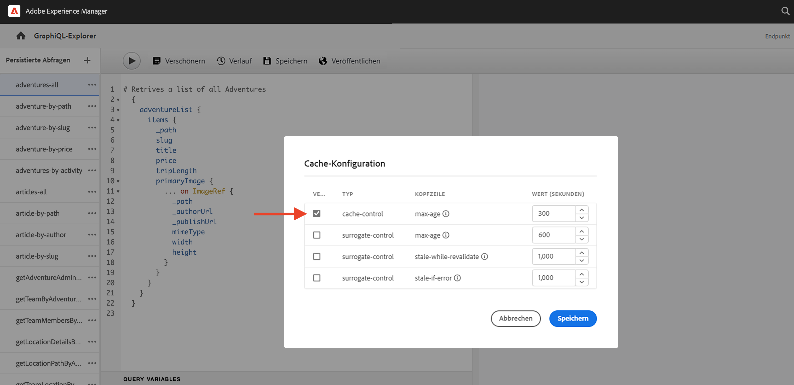

# Persistierte GraphQL-Abfragen

Persistierte Abfragen sind Abfragen, die auf dem Adobe Experience Manager-Server (AEM) gespeichert werden. Clients können eine HTTP-GET-Anfrage mit dem Abfragenamen senden, um sie auszuführen. Der Vorteil dieses Ansatzes ist die Cache-Fähigkeit. Während Client-seitige GraphQL-Abfragen auch über HTTP-POST-Anfragen ausgeführt werden können, die nicht zwischengespeichert werden können, können persistierte Abfragen über HTTP-Caches oder ein CDN zwischengespeichert werden, was die Leistung verbessert. Persistierte Abfragen ermöglichen es Ihnen, Ihre Anfragen zu vereinfachen und die Sicherheit zu verbessern, da Ihre Abfragen auf dem Server eingekapselt sind und die AEM-Administrierenden die volle Kontrolle über sie haben. Es ist **Best Practice und wird dringend empfohlen**, bei der Arbeit mit der AEM GraphQL-API persistierte Abfragen zu verwenden.

Im vorherigen Kapitel haben Sie einige erweiterte GraphQL-Abfragen durchsucht, um Daten für die WKND-App zu erfassen. In diesem Kapitel persistieren Sie die Abfragen in AEM und lernen, wie Sie die Cache-Steuerung für persistierte Abfragen verwenden.

## Voraussetzungen {#prerequisites}

Dieses Dokument ist Teil eines mehrteiligen Tutorials. Bitte vergewissern Sie sich, dass Sie das [vorige Kapitel](explore-graphql-api.md) abgeschlossen haben, bevor Sie mit diesem Kapitel fortfahren.

## Ziele {#objectives}

In diesem Kapitel erfahren Sie, wie Sie:

* GraphQL-Abfragen mit Parametern persistieren
* Cache-Steuerungsparameter mit persistierten Abfragen verwenden

## Konfigurationseinstellungen von _persistierten GraphQL-Abfragen_ überprüfen

Überprüfen wir, ob _persistierte GraphQL-Abfragen_ für das WKND Site-Projekt in Ihrer AEM-Instanz aktiviert sind.

1. Navigieren Sie zu **Tools** > **Allgemein** > **Konfigurations-Browser**.

1. Wählen Sie **WKND Shared** und dann **Eigenschaften** in der oberen Navigationsleiste aus, um die Konfigurationseigenschaften zu öffnen. Auf der Seite „Konfigurationseigenschaften“ sollte Folgendes angezeigt werden: Berechtigung für **persistierte GraphQL-Abfragen** ist aktiviert.

   

## Beibehalten von GraphQL-Abfragen mithilfe des integrierten GraphiQL Explorer-Tools

Behalten wir in diesem Abschnitt die GraphQL-Abfrage bei, die später in der Client-Anwendung zum Abrufen und Rendern der Daten des Adventure-Inhaltsfragments verwendet wird.

1. Geben Sie die folgende Abfrage in den GraphiQL-Explorer ein:

   ```graphql
   query getAdventureDetailsBySlug($slug: String!) {
   adventureList(filter: {slug: {_expressions: [{value: $slug}]}}) {
       items {
       _path
       title
       activity
       adventureType
       price
       tripLength
       groupSize
       difficulty
       primaryImage {
           ... on ImageRef {
           _path
           mimeType
           width
           height
           }
       }
       description {
           html
           json
       }
       itinerary {
           html
           json
       }
       location {
           _path
           name
           description {
           html
           json
           }
           contactInfo {
           phone
           email
           }
           locationImage {
           ... on ImageRef {
               _path
           }
           }
           weatherBySeason
           address {
           streetAddress
           city
           state
           zipCode
           country
           }
       }
       instructorTeam {
           _metadata {
           stringMetadata {
               name
               value
           }
           }
           teamFoundingDate
           description {
           json
           }
           teamMembers {
           fullName
           contactInfo {
               phone
               email
           }
           profilePicture {
               ... on ImageRef {
               _path
               }
           }
           instructorExperienceLevel
           skills
           biography {
               html
           }
           }
       }
       administrator {
           fullName
           contactInfo {
           phone
           email
           }
           biography {
           html
           }
       }
       }
       _references {
       ... on ImageRef {
           _path
           mimeType
       }
       ... on LocationModel {
           _path
           __typename
       }
       }
   }
   }
   ```

   Stellen Sie sicher, dass die Abfrage funktioniert, bevor Sie sie speichern.

1. Tippen Sie anschließend auf „Speichern unter“ und geben Sie `adventure-details-by-slug` als Abfragename ein.

   

## Ausführen einer persistierten Abfrage mit Variablen durch Codierung von Sonderzeichen

Im Folgenden wird erläutert, wie persistierte Abfragen mit Variablen von Client-seitigen Anwendungen ausgeführt werden, indem die Sonderzeichen codiert werden.

Um eine persistierte Abfrage auszuführen, sendet ein Client-Programm eine GET-Anfrage mit der folgenden Syntax:

```
GET <AEM_HOST>/graphql/execute.json/<Project-Config-Name>/<Persisted-Query-Name>
```

Um eine persistierte Abfrage _mit einer Variable_ auszuführen, ändert sich die obige Syntax in:

```
GET <AEM_HOST>/graphql/execute.json/<Project-Config-Name>/<Persisted-Query-Name>;variable1=value1;variable2=value2
```

Die Sonderzeichen wie Semikolons (;), Gleichheitszeichen (=), Schrägstriche (/) und Leerzeichen müssen so konvertiert werden, dass sie die entsprechende UTF-8-Codierung verwenden.

Durch Ausführen der Abfrage `getAllAdventureDetailsBySlug` im Befehlszeilenterminal können wir diese Konzepte in der Praxis überprüfen.

1. Öffnen Sie den GraphiQL Explorer, klicken Sie auf die **Auslassungspunkte** (...) neben der persistenten Abfrage `getAllAdventureDetailsBySlug` und dann auf **URL kopieren**. Fügen Sie die kopierte URL in eine Textverarbeitung ein. Sie sieht wie folgt aus:

   ```code
       http://<AEM_HOST>/graphql/execute.json/wknd-shared/getAllAdventureDetailsBySlug;slug=
   ```

1. Fügen Sie `yosemite-backpacking` als Variablenwert hinzu

   ```code
       http://<AEM_HOST>/graphql/execute.json/wknd-shared/getAllAdventureDetailsBySlug;slug=yosemite-backpacking
   ```

1. Codieren Sie die Sonderzeichen (;) und Gleichheitszeichen (=).

   ```code
       http://<AEM_HOST>/graphql/execute.json/wknd-shared/getAllAdventureDetailsBySlug%3Bslug%3Dyosemite-backpacking
   ```

1. Öffnen Sie ein Befehlszeilen-Terminal und verwenden Sie [cURL](https://curl.se/), um die Abfrage ausführen

   ```shell
   $ curl -X GET http://<AEM_HOST>/graphql/execute.json/wknd-shared/getAllAdventureDetailsBySlug%3Bslug%3Dyosemite-backpacking
   ```

>[!TIP]
>
>    Wenn Sie die oben genannte Abfrage für die AEM Author-Umgebung ausführen, müssen Sie die Anmeldeinformationen senden. Schauen Sie sich die Abschnitte [Lokales Entwicklungs-Zugriffstoken](https://experienceleague.adobe.com/docs/experience-manager-learn/getting-started-with-aem-headless/authentication/local-development-access-token.html?lang=de) zur Veranschaulichung und [Aufrufen der AEM-API](https://experienceleague.adobe.com/docs/experience-manager-cloud-service/content/implementing/developing/generating-access-tokens-for-server-side-apis.html?lang=de#calling-the-aem-api) für Dokumentationsdetails an.

Lesen Sie auch [Ausführen einer persistierten Abfrage](https://experienceleague.adobe.com/docs/experience-manager-cloud-service/content/headless/graphql-api/persisted-queries.html?lang=de#execute-persisted-query), [Verwenden von Abfragevariablen](https://experienceleague.adobe.com/docs/experience-manager-cloud-service/content/headless/graphql-api/persisted-queries.html?lang=de#query-variables) und [Codierung der Abfrage-URL zur Verwendung durch eine App](https://experienceleague.adobe.com/docs/experience-manager-cloud-service/content/headless/graphql-api/persisted-queries.html?lang=de#encoding-query-url), um die Ausführung persistierter Abfragen durch Client-Anwendungen zu lernen.

## Aktualisieren von Cache-Steuerungsparametern in persistierten Abfragen {#cache-control-all-adventures}

Mit der AEM GraphQL-API können Sie die standardmäßigen Cache-Steuerungsparameter in Ihren Abfragen aktualisieren, um die Leistung zu verbessern. Die Standardwerte für die Cache-Steuerung sind:

* 60 Sekunden ist die Standard-TTL (maxage=60) für den Client (z. B. einen Browser)

* 7200 Sekunden ist die Standard-TTL (s-maxage=7200) für den Dispatcher und das CDN, auch bekannt als freigegebene Caches

Verwenden Sie die `adventures-all`-Abfrage zum Aktualisieren der Cache-Steuerungsparameter. Die Abfrageantwort ist groß und es ist nützlich, ihren `age` im Cache zu steuern. Diese persistierte Abfrage wird später verwendet, um die [Clientanwendung](/help/headless-tutorial/graphql/advanced-graphql/client-application-integration.md) zu aktualisieren.

1. Öffnen Sie den GraphiQL Explorer und klicken Sie auf die **Auslassungspunkte** (...) neben der persistenten Abfrage, danach klicken Sie auf **Headers** zum Öffnen des **Cache-Konfiguration**-Modals.

   


1. Aktualisieren Sie im **Cache-Konfigurations**-Modal den Wert des `max-age`-Headers auf `600 ` Sekunden (10 Minuten) und klicken Sie auf **Speichern**

   


Lesen Sie [Caching Ihrer persistierten Abfragen](https://experienceleague.adobe.com/docs/experience-manager-cloud-service/content/headless/graphql-api/persisted-queries.html?lang=de#caching-persisted-queries) für weitere Informationen zu den standardmäßigen Cache-Steuerungsparametern.


## Herzlichen Glückwunsch!

Herzlichen Glückwunsch! Sie haben jetzt gelernt, wie man GraphQL-Abfragen mit Parametern persistiert, persistierte Abfragen aktualisiert und Cache-Steuerungsparameter mit persistierten Abfragen verwendet.

## Nächste Schritte

Im [nächsten Kapitel](/help/headless-tutorial/graphql/advanced-graphql/client-application-integration.md) werden Sie die Anfragen für persistierte Abfragen in der WKND-App implementieren.
