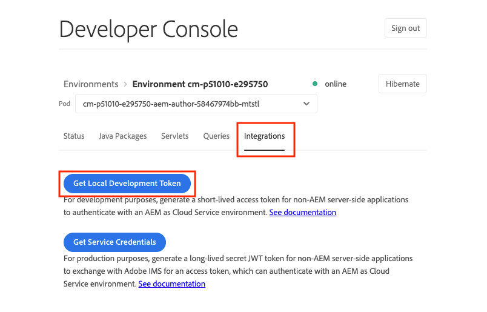
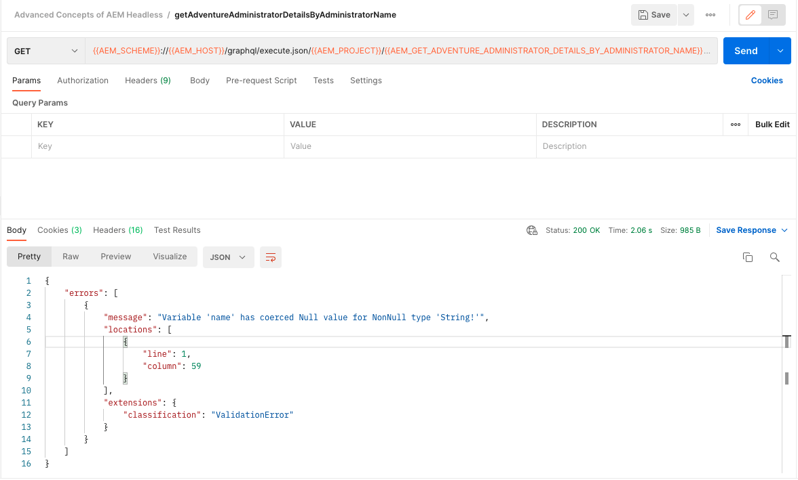

# Beständige GraphQL-Abfragen

Beständige Abfragen sind Abfragen, die auf dem Adobe Experience Manager-Server (AEM) gespeichert werden. Clients können eine HTTP-GET-Anfrage mit dem Abfragenamen senden, um sie auszuführen. Der Vorteil dieses Ansatzes ist die Cache-Fähigkeit. Während clientseitige GraphQL-Abfragen auch über HTTP-POST-Anfragen ausgeführt werden können, die nicht zwischengespeichert werden können, können persistente Abfragen über HTTP-Caches oder ein CDN zwischengespeichert werden, was die Leistung verbessert. Beständige Abfragen ermöglichen es Ihnen, Ihre Anforderungen zu vereinfachen und die Sicherheit zu verbessern, da Ihre Abfragen auf dem Server eingekapselt sind und der AEM Administrator die volle Kontrolle über sie hat. Es empfiehlt sich, bei der Arbeit mit der AEM GraphQL-API persistente Abfragen zu verwenden.

Im vorherigen Kapitel haben Sie einige erweiterte GraphQL-Abfragen durchsucht, um Daten für die WKND-App zu erfassen. In diesem Kapitel speichern Sie diese Abfragen, um sie zu AEM, zu aktualisieren und zu erfahren, wie Sie die Cache-Steuerung für persistente Abfragen verwenden.

## Voraussetzungen {#prerequisites}

Dieses Dokument ist Teil eines mehrteiligen Tutorials. Bevor Sie mit diesem Kapitel fortfahren, vergewissern Sie sich bitte, dass die vorherigen Kapitel abgeschlossen sind.

Dieses Tutorial verwendet [Postman](https://www.postman.com/) um HTTP-Anfragen auszuführen. Stellen Sie sicher, dass Sie mit dem Dienst angemeldet sind, bevor Sie dieses Kapitel starten. Für dieses Tutorial sind auch Kenntnisse über die Postman-App erforderlich, z. B. das Einrichten einer Sammlung, das Erstellen von Variablen und das Erstellen von Anforderungen. Siehe Postman-Dokumentation unter [Erstellen von Anforderungen](https://learning.postman.com/docs/sending-requests/requests/) und [Senden Ihrer ersten Anfrage](https://learning.postman.com/docs/getting-started/sending-the-first-request/) Weitere Informationen zum Erstellen von API-Anfragen in der App.

In diesem Kapitel werden Abfragen, die im vorherigen Kapitel untersucht wurden, AEM beibehalten. Sie können eine Textdatei mit diesen standardmäßigen GraphQL-Abfragen herunterladen [here](assets/graphql-persisted-queries/advanced-concepts-aem-headless-graphql-queries.txt) zur einfachen Referenz.

## Ziele {#objectives}

In diesem Kapitel erfahren Sie, wie Sie:

* Beibehalten von GraphQL-Abfragen mit Parametern
* Persistente Abfragen aktualisieren
* Verwenden von Cache-Steuerungsparametern mit persistenten Abfragen

## Übersicht über beständige Abfragen

In diesem Video erhalten Sie einen Überblick darüber, wie GraphQL-Abfragen beibehalten, aktualisiert und die Cache-Steuerung verwendet werden.

>[!VIDEO](https://video.tv.adobe.com/v/340036/?quality=12&learn=on)

## Persistente Abfragen aktivieren

Stellen Sie zunächst sicher, dass persistente Abfragen für das WKND Site-Projekt in Ihrer AEM-Instanz aktiviert sind.

1. Navigieren Sie zu **Instrumente** > **Allgemein** > **Konfigurationsbrowser**.

1. Auswählen **WKND-Site**, wählen Sie **Eigenschaften** in der oberen Navigationsleiste, um die Konfigurationseigenschaften zu öffnen.

   

   Auf der Seite &quot;Konfigurationseigenschaften&quot;sollte Folgendes angezeigt werden: **GraphQL - Persistente Abfragen** -Berechtigung aktiviert ist.

   

## Postman-Sammlung importieren

Um das Befolgen des Tutorials zu vereinfachen, wird eine Postman-Sammlung bereitgestellt. Alternativ dazu können Befehlszeilenwerkzeuge wie `curl` verwendet werden.

1. Herunterladen und installieren [Postman](https://www.postman.com/)
1. Laden Sie die [AdvancedConceptsOfAEMHeadless.postman_collection.json](/help/headless-tutorial/graphql/advanced-graphql/assets/tutorial-files/AdvancedConceptsofAEMHeadless.postman_collection.json)
1. Postman-App öffnen
1. Auswählen **Datei** > **Import** > **Datei hochladen** und wählen Sie `AdvancedConceptsofAEMHeadless.postman_collection.json` um die Sammlung zu importieren.

   

### Authentifizierung

Authentifizierung ist erforderlich, um Abfragen für eine AEM Autoreninstanz zu senden. Dieses Tutorial basiert auf der AEM as a Cloud Service Umgebung und verwendet die Trägerauthentifizierung mit einem Entwicklungstoken. Gehen Sie wie folgt vor, um die Authentifizierung für Ihre Postman-Sammlung zu konfigurieren:

1. Um ein Entwicklungstoken zu erhalten, navigieren Sie zu Ihrer Cloud Developer Console und öffnen Sie die **Integrationen** und wählen Sie **Abrufen des lokalen Entwicklungstokens**.

   

1. Navigieren Sie in Ihrer Postman-Sammlung zum **Authentifizierung** Registerkarte und wählen Sie **Trägertoken** im **Typ** Dropdown-Menü.

   

1. Geben Sie das Entwicklungstoken in das **Token** -Feld. Sie können das Token über eine Variable übergeben, wie im nächsten Abschnitt beschrieben.

   

### Variablen {#variables}

Sie können Werte wie Authentifizierungstoken und URI-Komponenten über Variablen in Ihrer Postman-Sammlung übergeben, um den Prozess zu vereinfachen. Verwenden Sie für dieses Tutorial die folgenden Schritte, um Variablen zu erstellen:

1. Navigieren Sie zum **Variablen** in Ihrer Postman-Sammlung und erstellen Sie die folgenden Variablen:

   | Variable | Wert |
   | --- | --- |
   | `AEM_SCHEME` | `https` |
   | `AEM_AUTH_TOKEN` | (Ihr Entwicklungstoken) |
   | `AEM_HOST` | (Der Hostname Ihrer AEM-Instanz) |
   | `AEM_PROJECT` | `wknd` |

1. Sie können auch Variablen für jede persistente Abfrage hinzufügen, die Sie erstellen möchten. Behalten Sie für dieses Tutorial die folgenden Abfragen bei: `getAdventureAdministratorDetailsByAdministratorName`, `getTeamByAdventurePath`, `getLocationDetailsByLocationPath`, `getTeamMembersByAdventurePath`, `getLocationPathByAdventurePath`und `getTeamLocationByLocationPath`.

   Erstellen Sie die folgenden Variablen:

   * `AEM_GET_ADVENTURE_ADMINISTRATOR_DETAILS_BY_ADMINISTRATOR_NAME`: `adventure-administrator-details-by-administrator-name`
   * `AEM_GET_ADVENTURE_ADMINISTRATOR_DETAILS_BY_ADMINISTRATOR_NAME`: `adventure-administrator-details-by-administrator-name`
   * `AEM_GET_TEAM_LOCATION_BY_LOCATION_PATH`: `team-location-by-location-path`
   * `AEM_GET_TEAM_MEMBERS_BY_ADVENTURE_PATH`: `team-members-by-adventure-path`
   * `AEM_GET_LOCATION_DETAILS_BY_LOCATION_PATH`: `location-details-by-location-path`
   * `AEM_GET_LOCATION_PATH_BY_ADVENTURE_PATH`: `location-path-by-adventure-path`
   * `AEM_GET_TEAM_BY_ADVENTURE_PATH`: `team-by-adventure-path`

   Nach Abschluss der **Variablen** -Registerkarte in Ihrer Postman-Sammlung sollte in etwa wie folgt aussehen:

   

## Beibehalten von GraphQL-Abfragen mit Parametern

Im [AEM Headless- und GraphQL-Videoreihen](../video-series/graphql-persisted-queries.md), haben Sie gelernt, wie Sie persistente GraphQL-Abfragen erstellen. In diesem Abschnitt werden wir eine GraphQL-Abfrage mit einem Parameter beibehalten und ausführen.

### Erstellen einer gespeicherten Abfrage {#create-persisted-query}

In diesem Beispiel soll der `getAdventureAdministratorDetailsByAdministratorName` Abfrage, die Sie im vorherigen Kapitel erstellt haben.

>[!NOTE]
>
>Die HTTP-PUT-Methode wird verwendet, um eine persistente Abfrage zu erstellen, und die HTTP-POST-Methode wird verwendet, um sie zu aktualisieren.

1. Fügen Sie zunächst eine neue Anforderung in Ihrer Postman-Sammlung hinzu. Wählen Sie die HTTP-PUT-Methode aus, um eine persistente Abfrage zu erstellen, und verwenden Sie den folgenden Anfrage-URI:

   ```plaintext
   {{AEM_SCHEME}}://{{AEM_HOST}}/graphql/persist.json/{{AEM_PROJECT}}/{{AEM_GET_ADVENTURE_ADMINISTRATOR_DETAILS_BY_ADMINISTRATOR_NAME}}
   ```

   Beachten Sie, dass der URI die `/graphql/persist.json` Aktion.

1. Fügen Sie die `getAdventureAdministratorDetailsByAdministratorName` GraphQL-Abfrage in den Anfragetext. Beachten Sie, dass es sich um die standardmäßige GraphQL-Abfrage mit einer Variablen handelt. `name` erfordert `String`.

   

1. Führen Sie die Anfrage aus. Sie sollten die folgende Antwort erhalten:

   

   Sie haben erfolgreich eine persistente Abfrage mit dem Namen `adventure-administrator-details-by-administrator-name`.

### Persistente Abfrage ausführen

Führen wir die von Ihnen erstellte persistente Abfrage aus.

1. Erstellen Sie mit dem folgenden Anfrage-URI eine neue GET-Anfrage in Ihrer Postman-Sammlung:

   ```plaintext
   {{AEM_SCHEME}}://{{AEM_HOST}}/graphql/execute.json/{{AEM_PROJECT}}/{{AEM_GET_ADVENTURE_ADMINISTRATOR_DETAILS_BY_ADMINISTRATOR_NAME}}
   ```

   Beachten Sie, dass der Anfrage-URI jetzt die `execute.json` Aktion.

   Wenn Sie diese Anfrage wie besehen ausführen, wird ein Fehler ausgegeben, da für die Abfrage eine Variable erforderlich ist `name`. Sie müssen diese Variable als Parameter in den Anfrage-URI übergeben.

   

1. Rufen Sie als Nächstes einen Administrator mit dem Namen Jacob Wester ab. Parameter für die beibehaltenen GraphQL-Abfragen müssen von den vorherigen URI-Komponenten durch `;` und kodiert wurden, bevor sie an den Anfrage-URI übergeben werden. Führen Sie in der Browser-Konsole den folgenden Befehl aus:

   ```js
   encodeURIComponent(";name=Jacob Wester")
   ```

   

1. Kopieren Sie das Ergebnis aus der Konsole und fügen Sie es am Ende des Anfrage-URI in Postman ein. Sie sollten über den folgenden Anfrage-URI verfügen:

   ```plaintext
   {{AEM_SCHEME}}://{{AEM_HOST}}/graphql/execute.json/{{AEM_PROJECT}}/{{AEM_GET_ADVENTURE_ADMINISTRATOR_DETAILS_BY_ADMINISTRATOR_NAME}}%3Bname%3DJacob%20Wester
   ```

1. Führen Sie die GET-Anfrage aus. Sie sollten die folgende Antwort erhalten:

   

Sie haben jetzt eine beibehaltene GraphQL-Abfrage mit einem Parameter erstellt und ausgeführt.

Sie können die oben beschriebenen Schritte ausführen, um den Rest der GraphQL-Abfragen aus dem [Textdatei](assets/graphql-persisted-queries/advanced-concepts-aem-headless-graphql-queries.txt) mithilfe der Variablen, die Sie im [Beginn dieses Kapitels](#variables).

Die vollständige [Postman-Sammlung](/help/headless-tutorial/graphql/advanced-graphql/assets/tutorial-files/AdvancedConceptsofAEMHeadless.postman_collection.json) ist auch zum Herunterladen und Importieren verfügbar.

## Persistente Abfragen aktualisieren

Während persistente Abfragen mithilfe einer PUT-Anfrage erstellt werden, müssen Sie eine POST-Anfrage verwenden, um eine vorhandene persistente Abfrage zu aktualisieren. Aktualisieren wir für dieses Tutorial die beibehaltene Abfrage namens `adventure-administrator-details-by-administrator-name` , die Sie in der [vorheriger Abschnitt](#create-persisted-query).

1. Duplizieren Sie die Registerkarte, die Sie im vorherigen Abschnitt für die PUT-Anfrage verwendet haben. Ändern Sie in der Kopie die HTTP-Methode in POST.

1. Entfernen wir in der GraphQL-Abfrage die `plaintext` Format aus `administratorDetails` -Feld.

   

1. Führen Sie die Anfrage aus. Sie sollten die folgende Antwort erhalten:

   

Sie haben jetzt die `adventure-administrator-details-by-administrator-name` persistente Abfrage. Es ist wichtig, Ihre GraphQL-Abfragen immer in AEM zu aktualisieren, wenn Änderungen vorgenommen werden.

## Übergeben von Cache-Control-Parametern in persistenten Abfragen {#cache-control-all-adventures}

Mit der AEM GraphQL-API können Sie Ihren Abfragen Cache-Steuerungsparameter hinzufügen, um die Leistung zu verbessern.

Verwenden Sie die `getAllAdventureDetails` Abfrage, die im vorherigen Kapitel erstellt wurde. Die Abfrageantwort ist groß und es ist nützlich, die `age` im Cache.

Diese beibehaltene Abfrage wird später verwendet, um die [Clientanwendung](/help/headless-tutorial/graphql/advanced-graphql/client-application-integration.md).

1. Erstellen Sie in Ihrer Postman-Sammlung eine neue Variable:

   ```plaintext
   AEM_GET_ALL_AT_ONCE: all-adventure-details
   ```

1. Erstellen Sie eine neue PUT-Anfrage, um diese Abfrage beizubehalten.

1. Im **body** auf der Registerkarte Ihrer Anforderung die **raw** Datentyp.

   

1. Um die Cache-Steuerung in einer Abfrage zu verwenden, müssen Sie die Abfrage in eine JSON-Struktur einschließen und am Ende Parameter für die Cache-Steuerung hinzufügen. Kopieren Sie die folgende Abfrage und fügen Sie sie in den Hauptteil Ihrer Anfrage ein:

   ```json
   {
   "query": " query getAllAdventureDetails($fragmentPath: String!) { adventureByPath(_path: $fragmentPath){ item { _path adventureTitle adventureActivity adventureType adventurePrice adventureTripLength adventureGroupSize adventureDifficulty adventurePrice adventurePrimaryImage{ ...on ImageRef{ _path mimeType width height } } adventureDescription { html json } adventureItinerary { html json } location { _path name description { html json } contactInfo{ phone email } locationImage{ ...on ImageRef{ _path } } weatherBySeason address{ streetAddress city state zipCode country } } instructorTeam { _metadata{ stringMetadata{ name value } } teamFoundingDate description { json } teamMembers { fullName contactInfo { phone email } profilePicture{ ...on ImageRef { _path } } instructorExperienceLevel skills biography { html } } } administrator { fullName contactInfo { phone email } biography { html } } } _references { ...on ImageRef { _path mimeType } ...on LocationModel { _path __typename } } } }", 
   "cache-control": { "max-age": 300 }
   }
   ```

   >[!CAUTION]
   >
   >Die umschlossene Abfrage darf keine Zeilenumbrüche enthalten.

   Ihre Anfrage sollte jetzt wie folgt aussehen:

   

1. Führen Sie die Anfrage aus. Sie sollten die Antwort erhalten, die angibt, dass die `all-adventure-details` persistente Abfrage erfolgreich erstellt wurde.

   

## Herzlichen Glückwunsch!

Herzlichen Glückwunsch! Sie haben jetzt gelernt, wie GraphQL-Abfragen mit Parametern persistiert, persistente Abfragen aktualisiert und Cache-Steuerungsparameter mit persistenten Abfragen verwendet werden.

## Nächste Schritte

Im [Nächstes Kapitel](/help/headless-tutorial/graphql/advanced-graphql/client-application-integration.md), implementieren Sie die Anforderungen für persistente Abfragen in der WKND-App.

Obwohl dies für dieses Tutorial optional ist, stellen Sie sicher, dass Sie alle Inhalte in realen Produktionssituationen veröffentlichen. Eine Übersicht der Autoren- und Veröffentlichungsumgebungen in AEM finden Sie im Abschnitt [AEM Headless- und GraphQL-Videoreihen](../video-series/author-publish-architecture.md).