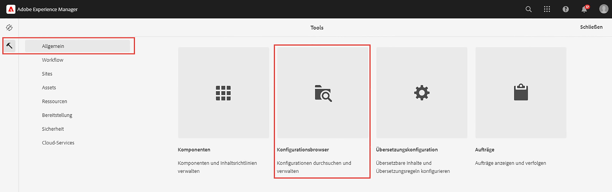
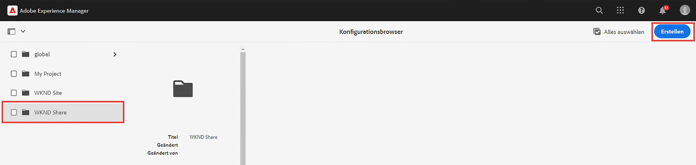
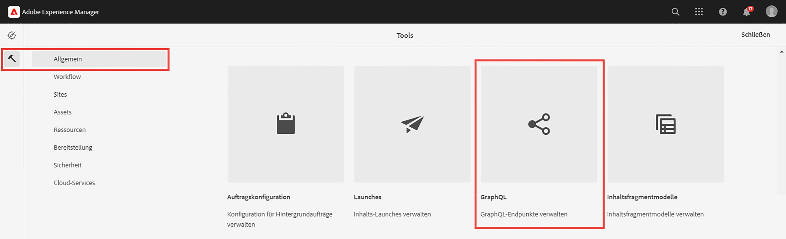
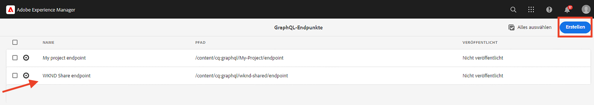
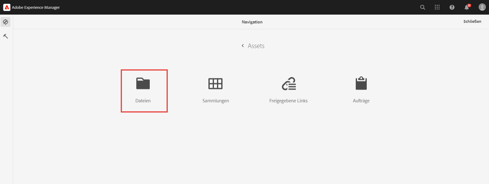
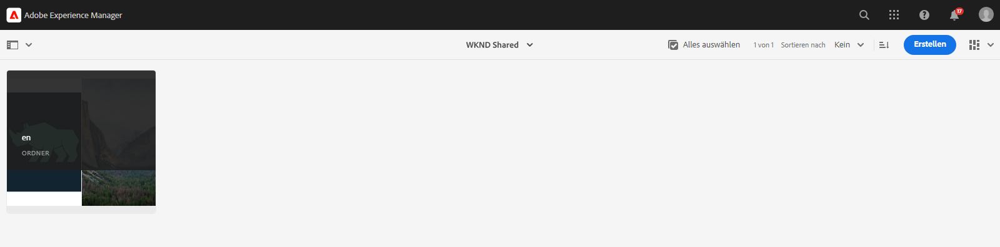
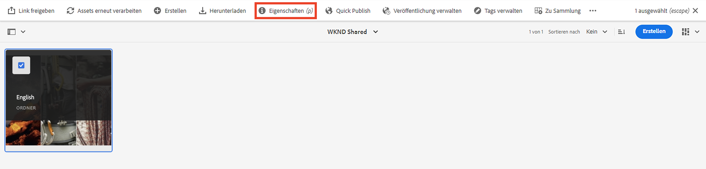
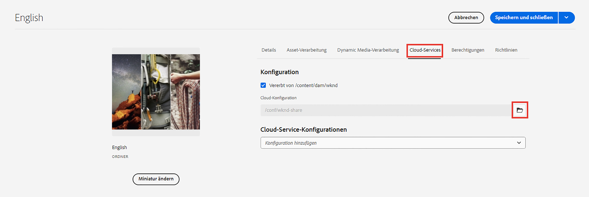

# Erweiterte Konzepte von AEM Headless

{{aem-headless-trials-promo}}

Dieses End-to-End-Tutorial setzt das [Grundlagentutorial](../multi-step/overview.md) fort, in dem die Grundlagen von Adobe Experience Manager (AEM) Headless und GraphQL behandelt wurden. Das erweiterte Tutorial veranschaulicht die tief greifenden Aspekte der Arbeit mit Inhaltsfragmentmodellen, Inhaltsfragmenten und den von AEM GraphQL persistierten Abfragen, einschließlich der Verwendung der von GraphQL persistierten Abfragen in einer Client-Anwendung.

## Voraussetzungen

Schließen Sie die [Schnelleinrichtung für AEM as a Cloud Service](../quick-setup/cloud-service.md) ab, um Ihre AEM as a Cloud Service-Umgebung zu konfigurieren.

Es wird dringend empfohlen, dass Sie das vorherige [Grundlagentutorial](../multi-step/overview.md) und die [Videoserie](../video-series/modeling-basics.md) abschließen, bevor Sie mit diesem fortgeschrittenen Tutorial fortfahren. Obwohl Sie das Tutorial mit einer lokalen AEM-Umgebung abschließen können, behandelt dieses Tutorial nur den Workflow für AEM as a Cloud Service.

>[!CAUTION]
>
>Wenn Sie keinen Zugriff auf die AEM as a Cloud Service-Umgebung haben, können Sie die [AEM Headless-Schnelleinrichtung mit dem lokalen SDK](https://experienceleague.adobe.com/docs/experience-manager-learn/getting-started-with-aem-headless/graphql/quick-setup/local-sdk.html?lang=de) durchführen. Beachten Sie jedoch, dass einige Seiten der Produktoberfläche, wie z. B. die Navigation zu Inhaltsfragmenten, unterschiedlich sind.

## Ziele

Dieses Tutorial behandelt folgende Themen:

* Erstellen Sie Inhaltsfragmentmodelle mithilfe von Validierungsregeln und erweiterten Datentypen wie Registerkartenplatzhalter, verschachtelte Fragmentverweise, JSON-Objekte und Datums- und Uhrzeitdatentypen.
* Erstellen Sie Inhaltsfragmente beim Arbeiten mit verschachtelten Inhalten und Fragmentverweisen und konfigurieren Sie Ordnerrichtlinien für die Verwaltung von Inhaltsfragmenten und deren Bearbeitung.
* Erfahren Sie mehr über AEM GraphQL API-Funktionen mithilfe von GraphQL-Abfragen mit Variablen und Direktiven.
* Persistieren Sie GraphQL-Abfragen mit Parametern in AEM und erfahren Sie, wie Sie Cache-Steuerungsparameter mit persistierten Abfragen verwenden.
* Integrieren von Anforderungen für persistierte Abfragen in die WKND GraphQL React-Beispielanwendung mit dem AEM Headless JavaScript-SDK.

## Erweiterte Konzepte AEM Headless – Übersicht

Das folgende Video bietet einen allgemeinen Überblick über die Konzepte, die in diesem Tutorial behandelt werden. Das Tutorial umfasst das Definieren von Inhaltsfragmentmodellen mit erweiterten Datentypen, das Verschachteln von Inhaltsfragmenten und das Beibehalten von GraphQL-Abfragen in AEM.

>[!VIDEO](https://video.tv.adobe.com/v/340035?quality=12&learn=on)

>[!CAUTION]
>
>In diesem Video (bei 2:25) wird die Installation des GraphiQL-Abfrageeditors über den Package Manager beschrieben, um GraphQL-Abfragen zu untersuchen. In neueren Versionen von AEM as a Cloud Service ist jedoch ein integrierter **GraphiQL-Explorer** bereitgestellt, sodass keine Paketinstallation erforderlich ist. Siehe [Verwenden der GraphiQL-IDE](https://experienceleague.adobe.com/docs/experience-manager-cloud-service/content/headless/graphql-api/graphiql-ide.html?lang=de) für weitere Informationen.

## Projekt-Setup

Das WKND Site-Projekt verfügt über alle erforderlichen Konfigurationen, sodass Sie das Tutorial direkt nach Abschluss der [Schnelleinstellungen](../quick-setup/cloud-service.md) starten können. In diesem Abschnitt werden nur einige wichtige Schritte beschrieben, die Sie beim Erstellen Ihres eigenen AEM Headless-Projekts durchführen können.

### Überprüfen vorhandener Konfigurationen

Der erste Schritt zum Starten eines neuen Projekts in AEM ist die Erstellung seiner Konfiguration als Arbeitsbereich und die Erstellung von GraphQL-API-Endpunkten. Um eine Konfiguration zu überprüfen oder zu erstellen, navigieren Sie zu **Tools** > **Allgemein** > **Konfigurationsbrowser**.

Beachten Sie, dass die `WKND Shared`-Site-Konfiguration für das Tutorial bereits erstellt wurde. Um eine Konfiguration für Ihr eigenes Projekt zu erstellen, wählen Sie **Erstellen** in der oberen rechten Ecke und füllen Sie das Formular „modale Konfiguration erstellen“ aus, das angezeigt wird.

### Überprüfen der GraphQL API-Endpunkte

Als Nächstes müssen Sie API-Endpunkte konfigurieren, an die GraphQL-Abfragen gesendet werden sollen. Um vorhandene Endpunkte zu überprüfen oder zu erstellen, navigieren Sie zu **Tools** > **Allgemein** > **GraphQL**.

Beachten Sie, dass `WKND Shared Endpoint` bereits erstellt wurde. Um einen Endpunkt für Ihr Projekt zu erstellen, wählen Sie **Erstellen** in der oberen rechten Ecke und folgen Sie dem Workflow.

>[!NOTE]
>
> Nach dem Speichern des Endpunkts wird ein Modal zum Besuch der Sicherheitskonsole angezeigt, mit dem Sie die Sicherheitseinstellungen anpassen können, wenn Sie den Zugriff auf den Endpunkt konfigurieren möchten. Sicherheitsberechtigungen selbst fallen jedoch nicht in den Rahmen dieses Tutorials. Weitere Informationen finden Sie in der [AEM-Dokumentation](https://experienceleague.adobe.com/docs/experience-manager-65/administering/security/security.html?lang=de).

### Überprüfen der WKND-Inhaltsstruktur und des Sprachstamms

Eine klar definierte Inhaltsstruktur ist der Schlüssel zum Erfolg der AEM Headless-Implementierung. Dies ist hilfreich für die Skalierbarkeit, Benutzerfreundlichkeit und Berechtigungsverwaltung Ihrer Inhalte.

Ein Sprachstamm-Ordner ist ein Ordner mit einem ISO-Sprachcode als Namen wie „EN“ oder „FR“. Das AEM Übersetzungsmanagement-System verwendet diese Ordner, um die primäre Sprache Ihrer Inhalte und Sprachen für die Übersetzung von Inhalten zu definieren.

Gehen Sie zu **Navigation** > **Assets** > **Dateien**.

Navigieren Sie zum Ordner **WKND Shared**. Betrachten Sie den Ordner mit dem Titel „English“ und dem Namen „EN“. Dieser Ordner ist der Sprach-Stammordner für das WKND Site-Projekt.

Erstellen Sie für Ihr eigenes Projekt einen Sprachstamm-Ordner in Ihrer Konfiguration. Siehe Abschnitt [Erstellen von Ordnern](/help/headless-tutorial/graphql/advanced-graphql/author-content-fragments.md#create-folders) für weitere Details.

### Zuweisen einer Konfiguration zum verschachtelten Ordner

Schließlich müssen Sie die Konfiguration Ihres Projekts dem Sprachstamm-Ordner zuweisen. Diese Zuweisung ermöglicht die Erstellung von Inhaltsfragmenten basierend auf Inhaltsfragmentmodellen, die in der Konfiguration Ihres Projekts definiert sind.

Um der Konfiguration den Sprachstamm-Ordner zuzuweisen, wählen Sie den Ordner aus und wählen Sie dann **Eigenschaften** in der oberen Navigationsleiste.

 aus

Navigieren Sie dann zur Registerkarte **Cloud Services** und wählen Sie das Ordnersymbol im **Cloud-Konfigurations**-Feld.

Wählen Sie im angezeigten Modal Ihre zuvor erstellte Konfiguration aus, um ihr den Sprachstamm-Ordner zuzuweisen.

### Best Practices

Im Folgenden finden Sie Best Practices für die Erstellung eines eigenen Projekts in AEM:

* Die Ordnerhierarchie sollte mit Blick auf Lokalisierung und Übersetzung modelliert werden. Mit anderen Worten: Sprachordner sollten in Konfigurationsordnern verschachtelt sein, was eine einfache Übersetzung von Inhalten in diesen Konfigurationsordnern ermöglicht.
* Die Ordnerhierarchie sollte einfach und unkompliziert gehalten werden. Vermeiden Sie das Verschieben oder Umbenennen von Ordnern und Fragmenten zu einem späteren Zeitpunkt, insbesondere nach der Veröffentlichung zur Live-Nutzung, da dadurch Pfade geändert werden, die sich auf Fragmentverweise und GraphQL-Abfragen auswirken können.

## Starter- und Lösungspakete

Zwei AEM **Pakete** sind verfügbar und können über den [Package Manager](/help/headless-tutorial/graphql/advanced-graphql/author-content-fragments.md#sample-content) installiert werden

* [Advanced-GraphQL-tutorial-Starter-package-1.1.zip](/help/headless-tutorial/graphql/advanced-graphql/assets/tutorial-files/Advanced-GraphQL-Tutorial-Starter-Package-1.1.zip) wird später im Tutorial verwendet und enthält Beispielbilder und Ordner.
* [Advanced-GraphQL-Tutorial-Solution-package-1.2.zip](/help/headless-tutorial/graphql/advanced-graphql/assets/tutorial-files/Advanced-GraphQL-Tutorial-Solution-Package-1.2.zip) enthält die fertige Lösung für Kapitel 1 bis 4, einschließlich neuer Inhaltsfragmentmodelle, Inhaltsfragmente und persistierter GraphQL-Abfragen. Nützlich für diejenigen, die direkt zum Kapitel [Integration von Client-Anwendungen](/help/headless-tutorial/graphql/advanced-graphql/client-application-integration.md) übergehen wollen.

Das Projekt [React-App – Erweitertes Tutorial – WKND-Adventures](https://github.com/adobe/aem-guides-wknd-graphql/blob/main/advanced-tutorial/README.md) steht zur Überprüfung und Untersuchung der Beispielanwendung zur Verfügung. Diese Beispielanwendung ruft den Inhalt von AEM ab, indem die persistierten GraphQL-Abfragen aufgerufen und in ein interaktives Erlebnis gerendert werden.

## Erste Schritte

Erste Schritte, um mit diesem erweiterten Tutorial zu beginnen:

1. Einrichten einer Entwicklungsumgebung mit [AEM as a Cloud Service](../quick-setup/cloud-service.md).
1. Beginnen Sie das Tutorial-Kapitel [Erstellen von Inhaltsfragmentmodellen](/help/headless-tutorial/graphql/advanced-graphql/create-content-fragment-models.md).
