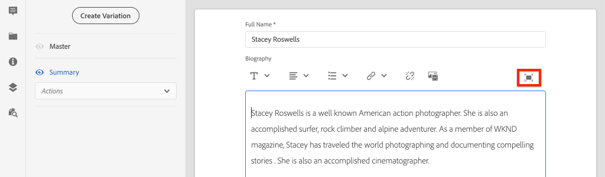

# Authoring-Inhaltsfragment {#authoring-content-fragments}

In diesem Kapitel erstellen und bearbeiten Sie ein neues Inhaltsfragment, das auf dem [neu definierten Inhaltsfragmentmodell des Beitragenden](./content-fragment-models.md) basiert. Außerdem erfahren Sie, wie Sie Varianten von Inhaltsfragmenten erstellen.

## Voraussetzungen {#prerequisites}

Dies ist ein mehrteiliges Lernprogramm und es wird davon ausgegangen, dass die unter [Definieren von Inhaltsfragmentmodellen](./content-fragment-models.md) beschriebenen Schritte abgeschlossen wurden.

## Ziele {#objectives}

* Erstellen eines Inhaltsfragments basierend auf einem Inhaltsfragmentmodell
* Eine Inhaltsfragmentvariation erstellen

## Inhaltsfragment-Authoring-Übersicht {#overview}

>[!VIDEO](https://video.tv.adobe.com/v/22451/?quality=12&learn=on)

Das obige Video bietet einen Überblick über das Authoring von Inhaltsfragmenten auf hoher Ebene.

## Inhaltsfragment {#create-content-fragment} erstellen

Im vorherigen Kapitel [Definieren von Inhaltsfragmentmodellen](./content-fragment-models.md) wurde ein **Mitarbeiter**-Modell erstellt. Erstellen Sie ein neues Inhaltsfragment mit diesem Modell.

1. Navigieren Sie im Menü **AEM Beginn** zu **Assets** > **Dateien**.
1. Klicken Sie durch die Ordner, um zu **WKND-Site** > **Englisch** > **Mitarbeiter** zu navigieren. Dieser Ordner enthält eine Liste von Kopfaufnahmen für Mitarbeiter der Marke WKND.

1. Klicken Sie oben rechts auf **Erstellen** und wählen Sie **Inhaltsfragment**:

   

1. Wählen Sie das Modell **Mitarbeiter** und klicken Sie auf **Weiter**.

   

   Dies ist dasselbe **Mitarbeiter**-Modell, das im vorherigen Kapitel erstellt wurde.

1. Geben Sie für den Titel **Stacey Roswells** ein und klicken Sie auf **Erstellen**.
1. Klicken Sie auf **Öffnen** im Dialogfeld **Erfolg**, um das neu erstellte Fragment zu öffnen.

   

   Beachten Sie, dass die vom Modell definierten Felder jetzt verfügbar sind, um diese Instanz des Inhaltsfragments zu erstellen.

1. Geben Sie für **Vollständiger Name** Folgendes ein: **Stacey Roswells**.
1. Geben Sie für **Biografie** eine kurze Biografie ein. Benötigen Sie Anregungen? Sie können diese [Textdatei](assets/author-content-fragments/stacey-roswells-bio.txt) erneut verwenden.
1. Klicken Sie für **Picture Reference** auf das Symbol **folder** und navigieren Sie zu **WKND-Site** > **English** > **Mitarbeiter** > **stacey-roswells.jpg**. Dies wird anhand des Pfads ausgewertet: `/content/dam/wknd/en/contributors/stacey-roswells.jpg`.
1. Wählen Sie für **Beruf** **Fotograf**.

   

1. Klicken Sie auf **Speichern**, um die Änderungen zu speichern.

## Erstellen einer Inhaltsfragmentvariante

Alle Inhaltsfragmente Beginn mit einer Variation von **Übergeordnet**. Die Variation **Übergeordnet** kann als Standardinhalt *des Fragments betrachtet werden und wird automatisch verwendet, wenn der Inhalt über die GraphQL-APIs verfügbar gemacht wird.* Es ist auch möglich, Varianten eines Inhaltsfragments zu erstellen. Diese Funktion Angebot zusätzliche Flexibilität beim Entwerfen einer Implementierung.

Varianten können zur Zielgruppe bestimmter Kanal verwendet werden. Beispielsweise könnte eine Variation **mobile** erstellt werden, die eine kleinere Textmenge enthält oder auf ein Kanal-spezifisches Bild verweist. Wie Varianten verwendet werden, hängt wirklich von der Implementierung ab. Wie bei allen Funktionen sollte vor der Verwendung eine sorgfältige Planung durchgeführt werden.

Anschließend erstellen Sie eine neue Variante, um eine Vorstellung von den verfügbaren Funktionen zu erhalten.

1. Öffnen Sie das Inhaltsfragment **statische Roswells** erneut.
1. Klicken Sie in der linken Seitenleiste auf **Variante erstellen**.
1. Geben Sie im Modal **Neue Variante** einen Titel von **Zusammenfassung** ein.

   

1. Klicken Sie in das mehrzeilige Feld **Biografie** und klicken Sie auf die Schaltfläche **Erweitern**, um die Vollbildanzeige für das mehrzeilige Feld einzugeben.

   

1. Klicken Sie im Menü oben rechts auf **Text zusammenfassen**.

1. Geben Sie eine **Zielgruppe** von **50** ein und klicken Sie auf **Beginn**.

   

   Dadurch wird eine Vorschau zur Zusammenfassung eröffnet. AEM maschinelle Sprachverarbeitung versucht, den Text anhand der Anzahl der Zielgruppen zusammenzufassen. Sie können auch verschiedene Sätze zum Entfernen auswählen.

1. Klicken Sie auf **Zusammenfassen**, wenn Sie mit der Zusammenfassung zufrieden sind. Klicken Sie in das mehrzeilige Textfeld und schalten Sie die Schaltfläche **Erweitern** um, um zur Haupt-Ansicht zurückzukehren.

1. Klicken Sie auf **Speichern**, um die Änderungen zu speichern.

## Erstellen eines zusätzlichen Inhaltsfragments

Wiederholen Sie die Schritte unter [Inhaltsfragment](#create-content-fragment) erstellen, um einen weiteren **Mitarbeiter** zu erstellen. Dies wird im nächsten Kapitel als Beispiel für die Abfrage mehrerer Fragmente verwendet.

1. Klicken Sie im Ordner **Mitarbeiter** rechts oben auf **Erstellen** und wählen Sie **Inhaltsfragment**:
1. Wählen Sie das Modell **Mitarbeiter** und klicken Sie auf **Weiter**.
1. Geben Sie für den Titel **Jacob Wester** ein und klicken Sie auf **Erstellen**.
1. Klicken Sie auf **Öffnen** im Dialogfeld **Erfolg**, um das neu erstellte Fragment zu öffnen.
1. Geben Sie für **Vollständiger Name** Folgendes ein: **Jacob Wester**.
1. Geben Sie für **Biografie** eine kurze Biografie ein. Benötigen Sie Anregungen? Sie können diese [Textdatei](assets/author-content-fragments/jacob-wester.txt) erneut verwenden.
1. Klicken Sie für **Picture Reference** auf das Symbol **folder** und navigieren Sie zu **WKND-Site** > **English** > **Mitarbeiter** > **jacob_wester.jpg**. Dies wird anhand des Pfads ausgewertet: `/content/dam/wknd/en/contributors/jacob_wester.jpg`.
1. Wählen Sie für **Beruf** **Writer**.
1. Klicken Sie auf **Speichern**, um die Änderungen zu speichern. Es ist nicht nötig, eine Variante zu erstellen, es sei denn, Sie wollen!

   

   Sie sollten jetzt zwei **Mitarbeiter**-Fragmente haben.

## Herzlichen Glückwunsch! {#congratulations}

Herzlichen Glückwunsch, Sie haben gerade mehrere Inhaltsfragmente erstellt und eine Variante erstellt.

## Nächste Schritte {#next-steps}

Im nächsten Kapitel [Grafik-QL-APIs](explore-graphql-api.md) entdecken Sie AEM GraphQL-APIs mit dem integrierten GrapiQL-Tool. Erfahren Sie, wie AEM basierend auf einem Inhaltsfragmentmodell automatisch ein GraphQL-Schema generiert. Sie experimentieren mit der Erstellung grundlegender Abfragen mit der GraphQL-Syntax.