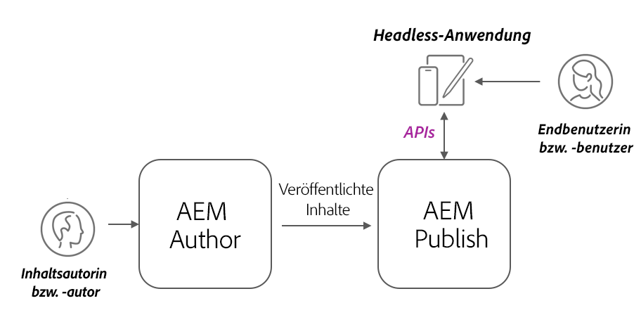

# AEM Headless-Implementierungen

AEM Headless-Client-Implementierungen können in vielen Formen auftreten: als über AEM gehostete SPA, als externe SPA, als Website, als Mobile App oder sogar als Server-zu-Server-Prozess.

Abhängig vom Client und dessen Implementierung gelten für AEM Headless-Implementierungen unterschiedliche Überlegungen.

## AEM-Service-Architektur

Bevor Sie Überlegungen zur Implementierung anstellen, müssen Sie sich mit der logischen Architektur von AEM sowie mit der Trennung und den Rollen der Service-Ebenen bei AEM as a Cloud Service vertraut machen. AEM as a Cloud Service umfasst zwei logische Dienste:

+ __AEM-Autor__ ist der Dienst, bei dem Teams Inhaltsfragmente (und andere Assets) erstellen, zusammen bearbeiten und veröffentlichen.
+ __AEM-Veröffentlichung__ ist der Dienst, der veröffentlichte Inhaltsfragmente (und andere Assets) für den allgemeinen Gebrauch repliziert.
+ __AEM-Vorschau__ ist der Dienst, der der AEM-Veröffentlichung im Verhalten sehr ähnlich ist, aber Inhalte für Vorschau- oder Prüfungszwecke veröffentlicht. AEM-Vorschau ist für interne Zielgruppen und nicht für die allgemeine Bereitstellung von Inhalten vorgesehen. Die Verwendung von AEM-Vorschau ist optional und vom gewünschten Workflow abhängig.

Typische Headless-Implementierungsarchitektur für AEM as a Cloud Service

AEM Headless-Clients, die in einer Produktionsfunktion arbeiten, interagieren normalerweise mit AEM Publish, der die genehmigten, veröffentlichten Inhalte enthält. Bei Clients, die mit AEM Author interagieren, müssen besondere Sicherheitsvorkehrungen beachtet werden, da AEM Author standardmäßig gesichert ist. Deshalb ist für alle Anfragen eine Autorisierung erforderlich. Außerdem können dort noch nicht abgeschlossene Arbeiten oder nicht genehmigte Inhalte vorhanden sein.

## Headless-Client-Implementierungen

    <!-- Single-page App (SPA) -->
    

       

           

               <figure class="image is-16by9">
                   
               </figure>
           

           

               

                   
<a href="./spa.md" title="Einzelseitenanwendung (SPA)">Einzelseitenanwendung (SPA)</a>

                   
Erfahren Sie mehr über wichtige Aspekte bei der Implementierung von Einzelseitenanwendungen (SPA).

                   <a href="./spa.md" class="spectrum-Button spectrum-Button--outline spectrum-Button--primary spectrum-Button--sizeM">
                       Mehr erfahren
                   </a>
               

           

       

    

<!-- Web component/JS -->

   

       

           <figure class="image is-16by9">
               
           </figure>
       

       

           

               
<a href="./web-component.md" title="Webkomponente/JS">Webkomponente/JS</a>

               
Erfahren Sie mehr über wichtige Aspekte bei der Implementierung von Web-Komponenten und Browser-basierten JavaScript-Headless-Nutzern.

               <a href="./web-component.md" class="spectrum-Button spectrum-Button--outline spectrum-Button--primary spectrum-Button--sizeM">
                   Mehr erfahren
               </a>
           

       

   

<!-- Mobile apps -->

   

       

           <figure class="image is-16by9">
               
           </figure>
       

       

           

               
<a href="./mobile.md" title="Mobile Apps">Mobile App</a>

               
Erfahren Sie mehr über wichtige Aspekte bei der Implementierung von Mobile Apps.

               <a href="./mobile.md" class="spectrum-Button spectrum-Button--outline spectrum-Button--primary spectrum-Button--sizeM">
                    Mehr erfahren
                  </a>
           

       

   

<!-- Server-to-server apps -->

   

       

           <figure class="image is-16by9">
               
           </figure>
       

       

           

               
<a href="./server-to-server.md" title="Server-zu-Server-Apps">Server-zu-Server-App</a>

               
Erfahren Sie mehr über wichtige Aspekte bei der Implementierung von Server-zu-Server-Apps

               <a href="./server-to-server.md" class="spectrum-Button spectrum-Button--outline spectrum-Button--primary spectrum-Button--sizeM">
                   Mehr erfahren
                </a>
           

       

   

