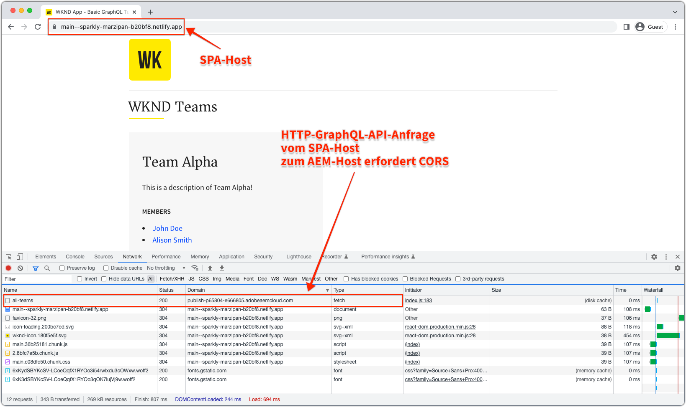
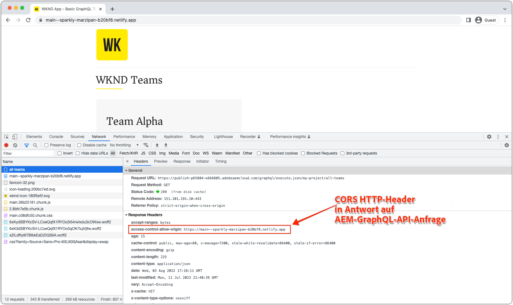
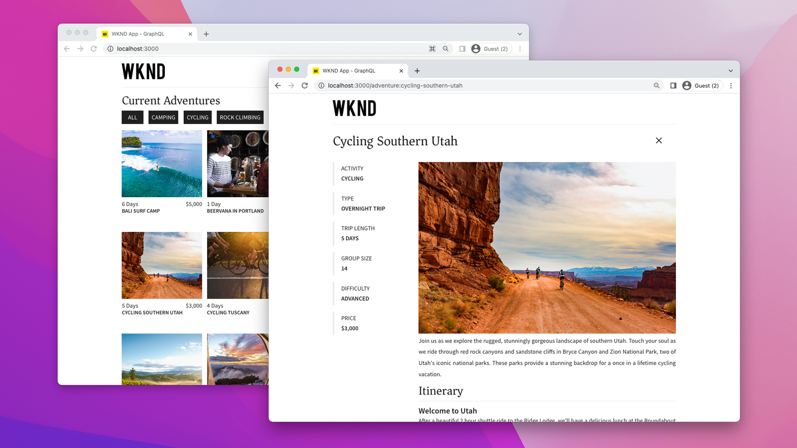

# AEM Headless-SPA-Bereitstellungen

AEM Headless-Single-Page-App (SPA)-Bereitstellungen beinhalten JavaScript-basierte, mit Frameworks wie React oder Vue erstellte Anwendungen, die Inhalte in AEM auf Headless-Weise nutzen und damit interagieren.

Wenn Sie eine SPA bereitstellen, die mit AEM auf Headless-Weise AEM interagiert, wird die SPA gehostet und über einen Webbrowser zugänglich gemacht.

## Hosten der SPA

Eine SPA besteht aus einer Sammlung nativer Web-Ressourcen: **HTML, CSS und JavaScript**. Diese Ressourcen werden während des _Build_-Prozesses generiert (z. B. `npm run build`) und in einem Host für die Verwendung durch Endbenutzende bereitgestellt.

Es gibt verschiedene **Hosting**-Optionen entsprechend den Anforderungen Ihrer Organisation:

1. **Cloud-Anbieterfirmen** wie **Azure** oder **AWS**.

2. **On-Premise**-Hosting im **Datenzentrum** eines Unternehmens

3. **Frontend-Hosting-Plattformen** wie **AWS Amplify**, **Azure App Service**, **Netlify**, **Heroku**, **Vercel** usw.

## Bereitstellungskonfigurationen

Beim Hosten einer SPA, die mit AEM Headless interagiert, sollten Sie vor allem berücksichtigen, ob der Zugriff auf die SPA über eine Domain (oder einen Host) von AEM oder über eine andere Domain erfolgt.  Der Grund dafür ist, dass SPA-Webanwendungen in Webbrowsern ausgeführt werden und daher Sicherheitsrichtlinien für Webbrowser unterliegen.

### Freigegebene Domain

Eine SPA und AEM teilen Domains, wenn beide von Endbenutzenden von derselben Domain aufgerufen werden. Zum Beispiel:

+ Der Zugriff auf AEM erfolgt über: `https://wknd.site/`
+ SPA ist zugänglich über `https://wknd.site/spa`

Da sowohl AEM als auch die SPA von derselben Domain aus aufgerufen werden, ermöglichen Webbrowser der SPA, ohne Erforderlichkeit von CORS XHR zu AEM Headless-Endpunkten zu machen, und erlauben die Freigabe von HTTP-Cookies (z. B. des `login-token`-Cookies von AEM).

Wie SPA und AEM-Traffic auf der geteilten Domain geleitet werden, liegt an Ihnen: CDN mit mehreren Ursprüngen, HTTP-Server mit Reverse-Proxy, Hosten der SPA direkt in AEM usw.

Im Folgenden finden Sie Bereitstellungskonfigurationen, die für SPA-Bereitstellungen in Produktionsumgebungen erforderlich sind, wenn sie auf derselben Domain wie AEM gehostet wird.

| SPA stellt eine Verbindung her zu | AEM Author | AEM Publish | AEM-Vorschau |
|---------------------------------------------------:|:----------:|:-----------:|:-----------:|
| [Dispatcher-Filter](./configurations/dispatcher-filters.md) | ✘ | ✔ | ✔ |
| Cross-Origin Resource Sharing (CORS) | ✘ | ✘ | ✘ |
| AEM-Hosts | ✘ | ✘ | ✘ |

### Verschiedene Domains

Eine SPA und AEM haben unterschiedliche Domains, wenn Endbenutzende von abweichenden Domains aus auf sie zugreifen. Zum Beispiel:

+ Der Zugriff auf AEM erfolgt über: `https://wknd.site/`
+ SPA ist zugänglich über `https://wknd-app.site/`

Da auf AEM und die SPA von verschiedenen Domains aus zugegriffen wird, erzwingen Webbrowser Sicherheitsrichtlinien wie [Cross-Origin Resource Sharing (CORS)](./configurations/cors.md) und unterbinden die Freigabe von HTTP-Cookies (z. B. des `login-token`-Cookies von AEM).

Im Folgenden finden Sie Bereitstellungskonfigurationen, die für SPA-Bereitstellungen in Produktionsumgebungen erforderlich sind, wenn sie auf einer anderen Domain gehostet werden als AEM.

| SPA stellt eine Verbindung her zu | AEM Author | AEM Publish | AEM-Vorschau |
|---------------------------------------------------:|:----------:|:-----------:|:-----------:|
| [Dispatcher-Filter](./configurations/dispatcher-filters.md) | ✘ | ✔ | ✔ |
| [Cross-Origin Resource Sharing (CORS)](./configurations/cors.md) | ✔ | ✔ | ✔ |
| [AEM-Hosts](./configurations/aem-hosts.md) | ✔ | ✔ | ✔ |

#### Beispiel für eine SPA-Bereitstellung auf verschiedenen Domains

In diesem Beispiel wird die SPA in eine Netlify-Domain bereitgestellt (`https://main--sparkly-marzipan-b20bf8.netlify.app/`) und die SPA verwendet AEM GraphQL-APIs aus der AEM Publish-Domain (`https://publish-p65804-e666805.adobeaemcloud.com`). In den folgenden Screenshots wird die CORS-Anforderung hervorgehoben.

1. Die SPA wird von einer Netlify-Domain bereitgestellt, führt jedoch einen XHR-Aufruf an AEM GraphQL-APIs in einer anderen Domain durch. Diese Site-übergreifende Anforderung erfordert die Festlegung von [CORS](./configurations/cors.md) auf AEM, um die Anfrage der Netlify-Domain zu genehmigen, den Zugriff auf ihren Inhalt zu ermöglichen.

   

2. Bei Überprüfung der XHR-Anfrage an die AEM GraphQL-API ist `Access-Control-Allow-Origin` vorhanden, was dem Webbrowser anzeigt, dass AEM Anfragen von dieser Netlify-Domain den Zugriff auf seinen Inhalt erlaubt.

   Wenn AEM-[CORS](./configurations/cors.md) fehlt oder die Netlify-Domain nicht enthält, schlägt die XHR-Anfrage durch den Webbrowser fehl und er meldet einen CORS-Fehler.

   

## Beispiel einer Einzelseitenanwendung

Adobe bietet eine beispielhafte Einzelseitenanwendung, die in React codiert ist.

<!-- React app -->

   

       

           <figure class="image is-16by9">
               
           </figure>
       

       

           

               
<a href="../example-apps/react-app.md" title="React-App">React-App</a>

               
Eine Beispiel-Einzelseiten-App, geschrieben in React, die Inhalte von AEM Headless-GraphQL-APIs nutzt.

               <a href="../example-apps/react-app.md" class="spectrum-Button spectrum-Button--outline spectrum-Button--primary spectrum-Button--sizeM">
                   Beispiel anzeigen
               </a>
           

       

   

<!-- Next.js app -->

   

       

           <figure class="image is-16by9">
               
           </figure>
       

       

           

               
<a href="../example-apps/next-js.md" title="Next.js-App">Next.js-App</a>

               
Eine Beispiel-Einzelseiten-App, geschrieben in Next.js, die Inhalte von AEM Headless-GraphQL-APIs nutzt.

               <a href="../example-apps/next-js.md" class="spectrum-Button spectrum-Button--outline spectrum-Button--primary spectrum-Button--sizeM">
                   Beispiel anzeigen
               </a>
           

       

   

