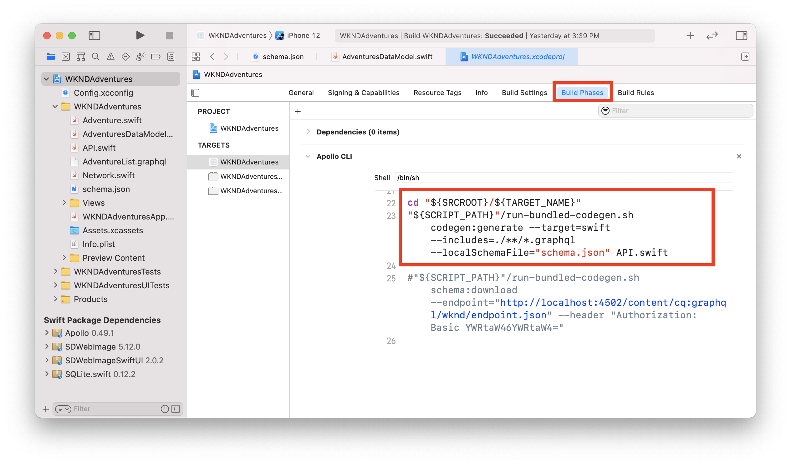

# iOS SwiftUI-App

Beispielanwendungen eignen sich hervorragend, um die Headless-Funktionen von Adobe Experience Manager (AEM) zu erkunden. Diese iOS-Anwendung zeigt, wie Inhalte mithilfe der GraphQL-APIs von AEM abgefragt werden. Der Apollo Client iOS wird verwendet, um die GraphQL-Abfragen zu generieren und Daten Swift-Objekten zuzuordnen, um die App zu unterstützen. SwiftUI wird zum Rendern einer einfachen Listen- und Detailansicht des Inhalts verwendet.

>[!VIDEO](https://video.tv.adobe.com/v/338042/?quality=12&learn=on)

## Voraussetzungen {#prerequisites}

Die folgenden Tools sollten lokal installiert werden:

* [Xcode 9.3+](https://developer.apple.com/xcode/)
* [Git](https://git-scm.com/)

## AEM

Das Programm ist für die Verbindung mit einem AEM konzipiert **Veröffentlichen** Umgebung mit der neuesten Version der [WKND-Referenz-Site](https://github.com/adobe/aem-guides-wknd/releases/latest) installiert.

* [ zu AEM as a Cloud Service](https://experienceleague.adobe.com/docs/experience-manager-cloud-service/overview/introduction.html)
* [AEM 6.5.10+](https://experienceleague.adobe.com/docs/experience-manager-65/release-notes/service-pack/new-features-latest-service-pack.html?lang=de)

Wir empfehlen [Bereitstellen der WKND-Referenz-Site in einer Cloud Service-Umgebung](https://experienceleague.adobe.com/docs/experience-manager-cloud-service/implementing/deploying/overview.html#coding-against-the-right-aem-version). Lokales Setup mit [das AEM Cloud Service SDK](https://experienceleague.adobe.com/docs/experience-manager-learn/cloud-service/local-development-environment-set-up/overview.html) oder [AEM 6.5 QuickStart-JAR](https://experienceleague.adobe.com/docs/experience-manager-learn/foundation/development/set-up-a-local-aem-development-environment.html?lang=en#install-local-aem-instances) kann auch verwendet werden.

## Informationen zur Verwendung

1. Klonen Sie die `aem-guides-wknd-graphql` repository:

   ```shell
   git clone git@github.com:adobe/aem-guides-wknd-graphql.git
   ```

1. Launch [Xcode](https://developer.apple.com/xcode/) und öffnen Sie den Ordner `ios-swiftui-app`
1. Datei ändern `Config.xcconfig` Datei und Aktualisierung `AEM_HOST` , um Ihrer AEM-Veröffentlichungsumgebung zu entsprechen

   ```plain
   // Target hostname for AEM environment, do not include http:// or https://
   AEM_HOST = localhost:4503
   // GraphQL Endpoint
   AEM_GRAPHQL_ENDPOINT = /content/cq:graphql/wknd/endpoint.json
   ```

1. Erstellen Sie die Anwendung mit Xcode und stellen Sie die App auf dem iOS-Simulator bereit.
1. Eine Liste der Abenteuer von der WKND-Referenz-Website sollte auf der Anwendung angezeigt werden.

## Der Code

Nachstehend finden Sie eine kurze Zusammenfassung der wichtigen Dateien und des Codes, mit denen die Anwendung betrieben wird. Den vollständigen Code finden Sie unter [GitHub](https://github.com/adobe/aem-guides-wknd-graphql/tree/main/ios-swiftui-app).

### Apollo iOS

Die [Apollo iOS](https://www.apollographql.com/docs/ios/) -Client wird von der App verwendet, um die GraphQL-Abfrage gegen AEM auszuführen. Der Beamte [Apollo-Tutorial](https://www.apollographql.com/docs/ios/tutorial/tutorial-introduction/) enthält viel mehr Details zur Installation und Verwendung.

`schema.json` ist eine Datei, die das GraphQL-Schema aus einer AEM Umgebung mit installierter WKND-Referenz-Site darstellt. `schema.json` wurde von AEM heruntergeladen und zum Projekt hinzugefügt. Der Apollo-Client prüft alle Dateien mit der Erweiterung `.graphql` als Teil einer benutzerdefinierten Build-Phase. Der Apollo-Client verwendet dann die `schema.json` -Datei und `.graphql` Abfragen zum automatischen Generieren der Datei `API.swift`.

Dadurch erhält die Anwendung ein stark typisiertes Modell zur Ausführung der Abfrage und des Modells/der Modelle, die die Ergebnisse darstellen.



`AdventureList.graphql` enthält die Abfrage zur Abfrage der Abenteuer:

```
query AdventureList
{
  adventureList {
    items {
      _path
      adventureTitle
      adventurePrice
      adventureActivity
      adventureDescription {
        plaintext
        markdown
      }
      adventureDifficulty
      adventureTripLength
      adventurePrimaryImage {
        ...on ImageRef {
          _authorUrl
          _publishUrl
        }
      }
    }
  }
}
```

`Network.swift` erstellt die `ApolloClient`. Die `endpointURL` verwendet wird, wird durch Lesen der Werte der `Config.xcconfig` -Datei. Wenn Sie eine Verbindung zu einem AEM herstellen möchten **Autor** -Instanz, die zum Hinzufügen zusätzlicher Header für die Authentifizierung erforderlich ist, sollten Sie die `ApolloClient` hier.

```swift
// Network.swift
private(set) lazy var apollo: ApolloClient = {
        // The cache is necessary to set up the store, which we're going to hand to the provider
        let cache = InMemoryNormalizedCache()
        let store = ApolloStore(cache: cache)
  
        let client = URLSessionClient()
        let provider = DefaultInterceptorProvider(client: client, shouldInvalidateClientOnDeinit: true, store: store)
        let url = Connection.baseURL // from Configx.xcconfig 

        // no additional headers, public instances by default require no additional authentication
        let requestChainTransport = RequestChainNetworkTransport(interceptorProvider: provider, endpointURL: url)

        return ApolloClient(networkTransport: requestChainTransport,store: store)
    }()
}
```

### Adventure-Daten

Die Anwendung ist so konzipiert, dass sie eine Liste von Abenteuern und dann eine Detailansicht jedes Abenteuers anzeigt.

`AdventuresDataModel.swift` ist eine Klasse, die eine Funktion enthält `fetchAdventures()`. Diese Funktion verwendet die `ApolloClient` , um die Abfrage auszuführen. Bei einer erfolgreichen Abfrage weist das Ergebnisarray den Typ `AdventureListQuery.Data.AdventureList.Item`, wird automatisch von der `API.swift` -Datei.

```swift
func fetchAdventures() {
        Network.shared.apollo
            //AdventureListQuery() generated based on AdventureList.graphql file
           .fetch(query: AdventureListQuery()) { [weak self] result in
           
             guard let self = self else {
               return
             }
                   
             switch result {
             case .success(let graphQLResult):
                print("Success AdventureListQuery() from: \(graphQLResult.source)")

                if let adventureDataItems =  graphQLResult.data?.adventureList.items {
                    // map graphQL items to an array of Adventure objects
                    self.adventures = adventureDataItems.compactMap { Adventure(adventureData: $0!) }
                }
                ...
             }
           }
}
```

Es ist möglich, `AdventureListQuery.Data.AdventureList.Item` direkt, um die Anwendung zu aktivieren. Es ist jedoch sehr möglich, dass einige Daten unvollständig sind und einige Eigenschaften daher möglicherweise null sind.

`Adventure.swift` ist ein benutzerdefiniertes Modell, das als Wrapper des von Apollo generierten Modells verwendet wird. `Adventure` initialisiert mit `AdventureListQuery.Data.AdventureList.Item`. A `typealias` wird verwendet, um den Code lesbarer zu machen:

```
// use typealias
typealias AdventureData = AdventureListQuery.Data.AdventureList.Item
```

Die `Adventure` structure mit einer `AdventureData` -Objekt:

```swift
struct Adventure: Identifiable {
    let id: String
    let adventureTitle: String
    let adventurePrice: String
    let adventureDescription: String
    let adventureActivity: String
    let adventurePrimaryImageUrl: String
    
    // initialize with AdventureData object aka AdventureListQuery.Data.AdventureList.Item
    init(adventureData: AdventureData) {
        // use path as unique idenitifer, otherwise
        self.id = adventureData._path ?? UUID().uuidString
        self.adventureTitle = adventureData.adventureTitle ?? "Untitled"
        self.adventurePrice = adventureData.adventurePrice ?? "Free"
        self.adventureActivity = adventureData.adventureActivity ?? ""
        ...
```

Dadurch können wir dann Standardwerte angeben und zusätzliche Prüfungen auf unvollständige Daten durchführen. Anschließend können Sie die `Adventure` sicher modellieren, um verschiedene UI-Elemente zu unterstützen, und nicht ständig nach Nullwerten suchen müssen.

In AEM werden Inhaltselemente durch `_path`. In `Adventure.swift` Wir füllen die `id` -Eigenschaft mit dem Wert von `_path`. Dies ermöglicht Folgendes `Adventure` um `Identifiable` -Schnittstelle und erleichtert die Iteration über ein Array oder eine Liste.

### Ansichten

SwiftUI wird für die verschiedenen Ansichten in der Anwendung verwendet. Ein tolles Tutorial für [Erstellen von Listen und Navigation](https://developer.apple.com/tutorials/swiftui/building-lists-and-navigation) finden Sie auf der Entwickler-Site von Apple. Der Code für diese Anwendung wird lose von ihr abgeleitet.

`WKNDAdventuresApp.swift` ist der Eintrag des Antrags. Er umfasst `AdventureListView` und `.onAppear` -Ereignis wird verwendet, um die Abenteuerdaten abzurufen.

`AdventureListView.swift` - erstellt eine `NavigationView` und eine Liste von Abenteuern, die von `AdventureRowView`. Navigation zu einer `AdventureDetailView` ist hier eingerichtet.

`AdventureRowView` - zeigt das Primärbild des Abenteuers und den Abenteuer-Titel in einer Zeile an.

`AdventureDetailView` - zeigt ein vollständiges Detail des individuellen Abenteuers, einschließlich Titel, Beschreibung, Preis, Aktivitätstyp und Primärbild.

Wenn die Apollo-CLI ausgeführt und neu generiert wird `API.swift` Dadurch wird die Vorschau angehalten. Um die Funktion Automatische Vorschau zu verwenden, müssen Sie die **Apollo CLI** Phase erstellen und überprüfen, um das Skript auszuführen **Nur für Install-Builds**.


### Remote-Bilder

[SDWebImageSwiftUI](https://github.com/SDWebImage/SDWebImageSwiftUI) und [SDWEbImage](https://github.com/SDWebImage/SDWebImage) werden verwendet, um die Remote-Bilder von AEM zu laden, die das primäre Abenteuer-Bild in der Zeilen- und Detailansicht ausfüllen.

Die [AsyncImage](https://developer.apple.com/documentation/swiftui/asyncimage) ist eine native SwiftUI-Ansicht, die ebenfalls verwendet werden kann. `AsyncImage` wird nur für iOS 15.0+ unterstützt.

## Zusätzliche Ressourcen

* [Erste Schritte mit AEM Headless - GraphQL-Tutorial](https://experienceleague.adobe.com/docs/experience-manager-learn/getting-started-with-aem-headless/graphql/multi-step/overview.html?lang=de)
* [Tutorial zu SwiftUI-Listen und Navigation](https://developer.apple.com/tutorials/swiftui/building-lists-and-navigation)
* [Apollo iOS Client-Tutorial](https://www.apollographql.com/docs/ios/tutorial/tutorial-introduction/)

