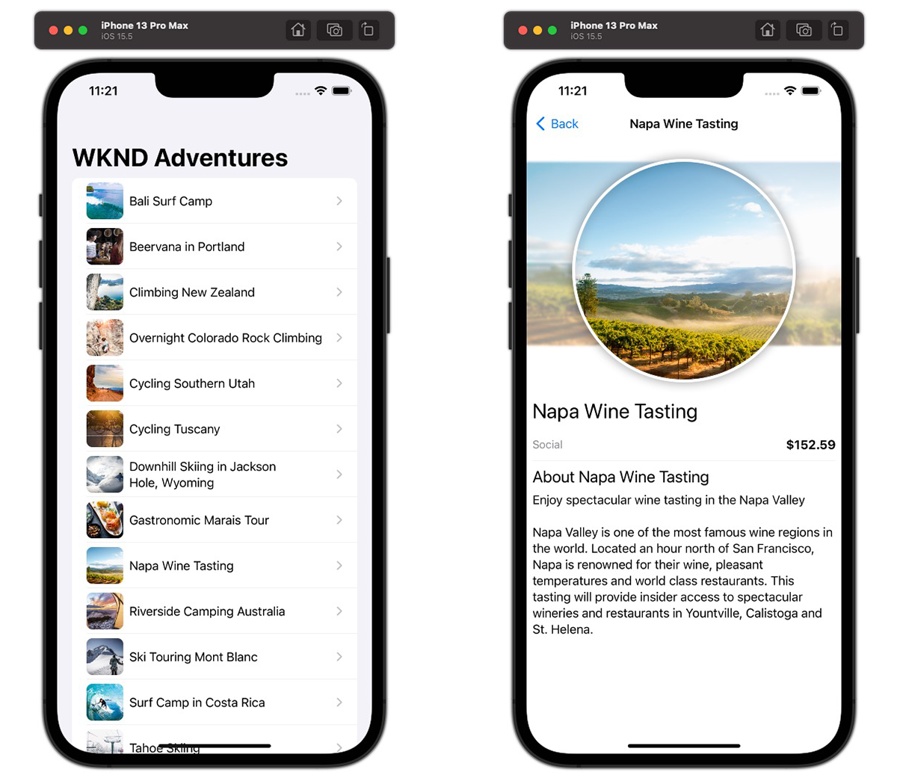

# iOS-App

Beispielanwendungen eignen sich hervorragend, um die Headless-Funktionen von Adobe Experience Manager (AEM) zu erkunden. Diese iOS-Anwendung zeigt, wie Inhalte mithilfe von AEM GraphQL-APIs unter Verwendung persistierter Abfragen abgerufen werden können.



Sie finden den [Quell-Code auf GitHub](https://github.com/adobe/aem-guides-wknd-graphql/tree/main/ios-app).

## Voraussetzungen {#prerequisites}

Folgende Tools sollten lokal installiert werden:

+ [Xcode](https://developer.apple.com/xcode/) (erfordert macOS)
+ [Git](https://git-scm.com/)

## AEM-Anforderungen

Die iOS-Anwendung kann mit den folgenden AEM-Bereitstellungsoptionen verwendet werden. Für alle Bereitstellungen muss die [WKND-Site v3.0.0+](https://github.com/adobe/aem-guides-wknd/releases/latest) installiert werden.

+ [AEM as a Cloud Service](https://experienceleague.adobe.com/docs/experience-manager-cloud-service/content/implementing/deploying/overview.html?lang=de)
+ Lokales Setup mit dem [AEM Cloud Service-SDK](https://experienceleague.adobe.com/docs/experience-manager-learn/cloud-service/local-development-environment-set-up/overview.html?lang=de)

Die iOS-Anwendung ist für die Verbindung mit einer __AEM Publish__-Umgebung konzipiert, kann jedoch Inhalte von AEM Author beziehen, wenn die Authentifizierung in der Konfiguration der iOS-Anwendung bereitgestellt wird.

## Informationen zur Verwendung

1. Klonen Sie das Repository `adobe/aem-guides-wknd-graphql`:

   ```shell
   $ git clone git@github.com:adobe/aem-guides-wknd-graphql.git
   ```

1. Starten Sie [Xcode](https://developer.apple.com/xcode/) und öffnen Sie den Ordner `ios-app`.
1. Ändern Sie die Datei `Config.xcconfig` und aktualisieren Sie `AEM_SCHEME` und `AEM_HOST` entsprechend Ihrem AEM Publish-Ziel-Service.

   ```plain
   // The http/https protocol scheme used to access the AEM_HOST
   AEM_SCHEME = https
   // Target hostname for AEM environment, do not include http:// or https://
   AEM_HOST = publish-p123-e456.adobeaemcloud.com
   ```

   Wenn Sie eine Verbindung zu AEM Author herstellen, fügen Sie `AEM_AUTH_TYPE` und unterstützende Authentifizierungseigenschaften zu `Config.xcconfig` hinzu.

   __Standardauthentifizierung__

   `AEM_USERNAME` und `AEM_PASSWORD` authentifizieren lokale AEM-Benutzende mit Zugriff auf WKND GraphQL-Inhalte.

   ```plain
   AEM_AUTH_TYPE = basic
   AEM_USERNAME = admin
   AEM_PASSWORD = admin
   ```

   __Token-Authentifizierung__

   `AEM_TOKEN` ist ein [Zugriffstoken](https://experienceleague.adobe.com/docs/experience-manager-learn/getting-started-with-aem-headless/authentication/overview.html?lang=de), das sich bei einer AEM-Benutzerin oder einem AEM-Benutzer mit Zugriff auf WKND GraphQL-Inhalte authentifiziert.

   ```plain
   AEM_AUTH_TYPE = token
   AEM_TOKEN = abcd...0123
   ```

1. Erstellen Sie die Anwendung mit Xcode und stellen Sie die App dem iOS-Simulator bereit.
1. Es sollte eine Liste der Adventures von der WKND-Website in der Anwendung angezeigt werden. Bei Auswahl eines Adventures werden die zugehörigen Details geöffnet. Führen Sie in der Liste der Adventures einen Pull aus, um die Daten aus AEM zu aktualisieren.

## Der Code

Nachstehend finden Sie eine Zusammenfassung zur Erstellung der iOS-Anwendung, zu ihrer Verbindung mit AEM Headless, um Inhalte mithilfe von GraphQL-persistierten Abfragen abzurufen, und zur Darstellung dieser Daten. Den vollständigen Code finden Sie auf [GitHub](https://github.com/adobe/aem-guides-wknd-graphql/tree/main/ios-app).

### Persistierte Abfragen

Gemäß den Best Practices für AEM Headless verwendet die iOS-Anwendung AEM GraphQL-persistierte Abfragen, um Adventure-Daten abzufragen. Die Anwendung verwendet zwei persistierte Abfragen:

+ Die persistierte Abfrage `wknd/adventures-all` gibt alle Adventures in AEM mit einer gekürzten Reihe von Eigenschaften zurück. Diese persistierte Abfrage bestimmt die Erlebnisliste der ersten Ansicht.

```
# Retrieves a list of all Adventures
#
# Optional query variables:
# - { "offset": 10 }
# - { "limit": 5 }
# - { 
#    "imageFormat": "JPG",
#    "imageWidth": 1600,
#    "imageQuality": 90 
#   }

query ($offset: Int, $limit: Int, $sort: String, $imageFormat: AssetTransformFormat=JPG, $imageWidth: Int=1200, $imageQuality: Int=80) {
  adventureList(
    offset: $offset
    limit: $limit
    sort: $sort
    _assetTransform: {
      format: $imageFormat
      width: $imageWidth
      quality: $imageQuality
      preferWebp: true
  }) {
    items {
      _path
      slug
      title
      activity
      price
      tripLength
      primaryImage {
        ... on ImageRef {
          _path
          _dynamicUrl
        }
      }
    }
  }
}
```

+ Die persistierte Abfrage `wknd/adventure-by-slug` gibt ein einzelnes Adventure durch `slug` (eine benutzerdefinierte Eigenschaft, die ein Adventure eindeutig identifiziert) mit einer vollständigen Reihe von Eigenschaften zurück. Diese persistierte Abfrage ermöglicht Detailansichten des Adventures.

```
query ($slug: String!, $imageFormat:AssetTransformFormat=JPG, $imageSeoName: String, $imageWidth: Int=1200, $imageQuality: Int=80) {
  adventureList(
    filter: {slug: {_expressions: [{value: $slug}]}}
    _assetTransform: {
      format: $imageFormat
      seoName: $imageSeoName
      width: $imageWidth
      quality: $imageQuality
      preferWebp: true
  }) {
    items {
      _path
      title
      slug
      activity
      adventureType
      price
      tripLength
      groupSize
      difficulty
      price
      primaryImage {
        ... on ImageRef {
          _path
          _dynamicUrl
        }
      }
      description {
        json
        plaintext
        html
      }
      itinerary {
        json
        plaintext
        html
      }
    }
    _references {
      ... on AdventureModel {
        _path
        slug
        title
        price
        __typename
      }
    }
  }
}
```

### Durchführen einer GraphQL-persistierten Abfrage

Persistierte Abfragen von AEM werden über HTTP-GET ausgeführt. Daher können keine gängigen GraphQL-Bibliotheken, die HTTP-POST verwenden (z. B. Apollo), genutzt werden. Erstellen Sie stattdessen eine benutzerdefinierte Klasse, die persistierte Abfragen über HTTP-GET-Anfragen an AEM ausführt.

`AEM/Aem.swift` instanziiert die `Aem`-Klasse, die für alle Interaktionen mit AEM Headless verwendet wird. Das Muster lautet:

1. Jede persistierte Abfrage verfügt über eine entsprechende öffentliche Funktion (z. B. `getAdventures(..)` oder `getAdventureBySlug(..)`), die von den Ansichten der iOS-Anwendung aufgerufen wird, um Erlebnisdaten zu erhalten.
1. Die öffentliche Funktion ruft eine private Funktion `makeRequest(..)` auf, die eine asynchrone HTTP-GET-Anfrage an AEM Headless aufruft und JSON-Daten zurückgibt.
1. Jede öffentliche Funktion decodiert dann die JSON-Daten und führt alle erforderlichen Prüfungen oder Umwandlungen durch, bevor die Adventure-Daten an die Ansicht zurückgegeben werden.

   + AEM GraphQL-JSON-Daten werden mit den in `AEM/Models.swift` definierten Strukturen/Klassen decodiert, die den von AEM Headless zurückgegebenen JSON-Objekten zugeordnet sind.

```swift
    /// # getAdventures(..)
    /// Returns all WKND adventures using the `wknd-shared/adventures-all` persisted query.
    /// For this func call to work, the `wknd-shared/adventures-all` query must be deployed to the AEM environment/service specified by the host.
    /// 
    /// Since HTTP requests are async, the completion syntax is used.
    func getAdventures(params: [String:String], completion: @escaping ([Adventure]) ->  ()) {
               
        let request = makeRequest(persistedQueryName: "wknd-shared/adventures-all", params: params)
        
        URLSession.shared.dataTask(with: request) { (data, response, error) in
            if ((error) != nil) {
                print("Unable to connect to AEM GraphQL endpoint")
                completion([])
            } else if (!data!.isEmpty) {
                let adventures = try! JSONDecoder().decode(Adventures.self, from: data!)
                DispatchQueue.main.async {
                    completion(adventures.data.adventureList.items)
                }
            }
        }.resume();
    }
    
    ...

    /// #makeRequest(..)
    /// Generic method for constructing and executing AEM GraphQL persisted queries
    private func makeRequest(persistedQueryName: String, params: [String: String] = [:]) -> URLRequest {
        // Encode optional parameters as required by AEM
        let persistedQueryParams = params.map { (param) -> String in
            encode(string: ";\(param.key)=\(param.value)")
        }.joined(separator: "")
        
        // Construct the AEM GraphQL persisted query URL, including optional query params
        let url: String = "\(self.scheme)://\(self.host)/graphql/execute.json/" + persistedQueryName + persistedQueryParams;

        var request = URLRequest(url: URL(string: url)!);

        // Add authentication to the AEM GraphQL persisted query requests as defined by the iOS application's configuration
        request = addAuthHeaders(request: request)
        
        return request
    }
    
    ...
```

### GraphQL-Antwort-Datenmodelle

iOS bevorzugt die Zuordnung von JSON-Objekten zu typisierten Datenmodellen.

`src/AEM/Models.swift` definiert die [decodierbaren](https://developer.apple.com/documentation/swift/decodable) Swift-Strukturen und -Klassen, die den von AEM-JSON-Antworten zurückgegebenen AEM-JSON-Antworten zugeordnet sind.

### Ansichten

SwiftUI wird für die verschiedenen Ansichten in der Anwendung verwendet. Apple bietet ein Erste-Schritte-Tutorial für die [Erstellung von Listen und Navigation mit SwiftUI](https://developer.apple.com/tutorials/swiftui/building-lists-and-navigation).

+ `WKNDAdventuresApp.swift`

  Entspricht dem Einstiegspunkt für die Anwendung und enthält `AdventureListView`, dessen Ereignis-Handler `.onAppear` verwendet wird, um alle Adventure-Daten über `aem.getAdventures()` abzurufen. Das gemeinsame `aem`-Objekt wird hier initialisiert und anderen Ansichten als [EnvironmentObject](https://developer.apple.com/documentation/swiftui/environmentobject) bereitgestellt.

+ `Views/AdventureListView.swift`

  Zeigt eine Liste der Adventures (basierend auf den Daten aus `aem.getAdventures()`) sowie ein Listenelement für jedes Adventure mithilfe von `AdventureListItemView` an.

+ `Views/AdventureListItemView.swift`

  Zeigt die einzelnen Elemente in der Adventure-Liste an (`Views/AdventureListView.swift`).

+ `Views/AdventureDetailView.swift`

  Zeigt Details zu einem Adventure an, einschließlich Titel, Beschreibung, Preis, Aktivitätstyp und Primärbild. In dieser Ansicht werden mit `aem.getAdventureBySlug(slug: slug)` alle Adventure-Details aus AEM abgefragt, wobei der `slug`-Parameter basierend auf der ausgewählten Listenzeile übergeben wird.

### Remote-Bilder

Bilder, auf die von abenteuerbezogenen Inhaltsfragmenten verwiesen wird, werden von AEM bereitgestellt. Diese iOS-App verwendet das Pfadfeld `_dynamicUrl` in der GraphQL-Antwort und stellt `AEM_SCHEME` und `AEM_HOST` als Präfixe voran, um eine vollständig qualifizierte URL zu erstellen. Bei Entwicklungen gegen das AEM SDK gibt `_dynamicUrl` Null zurück. Greifen Sie deshalb zur Entwicklung auf das Feld `_path` des Bilds zurück.

Wenn eine Verbindung zu geschützten Ressourcen in AEM hergestellt werden soll, für die eine Autorisierung erforderlich ist, müssen zu Bildanfragen ebenfalls Anmeldeinformationen hinzugefügt werden.

[SDWebImageSwiftUI](https://github.com/SDWebImage/SDWebImageSwiftUI) und [SDWebImage](https://github.com/SDWebImage/SDWebImage) werden verwendet, um die Remote-Bilder von AEM zu laden, die die Ansichten `AdventureListItemView` und `AdventureDetailView` mit dem Adventure-Bild aktualisieren.

Die `aem`-Klasse (in `AEM/Aem.swift`) ermöglicht die Verwendung von AEM-Bildern auf zwei Arten:

1. `aem.imageUrl(path: String)` wird in Ansichten verwendet, um das AEM-Schema und den Host dem Bildpfad voranzustellen und so eine vollständig qualifizierte URL zu erstellen.

   ```swift
   // adventure.image() => /adobe/dynamicmedia/deliver/dm-aid--741ed388-d5f8-4797-8095-10c896dc9f1d/example.jpg?quality=80&preferwebp=true
   
   let imageUrl = aem.imageUrl(path: adventure.image()) 
   // imageUrl => https://publish-p123-e456.adobeaemcloud.com/adobe/dynamicmedia/deliver/dm-aid--741ed388-d5f8-4797-8095-10c896dc9f1d/example.jpg?quality=80&preferwebp=true
   ```

2. `convenience init(..)` in `Aem` legt HTTP-Autorisierungs-Header für die Bild-HTTP-Anfrage fest, basierend auf der Konfiguration der iOS-Anwendungskonfiguration.

   + Wenn die __Standardauthentifizierung__ konfiguriert ist, wird diese allen Bildanfragen angehängt.

   ```swift
   /// AEM/Aem.swift
   ///
   /// # Basic authentication init
   /// Used when authenticating to AEM using local accounts (basic auth)
   convenience init(scheme: String, host: String, username: String, password: String) {
       ...
   
       // Add basic auth headers to all Image requests, as they are (likely) protected as well
       SDWebImageDownloader.shared.setValue("Basic \(encodeBasicAuth(username: username, password: password))", forHTTPHeaderField: "Authorization")
   }
   ```

   + Wenn die __Token-Authentifizierung__ konfiguriert ist, wird diese allen Bildanfragen angehängt.

   ```swift
   /// AEM/Aem.swift
   ///
   /// # Token authentication init
   ///  Used when authenticating to AEM using token authentication (Dev Token or access token generated from Service Credentials)
   convenience init(scheme: String, host: String, token: String) {
       ...
   
       // Add token auth headers to all Image requests, as they are (likely) protected as well
       SDWebImageDownloader.shared.setValue("Bearer \(token)", forHTTPHeaderField: "Authorization")
   }
   ```

   + Wenn __keine Authentifizierung__ konfiguriert ist, wird keine Authentifizierung an Bildanfragen angehängt.

Ein ähnlicher Ansatz kann mit der SwiftUI-nativen [AsyncImage](https://developer.apple.com/documentation/swiftui/asyncimage)-Ansicht verwendet werden. `AsyncImage` wird ab iOS 15.0 unterstützt.

## Zusätzliche Ressourcen

+ [Erste Schritte mit AEM Headless – GraphQL-Tutorial](https://experienceleague.adobe.com/docs/experience-manager-learn/getting-started-with-aem-headless/graphql/multi-step/overview.html?lang=de)
+ [Tutorial zu SwiftUI-Listen und -Navigation](https://developer.apple.com/tutorials/swiftui/building-lists-and-navigation)
