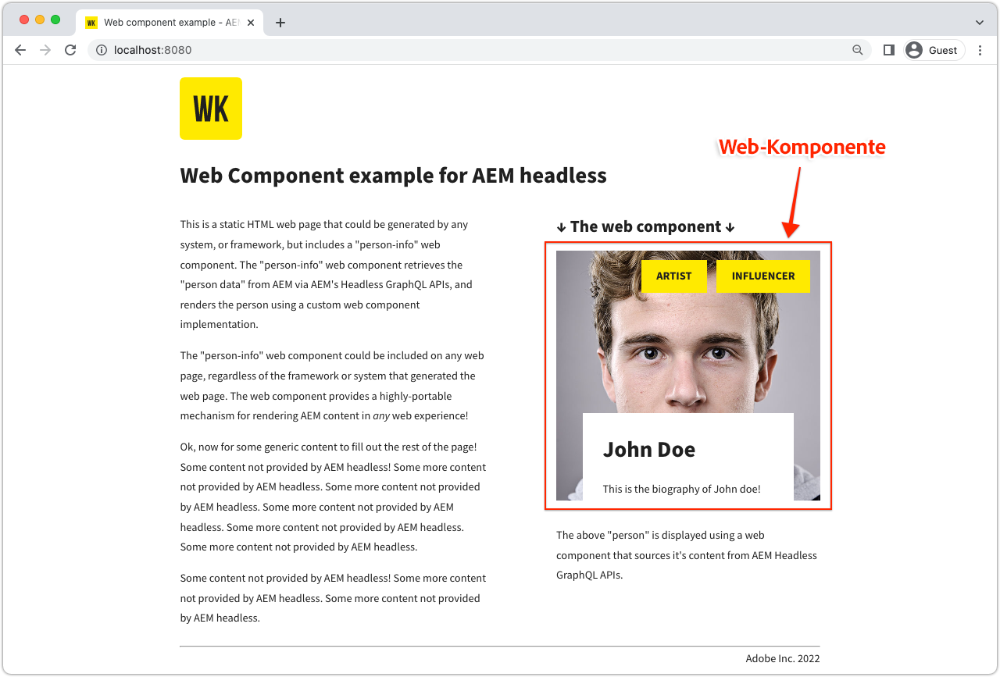

# Web-Komponente

Beispielanwendungen eignen sich hervorragend, um die Headless-Funktionen von Adobe Experience Manager (AEM) zu erkunden. Diese Web-Komponenten-Anwendung zeigt, wie Sie mithilfe der GraphQL-APIs von AEM Inhalte mit persistierten Abfragen abfragen und einen Teil der Benutzeroberfläche mit reinem JavaScript-Code rendern können.



Sie finden den [Quell-Code auf GitHub](https://github.com/adobe/aem-guides-wknd-graphql/tree/main/web-component).

## Voraussetzungen {#prerequisites}

Folgende Tools sollten lokal installiert werden:

+ [Node.js v18](https://nodejs.org/de/)
+ [Git](https://git-scm.com/)

## AEM-Anforderungen

Die Web-Komponente funktioniert mit den folgenden AEM Bereitstellungsoptionen.

+ [AEM as a Cloud Service](https://experienceleague.adobe.com/docs/experience-manager-cloud-service/content/implementing/deploying/overview.html?lang=de)
+ Lokales Setup mit dem [AEM Cloud Service-SDK](https://experienceleague.adobe.com/docs/experience-manager-learn/cloud-service/local-development-environment-set-up/overview.html?lang=de)
   + [JDK 11](https://experience.adobe.com/#/downloads/content/software-distribution/en/general.html?1_group.propertyvalues.property=.%2Fjcr%3Acontent%2Fmetadata%2Fdc%3AsoftwareType&amp;1_group.propertyvalues.operation=equals&amp;1_group.propertyvalues.0_values=software-type%3Atooling&amp;fulltext=Oracle%7E+JDK%7E+11%7E&amp;orderby=%40jcr%3Acontent%2Fjcr%3AlastModified&amp;orderby.sort=desc&amp;layout=list&amp;p.offset=0&amp;p.limit=14) ist erforderlich (bei Verbindung mit dem lokalen AEM 6.5 oder AEM SDK)

Für diese Beispielanwendung müssen [basic-tutorial-solution.content.zip](../multi-step/assets/explore-graphql-api/basic-tutorial-solution.content.zip) installiert und die erforderlichen [Bereitstellungskonfigurationen](../deployment/web-component.md) vorhanden sein.


>[!IMPORTANT]
>
>Die Web-Komponente ist für die Verbindung mit einer __AEM Publish__-Umgebung konzipiert. Sie kann jedoch Inhalte von AEM Author beziehen, wenn die Authentifizierung in der Datei [`person.js`](https://github.com/adobe/aem-guides-wknd-graphql/blob/main/web-component/src/person.js#L11) der Web-Komponente angegeben ist.

## Informationen zur Verwendung

1. Klonen Sie das Repository `adobe/aem-guides-wknd-graphql`:

   ```shell
   $ git clone git@github.com:adobe/aem-guides-wknd-graphql.git
   ```

1. Navigieren Sie zum Unterverzeichnis `web-component`.

   ```shell
   $ cd aem-guides-wknd-graphql/web-component
   ```

1. Bearbeiten Sie die Datei `.../src/person.js` so, dass sie die AEM-Verbindungsdetails enthält:

   Aktualisieren Sie im `aemHeadlessService`-Objekt den `aemHost`, sodass er auf Ihren AEM-Veröffentlichungs-Service verweist.

   ```plain
   # AEM Server namespace
   aemHost=https://publish-p123-e456.adobeaemcloud.com
   
   # AEM GraphQL API and Persisted Query Details
   graphqlAPIEndpoint=graphql/execute.json
   projectName=my-project
   persistedQueryName=person-by-name
   queryParamName=name
   ```

   Wenn Sie eine Verbindung zu einem Service von AEM Author herstellen, geben Sie im `aemCredentials`-Objekt lokale AEM-Benutzeranmeldeinformationen an.

   ```plain
   # For Basic auth, use AEM ['user','pass'] pair (for example, when connecting to local AEM Author instance)
   username=admin
   password=admin
   ```

1. Öffnen Sie ein Terminal und führen Sie die Befehle aus `aem-guides-wknd-graphql/web-component` aus:

   ```shell
   $ npm install
   $ npm start
   ```

1. In einem neuen Browserfenster wird die statische HTML-Seite geöffnet, in die die Web-Komponente unter [http://localhost:8080](http://localhost:8080) eingebettet ist.
1. Die Web-Komponente _Personeninformationen_ wird auf der Webseite angezeigt.

## Der Code

Im Folgenden finden Sie eine Zusammenfassung, wie die Web-Komponente aufgebaut ist, wie sie mit AEM Headless verbunden wird, um Inhalte mithilfe von persistierten GraphQL-Abfragen abzurufen, und wie diese Daten präsentiert werden. Den vollständigen Code finden Sie unter [GitHub](https://github.com/adobe/aem-guides-wknd-graphql/tree/main/web-component).

### HTML-Tag der Web-Komponente

Eine wiederverwendbare Web-Komponente (auch als benutzerdefiniertes Element bezeichnet) `<person-info>` wird der HTML-Seite `../src/assets/aem-headless.html` hinzugefügt. Es unterstützt `host` und `query-param-value`-Attribute, um das Verhalten der Komponente zu fördern. Der Wert des `host`-Attributs überschreibt den `aemHost`-Wert des `aemHeadlessService`-Objekts in `person.js`, und `query-param-value` wird zur Auswahl der darzustellenden Person verwendet.

```html
    <person-info 
        host="https://publish-p123-e456.adobeaemcloud.com"
        query-param-value="John Doe">
    </person-info>
```

### Implementierung von Web-Komponenten

Die `person.js` definiert die Funktionalität der Web-Komponente und im Folgenden sind die wichtigsten Highlights aufgeführt.

#### PersonInfo-Element-Implementierung

Das Klassenobjekt des benutzerdefinierten Elements `<person-info>` definiert die Funktionalität durch die Verwendung der `connectedCallback()`-Lebenszyklusmethoden, das Anhängen eines Schatten-Stammverzeichnisses, das Abrufen einer persistierten GraphQL-Abfrage und die DOM-Manipulation zur Erstellung der internen Schatten-DOM-Struktur des benutzerdefinierten Elements.

```javascript
// Create a Class for our Custom Element (person-info)
class PersonInfo extends HTMLElement {

    constructor() {
        ...
        // Create a shadow root
        const shadowRoot = this.attachShadow({ mode: "open" });
        ...
    }

    ...

    // lifecycle callback :: When custom element is appended to document
    connectedCallback() {
        ...
        // Fetch GraphQL persisted query
        this.fetchPersonByNamePersistedQuery(headlessAPIURL, queryParamValue).then(
            ({ data, err }) => {
                if (err) {
                    console.log("Error while fetching data");
                } else if (data?.personList?.items.length === 1) {
                    // DOM manipulation
                    this.renderPersonInfoViaTemplate(data.personList.items[0], host);
                } else {
                    console.log(`Cannot find person with name: ${queryParamValue}`);
                }
            }
        );
    }

    ...

    //Fetch API makes HTTP GET to AEM GraphQL persisted query
    async fetchPersonByNamePersistedQuery(headlessAPIURL, queryParamValue) {
        ...
        const response = await fetch(
            `${headlessAPIURL}/${aemHeadlessService.persistedQueryName}${encodedParam}`,
            fetchOptions
        );
        ...
    }

    // DOM manipulation to create the custom element's internal shadow DOM structure
    renderPersonInfoViaTemplate(person, host){
        ...
        const personTemplateElement = document.getElementById('person-template');
        const templateContent = personTemplateElement.content;
        const personImgElement = templateContent.querySelector('.person_image');
        personImgElement.setAttribute('src',
            host + (person.profilePicture._dynamicUrl || person.profilePicture._path));
        personImgElement.setAttribute('alt', person.fullName);
        ...
        this.shadowRoot.appendChild(templateContent.cloneNode(true));
    }
}
```

#### Registrieren Sie das `<person-info>`-Element

```javascript
    // Define the person-info element
    customElements.define("person-info", PersonInfo);
```

### Cross-Origin Resource Sharing (CORS)

Diese Web-Komponente beruht auf einer AEM-basierten CORS-Konfiguration, die in der AEM-Zielumgebung ausgeführt wird, und geht davon aus, dass die Host-Seite auf `http://localhost:8080` im Entwicklungsmodus ausgeführt wird. Darunter finden Sie eine Beispielkonfiguration für CORS OSGi für den lokalen Service von AEM Author.

Bitte überprüfen Sie die [Bereitstellungskonfigurationen](../deployment/web-component.md) für den jeweiligen AEM-Service.
