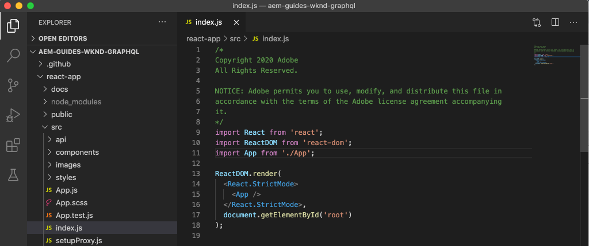

# Abfrage AEM mit GraphQL einer externen App

>[!CAUTION]
>
> Die AEM GraphQL API für Content Fragment Versand wird Anfang 2021 veröffentlicht.
> Die zugehörige Dokumentation steht zu Vorschauen zur Verfügung.

In diesem Kapitel wird untersucht, wie AEM GraphQL APIs verwendet werden können, um das Erlebnis in einer externen Anwendung zu fördern.

Dieses Lernprogramm verwendet eine einfache React-App zur Abfrage und Anzeige von Adventure-Inhalten, die von AEM GraphQL APIs bereitgestellt werden. Die Verwendung von React ist weitgehend unwichtig, und die verbrauchende externe Anwendung könnte in jedem Rahmen für jede Plattform geschrieben werden.

## Voraussetzungen

Es handelt sich um ein mehrteiliges Tutorial, bei dem davon ausgegangen wird, dass die in den vorherigen Teilen beschriebenen Schritte abgeschlossen wurden.

_IDE-Screenshots in diesem Kapitel stammen aus  [Visual Studio-Code](https://code.visualstudio.com/)_

Installieren Sie optional eine Browsererweiterung wie [GraphQL Network](https://chrome.google.com/webstore/detail/graphql-network/igbmhmnkobkjalekgiehijefpkdemocm), um weitere Details zu einer GraphQL-Abfrage Ansicht.

## Ziele

In diesem Kapitel lernen wir Folgendes:

* Beginn und Erläuterung der Funktionen der Beispiel-React-App
* Erfahren Sie, wie Aufrufe von der externen App zu AEM GraphQL-Endpunkten erfolgen.
* Definieren einer GraphQL-Abfrage zum Filtern einer Liste von Abenteuern Inhaltsfragmenten nach Aktivität
* Aktualisieren Sie die React-App, um Steuerelemente zum Filtern über GraphQL, die Liste von Abenteuern nach Aktivität, bereitzustellen.

## Beginn der React-App

Da sich dieses Kapitel auf die Entwicklung eines Clients zur Verwendung von Inhaltsfragmenten über GraphQL konzentriert, muss der Quellcode der [WKND GraphQL React-App heruntergeladen und unter ](./setup.md#react-app) auf Ihrem lokalen Computer eingerichtet werden. Das [AEM SDK wird als Autorendienst](./setup.md#aem-sdk) mit der [WKND-Beispielsite](./setup.md#wknd-site) ausgeführt.

Das Starten der React-App wird im Kapitel [Quick Setup](./setup.md) ausführlicher beschrieben. Die gekürzten Anweisungen können jedoch befolgt werden:

1. Falls noch nicht, klonen Sie die WKND GraphQL React-Beispielanwendung von [Github.com](https://github.com/adobe/aem-guides-wknd-graphql)

   ```shell
   $ git clone --branch tutorial/react git@github.com:adobe/aem-guides-wknd-graphql.git
   ```

1. Öffnen Sie die WKND GraphQL React-App in Ihrer IDE

   

1. Navigieren Sie in der Befehlszeile zum Ordner `react-app`
1. Beginn der WKND GraphQL React-App, indem Sie den folgenden Befehl aus dem Projektstamm (dem Ordner `react-app`) ausführen

   ```shell
   $ cd aem-guides-wknd-graphql/react-app
   $ npm start
   ```

1. Überprüfen Sie die App unter [http://localhost:3000/](http://localhost:3000/). Die React-Beispielanwendung besteht aus zwei Hauptteilen:

   * Das Home-Erlebnis fungiert als Index der WKND-Abenteuer, fragt jedoch __Adventure__ Inhaltsfragmente in AEM mit GraphQL ab. In diesem Kapitel werden wir diese Ansicht ändern, um die Filterung von Abenteuern nach Aktivität zu unterstützen.

      

   * Das Erlebnis für Abenteuerdetails verwendet GraphQL zur Abfrage des spezifischen Inhaltsfragments __Adventure__ und zeigt weitere Datenpunkte an.

      

1. Verwenden Sie die Entwicklungstools des Browsers und eine Browsererweiterung wie [GraphQL Network](https://chrome.google.com/webstore/detail/graphql-network/igbmhmnkobkjalekgiehijefpkdemocm), um die an AEM gesendeten GraphQL-Abfragen und ihre JSON-Antworten zu überprüfen. Dieser Ansatz kann zur Überwachung von GraphQL-Anforderungen und -Antworten verwendet werden, um sicherzustellen, dass sie korrekt formuliert sind und ihre Antworten erwartungsgemäß sind.

   

   *GraphQL-Abfrage, die von der React-App an AEM gesendet wird*

   

   *JSON-Antwort von AEM auf die React-App*

   Die Abfragen und die Antwort sollten mit denen in der GraphiQL-IDE übereinstimmen.

   >[!NOTE]
   >
   > Während der Entwicklung wird die React-App so konfiguriert, dass HTTP-Anforderungen über den Webpack-Entwicklungsserver auf AEM übertragen werden. Die React-App stellt Anforderungen an `http://localhost:3000`, die diese an den AEM Author-Dienst weiterleiten, der auf `http://localhost:4502` ausgeführt wird. Weitere Informationen finden Sie in der Datei `src/setupProxy.js` und `env.development`.
   >
   > In Szenarien ohne Entwicklung wird die React-App direkt konfiguriert, um Anforderungen an AEM zu stellen.

## GraphQL-Code der App

1. Öffnen Sie in Ihrer IDE die Datei `src/api/useGraphQL.js`.

   Dies ist ein [React Effect Hook](https://reactjs.org/docs/hooks-overview.html#effect-hook), der auf Änderungen am `query` der App wartet. Bei Änderung wird eine HTTP-POST an den AEM GraphQL-Endpunkt gesendet und die JSON-Antwort auf die App zurückgegeben.

   Jedes Mal, wenn die React-App eine GraphQL-Abfrage erstellen muss, ruft sie diesen benutzerdefinierten Haken (`useGraphQL(query)`) auf und übergibt den GraphQL an AEM.

   Dieses Hook verwendet das einfache Modul `fetch`, um die HTTP-POST GraphQL-Anforderung zu erstellen. Andere Module wie der [Apollo GraphQL-Client](https://www.apollographql.com/docs/react/) können jedoch ähnlich verwendet werden.

1. Öffnen Sie `src/components/Adventures.js` in der IDE, die für die Liste der Abenteuer der Home-Ansicht verantwortlich ist, und überprüfen Sie den Aufruf des `useGraphQL`-Hakens.

   Dieser Code setzt den Standardwert `query` auf `allAdventuresQuery`, wie unten in dieser Datei definiert.

   ```javascript
   const [query, setQuery] = useState(allAdventuresQuery);
   ```

   ... und jedes Mal, wenn sich die Variable `query` ändert, wird der Haken `useGraphQL` aufgerufen, der wiederum die GraphQL-Abfrage gegen AEM ausführt und die JSON-Variable an die `data`-Variable zurückgibt, die dann zur Wiedergabe der Liste der Abenteuer verwendet wird.

   ```javascript
   const { data, errorMessage } = useGraphQL(query);
   ```

   Die `allAdventuresQuery` ist eine in der Datei definierte Konstante GraphQL-Abfrage, die alle Adventure Content Fragments ohne Filterung Abfrage und nur die Datenpunkte zurückgibt, die zur Wiedergabe der Home-Ansicht erforderlich sind.

   ```javascript
   const allAdventuresQuery = `
   {
       adventureList {
         items {
           _path
           adventureTitle
           adventurePrice
           adventureTripLength
           adventurePrimaryImage {
           ... on ImageRef {
               _path
               mimeType
               width
               height
             }
           }
         }
     }
   }
   `;
   ```

1. Öffnen Sie `src/components/AdventureDetail.js`, die React-Komponente, die für die Anzeige des Erlebnisses der Abenteuerdetails verantwortlich ist. Diese Ansicht fordert ein bestimmtes Inhaltsfragment unter Verwendung des JCR-Pfads als eindeutige ID an und gibt die angegebenen Details wieder.

   Ähnlich wie `Adventures.js` wird der benutzerspezifische `useGraphQL` React Hook wiederverwendet, um diese GraphQL-Abfrage gegen AEM durchzuführen.

   Der Pfad des Inhaltsfragments wird vom `props`-Top der Komponente erfasst, damit das Inhaltsfragment angegeben wird, für das Abfragen vorgenommen werden sollen.

   ```javascript
   const contentFragmentPath = props.location.pathname.substring(props.match.url.length);
   ```

   ... und die parametrisierte GraphQL-Abfrage wird mit der Funktion `adventureDetailQuery(..)` erstellt und an `useGraphQL(query)` übergeben, die die GraphQL-Abfrage gegen AEM ausführt und die Ergebnisse an die Variable `data` zurückgibt.

   ```javascript
   const { data, errorMessage } = useGraphQL(adventureDetailQuery(contentFragmentPath));
   ```

   Die `adventureDetailQuery(..)`-Funktion umschließt einfach eine Grafik-QL-Filtersyntax, die AEM `<modelName>ByPath`-Syntax verwendet, um ein einzelnes Inhaltsfragment, das durch den JCR-Pfad identifiziert wird, Abfrage, und gibt alle angegebenen Datenpunkte zurück, die zum Rendern der Details des Abenteuers erforderlich sind.

   ```javascript
   function adventureDetailQuery(_path) {
   return `{
       adventureByPath (_path: "${_path}") {
         item {
           _path
           adventureTitle
           adventureActivity
           adventureType
           adventurePrice
           adventureTripLength
           adventureGroupSize
           adventureDifficulty
           adventurePrice
           adventurePrimaryImage {
               ... on ImageRef {
               _path
               mimeType
               width
               height
               }
           }
           adventureDescription {
               html
           }
           adventureItinerary {
               html
           }
         }
       }
   }
   `;
   }
   ```

## Eine parametrisierte GraphQL-Abfrage erstellen

Ändern wir als Nächstes die React-App, um parametrisierte GraphQL-Abfragen zu filtern, die die Ansicht der Startseite durch die Aktivität der Abenteuer einschränken.

1. Öffnen Sie in Ihrer IDE die Datei: `src/components/Adventures.js`. Diese Datei stellt die Abenteuerkomponente des Home Experience dar, die für die Abenteuer-Karten Abfrage wird und die diese anzeigt.
1. Inspect die Funktion `filterQuery(activity)`, die nicht verwendet wird, aber vorbereitet wurde, um eine GraphQL-Abfrage zu formulieren, dass Filter Abenteuer von `activity`.

   Beachten Sie, dass der Parameter `activity` im Feld `adventureActivity` als Teil eines Felds `filter` in die GraphQL-Abfrage eingefügt wird. Der Feldwert muss mit dem Parameterwert übereinstimmen.

   ```javascript
   function filterQuery(activity) {
       return `
           {
           adventures (filter: {
               adventureActivity: {
               _expressions: [
                   {
                   value: "${activity}"
                   }
                 ]
               }
           }){
               items {
               _path
               adventureTitle
               adventurePrice
               adventureTripLength
               adventurePrimaryImage {
               ... on ImageRef {
                   _path
                   mimeType
                   width
                   height
               }
               }
             }
         }
       }
       `;
   }
   ```

1. Aktualisieren Sie die `return`-Anweisung der Komponente &quot;React Adventures&quot;, um Schaltflächen hinzuzufügen, die die neue parametrisierte `filterQuery(activity)` aufrufen, um die Abenteuer der Liste bereitzustellen.

   ```javascript
   function Adventures() {
       ...
       return (
           <div className="adventures">
   
           {/* Add these three new buttons that set the GraphQL query accordingly */}
   
           {/* The first button uses the default `allAdventuresQuery` */}
           <button onClick={() => setQuery(allAdventuresQuery)}>All</button>
   
           {/* The 2nd and 3rd button use the `filterQuery(..)` to filter by activity */}
           <button onClick={() => setQuery(filterQuery('Camping'))}>Camping</button>
           <button onClick={() => setQuery(filterQuery('Surfing'))}>Surfing</button>
   
           <ul className="adventure-items">
           ...
       )
   }
   ```

1. Speichern Sie die Änderungen und laden Sie die React-App erneut im Webbrowser. Die drei neuen Schaltflächen werden oben angezeigt und durch Klicken auf diese Schaltflächen werden automatisch die Abfragen für Inhaltsfragmente von Adventure mit der entsprechenden Aktivität neu AEM.

   

1. Versuchen Sie, weitere Filterschaltflächen für die Aktivitäten hinzuzufügen: `Rock Climbing`, `Cycling` und `Skiing`

## Verarbeiten von GraphQL-Fehlern

GraphQL ist stark typisiert und kann daher hilfreiche Fehlermeldungen zurückgeben, wenn die Abfrage ungültig ist. Als Nächstes simulieren wir eine falsche Abfrage, um die Fehlermeldung zurückzugeben.

1. Öffnen Sie die Datei `src/api/useGraphQL.js` erneut. Inspect Sie das folgende Codefragment, um die Fehlerbearbeitung anzuzeigen:

   ```javascript
   //useGraphQL.js
   .then(({data, errors}) => {
           //If there are errors in the response set the error message
           if(errors) {
               setErrors(mapErrors(errors));
           }
           //Otherwise if data in the response set the data as the results
           if(data) {
               setData(data);
           }
       })
       .catch((error) => {
           setErrors(error);
       });
   ```

   Die Antwort wird überprüft, ob sie ein `errors`-Objekt enthält. Das `errors`-Objekt wird von AEM gesendet, wenn Probleme mit der GraphQL-Abfrage auftreten, z. B. ein nicht definiertes Feld, das auf dem Schema basiert. Wenn kein `errors`-Objekt vorhanden ist, wird `data` eingestellt und zurückgegeben.

   Die `window.fetch`-Anweisung enthält eine `.catch`-Anweisung an *catch* alle gängigen Fehler wie eine ungültige HTTP-Anforderung oder wenn die Verbindung zum Server nicht hergestellt werden kann.

1. Öffnen Sie die Datei `src/components/Adventures.js`.
1. Ändern Sie `allAdventuresQuery`, um eine ungültige Eigenschaft `adventurePetPolicy` einzuschließen:

   ```javascript
   /**
    * Query for all Adventures
    * adventurePetPolicy has been added beneath items
   */
   const allAdventuresQuery = `
   {
       adventureList {
         items {
           adventurePetPolicy
           _path
           adventureTitle
           adventurePrice
           adventureTripLength
           adventurePrimaryImage {
           ... on ImageRef {
               _path
               mimeType
               width
               height
           }
           }
         }
       }
   }
   `;
   ```

   Wir wissen, dass `adventurePetPolicy` nicht Teil des Adventure-Modells ist, daher sollte dies einen Fehler auslösen.

1. Speichern Sie die Änderungen und kehren Sie zum Browser zurück. Es sollte eine Fehlermeldung wie die folgende angezeigt werden:

   

   Die GraphQL-API erkennt, dass `adventurePetPolicy` in `AdventureModel` nicht definiert ist, und gibt eine entsprechende Fehlermeldung zurück.

1. Inspect Sie die Antwort von AEM mit den Entwicklerwerkzeugen des Browsers, um das JSON-Objekt `errors` anzuzeigen:

   

   Das `errors`-Objekt ist ausführlich und enthält Informationen zum Speicherort der fehlerhaften Abfrage und zur Klassifizierung des Fehlers.

1. Kehren Sie zu `Adventures.js` zurück und stellen Sie die Änderung der Abfrage wieder her, um die App in den richtigen Status zurückzukehren.

## Herzlichen Glückwunsch!{#congratulations}

Herzlichen Glückwunsch! Sie haben den Code der WKND GraphQL React App erfolgreich erforscht und es mit parametrisierten, gefilterten GraphQL Abfragen zu Liste Abenteuer nach Aktivität! Sie haben auch die Möglichkeit, einige grundlegende Fehler-Behandlungen zu untersuchen.

## Nächste Schritte {#next-steps}

Im nächsten Kapitel [Erweiterte Datenmodellierung mit Fragmentverweisen](./fragment-references.md) erfahren Sie, wie Sie mit der Funktion &quot;Fragmentverweis&quot;eine Beziehung zwischen zwei verschiedenen Inhaltsfragmenten erstellen. Außerdem erfahren Sie, wie Sie eine GraphQL-Abfrage ändern, um ein Feld aus einem referenzierten Modell einzuschließen.
