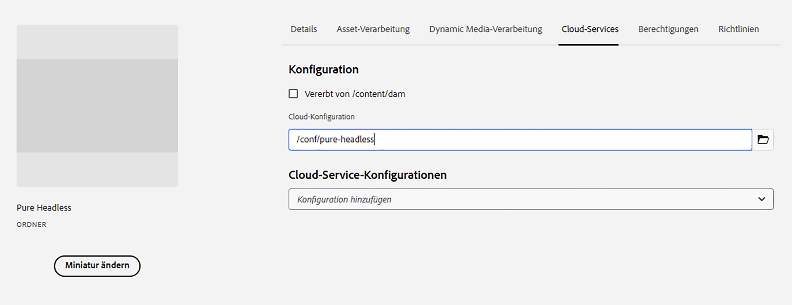

# Inhaltsmodellierung

Willkommen beim Tutorial-Kapitel zu Inhaltsfragmenten und GraphQL-Endpunkten in Adobe Experience Manager (AEM). Darin erfahren Sie, wie Sie in AEM Inhaltsfragmente nutzen, Fragmentmodelle erstellen und GraphQL-Endpunkte verwenden.

Inhaltsfragmente stellen einen strukturierten Ansatz für die kanalübergreifende Verwaltung von Inhalten bereit, der Flexibilität und Wiederverwendbarkeit bietet. Die Aktivierung von Inhaltsfragmenten in AEM ermöglicht die Erstellung modularer Inhalte, wodurch die Konsistenz und Anpassungsfähigkeit verbessert werden.

Zunächst werden Sie durch die Aktivierung von Inhaltsfragmenten in AEM geführt. Behandelt werden dabei die erforderlichen Konfigurationen und Einstellungen für eine nahtlose Integration.

Als Nächstes geht es um die Erstellung von Fragmentmodellen, die Struktur und Attribute definieren. Sie erfahren, wie Sie auf Ihre Inhaltsanforderungen abgestimmte Modelle entwerfen und effektiv verwalten.

Anschließend sehen Sie, wie Sie Inhaltsfragmente aus den Modellen erstellen, und Sie erhalten schrittweise Anleitungen zum Verfassen und Veröffentlichen.

Darüber hinaus beschäftigen wir uns mit der Definition von AEM GraphQL-Endpunkten. GraphQL ruft effizient Daten aus AEM ab. Wir richten Endpunkte ein und konfigurieren sie, um die gewünschten Daten bereitzustellen. Durch persistierte Abfragen werden Leistung und Caching optimiert.

Im gesamten Tutorial werden Erklärungen, Code-Beispiele und praktische Tipps bereitgestellt. Am Ende sind Sie in der Lage, Inhaltsfragmente zu aktivieren, Fragmentmodelle zu erstellen, Fragmente zu generieren und AEM GraphQL-Endpunkte sowie persistierte Abfragen zu definieren. Fangen wir an!

## Kontextsensitive Konfiguration

1. Navigieren Sie zu __Tools > Configuration Browser__, um eine Konfiguration für das Headless-Erlebnis zu erstellen.

   

   Geben Sie einen __Titel__ sowie einen __Namen__ an und aktivieren Sie __GraphQL-persistierte Abfragen__ und __Inhaltsfragmentmodelle__.


## Inhaltsfragmentmodelle

1. Navigieren Sie zu __Tools > Inhaltsfragmentmodelle__ und wählen Sie den Ordner mit dem Namen der in Schritt 1 erstellten Konfiguration aus.

   

1. Wählen Sie im Ordner die Option __Erstellen__ aus und geben Sie dem Modell den Namen __Teaser__. Fügen Sie die folgenden Datentypen zum Modell __Teaser__ hinzu.

   | Datentyp | Name | Erforderlich | Optionen |
   |----------|------|----------|---------|
   | Inhaltsreferenz | Asset | ja | Fügen Sie, sofern gewünscht, ein Standardbild hinzu, z. B. „/content/dam/wknd-headless/assets/AdobeStock_307513975.mp4“. |
   | Einzeilentext | Titel | ja |
   | Einzeilentext | Vortitel | nein |
   | Mehrzeilentext | Beschreibung | nein | Stellen Sie sicher, dass als Standardtyp „Rich-Text“ angegeben ist. |
   | Aufzählung | Stil | ja | Rendern Sie diesen Datentyp als Dropdown-Liste. Die Optionen sind „Hero“, „Hero und ausgewählt“ und „Ausgewählt“. |

   

1. Erstellen Sie im Ordner ein zweites Modell mit dem Namen __Angebot__. Klicken Sie auf „Erstellen“, geben Sie dem Modell den Namen „Angebot“ und fügen Sie die folgenden Datentypen hinzu:

   | Datentyp | Name | Erforderlich | Optionen |
   |----------|------|----------|---------|
   | Inhaltsreferenz | Asset | ja | Fügen Sie ein Standardbild hinzu, Z. B.: `/content/dam/wknd-headless/assets/AdobeStock_238607111.jpeg` |
   | Mehrzeilentext | Beschreibung | nein |  |
   | Mehrzeilentext | Artikel | nein |  |

   

1. Erstellen Sie im Ordner ein drittes Modell mit dem Namen __Bilderliste__. Klicken Sie auf „Erstellen“, geben Sie dem Modell den Namen „Bilderliste“ und fügen Sie die folgenden Datentypen hinzu:

   | Datentyp | Name | Erforderlich | Optionen |
   |----------|------|----------|---------|
   | Fragmentreferenz | Listenelemente | ja | Rendern als „Mehrere Felder“. Das zulässige Inhaltsfragmentmodell ist „Angebot“. |

   

## Inhaltsfragmente

1. Navigieren Sie nun zu „Assets“ und erstellen Sie einen Ordner für die neue Site. Klicken Sie auf „Erstellen“ und benennen Sie den Ordner.

   

1. Nachdem der Ordner erstellt wurde, wählen Sie den Ordner aus und öffnen Sie seine __Eigenschaften__.
1. Wählen Sie auf der Registerkarte __Cloud-Konfigurationen__ des Ordners die [zuvor erstellte](#enable-content-fragments-and-graphql) Konfiguration aus.

   

   Klicken Sie in den neuen Ordner und erstellen Sie einen Teaser. Klicken Sie auf __Erstellen__ und __Inhaltsfragment__ und wählen Sie das Modell __Teaser__ aus. Nennen Sie das Modell __Hero__ und klicken Sie auf __Erstellen__.

   | Name | Anmerkungen |
   |----------|------|
   | Asset | Behalten Sie den Standardwert bei oder wählen Sie ein anderes Asset (Video oder Bild) aus. |
   | Titel | `Explore. Discover. Live.` |
   | Vortitel | `Join use for your next adventure.` |
   | Beschreibung | Lassen Sie dieses Feld leer. |
   | Stil | `Hero` |

   

## GraphQL-Endpunkte

1. Navigieren Sie zu __Tools > GraphQL__.

   

1. Klicken Sie auf __Erstellen__, benennen Sie den neuen Endpunkt und wählen Sie die neu erstellte Konfiguration aus.

   

## GraphQL-persistierte Abfragen

1. Testen Sie nun den neuen Endpunkt. Navigieren Sie dazu zu __Tools > GraphQL-Abfrage-Editor__ und wählen Sie oben rechts im Fenster Ihren Endpunkt für die Dropdown-Liste aus.

1. Erstellen Sie im Abfrage-Editor verschiedene Abfragen.


   ```graphql
   {
       teaserList {
           items {
           title
           }
       }
   }
   ```

   Sie sollten eine Liste mit dem [oben](#create-content) erstellten Einzelfragment erhalten.

   Erstellen Sie für diese Übung eine vollständige Abfrage, die die AEM Headless-App nutzt. Erstellen Sie eine Abfrage, die einen einzelnen Teaser anhand des Pfads zurückgibt. Geben Sie im Abfrage-Editor die folgende Abfrage ein:

   ```graphql
   query TeaserByPath($path: String!) {
   component: teaserByPath(_path: $path) {
       item {
       __typename
       _path
       _metadata {
           stringMetadata {
           name
           value
           }
       }
       title
       preTitle
       style
       asset {
           ... on MultimediaRef {
           __typename
           _authorUrl
           _publishUrl
           format
           }
           ... on ImageRef {
           __typename
           _authorUrl
           _publishUrl
           mimeType
           width
           height
           }
       }
       description {
           html
           plaintext
       }
       }
   }
   }
   ```

   Geben Sie unten im Eingabefeld für die __Abfragevariablen__ Folgendes ein:

   ```json
   {
       "path": "/content/dam/pure-headless/hero"
   }
   ```

   >[!NOTE]
   >
   > Möglicherweise müssen Sie die Abfragevariable `path` basierend auf dem Ordner- und Fragmentnamen anpassen.


   Führen Sie die Abfrage aus, um die Ergebnisse des zuvor erstellten Inhaltsfragments zu erhalten.

1. Klicken Sie auf __Speichern__, um die Abfrage zu persistieren (speichern), und geben Sie der Abfrage den Namen __Teaser__. Dadurch können Sie auf die Abfrage anhand des Namens in der Anwendung verweisen.

## Nächste Schritte

Herzlichen Glückwunsch! Sie haben erfolgreich AEM as a Cloud Service konfiguriert, um die Erstellung von Inhaltsfragmenten und GraphQL-Endpunkten zu ermöglichen. Sie haben auch ein Inhaltsfragmentmodell und ein Inhaltsfragment erstellt sowie einen GraphQL-Endpunkt und eine persistierte Abfrage definiert. Sie können jetzt zum nächsten Tutorial-Kapitel weitergehen. Darin erfahren Sie, wie Sie eine AEM Headless-React-Anwendung erstellen, die die in diesem Kapitel erstellten Inhaltsfragmente und GraphQL-Endpunkte verwendet.

[Nächstes Kapitel: AEM Headless-APIs und React](./2-aem-headless-apis-and-react.md)
