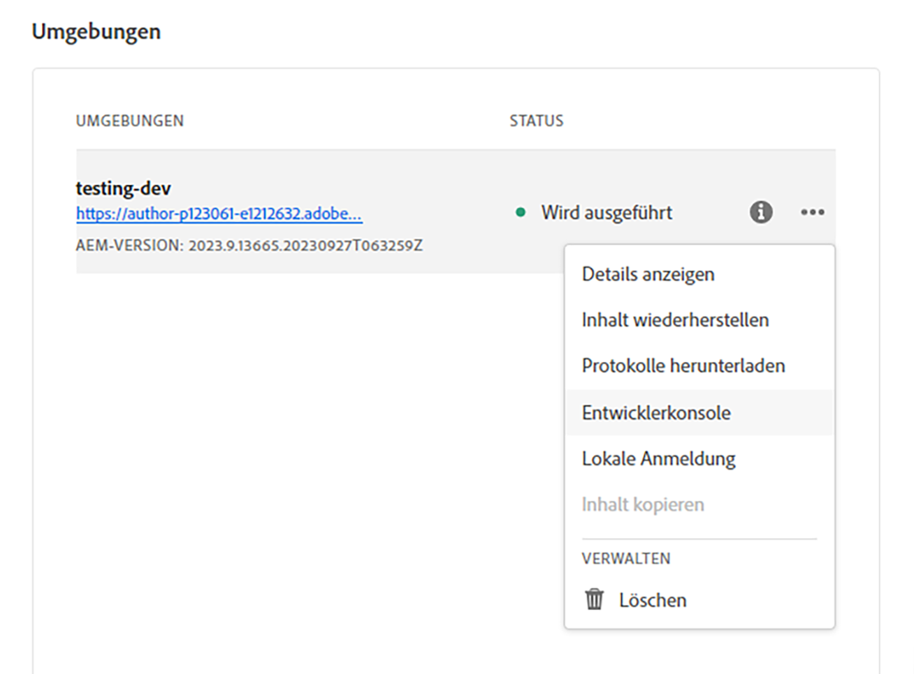

# AEM Headless-APIs und React

Willkommen in diesem Tutorial-Kapitel, in dem wir die Konfiguration einer React-App für das Verbinden mit Adobe Experience Manager (AEM) Headless-APIs mithilfe des AEM Headless-SDK untersuchen. Wir behandeln das Abrufen von Inhaltsfragmentdaten aus den GraphQL-APIs von AEM und deren Anzeige in der React-App.

AEM Headless-APIs ermöglichen den Zugriff auf AEM-Inhalte von jeder Client-App aus. Wir führen Sie durch die Konfiguration Ihrer React-App für das Verbinden mit AEM Headless-APIs mithilfe des AEM Headless-SDK.  Durch dieses Setup wird ein wiederverwendbarer Kommunikationskanal zwischen Ihrer React-App und AEM eingerichtet.

Als Nächstes verwenden wir das AEM Headless-SDK, um Inhaltsfragmentdaten aus AEM GraphQL-APIs abzurufen. Inhaltsfragmente in AEM bieten ein strukturiertes Content Management. Mithilfe des AEM Headless-SDK können Sie Inhaltsfragmentdaten mithilfe von GraphQL einfach abfragen und abrufen.

Sobald wir über die Inhaltsfragmentdaten verfügen, werden wir sie in Ihre React-App integrieren. Sie werden lernen, die Daten in ansprechender Weise zu formatieren und anzuzeigen. Wir werden Best Practices für die Handhabung und Darstellung von Inhaltsfragmentdaten in React-Komponenten behandeln und so eine nahtlose Integration mit der Benutzeroberfläche Ihrer App sicherstellen.

Im gesamten Tutorial werden Erklärungen, Code-Beispiele und praktische Tipps bereitgestellt. Am Ende werden Sie in der Lage sein, Ihre React-App so zu konfigurieren, dass sie eine Verbindung zu AEM Headless-APIs herstellt, Inhaltsfragmentdaten mit dem AEM Headless-SDK abruft und diese nahtlos in Ihrer React-App anzeigt.  Fangen wir an!


## Klonen der React-App

1. Klonen Sie die App von [Github](https://github.com/lamontacrook/headless-first/tree/main), indem Sie den folgenden Befehl in der Befehlszeile ausführen:

   ```
   $ git clone git@github.com:lamontacrook/headless-first.git
   ```

1. Wechseln Sie in das Verzeichnis `headless-first` und installieren Sie die Abhängigkeiten.

   ```
   $ cd headless-first
   $ npm ci
   ```

## Konfigurieren der React-App

1. Erstellen Sie eine Datei mit dem Namen `.env` im Stammverzeichnis des Projekts. Legen Sie in `.env` die folgenden Werte fest:

   ```
   REACT_APP_AEM=<URL of the AEM instance>
   REACT_APP_ENDPOINT=<the name of the endpoint>
   REACT_APP_PROJECT=<the name of the folder with Content Fragments>
   REACT_APP_TOKEN=<developer token>
   ```

1. Sie können ein Entwicklungs-Token in Cloud Manager abrufen. Melden Sie sich bei [Adobe Cloud Manager](https://experience.adobe.com/) an.  Klicken Sie auf __Experience Manager > Cloud Manager__.  Wählen Sie das entsprechende Programm aus und klicken Sie dann auf die Auslassungspunkte neben der Umgebung.

   

   1. Klicken Sie auf die Registerkarte __Integrationen__.
   1. Klicken Sie auf die Registerkarte __„Lokales Token“ und die Schaltfläche „Lokales Entwicklungs-Token abrufen“__.
   1. Kopieren Sie das Zugriffs-Token, das nach dem öffnenden Anführungszeichen beginnt, bis vor dem schließenden Anführungszeichen.
   1. Fügen Sie das kopierte Token als Wert für `REACT_APP_TOKEN` in die Datei `.env` ein.
   1. Erstellen wir nun die App, indem wir `npm ci` in der Befehlszeile ausführen.
   1. Starten Sie nun die React-App, indem Sie `npm run start` in der Befehlszeile ausführen.
   1. In [./src/utils](https://github.com/lamontacrook/headless-first/tree/main/src/utils) gibt es eine Datei namens `context.js`, die den Code enthält, um die Werte in der Datei `.env` in den Kontext der App zu setzen.

## Ausführen der React-App

1. Starten Sie die React-App, indem Sie `npm run start` in der Befehlszeile ausführen.

   ```
   $ npm run start
   ```

   Die React-App wird gestartet und öffnet ein Browser-Fenster zu `http://localhost:3000`.  Änderungen an der React-App werden im Browser automatisch neu geladen.

## Verbinden zu AEM Headless-APIs

1. Um die React-App mit AEM as a Cloud Service zu verbinden, fügen wir ein paar Dinge hinzu `App.js`. Fügen Sie dem `React`-Import `useContext` hinzu.

   ```javascript
   import React, {useContext} from 'react';
   ```

   Importieren Sie `AppContext` aus der Datei `context.js`.

   ```javascript
   import { AppContext } from './utils/context';
   ```

   Definieren Sie jetzt im App-Code eine Kontextvariable.

   ```javascript
   const context = useContext(AppContext);
   ```

   Und zum Schluss schließen Sie den Rückgabe-Code in `<AppContext.Provider> ... </AppContext.Provider>` ein.

   ```javascript
   ...
   return(<div className='App'>
       <AppContext.Provider value={context}>
           ...
       </AppContext.Provider>
   </div>);
   ```

   Als Referenz: `App.js` sollte jetzt wie folgt aussehen.

   ```javascript
   import React, {useContext} from 'react';
   import './App.css';
   import { BrowserRouter, Routes, Route } from 'react-router-dom';
   import Home from './screens/home/home';
   import { AppContext } from './utils/context';
   
   const App = () => {
   const context = useContext(AppContext);
   return (
       <div className='App'>
       <AppContext.Provider value={context}>
           <BrowserRouter>
           <Routes>
               <Route exact={true} path={'/'} element={<Home />} />
           </Routes>
           </BrowserRouter>
       </AppContext.Provider>
       </div>
   );
   };
   
   export default App;
   ```

1. Importieren Sie das `AEMHeadless`-SDK. Dieses SDK ist eine Hilfsbibliothek, die von der App zur Interaktion mit AEM Headless-APIs verwendet wird.

   Fügen Sie diese Importanweisung zu `home.js` hinzu.

   ```javascript
   import AEMHeadless from '@adobe/aem-headless-client-js';
   ```

   Fügen Sie die folgende `{ useContext, useEffect, useState }` zu der ` React`-Importanweisung hinzu.

   ```javascript
   import React, { useContext, useEffect, useState } from 'react';
   ```

   Importieren Sie `AppContext`.

   ```javascript
   import { AppContext } from '../../utils/context';
   ```

   Holen Sie innerhalb der Komponente `Home` die Variable `context` aus `AppContext`.

   ```javascript
   const Home = () => {
   const context = useContext(AppContext);
   ...
   }
   ```

1. Initialisieren Sie das AEM Headless-SDK innerhalb von `useEffect()`, da sich das AEM Headless SDK ändern muss, wenn sich die Variable `context` ändert.

   ```javascript
   useEffect(() => {
   const sdk = new AEMHeadless({
       serviceURL: context.url,
       endpoint: context.endpoint,
       auth: context.token
   });
   }, [context]);  
   ```

   >[!NOTE]
   >
   > Es gibt eine `context.js`-Datei unter `/utils`, die Elemente aus der `.env`-Datei liest.  Zur Referenz: `context.url` dient als URL für die AEM as a Cloud Service-Umgebung. `context.endpoint` ist der vollständige Pfad zu dem in der vorherigen Lektion erstellten Endpunkt.  Schließlich ist `context.token` das Entwickler-Token.


1. Erstellen Sie einen React-Status, der die Inhalte aus dem AEM Headless-SDK verfügbar macht.

   ```javascript
   const Home = () => {
   const [content, setContent] = useState({});
   ...
   }
   ```

1. Verbinden Sie die App mit AEM. Verwenden Sie die in der vorherigen Lektion erstellte persistierte Abfrage. Fügen wir nun den folgenden Code innerhalb von `useEffect` hinzu, nachdem das AEM Headless-SDK initialisiert wurde. Machen Sie die Variable `useEffect` von der Variable `context` abhängig, wie im Folgenden beschrieben.


   ```javascript
   useEffect(() => {
   ...
   sdk.runPersistedQuery('<name of the endpoint>/<name of the persisted query>', { path: `/content/dam/${context.project}/<name of the teaser fragment>` })
       .then(({ data }) => {
       if (data) {
           setContent(data);
       }
       })
       .catch((error) => {
       console.log(`Error with pure-headless/teaser. ${error.message}`);
       });
   }, [context]);
   ```

1. Öffnen Sie die Netzwerkansicht der Entwickler-Tools, um die GraphQL-Anfrage zu überprüfen.

   `<url to environment>/graphql/execute.json/pure-headless/teaser%3Bpath%3D%2Fcontent%2Fdam%2Fpure-headless%2Fhero`

   

   Das AEM Headless-SDK codiert die Anfrage für GraphQL und fügt die bereitgestellten Parameter hinzu. Sie können die Anfrage im Browser öffnen.

   >[!NOTE]
   >
   > Da die Anfrage in die Authoring-Umgebung geleitet wird, müssen Sie in einer anderen Registerkarte desselben Browsers bei der Umgebung angemeldet sein.


## Rendern von Inhaltsfragmentinhalten

1. Öffnen Sie die Inhaltsfragmente in der App. Lassen Sie ein `<div>` mit dem Titel des Teasers zurückgeben.

   ```javascript
   return (
   <div className='main-body'>
       <div>{content.component && (content.component.item.title)}</div>
   </div>
   );
   ```

   Das Titelfeld des Teasers sollte auf dem Bildschirm angezeigt werden.

1. Der letzte Schritt besteht darin, den Teaser zur Seite hinzuzufügen. Eine React-Teaser-Komponente ist im Paket enthalten. Schließen wir zunächst den Import ein. Fügen Sie dazu am Anfang der Datei `home.js` die folgende Zeile hinzu:

   `import Teaser from '../../components/teaser/teaser';`

   Aktualisieren Sie die return-Anweisung:

   ```javascript
   return (
   <div className='main-body'>
       <div>{content.component && <Teaser content={content.component.item} />}</div>
   </div>
   );
   ```

   Sie sollten nun den Teaser mit dem im Fragment enthaltenen Inhalt sehen.


## Nächste Schritte

Herzlichen Glückwunsch! Sie haben die React-App erfolgreich aktualisiert, um sie mithilfe des AEM Headless-SDK in AEM Headless-APIs zu integrieren.

Als Nächstes erstellen wir eine komplexere Bildlisten-Komponente, die referenzierte Inhaltsfragmente dynamisch aus AEM rendert.

[Nächstes Kapitel: Erstellen einer Bildlisten-Komponente](./3-complex-components.md)
