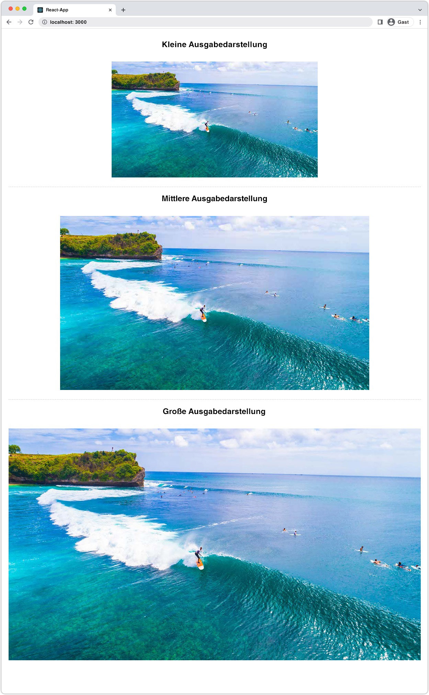

# Bilder mit AEM Headless {#images-with-aem-headless}

Bilder sind ein wichtiger Aspekt von [Entwickeln umfassender, überzeugender AEM Headless-Erlebnisse](https://experienceleague.adobe.com/docs/experience-manager-learn/getting-started-with-aem-headless/graphql/multi-step/overview.html?lang=de). AEM Headless unterstützt die Verwaltung von Bild-Assets und deren optimierte Bereitstellung.

Inhaltsfragmente, die bei AEM Headless-Inhaltsmodellierung verwendet werden, verweisen häufig auf Bild-Assets, die für die Anzeige im Headless-Erlebnis vorgesehen sind. AEM GraphQL-Abfragen können geschrieben werden, um URLs zu Bildern bereitzustellen, die darauf basieren, von wo aus das Bild referenziert wird.

Die `ImageRef` Der Typ verfügt über drei URL-Optionen für Inhaltsverweise:

+ `_path` ist der referenzierte Pfad in AEM und enthält keine AEM Herkunft (Hostname)
+ `_authorUrl` ist die vollständige URL zum Bild-Asset in der AEM-Autoreninstanz
   + [AEM-Autor](https://experienceleague.adobe.com/docs/experience-manager-learn/cloud-service/underlying-technology/introduction-author-publish.html) kann verwendet werden, um eine Vorschau der Headless-Anwendung bereitzustellen.
+ `_publishUrl` ist die vollständige URL zum Bild-Asset auf AEM Publish
   + [AEM-Veröffentlichung](https://experienceleague.adobe.com/docs/experience-manager-learn/cloud-service/underlying-technology/introduction-author-publish.html) In der Regel zeigt die Produktionsimplementierung der Headless-Anwendung Bilder von an.

Die Verwendung der Felder erfolgt am besten nach folgenden Kriterien:

| ImageRef-Felder | Von AEM bereitgestellte Client-Webanwendung | Client-App-Abfragen AEM Author | Client-App-Abfragen AEM Publish |
|--------------------|:------------------------------:|:-----------------------------:|:------------------------------:|
| `_path` | ms | (App muss Host in URL angeben) | (App muss Host in URL angeben) |
| `_authorUrl` | ✘ | ✔ | ✘ |
| `_publishUrl` | ✘ | ✘ | ✔ |

Verwendung von `_authorUrl` und `_publishUrl` sollte an dem AEM GraphQL-Endpunkt ausgerichtet sein, der für die Quelle der GraphQL-Antwort verwendet wird.

>[!CONTEXTUALHELP]
>id="aemcloud_learn_headless_graphql_images"
>title="Bilder mit AEM Headless"
>abstract="Erfahren Sie, wie AEM Headless die Verwaltung von Bild-Assets und deren optimierte Bereitstellung unterstützt."

## Inhaltsfragmentmodell

Stellen Sie sicher, dass das Inhaltsfragment-Feld, das die Bildreferenz enthält, aus dem __Inhaltsreferenz__ Datentyp.

Feldtypen werden im Abschnitt [Inhaltsfragmentmodell](https://experienceleague.adobe.com/docs/experience-manager-cloud-service/content/assets/content-fragments/content-fragments-models.html), indem Sie das Feld auswählen und die __Eigenschaften__ rechts.


## Persistente GraphQL-Abfrage

Geben Sie in der GraphQL-Abfrage das Feld als `ImageRef` Typ eingeben und die entsprechenden Felder anfordern `_path`, `_authorUrl`oder `_publishUrl` erforderlich sind. Beispielsweise können Sie ein Abenteuer im [WKND-Site-Projekt](https://github.com/adobe/aem-guides-wknd) , einschließlich der Bild-URL für Bild-Asset-Verweise in `primaryImage` -Feld kann mit einer neuen persistenten Abfrage durchgeführt werden `wknd-shared/adventure-image-by-path` definiert als:

```graphql
query ($path: String!) {
  adventureByPath(_path: $path) {
    item {
      title,
      primaryImage {
        ... on ImageRef {
          _path
          _authorUrl
          _publishUrl
        }
      }
    }
  }
}
```

Die `$path` in der Variablen `_path` Der Filter erfordert den vollständigen Pfad zum Inhaltsfragment (z. B. `/content/dam/wknd-shared/en/adventures/bali-surf-camp/bali-surf-camp`).

## GraphQL-Antwort

Die resultierende JSON-Antwort enthält die angeforderten Felder, die die URLs zu den Bild-Assets enthalten.

```json
{
  "data": {
    "adventureByPath": {
      "item": {
        "adventurePrimaryImage": {
          "_path": "/content/dam/wknd-shared/en/adventures/bali-surf-camp/adobestock-175749320.jpg",
          "_authorUrl": "https://author-p123-e456.adobeaemcloud.com/content/dam/wknd-shared/en/adventures/bali-surf-camp/adobestock-175749320.jpg",
          "_publishUrl": "https://publish-p123-e789.adobeaemcloud.com/content/dam/wknd-shared/en/adventures/bali-surf-camp/adobestock-175749320.jpg"
        }
      }
    }
  }
}
```

Verwenden Sie das entsprechende Feld, um das referenzierte Bild in Ihre Anwendung zu laden. `_path`, `_authorUrl`oder `_publishUrl` des `adventurePrimaryImage` als Quell-URL des Bildes.

Die Domänen der `_authorUrl` und `_publishUrl` werden automatisch von AEM as a Cloud Service mithilfe der Variablen [Externalizer](https://experienceleague.adobe.com/docs/experience-manager-cloud-service/content/implementing/developer-tools/externalizer.html).

In React sieht die Anzeige des Bildes aus AEM Publish wie folgt aus:

```html

```

## Bildausgabedarstellungen

Bild-Assets unterstützen anpassbare [Ausgabeformate](../../../assets/authoring/renditions.md), die alternative Darstellungen des ursprünglichen Assets sind. Benutzerdefinierte Ausgabeformate können bei der Optimierung eines Headless-Erlebnisses helfen. Anstatt das ursprüngliche Bild-Asset anzufordern, bei dem es sich häufig um eine große, hochauflösende Datei handelt, können optimierte Ausgabedarstellungen von der Headless-Anwendung angefordert werden.

### Erstellen von Ausgabedarstellungen

AEM Assets-Administratoren definieren die benutzerdefinierten Ausgabedarstellungen mithilfe von Verarbeitungsprofilen. Die Verarbeitungsprofile können dann direkt auf bestimmte Ordnerbäume oder Assets angewendet werden, um die Ausgabedarstellungen für diese Assets zu generieren.

#### Verarbeitungsprofile

Asset-Ausgabedarstellungsspezifikationen werden in definiert. [Verarbeitungsprofile](../../../assets/configuring/processing-profiles.md) von AEM Assets-Administratoren.

Erstellen oder aktualisieren Sie ein Verarbeitungsprofil und fügen Sie Ausgabedefinitionen für die Bildgrößen hinzu, die für die Headless-Anwendung erforderlich sind. Ausgabedarstellungen können beliebig benannt werden, sollten jedoch semantisch benannt werden.


In diesem Beispiel werden drei Ausgabedarstellungen erstellt:

| Name des Ausgabeformats | Erweiterung | Max. Breite |
|-----------------------|:---------:|----------:|
| web-optimized-large | webp | 1200px |
| web-optimized-medium | webp | 900px |
| web-optimized-small | webp | 600px |

Die in der obigen Tabelle aufgeführten Attribute sind wichtig:

+ __Name des Ausgabeformats__ wird verwendet, um die Ausgabedarstellung anzufordern.
+ __Erweiterung__ ist die Erweiterung, die zum Anfordern der __Name der Ausgabedarstellung__. Voreinstellen `webp` Ausgabeformate, da diese für die Webbereitstellung optimiert sind.
+ __Max. Breite__ wird verwendet, um den Entwickler darüber zu informieren, welche Ausgabedarstellung basierend auf ihrer Verwendung in der Headless-Anwendung verwendet werden soll.

Ausgabedarstellungsdefinitionen hängen von den Anforderungen Ihrer Headless-Anwendung ab. Stellen Sie daher sicher, dass Sie den optimalen Ausgabedarstellungssatz für Ihren Anwendungsfall definieren und hinsichtlich der Verwendung semantisch benannt werden.

#### Assets erneut verarbeiten{#reprocess-assets}

Nachdem das Verarbeitungsprofil erstellt (oder aktualisiert) wurde, verarbeiten Sie die Assets erneut, um die neuen, im Verarbeitungsprofil definierten Ausgabedarstellungen zu generieren. Neue Ausgabedarstellungen sind nicht vorhanden, bis Assets mit dem Verarbeitungsprofil verarbeitet werden.

+ nach Möglichkeit [das Verarbeitungsprofil einem Ordner zugewiesen hat](../../../assets/configuring//processing-profiles.md) sodass alle neuen Assets, die in diesen Ordner hochgeladen wurden, automatisch die Ausgabedarstellungen generieren. Bestehende Assets müssen mithilfe des unten stehenden Ad-hoc-Ansatzes erneut verarbeitet werden.

+ Oder Ad-hoc-Analysen, indem Sie einen Ordner oder ein Asset auswählen und __Assets erneut verarbeiten__ und wählen Sie den neuen Namen des Verarbeitungsprofils aus.

   

#### Wiedergaben überprüfen

Ausgabedarstellungen können durch [Öffnen der Ausgabeformatansicht eines Assets](../../../assets/authoring/renditions.md)und wählen Sie die neuen Ausgabedarstellungen für die Vorschau in der Ausgabedarstellungsleiste aus. Wenn die Ausgabeformate fehlen, [Sicherstellen, dass die Assets mithilfe des Verarbeitungsprofils verarbeitet werden](#reprocess-assets).


#### Veröffentlichen von Assets

Stellen Sie sicher, dass die Assets mit den neuen Ausgabeformaten [(erneut) veröffentlicht](../../../assets/sharing/publish.md) sodass die neuen Ausgabedarstellungen auf AEM Publish verfügbar sind.

### Zugreifen auf Ausgabedarstellungen

Auf Ausgabedarstellungen können Sie direkt zugreifen, indem Sie die __Ausgabedarstellungsnamen__ und __Ausgabedarstellungs-Erweiterungen__ definiert im Verarbeitungsprofil die URL des Assets.

| Asset-URL | Unterpfad für Ausgabedarstellungen | Name des Ausgabeformats | Ausgabedarstellungserweiterung |  | Ausgabedarstellungs-URL |
|-----------|:------------------:|:--------------:|--------------------:|:--:|---|
| https://publish-p123-e789.adobeaemcloud.com/content/dam/example.jpeg | /_jcr_content/renditions/ | web-optimized-large | .webp | → | https://publish-p123-e789.adobeaemcloud.com/content/dam/example.jpeg/_jcr_content/renditions/web-optimized-large.webp |
| https://publish-p123-e789.adobeaemcloud.com/content/dam/example.jpeg | /_jcr_content/renditions/ | web-optimized-medium | .webp | → | https://publish-p123-e789.adobeaemcloud.com/content/dam/example.jpeg/_jcr_content/renditions/web-optimized-medium.webp |
| https://publish-p123-e789.adobeaemcloud.com/content/dam/example.jpeg | /_jcr_content/renditions/ | web-optimized-small | .webp | → | https://publish-p123-e789.adobeaemcloud.com/content/dam/example.jpeg/_jcr_content/renditions/web-optimized-small.webp |

{style=&quot;table-layout:auto&quot;}

### GraphQL-Abfrage{#renditions-graphl-query}

AEM GraphQL benötigt eine zusätzliche Syntax, um Bildausgabeformate anzufordern. Stattdessen [Bilder werden abgefragt](#images-graphql-query) auf die übliche Weise festgelegt und die gewünschte Ausgabedarstellung im Code angegeben wird. Es ist wichtig, [Stellen Sie sicher, dass die von der Headless-Anwendung verwendeten Bild-Assets über die gleichen benannten Ausgabeformate verfügen.](#reprocess-assets).

### React-Beispiel

Erstellen wir eine einfache React-Anwendung, die drei Ausgabeformate eines einzelnen Bild-Assets anzeigt: Web-optimierte kleine, Web-optimierte, mittlere und Web-optimierte große.



#### Bildkomponente erstellen{#react-example-image-component}

Erstellen Sie eine React-Komponente, die die Bilder rendert. Diese Komponente akzeptiert vier Eigenschaften:

+ `assetUrl`: Die Bild-Asset-URL, wie in der Antwort der GraphQL-Abfrage angegeben.
+ `renditionName`: Der Name der zu ladenden Ausgabedarstellung.
+ `renditionExtension`: Die Erweiterung der zu ladenden Ausgabedarstellung.
+ `alt`: Der Alt-Text für das Bild; Zugänglichkeit ist wichtig!

Diese Komponente erstellt die [Ausgabedarstellungs-URL mit dem in __Zugreifen auf Ausgabedarstellungen__](#access-renditions). Ein `onError` -Handler festgelegt ist, um das ursprüngliche Asset in dem Fall anzuzeigen, dass die Ausgabedarstellung fehlt.

In diesem Beispiel wird die ursprüngliche Asset-URL als Fallback in der `onError` -Handler, im -Ereignis fehlt eine Ausgabedarstellung.

```javascript
// src/Image.js

export default function Image({ assetUrl, renditionName, renditionExtension, alt }) {
  // Construct the rendition Url in the format:
  //   <ASSET URL>/_jcr_content/renditions<RENDITION NAME>.<RENDITION EXTENSION>
  const renditionUrl = `${assetUrl}/_jcr_content/renditions/${renditionName}.${renditionExtension}`;

  // Load the original image asset in the event the named rendition is missing
  const handleOnError = (e) => { e.target.src = assetUrl; }

  return (
    <>
      
    </>
  );
}
```

#### Definieren Sie die `App.js`{#app-js}

Diese einfache `App.js` -Abfragen nach einem Abenteuer-Bild AEM und zeigen dann die drei Ausgabeformate dieses Bildes an: web-optimized-small, web-optimized-medium und web-optimized-large.

Die Abfrage gegen AEM wird im benutzerdefinierten React-Haken durchgeführt [useAdventureByPath , der das AEM Headless SDK verwendet](./aem-headless-sdk.md#graphql-persisted-queries).

Die Ergebnisse der Abfrage und die spezifischen Ausgabeparameter werden an die [Bildreaktionskomponente](#react-example-image-component).

```javascript
// src/App.js

import "./App.css";
import { useAdventureByPath } from './api/persistedQueries'
import Image from "./Image";

function App() {

  // Get data from AEM using GraphQL persisted query as defined above 
  // The details of defining a React useEffect hook are explored in How to > AEM Headless SDK
  let { data, error } = useAdventureByPath("/content/dam/wknd-shared/en/adventures/bali-surf-camp/bali-surf-camp");

  // Wait for GraphQL to provide data
  if (!data) { return <></> }

  return (
    <div className="app">
      
      <h2>Small rendition</h2>
      {/* Render the web-optimized-small rendition for the Adventure Primary Image */}
      <Image
        assetUrl={data.adventureByPath.item.primaryImage._publishUrl}
        renditionName="web-optimized-small"
        renditionExtension="webp"
        alt={data.adventureByPath.item.title}
      />

      <hr />

      <h2>Medium rendition</h2>
      {/* Render the web-optimized-medium rendition for the Adventure Primary Image */}
      <Image
        assetUrl={data.adventureByPath.item.primaryImage._publishUrl}
        renditionName="web-optimized-medium"
        renditionExtension="webp"
        alt={data.adventureByPath.item.title}
      />

      <hr />

      <h2>Large rendition</h2>
      {/* Render the web-optimized-large rendition for the Adventure Primary Image */}
      <Image
        assetUrl={data.adventureByPath.item.primaryImage._publishUrl}
        renditionName="web-optimized-large"
        renditionExtension="webp"
        alt={data.adventureByPath.item.title}
      />
    </div>
  );
}

export default App;
```
